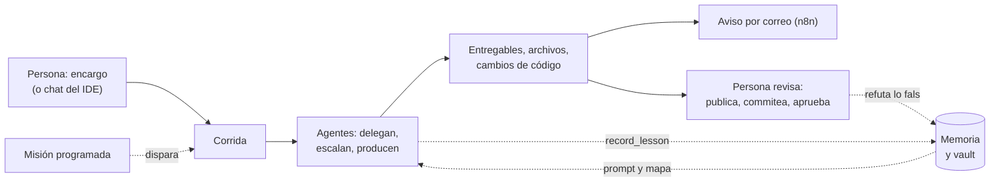

# Visión del producto

## Qué es

Una herramienta para **modelar una empresa completa con agentes LLM y verla
operar**. Configurás áreas, roles, herramientas y políticas —o elegís un equipo
de plantilla—; le das un encargo; y mirás cómo los agentes se escriben entre sí,
delegan, escalan, piden aprobación y producen **entregables reales**: un Word,
un PDF, un video narrado, un deck, un cambio de código en tu repo, un barrido de
QA sobre tu app en tu teléfono. Con el costo a la vista y un tope que corta solo.

Corre **local, para una persona**, sin infraestructura más allá de los
proveedores LLM y los servidores MCP que conectes. Todo lo que produce queda en
una carpeta legible por proyecto (`data/proyectos/<Nombre>/`).

## Qué NO es

- **No es un chat con un agente.** Son varios agentes que no comparten contexto
  y se comunican por mensajería, como una organización. (El chat del IDE existe,
  y por dentro es una corrida con un solo rol.)
- **No es un framework para programadores.** Una empresa se arma desde la UI, de
  una plantilla o de un JSON exportable ([[Modelo de dominio|blueprint]]).
- **No es multiusuario ni un servicio en la nube.** Ver [[Estado del producto]].
- **No es autónomo de punta a punta.** Lo que sale de la empresa —publicar un
  archivo, commitear y publicar código, ejecutar algo sensible, conectar un
  servidor— lo decide una persona.

## Las cinco ideas que lo definen

### 1. Los agentes no comparten contexto, y la jerarquía vive en el código

Cada rol tiene bandeja propia y sólo sabe lo que le escriben. Toda la
coordinación pasa por herramientas (`send_message`, `reply`, `assign_task`,
`escalate`, `request_approval`, `write_artifact`…), y **los frenos viven en el
ejecutor, no en el prompt**: un agente puede ignorar una instrucción, no el
código de su herramienta. Un ejecutor que quiere asignarle una tarea a su jefe
recibe el error y la lista de su equipo real. Ver [[Coordinación entre agentes]]
y [[Organización de agentes]].

### 2. La empresa produce archivos y cambios, no párrafos

El resultado no es texto en pantalla: documentos con portada y numeración
([[Documentos Word y PDF]]), videos en tres motores que comparten el reloj
([[Producción audiovisual]]), decks de un solo archivo, cambios de código en una
sesión que la persona revisa y publica ([[Trabajo con código]]), builds de
Android verificados ([[Build de producción Android]]).

### 3. Todo paso es visible

El motor emite un evento por cada cosa que ocurre, el servidor lo persiste y lo
reemite por SSE, y la UI **deriva su estado de la traza**. "Ver en vivo" y
"retroceder en el timeline" son la misma operación con otro corte. Y
`check_activity` muestra lo que un agente **hizo**, no lo que contó. Ver
[[Observabilidad y trazas]].

### 4. La empresa aprende, pero con evidencia

Lo corto que aprende viaja en el prompt de cada turno; lo largo vive en un vault
de Obsidian por empresa que se abre cuando hace falta. Una lección exige
evidencia, confirmarla exige otro autor, y refutarla no la borra. Ver
[[Memoria de la empresa]], [[Vault de contexto]] y
[[ADR-015 Una lección exige evidencia y refutar no borra]].

### 5. Usa lo que ya está en la máquina, y la persona decide lo que sale

ffmpeg, Kokoro, el Chrome instalado, `sandbox-exec`, adb y scrcpy, las
suscripciones de Claude y opencode por sus CLI. Lo que no está degrada con un
aviso claro en vez de romper. Y el último eslabón de cada circuito es humano:
publicar ([[ADR-008 Publicar lo decide una persona]]), commitear
([[ADR-010 Los agentes no commitean y la persona publica]]), aprobar
([[ADR-014 Aprobar una herramienta la ejecuta]]).

## El circuito completo

## Por qué existe cada freno

| Freno | Qué evita |
|---|---|
| presupuesto evaluado antes de cada turno e iteración | que una corrida se coma el saldo |
| presión de cierre y confirmación del responsable | pedirse datos entre sí hasta morir sin entregable |
| cada rol una vez por ciclo | el ida y vuelta infinito dentro de un ciclo |
| `send_message` no deja insistir | diez mensajes a la misma persona |
| corte al que repite una llamada fallida | un error irresoluble comiendo el turno |
| corte por tiempo en toda llamada de red | un proveedor mudo colgando la corrida |
| topes a lo que entra en un turno delegado | contexto cuadrático bajo suscripción |
| sandbox y allowlist en los comandos | que "correr los tests" sea correr cualquier cosa |
| QA móvil sólo por texto y sólo en staging | tocar a ciegas o crear datos reales |

Ver [[Costos y presupuesto]], [[Motor de agentes]] y [[Invariantes de arquitectura]].

## Ver también

- [[Problema y público]] — a quién le sirve
- [[Estado del producto]] — qué está verificado y qué no
- [[Hoja de ruta]] — lo que falta y lo descartado
- [[Arquitectura general]] · [[Casos de uso]]
