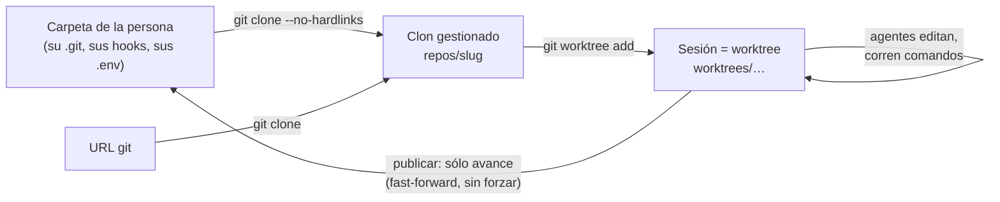

# ADR-009 Programar sobre un clon gestionado y un worktree

**Estado:** aceptada · afinada: la sesión trabaja en la rama del proyecto, no en una inventada (ver abajo y [[ADR-010 Los agentes no commitean y la persona publica]])

## Contexto

Desde septiembre de 2026 una empresa puede programar. Una persona carga código
desde la pestaña Código —una ruta local o una URL git— y un equipo de agentes lo
lee, lo edita, corre sus tests y propone cambios. El código es de ella: su
carpeta, su `.git`, sus hooks, sus ramas y sus `.env`.

Dos requisitos tiran en direcciones opuestas:

- los agentes necesitan un **árbol real**: editar archivos, correr `npm test`,
  ver un diff, levantar la vista previa;
- nada de lo que hagan puede **escribir en la carpeta de la persona** hasta que
  ella lo decida.

## Decisión

Cada repo cargado se **clona** a una carpeta del orquestador, y el equipo
trabaja en un **worktree** de ese clon.

- **Clon gestionado** en `data/proyectos/<Nombre>/repos/<slug>`
  (`RepoStore.rutaClon`), hecho con `git clone --no-hardlinks
  --no-recurse-submodules` desde la carpeta de la persona o desde la URL
  (`RepoStore.cargar`). La URL pasa antes por `validarUrlGit`.
- **La sesión es un worktree**, uno por repo, guardado en `sesiones_codigo` y
  **sobrevive a la corrida** como las tareas heredadas (`RepoStore.abrirSesion`,
  idempotente).
- **La sesión trabaja en la rama del proyecto** (`dev` en INSPIA). El clon
  suelta esa rama —queda en HEAD desprendido, mismos archivos— porque git no
  deja una rama abierta en dos carpetas (`RepoStore.soltarRamaDelClon`), y la
  adelanta hasta la de la persona antes de abrirla. Las ramas `orq/<fecha>-<id>`
  quedan sólo para repos creados por la empresa y copias sin git, que no tienen
  una rama de afuera que respetar (`RepoStore.usaRamaDelProyecto`). Una sesión
  vieja en `orq/…` sin trabajo propio se pasa sola a la rama del proyecto
  (`alinearConLaRamaDelProyecto`); con trabajo, se decide desde el panel.
- **Los secretos no entran al clon**: `.git/info/exclude` deja afuera `.env`,
  `.env.*`, `*.pem`, `*.key`, `node_modules/`, `dist/`, `build/`, `.next/`,
  `coverage/` y otros (`EXCLUIDOS`, `escribirExcluidos`). Sin eso el commit base
  se llevaba los secretos y los agentes los podían leer.
- **Una carpeta sin git se copia** y la copia se versiona en `data/`: a la
  carpeta de la persona no se le hace `git init`. La copia salta lo regenerable
  y lo pesado (`NO_SE_COPIA`: `node_modules`, `.git`, `dist`…; archivos de más
  de 5 MB, `MAX_ARCHIVO_COPIADO`).
- **Una subcarpeta de un repo más grande se trabaja como copia de esa
  carpeta**: la persona señaló esa carpeta, no el repo que la contiene.
- **Git siempre con `--git-dir` explícito**, calculado desde el clon
  (`RepoStore.gitDirDe`): el `.git` de un worktree es un archivo de texto que
  cualquier cosa que corra adentro puede reescribir para apuntar a otro repo.
  El resto del endurecimiento está en [[Git endurecido]].

Integrar hacia la carpeta de la persona es **sólo avance**: fast-forward de su
rama o `rama:rama` sin `+`, que git acepta únicamente si avanza
(`integrarRamaPropia`). Sacar un repo con trabajo sin integrar deja un respaldo
en la salida (`respaldos/<repo>-<rama>.bundle` y `.patch`, `RepoStore.eliminar`)
con la historia entera: un bundle "delgado" necesita el repo de origen para
abrirse, y el respaldo existe justo para cuando ya no está.

## Alternativas consideradas

**`git worktree add` directo sobre el repo de la persona.** Es lo que haría
alguien a mano y parece inofensivo. Rechazada: escribe en su `.git` (el
registro del worktree vive ahí), dispara sus hooks y le deja refs. Hay un test
que hashea el `.git` original antes y después de cargar, abrir sesión y hacer
checkpoints.

**Trabajar directo en la carpeta de la persona.** Rechazada: sus ediciones y
las de los agentes se mezclan en el mismo árbol, un test del agente corre sobre
lo que ella está escribiendo, y descartar lo del agente obliga a tocar lo de
ella.

**Una rama propia `orq/…` para toda sesión.** Fue la primera forma y se
abandonó para repos con historia de afuera: la persona tiene su rama, su
historia y su forma de trabajar, y una `orq/20260925-4t33` en la barra de estado
del IDE no le dice nada. Sigue viva donde no hay rama de afuera.

**`git init` sobre una carpeta sin git.** Rechazada: le escribe un `.git` a la
carpeta de la persona.

**Clonar el repo que contiene a una subcarpeta.** Rechazada después de pagarla:
cargar un programa que vivía en `data/` terminó con el orquestador entero
clonado adentro de sí mismo.

## Consecuencias

### A favor

- El `.git` de la persona no cambia por cargar, abrir sesiones ni hacer
  checkpoints, y eso está fijado con un test.
- Descartar es barato y seguro: el worktree se va y la rama del proyecto vuelve
  a `origin/<rama>` (`RepoStore.descartar`); una `orq/…` se borra.
- Los secretos del repo no entran al commit base ni los lee un agente.
- La sesión sobrevive a la corrida: un encargo largo sigue sobre el mismo árbol.
- La vista previa levanta los servicios sobre el worktree, así que muestra lo
  que cambiaron los agentes (ver [[Servicios del monorepo]]).

### En contra / lo que se resignó

- **Disco.** El clon trae la historia entera (en INSPIA, 881 commits de `dev`)
  y sin hardlinks.
- **Dos verdades que sincronizar.** Lo que la persona commitea desde su editor
  llega al clon con `RepoStore.sincronizarConOrigen` (el panel lo pide en
  segundo plano, como mucho cada 45 s, y el botón lo fuerza), no solo.
- **Rutas absolutas.** Git anota la ruta del worktree en los dos lados:
  mudar la carpeta del proyecto obliga a `git worktree repair`
  (`Directorios.mudar`, `RepoStore.repararWorktrees`). Por eso un proyecto no se
  renombra con una corrida en curso.
- **Publicar hacia una URL no empuja solo.** Con origen por URL la rama queda en
  el clon gestionado y se dice cómo subirla. Con origen local, `subir` hace
  `git push origin <rama>` desde el repo de la persona, con sus credenciales y
  sin forzar nunca: es una acción hacia afuera que ella marca explícitamente.
- **Las copias sin git integran copiando** archivo por archivo, y rechazan los
  que la persona cambió desde la base: sin historia no hay merge de tres vías.

### Cómo se revisaría

Si el orquestador dejara de correr en la máquina de la persona —un servidor
compartido—, el clon dejaría de ser una copia local barata y habría que pensar
en un remoto intermedio. Mientras sea local, el disco es el precio de no tocar
su `.git`.

## Qué lo fija

- `apps/server/src/repos.test.ts` → "cargar, abrir sesión y hacer checkpoints no
  escribe nada en el .git original", "el checkpoint lleva al rol como autor y
  deja afuera .env y node_modules", "la sesión trabaja en la rama del proyecto,
  no en una rama inventada", "se trabaja sobre una copia versionada: la carpeta
  de la persona no gana un .git", "no pisa un archivo que la persona cambió
  desde la base", "se trabaja como copia de esa carpeta sola, no se clona el
  repo que la contiene", "sacar un repo con trabajo sin integrar deja un
  respaldo que se puede clonar".
- `apps/server/src/renombrar.test.ts` → "muda la carpeta del proyecto y deja la
  sesión de código andando" (corre git desde adentro del worktree).

## Fuentes

- `apps/server/src/repos.ts` → `RepoStore.cargar`, `rutaClon`, `rutaWorktree`,
  `gitDirDe`, `abrirSesion`, `usaRamaDelProyecto`, `soltarRamaDelClon`,
  `alinearConLaRamaDelProyecto`, `sincronizarConOrigen`, `integrar`,
  `integrarRamaPropia`, `descartar`, `eliminar`, `EXCLUIDOS`, `NO_SE_COPIA`,
  `MAX_ARCHIVO_COPIADO`
- `apps/server/src/git.ts` → `validarUrlGit`
- `apps/server/src/directorios.ts` → `Directorios.mudar`

## Ver también

- [[Repositorios y sesiones]] · [[Git endurecido]] · [[Control de versiones y publicación]]
- [[ADR-010 Los agentes no commitean y la persona publica]]
- [[ADR-011 La allowlist decide y el sandbox contiene]]
- [[Directorios en disco]] · [[Trabajo con código]]
