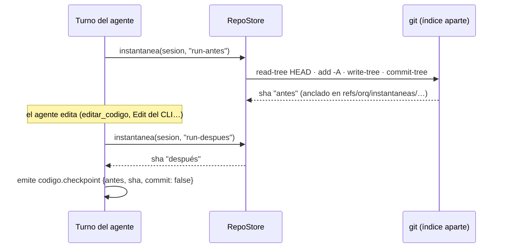

# ADR-010 Los agentes no commitean y la persona publica

**Estado:** aceptada · reemplaza al checkpoint por turno como comportamiento por defecto (sigue disponible con `commitsAutomaticos`)

## Contexto

La primera versión del trabajo con código cerraba cada turno de un agente con
un **checkpoint**: un commit en la rama de la sesión con el rol como autor. Era
simple y dejaba rastro, pero chocaba con cómo trabaja una persona sobre su
propio repo —el flujo de Cursor o de VS Code—:

- la sesión trabaja **en la rama del proyecto** (`dev`), que es la de ella
  ([[ADR-009 Programar sobre un clon gestionado y un worktree]]), así que cada
  turno le escribía commits en su historia con mensajes que no eligió;
- lo que ella editaba desde el IDE entre turnos terminaba commiteado con un
  mensaje genérico, o peor, firmado por el agente;
- `package.json` y el lockfile se commiteaban solos al instalar una
  dependencia.

Y a la vez hacía falta conservar lo que el checkpoint daba: poder **ver qué
cambió un pedido del chat** y **deshacerlo** sin tocar lo que hizo ella.

## Decisión

**Los agentes no commitean.** `repositorio.commitsAutomaticos` vale `false`
por defecto (`repositorioSchema`, y `RepoStore.cargar` lo fija así). Lo que
edita un turno —por las herramientas del org o por el `Edit` propio del CLI—
queda **sin commitear** en la rama del proyecto, junto con lo que haya editado
ella, y nada se commitea por nadie.

Para que cada pedido se siga pudiendo ver y deshacer, el turno toma **dos
instantáneas** (`RepoStore.instantanea`):

- Cada instantánea es un `commit-tree` armado con un **índice aparte**
  (`GIT_INDEX_FILE`, la opción `indice` de `git()`), anclado en
  `refs/orq/instantaneas/…` para que git no lo recolecte. No toca ni la rama ni
  el índice de la sesión.
- "Ver cambios" es el diff entre las dos (`RepoStore.cambiosEntre`); "Deshacer"
  lo aplica al revés sobre el árbol (`RepoStore.deshacerEntre`). Si ella tocó
  después las mismas líneas, `git apply -R --check` falla y **no se aplica
  nada**: se dice qué choca.
- La traza lo registra con `codigo.checkpoint` (`antes`, `sha`, `commit:
  false`), que el chat del IDE usa para mostrar el pedido.

**La persona prepara, escribe el mensaje, commitea y publica** desde el panel de
control de versiones (`scm.ts`, `/api/sesiones/:id/scm/*`). El ✨ del mensaje es
una sola llamada al tier `cheap` que imita los últimos commits del repo y saca
las firmas del CLI (`Runtime.generarMensajeDeCommit`). **Publicar exige que no
quede nada sin commitear** —no commitea por ella con un mensaje genérico
(`RepoStore.integrar`)— y en la rama del proyecto adelanta su `dev` con
fast-forward y **deja la sesión abierta**, con la base pasando a ser lo
publicado.

Con `commitsAutomaticos` prendido vuelve el comportamiento anterior: checkpoint
por turno con el rol como autor y, antes del turno, lo que editó la persona se
commitea a su nombre (identidad de git de la máquina, leída aparte porque
`git.ts` no lee la config global).

## Alternativas consideradas

**Checkpoint por turno, siempre.** Fue el comportamiento original. Rechazado
como default por lo del contexto: escribe en la historia de la persona commits
que ella no pidió, y mezcla su trabajo con el del agente.

**Commitear en una rama aparte y que ella la mezcle.** Resolvía la historia,
pero la dejaba a ella trabajando en una rama y los agentes en otra, que es
justo la separación que la sesión en la rama del proyecto vino a eliminar.

**`git stash` para marcar el antes y el después.** Rechazado: un stash mueve el
árbol, y con `--intent-to-add` en juego `git stash` ni siquiera funciona ("not
uptodate. Cannot save the current worktree state"). `commit-tree` con un índice
aparte no mueve nada.

**Sin instantáneas: confiar en el diff contra la base.** Rechazado: el diff
contra la base mezcla todos los pedidos y lo que hizo la persona; no permite
decir "esto lo cambió este pedido" ni deshacer sólo eso.

## Consecuencias

### A favor

- La historia de la rama del proyecto la escribe la persona, con sus mensajes.
- Cada pedido del chat se puede ver y deshacer aunque no haya commit.
- Deshacer nunca pisa lo que ella editó después: o aplica limpio o no aplica.
- La sesión sigue abierta después de publicar: los servicios de la vista previa
  no se reinician por publicar.

### En contra / lo que se resignó

- **Un árbol sucio es el estado normal.** Lo de los agentes y lo de ella
  conviven sin commitear hasta que ella decide; si tarda, el panel acumula
  cambios de varios pedidos mezclados.
- **Las instantáneas se acumulan** en `refs/orq/instantaneas/…` del clon: no hay
  poda automática de esas refs.
- **Deshacer un pedido falla si ella tocó las mismas líneas después**: es la
  decisión correcta (no pisar), pero obliga a resolver a mano.
- **Publicar pide un paso más** (preparar y commitear antes) que el checkpoint
  automático no pedía.

### Cómo se revisaría

Si los repos cargados fueran mayormente del equipo de agentes (repos creados
por la empresa), el checkpoint por turno vuelve a tener sentido: por eso sigue
detrás de un interruptor por repo y no se borró.

## Qué lo fija

- `apps/server/src/ide.test.ts` → "deja los cambios sin commitear y anuncia sus
  instantáneas".
- `apps/server/src/repos.test.ts` → "una instantánea guarda el árbol entero sin
  tocar la rama ni el índice; deshacer vuelve atrás lo del tramo", "con la
  carpeta sucia publica igual si no se pisa, y su trabajo queda sin commitear",
  "confirmar desde el IDE firma con la identidad de la persona y el título que
  escribió".
- `apps/server/src/scm.test.ts` → "prepara, commitea con mensaje y modifica el
  último commit", "stash guarda y trae de vuelta, archivos nuevos incluidos".

## Fuentes

- `packages/shared/src/schema.ts` → `repositorioSchema.commitsAutomaticos`
- `apps/server/src/repos.ts` → `RepoStore.instantanea`, `cambiosEntre`,
  `deshacerEntre`, `integrar`, `checkpoint`, `identidadDePersona`
- `apps/server/src/codigo-servidor.ts` → `abrirTurnoDeCodigo` (instantáneas
  antes/después y `emitirCheckpoint`)
- `apps/server/src/scm.ts` → `ControlDeVersiones`
- `apps/server/src/runtime.ts` → `Runtime.generarMensajeDeCommit`
- `packages/shared/src/events.ts` → `codigoCheckpointEvent`

## Ver también

- [[Instantáneas y checkpoints]] · [[Control de versiones y publicación]] · [[Panel de control de código]]
- [[Chat de IA]] · [[ADR-009 Programar sobre un clon gestionado y un worktree]]
