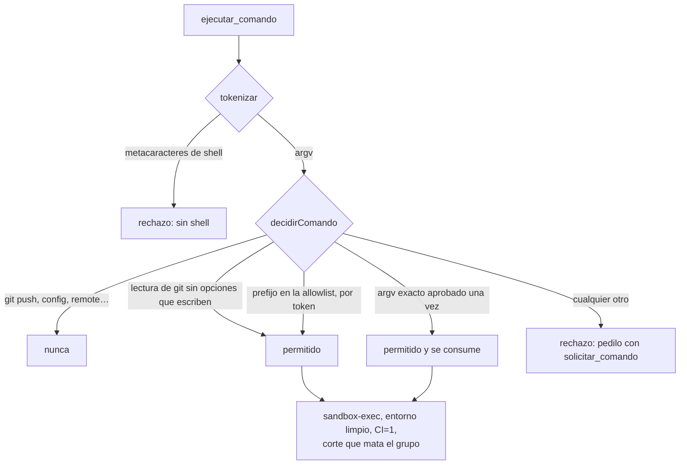

# ADR-011 La allowlist decide y el sandbox contiene

**Estado:** aceptada

## Contexto

Un equipo que programa necesita correr cosas: los tests, el typecheck, el build
de una parte del monorepo. Esas cosas corren **en la máquina de una persona**,
donde también están sus claves SSH, sus credenciales de AWS y de `gh`, y el
propio servidor del orquestador con las API keys de todos los proveedores
cargadas en el entorno.

La tentación es una sola regla: "sólo se corre lo que está en la lista". Pero
permitir `npm test` **es permitir los tests que el agente acaba de escribir**,
o sea código arbitrario. Una lista puede decidir *qué* se lanza; no puede
contener *lo que eso hace* una vez lanzado.

## Decisión

Dos capas con trabajos distintos:

**La allowlist decide qué** (`packages/shared/src/argv.ts`, compartido con la
UI para que no haya dos copias de la regla):

- `tokenizar` parte a argv **sin shell** y rechaza metacaracteres (`;`, `&`,
  `|`, `<`, `>`, `` ` ``, `$`, `\`, saltos de línea, `$(`, `*`, `?`): un `;` es
  un argumento, no un segundo comando.
- `empiezaCon` compara **por token**: `npm test` no habilita `npm testx`.
- `validarPrefijoPermitido` no acepta como entrada de la lista lo que lo
  permite todo: shells y ejecutores genéricos (`sh`, `bash`, `env`, `sudo`,
  `xargs`, `eval`…), red y destructivos (`curl`, `wget`, `ssh`, `rsync`, `rm`,
  `mv`, `chmod`, `dd`…), intérpretes sin lo que corren (`node`, `python`, `npx`
  solos, o con `-c`/`-e`), un gestor sin subcomando o `npm run` sin script, y
  subcomandos que publican o tocan credenciales (`publish`, `login`, `token`,
  `config`…). De git, `push`, `remote`, `config`, `credential`, `submodule`,
  `filter-branch`, `gc` y `worktree` no se permiten nunca.
- `decidirComando` aplica el orden: primero lo prohibido, después la lectura de
  git (siempre permitida salvo con `--output`, `--ext-diff`, `--textconv`,
  `--exec`, `--upload-pack`, `--git-dir`, `--work-tree` o `--config-env`, que
  escriben o ejecutan), después la allowlist del repo, después los permisos de
  una vez.

Lo que falta se pide con `solicitar_comando` (solicitud tipo `comando`). La
persona lo aprueba **una vez** —el argv exacto, que se consume al usarse— o
**siempre** —un prefijo que ella puede recortar, que vuelve a pasar por
`validarPrefijoPermitido`— (`Runtime.applyRequest`).

**El sandbox contiene** (`packages/tools/src/codigo/ejecutar.ts`):

- `sandbox-exec` de macOS con un perfil SBPL armado en `perfilSandbox` (en SBPL
  gana la última regla que aplica, por eso los permisos van primero):
  - se escribe **sólo** en el worktree, en `tmp/` del proyecto y en los cachés
    de paquetes (`.npm`, `.cache`, `.pnpm-store`, `.gradle`, `.cargo/registry`…),
    más el temporal del usuario;
  - **nunca** en el `.git` del clon ni en el archivo `.git` del worktree: un
    test que escribe un hook ahí convierte el próximo checkpoint del servidor en
    código corriendo **fuera** del sandbox (`noEscribibles` en
    `codigo-servidor.ts`);
  - no se leen `~/.ssh`, `~/.aws`, `~/.config/gh`, `~/.gnupg`, `~/.docker`,
    `~/.kube`, `~/.config/gcloud`, `~/.azure`, ni `~/.netrc`, `~/.npmrc`,
    `~/.pypirc`, `~/.git-credentials`.
- **Entorno limpio** (`entornoDeComando`): se sacan las variables que parecen
  secretos (`KEY`, `TOKEN`, `SECRET`, `PASSWORD`, `AUTH`, `COOKIE`…) y las del
  orquestador (`ORQ_`, `ANTHROPIC`, `OPENROUTER`, `DATABASE_URL`, `CLAUDE_CODE`…);
  se fija `CI=1` —sin eso vitest y jest arrancan en modo watch y el comando no
  termina nunca— y npm no pregunta nada.
- **El corte mata el grupo entero** de procesos (spawn `detached`,
  `process.kill(-pid)`): `npm test` lanza node, que lanza workers, y matar al
  primero dejaba a los nietos corriendo.
- **Sin sandbox no se corre**: donde no hay `sandbox-exec` (`hayAislamiento`),
  el repo necesita el opt-in `sinAislamiento` que prende una persona.

Dos reglas de uso que sostienen la decisión: **`exit ≠ 0` vuelve como `ok:
true`** —si fuera un fallo de la herramienta, el ciclo corregir → testear
chocaría contra la tolerancia de tres llamadas idénticas fallidas— y **un
comando sobre el mismo árbol devuelve el mismo resultado**: se reutiliza si la
huella del árbol no cambió en 30 minutos (`VIGENCIA_RESULTADO_MS`), salvo
`repetir: true`.

## Alternativas consideradas

**Shell libre con una instrucción en el prompt.** Rechazada: un agente puede
ignorar una instrucción, no al ejecutor. Es la regla de todo el proyecto.

**Sólo la allowlist.** Rechazada por el argumento del contexto: `npm test`
ejecuta lo que el agente escribió. Sin sandbox, un test podía leer `~/.ssh` o
escribir un hook en `.git`.

**Un contenedor (Docker) por comando.** Rechazada: otra dependencia pesada que
no está en la máquina de la persona, arranques lentos para un ciclo
testear → corregir que se repite decenas de veces, y el `node_modules` de un
monorepo montado en un contenedor es otro problema. `sandbox-exec` ya viene con
macOS: la misma regla que ffmpeg, Kokoro y Chrome.

**Aprobar cada comando con `requiresApproval`.** Rechazada después de probarla
en otra parte: aprobar sólo le mandaba un mensaje al agente y la herramienta
volvía a pedir aprobación para siempre. `solicitar_comando` guarda el permiso
en el repo, que es donde lo va a buscar la próxima llamada.

## Consecuencias

### A favor

- Un comando permitido no puede leer las credenciales de la máquina ni escribir
  fuera del worktree, aunque lo que corra lo haya escrito el agente.
- El `.git` que usa el servidor queda fuera del alcance de los comandos, y con
  él los hooks (el servidor además corre git sin hooks, ver [[Git endurecido]]).
- La lista es corta y legible: la persona ve prefijos con sentido (`npm test`,
  `npx tsc --noEmit`), no una lista infinita de variantes.
- La terminal del IDE usa **la misma** allowlist y el mismo sandbox: no es una
  shell, porque la API escucha en localhost y un endpoint que corre lo que le
  pidan sería una puerta que cualquier página del navegador puede golpear.

### En contra / lo que se resignó

- **El sandbox no corta la red.** El perfil niega escrituras y lecturas de
  secretos, no conexiones: un test puede hacer pedidos HTTP. Lo que impide que
  un agente "baje" cosas es la allowlist (`curl` y `wget` no entran), no el
  sandbox. Instalar dependencias corre, a propósito, con red y en el mismo
  sandbox ([[Instalación de dependencias]]).
- **Sólo macOS.** En otra plataforma no hay aislamiento y cada repo necesita el
  opt-in explícito de una persona.
- **Un comando de más en la lista es un permiso de más para siempre**: `siempre`
  guarda un prefijo, y un prefijo corto abarca mucho. Por eso la persona lo
  puede recortar al aprobar.
- **La caché por huella puede esconder un test inestable**: el mismo árbol
  devuelve el mismo resultado; para sospechar de un flaky hay que pedir
  `repetir: true`.

### Cómo se revisaría

Si el orquestador corriera en Linux de forma habitual, la contención tendría que
pasar a un mecanismo de esa plataforma (namespaces, bubblewrap) con el mismo
contrato: `escribibles`, `noEscribibles`, secretos ilegibles.

## Qué lo fija

- `packages/shared/src/argv.test.ts` → "rechaza sintaxis de shell y explica por
  qué", "compara por token: npm test no habilita npm testx", "no acepta prefijos
  que lo permiten todo", "no deja permitir publicar ni tocar credenciales", "la
  allowlist permite por prefijo; el permiso de una vez, sólo el argv exacto",
  "leer git se permite siempre; escribir o ejecutar desde git, nunca".
- `packages/tools/src/codigo/codigo.test.ts` → "rechaza sintaxis de shell y lo
  que no está permitido", "un exit distinto de 0 es un resultado, no un error",
  "el comando no ve las credenciales del servidor y corre con CI=1", "al vencer
  el corte mata el grupo entero, nietos incluidos".
- `apps/server/src/ide.test.ts` → "se reutiliza el resultado; si cambia un
  archivo, o se pide repetir, se vuelve a correr".

## Fuentes

- `packages/shared/src/argv.ts` → `tokenizar`, `empiezaCon`,
  `validarPrefijoPermitido`, `decidirComando`, `EJECUTABLES_ABIERTOS`,
  `GIT_PROHIBIDOS`, `GIT_LECTURA`
- `packages/tools/src/codigo/ejecutar.ts` → `ejecutarComando`, `perfilSandbox`,
  `entornoDeComando`, `hayAislamiento`, `CABEZA`, `COLA`
- `packages/tools/src/codigo/index.ts` → `ejecutar_comando`, `solicitar_comando`
- `apps/server/src/codigo-servidor.ts` → `crearCodigoStorage` (`ejecutar`,
  `noEscribibles`, `VIGENCIA_RESULTADO_MS`)
- `apps/server/src/runtime.ts` → `Runtime.applyRequest` (tipo `comando`)

## Ver también

- [[Comandos y sandbox]] · [[Terminal del IDE]] · [[Instalación de dependencias]]
- [[ADR-009 Programar sobre un clon gestionado y un worktree]] · [[Seguridad]]
