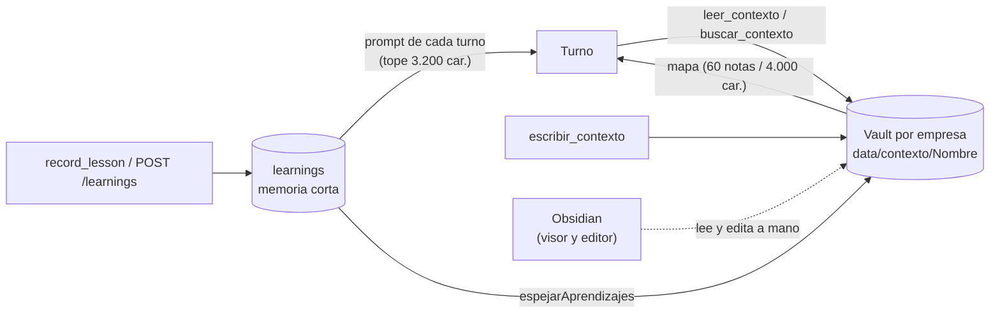

# ADR-013 El vault de contexto se escribe por el sistema de archivos

**Estado:** aceptada

## Contexto

Lo que una empresa sabe tenía un solo lugar: la **memoria corta** (`learnings`),
lecciones de un párrafo que viajan en el prompt de cada turno. Eso no escala a
lo largo: el guion vigente de una campaña, el mapa de una app que se filma, las
decisiones de un cliente. Medido en la empresa del video: 58 lecciones en la
base y unas diez entrando al prompt, así que 48 existían sin que ningún agente
pudiera verlas ni pedirlas.

Hacía falta un segundo lugar, y dos preguntas lo definían:

1. **¿Mandar o ir a buscar?** Una llamada a herramienta dentro de un turno
   delegado cuesta una iteración entera —20.000 a 28.000 tokens de prefijo
   reenviado—. Por debajo de unos 800 caracteres sale más barato **mandar**;
   por encima, **apuntar**.
2. **¿Dónde vive y quién lo corrige?** Lo que el sistema aprende mal tiene que
   poder corregirse a mano, y verse con sus relaciones.

## Decisión

Lo largo vive en un **vault de Obsidian por empresa**, escrito **directo por el
sistema de archivos** (`ContextoStore`, raíz en `CONTEXTO_DIR`, por defecto
`./data/contexto`). **No pasa por el plugin ni por un MCP de Obsidian.**

- Una carpeta por empresa, con el **nombre legible** de la empresa y una marca
  oculta `.empresa` con su id; dos empresas homónimas no se mezclan (la segunda
  toma `Nombre (abc123)`). Consultar no crea la carpeta: sólo escribir la
  reclama.
- **El mapa viaja en el prompt, el contenido no.** El mapa (ruta, título y
  tamaño de cada nota) se acota por cantidad y por tamaño (`TOPE_MAPA`: 60
  notas, `TOPE_MAPA_CARACTERES`: 4.000); el contenido se abre con
  `leer_contexto` sólo cuando hace falta, y `buscar_contexto` devuelve **dónde**
  aparece algo, no el párrafo. Medido: 465 tokens de mapa apuntan a 59.743
  caracteres de conocimiento, 32 a 1.
- La ruta que propone un modelo se **sanea segmento por segmento**
  (`ExportStore.safePath`) y se le **fuerza `.md`**: un `.txt` en el medio no se
  indexa, no entra en el grafo y rompe los `[[…]]`.
- `escribir_contexto` **reemplaza la nota entera**: quien escribe último decide.
  Una nota de menos de 40 caracteres se rechaza y se manda a `record_lesson`.
- **La memoria corta se espeja al vault** (`Runtime.espejarAprendizajes`): el
  alta por `record_lesson`, el alta por API de una persona, la edición y la baja.
  Se reescribe la nota del tema entera, y un tema que se queda sin lecciones se
  **borra**. Las refutadas aparecen tachadas en su sección.
- Las notas se escriben **para leerse desde Obsidian**: frontmatter (empresa,
  tema, cantidad, fecha formateada por quien llama), línea en blanco antes de
  cada `##` y enlaces a la familia del tema y al índice (`notaDeAprendizajes`).
  Medido al arreglarlo: de 20 enlaces a 258, y de 0 notas con propiedades a 24.

## Alternativas consideradas

**Escribir por el plugin de Obsidian (Local REST API o su MCP).** Rechazada:
obliga a una segunda instancia de Obsidian, un segundo puerto y un segundo token,
y sobre todo hace que el contexto del sistema **dependa de que una aplicación de
escritorio esté abierta**. Lo medimos: el servidor MCP de Obsidian estuvo caído
media tarde. Es la regla de ffmpeg, Kokoro y Chrome: usar lo que hay y degradar
con aviso.

**Todo en la base.** Rechazada para lo largo: un campo de SQLite se corrige con
un `UPDATE`, no se lee ni se discute, y no hay grafo que muestre cómo se
relacionan los temas.

**Todo en el prompt.** Rechazada por la aritmética del contexto: lo largo
reenviado en cada vuelta de cada turno cuesta mucho más que ir a buscarlo cuando
hace falta. La memoria ya se había comido el 19% del gasto de una corrida por
tres respuestas guardadas enteras.

**Todo detrás de una herramienta.** Rechazada para lo corto: una lección de un
párrafo detrás de una tool cuesta un turno descubrirla y otro llamarla, y muchas
veces no se llama. Lo corto se manda.

## Consecuencias

### A favor

- El conocimiento no depende de que Obsidian esté abierto; Obsidian queda como
  visor y editor, que es donde aporta: el grafo, la búsqueda y corregir a mano.
- El vault se puede versionar, copiar o abrir con cualquier editor de markdown.
- El costo de lo largo es proporcional a lo que se usa, no a lo que existe.

### En contra / lo que se resignó

- **El espejo de la memoria es unidireccional.** Lo que una persona edite a mano
  en la nota de un tema de lecciones se pisa en el próximo espejo: la memoria se
  edita desde la pantalla Memoria. (Las notas escritas con `escribir_contexto`
  sí se leen tal cual hasta que un agente las reescriba.)
- **Quien escribe último decide**: no hay merge entre dos agentes que reescriben
  la misma nota en la misma corrida.
- **El vault se resuelve por nombre**: renombrar el proyecto obliga a mudarlo
  (`ContextoStore.renombrar`), o el proyecto renombrado abre un vault vacío al
  lado del que tenía la memoria.
- **Dos lugares que mantener coherentes** (base y vault), con la regla de dedupe
  en `@orq/shared` (`normalizarLeccion`) para que las dos puertas de entrada de
  la memoria no discrepen.

### Cómo se revisaría

Si el vault se compartiera entre varias personas en tiempo real, "quien escribe
último decide" dejaría de alcanzar y haría falta un control de versiones por
nota (git en la carpeta del vault es el candidato natural).

## Qué lo fija

- `apps/server/src/contexto.test.ts` → "le pone .md aunque el agente no lo
  escriba", "reemplaza la nota entera: quien la reescribe decide qué queda",
  "descarta los saltos hacia arriba", "cada empresa escribe en su rama y no ve la
  de las otras", "lista las notas con su título, sin traer el contenido",
  "devuelve dónde está, con la línea, y no el documento entero", "dos empresas
  con el mismo nombre no comparten conocimiento", "consultar el árbol no lo
  crea", "abre con frontmatter…", "deja línea en blanco antes de cada ##…",
  "enlaza al índice y a las notas de su misma familia".
- `packages/tools/src/contexto.test.ts` → "devuelve dónde mirar, no el
  contenido", "una línea suelta no es una nota: la manda a record_lesson",
  "lista rutas y títulos, nunca contenido".
- `apps/server/src/routes.test.ts` → "DELETE saca la lección de la base y su nota
  del vault".
- `apps/server/src/renombrar.test.ts` → "el vault sigue al nombre: la memoria no
  queda en una carpeta que nadie lee".

## Fuentes

- `apps/server/src/contexto.ts` → `ContextoStore` (`escribir`, `leer`, `borrar`,
  `mapa`, `buscar`, `renombrar`), `notaDeAprendizajes`, `rutaDeTema`,
  `TOPE_MAPA`, `TOPE_MAPA_CARACTERES`
- `packages/tools/src/contexto.ts` → `crearHerramientasDeContexto`,
  `mapaDeContextoEnPrompt`
- `apps/server/src/runtime.ts` → `Runtime.espejarAprendizajes`
- `apps/server/src/env.ts` → `contextoDir` (`CONTEXTO_DIR`)
- `scripts/vault-contexto.ts` (vuelca la memoria de la base al árbol)

## Ver también

- [[Vault de contexto]] · [[Memoria de la empresa]] · [[Prompt de un turno]]
- [[ADR-015 Una lección exige evidencia y refutar no borra]]
