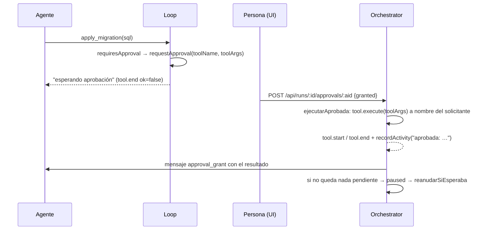

# ADR-014 Aprobar una herramienta la ejecuta

**Estado:** aceptada

## Contexto

Una herramienta con `requiresApproval` no corre: el loop abre una aprobación y
esa rama del trabajo espera (`executeOne` en `packages/engine/src/loop.ts`). En
MCP esto es lo habitual: con `autoApproveTools` apagado, pide aprobación todo lo
que el servidor **no** declara de sólo lectura (`annotations.readOnlyHint`,
`packages/tools/src/mcp/bridge.ts`). En una base de datos, listar tablas corre
solo y una migración espera a una persona.

La primera versión de aprobar **sólo avisaba**: el agente recibía "Aprobación
concedida" y tenía que volver a llamar la herramienta. Al volver a llamarla,
`requiresApproval` seguía en `true` y **pedía aprobación otra vez**. Una
migración aprobada no se aplicaba nunca: el circuito era un bucle.

## Decisión

**Aprobar ejecuta esa llamada**, con los argumentos que vio la persona
(`Orchestrator.resolveApproval` → `ejecutarAprobada`,
`packages/engine/src/scheduler.ts`):

- Se corre **la llamada guardada** (`approval.toolArgs`), a nombre de quien la
  pidió y con su `workspace` (`forActor`): el agente **no puede cambiar el SQL**
  después de que una persona lo vio.
- Deja el mismo rastro que una llamada del loop: `tool.start`/`tool.end` con
  `callId` `aprobada-<id>` y una entrada en `activity` (`check_activity` la ve).
- El resultado —acotado a 6.000 caracteres— le llega al solicitante **en el
  mismo mensaje** que la concesión, con la instrucción de no volver a llamarla
  con los mismos argumentos.
- Rechazar no ejecuta nada.
- Si era la última aprobación pendiente, la corrida pasa de
  `awaiting_approval` a `paused`, y el servidor la reanuda sola
  (`Runtime.reanudarSiEsperaba`): aprobar y que no pase nada convertía una
  espera asincrónica en una intervención manual.

El chat del IDE muestra la aprobación en línea, con el SQL resaltado.

## Alternativas consideradas

**Aprobar sólo avisa (lo de antes).** Rechazada por el bucle descrito.

**Aprobar marca la herramienta como libre para ese agente.** Rechazada: le
permitiría al agente ejecutar **otra** llamada —otro SQL— con la aprobación de
una llamada distinta.

**Aprobar por lista, como los comandos.** Para los comandos del repo se usa
otra puerta (`solicitar_comando`, ver [[ADR-011 La allowlist decide y el sandbox contiene]]),
porque ahí sí conviene un permiso duradero. Para una herramienta sensible de
MCP, cada llamada es una decisión.

## Consecuencias

### A favor

- Lo aprobado es exactamente lo que se ejecuta.
- El agente no gasta turnos reintentando algo que ya estaba resuelto.
- La ejecución queda auditada igual que cualquier otra.

### En contra / lo que se resignó

- **La herramienta corre fuera del turno del agente**, en el momento en que la
  persona aprueba; si el mundo cambió entre el pedido y la aprobación (otra
  migración aplicada en el medio), se ejecuta igual. La persona ve los
  argumentos, no el estado del sistema.
- **Si la herramienta ya no existe** (servidor MCP desconectado) o el rol se
  borró, la aprobación se concede y la ejecución informa que no pudo.
- La traza de una ejecución aprobada no está atada a un turno del agente: tiene
  su propio `callId`.

## Qué lo fija

- `packages/engine/src/scheduler.test.ts` → "aprobar ejecuta la llamada aprobada
  con sus argumentos y le lleva el resultado al agente", "rechazar no ejecuta
  nada".

## Fuentes

- `packages/engine/src/scheduler.ts` → `Orchestrator.resolveApproval`,
  `ejecutarAprobada`
- `packages/engine/src/loop.ts` → `executeOne` (rama `requiresApproval`)
- `packages/tools/src/mcp/bridge.ts` → `requiresApproval` desde `readOnlyHint`
- `apps/server/src/routes.ts` → `POST /api/runs/:id/approvals/:approvalId`
- `apps/server/src/runtime.ts` → `Runtime.reanudarSiEsperaba`

## Ver también

- [[Aprobaciones y solicitudes]] · [[Integración MCP]] · [[Chat de IA]]
- [[ADR-008 Publicar lo decide una persona]]
