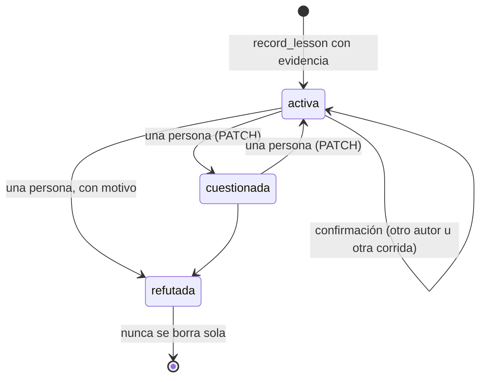

# ADR-015 Una lección exige evidencia y refutar no borra

**Estado:** aceptada · endurece la memoria de empresa (ver [[Memoria de la empresa]])

## Contexto

La memoria de la empresa entra en el prompt de **todas** las corridas
siguientes. Eso la hace barata y efectiva, y también la hace peligrosa: una
lección falsa degrada cada corrida que la lea, sin que nadie lo note.

Pasó. Un rol concluyó que `edit_artifact` estaba rota —en realidad el índice de
`read_artifact` le mostraba secciones duplicadas que no existían— y registró
"edit_artifact no sirve para multilínea, reescribí el documento entero". La
lección entró a la memoria lista para inducir reescrituras completas en todas
las corridas. Además el prompt decía "dalo por válido", y `timesConfirmed`
subía con repetir el mismo texto: el mismo autor, repitiéndose, "confirmaba".

## Decisión

**Una lección es un reclamo que requiere evidencia**, y la corrección la
resuelve una persona.

1. **`record_lesson` exige `evidence`** (requerido en el esquema; se guarda
   acotado a 600 caracteres en `learning.evidencia`).
2. **El ejecutor rechaza la lección de un agente que sólo habló**: su actividad
   en la corrida tiene que mostrar alguna herramienta fuera de
   `HABLAR_NO_ES_EVIDENCIA` (mensajes, `list_*`, `check_activity`,
   `estado_del_proceso`, pedidos a la persona…). El corte es **por nombre y no
   por `origin`**: `edit_artifact` es de coordinación y sus fallos son justo la
   evidencia que se pide. Leer cuenta: un revisor que leyó puede registrar lo
   que vio. La actividad de otro rol no cuenta como propia.
3. **Confirmar exige otro autor u otra corrida**; quién confirmó queda en
   `confirmaciones`.
4. **Refutar no es borrar.** Una persona marca `estado: "refutada"` con su
   motivo (`PATCH /api/companies/:id/learnings/:id` o la pantalla Memoria). La
   refutada deja de entrar al prompt (`buildMemorySection` la filtra) pero la
   fila queda: el registro de por qué se creyó y por qué era falsa evita
   re-aprender el mismo error. En el vault aparece tachada en su sección.
5. **El prompt gradúa la confianza**: cada lección viaja con su procedencia
   (autor, fecha, confirmaciones); `(?)` marca las `cuestionada`; ya no dice
   "dalo por válido".
6. **Una sola lectura y una sola regla de dedupe**: `Store.listLearnings` parsea
   por Zod (filas viejas sin `estado` salen `activa`) y `normalizarLeccion` vive
   en `@orq/shared`, porque la memoria entra por dos puertas (`record_lesson` y
   `POST /learnings`).

## Alternativas consideradas

**Validar semánticamente la evidencia** (que la cita corresponda a la
actividad). Rechazada: burocracia frágil; el gate binario —¿hizo algo
observable?— atrapa el caso que importa sin interpretar texto.

**Que un agente pueda refutar.** Rechazada a propósito: un agente que discrepa
registra la corrección con evidencia, y la tensión la resuelve una persona.
Dos agentes refutándose entre sí no convergen.

**Borrar la lección falsa.** Rechazada: sin el tombstone, la misma conclusión
equivocada vuelve a aprenderse en la próxima corrida que tropiece con lo mismo.

## Consecuencias

### A favor

- Una conversación entre agentes no puede fabricar memoria.
- Las falsas se sacan del prompt sin perder el porqué.
- La confianza de cada lección es visible para el agente que la lee.

### En contra / lo que se resignó

- **Un agente que aprendió algo verdadero sólo conversando no lo puede
  registrar**: tiene que registrarlo quien lo comprobó.
- **La refutación es trabajo humano**: si nadie revisa la Memoria, una lección
  falsa con evidencia verosímil sigue entrando.
- **El gate no juzga la calidad de la evidencia**: un agente que ejecutó
  cualquier herramienta puede registrar una conclusión mal sacada. La
  auditoría procedimental (`npm run auditar`) no la detecta si hubo llamadas
  exitosas; eso sigue necesitando ojos.

## Qué lo fija

- `packages/tools/src/coordination.test.ts` → "sin el argumento de evidencia, la
  llamada ni siquiera entra", "un agente que sólo habló no puede registrar 'tal
  herramienta está rota'", "quien sí trabajó puede…", "la actividad de otro rol
  no cuenta como evidencia propia".
- `packages/engine/src/memory.test.ts` → "repetir la lección no la duplica, y
  confirmar exige otro autor", "una refutada no entra al prompt, pero sigue en la
  lista", "cada lección viaja con su procedencia…", "una cuestionada entra
  marcada, no muda".
- `apps/server/src/routes.test.ts` → "PATCH refuta con motivo…", "una fila vieja
  sale con estado activa y sin evidencia, no rompe".
- `apps/server/src/memoria-persistida.test.ts` → "la memoria persiste, llega al
  prompt, y la refutación la saca sin borrarla".

## Fuentes

- `packages/tools/src/coordination.ts` → `record_lesson`, `HABLAR_NO_ES_EVIDENCIA`
- `packages/shared/src/schema.ts` → `learningSchema` (`evidencia`, `estado`,
  `refutacion`, `confirmaciones`), `normalizarLeccion`
- `packages/engine/src/prompt.ts` → `buildMemorySection`, `TOPE_MEMORIA`,
  `TOPE_LECCION`
- `apps/server/src/db.ts` → `Store.listLearnings`
- `apps/server/src/routes.ts` → rutas de `learnings`
- `apps/server/src/auditoria.ts` → `auditarCorrida`

## Ver también

- [[Memoria de la empresa]] · [[Auditoría de corridas]] · [[CU-12 Refutar una lección falsa]]
- [[ADR-013 El vault de contexto se escribe por el sistema de archivos]] · [[Pantalla Memoria]]
