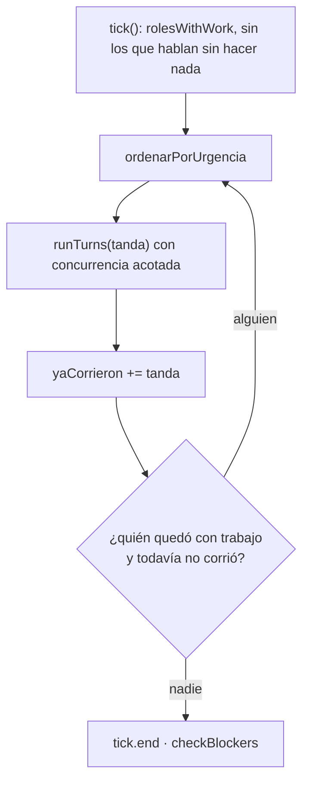

# ADR-016 El ciclo es una cadena

**Estado:** aceptada · reemplaza al "tick de retardo total" (todo lo emitido caía en las bandejas del ciclo siguiente)

## Contexto

Un *tick* es un ciclo de la empresa. En la primera versión, todo lo que un
agente emitía entraba a las bandejas **del ciclo siguiente**. La demora tenía
dos razones: modelar que nadie contesta en el mismo instante, y —la de verdad—
**impedir que dos agentes se escribieran sin parar dentro de un mismo tick**.

Aplicado a una cadena de trabajo, ese retardo cuesta carísimo. Con guion →
rodaje → revisión, cada eslabón espera un ciclo entero, y cada ciclo vuelve a
mandar el contexto completo de cada turno. Medido acá: corridas de 269 llamadas
a herramientas que avanzaron 3 ciclos. El trabajo estaba hecho; el tiempo se
iba esperando.

## Decisión

**Cada rol corre a lo sumo una vez por ciclo, y lo que entrega lo toma en el
mismo ciclo quien todavía no trabajó** (`Orchestrator.correrCadena`,
`packages/engine/src/scheduler.ts`).

- `yaCorrieron` es la cota dura: quien ya tuvo su turno espera al ciclo
  siguiente. El ida y vuelta infinito dentro de un tick sigue siendo
  **imposible**, que era la razón de ser del retardo.
- El orden dentro del ciclo lo decide `ordenarPorUrgencia` con señales que ya
  existen: `esperanRespuesta × 10` (pedidos y escalamientos en la bandeja: ese
  bloqueo se propaga) `+ min(bandeja, 5) × 2 + min(tareas abiertas, 5) −
  fallosConsecutivos × 4`. El orden es estable ante empates, para que el reparto
  no baile entre ciclos. Con la concurrencia acotada (`AGENT_CONCURRENCY` es un
  techo, no un piso), ese orden decide el ciclo.

## Alternativas consideradas

**Mantener el retardo total.** Rechazada por la medición del contexto.

**Sin cota: correr mientras haya trabajo.** Rechazada: dos agentes que se
contestan se retroalimentan hasta el tope de iteraciones o de presupuesto.

**Un orden declarado por la persona (prioridades por rol).** Rechazada: las
señales del estado ya dicen quién destraba a más gente, sin configuración que
envejezca.

## Consecuencias

### A favor

- Una cadena de N eslabones avanza en un ciclo, no en N.
- Menos ciclos = menos reenvíos del contexto completo de cada turno.
- La cota por rol hace el comportamiento predecible y testeable.

### En contra / lo que se resignó

- **Un ciclo dura más y es menos parejo**: es una sucesión de tandas, no una
  ronda; el costo por tick deja de ser comparable entre ticks.
- **"El otro contesta en el ciclo siguiente" dejó de ser universal**: quien ya
  corrió sí espera; quien no, recibe en el acto. Un lector de la traza tiene que
  saber cuál de los dos casos está mirando.
- El comentario de cabecera del scheduler todavía describe el retardo total; el
  código manda.

## Qué lo fija

- `packages/engine/src/continuidad.test.ts` → "dos agentes que se escriben sin
  parar corren una vez cada uno", "quien tiene un pedido sin contestar pasa
  adelante", "quien viene fallando queda para el final", "con todo igual respeta
  el orden recibido, para no bailar entre ciclos".
- `packages/engine/src/scheduler.test.ts` → "la cadena completa avanza en un solo
  ciclo".

## Fuentes

- `packages/engine/src/scheduler.ts` → `Orchestrator.tick`, `correrCadena`,
  `ordenarPorUrgencia`, `runTurns`, `TURNOS_VACIOS_TOLERADOS`
- `packages/engine/src/state.ts` → `RunState.rolesWithWork`, `fallosConsecutivos`

## Ver también

- [[Scheduler y ciclo de una corrida]] · [[Estado de una corrida]] · [[Motor de agentes]]
