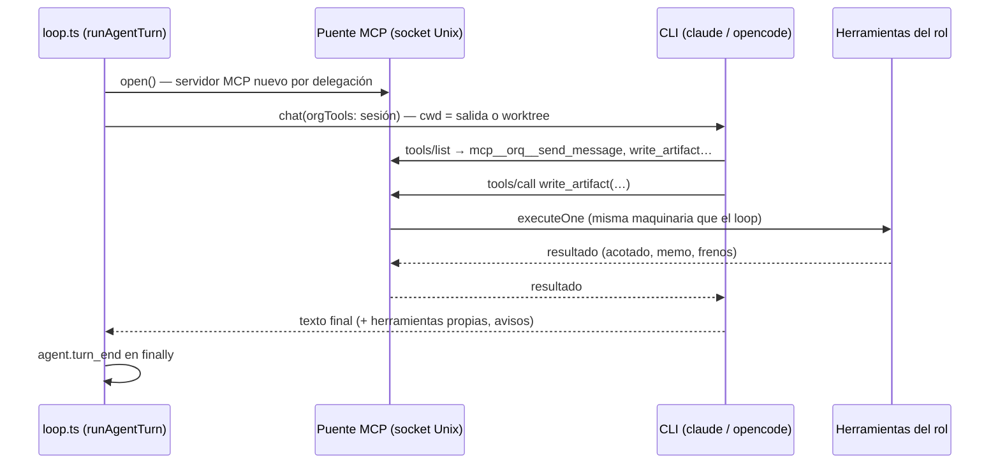

# ADR-018 Los CLI de suscripción reciben el puente MCP del org

**Estado:** aceptada · complementa a [[ADR-001 No usar Claude Agent SDK]]

## Contexto

[[ADR-001 No usar Claude Agent SDK]] dejó el agent loop en casa: el motor
llama al modelo, recibe `tool_calls`, ejecuta y vuelve a llamar. Eso sirve para
cualquier API, pero no para **las suscripciones**: la de claude.ai sólo se usa
a través del CLI oficial (`claude -p`), y la de opencode a través de su CLI.
Esos CLI **corren su propio loop** con sus propias herramientas y no devuelven
`tool_calls`: el motor ve una sola iteración que vuelve con texto.

Delegar el turno entero así, a secas, deja al agente sin la organización: no
puede mandar mensajes, asignar tareas, escribir entregables ni usar las
habilidades del rol. Sería un agente suelto, no un miembro de la empresa.

## Decisión

Un proveedor que delega **declara** que delega (`LlmProvider.delegaElTurno`,
`packages/llm/src/types.ts`), y a ése el motor le **presta un servidor MCP que
vive en el proceso del engine** con las herramientas del rol
(`createClaudeMcpBridge`, `packages/engine/src/claude-mcp.ts`):

- **Misma maquinaria**: cada llamada del CLI pasa por `executeOne`, con los
  mismos eventos (`tool.start`/`tool.end`), la misma `activity` y las mismas
  guardias que una llamada del loop. Un servidor y un socket nuevos por
  delegación: turnos en paralelo no comparten estado.
- **Lo que entra se acota en la puerta**, porque en un turno delegado no hay un
  "después" donde compactar (ver [[Turnos delegados a un CLI]]): memo de
  lecturas (una relectura idéntica devuelve un puntero), tope de resultado
  (`TOPE_RESULTADO` = 16.000 caracteres, ofreciendo sólo argumentos que la
  herramienta declara) y **freno por largo** (aviso a las 50 llamadas —
  `AVISO_DE_LARGO`—, tope a las 80 —`TOPE_DE_LARGO`—, pasado el cual se niegan
  lecturas y se dejan pasar escrituras). Las tolerancias a la llamada fallida
  repetida son las del loop (3 idénticas, 5 por el mismo motivo).
- **El contador del turno ve lo que hace el CLI**: cada llamada al puente suma
  (`alEjecutar`), y las herramientas propias del CLI (`Edit`, `Write`) se
  parsean del stream (`herramientasPropiasDelCli`) y emiten `tool.start`/
  `tool.end` como `cli:Edit`. Sin eso, un programador que sólo usa `Edit` cuenta
  cero y el scheduler lo deja de convocar a los dos turnos.
- **Producir va por el org, no por el CLI.** Sobre la salida de la empresa el
  CLI recibe sólo lectura (`ALLOWED_TOOLS_LECTURA`: `Read,Glob,Grep,WebSearch,
  WebFetch`): `write_output_file` es lo único que sanea la ruta, anota la
  procedencia y aplica la jerarquía de borrado. En modo código, el turno con el
  arriendo recibe `Edit/MultiEdit/Write/NotebookEdit`; **nadie recibe `Bash`**,
  y se niegan explícito `Bash` y las ediciones de `.git`
  (`NEGADAS_EN_CODIGO`). opencode arranca con `"*": false`, habilita sólo lo
  suyo (`orq*` y las de lectura), niega `edit` y `bash` porque corre con
  `--auto`, y va en sólo lectura también sobre código.
- **Lo que no es del agente se resuelve en el adaptador**: corte de 10 min
  (25 min en código; 20 min en opencode, `OPENCODE_TIMEOUT_MS`), rescate del
  texto si el CLI cierra mal o se corta, `--fallback-model`, vigilante de
  silencio (180 s), `CLAUDE_CODE_MAX_RETRIES=4`, `ENABLE_TOOL_SEARCH=false` y
  sin `ANTHROPIC_API_KEY` en el entorno del CLI (si no, factura por API). El
  detalle vive en [[Proveedor claude-code]] y [[Proveedor opencode]].

## Alternativas consideradas

**Delegar sin puente.** Rechazada: el agente pierde la organización.

**Ceder el loop entero al CLI y abandonar el motor propio.** Rechazada por las
razones de ADR-001: se pierden la multiplicidad de proveedores y la
instrumentación paso a paso. Acá el loop del CLI corre **dentro** de un turno
del motor, que sigue siendo quien decide quién trabaja y cuándo.

**Una lista de ids en el motor** (`provider.id === "claude-code"`). Fue la
primera forma; rechazada porque sumar opencode obligaba a tocar el motor. Qué
proveedor delega es una propiedad del proveedor.

**Dar `Write`/`Bash` al CLI.** Rechazada: un `Write` del CLI salta el saneo de
rutas, la procedencia y la jerarquía de una sola vez, y sin rastro en la traza;
`Bash` salta el sandbox de los comandos. La regla se arma en `construirArgs`,
exportada justo para poder fijarla con un test.

## Consecuencias

### A favor

- Dos suscripciones corren agentes de la empresa sin facturar por token, con las
  mismas herramientas y la misma traza que un agente por API.
- Un CLI nuevo es un adaptador que declara `delegaElTurno`; el motor no cambia.
- El agente delegado puede **ver** lo que produce (la salida en sólo lectura).

### En contra / lo que se resignó

- **El motor ve una iteración**: no puede compactar la conversación del CLI; el
  costo de un turno delegado es cuadrático en su largo y sólo se contiene en la
  puerta.
- **La salida del CLI llega al final**: lo que hizo con sus herramientas propias
  aparece en la traza recién al cerrar el turno.
- **Dependencia del comportamiento del CLI** (flags, stream-json, versiones): los
  permisos se verificaron contra una versión concreta del CLI.
- **El costo en suscripción se reporta en 0**: el presupuesto de la corrida no
  frena un turno de `claude-code` (opencode lo cuenta sólo con
  `ORQ_OPENCODE_COSTO=1`).

## Qué lo fija

- `packages/engine/src/claude-mcp.test.ts` → "expone las tools del org con el
  prefijo mcp__orq__", "una relectura idéntica devuelve un puntero…", "después
  de una escritura, releer devuelve el contenido nuevo…", "un resultado enorme
  entra acotado…", "pasado el tope de largo niega lecturas pero deja entregar".
- `packages/llm/src/adapters/claude-code.test.ts` → "sobre el directorio de la
  empresa no se otorga nada que escriba", "nunca se otorga Bash…", "niega
  explícito Bash y cualquier edición de .git", "no le pasa credenciales de API al
  CLI…", "cuenta lo que el CLI hizo por su cuenta…", "rescata el último texto
  del agente".
- `packages/llm/src/adapters/opencode.test.ts` → "además niega explícitamente
  edit y bash…", "barre con * las herramientas heredadas de la config global".

## Fuentes

- `packages/llm/src/types.ts` → `LlmProvider.delegaElTurno`, `timeoutMs`,
  `timeoutCodigoMs`, `ChatResult.herramientasPropias`, `avisos`
- `packages/engine/src/claude-mcp.ts` → `createClaudeMcpBridge`,
  `AVISO_DE_LARGO`, `TOPE_DE_LARGO`, `TOLERANCIA_IDENTICA`
- `packages/engine/src/acotar.ts` → `acotarResultado`, `TOPE_RESULTADO`,
  `ACOTADORES`, `punteroDeRelectura`
- `packages/engine/src/loop.ts` → `runAgentTurn` (`orgBridge`)
- `packages/llm/src/adapters/claude-code.ts` → `construirArgs`,
  `ALLOWED_TOOLS_LECTURA`, `NEGADAS_EN_CODIGO`, `entornoDelCli`, `RESPALDO`,
  `SILENCIO_MAX_MS`, `herramientasPropiasDelCli`, `ultimoTextoDeAsistente`
- `packages/llm/src/adapters/opencode.ts` → `configDelTurno`, `construirArgs`

## Ver también

- [[Turnos delegados a un CLI]] · [[Proveedor claude-code]] · [[Proveedor opencode]]
- [[Capa LLM y tiers]] · [[Motor de agentes]]
