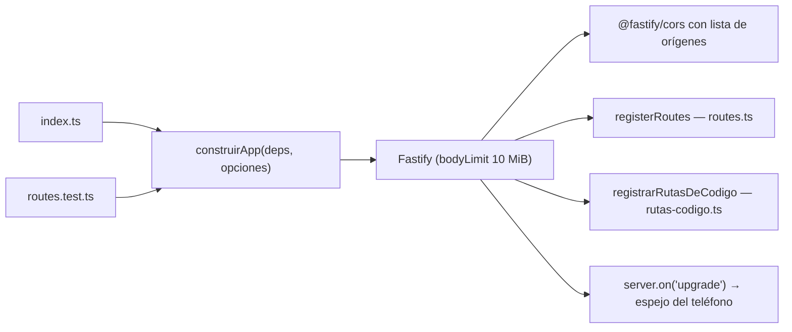
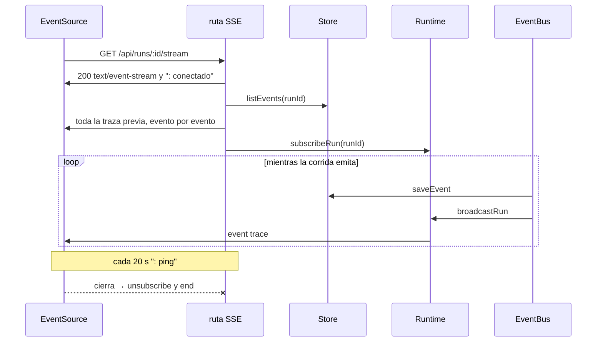

# API HTTP y SSE

El servidor es un Fastify 5 local de un solo usuario: REST para la
configuración y las acciones, y tres canales **SSE** que alimentan todo lo que
se ve en vivo. Esta nota explica **cómo está armada** la API; el contrato ruta
por ruta está en [[Referencia de API]] (`routes.ts`) y
[[Referencia de API de código y móvil]] (`rutas-codigo.ts` y WebSockets).

## Cómo se arma

`apps/server/src/app.ts` → `construirApp` arma el Fastify **sin escuchar**. Lo
comparten producción y tests: `routes.ts` tenía más de mil líneas y cero tests
le costaron tres bugs en un solo día, y ahora se prueba con `app.inject` —HTTP
de verdad, sin socket— con el mismo armado. `index.ts` le suma lo que sólo tiene
sentido en un proceso vivo: logger `pino-pretty` (`HH:MM:ss`), los orígenes
permitidos, el saneo de corridas huérfanas, las misiones, las señales y
`listen({ port: PORT, host: "127.0.0.1" })`: la API **sólo escucha en
loopback**. El orden de arranque está en [[Runtime del servidor]].

- `bodyLimit: 10 * 1024 * 1024`: los entregables que escriben los agentes pueden
  ser grandes.
- Fastify no atiende *upgrades*: el WebSocket del espejo del teléfono
  (`/api/dispositivos/:serial/espejo`, `manejarEspejoWs`) se engancha al
  servidor HTTP, y un upgrade que nadie reclama se corta con `socket.destroy()`
  en vez de quedar colgado. Ver [[Espejo del teléfono]].

## Familias de rutas

| Familia | Prefijo | Archivo |
|---|---|---|
| Salud y catálogo de modelos | `/api/health`, `/api/providers`, `/api/models`, `/api/plantillas` | `routes.ts` |
| Empresas y su configuración | `/api/companies/*`: resumen, renombrar, blueprint, import, departamentos, roles, políticas, misiones, MCP, tienda, herramientas, solicitudes, memoria, progreso, salida | `routes.ts` |
| Corridas | `/api/runs/*`: crear, listar, traza, `tick`/`resume`/`pause`/`stop`, inyectar, aprobar, borrar | `routes.ts` |
| Mantenimiento | `/api/mantenimiento`, `/api/mantenimiento/purgar` | `routes.ts` |
| MCP global | `/api/mcp/stream`, `/api/mcp/oauth/callback`, `/api/tienda-mcp` | `routes.ts` |
| Código e IDE | `/api/companies/:id/repos`, `/api/repos/*`, `/api/sesiones/*` | `rutas-codigo.ts` |
| Teléfono | `/api/dispositivos/*`, `/api/repos/:id/telefono/*`, AAB | `rutas-codigo.ts` |

Son 72 rutas en `routes.ts` (contando las 4 acciones de corrida del bucle y las
12 que genera `registerChild` para departamentos, roles y políticas) y unas 80
en `rutas-codigo.ts`, más el WebSocket.

`registerChild` es el CRUD genérico anidado bajo una empresa (GET lista, POST
alta con id generado, PATCH que fusiona sobre lo actual, DELETE que devuelve
`cascaded`). Roles lo usan con ganchos: guardar llama a
`actualizarRolEnCorridasVivas` y borrar a `removeRoleFromLiveRuns`. Misiones y
servidores MCP **no** lo usan: guardar una misión recalcula su próximo disparo, y
un MCP tiene que conectar al toque, no repetir nombre y borrarse en cascada.

## Convenciones de respuesta

| Situación | Código | Cuerpo |
|---|---|---|
| Cuerpo inválido (`safeParse` de Zod) | 400 | `invalid()`: `{ error: "Los datos enviados no son válidos.", issues: [{ path, message }] }` |
| No existe | 404 | `notFound()`: `{ error: "No existe <tipo> con id …" }` |
| Choca con el estado (corrida viva, nombre repetido, solicitud ya resuelta, versión publicada, renombre con servicios vivos) | 409 | `{ error }` |
| Error de dominio del runtime (`startRun`, `applyRequest`, `generarEquipo`) | 400 | `{ error: mensaje }` |
| Error de git en rutas de código (`ErrorGit`) | 422 | `{ error }` tal cual: es lo único que explica qué pasó |
| Alta | 201 | la entidad |
| Borrar una misión | 204 | vacío |
| Excepción no atrapada | 500 | la respuesta por defecto de Fastify (no hay `setErrorHandler`) |

Los segmentos estáticos le ganan a los paramétricos sin importar el orden de
declaración: `/api/companies/resumen`, `/api/companies/import` y
`/api/runs/terminadas` conviven con `/:id`. Por eso no se puede borrar por id una
corrida que se llame `terminadas`.

## CORS y quién puede llamar

`construirApp` recibe `origenes`; `index.ts` pasa el origen de `APP_URL`,
`localhost` y `127.0.0.1` en 5173 y en el puerto de la API. Un pedido **sin**
`Origin` (curl, `app.inject`, un GET del mismo origen) pasa. Sin lista —los
tests— se acepta cualquiera.

Se cerró porque con `origin: true` cualquier página abierta en el navegador podía
llamar a la API de localhost, y desde que existe la vista previa eso incluye el
JavaScript que escribe un agente. La UI va por el proxy de Vite (mismo origen),
así que cerrar no le cuesta nada.

> [!note] CORS decide qué se lee, no qué se ejecuta
> Un POST sin cuerpo desde otra página es un pedido "simple": no lleva preflight
> y el servidor lo corre igual; lo que CORS impide es leer la respuesta. Lo que
> lo vuelve inofensivo en la práctica es que las acciones van sobre ids que no
> se pueden adivinar (`newId`: tiempo + seis caracteres aleatorios) y que esa
> página no puede leer las listas que los contienen. Un WebSocket no pasa por
> CORS: `ws.ts` verifica el `Origin` a mano. La vista previa de un repo se sirve
> con `Content-Security-Policy: sandbox` y `Access-Control-Allow-Origin: *` sólo
> en esas respuestas. Ver [[Seguridad]] y [[Vista previa y proxy]].

## El cliente

`apps/web/src/api.ts` → `request()` usa rutas relativas (`/api…`); en desarrollo
Vite las proxea a `127.0.0.1:<PORT>` —el puerto sale del mismo `.env` de la
raíz—, con `ws: true` para el espejo y `strictPort: true` en el 5173
(`apps/web/vite.config.ts`). Un error HTTP se convierte en `Error(payload.error)`
y la pantalla lo muestra tal cual.

> [!danger] `content-type: application/json` con cuerpo vacío
> Fastify responde **400**. `request()` sólo pone el header cuando hay cuerpo; si
> lo cambiás, **todos los DELETE se rompen**.

## SSE: tres canales

| Canal | Evento | Alcance | Consumidor |
|---|---|---|---|
| `GET /api/runs/:id/stream` | `trace` | una corrida | `useRunStream` (`apps/web/src/lib/stream.ts`) |
| `GET /api/mcp/stream` | `mcp` | salud de **todos** los MCP del servidor | `useMcpStream` |
| `GET /api/companies/:companyId/codigo/stream` | `codigo` | lo que pasa con el código fuera de una corrida | `Codigo.tsx`, que invalida sus consultas |

`openSse(reply)` escribe **directo sobre `reply.raw`** (`writeHead` con
`text/event-stream`, `no-cache, no-transform`, `keep-alive` y
`X-Accel-Buffering: no`), manda un comentario `: conectado` y un latido
`: ping` cada 20 s (con `unref`) para que ningún proxy corte la conexión, y no
escribe si la respuesta ya terminó. Al escribir por fuera del ciclo de respuesta
de Fastify, las cabeceras que agregan sus hooks (CORS incluido) no viajan: el
SSE se consume desde el mismo origen.

- **La traza se reenvía entera antes de enganchar el vivo**: quien abre la
  pantalla a mitad de una corrida ve todo. Puede haber solapamiento, y por eso
  el cliente descarta ids ya vistos (una reconexión también la reenvía). Retiene
  hasta `MAX_EVENTS` = 5.000; el histórico completo se lee con
  `GET /api/runs/:id/events`.
- **Persistir antes de reemitir** (el suscriptor del bus en `startRun`): el
  replay muestra exactamente lo que se vio en vivo. Si persistir falla, tampoco
  se reemite.
- **El canal MCP es global** porque las conexiones viven con el servidor, no con
  una corrida. La UI y `Runtime.mcpHealth` filtran por lo que sigue configurado.

Lo que vive en disco no llega por SSE: la pestaña Salida pide el árbol cada 5 s
y el explorador del IDE cada 3 s. La traza nunca se sondea. Ver
[[Observabilidad y trazas]].

## Fire-and-forget: la promesa sin dueño

> [!danger] Una promesa rechazada sin manejar mata el proceso entero
> `POST /api/runs/:id/resume` contesta sin esperar —retomar dura minutos—. Hacía
> `void runtime.resume(id)` y, sobre una corrida que no sobrevivió a un reinicio,
> el `throw` salía por una promesa sin dueño: Node se caía y se llevaba las
> corridas que sí trabajaban. Lo pagamos dos veces en la misma tarde.

La regla: **validar antes de contestar** (acá `estaEnMemoria`, con 409 y un
mensaje que dice que la traza se puede leer y lo abierto se hereda) **y**
`.catch` en el `void` (acá, al log con el `runId`). El import de un blueprint
hace lo mismo con cada repo que clona en segundo plano. Quedan dos `void` sin
`.catch` en el servidor: `runContinuous()` en `startRun` y el aviso de una misión
(`avisarAlTerminar`); ver [[Runtime del servidor]] y [[Misiones programadas]].

## Controles de corrida

- `tick`, `resume`, `pause`, `stop` salen de un bucle; un error del runtime es un
  **409** con su mensaje. `pause` y `stop` devuelven el snapshot.
- `DELETE /api/runs/:id`: 409 si está `running` (`estaViva`) o si todavía se puede
  continuar (`sePuedeContinuar`: pausada o esperando una respuesta). Si no, la
  suelta del runtime (`olvidarCorrida`, o queda un orquestador escribiendo
  eventos de algo que no existe) y la borra de la base. **Nunca se lleva
  entregables.**
- `DELETE /api/companies/:companyId/runs/terminadas` y `DELETE
  /api/runs/terminadas` limpian en lote lo que no se puede continuar.
- `GET /api/companies/:companyId/progreso` es el **pulso** que el shell muestra
  en todas las secciones: el snapshot vivo (no `run.status`, que queda viejo),
  `viva` y agregados sobre el índice de eventos. Barato a propósito: nada de
  bajar 8.000 eventos para pintar un contador.

## Resolver una solicitud toca dos lugares

`POST /api/companies/:companyId/requests/:id` aplica lo aprobado
(`applyRequest`), guarda la resolución en la base **y** llama a
`notifyRequester`, que refleja la respuesta en la copia de la corrida
(`RunState.resolverSolicitud`) —o la corrida quedaría esperando algo ya
respondido— y después `reanudarSiEsperaba`. Aprobar una aprobación de
herramienta (`POST /api/runs/:id/approvals/:approvalId`) también reanuda. Ver
[[Aprobaciones y solicitudes]].

## Archivos

La descarga de la salida va como `attachment` salvo con `?inline` (un
`attachment` en un iframe dispara la descarga), con rangos `206`/`416` para el
`<video>`. Detalle en [[Salida de la empresa]].

## Cómo se prueba

`apps/server/src/routes.test.ts` arma la app con `construirApp` y el arnés
`armarEntorno`, y prueba por `app.inject`: un body inválido contesta 400 con el
detalle de Zod (no 500); cargar dos veces la misma lección confirma en vez de
crear una gemela; PATCH refuta con motivo y la lección sale del prompt sin
borrarse; DELETE saca la lección de la base y su nota del vault; una fila vieja
sin los campos nuevos no rompe. No cubre la API entera: prioriza la memoria.

## Cómo agregar una ruta

1. El esquema del cuerpo va en `packages/shared/src/schema.ts` si es parte del
   dominio ([[ADR-002 Zod como única fuente de verdad]]).
2. El handler en `routes.ts` o `rutas-codigo.ts`, con `safeParse` → `invalid`,
   `notFound`, 409 para conflictos de estado.
3. Si algo corre en segundo plano, validá antes de contestar y poné `.catch`.
4. Si el efecto tiene que verse en vivo, emití un evento
   ([[Cómo agregar un evento]]); no agregues polling.
5. La función en `apps/web/src/api.ts`, un test con `app.inject` y la fila en
   [[Referencia de API]].

## Fuentes

- `apps/server/src/app.ts` → `construirApp`
- `apps/server/src/index.ts` → orígenes, `listen`
- `apps/server/src/routes.ts` → `registerRoutes`, `registerChild`, `invalid`, `notFound`, `openSse`, `limpiarTerminadas`
- `apps/server/src/rutas-codigo.ts` → `registrarRutasDeCodigo`, stream de código
- `apps/server/src/espejo-ws.ts`, `apps/server/src/ws.ts` → WebSocket con verificación de `Origin`
- `apps/web/src/api.ts` → `request`; `apps/web/src/lib/stream.ts` → `useRunStream`, `useMcpStream`
- `apps/web/vite.config.ts` → proxy `/api`
- `apps/server/src/routes.test.ts`

## Ver también

- [[Referencia de API]] · [[Referencia de API de código y móvil]]
- [[Runtime del servidor]]
- [[Frontend web]]
- [[Observabilidad y trazas]] · [[Referencia de eventos]]
- [[Seguridad]]
