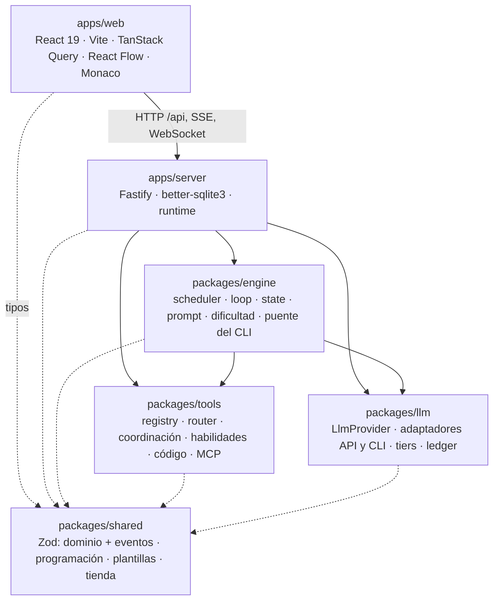
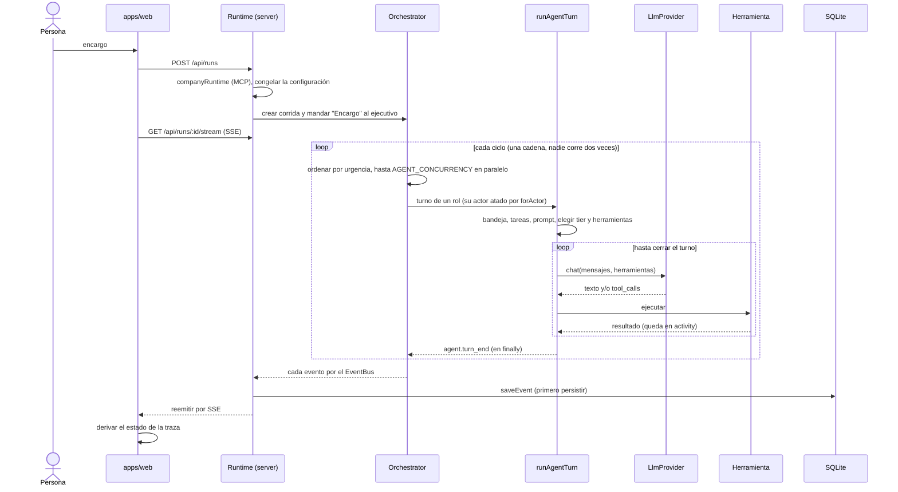
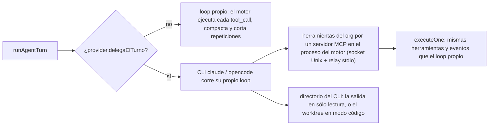
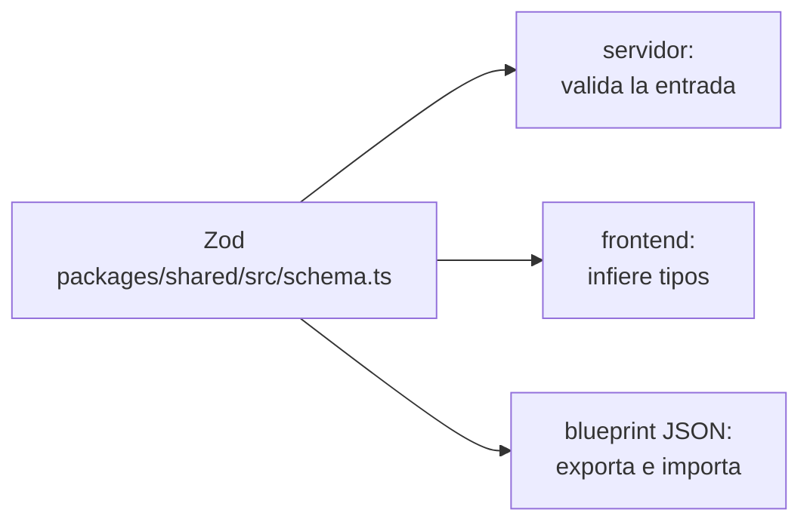

# Arquitectura general

El Orquestador Agéntico es un monorepo de TypeScript que corre **en la máquina de
una persona**, para un solo usuario. Un **motor** hace trabajar a agentes LLM
organizados como una empresa; una **capa LLM** los conecta con proveedores por
API o delega el turno entero a un CLI de suscripción; un **registro de
herramientas** les da coordinación, producción de documentos y video, código,
teléfono y servidores MCP; un **servidor** Fastify sostiene lo que está vivo,
persiste en SQLite y en disco y lo transmite por SSE; y una **UI** React deriva
lo que muestra de la traza de eventos. Esta es la nota de entrada: da el mapa y
enlaza a todo.

## Los paquetes y quién depende de quién

La flecha que **no** existe es la importante: `packages/engine` no importa nada
de Fastify, SQLite ni `apps/server`. Recibe todo inyectado —proveedores
(`ProviderRegistry`), persistencia (`Persistence` de `RunState`), el
`ToolRegistry` de la empresa, el `EventBus`, y funciones como `dirDeTrabajo`,
`codigo.abrirTurno`, `mapaDeContexto`, `fechaHoy` y `onRunUpdate`—, y por eso los
tests del motor corren con `FakeProvider` y `noPersistence`. Ver
[[ADR-003 Motor desacoplado del servidor]] e [[Invariantes de arquitectura]].
Los `packages/` no se compilan: su `exports` apunta a `src/index.ts`. Archivo por
archivo en [[Mapa del monorepo]].

## Qué vive dónde

| Dónde | Qué | Sobrevive a un reinicio | Nota |
|---|---|---|---|
| Memoria del servidor | runtime de cada empresa (registro de herramientas, procesos MCP, salud), corridas activas (`RunState`, `Orchestrator`, bus, ledger), arriendos de código, servicios de la vista previa, espejos del teléfono | no | [[Runtime del servidor]] |
| SQLite (`data/orquestador.db`) | configuración, corridas y su traza, mensajes, tareas, entregables, memoria, solicitudes, misiones, repos y sesiones | sí | [[Persistencia y esquema SQL]] |
| Disco (`data/proyectos/<Nombre>/`) | salida, clones, worktrees, temporales | sí | [[Directorios en disco]] |
| Disco (`data/contexto/`) | el vault de Obsidian de cada empresa | sí | [[Vault de contexto]] |

Una **corrida no sobrevive a un reinicio**: su traza sí, así que se puede
reproducir pero no continuar. Al arrancar, `sanearCorridasHuerfanas` cierra las
que quedaron marcadas como vivas, y el trabajo abierto lo hereda la próxima
corrida de la empresa ([[Supervisión y continuidad]]).

## Procesos y puertos

| Proceso | Dónde | Nota |
|---|---|---|
| Servidor Fastify | `127.0.0.1:3001` (`PORT`), sólo loopback | [[API HTTP y SSE]] |
| UI de Vite (desarrollo) | `5173`, `strictPort`; proxea `/api` y el WebSocket | [[Frontend web]] |
| Servidores MCP | procesos hijos `stdio` o conexiones HTTP, por empresa | [[Integración MCP]] |
| CLIs `claude` / `opencode` | un proceso por turno delegado | [[Turnos delegados a un CLI]] |
| Servicios de la vista previa | puertos 4300–4399 públicos, 4400–4499 internos | [[Servicios del monorepo]], [[Vista previa y proxy]] |
| ffmpeg, Chrome por CDP, Kokoro | por cada exportación de video o lámina | [[Producción audiovisual]], [[Dependencias del sistema]] |
| adb, scrcpy | el teléfono vinculado por Wi-Fi | [[App móvil en el teléfono]] |
| git, comandos en `sandbox-exec` | por cada operación de código | [[Git endurecido]], [[Comandos y sandbox]] |
| Afuera | APIs de proveedores, webhook de n8n, R2 | [[Capa LLM y tiers]], [[Correo y avisos]], [[Almacenamiento R2]] |

## Flujo completo de una corrida

Detalle: [[Scheduler y ciclo de una corrida]], [[Motor de agentes]],
[[Estado de una corrida]], [[Prompt de un turno]], [[Escalado por dificultad]].

## Dos formas de correr un turno

Los proveedores por API (`anthropic`, `claude-sesion`, `openrouter`, `openai`,
`nvidia`, `ollama`) devuelven `tool_calls` y el motor las ejecuta. Los que
**delegan** (`claude-code`, `opencode`) corren su loop y el motor ve una sola
iteración: por eso lo que entra al turno se acota en la puerta (`acotar.ts`) y
el puente cuenta y frena sus llamadas. Ver [[Turnos delegados a un CLI]],
[[Capa LLM y tiers]] y la carpeta de proveedores: [[Proveedor claude-code]],
[[Proveedor opencode]], [[Proveedor Anthropic y claude-sesion]],
[[Proveedor OpenRouter]], [[Proveedores OpenAI, NVIDIA y Ollama]].

## De dónde sale cada herramienta

| Origen | Qué | Se registra en | Se otorga |
|---|---|---|---|
| `coordination` | mensajes, tareas, entregables, memoria, solicitudes, contexto, estado del proceso | constructor de `ToolRegistry` y `companyRuntime` | siempre |
| `capability` | búsqueda web, fetch, correo | `ToolRegistry` y `companyRuntime` | por `toolIds` |
| `skill` | documentos, deck, video, imágenes, código, R2, teléfono | `companyRuntime` (las que no se pueden cumplir no se registran) | por `toolIds` |
| `mcp` | lo que descubre cada servidor | `McpBridge` | por `toolIds` |
| `creada` | compuestas por un agente | `companyRuntime` desde la base | por `toolIds` |

El router elige qué opcionales ve cada turno; coordinación y habilidades van
siempre. Ver [[Herramientas y tool router]], [[Catálogo de herramientas]],
[[Referencia de herramientas]], [[Herramientas compuestas]], [[Tienda MCP]] y
[[OAuth para servidores MCP]].

## El trabajo con código

Una persona carga código (carpeta local o URL git) y el equipo trabaja sobre un
**clon gestionado** y un **worktree** por repo que sobrevive a la corrida, en la
rama del proyecto. Uno escribe por vez (el **arriendo**); los comandos pasan por
una allowlist y un sandbox; cada turno deja instantáneas para ver y deshacer; los
agentes no commitean: la persona prepara, commitea y publica. El IDE (Monaco) es
el mismo worktree, con chat de IA, vista previa de cada servicio del monorepo y
selector de elementos. Puerta: [[Trabajo con código]] y [[El IDE]].

## El teléfono

Un celular Android se vincula por QR de depuración inalámbrica; el espejo es
scrcpy por un WebSocket con el video hacia el navegador y los toques de vuelta;
los agentes tienen herramientas acotadas a la app del repo (logs, base,
capturas, QA manejando la app), y la persona arma el AAB de producción
verificado. Puerta: [[App móvil en el teléfono]].

## La UI

React con router: `/proyectos`, `/proveedores` y `/p/:companyId/<sección>`
(proceso, tablero, empresa, solicitudes, tienda, mcp, código, salida, memoria,
costos). Tres canales SSE —traza de una corrida, salud MCP, eventos de código— y
un WebSocket para el espejo. **La traza no se sondea**: la UI deriva el estado
de los eventos, y "ver en vivo" y "retroceder en el timeline" son la misma
operación. Lo que vive en disco (el árbol de la salida, el explorador del IDE) sí
se consulta periódicamente. Ver [[Frontend web]] y
[[Sistema de diseño y temas]].

## Eventos: la columna vertebral

Todo lo que pasa emite un evento: el motor al `EventBus`, el servidor lo
**persiste primero** en `events` (con `seq`) y **después** lo reemite; si
persistir falla, tampoco se reemite. Un paso sin evento es un paso invisible: se
agrega la variante en `packages/shared/src/events.ts`. Lo que pasa fuera de una
corrida (cargar un repo, integrar) va por el canal de código, porque la traza
exige un `runId`. Ver [[Observabilidad y trazas]], [[Referencia de eventos]] y
[[Cómo agregar un evento]].

## Frontera de datos

Un campo nuevo se agrega **primero** en `schema.ts`; los dos lados infieren de
ahí. Ver [[ADR-002 Zod como única fuente de verdad]], [[Modelo de dominio]] y
[[Referencia de esquemas]].

## Mapa de notas

| Área | Notas |
|---|---|
| Producto | [[Visión del producto]] · [[Problema y público]] · [[Estado del producto]] · [[Hoja de ruta]] |
| Arquitectura | [[Invariantes de arquitectura]] · [[Mapa del monorepo]] · [[Modelo de dominio]] · [[Decisiones de arquitectura]] |
| Motor | [[Motor de agentes]] · [[Scheduler y ciclo de una corrida]] · [[Estado de una corrida]] · [[Prompt de un turno]] · [[Escalado por dificultad]] · [[Turnos delegados a un CLI]] |
| LLM | [[Capa LLM y tiers]] · [[Costos y presupuesto]] · [[Cómo agregar un proveedor LLM]] |
| Herramientas y MCP | [[Herramientas y tool router]] · [[Integración MCP]] · [[Catálogo de herramientas]] · [[Tienda MCP]] · [[Referencia de la tienda MCP]] |
| Servidor | [[Runtime del servidor]] · [[API HTTP y SSE]] · [[Directorios en disco]] · [[Persistencia y esquema SQL]] · [[Referencia de API]] · [[Referencia de API de código y móvil]] |
| Organización | [[Organización de agentes]] · [[Coordinación entre agentes]] · [[Memoria de la empresa]] · [[Aprobaciones y solicitudes]] · [[Especialistas convocados]] · [[Entregables]] · [[Auditoría de corridas]] · [[Plantillas de equipo]] |
| Producción | [[Habilidades de producción]] · [[Documentos Word y PDF]] · [[Deck de slides]] · [[Archivos de salida y permisos de borrado]] · [[Producción audiovisual]] · [[Guion como línea de tiempo]] |
| Código e IDE | [[Trabajo con código]] · [[Repositorios y sesiones]] · [[Control de versiones y publicación]] · [[El IDE]] · [[Chat de IA]] |
| Móvil | [[App móvil en el teléfono]] · [[Espejo del teléfono]] · [[QA móvil]] · [[Build de producción Android]] |
| Plataforma | [[Gestión de proyectos]] · [[Salida de la empresa]] · [[Misiones programadas]] · [[Limpieza y mantenimiento]] · [[Correo y avisos]] |
| Pantallas | [[Pantalla Proyectos]] · [[Pantalla Proceso en vivo]] · [[Pantalla Empresa y organigrama]] · [[Pantalla Salida]] · [[Pantalla Hub MCP]] |
| Operación | [[Instalación y arranque]] · [[Variables de entorno]] · [[Comandos]] · [[Diagnóstico de problemas]] · [[Pruebas y calidad]] · [[Seguridad]] · [[Base de datos]] |
| Contribuir | [[Guía de contribución]] · [[Trampas conocidas]] · [[Cómo agregar una herramienta]] · [[Cómo agregar una habilidad]] |

## Fuentes

- `apps/server/src/index.ts`, `app.ts`, `runtime.ts`, `routes.ts`, `rutas-codigo.ts`, `db.ts`, `exports.ts`, `directorios.ts`
- `packages/engine/src/scheduler.ts` → `Orchestrator`; `loop.ts` → `runAgentTurn`; `state.ts` → `RunState`; `events.ts` → `EventBus`; `claude-mcp.ts` → `createClaudeMcpBridge`
- `packages/llm/src/types.ts` → `LlmProvider` (`delegaElTurno`); `registry.ts` → `buildRegistry`
- `packages/tools/src/registry.ts` → `ToolRegistry`; `mcp/bridge.ts` → `McpBridge`
- `apps/web/src/App.tsx`, `lib/stream.ts`, `vite.config.ts`

## Ver también

- [[Invariantes de arquitectura]] — las reglas que no se rompen
- [[Decisiones de arquitectura]] — por qué es así y no de otra forma
- [[Trampas conocidas]] — lo que ya salió mal
