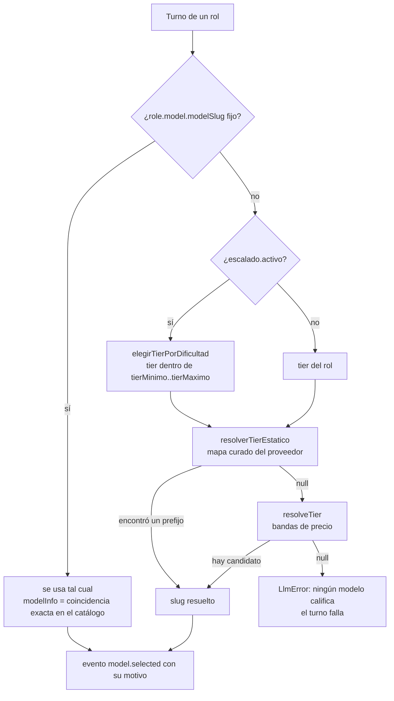

# Capa LLM y tiers

`packages/llm` es la única parte del sistema que habla con un modelo. Define un
**formato de conversación neutro** (`types.ts`), un contrato que cumple todo
proveedor (`LlmProvider`) y un registro que sabe qué adaptadores existen
(`registry.ts`). El motor sólo conoce la interfaz: cambiar de OpenRouter a
Anthropic, o a una suscripción que corre por CLI, es configuración y no una
reescritura.

Existe por un requisito de producto: **cada rol elige su proveedor y su modelo
por separado**. Un ejecutor de triage no tiene por qué pagar lo mismo que el rol
que descompone el encargo. Ese requisito es lo que descartó el Claude Agent SDK
(atado a una sola familia de modelos): ver [[ADR-001 No usar Claude Agent SDK]].

## Mapa del paquete

| Archivo | Qué tiene |
|---|---|
| `packages/llm/src/types.ts` | formato neutro (`ChatMessage`, `ToolCall`, `ChatRequest`, `ChatEvent`…), `LlmProvider`, `LlmError`, `collect` |
| `packages/llm/src/registry.ts` | `ProviderRegistry`, `buildRegistry(env)`, `ProviderEnv` |
| `packages/llm/src/tiers.ts` | bandas de precio, `blendedPrice`, `QUALITY_HINTS`, `resolveTier`, `resolveAllTiers` |
| `packages/llm/src/modelos-claude.ts` | precios curados de Claude (`PRECIOS_CLAUDE`), mapa tier → modelo (`TIERS_ESTATICOS`), `resolverTierEstatico`, `resolverTodosLosTiers` |
| `packages/llm/src/ledger.ts` | `computeCost`, `RunLedger`, `BudgetExceededError` |
| `packages/llm/src/adapters/*.ts` | un adaptador por proveedor, más `openai-shared.ts` y el relay `claude-code-relay.mjs` |
| `packages/llm/src/index.ts` | reexporta todo lo anterior; es lo único que importa el resto del monorepo (`@orq/llm`) |

El paquete no se compila: su `exports` apunta a `./src/index.ts` y lo consumen
`tsx` y Vite directo (ver [[Mapa del monorepo]]).

## Los ocho proveedores

| `providerId` | Clase | Cómo se prende | ¿Delega el turno? | Tiers por | Costo en el ledger | Nota |
|---|---|---|---|---|---|---|
| `openrouter` | `OpenRouterProvider` | `OPENROUTER_API_KEY` | no | bandas de precio | **informado** por la API | [[Proveedor OpenRouter]] |
| `anthropic` | `AnthropicProvider` | `ANTHROPIC_API_KEY` | no | mapa curado | estimado con precio de lista | [[Proveedor Anthropic y claude-sesion]] |
| `claude-sesion` | `ClaudeSesionProvider` | `ORQ_CLAUDE_SESION` + token de `ant` | no | mapa curado | estimado con precio de lista | [[Proveedor Anthropic y claude-sesion]] |
| `claude-code` | `ClaudeCodeProvider` | `ORQ_CLAUDE_CODE` + CLI `claude` logueado | **sí** | mapa curado | 0 (suscripción) | [[Proveedor claude-code]] |
| `opencode` | `OpenCodeProvider` | `ORQ_OPENCODE` + CLI `opencode` autenticado | **sí** | mapa curado | 0, o el informado con `ORQ_OPENCODE_COSTO` | [[Proveedor opencode]] |
| `openai` | `OpenAiProvider` | `OPENAI_API_KEY` | no | ninguno | 0 (sin precios) | [[Proveedores OpenAI, NVIDIA y Ollama]] |
| `nvidia` | `NvidiaProvider` | `NVIDIA_API_KEY` | no | ninguno | 0 (sin precios) | [[Proveedores OpenAI, NVIDIA y Ollama]] |
| `ollama` | `OllamaProvider` | `OLLAMA_BASE_URL` | no | ninguno | 0 (local) | [[Proveedores OpenAI, NVIDIA y Ollama]] |

La lista de ids vive primero en Zod: `packages/shared/src/schema.ts` →
`providerIdSchema` ([[ADR-002 Zod como única fuente de verdad]]).

## La interfaz `LlmProvider`

`packages/llm/src/types.ts` → `LlmProvider`. Es todo lo que el motor sabe de un
proveedor:

| Miembro | Tipo | Para qué |
|---|---|---|
| `id` | `ProviderId` | con este id lo pide un rol (`role.model.providerId`) |
| `label` | `string` | nombre legible para la UI y los mensajes de error |
| `timeoutMs?` | `number` | cuánto puede tardar una llamada; manda sobre el default del motor. Lo declaran los que delegan a un CLI |
| `timeoutCodigoMs?` | `number` | el corte cuando el turno trabaja sobre un repo |
| `delegaElTurno?` | `boolean` | corre su **propio** agent loop y no devuelve `tool_calls`: el motor le presta el puente MCP del org |
| `listModels(refresh?)` | `Promise<ModelInfo[]>` | catálogo con precios; se cachea en la instancia y `refresh` lo recarga |
| `healthCheck()` | `Promise<{ ok, detail }>` | verifica credencial y conectividad |
| `chat(req)` | `AsyncIterable<ChatEvent>` | una llamada al modelo, en streaming |

`delegaElTurno` es una propiedad del proveedor y no una lista de ids en el motor
a propósito: sumar un CLI más no puede obligar a tocar `loop.ts`
(`packages/engine/src/loop.ts` → `runAgentTurn` sólo pregunta
`provider.delegaElTurno`).

### El formato neutro

Ni el motor ni las herramientas conocen el formato de ningún proveedor. Cada
adaptador traduce en su borde.

| Tipo | Campos | Notas |
|---|---|---|
| `ChatMessage` | `role` (`system`/`user`/`assistant`/`tool`), `content`, `toolCalls?`, `toolCallId?`, `name?` | `toolCalls` sólo en `assistant`; `toolCallId` y `name` sólo en `tool` |
| `ToolCall` | `id`, `name`, `arguments` (objeto ya parseado) | si el JSON llegó cortado, los adaptadores devuelven `{ __raw: "…" }` y la validación de la herramienta le devuelve al agente un error corregible |
| `ToolDefinition` | `name`, `description`, `inputSchema` (JSON Schema) | lo que se le ofrece al modelo |
| `ChatRequest` | `model`, `messages`, `tools?`, `temperature?`, `maxOutputTokens?`, `webSearch?`, `routing?`, `orgTools?`, `signal?` | ver abajo |
| `TokenUsage` | `inputTokens`, `outputTokens`, `cachedInputTokens?`, `reportedCostUsd?` | `reportedCostUsd` es lo que el proveedor dice que cobró |
| `FinishReason` | `stop`, `tool_calls`, `length`, `content_filter`, `error` | |
| `ChatEvent` | `text_delta` · `tool_call` · `done` | `done` lleva `message`, `usage`, `finishReason`, `modelSlug` (el que respondió de verdad) y opcionales `herramientasPropias`, `avisos` |
| `ChatResult` | lo mismo que `done`, sin el `type` | lo arma `collect()` |
| `HerramientaPropia` | `nombre`, `ruta` | lo que un CLI delegado hizo con **sus** herramientas (`Edit`, `Read`…) |
| `LlmError` | `message`, `providerId`, `retryable`, `cause?` | el motor reintenta sólo lo `retryable` |

Campos de `ChatRequest` que no son obvios:

- **`temperature`**: `null` o ausente es "el default del proveedor". El adaptador
  de Anthropic la omite siempre (los modelos Claude actuales devuelven 400 con
  parámetros de sampling).
- **`webSearch`**: búsqueda nativa del proveedor. Sólo la usa OpenRouter (plugin
  `web`); el motor la prende únicamente cuando `provider.id === "openrouter"` y
  el rol tiene la herramienta `web_search`, que en ese caso se retira del
  catálogo expuesto para que el modelo no la llame en vano.
- **`routing`**: preferencia de ruteo entre upstreams (`price`, `throughput`,
  `latency`). Hoy el motor no la pasa nunca y OpenRouter usa `price`, que es
  determinista. Ver [[Proveedor OpenRouter]].
- **`orgTools`**: el puente a las herramientas de la organización para los
  proveedores que delegan. `OrgToolsBridge.open()` devuelve una
  `OrgToolsSession` (`socketPath`, `serverName`, `allowedTools`, `cwd?`,
  `codigo?`, `ocupada?()`, `close()`). Lo implementa el motor
  (`packages/engine/src/claude-mcp.ts`); el paquete LLM sólo define el contrato.
  Ver [[Turnos delegados a un CLI]].
- **`signal`**: el corte. Todo adaptador **tiene** que pasárselo al SDK o al
  proceso: es lo único que evita que un proveedor callado cuelgue la corrida.

`collect(stream, onText?)` drena el stream, reenvía cada `text_delta` a
`onText` y devuelve el `ChatResult` del `done`. Si el stream termina sin `done`,
tira.

## El registro

`packages/llm/src/registry.ts` → `ProviderRegistry`: `register`, `has`, `get`
(tira un `LlmError` no reintentable que nombra los configurados), `list`,
`resolveModel` y `allModels(refresh)` (el catálogo unificado para el selector de
la UI; un proveedor que falla se omite en silencio por `Promise.allSettled`).

`buildRegistry(env)` construye el registro desde el entorno. **Un proveedor sin
credencial no se registra**: la UI lo muestra como no configurado en vez de
fallar al arrancar, y pedirlo después da un error que dice qué hacer.

| Se registra | Condición |
|---|---|
| `openrouter` | `OPENROUTER_API_KEY` no vacía (más `APP_URL` y `APP_TITLE` opcionales, de atribución) |
| `anthropic` | `ANTHROPIC_API_KEY` no vacía |
| `openai` | `OPENAI_API_KEY` no vacía |
| `ollama` | `OLLAMA_BASE_URL` no vacía |
| `nvidia` | `NVIDIA_API_KEY` no vacía |
| `claude-sesion` | interruptor `ORQ_CLAUDE_SESION`; usa `ANTHROPIC_AUTH_TOKEN` si está |
| `claude-code` | interruptor `ORQ_CLAUDE_CODE` (más `CLAUDE_CODE_MODEL`, `CLAUDE_CODE_WORKDIR`) |
| `opencode` | interruptor `ORQ_OPENCODE` (más `OPENCODE_COMMAND`, `OPENCODE_MODEL`, `OPENCODE_WORKDIR`, `ORQ_OPENCODE_COSTO`) |

Los interruptores pasan por `esVerdadero`: aceptan `1`, `true`, `si` y `sí`, sin
distinguir mayúsculas y con espacios alrededor. Son interruptores y no
credenciales porque la credencial vive fuera del `.env` (el perfil de `ant`, el
login del CLI): adivinar si hay sesión husmeando directorios es frágil, y un
proveedor que aparece configurado y falla en la primera corrida es peor que uno
que no aparece.

> [!danger] Una `ANTHROPIC_API_KEY` vacía
> Con `ORQ_CLAUDE_SESION` prendido, `buildRegistry` **borra** del entorno una
> `ANTHROPIC_API_KEY` vacía (`delete process.env["ANTHROPIC_API_KEY"]`). El SDK
> la tomaría igual y autenticaría en blanco: la sesión no se usaría nunca y el
> error sería un 401 sin explicación. `.env.example` la trae vacía, así que
> copiarlo encima basta para caer acá. Detalle en
> [[Proveedor Anthropic y claude-sesion]].

El servidor arma el registro **una sola vez**, al arrancar
(`apps/server/src/index.ts` → `buildRegistry(process.env)`, con el `.env` cargado
por `tsx --env-file-if-exists`). Cambiar una variable exige reiniciar el
servidor. Los scripts `check:llm` y `check:models` arman el suyo.

## Cómo se elige el modelo de un turno

Todo pasa al principio de `runAgentTurn` (`packages/engine/src/loop.ts`), antes
de la primera llamada:



1. **Un `modelSlug` fijo gana siempre** y apaga el escalado. `resolveModel` busca
   ese slug **exacto** en el catálogo para tener su precio; si no está (un alias
   sin fecha, un modelo que el catálogo filtra), `modelInfo` queda `undefined` y
   la llamada se valoriza en 0 salvo que el proveedor informe su costo.
2. Con `escalado.activo`, el tier del turno lo decide la dificultad medida
   (bandeja, tareas, largo del contexto, autoridad, reanudación y fallos
   consecutivos). Ver [[Escalado por dificultad]].
3. `ProviderRegistry.resolveModel` prueba primero el **mapa curado**
   (`resolverTierEstatico`) y, si no aplica, las **bandas de precio**
   (`resolveTier`). Si ninguno encuentra candidato, tira
   `Ningún modelo de <proveedor> califica para el tier "<tier>". Elegí un modelo
   explícito para este rol desde la UI.`
4. Todo turno emite `model.selected` (`roleId`, `providerId`, `modelSlug`,
   `tier` —`null` si el slug estaba fijo—, `escalado`, `motivo`). Un costo que
   varía entre turnos tiene que poder explicarse mirando la traza.

Quién arma el `ModelSelection` de los agentes nuevos:

- **Proveedor preferido** (`apps/server/src/runtime.ts` →
  `Runtime.proveedorPreferido`): el primero configurado de
  `claude-sesion > anthropic > claude-code > opencode > openrouter`, y si no hay
  ninguno de esos, el primero del registro. Los Claude van primero porque sus
  tiers resuelven por el mapa curado sin fijar slugs. Lo usan
  `generarEquipo` ([[Plantillas de equipo]]), el generador de mensajes de commit
  (tier `cheap`) y el alta del Mejorador de código.
- **Escalado acotado por autoridad** (`conEscaladoPorAutoridad`, mismo archivo):
  `executive` escala entre `standard` y `smart`; el resto entre `cheap` y
  `standard`; una empresa en `free` queda en `free..free` porque escalar a un
  modelo pago iría derecho a un 402. Lo reciben los convocados y los roles
  aprobados ([[Especialistas convocados]]).
- Una plantilla puede preferir proveedor: `desarrollo-software` pide
  `claude-code`, luego `claude-sesion`, luego `anthropic`
  (`packages/shared/src/plantillas.ts`).

### Qué tiers resuelve cada proveedor

Es la tabla que conviene mirar antes de asignar un tier:

| Proveedor | Resuelve por | `free` | `cheap` | `standard` | `smart` |
|---|---|---|---|---|---|
| `openrouter` | bandas | lo gratuito con tools y ≥32k | sí | sí | sí |
| `anthropic`, `claude-sesion` | mapa curado | **no** | Haiku 4.5 → 3.5 Haiku | Sonnet 5 → Sonnet 4 | Opus 5 → Opus 4.5 → Opus 4 |
| `claude-code` | mapa curado | **no** | `claude-code/haiku` | `claude-code/sonnet` | `claude-code/opus` |
| `opencode` | mapa curado | los `-free` de Zen | Haiku 4.5 por Zen, Anthropic o Copilot | Sonnet 5 por las mismas | Opus 5 por las mismas |
| `openai` | — | no | no | no | no |
| `nvidia` | — | no | no | no | no |
| `ollama` | — | no | no | no | no |

OpenAI y NVIDIA no publican precios ni contexto; Ollama publica precio 0 pero
contexto 0, que no llega al mínimo de 32k que pide `free`. Con esos tres el rol
**tiene** que fijar su `modelSlug`.

> [!danger] Un equipo generado sobre OpenAI, NVIDIA u Ollama no arranca
> `generarEquipo` y `conEscaladoPorAutoridad` arman los roles con
> `modelSlug: null` y escalado por tier. Si el único proveedor configurado es uno
> de esos tres, `proveedorPreferido` cae en él y **cada turno falla** con "Ningún
> modelo de … califica para el tier …". A los tres ciclos sin un turno completado
> la corrida termina `failed`. La salida es fijar un slug en cada rol desde
> Empresa, o configurar un proveedor con tiers.

## Las bandas de precio

`packages/llm/src/tiers.ts` → `resolveTier(models, tier)`. La resolución es por
**precio real del catálogo**, no por una lista de slugs, así que un modelo nuevo
entra solo. Es la vía de OpenRouter, y el respaldo de todos los demás cuando el
mapa curado no aplica.

| Tier | Banda (`PRICE_BAND_USD_PER_MTOK`) | Condición de precio | Contexto mínimo (`MIN_CONTEXT`) | Criterio de orden |
|---|---|---|---|---|
| `free` | `{ min: -1, max: 0 }` | exactamente 0 | 32.000 | mejor puntaje; entre pares, más contexto |
| `cheap` | `{ min: 0, max: 1.0 }` | > 0 y ≤ 1 | 32.000 | **más barato**; entre pares, mejor puntaje |
| `standard` | `{ min: 1.0, max: 8.0 }` | > 1 y ≤ 8 | 128.000 | mejor puntaje; entre pares, más barato |
| `smart` | `{ min: 8.0, max: 25.0 }` | > 8 y ≤ 25 | 128.000 | mejor puntaje; entre pares, más barato |

Un modelo es elegible si `supportsTools`, llega al contexto mínimo, tiene precio
(de entrada **y** de salida) y cae en la banda. Fuera de `free` se excluye lo
gratuito: sus límites de uso cortan corridas largas sin avisar.

Las bandas son **disjuntas** por dos razones: sin piso, `standard` y `smart`
resuelven al mismo modelo; sin techo, `smart` elige lo más caro del catálogo
—hay opciones a US$60/MTok— y un turno se come el presupuesto. Ver
[[ADR-004 Bandas de precio disjuntas]].

### Precio mezclado

```ts
blendedPrice = inputPricePerMTok * 0.8 + outputPricePerMTok * 0.2
```

La proporción es la de un agente: mucho contexto de entrada (historial,
herramientas, bandeja) y salidas cortas. Sin precio de entrada o de salida,
`blendedPrice` devuelve `null` y el modelo no califica.

### Desempate: `QUALITY_HINTS`

Es la única parte curada de las bandas y se edita sin tocar nada más. Suma por
cada patrón que aparece en el slug:

| Patrón | Puntos | Motivo |
|---|---|---|
| `/claude/i`, `/gpt-[5-9]/i` | +3 | buen seguimiento de instrucciones y tool-calling |
| `/gemini/i`, `/deepseek/i` | +2 | |
| `/qwen/i`, `/llama/i` | +1 | |
| `/preview\|alpha\|beta/i` | −2 | |
| `/[-:]fast$/i` | **−6** | cobran el doble por generar más rápido, no por ser mejores; en una empresa que corre sola la latencia no es el cuello de botella |
| `/:free$/i` | **−10** | límites agresivos que cortan corridas largas. Dentro del tier `free` se ignora (el patrón contiene `free`): ahí son todos gratis y no discrimina |

Más un bonus por contexto acotado a 2 puntos:
`Math.min(contextLength / 400_000, 2)`. Un modelo mediocre con ventana enorme no
le puede ganar a uno bueno.

`resolveTier` devuelve un `TierResolution` (`model`,
`blendedPriceUsdPerMTok`, `reason` legible) o `null`: nunca cae en un modelo
arbitrario. `resolveAllTiers` resuelve los cuatro de una vez por bandas; hoy
nadie la usa, porque la pantalla y `check:models` usan `resolverTodosLosTiers`.

## El mapa curado para proveedores de una familia

`packages/llm/src/modelos-claude.ts`. Existe porque las bandas no sirven para un
catálogo de una sola familia: con precios reales, Haiku (US$1,80 mezclado) y
Sonnet (US$5,40) caen **los dos** en `standard`, `cheap` queda vacío y
`standard` es ambiguo. Y los proveedores sin precio (los CLI) no resolverían un
solo tier.

`resolverTierEstatico(providerId, tier, models)` mira `TIERS_ESTATICOS`: por
proveedor y por tier, una **lista de prefijos en orden de preferencia**. Gana el
primero que aparezca en el catálogo vivo, y entre varios snapshots del mismo
prefijo, el slug lexicográficamente más alto (el sufijo es una fecha
`AAAAMMDD`). No filtra por `supportsTools` ni por contexto: el mapa ya es una
decisión. Devuelve `null` si el proveedor no está en el mapa o si ningún
prefijo existe, y el registro cae en las bandas.

`resolverTodosLosTiers(providerId, models)` hace lo mismo para los cuatro tiers
con el mapa adelante: es lo que muestran `GET /api/providers` y `check:models`,
así la pantalla enseña la misma elección que va a hacer el motor.

La tabla de precios (`PRECIOS_CLAUDE`) y `enriquecerConPreciosClaude` completan
el catálogo de Anthropic, que viene sin precios; el detalle está en
[[Proveedor Anthropic y claude-sesion]]. Los prefijos de `opencode` cruzan
credenciales (Zen, Anthropic, Copilot): ver [[Proveedor opencode]].

## El ledger, en corto

`packages/llm/src/ledger.ts`. Detalle operativo en [[Costos y presupuesto]].

- `computeCost(modelInfo, usage)`: si el proveedor informó `reportedCostUsd`,
  eso manda (`informado: true`); si no, tokens × precio del catálogo; sin precio,
  0 con `priced: false`. Un costo informado de 0 es 0, no "sin dato".
- `RunLedger(budgetUsd, onRecord)`: acumula `spentUsd`, expone `exhausted` y
  `assertWithinBudget()`, que tira `BudgetExceededError`. El motor lo llama
  **antes de cada iteración** del loop.
- El servidor crea un ledger por corrida y persiste cada entrada en la tabla
  `ledger` (`apps/server/src/runtime.ts` → `Runtime.startRun`, vía
  `Store.saveLedgerEntry`).

## Cortes por tiempo y reintentos

Lo aplica el motor, con lo que el proveedor declara:

```ts
const timeoutMs =
  (codigo?.dir ? provider.timeoutCodigoMs : undefined) ??
  provider.timeoutMs ??
  deps.llmTimeoutMs ??
  120_000;
```

El servidor no inyecta `llmTimeoutMs`, así que las APIs cortan cada intento a los
**120 s**. El corte se combina con el stop de la persona (`AbortSignal.any`).

`withRetry` (`packages/engine/src/loop.ts`) hace hasta **4 intentos** con
esperas de 2, 4 y 8 s (tope teórico 20 s) y reintenta sólo si el error es un
`LlmError` con `retryable: true` o un corte **nuestro** por tiempo (se reconoce
por nombre `AbortError`/`TimeoutError` o por el texto `abort|timed out`). Un
stop de la persona no se reintenta nunca.

| Proveedor | Corte por intento | Qué marca como reintentable |
|---|---|---|
| `openrouter`, `anthropic`, `claude-sesion`, `openai`, `nvidia` | 120 s | HTTP 429 y ≥500 |
| `ollama` | 120 s | **todo** error |
| `claude-code` | 600 s (turno de código: 1.500 s) | nada: el corte tampoco, porque su mensaje no contiene `abort` ni `timed out` |
| `opencode` | 1.200 s (reloj interno del adaptador) | nada |

Además, los SDK de Anthropic y de OpenAI traen su propio reintento (2 por
defecto) y su propio corte (10 minutos) que los adaptadores no tocan: un 429 se
reintenta primero adentro del SDK y recién después en el motor.

Si **todos** los turnos de un ciclo fallan tres ciclos seguidos
(`TICKS_FALLIDOS_TOLERADOS = 3` en `packages/engine/src/scheduler.ts`), la
corrida termina `failed` nombrando el último error; entre ciclo fallido y ciclo
fallido espera 30, 60 y 120 s (`ORQ_ESPERA_PROVEEDOR_MS`). Es lo que evita que
una cuenta sin crédito queme los 50 ciclos en un minuto. Ver
[[Scheduler y ciclo de una corrida]].

## Caché de prefijo

Dentro de un turno la conversación crece pero su prefijo no cambia, así que casi
todo se puede servir cacheado y cuesta cerca de diez veces menos. El comentario
de `TokenUsage.cachedInputTokens` lo mide: US$0,0022 contra US$0,068 por la
misma llamada.

| Adaptador | Cómo marca el caché |
|---|---|
| `anthropic`, `claude-sesion` | `cache_control` en el system, en la última herramienta y en el último bloque de la conversación (`splitSystem`) |
| `openrouter` | `cache_control` por bloque en el system y en el último mensaje (`toOpenAiMessagesConCache`); OpenRouter lo traduce al mecanismo de cada proveedor final. Sin marcas se midieron 999.718 tokens reenviados sin uno solo cacheado |
| `openai`, `nvidia`, `ollama` | nada |
| `claude-code`, `opencode` | lo maneja el CLI; el adaptador sólo lee cuánto se cacheó |

## Integración

| Pieza | Qué hace con esta capa |
|---|---|
| `packages/engine/src/loop.ts` → `runAgentTurn` | resuelve el modelo, llama `chat`, valoriza con `computeCost`, registra en el ledger, emite eventos, vuelca `avisos` como `log` y cuenta `herramientasPropias` |
| `packages/engine/src/scheduler.ts` | corta la corrida con `BudgetExceededError` y tras tres ciclos sin turnos ok |
| `GET /api/providers` | por cada proveedor: `healthCheck()`, catálogo y `resolverTodosLosTiers` ([[Referencia de API]]) |
| `GET /api/models?refresh=true` | catálogo unificado (`allModels`) para el selector de modelo |
| Eventos | `model.selected`, `agent.thinking`, `cost.updated`, `log` ([[Referencia de eventos]]) |
| UI | `/proveedores` (componente `Providers` en `apps/web/src/routes/Settings.tsx`) muestra salud y tiers resueltos; `/p/:companyId/costos` el gasto ([[Pantalla Configuración]]) |

> [!warning] Abrir la pantalla de proveedores corre turnos reales
> `GET /api/providers` llama `healthCheck()` de cada proveedor, y el de
> `claude-code` y el de `opencode` **delegan un turno de verdad** ("Respondé
> únicamente con la palabra: ok"). Cada visita consume la suscripción, tarda
> varios segundos y deja una carpeta `turno-…` nueva en el directorio de trabajo
> del CLI. En los de API, además, el health check recarga el catálogo.

## Advertencias de uso

> [!warning] `cheap` no sirve para roles que coordinan
> Elige por precio, y el modelo más barato puede no tener capacidad agéntica
> aunque soporte tool-calling. Medido: el CEO con un modelo de US$0,014/MTok
> **se fue a descargar PDFs al azar en vez de delegar**; el mismo rol en
> `standard` repartió el trabajo a las cuatro direcciones. Usá `cheap` para
> ejecutores; el escalado por autoridad ya lo respeta (un `executive` no baja de
> `standard`).

> [!warning] `free` funciona, pero es frágil
> Una corrida de 4 ciclos produjo un entregable coherente por US$0,00 con
> modelos gratuitos de OpenRouter. Pero 429 y 402 son habituales: el motor
> reintenta con backoff y un agente que falla pierde su turno sin detener la
> empresa. **Con saldo negativo en la cuenta, OpenRouter contesta 402 a todo**,
> incluidos los modelos gratuitos. Corré `npm run check:llm` antes de una corrida
> larga.

## Verificación sin levantar la UI

```bash
npm run check:models                     # por proveedor: salud y qué resuelve cada tier, con precio y motivo
npm run check:llm                        # una llamada real con tool-calling, por proveedor
npm run check:llm -- --provider=anthropic
npm run check:llm -- --model=<slug>
```

`scripts/check-models.ts` usa `resolverTodosLosTiers`, igual que el motor.
`scripts/check-llm.ts`, en cambio, elige el modelo con `resolveTier(models,
"cheap")` a secas —sólo bandas—, así que **fuera de OpenRouter hay que pasarle
`--model`** o falla con "No se pudo resolver un modelo del tier 'cheap'". Con
`claude-code` y `opencode` el script siempre avisa "el modelo no llamó ninguna
herramienta": delegan el turno y nunca devuelven `tool_calls`, así que esa
advertencia ahí no dice nada. Ver [[Comandos]] y [[Diagnóstico de problemas]].

## Qué fijan los tests

- `packages/llm/src/registry.test.ts`: sin credenciales no se registra nada;
  `claude-sesion` y `claude-code` sólo con su interruptor (y con las formas
  `1`, `true`, `TRUE`, ` si `, `sí`); la sesión convive con la API key; una
  `ANTHROPIC_API_KEY` vacía se borra del entorno y una con valor no se toca; el
  token viaja como Bearer con el beta `oauth-2025-04-20` y la clave no lo manda;
  pedir un proveedor ausente nombra los configurados.
- `packages/llm/src/modelos-claude.test.ts`: el enriquecimiento por prefijo con
  slugs fechados, sin pisar lo que vino y con el prefijo más largo ganando; el
  mapa resuelve sin bandas, elige el snapshot más reciente y cae al prefijo
  siguiente; `free` y proveedores fuera del mapa dan `null`; `resolveModel`
  valoriza por fin una llamada de Anthropic, y un slug fijo gana sobre el mapa.
- `packages/llm/src/ledger.test.ts`: el costo informado gana sobre el catálogo
  (caso real 3× más caro), un informado de 0 es 0, sin precio no se inventa un
  número y el presupuesto corta con el costo real.
- `packages/llm/src/adapters/caching.test.ts`: breakpoints de caché de
  Anthropic y de OpenRouter.
- `packages/engine/src/loop.test.ts`: "una llamada lenta no puede bloquear el
  ciclo" (corta y reintenta; un stop de la persona no se reintenta) y "escalado
  de modelo por dificultad" (un slug fijo apaga el escalado y el evento lo dice).
- Las bandas de `tiers.ts` (`resolveTier`, `QUALITY_HINTS`, `blendedPrice`) **no
  tienen test propio**, y tampoco `proveedorPreferido` ni
  `conEscaladoPorAutoridad`.

Los tests del motor no gastan tokens: usan `FakeProvider`
(`packages/engine/src/testing/fake-provider.ts`), que guiona respuestas por rol y
publica un modelo `fake-model` a US$1/US$2 por MTok. Es también la prueba de
desacoplamiento: el motor no sabe que ese proveedor no habla con nadie.

## Cómo extender

Un proveedor nuevo es un adaptador, un id en Zod y una rama en `buildRegistry`:
ver [[Cómo agregar un proveedor LLM]]. Un modelo Claude nuevo es una fila en
`PRECIOS_CLAUDE` y, si corresponde, un prefijo en `TIERS_ESTATICOS`. Cambiar
las bandas es tocar `PRICE_BAND_USD_PER_MTOK` sabiendo que tienen que seguir
siendo disjuntas.

## Fuentes

- `packages/llm/src/types.ts` → `LlmProvider`, `ChatRequest`, `ChatEvent`, `TokenUsage`, `OrgToolsSession`, `LlmError`, `collect`
- `packages/llm/src/registry.ts` → `ProviderRegistry`, `buildRegistry`, `ProviderEnv`, `esVerdadero`
- `packages/llm/src/tiers.ts` → `PRICE_BAND_USD_PER_MTOK`, `MIN_CONTEXT`, `QUALITY_HINTS`, `blendedPrice`, `resolveTier`, `resolveAllTiers`
- `packages/llm/src/modelos-claude.ts` → `TIERS_ESTATICOS`, `resolverTierEstatico`, `resolverTodosLosTiers`
- `packages/llm/src/ledger.ts` → `computeCost`, `RunLedger`
- `packages/engine/src/loop.ts` → `runAgentTurn`, `withRetry`, `conTimeout`
- `packages/engine/src/scheduler.ts` → `TICKS_FALLIDOS_TOLERADOS`, `ESPERA_BASE_MS`
- `apps/server/src/runtime.ts` → `proveedorPreferido`, `conEscaladoPorAutoridad`, `generarEquipo`
- `apps/server/src/index.ts`, `apps/server/src/routes.ts` (`/api/providers`, `/api/models`)
- `packages/shared/src/schema.ts` → `providerIdSchema`, `modelTierSchema`, `modelSelectionSchema`, `modelInfoSchema`
- `scripts/check-llm.ts`, `scripts/check-models.ts`

## Ver también

- [[Proveedor OpenRouter]] · [[Proveedor Anthropic y claude-sesion]] · [[Proveedor claude-code]] · [[Proveedor opencode]] · [[Proveedores OpenAI, NVIDIA y Ollama]]
- [[Costos y presupuesto]]
- [[Escalado por dificultad]]
- [[Motor de agentes]] · [[Turnos delegados a un CLI]]
- [[ADR-001 No usar Claude Agent SDK]] · [[ADR-004 Bandas de precio disjuntas]]
- [[Cómo agregar un proveedor LLM]]
