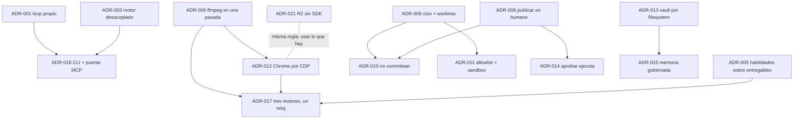

# Decisiones de arquitectura

Cada ADR registra **qué se decidió, contra qué alternativa, y qué se resignó**.
Una decisión sin su costo no se puede revisar más adelante. Las reglas que se
desprenden de estas decisiones están, con dónde se hacen cumplir, en
[[Invariantes de arquitectura]].

## Índice

| # | Decisión | Área | Estado |
|---|---|---|---|
| [[ADR-001 No usar Claude Agent SDK]] | agent loop propio detrás de `LlmProvider`; compara las cuatro formas de construir un agente | llm, motor | aceptada · complementada por ADR-018 |
| [[ADR-002 Zod como única fuente de verdad]] | el dominio se define una vez y ambos lados infieren | dominio | aceptada |
| [[ADR-003 Motor desacoplado del servidor]] | `packages/engine` no importa Fastify ni SQLite | motor | aceptada |
| [[ADR-004 Bandas de precio disjuntas]] | los tiers tienen piso y techo | llm | aceptada · acotada a catálogos con precio |
| [[ADR-005 Las habilidades trabajan sobre entregables ya escritos]] | reciben una `key`, nunca el contenido | producción | aceptada |
| [[ADR-006 Video en una sola pasada de ffmpeg]] | sin clips intermedios; sin navegador para seis placas | producción | aceptada · acotada por ADR-012 y ADR-017 |
| [[ADR-007 Correo por webhook de n8n]] | el orquestador no habla SMTP | plataforma | aceptada |
| [[ADR-008 Publicar lo decide una persona]] | `publicar` no es una herramienta de agente | plataforma, seguridad | aceptada |
| [[ADR-009 Programar sobre un clon gestionado y un worktree]] | el equipo trabaja en un clon propio, nunca en la carpeta de la persona | código | aceptada |
| [[ADR-010 Los agentes no commitean y la persona publica]] | instantáneas en vez de commits; publicar es humano | código | aceptada |
| [[ADR-011 La allowlist decide y el sandbox contiene]] | argv sin shell por token + `sandbox-exec` | código, seguridad | aceptada |
| [[ADR-012 Usar el Chrome instalado por CDP]] | ningún navegador instalado; CDP con el WebSocket de Node | producción | aceptada |
| [[ADR-013 El vault de contexto se escribe por el sistema de archivos]] | lo largo en un vault de Obsidian por empresa, sin plugin | organización | aceptada |
| [[ADR-014 Aprobar una herramienta la ejecuta]] | se ejecuta la llamada aprobada, con sus argumentos | organización, seguridad | aceptada |
| [[ADR-015 Una lección exige evidencia y refutar no borra]] | memoria gobernada: evidencia, confirmación por otro, tombstone | organización | aceptada |
| [[ADR-016 El ciclo es una cadena]] | cada rol una vez por ciclo; el trabajo fluye en el mismo tick | motor | aceptada · reemplaza el retardo total |
| [[ADR-017 Tres motores de video comparten el reloj]] | ASS, estudio y clips con el mismo guion, reloj, voz y mezcla | producción | aceptada |
| [[ADR-018 Los CLI de suscripción reciben el puente MCP del org]] | `delegaElTurno` + servidor MCP en el proceso del motor | llm, motor | aceptada |
| [[ADR-019 El espejo del teléfono es scrcpy con respaldo]] | scrcpy + WebSocket + WebCodecs; `screenrecord` de respaldo | móvil | aceptada |
| [[ADR-020 Herramientas compuestas declarativas]] | un agente compone herramientas existentes, sin código propio | organización | aceptada |
| [[ADR-021 R2 sin SDK con SigV4 propio]] | verificar el bucket con firma propia, sólo lectura y sólo staging | móvil, seguridad | aceptada |

## Cómo se relacionan



Tres ideas atraviesan casi todas:

- **Los frenos viven en el ejecutor, no en el prompt** (ADR-011, 014, 015, 020):
  un agente puede ignorar una instrucción, no al código que ejecuta su
  herramienta.
- **Usar lo que ya está en la máquina y degradar con aviso** (ADR-006, 012, 013,
  019, 021): ffmpeg, Kokoro, Chrome, `sandbox-exec`, scrcpy, `crypto`.
- **Lo que sale de la empresa lo decide una persona** (ADR-008, 010, 014): publicar
  archivos, publicar código, ejecutar lo sensible.

## Plantilla

```markdown
---
tags: [adr, subcategoría]
aliases: [símbolos que alguien buscaría]
---

# ADR-0NN Título en una línea

**Estado:** propuesta | aceptada | reemplazada por [[ADR-0MM …]]

## Contexto
Qué situación obligaba a decidir (con el incidente medido, si lo hay).

## Decisión
Qué se hizo, con los archivos y símbolos donde vive.

## Alternativas consideradas
Qué más se evaluó y por qué no.

## Consecuencias
### A favor
### En contra / lo que se resignó
### Cómo se revisaría

## Qué lo fija
Los tests que sostienen la decisión.

## Fuentes
## Ver también
```

Cuándo escribir uno: ver [[Guía de contribución]].

## Ver también

- [[Invariantes de arquitectura]] · [[Arquitectura general]] · [[Convenciones de documentación]]
