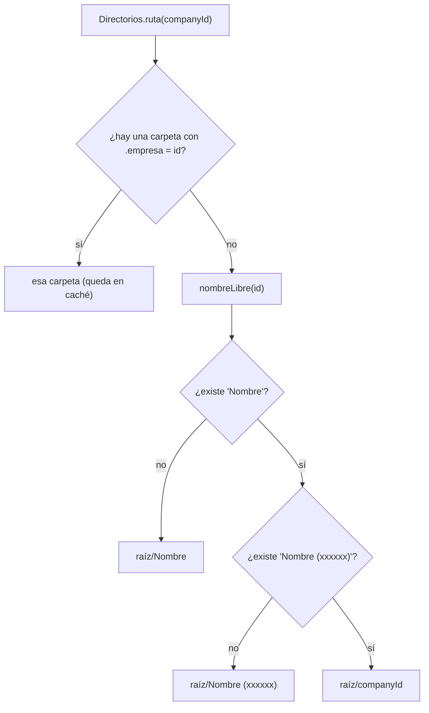
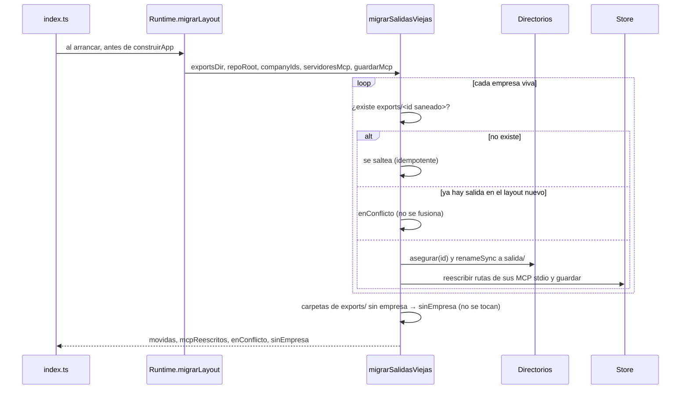

# Directorios en disco

`apps/server/src/directorios.ts` → `Directorios` es **la única fuente de rutas**
de un proyecto: dónde va su salida, el código que cargó una persona, los
worktrees de los agentes y los temporales. Todo lo demás (`ExportStore`,
`RepoStore`, los comandos, los servicios de la vista previa, el AAB) le pregunta
a `Directorios` en vez de armar la ruta por su cuenta.

Existe porque cada store decidía solo y el resultado no se podía leer: la salida
iba por id (`data/exports/cmp_msw30yi82fdt1e`), el vault por nombre, y lo que no
tenía dueño quedaba donde cayera. Una persona que abría `data/` no podía decir
qué carpeta era de qué proyecto, y borrar una empresa limpiaba una sola de las
tres.

## El árbol completo

Todo lo que escribe el orquestador cuelga de `data/` (git-ignored entero, ver
`.gitignore`), salvo los directorios de trabajo de los CLIs:

```
data/
├── orquestador.db (+ -wal, -shm)     DATABASE_URL — la base SQLite
├── mcp-oauth/<serverId>.json         tokens OAuth de servidores MCP (0600, carpeta 0700)
├── proyectos/                        PROYECTOS_DIR — una carpeta legible por proyecto
│   ├── package.json                  {"type": "commonjs"} — ver más abajo
│   ├── .servicios-vivos.json         pid + inicio de cada servicio de la vista previa
│   ├── .dispositivos.json            teléfonos vinculados y qué app se abrió en cada uno
│   └── <Nombre legible>/
│       ├── .empresa                  la marca: el id de la empresa, nada más
│       ├── salida/                   lo que produce la empresa (ExportStore)
│       │   ├── .orq-generado.json    manifiesto de procedencia
│       │   ├── publicado/            lo aprobado por una persona
│       │   ├── marca/logo.png        el logo (lo sube una persona)
│       │   ├── imagenes/ revision/ respaldos/ builds/android/ …
│       ├── repos/<slug>/             clon gestionado del código de la persona
│       ├── worktrees/<slug>/<AAAAMMDD-xxxx>/   sesiones de trabajo de los agentes
│       └── tmp/                      run/ (TMPDIR de comandos), logs/, servicios/<id>/, builds/<id>/
├── contexto/<Nombre legible>/        CONTEXTO_DIR — el vault de Obsidian de cada empresa
├── musica/                           MUSICA_DIR — pistas que deja la persona
├── exports/<id>/                     EXPORTS_DIR — layout viejo: sólo se lee al arrancar para mudarlo
└── workspace/                        lo que usa el servidor MCP "archivos" de `npm run db:seed`

$TMPDIR/orq-claude-code/transcripciones/   CLAUDE_CODE_WORKDIR — una transcripción por turno
$TMPDIR/orq-opencode/                      OPENCODE_WORKDIR
```

| Lugar | Lo escribe | Nota |
|---|---|---|
| `data/orquestador.db` | `Store` (`apps/server/src/db.ts`) | [[Persistencia y esquema SQL]] |
| `data/mcp-oauth/` | `crearFabricaOAuth` (`apps/server/src/mcp-oauth.ts`); se ubica junto a la base (`Runtime.dirOAuth`) | [[OAuth para servidores MCP]] |
| `proyectos/<Nombre>/salida/` | `ExportStore` con `disposicionPorProyecto` | [[Salida de la empresa]] |
| `proyectos/<Nombre>/repos/`, `worktrees/` | `RepoStore` (`apps/server/src/repos.ts`) | [[Repositorios y sesiones]] |
| `proyectos/<Nombre>/tmp/` | `codigo-servidor.ts`, `servicios.ts`, `aab.ts` | [[Comandos y sandbox]], [[Build de producción Android]] |
| `proyectos/.servicios-vivos.json` | `ServiciosVivos` | [[Servicios del monorepo]] |
| `proyectos/.dispositivos.json` | `Dispositivos` | [[Vinculación del teléfono]] |
| `contexto/` | `ContextoStore` (`apps/server/src/contexto.ts`) | [[Vault de contexto]] |
| `musica/` | la persona, o `npm run musica:cama` | [[Música y narración]] |
| transcripciones de `claude-code` | el adaptador (`packages/llm/src/adapters/claude-code.ts`) | [[Proveedor claude-code]] |

Las raíces se configuran en `.env` y se resuelven contra la raíz del monorepo,
no contra el directorio actual (`apps/server/src/env.ts` → `fromRoot`): así la
base y las carpetas son las mismas arranques el servidor desde la raíz o desde
el workspace. Ver [[Variables de entorno]].

## Una carpeta por proyecto, encontrada por su marca



**El nombre es para leer; el id manda.** La carpeta se busca por la marca
`.empresa` (`MARCA_PROYECTO`), que guarda el id de la empresa. Eso compra tres
cosas:

- **Renombrar no crea una carpeta al lado de la vieja**: la marca la sigue
  encontrando aunque diga otro nombre.
- **Dos proyectos homónimos no mezclan archivos**: el segundo toma
  `Nombre (xxxxxx)`, con los últimos seis caracteres del id
  (`companyId.slice(-6)`, que son la parte aleatoria de `newId` en
  `packages/shared/src/ids.ts`).
- **Una carpeta sin marca no se reclama nunca.** En esta raíz no debería haber
  nada que no sea de un proyecto; adueñarse de algo que alguien dejó a mano es la
  forma de mezclarle archivos. `nombreLibre` la saltea y usa el sufijo.

La búsqueda (`buscarMarcada`) recorre las carpetas de primer nivel leyendo cada
`.empresa`. El resultado se cachea por id, pero la caché **se revalida leyendo
la marca** en cada uso: si alguien movió la carpeta a mano, se vuelve a buscar.

### La API de `Directorios`

| Método | Qué hace | ¿Escribe? |
|---|---|---|
| `ruta(id)` | la carpeta del proyecto, exista o no | no |
| `sub(id, "salida" \| "repos" \| "worktrees" \| "tmp", crear?)` | una subcarpeta | sólo con `crear = true` |
| `asegurar(id)` | crea la carpeta y su marca si faltaban; llama a `prepararRaiz` | sí |
| `mudar(id)` | renombra la carpeta al nombre actual del proyecto | sí |
| `contiene(id, absoluta)` | ¿la ruta cae adentro del proyecto? Para verificar, nunca para armar | no |
| `duenioDe(carpeta)` | de qué empresa es una carpeta de primer nivel, según su marca | no |
| `carpetas()` | carpetas de primer nivel con su dueño (hoy sin llamadores) | no |
| `olvidar(id)` | saca el id de la caché (lo llama `eliminarEmpresa`) | no |
| `prepararRaiz()` | escribe `package.json` en la raíz si falta | sí |

`nombreDe` —el nombre actual de la empresa— se inyecta en el constructor
(`Runtime` le pasa `store.getCompany(id)?.name ?? null`). Para una empresa
borrada devuelve `null` y la ruta cae en `raíz/<companyId>`, que no existe:
leer ahí devuelve vacío.

## Tres formas de sanear un nombre

| Función | Dónde | Qué conserva | Por qué |
|---|---|---|---|
| `segmentoLegible` (`packages/shared/src/nombres.ts`) | carpetas de proyecto y del vault | acentos, espacios, mayúsculas, rayas largas; saca `\ / : * ? " < > \|`, caracteres de control y puntos o espacios en los bordes; 80 caracteres | se lee en el Finder y en Obsidian: `cmp_msw30yi82fdt1e` no se navega, se descifra |
| `ExportStore.safeSegment` (`apps/server/src/exports.ts`) | cada segmento de una ruta de salida | sólo `[\w.-]`, sin tildes, sin `..`, sin punto inicial; 80 caracteres; `sin-nombre` si queda vacío | esos nombres viajan en URLs de descarga, y la ruta la propone un modelo |
| `slugTecnico` (`packages/shared/src/nombres.ts`) | ramas de git y carpetas técnicas (`repos/<slug>`) | minúsculas, guiones; 60 caracteres | `Mi Repo (v2)` → `mi-repo-v2` |

`segmentoLegible` vive en `@orq/shared` porque la usan dos árboles —las carpetas
de proyecto y el vault—: con dos copias de la regla, la misma empresa terminaba
con dos nombres distintos según dónde se mirara.

## Consultar no crea

Todo lo que empieza con `ruta` o `sub` sin `crear` devuelve dónde está **o
estaría** la carpeta sin tocar el disco. Sólo `asegurar`, `sub(…, true)`,
`mudar` y `prepararRaiz` escriben.

> [!danger] Un barrido que crea al pasar produce los residuos que viene a buscar
> Es la lección de `ExportStore.dirFor`: la pestaña Salida pide el árbol cada
> cinco segundos, y con un store que creaba la carpeta al consultar, mirar una
> empresa borrada alcanzaba para dejarla de nuevo en disco. El diagnóstico de
> [[Limpieza y mantenimiento]] no puede escribir lo que mide. Hay un test que
> lo fija: "consultar no crea nada" (`directorios.test.ts`).

## `data/proyectos/package.json` en CommonJS

`prepararRaiz` deja un `{"private": true, "type": "commonjs"}` en la raíz de los
proyectos. Corre al arrancar (`apps/server/src/index.ts`) y cada vez que se
asegura una carpeta.

> [!danger] "require is not defined" en la línea uno
> `data/` vive adentro del repo del orquestador, cuyo `package.json` dice
> `"type": "module"`, y Node decide cómo cargar un `.js` por el `package.json`
> **más cercano**. Todo lo que corría en un proyecto heredaba ese ESM:
> `ts-node-dev` escribe su hook en `TMPDIR` —que para los comandos es
> `tmp/run/` del proyecto— y lo carga con `require`, así que el backend de
> INSPIA moría al arrancar. En la máquina de la persona el temporal está en
> `/var/folders`, sin nada arriba, y por eso ahí andaba.

## Renombrar muda la carpeta

La marca hace que un renombre no **necesite** mudar nada: la carpeta se sigue
encontrando. Pero una persona lee nombres, y una carpeta que dice "Prueba 3" para
el proyecto "Simulador" es la misma confusión que el layout por id venía a
sacar. `Directorios.mudar(id)`:

1. Busca la carpeta marcada; sin carpeta no hay nada que mudar (`null`).
2. Si ya se llama como el proyecto —con o sin sufijo— no hace nada.
3. Si el nombre nuevo difiere **sólo en mayúsculas**, usa ese nombre sin pedir
   sufijo: en el disco de macOS (que no distingue mayúsculas) `existsSync`
   diría que el destino está ocupado cuando es la misma carpeta.
4. Si el nombre está tomado por otro proyecto, toma `Nombre (xxxxxx)`.
5. `renameSync` y actualiza la caché. Devuelve `{ vieja, nueva }`.

Mudar rompe todo lo que guardaba **rutas absolutas**, y eso lo arregla quien
llama (`Runtime.renombrarEmpresa`): `git worktree repair` sobre cada sesión
abierta y `reescribirRutasMcp` sobre los servidores MCP. Las sesiones de código
guardan su carpeta **relativa** al proyecto (`sesion.carpeta`,
`worktrees/<slug>/<AAAAMMDD-xxxx>`), así que la base no necesita cambios. El
flujo completo está en [[Gestión de proyectos]].

## La migración del layout viejo

La salida vivía en `data/exports/<id saneado>`. `migrarSalidasViejas` la muda a
`<Nombre legible>/salida` y la llama `Runtime.migrarLayout` al arrancar,
**antes de levantar cualquier servidor MCP**: un proceso que arranca con la ruta
vieja en sus argumentos la volvería a crear al primer archivo que escriba.



`ResultadoMigracion` y lo que hace `index.ts` con cada campo:

| Campo | Qué es | Qué se loguea |
|---|---|---|
| `movidas` | empresas mudadas, con su carpeta nueva | `info` con los destinos y cuántos MCP se reescribieron |
| `mcpReescritos` | servidores MCP con una ruta cambiada | idem |
| `enConflicto` | empresas con salida en los dos layouts | `warn`: "no se fusionaron solas. Revisalas a mano" |
| `sinEmpresa` | carpetas de `data/exports/` que no son de ninguna empresa viva | `warn`: quedan donde están |

**Idempotente**: una empresa ya mudada no tiene carpeta vieja. Si `EXPORTS_DIR`
y `PROYECTOS_DIR` apuntan al mismo lugar, no hace nada. Y si existen las dos
salidas —alguien copió a mano, una migración a medias— **no se fusionan**:
mezclar dos árboles de entregables es la clase de cosa que no se deshace.

### `reescribirRutasMcp`

Un servidor MCP puede tener la carpeta de la empresa metida en sus argumentos: el
Playwright de reconocimiento de INSPIA arranca con `--output-dir` apuntando a
`<proyecto>/salida/reconocimiento` (`scripts/seed-inspia-publicidad.ts`). Mudar
la carpeta sin tocarlo lo deja escribiendo en una ruta que ya no existe o,
peor, recreándola.

`reescribirRutasMcp(server, cambio)` reemplaza en `transport.args` y
`transport.cwd` las dos formas que aparecen en la práctica: la **absoluta** y la
**relativa a la raíz del repo**. Sólo toca transportes `stdio` (un `http` no
tiene rutas locales) y devuelve `null` si no cambió nada, para no reescribir
filas por gusto. La usan la migración y el renombre.

## Otras raíces que no son de `Directorios`

- **El vault** (`CONTEXTO_DIR`, `ContextoStore`) también marca sus carpetas con
  `.empresa`, pero se resuelve **por nombre** (prueba `Nombre` y
  `Nombre (xxxxxx)`) y, al crear, **sí reclama** una carpeta sin marca —puede ser
  una de antes de la marca—. Es otra política a propósito: ver
  [[Vault de contexto]].
- **`EXPORTS_DIR`** ya no se escribe… salvo por un detalle: los seeds
  (`apps/server/src/seed.ts`, `scripts/seed-inspia-lanzamiento.ts`) construyen
  un `ExportStore` sobre esa carpeta sólo para enumerar las habilidades, y el
  constructor de `ExportStore` crea su raíz. Por eso `data/exports/` puede
  reaparecer vacía después de un `npm run db:seed`; la migración la ignora.
- **Los directorios de trabajo de los CLIs** caen en el temporal del sistema si
  no se configuran (`join(tmpdir(), "orq-claude-code")`,
  `join(tmpdir(), "orq-opencode")`).

## Casos borde

- **`renameSync` no cruza volúmenes.** La migración y `mudar` usan
  `renameSync`; si `EXPORTS_DIR` y `PROYECTOS_DIR` estuvieran en discos
  distintos, la migración tiraría `EXDEV` y, como `index.ts` no la envuelve,
  el servidor no arrancaría.
- **Un proyecto borrado** resuelve a `raíz/<companyId>` (no hay nombre): leer,
  medir o listar ahí devuelve vacío sin crear nada.
- **Tres proyectos con el mismo nombre**: el tercero no tiene ni `Nombre` ni
  `Nombre (xxxxxx)` libres y cae en `raíz/<companyId>`.
- **La carpeta se movió a mano**: la caché se invalida al no coincidir la marca
  y se vuelve a buscar; mientras la marca siga adentro, se encuentra.
- **Se borró la marca a mano**: la carpeta deja de ser del proyecto. El próximo
  `asegurar` crea otra con sufijo, y el diagnóstico de mantenimiento la marca
  como residual.

## Qué fijan los tests

`apps/server/src/directorios.test.ts`:

- La carpeta lleva el nombre legible y una marca con el id.
- La raíz corta la herencia del `"type": "module"` del orquestador.
- Consultar (`ruta`, `sub` sin crear) no crea nada.
- Dos proyectos con el mismo nombre no comparten carpeta (`… (bbb222)`).
- Renombrar el proyecto no crea una carpeta nueva: la marca manda.
- No se adueña de una carpeta sin marca que alguien dejó a mano.
- `ExportStore` sobre este layout: pedir el árbol no crea la carpeta, escribir
  la crea adentro del proyecto, borrar la empresa se lleva la carpeta entera, y
  una carpeta sin marca o de un proyecto borrado es residual.
- `migrarSalidasViejas` muda, reescribe el MCP y es idempotente; con salida en
  los dos layouts no fusiona; un MCP que no menciona la ruta no se toca.

`apps/server/src/renombrar.test.ts` fija la mudanza vista desde afuera (ver
[[Gestión de proyectos]]).

## Cómo extender

Una subcarpeta nueva por proyecto entra en el tipo `Subcarpeta` y se pide con
`sub(id, "nueva", crear)`. Antes de agregarla, repasá cuatro cosas:

1. **Borrado**: `ExportStore.removeCompany` se lleva la carpeta entera del
   proyecto, así que lo nuevo se va con la empresa sin hacer nada.
2. **Medición**: `medirEmpresa` pesa la carpeta entera; lo nuevo cuenta en la
   ficha de [[Gestión de proyectos]].
3. **Renombre**: si algo guarda rutas **absolutas** a esa carpeta, hay que
   repararlo en `Runtime.renombrarEmpresa`, como los worktrees y los MCP.
4. **Consultar no crea**: el camino de lectura usa `sub(id, x)` sin `crear`.

Algo que no sea de un proyecto no va adentro de `PROYECTOS_DIR`: el diagnóstico
marca como residual toda carpeta sin marca.

## Fuentes

- `apps/server/src/directorios.ts` → `Directorios`, `MARCA_PROYECTO`, `migrarSalidasViejas`, `reescribirRutasMcp`, `ResultadoMigracion`
- `apps/server/src/runtime.ts` → constructor de `Runtime`, `migrarLayout`, `renombrarEmpresa`, `dirOAuth`
- `apps/server/src/index.ts` → orden de arranque y logs de la migración
- `apps/server/src/env.ts` → `loadEnv`, `fromRoot`, `repoRoot`
- `apps/server/src/exports.ts` → `disposicionPorProyecto`, `disposicionPorId`, `ExportStore.safeSegment`
- `apps/server/src/repos.ts` → `rutaClon`, `rutaWorktree`, `repararWorktrees`, `abrirSesion`
- `apps/server/src/contexto.ts` → `ContextoStore.resolverDir`, `renombrar`
- `packages/shared/src/nombres.ts` → `segmentoLegible`, `slugTecnico`
- `apps/server/src/directorios.test.ts`, `apps/server/src/renombrar.test.ts`

## Ver también

- [[Salida de la empresa]] — lo que vive en `salida/`
- [[Gestión de proyectos]] — renombrar y borrar de punta a punta
- [[Limpieza y mantenimiento]] — carpetas residuales
- [[Runtime del servidor]] — quién arma `Directorios`
- [[Repositorios y sesiones]] — `repos/` y `worktrees/`
- [[Vault de contexto]]
- [[Variables de entorno]]
