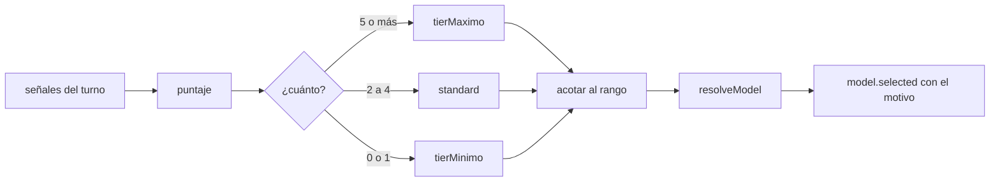

# Escalado por dificultad

Con el escalado activo, el modelo de un rol deja de ser fijo: el motor mide qué
tan cargado viene **cada turno** y elige el tier dentro de un rango. Un turno
liviano —contestar un mensaje, cerrar una tarea— corre con el modelo barato; uno
pesado —bandeja llena, contexto largo, un turno que hay que retomar, errores que
destrabar— sube al caro. La función es pura (`packages/engine/src/dificultad.ts`
→ `elegirTierPorDificultad`) y su decisión nunca es invisible: todo turno emite
`model.selected` con el motivo.

**Por qué.** Un tier fijo por rol paga de más en los turnos livianos o se queda
corto en los pesados, y el mismo rol tiene los dos tipos de turno en una corrida.
Las señales son las mismas que usa
[[Motor de agentes#Presupuesto de iteraciones|presupuestoDeIteraciones]]: lo que
hace que un turno necesite más vueltas es lo mismo que hace que necesite un modelo
mejor.

## Cómo se activa

En el rol, `model.escalado` (`modelSelectionSchema`,
`packages/shared/src/schema.ts`):

| Campo | Default | Qué es |
|---|---|---|
| `escalado` | `null` | apagado; `null` por default para que las filas viejas parseen |
| `escalado.activo` | `false` | encendido |
| `escalado.tierMinimo` | `cheap` | piso del rango |
| `escalado.tierMaximo` | `smart` | techo del rango |

- **Un `modelSlug` fijo apaga el escalado**: el slug tiene prioridad absoluta
  (`runAgentTurn` sólo escala con `escalado.activo && !modelSlug`).
- Los tiers van en orden `free` < `cheap` < `standard` < `smart`.
- En la UI se prende en el editor del rol ([[Pantalla Empresa y organigrama]]):
  "automático", con el rango de/a (al prenderlo propone `cheap` a `smart`); con un
  modelo fijo el control queda deshabilitado y el texto dice "el slug gana
  siempre".

## Las señales

`runAgentTurn` arma `SenialesDeDificultad` justo antes de resolver el modelo:

| Señal | De dónde sale | Puntos |
|---|---|---|
| `autoridad` | `role.authority` | `executive` +2, `manager` +1, `executor` 0 |
| `mensajes` | mensajes drenados de la bandeja | 5 o más: +2; 2 a 4: +1 |
| `tareas` | tareas no cerradas del rol | 3 o más: +1 |
| `caracteres` | largo de objetivo + bandeja + tareas | 20.000 o más: +2 ("contexto largo"); 8.000 o más: +1 ("contexto mediano") |
| `reanudando` | hay un turno interrumpido que se retoma | +2 |
| `fallosRecientes` | `state.fallosConsecutivos(role.id)` | +1 por fallo, con tope de 2 |

`fallosConsecutivos` se calcula leyendo `activity` (llamadas a herramientas
fallidas del rol desde su último éxito), así que no agrega estado mutable por
turno. Un modelo que viene fallando con una herramienta suele necesitar uno mejor,
no más intentos; pasados dos fallos, más fallos no dicen nada nuevo.

## Del puntaje al tier

1. Si el rango vino dado vuelta (mínimo por encima del máximo), se normaliza en
   vez de fallar: a esa altura no hay quien corrija el dato.
2. Puntaje 5 o más → `tierMaximo`; 2 a 4 → `standard`; 0 o 1 → `tierMinimo`.
3. El resultado se acota al rango. El escalón del medio es `standard` **absoluto**:
   en un rango `free..cheap`, un puntaje de 3 da `cheap` (el máximo), y en
   `standard..smart` un turno liviano da `standard` (el mínimo).
4. El motivo nombra las señales, el tier y el rango, por ejemplo: `autoridad
   executive + bandeja cargada (5 mensajes) + contexto mediano → smart (puntaje 5,
   rango cheap..smart)`. Sin señales dice "turno liviano". Los fallos se nombran
   con la cantidad real ("10 fallos recientes") aunque sumen sólo 2.

Los cortes son enteros y estables: las señales no oscilan dentro de una corrida
normal, así que el tier no "flapea" entre turnos vecinos (un modelo que cambia
turno a turno pierde la familiaridad con la corrida).

| Turno | Puntaje | `cheap..smart` | `cheap..standard` | `standard..smart` |
|---|---|---|---|---|
| Executor que contesta un mensaje corto | 0 | cheap | cheap | standard |
| Executor con 2 mensajes y 9.000 caracteres | 2 | standard | standard | standard |
| Manager con 3 tareas abiertas | 2 | standard | standard | standard |
| Executor con 2 o más fallos seguidos | 2 | standard | standard | standard |
| Executive que retoma un turno cortado | 4 | standard | standard | standard |
| Executive con 5 pedidos de 2.000 caracteres | 5 | smart | standard | smart |
| Executive que retoma con 5 mensajes | 6 | smart | standard | smart |

## Los rangos que pone el sistema

| Quién nace con escalado | Rango | Dónde |
|---|---|---|
| Especialista convocado (siempre `executor`) | `cheap..standard`; `free..free` si la empresa está en `free` | `RunState.incorporarRol` |
| Rol aprobado desde una solicitud `create_role` | `executive`: `standard..smart`; `manager` y `executor`: `cheap..standard`; `free..free` si la empresa está en `free` | `conEscaladoPorAutoridad` (`apps/server/src/runtime.ts`), en `Runtime.applyRequest` |
| Rol de una plantilla de equipo | `executive`: `standard..smart`; `manager` y `executor`: `cheap..standard`; tres managers —el revisor de la consultora, la realizadora del estudio y la tech lead de software— piden `standard..smart` | `ESCALADO` y cada rol en `packages/shared/src/plantillas.ts`; `Runtime.generarEquipo` pone `tier = tierMinimo` |
| Rol creado a mano | apagado hasta que alguien lo prende | — |

Una empresa en tier `free` no escala a modelos pagos: el primer turno pesado iría
derecho a un 402 de una cuenta sin crédito. En todos los casos el modelo base
(proveedor, tier, slug) es el que ya tenía la empresa o el que resolvió
`proveedorPreferido`; si la empresa fijó un slug exacto, se respeta y el escalado
queda sin efecto —puede ser la única forma de resolver en proveedores sin precios
ni mapa curado (`ollama`, `openai`, `nvidia`)—. Ver [[Plantillas de equipo]] y
[[Especialistas convocados]].

## El evento `model.selected`

Se emite en **todo** turno, antes de `agent.thinking`, con o sin escalado: un
costo que varía entre turnos tiene que poder explicarse mirando la traza.

| Campo | Qué dice |
|---|---|
| `roleId`, `providerId`, `modelSlug` | quién y con qué modelo |
| `tier` | el tier resuelto; `null` si el rol fijó un slug |
| `escalado` | `true` si lo eligió el medidor |
| `motivo` | el motivo del medidor; "Modelo fijado por el rol: …" o "Tier X del rol, sin escalado." |

En la UI, `apps/web/src/lib/derive.ts` lo guarda por rol (`tier`,
`motivoModelo`, `escaladoPorDificultad`) y el organigrama marca con un punto el
modelo elegido por dificultad; la cronología de [[Pantalla Proceso en vivo]] sólo
dibuja los turnos escalados ("el turno corre con …"): el modelo fijo de siempre no
es noticia, y dibujarlo en cada turno duplicaría la cronología. Todas las
variantes en [[Referencia de eventos]].

## Del tier al modelo

`providers.resolveModel({ ...role.model, tier })` resuelve el tier contra el
proveedor del rol: los proveedores de Claude por un mapa curado
(`resolverTierEstatico`: cheap = Haiku, standard = Sonnet, smart = Opus), el resto
por bandas de precio del catálogo vivo (`resolveTier`). Si ningún modelo califica
para ese tier, lanza "Ningún modelo de … califica para el tier …", y como eso pasa
antes del `try` del turno, la bandeja del rol ya se vació
([[Motor de agentes#El turno paso a paso]]). Detalle en [[Capa LLM y tiers]].

## Qué hace subir un turno después de un fallo

Un turno que termina en error del proveedor no deja entrada en `activity`, así que
**no** suma a `fallosRecientes`. Lo que lo encarece es otra señal: el turno queda
guardado como interrumpido y al retomarlo suma +2 por `reanudando`. Por eso importa
que los proveedores que delegan rescaten un turno que en realidad trabajó
(`claude-code` con `ultimoTextoDeAsistente`, `opencode` con `hayTexto`): sin el
rescate, el turno siguiente se retoma y sube de tier por un fracaso que no ocurrió.
`fallosRecientes` sí sube con las llamadas a herramientas que fallaron, incluidas
las que un CLI hizo por el puente del org.

## Qué fijan los tests

`packages/engine/src/dificultad.test.ts`:

- un executor con turno liviano queda en el mínimo, con motivo "turno liviano";
- un executive que retoma con la bandeja cargada llega al máximo;
- carga intermedia cae en `standard`;
- más señales nunca bajan el tier (una escalera de ocho pasos);
- el resultado siempre queda dentro del rango (`standard..standard`);
- un rango dado vuelta se normaliza;
- los fallos suman con tope de 2 (dos y diez dan el mismo puntaje);
- el motivo nombra las señales y el rango.

`packages/engine/src/loop.test.ts` → "escalado de modelo por dificultad": el
proveedor recibe el modelo del tier elegido y `model.selected` lo anuncia; un
executive cargado sube a `smart`; un `modelSlug` fijo apaga el escalado (`tier:
null`); `incorporarRol` nace con `cheap..standard`. `apps/server/src/equipo.test.ts`
fija que una plantilla genera los roles con escalado activo.

## Cómo modificar sin romperlo

- Mantené la función pura: se testea con números, sin `FakeProvider` ni estado.
- Una señal nueva va en `SenialesDeDificultad`, se calcula en `runAgentTurn`,
  suma una razón al motivo y entra a la escalera del test de monotonicidad.
- Nada de umbrales con decimales ni de señales que oscilen dentro de un turno: el
  tier no puede flapear.
- Un rango nuevo por autoridad se decide en un solo lugar por caso
  (`conEscaladoPorAutoridad`, `incorporarRol`, `ESCALADO`); cuidá que `free` siga
  sin escalar.

## Fuentes

- `packages/engine/src/dificultad.ts` → `SenialesDeDificultad`,
  `EleccionDeTier`, `ORDEN`, `acotar`, `elegirTierPorDificultad`
- `packages/engine/src/loop.ts` → `runAgentTurn` (señales, `model.selected`)
- `packages/engine/src/state.ts` → `fallosConsecutivos`, `incorporarRol`
- `apps/server/src/runtime.ts` → `conEscaladoPorAutoridad`,
  `Runtime.applyRequest`, `Runtime.generarEquipo`, `proveedorPreferido`
- `packages/shared/src/schema.ts` → `modelTierSchema`, `modelSelectionSchema`
- `packages/shared/src/plantillas.ts` → `ESCALADO`
- `packages/shared/src/events.ts` → `model.selected`
- `packages/llm/src/registry.ts` → `ProviderRegistry.resolveModel`
- `apps/web/src/lib/derive.ts`, `apps/web/src/routes/LiveProcess.tsx`,
  `apps/web/src/routes/Settings.tsx` (editor del rol)
- Tests: `dificultad.test.ts`, `loop.test.ts`, `apps/server/src/equipo.test.ts`

## Ver también

- [[Motor de agentes]] — dónde se miden las señales
- [[Capa LLM y tiers]] — cómo un tier se vuelve un modelo
- [[Costos y presupuesto]] — lo que el escalado ahorra o gasta
- [[Plantillas de equipo]] — los rangos por rol de cada plantilla
- [[Especialistas convocados]] — el rango de quien nace en la corrida
