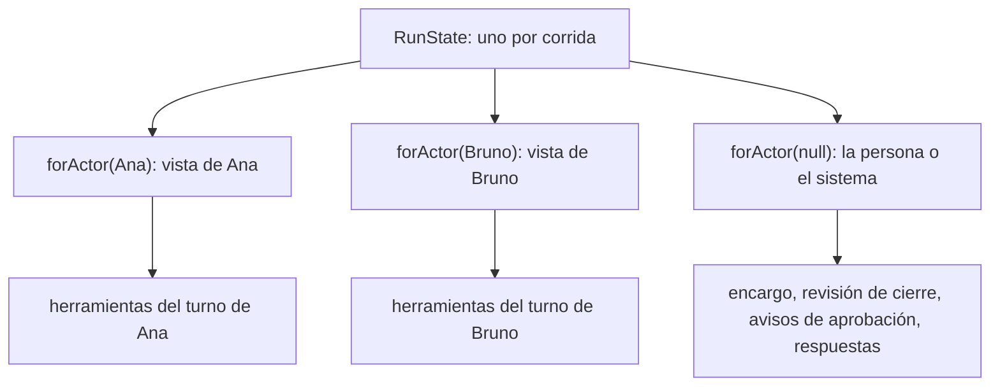
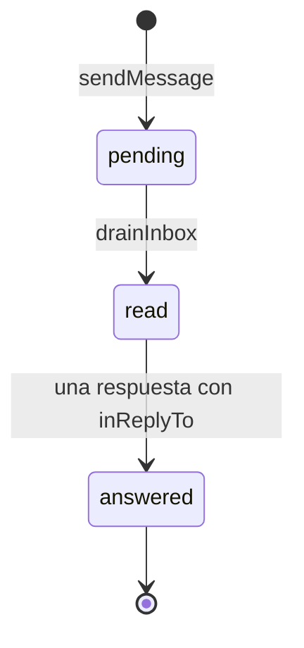

# Estado de una corrida

`packages/engine/src/state.ts` → `RunState` es el estado **vivo** de una corrida:
bandejas, mensajes, tareas, entregables, aprobaciones, solicitudes, memoria,
actividad y el organigrama tal como está ahora. Lo leen y escriben los turnos (a
través de las herramientas) y el [[Scheduler y ciclo de una corrida|scheduler]];
se persiste en paralelo por un puerto (`Persistence`) que implementa el servidor.
Hay uno por corrida, y vive lo que vive la corrida en memoria.

## Por qué vive en memoria

Es un proceso local de un solo usuario: leer la bandeja de cada rol contra SQLite
en cada ciclo no aporta nada. Lo que importa conservar se escribe al pasar —para
reproducir la corrida en el timeline y para que la empresa herede el trabajo—, y lo
demás se pierde con el proceso. Por eso **una corrida no sobrevive a un reinicio**:
su traza y sus filas quedan, su estado vivo no
([[Scheduler y ciclo de una corrida#Estados de la corrida]]).

El motor no conoce la base ([[ADR-003 Motor desacoplado del servidor]]): recibe
`Persistence` inyectado, y los tests usan `noPersistence` o un stub que junta lo
guardado.

## Lo que carga al arrancar: `CompanyConfig`

`Runtime.startRun` arma la configuración desde el `Store` y se la pasa al
constructor:

| Campo | De dónde sale | Qué hace `RunState` con eso |
|---|---|---|
| `company` | `getCompany` | identidad, `defaultModel` para los convocados |
| `departments`, `roles`, `policies` | `listDepartments`, `listRoles`, `listPolicies` | organigrama vivo; una bandeja vacía por rol |
| `tools` | `listTools` | el **catálogo** de la corrida (qué nombres puede tener un rol) |
| `mcpServers` | `listMcpServers` | para no proponer un servidor que ya existe |
| `learnings` | `listLearnings` | la memoria de la empresa |
| `requests` | `listRequests` | solicitudes previas (las pendientes se heredan) |
| `artifacts` | `listArtifactsByCompany` | entregables de corridas anteriores, **sin re-persistirlos** |
| `tasks` | `listTasksAbiertasByCompany` (todo lo que no es `done` ni `cancelled`) | se **adoptan** (ver [[#Tareas]]) |

En una corrida enfocada del chat el organigrama se reduce al rol elegido y
`tasks` va vacío. El comentario del tipo dice que la configuración es inmutable
durante la corrida; en la práctica se modifica, pero **sólo** por los métodos de
[[#El organigrama vivo]]: nada se relee de la base.

## Persistence

| Método | Cuándo lo llama `RunState` | Implementación en el servidor |
|---|---|---|
| `saveMessage` | al enviar, al leer (`read`) y al contestar (`answered`) | `store.saveMessage` |
| `saveTask` | al crear, actualizar y adoptar | `store.saveTask` |
| `saveArtifact` | al escribir una versión | `store.saveArtifact(artifact, company.id)`: el entregable es de la empresa |
| `saveApproval` | al pedir y al resolver | `store.saveApproval` |
| `saveLearning` | al registrar o confirmar de verdad | `store.saveLearning` + `espejarAprendizajes` al vault |
| `saveRequest` | al crear una solicitud | `store.saveRequest` |
| `saveRole` | al convocar un especialista y al otorgarle una compuesta a su creador | `store.saveDepartment` si es nuevo + `store.saveRole` |
| `saveTool` | al incorporar una herramienta | `store.saveTool(company.id, tool)` |

**No se persiste**: las bandejas, la actividad, los turnos interrumpidos, los
reenvíos, las verificaciones de cifras, el contador de convocados ni el `tick`
(éste viaja en el snapshot del `Run`). Tampoco `updateRoleTools`, `actualizarRol`,
`addRole` ni `removeRole`: quien los llama ya guardó el cambio en la base.

## forActor y AgentWorkspace

Las herramientas no conocen `RunState`: escriben contra `AgentWorkspace`
(`packages/tools/src/types.ts`), y `RunState.forActor(actorId)` devuelve una vista
con el actor capturado en el closure.

> [!danger] El actor se ata por turno, no se guarda
> Dentro de un ciclo corren varios turnos en paralelo, cada uno con muchos `await`
> entre que empieza y que ejecuta sus herramientas. Un actor en un campo mutable
> de `RunState` se pisaba entre turnos y los mensajes quedaban firmados por el rol
> equivocado: llegó a haber mensajes de un rol a sí mismo, que `send_message`
> rechaza. Cada turno pide su vista y no hay estado compartido que pisar. Test de
> regresión con 4 agentes concurrentes en `scheduler.test.ts`.



| Miembro de la vista | Qué hace | Usa el actor |
|---|---|---|
| `company`, `departments`, `roles`, `mcpServers`, `tools` | lectura de la configuración viva | — |
| `getRole`, `directReports` | resolver nombres y validar a quién se le puede asignar | — |
| `sendMessage` | `state.sendMessage(input, actorId)` | `fromRoleId` |
| `mensajesSinResponder` | lo que el actor envió y no le contestaron | sí |
| `createTask` | `state.createTask(input, actorId)` | `createdByRoleId` |
| `updateTask`, `listTasks`, `listAllTasks` | tablero | no |
| `writeArtifact` | `state.writeArtifact(input, actorId)` | `authorRoleId` |
| `readArtifact`, `listArtifacts` | entregables de la empresa | no |
| `requestApproval` | `state.requestApproval(input, actorId)` | `requestedByRoleId` |
| `recordLesson`, `listLessons` | memoria | autor o confirmación |
| `createRequest`, `listRequests` | solicitudes a la persona | `requestedByRoleId` |
| `incorporarRol`, `especialistasConvocados` | convocar | no |
| `incorporarHerramienta` | compuestas | se la otorga al creador |
| `registrarVerificacion`, `verificacionDe` | cifras verificadas | no |
| `listActivity` | la actividad de la corrida | no |

`forActor(null)` es la voz de la persona o del sistema: el encargo inicial, los
mensajes inyectados desde la UI, la revisión de cierre del scheduler, los avisos de
aprobación y las respuestas a solicitudes.

> [!warning] Sin `await` entre leer y escribir
> Los métodos de `RunState` son `async` por contrato pero no ceden el control
> adentro. Eso es lo que hace seguro que varios turnos escriban en paralelo
> (comentario de `Orchestrator.runTurns`). Un `await` entre leer una colección y
> escribirla abre la puerta a que otro turno se cuele.

## Bandejas y mensajes

- `messages`: todos los mensajes de la corrida, en orden. `byId` los indexa.
- `inboxes`: por rol, los **ids** de mensajes sin procesar. Un rol nuevo recibe su
  bandeja al incorporarse.

**`sendMessage(input, actorId)`** crea el `Message` (`threadId` nuevo si no viene,
`status: "pending"`, `tick` actual), lo persiste y lo reparte: a un departamento
(`toDepartmentId`) le llega a cada integrante, como un mail a una lista; a un rol,
a ese rol. Nadie recibe su propio mensaje. Si trae `inReplyTo`, el original pasa a
`answered` y se persiste: así quien preguntó sabe que está resuelto y no lo reabre.
No valida que el destinatario exista: eso lo hacen las herramientas; un
`toRoleId` desconocido queda guardado y no llega a ninguna bandeja.

**`drainInbox(roleId)`** devuelve los mensajes y vacía la bandeja; los `pending`
pasan a `read`. **`inbox(roleId)`** los mira sin vaciar (lo usa el scheduler para
ordenar y para reactivar a un rol).



El estado `delivered` existe en el esquema pero nadie lo asigna.

**`reencolarSolicitudesSinResponder()`** vuelve a meter en la bandeja de su
destinatario cada `request` no contestado que ya no esté ahí, hasta
`REENVIOS_MAX = 2` veces por mensaje (contador en `reenvios`). Leer saca de la
bandeja: sin esto, un agente que se quedaba sin turnos antes de contestar hacía
desaparecer el pedido y la corrida cerraba con él abierto. Sólo aplica a `request`;
un `escalation` o un `human` no se reencolan.

**`mensajesSinResponder()`** (de la vista) es lo que usa `send_message` para no
dejar insistir: escribirle de nuevo a quien todavía no contestó se rechaza
([[Coordinación entre agentes]]).

## Tareas

| Campo | Qué es |
|---|---|
| `assigneeRoleId`, `createdByRoleId` | a quién le toca y quién la creó (`null` si fue la persona) |
| `status` | `pending`, `in_progress`, `in_review`, `blocked`, `done`, `cancelled` |
| `priority` | `low`, `normal`, `high`, `urgent` |
| `dueTick`, `result` | ciclo de entrega y resultado al cerrarla |
| `heredadaDeRunId` | corrida donde se abrió, si viene de otra; `null` si nació en ésta |

- `createTask(input, actorId)` y `updateTask(taskId, { status, priority, result })`
  persisten y actualizan `updatedAt`. Las reglas de quién puede asignar a quién
  viven en las herramientas (`assign_task` rechaza asignar fuera del equipo).
- `listTasks(roleId)`: las del rol que no están `done` ni `cancelled` (incluye
  `in_review` y `blocked`). Es lo que ve el agente en su prompt.
- `listAllTasks()`: el tablero entero, para supervisar (`estado_del_proceso`).

**Adopción.** El trabajo abierto de corridas anteriores se adopta en el
constructor: cada tarea de `config.tasks` que no sea de esta corrida pasa a
`runId` actual, conserva `heredadaDeRunId` (el de origen, o el que ya traía si venía
heredada de antes) y **se persiste**, porque cambió de dueño —al revés que los
entregables—. Sus dueños arrancan con trabajo, así que el scheduler los convoca
desde el primer ciclo sin que nadie les escriba. Lo terminado no vuelve: su registro
vive en la traza.

> [!note] La marca de heredada no llega al prompt
> `heredadaDeRunId` se muestra en `estado_del_proceso` ("viene de una corrida
> anterior"), pero ni el prompt del turno ni `list_my_tasks` la distinguen: el
> dueño ve la tarea como cualquier otra.

**Qué convoca** (`rolesWithWork`): sólo las tareas `pending` e `in_progress`. Una
`blocked` o `in_review` no hace que su dueño tome turno.

## Entregables

- Los de corridas anteriores entran al constructor y **no se re-persisten**:
  duplicarlos rompería el versionado.
- `writeArtifact(input, actorId)`: versión = la mayor de esa `key` + 1, autor el
  actor. Las reglas de calidad y de claves variantes viven en `write_artifact`
  ([[Entregables]]), no acá.
- `readArtifact(key)`: la versión más alta de esa clave.
- `listArtifacts()`: la última versión de cada clave con `deOtraCorrida`. Sin esa
  marca el agente cree que lo escribió él en este ciclo y no lo vuelve a leer antes
  de darlo por bueno.

`state.artifacts` incluye los de otras corridas, y eso afecta la detección de
pedido perdido del scheduler
([[Scheduler y ciclo de una corrida#Cuando nadie tiene trabajo]]).

## Aprobaciones

- `requestApproval(input, actorId)` crea un `ApprovalRequest` (`approverRoleId`,
  `reason`, `toolName`, `toolArgs`, `status: "pending"`) y lo persiste. Lo llaman
  `executeOne` (herramienta con `requiresApproval`) y `request_approval`
  (`toolName: null`).
- `pendingApprovals()`: las pendientes; con una sola, el scheduler frena la
  corrida entera.
- `resolveApproval(id, decision, resolution)`: sólo si está `pending`; fija
  estado, resolución y `resolvedAt`, y persiste. Lo llama
  `Orchestrator.resolveApproval`, que además ejecuta la llamada aprobada. Ningún
  agente resuelve aprobaciones: lo hace una persona por la API.

## Solicitudes a la persona

- `createRequest(input, actorId)` **deduplica contra las pendientes** por una
  huella normalizada de tipo, nombre del rol propuesto, pregunta, herramientas,
  servidores MCP, comando (`repoId:argv`) y dependencia (`repoId:carpeta:paquetes`).
  Un agente sin respuesta tiende a pedir lo mismo el ciclo siguiente: sin esto la
  bandeja se llenaba de duplicados. Si ya existe, devuelve la existente.
- `requests`: todas las de la empresa cargadas al arrancar más las nuevas.
- `resolverSolicitud(resuelta)` reemplaza la copia en memoria por la resuelta. La
  corrida tiene **su propia copia**: resolver por la API sólo tocaba la base, la
  copia seguía `pending` y la corrida quedaba esperando para siempre una respuesta
  ya dada. Lo llama `Runtime.notifyRequester`, también sobre la corrida viva que
  heredó la solicitud si la que la creó ya murió.

Detalle del circuito en [[Aprobaciones y solicitudes]].

## Memoria de la empresa

- `learnings`: la memoria ordenada por `timesConfirmed` y, a igual cantidad, por
  `updatedAt` (lo más reafirmado primero). Es lo que toma el prompt.
- `recordLesson(input, actorId)` deduplica por tema + texto normalizados
  (`normalizarLeccion`, en `@orq/shared`, compartida con la API para que las dos
  puertas consideren igual lo repetido). Si ya existe, **confirmar exige
  independencia**: cuenta sólo si la última confirmación (o el autor, si no hay
  ninguna) es de otro rol o de otra corrida. Entonces suma `timesConfirmed`,
  agrega a `confirmaciones` (hasta 20) y persiste; la insistencia del mismo autor
  en la misma corrida no suma ni persiste. Si es nueva, nace `activa` con
  `evidencia`, autor y corrida.

La exigencia de evidencia (`record_lesson` rechaza una lección sin actividad que
la respalde) vive en la herramienta, no acá. Ver [[Memoria de la empresa]].

## Actividad

```ts
interface ActivityEntry { roleId; tick; tool; ok; detail }
```

- `recordActivity(entry)` la graba **el loop**, nunca el agente (ver
  [[Motor de agentes#Registro de actividad]]). Se conserva una ventana de las
  últimas **500** entradas: una corrida larga acumularía miles.
- `fallosConsecutivos(roleId)` recorre la actividad desde el final y cuenta los
  fallos del rol hasta su último éxito. Se calcula al leer, así que no agrega
  estado mutable por turno. Lo usan el orden del ciclo (resta prioridad) y el
  [[Escalado por dificultad]] (suma puntaje).
- No se persiste: un reinicio la pierde, y cuenta sólo llamadas a herramientas;
  un turno que falló por el proveedor no deja entrada.

Existe para que un revisor contraste lo que un agente **informa** con lo que
efectivamente **hizo** (`check_activity`): la clase de error más repetida es
ejecutar algo con éxito y después reportar que no se pudo.

## Verificaciones de cifras

`registrarVerificacion(clave, resultado)` y `verificacionDe(clave)` guardan, por
entregable, lo que dio `verificar_cifras` (versión, total, malas, sin verificar,
rol). Vive en la corrida y no en la base a propósito: verificar es parte de
producir el documento, no un atributo permanente; si se reescribe, la verificación
de la versión anterior no vale. La consulta la exportación
(`packages/tools/src/skills/index.ts`).

## Turnos interrumpidos

```ts
interface TurnoInterrumpido {
  conversation; motivo; pendingMessageId; threadId; replyToRoleId; reanudaciones
}
```

- `guardarTurnoInterrumpido(roleId, datos)`: lo llama el `catch` del loop. Si el
  contador previo llegó a `REANUDACIONES_MAX = 3`, borra la entrada y devuelve
  `false` ("se abandona el turno").
- `tomarTurnoInterrumpido(roleId)`: lo devuelve y lo borra; se consume una sola
  vez.
- `descartarTurnoInterrumpido(roleId)`: existe, pero hoy no lo llama nadie.
- `rolesWithWork()` cuenta a quien tiene uno guardado: si no, nadie continuaría la
  conversación guardada.

> [!danger] El contador de reanudaciones vuelve a 1 cada vez
> Como `tomarTurnoInterrumpido` borra la entrada, el siguiente
> `guardarTurnoInterrumpido` no encuentra el contador anterior y guarda
> `reanudaciones: 1` otra vez: `REANUDACIONES_MAX` no se alcanza nunca. Verificado
> con seis cortes seguidos. El detalle y la consecuencia están en
> [[Motor de agentes#Turnos interrumpidos]].

## El organigrama vivo

La corrida congela el organigrama y el catálogo al arrancar; todo lo que cambia
después entra por estos métodos.

| Método | Qué hace | Quién lo llama |
|---|---|---|
| `addRole(role, department?)` | suma el rol (y su área si es nueva) con bandeja vacía; idempotente | `Runtime.applyRequest` al aprobar un `create_role` |
| `removeRole(roleId)` | lo saca, descarta su bandeja, sus reportes pasan a su superior y se van sus solicitudes; los mensajes que envió quedan | `Runtime.removeRoleFromLiveRuns` |
| `actualizarRol(role)` | reemplaza el rol editado; devuelve si estaba | `Runtime.actualizarRolEnCorridasVivas` |
| `incorporarRol(input)` | convoca un especialista en el acto | `convocar_especialista` |
| `incorporarHerramienta(tool, actorId)` | suma la herramienta al catálogo si no estaba, la persiste y se la otorga al creador | `crear_herramienta`; el runtime con `actorId = null` al instalar MCP o editar un rol |
| `updateRoleTools(roleId, toolIds)` | reemplaza las herramientas del rol, sólo en memoria | `Runtime.applyRequest` (acceso a herramientas) y `Runtime.instalarServidoresMcp` (servidor otorgado a quien lo pidió) |

**Convocar** (`incorporarRol`): busca el departamento por nombre (sin distinguir
mayúsculas) o lo crea; el rol nace `executor` —no puede convocar a su vez—,
`maxTurns` 10 por default, reportando a quien se indique, con las herramientas
pedidas, y el modelo de la empresa con escalado activo: `free..free` si la empresa
está en `free` (iría derecho a un 402), si no `cheap..standard`. Se persiste con su
área si es nueva, así sobrevive a la corrida, y suma al contador que usa la
herramienta para su tope (4 por corrida). Detalle en [[Especialistas convocados]].

**Otorgar sin catálogo no alcanza.** `ToolRegistry.forRole` cruza `role.toolIds`
contra `state.tools`: un id que la corrida no tiene en su catálogo no le agrega
nada al agente. Por eso el runtime llama primero a `incorporarHerramienta` y
después a `updateRoleTools` o `actualizarRol`. Lo *ejecutable* ya está: el
`ToolRegistry` es el de la empresa y lo comparte la corrida. Se pagó con un
servidor MCP instalado, `ready` y otorgado a tres roles, y una corrida entera sin
una sola invocación. Ver [[Herramientas compuestas]] y [[Integración MCP]].

## ¿Y el snapshot?

`RunState` no tiene snapshot propio. El `tick` es un campo público que avanza el
scheduler y estampan las herramientas; el estado de la corrida (`status`, gasto,
motivo) lo compone `Orchestrator.snapshot`. Lo que se puede reconstruir después de
un reinicio es lo que pasó por `Persistence` más la traza de eventos; bandejas,
actividad y turnos a medias se pierden.

## Casos borde y fallas conocidas

| Síntoma | Causa |
|---|---|
| Un mensaje a un rol inexistente "se envía" y nadie lo lee | `sendMessage` no valida destinatario; lo validan las herramientas |
| Un rol que falla siempre por el proveedor se sigue convocando | el tope de reanudaciones no se alcanza |
| Un agente no sabe que su tarea viene de otra corrida | `heredadaDeRunId` no se muestra en su prompt |
| Después de reiniciar, `check_activity` no ve lo de antes | la actividad no se persiste |
| Una corrida sin trabajo cierra `completed` en una empresa con historia | `artifacts` incluye los de corridas anteriores |

## Qué fijan los tests

- `state.test.ts` → "los reencola y deja de insistir después del tope": dos
  reenvíos y abandona; contestar corta el reenvío.
- `roles.test.ts` → `removeRole` se lleva sólo las solicitudes del eliminado,
  reasigna los reportes al superior, conserva los mensajes, es inocuo si ya no
  está, y el eliminado no toma turnos; entregables compartidos: otra área lee lo
  anterior, versiona sobre lo existente (v3 después de v2), `deOtraCorrida`
  distingue, y lo previo no se re-persiste.
- `continuidad.test.ts` → adopción: cambia de corrida, recuerda el origen y se
  persiste; conserva el origen original de una ya heredada; no adopta lo propio;
  sin tareas el tablero arranca vacío; el dueño tiene trabajo desde el primer
  ciclo.
- `memory.test.ts` → dedupe de lecciones y confirmación sólo por otro autor;
  atribución de la lección a su autor y corrida; un rol incorporado aparece entre
  los colegas y tiene bandeja.
- `scheduler.test.ts` → atribución correcta con 4 turnos concurrentes.
- `loop.test.ts` → el turno interrumpido se guarda, cuenta como trabajo y se
  consume una vez.

## Cómo extender sin romperlo

- **Algo nuevo que necesitan las herramientas**: primero en `AgentWorkspace`
  (`packages/tools/src/types.ts`), después en `forActor` y en `RunState`. Si tiene
  autor, pasale `actorId` desde la vista; nunca lo guardes en un campo.
- **Algo que tiene que sobrevivir a la corrida**: un método en `Persistence`, su
  implementación en `Runtime.startRun`, y el stub en `noPersistence` y en los tests
  que arman un `Persistence` a mano (`continuidad.test.ts`, `memory.test.ts`).
- **Una colección nueva por corrida** que se persista va también en las tablas de
  borrado del servidor ([[Persistencia y esquema SQL]]).
- Mantené los métodos sin `await` interno.

## Fuentes

- `packages/engine/src/state.ts` → `CompanyConfig`, `Persistence`,
  `noPersistence`, `ActivityEntry`, `RunState` (`forActor`, `sendMessage`,
  `createTask`, `updateTask`, `listTasks`, `writeArtifact`, `readArtifact`,
  `listArtifacts`, `requestApproval`, `recordLesson`, `createRequest`,
  `registrarVerificacion`, `verificacionDe`, `fallosConsecutivos`,
  `recordActivity`, `resolverSolicitud`, `learnings`, `incorporarRol`,
  `especialistasConvocados`, `addRole`, `removeRole`, `actualizarRol`,
  `incorporarHerramienta`, `updateRoleTools`, `inbox`, `drainInbox`,
  `reencolarSolicitudesSinResponder`, `REENVIOS_MAX`, `guardarTurnoInterrumpido`,
  `tomarTurnoInterrumpido`, `descartarTurnoInterrumpido`, `REANUDACIONES_MAX`,
  `rolesWithWork`, `pendingApprovals`, `resolveApproval`), `TurnoInterrumpido`
- `packages/tools/src/types.ts` → `AgentWorkspace`, `ToolContext`,
  `VerificacionCifras`
- `packages/shared/src/schema.ts` → `taskSchema`, `messageSchema`,
  `learningSchema`
- `apps/server/src/runtime.ts` → `Runtime.startRun`, `applyRequest`,
  `actualizarRolEnCorridasVivas`, `removeRoleFromLiveRuns`, `notifyRequester`
- `apps/server/src/db.ts` → `listTasksAbiertasByCompany`,
  `listArtifactsByCompany`
- Tests: `state.test.ts`, `roles.test.ts`, `continuidad.test.ts`,
  `memory.test.ts`, `scheduler.test.ts`, `loop.test.ts`

## Ver también

- [[Motor de agentes]] — el turno que lee y escribe este estado
- [[Scheduler y ciclo de una corrida]] — quién mueve el `tick` y decide quién trabaja
- [[Modelo de dominio]] — las entidades que se guardan acá
- [[Coordinación entre agentes]] — las herramientas que escriben por la vista
- [[Supervisión y continuidad]] — tareas heredadas y supervisión del tablero
- [[Memoria de la empresa]] — lecciones, confirmaciones y refutaciones
- [[Invariantes de arquitectura]] — el actor atado por turno
