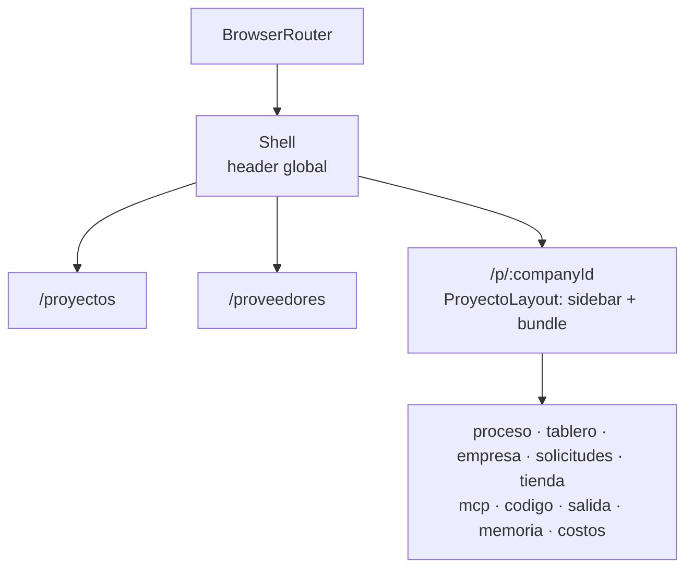
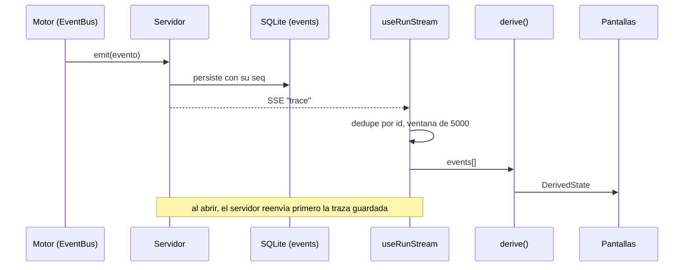

# Frontend web

`apps/web` es la cara del orquestador: una SPA de React que habla sólo con
`/api` y que existe para responder **"¿cómo trabaja esta empresa?" sin leer un
log**. El organigrama se anima con la traza, el tablero mueve una tarjeta en el
instante en que un agente la mueve, y cada pantalla muestra lo que el servidor
sabe de un proyecto.

Esta nota cubre la arquitectura de la UI: arranque, router y shell, datos
(TanStack Query), streams SSE, derivación del estado desde la traza, el cliente
HTTP y cómo se agrega una pantalla. Cada pantalla tiene su nota en
`Pantallas/` (ver la tabla de rutas) y lo visual —tokens, tema, componentes
compartidos, íconos— vive en [[Sistema de diseño y temas]]. La pestaña Código es
un IDE entero y se documenta aparte: [[El IDE]].

## Stack

| Pieza | Versión (`apps/web/package.json`) | Para qué |
|---|---|---|
| `react` + `react-dom` | ^19.0.0 | la UI, montada en `StrictMode` |
| `vite` + `@vitejs/plugin-react` | ^8.1.5 / ^5.0.4 | servidor de desarrollo, proxy y build |
| `tailwindcss` + `@tailwindcss/vite` | ^4.1.13 | estilos por utilidades, configurados desde CSS |
| `@tanstack/react-query` | ^5.62.11 | todo pedido REST: caché, intervalos, invalidación |
| `react-router` | ^7.18.2 | navegación, en modo librería |
| `@xyflow/react` (React Flow) | ^12.8.6 | el organigrama |
| `lucide-react` | ^1.31.0 | íconos |
| `@fontsource-variable/inter` | ^5.3.0 | la tipografía, empaquetada con la app |
| `monaco-editor` + `@monaco-editor/react` | ^0.52.2 / ^4.7.0 | el editor, sólo en la pestaña Código |
| `react-markdown` + `remark-gfm` | ^10.1.0 / ^4.0.1 | notas y chat del IDE |
| `@orq/shared` | workspace | tipos del dominio (Zod) y reglas compartidas |

No hay biblioteca de componentes ni de estado global. Los componentes
compartidos son propios (`apps/web/src/ui/`) y el estado del servidor vive en la
caché de TanStack Query; el estado local de cada pantalla, en `useState`.

La UI **no define el dominio**: importa los tipos que infiere Zod en
`@orq/shared` ([[ADR-002 Zod como única fuente de verdad]]). Lo que `api.ts`
declara aparte son formas de respuesta que no son entidades (`CompanyBundle`,
`RunBundle`, `ResumenProyecto`, `TreeFile`, `ProviderStatus`, `Mantenimiento`…).

`apps/web/tsconfig.json` es un proyecto `composite` referenciado por
`tsc --build`, que es la puerta de calidad del repo ([[Pruebas y calidad]]): por
eso emite sólo declaraciones, a `dist-types/`. El paquete es `"type": "module"` e
importa con extensión `.js` aunque el archivo sea `.tsx` (`verbatimModuleSyntax`).

## Arranque

1. `apps/web/index.html` aplica el tema guardado **antes del primer pintado** con
   un script en línea —sin eso la página parpadea del claro al oscuro— y carga
   `/src/main.tsx`. Ver [[Sistema de diseño y temas]].
2. `apps/web/src/main.tsx` crea el `QueryClient`, importa la fuente Inter y
   `styles.css`, y monta `<App />` dentro de `StrictMode` y `QueryClientProvider`.
3. `apps/web/src/App.tsx` envuelve todo en `ToastProvider` y `BrowserRouter`.

Opciones por defecto de las consultas (`main.tsx`):

| Opción | Valor | Por qué |
|---|---|---|
| `refetchOnWindowFocus` | `false` | la parte en vivo llega por SSE; refrescar al enfocar la pestaña sólo agregaría pedidos redundantes (es el único motivo comentado en el código) |
| `retry` | `1` | el default de TanStack Query son 3: con uno, un error de la API se muestra enseguida |
| `staleTime` | `2000` ms | volver a una pantalla dentro de los 2 s no repite el pedido |

> [!note] En desarrollo cada SSE se abre dos veces
> `StrictMode` corre cada efecto, lo limpia y lo vuelve a correr. Los
> `EventSource` de `lib/stream.ts` se cierran en la limpieza, así que al entrar a
> una pantalla se ve una conexión abrirse y cerrarse enseguida: no es una fuga.

## Servidor de desarrollo y proxy

`apps/web/vite.config.ts`:

| Opción | Valor | Por qué |
|---|---|---|
| `server.port` | `5173` | es el que esperan el CORS del servidor y el default de `APP_URL` |
| `server.strictPort` | `true` | sin esto Vite se corre de puerto en silencio si el 5173 está ocupado, y quedan dos instancias: una sirviendo y otra que creés que estás usando |
| `proxy["/api"].target` | `http://127.0.0.1:${PORT}` | `PORT` sale del **mismo `.env` de la raíz** que usa Fastify (`loadEnv(mode, "../..", "")`, `3001` por defecto). Fijo en el archivo, cambiar `PORT` dejaba a la UI hablándole a otro proceso |
| `proxy["/api"].changeOrigin` | `true` | |
| `proxy["/api"].ws` | `true` | el espejo del teléfono es un WebSocket bajo `/api` ([[Espejo del teléfono]]) |

El proxy hace dos cosas: evita CORS (UI y API quedan en el mismo origen) y
**deja pasar los streams SSE sin buffering**, que es de lo que vive la parte en
vivo.

Del otro lado, la API cierra CORS a una lista (`apps/server/src/index.ts` →
`construirApp({ origenes })`): el origen de `APP_URL`, `localhost:5173`,
`127.0.0.1:5173` y `localhost`/`127.0.0.1` en `PORT`. La UI, por el proxy, no lo
nota; una página cualquiera abierta en el navegador —o la vista previa de un
servicio, que corre código de un agente— ya no puede leer lo que devuelve la
API. Ver [[Vista previa y proxy]] y [[Seguridad]].

`npm run dev` levanta servidor y UI juntos y `npm run dev:web` sólo Vite
([[Comandos]]). `npm run build` corre `vite build` y deja `apps/web/dist/`, pero
**el servidor no sirve ese directorio**: la UI se usa a través de Vite.

La pestaña Código carga Monaco, que pesa varios MB: `App.tsx` la trae con
`lazy(() => import("./routes/Codigo.js"))` dentro de un `Suspense` que dice
"Abriendo el IDE…". Monaco se empaqueta con Vite, sin CDN, con los workers
importados con `?worker` (`routes/codigo/monaco.ts`). Ver
[[Editor, explorador y búsqueda]].

## Router y shell

La navegación vive en la URL: `react-router` v7 **en modo librería**
(`BrowserRouter` + `Routes`, sin loaders ni data router). El comentario de
`App.tsx` cuenta por qué: antes era un `useState` con diez pestañas, y sin URL no
había forma de mandar un enlace a una corrida, refrescar perdía el lugar y el
botón atrás no hacía nada. Hoy "qué proyecto está abierto" es el `:companyId` de
la ruta, no estado de React.

### Rutas

| Ruta | Elemento | Nota |
|---|---|---|
| `/` | `Navigate` → `/proyectos` | — |
| `/proyectos` | `ProyectosRuta` → `Proyectos` | [[Pantalla Proyectos]] |
| `/proveedores` | `Providers` | [[Pantalla Configuración]] |
| `/p/:companyId` | `ProyectoLayout`; el índice navega a `empresa` | — |
| `/p/:companyId/proceso` | `LiveProcess` | [[Pantalla Proceso en vivo]] |
| `/p/:companyId/tablero` | `Board` | [[Pantalla Tablero]] |
| `/p/:companyId/empresa` | `EmpresaRuta` → `CompanyDesigner` | [[Pantalla Empresa y organigrama]] |
| `/p/:companyId/solicitudes` | `Requests` | [[Pantalla Solicitudes]] |
| `/p/:companyId/tienda` | `Tienda` | [[Pantalla Tienda]] |
| `/p/:companyId/mcp` | `McpHub` | [[Pantalla Hub MCP]] |
| `/p/:companyId/codigo` | `Codigo` (lazy) | [[El IDE]] |
| `/p/:companyId/salida` | `Output` | [[Pantalla Salida]] |
| `/p/:companyId/memoria` | `Memory` | [[Pantalla Memoria]] |
| `/p/:companyId/costos` | `Costs` | [[Pantalla Configuración]] |
| `*` | `Navigate` → `/proyectos` | — |

Una sección que no existe (`/p/x/algo`) no matchea ningún hijo de
`/p/:companyId` y cae en `*`.

### Shell: el header global

`App.tsx` → `Shell`, una grilla `grid-rows-[auto_1fr]` con el header y un
`<main className="min-h-0">` que contiene el `Outlet`. En el header:

- La marca "Orquestador Agéntico" (enlace a `/proyectos`) y dos `NavLink`
  globales: **Proyectos** (`LayoutGrid`) y **Proveedores** (`ServerCog`).
- `PulsoDeCorrida`, sólo con un proyecto en la URL: cuánto lleva la última
  corrida y hace cuánto dio señal. Vive en el shell y no en Proceso porque un
  encargo dura horas y quien lo sigue está en el tablero o en la salida, no
  mirando la traza. Ver [[Sistema de diseño y temas]].
- Un `<select>` de proyectos (consulta `["companies"]`) para alternar rápido
  **conservando la sección**: toma el tercer segmento de
  `window.location.pathname` (`/p/<id>/<sección>`) y navega a
  `/p/<nuevo>/<sección>`; desde `/proyectos` o `/proveedores` cae en `empresa`.
  Se deshabilita sin proyectos.
- `BotonDeTema`.

`Shell` es una ruta de layout sin `path` y aun así `useParams()` le devuelve
`companyId`: React Router comparte el objeto de parámetros entre todos los
matches de una rama.

### ProyectoLayout: la barra lateral

`App.tsx` → `ProyectoLayout`, grilla `grid-cols-[52px_1fr]`. La barra sale de la
constante `SECCIONES`: diez entradas con `path`, `etiqueta`, ícono de Lucide y un
`title` que explica la sección, dibujadas como `NavLink` relativos (activo:
`bg-accent/15 text-accent`).

| Sección | Ícono | `title` |
|---|---|---|
| Proceso | `Activity` | La corrida en vivo: organigrama animado, timeline y controles. |
| Tablero | `KanbanSquare` | Las tareas de la corrida como kanban. |
| Empresa | `Network` | La organización: áreas, agentes y sus herramientas. |
| Solicitudes | `Inbox` | Lo que los agentes te piden: roles, datos, accesos, servidores. |
| Tienda | `Store` | Catálogo de servidores MCP, instalables en un click. |
| MCP | `Plug` | Servidores MCP conectados: salud, reconexión y probador. |
| Código | `Code2` | Los repos del proyecto: la rama de los agentes, su diff, integrar o descartar. |
| Salida | `FolderOutput` | Los archivos que la empresa produjo. |
| Memoria | `Brain` | Lo que la empresa aprendió entre corridas. |
| Costos | `Receipt` | Cuánto gastó cada corrida, por agente y por modelo. |

El área de contenido carga el bundle del proyecto con
`useQuery(["company", companyId])` → `GET /api/companies/:id`, que devuelve
`company`, `departments`, `roles`, `policies`, `mcpServers` y `tools`
(`CompanyBundle`). Tres estados, y el orden importa:

1. `company.isError` → "Ese proyecto ya no existe." y un botón **Volver a
   Proyectos**. Va primero porque un proyecto borrado desde otra pestaña deja la
   consulta en error, y tratar el error como carga dejaba la pantalla diciendo
   "Cargando…" para siempre.
2. Cargando → dos `Skeleton`.
3. Listo → `<Outlet context={company.data} />`.

Cada pantalla recibe el bundle por el adaptador `Pantalla`
(`useOutletContext<CompanyBundle>()`), que lo pasa como prop. Casi todas se
montan con `key={c.company.id}`: cambiar de proyecto desde el `<select>` las
**remonta** y descarta su estado local (la corrida elegida, el rol seleccionado,
los filtros).

> [!warning] `Output` no lleva `key`
> La ruta `salida` es la única sin `key`. Al cambiar de proyecto con el
> `<select>`, Salida conserva el archivo que tenía en la vista previa y se la
> pide al proyecto nuevo, que no lo tiene: aparece un error hasta elegir otro.
> Ver [[Pantalla Salida]].

### Soltar un proyecto que ya no existe

- Borrarlo desde **Mantenimiento** navega a `/proyectos` (`EmpresaRuta` le pasa
  `onCompanyGone` a `CompanyDesigner`): sin eso la pantalla quedaba cargando un
  id muerto.
- Borrarlo desde **Proyectos** no necesita soltar nada —`onBorrado` es un no-op a
  propósito—: la selección vive en la URL y en `/proyectos` no hay ninguna.

> [!warning] En `/proyectos` nunca hay un proyecto activo
> `ProyectosRuta` le pasa `activeId={companyId ?? null}`, pero `/proyectos` no
> tiene `:companyId`: `activeId` es siempre `null`. Ninguna ficha se marca
> "abierto" ni ofrece "ir al diseñador". Es un resto de cuando la selección era
> estado de React. Ver [[Pantalla Proyectos]].

## Datos: TanStack Query

Todo lo que viene por REST pasa por `useQuery`/`useMutation`. Las claves tienen
la forma `[recurso, id]` y cada mutación invalida lo que cambió. La tabla cubre
las pantallas de `Pantallas/`; el IDE agrega las suyas (`repos`, `arbol`, `scm`,
`servicios`, `dispositivos`…) y las documenta [[El IDE]].

| Clave | Pedido | Quién | Intervalo | La invalidan |
|---|---|---|---|---|
| `["companies"]` | `GET /api/companies` | `<select>` del shell | — | crear, borrar o renombrar un proyecto |
| `["company", id]` | `GET /api/companies/:id` | `ProyectoLayout` | — | roles y áreas, alta/baja/instalación de MCP, matriz de accesos, resolver una solicitud, renombrar |
| `["proyectos"]` | `GET /api/companies/resumen` | Proyectos | — | crear, borrar, renombrar |
| `["plantillas"]` | `GET /api/plantillas` | Proyectos | — | — |
| `["progreso", id]` | `GET /api/companies/:id/progreso` | `PulsoDeCorrida` | 5 s con corrida viva, 30 s sin | — |
| `["runs", id]` | `GET /api/runs?companyId=` | Proceso, Tablero, Costos | 5 s en Proceso y Tablero | controles de la corrida, borrar corridas |
| `["run", runId]` | `GET /api/runs/:id` | Proceso (3 s), Tablero (5 s), Costos (—) | ídem | controles, aprobar, inyectar un mensaje |
| `["run-events", runId]` | `GET /api/runs/:id/events` | Proceso, sólo al retroceder | — | se descarta al borrar |
| `["requests", id]` | `GET /api/companies/:id/requests` | Solicitudes (4 s), Empresa (—) | ídem | resolver, borrar un rol |
| `["learnings", id]` | `GET /api/companies/:id/learnings` | Memoria | 5 s | alta, edición, borrado, resolver una solicitud |
| `["export-tree", id]` | `GET /api/companies/:id/exports` | Salida (5 s), pestaña Entregables de Proceso (5 s, sólo abierta) | ídem | crear carpeta, borrar, publicar |
| `["export-preview", id, ruta]` | `GET /api/companies/:id/exports-preview/*` | Salida | — | — |
| `["mcp-health", id]` | `GET /api/companies/:id/mcp/health` | Hub | 10 s | reconectar, alta, baja, instalar |
| `["tools", id]` | `GET /api/companies/:id/tools` | Hub | 10 s | reconectar, alta, baja, instalar |
| `["tienda-mcp", id]` | `GET /api/tienda-mcp?companyId=` | Tienda, tienda del Hub | — | instalar |
| `["providers"]` | `GET /api/providers` | Proveedores | — | — |
| `["models"]` | `GET /api/models` | editor de roles | — | — |
| `["mantenimiento"]` | `GET /api/mantenimiento` | Mantenimiento, sólo abierto | — | cada acción de limpieza |

Tres reglas que salieron de haberlas roto:

- **`refetchIntervalInBackground: true`** en lo que sigue una corrida (la lista
  de corridas, el bundle, el árbol de salida, las solicitudes): una corrida
  continua dura minutos y la persona cambia de pestaña del navegador; sin esto
  React Query pausa el intervalo al perder el foco y la vista quedaba congelada al
  volver.
- **Borrar una corrida descarta su caché, no sólo la lista**
  (`LiveProcess.tsx` → `trasBorrar`: `removeQueries(["run"])` y
  `removeQueries(["run-events"])`): si no, sus mensajes y su estado seguían
  dibujados hasta el próximo refresco.
- **Lo caro sólo se pide si se mira**: el diagnóstico de Mantenimiento recorre el
  disco entero (`enabled: abierto`), el árbol de la pestaña Entregables sólo
  corre con esa pestaña abierta, y la traza completa sólo al retroceder.

### "La UI no hace polling", con precisión

`CLAUDE.md` dice que la UI deriva su estado de la traza y no hace polling. Es
cierto para **lo que pasa en una corrida**: el organigrama, la cronología, el
tablero, el consumo por agente y el panel de un agente salen del stream SSE y se
mueven en el instante del evento. Lo que **no viaja en un evento** se consulta
con intervalo: la lista de corridas, las bandejas y el detalle de las tareas
(prioridad, resultado), las solicitudes, la memoria, el árbol de archivos y la
salud MCP (que además tiene su SSE). Es un reparto, no una contradicción: lo que
importa ver al instante emite su evento, y emitir uno por cada fila que cambia en
la base no vale lo que cuesta.

## Streams SSE

`apps/web/src/lib/stream.ts`: dos hooks, uno por canal ([[API HTTP y SSE]]).

### `useRunStream(runId)`

1. Al cambiar `runId` vacía los eventos y el conjunto de vistos; sin `runId`
   queda desconectado.
2. Abre `new EventSource("/api/runs/:id/stream")`. `onopen` y `onerror`
   alimentan `connected`, que Proceso muestra como "● en vivo" / "○ desconectado".
3. Escucha el evento SSE **`trace`**: cada mensaje es un `TraceEvent` en JSON.
4. **Deduplica por `event.id`** con un `Set` guardado en un `ref`. El servidor
   reenvía la traza guardada al abrir el stream (`routes.ts` → recorre
   `store.listEvents(id)` antes de suscribirse al vivo) y una reconexión la
   reenvía otra vez: sin el `Set` la UI duplicaría todo.
5. Retiene una ventana de **`MAX_EVENTS = 5000`**. Una corrida larga emite
   decenas de miles de eventos y la pestaña no tiene por qué comerse la memoria;
   la traza completa está en la base y se lee con `api.runEvents`, que es lo que
   usa el timeline al retroceder.
6. Cierra el `EventSource` al desmontar o al cambiar de corrida. Reconectar lo
   hace el navegador solo: es el comportamiento estándar de `EventSource`.

### `useMcpStream()`

Abre `/api/mcp/stream`, escucha el evento **`mcp`** (un `McpServerHealth`) y
mantiene un `Map` por `serverId`. El canal no manda una foto inicial: el Hub la
pide por REST (`["mcp-health"]`) y el stream la **pisa** cuando llega algo más
nuevo. El mapa conserva el último estado de un servidor ya borrado; por eso el
Hub filtra contra la configuración ([[Pantalla Hub MCP]]).

### Del lado del servidor

`apps/server/src/routes.ts` → `openSse`: `Content-Type: text/event-stream`,
`Cache-Control: no-cache, no-transform`, `X-Accel-Buffering: no`, un comentario
`: conectado` al abrir y un **latido `: ping` cada 20 s** para que ningún proxy
corte la conexión por inactividad.

El IDE tiene un tercer canal, `/api/companies/:id/codigo/stream` (evento
`codigo`), que sólo invalida consultas del IDE: ver [[El IDE]].

## El estado se deriva de la traza

`apps/web/src/lib/derive.ts` → `derive(events, upTo = events.length)` reproduce
los eventos **hasta un corte** y devuelve el estado visible. Por eso "ver en
vivo" y "retroceder en el timeline" son la misma operación con un corte distinto,
y el replay muestra exactamente lo que se vio la primera vez
([[Observabilidad y trazas]]).

| Evento | Efecto en el estado derivado |
|---|---|
| cualquiera | `tick` y `maxTick` toman el mayor visto; `eventsPerTick` cuenta por ciclo |
| `run.status` | `status` y `stopReason` |
| `model.selected` | por rol: `modelSlug`, `providerId`, `tier`, `escaladoPorDificultad`, `motivoModelo`. Llega **antes** que `agent.thinking` y trae lo que ése no tiene |
| `agent.thinking` | por rol: `thinking = true` y `modelSlug` |
| `tool.start` | por rol: `runningTool` |
| `tool.end` | limpia `runningTool` si coincide; agrega una `AccionReciente` (el detalle es el error o el preview, cortado a 160) a una cola de **120**; si trae `mcpServerId`, una `McpActivity` |
| `agent.turn_end` | `thinking = false`, `runningTool = null`, `turns + 1`, suma `costUsd`, guarda `lastSummary` |
| `agent.message` | agrega un `MessageFlow` (de, a, tipo, asunto, preview, ciclo) |
| `task.changed` | crea o actualiza la `DerivedTask`; anota un paso en `historia` **sólo si la etapa cambió** —un `update_task` que reafirma el estado no es historia—; `from` es la etapa anterior, o `null` en la creación |
| `tool.selection` | guarda `exposed`, `candidates` y `reason` por rol |
| `cost.updated` | `totalCostUsd` y `budgetUsd` (el último), suma tokens de entrada, salida y caché en total **y por rol**: el evento trae el rol, así el desglose sale de la misma fuente que el total |
| resto | sólo cuentan para el ciclo: `tick.start`, `tick.end`, `mcp.status`, `artifact.created`, `request.created`, `approval.changed`, `log`, `codigo.checkpoint` |

Lo que devuelve (`DerivedState`):

- `roles: Map<roleId, RoleActivity>` — `thinking`, `modelSlug`, `providerId`,
  `tier`, `escaladoPorDificultad`, `motivoModelo`, `runningTool`, `turns`,
  `costUsd`, `inputTokens`, `cachedInputTokens`, `outputTokens`, `lastSummary`.
- `tasks: Map<taskId, DerivedTask>` en orden de aparición — `id`, `title`,
  `assigneeRoleId`, `status`, `tick`, `changedAt`, `from` y
  `historia: {status, tick, at}[]`.
- `flows`, `acciones` (las últimas 120), `mcpCalls`, `toolSelections`.
- `tick`, `maxTick`, `totalCostUsd`, `budgetUsd`, `inputTokens`,
  `cachedInputTokens`, `outputTokens`, `status`, `stopReason`, `eventsPerTick`.

Ayudantes del mismo archivo:

- `recentFlows(flows, windowMs = 4000)`: los pares `de->a` con un mensaje en los
  últimos 4 s, que son las aristas que se animan.
- `MESSAGE_COLOR` y `MESSAGE_LABEL`: color (token) y rótulo de los nueve tipos de
  mensaje — `request` "pedido", `response` "respuesta", `report` "informe",
  `escalation` "escalamiento", `approval_request` "pide aprobación",
  `approval_grant` "aprobado", `approval_deny` "rechazado", `broadcast`
  "anuncio", `human` "persona".
- `porcentajeCache(state)`: qué porcentaje de la entrada vino del caché,
  redondeado.

> [!note] Campos derivados que nadie lee
> `eventsPerTick` (pensado para dibujar la densidad del timeline), `maxTick` y
> `mcpCalls` (pensado para el destello del Hub, cuya clase `.mcp-flash` tampoco
> se usa) se calculan y ninguna pantalla los consume.

> [!warning] Lo que no retrocede con el timeline
> El corte sólo afecta a lo que se deriva: organigrama, cronología, panel del
> agente y la cabecera de costo y tokens. La barra lateral de Proceso (mensajes,
> tareas, entregables, aprobaciones), los contadores de bandeja y el estado de la
> corrida vienen del bundle REST y **muestran siempre el presente**. El Tablero no
> tiene timeline. Ver [[Pantalla Proceso en vivo]].

## El pulso de una corrida

`apps/web/src/lib/progreso.ts` → `calcularProgreso(run, progreso, viva, ahora)`.
El tiempo solo no dice nada: una corrida puede llevar dos horas trabajando o dos
horas colgada, y lo que las distingue es **hace cuánto pasó algo**. La función es
pura y recibe `ahora`, así el contador se fija con tests en vez de depender del
reloj, igual que la fecha del motor y el render de documentos.

| Constante | Valor | Por qué |
|---|---|---|
| `CALLADO_MS` | 120 000 ms | una grabación de clip tarda 20 a 100 s y un turno delegado pasa minutos entre herramienta y herramienta: avisar a los 30 s sería gritar todo el tiempo; a los dos minutos ya es raro |
| `SIN_SENAL_MS` | 360 000 ms | arriba de seis minutos vale la pena que alguien mire |

`Salud`: **`detenida`** si la corrida no está viva en memoria o su estado no es
`running` —cubre la que la base muestra `running` y no sobrevivió a un
reinicio—; si no, **`sin-señal`** pasado `SIN_SENAL_MS`, **`callado`** pasado
`CALLADO_MS` y **`trabajando`** en otro caso, también cuando todavía no hubo
eventos (no inventa un silencio). El reloj de una corrida terminada se congela en
`endedAt`: si siguiera contando, mañana diría que el encargo llevó veinte horas.

`duracion(ms)` da `"5s"`, `"1m 30s"`, `"1h 2m"`: corta porque vive en una barra;
bajo un minuto cuenta segundos porque ahí la diferencia entre 5 y 50 es justo lo
que se mira.

El dato sale de `GET /api/companies/:id/progreso`: la corrida **más reciente**,
viva o no; `viva` (`runtime.estaViva`); y `progreso` (`store.progresoDeCorrida`:
cantidad de eventos, `acciones` = cantidad de `tool.end`, y el `at` del último
evento). El estado autoritativo es `runtime.snapshot`, no la fila de la base, que
queda vieja al pausar o detener.

## Cómo se cuenta lo que hace un agente

`apps/web/src/lib/acciones.ts`. Vive en `lib/` porque lo usan dos pantallas —la
cronología de Proceso y el detalle de una tarjeta del Tablero— y duplicar el
diccionario garantizaba que se desincronizaran.

- **`ACCION_HUMANA`**: nombre de herramienta → frase en presente, que es el
  tiempo del panel ("escribe un entregable", "pide un dato del negocio", "busca en
  la web"…). 26 entradas: coordinación, entregables, Word/PDF, archivos de salida
  y las dos web. El nombre técnico no se pierde: queda en el `title` de la fila.
- **`accionDeHerramienta(nombre)`**: el diccionario primero. Si es de MCP
  (`mcp__<servidor>__<acción>`) deduce el verbo por la raíz con `VERBOS_MCP`
  —`read|get|open|cat` "lee", `search|query|find|grep` "busca", `list|tree|map`
  "mira qué hay", `write|create|append|patch|edit|put` "escribe",
  `delete|remove|rm` "borra", `move|rename` "mueve algo", gana el primero que
  coincide— y nombra el servidor: "lee en obsidian". Cualquier otra, con los
  guiones bajos cambiados por espacios.
- **`demora(ms)`**: `null` bajo **1500 ms**; si no, segundos con un decimal. Casi
  todas las de coordinación son instantáneas: mostrar milisegundos en cada fila
  era ruido para avisar en una.

> [!note] El diccionario no conoce las herramientas nuevas
> Las de video, código, contexto, supervisión o teléfono no están en
> `ACCION_HUMANA` y caen al último recurso: `export_video` se lee "export video"
> y `estado_del_proceso`, "estado del proceso". Una herramienta propia del CLI
> (`cli:Edit`) queda tal cual.

## El cliente HTTP

`apps/web/src/api.ts`: una función `request<T>` y un objeto `api` con un método
por endpoint. Las rutas son relativas (`/api…`) porque Vite proxea.

Reglas de `request`:

1. **`content-type: application/json` sólo cuando hay cuerpo.** Fastify rechaza
   con 400 un body vacío si el encabezado dice que viene JSON, y eso rompía
   **todos los DELETE**.
2. La respuesta se lee como texto y se parsea sólo si trae algo: un cuerpo vacío
   da `null`.
3. Una respuesta no-2xx lanza `Error(payload.error ?? "HTTP <código>")`. Las
   pantallas muestran ese `message`, que es el texto en castellano que armó el
   servidor.

> [!warning] Lo que `request` descarta al fallar
> Sólo sobrevive `error`. Un 400 de validación trae además `issues` con el
> detalle de Zod (`routes.ts` → `invalid`) y la persona ve apenas "Los datos
> enviados no son válidos."; un 409 de publicar trae `existe: true` y la pantalla
> de Salida lo tiene que reconocer **por el texto** del mensaje. Si cambiás esos
> textos en el servidor, revisá quién los compara.

- `encodePath(ruta)` codifica **cada segmento por separado**: en las rutas de la
  salida las barras son parte del camino.
- Constructores de URL para `<a>`, `<iframe>`, `` y `<video>`: `exportUrl`
  (descarga, `attachment`), `exportInlineUrl` (lo mismo con `?inline`, para
  dibujarse en pantalla), `patchUrl`, `vistaUrl`, `urlVideo`, `urlPantalla`.

Los métodos, por dominio. El detalle de cada endpoint está en
[[Referencia de API]] y, para el bloque de código y móvil, en
[[Referencia de API de código y móvil]]:

| Grupo | Métodos |
|---|---|
| Catálogo | `providers`, `models` |
| Proyectos | `companies`, `resumenProyectos`, `company`, `plantillas`, `createCompany`, `renombrarEmpresa`, `deleteCompany`, `updateCompany`, `blueprint`, `importCompany` |
| Organización | `createRole`, `updateRole`, `deleteRole`, `createDepartment`, `deleteDepartment`, `tools` |
| Salida | `exportTree`, `createFolder`, `deleteFile`, `publishFile`, `exportPreview`, `vaciarSalida`, `exportUrl`, `exportInlineUrl` |
| Solicitudes y memoria | `requests`, `resolveRequest`, `learnings`, `addLearning`, `updateLearning`, `deleteLearning` |
| MCP y tienda | `mcpHealth`, `reconnectMcp`, `crearMcpServer`, `actualizarMcpServer`, `borrarMcpServer`, `tiendaMcp`, `instalarDeTienda`, `probeTool` |
| Corridas | `progreso`, `runs`, `run`, `runEvents`, `createRun`, `tick`, `resume`, `pause`, `stop`, `inject`, `resolveApproval`, `deleteRun`, `limpiarCorridas`, `limpiarCorridasTodas` |
| Mantenimiento | `mantenimiento`, `purgar` |
| Código, IDE y móvil | repos, sesiones, archivos, control de versiones, servicios, dispositivos, AAB, chat: ver [[El IDE]] |

> [!note] Métodos sin pantalla
> `updateCompany`, `blueprint`, `importCompany` y `actualizarMcpServer` existen y
> ninguna pantalla los llama. Editar la misión, el contexto de negocio, el
> presupuesto o el modelo por defecto de una empresa, sus políticas y sus
> misiones, o exportar e importar su blueprint, hoy se hace por la API. Ver
> [[Pantalla Empresa y organigrama]].

## Cómo se agrega una pantalla

1. **El componente**, en `apps/web/src/routes/`, recibiendo
   `company: CompanyBundle` por prop. Si el dato vive en la corrida, derivalo de
   la traza con `useRunStream` + `derive`; si no viaja en eventos, pedilo con
   `useQuery`.
2. **La ruta** en `App.tsx`, dentro de `/p/:companyId`, con el adaptador y la
   `key`:
   `<Route path="x" element={<Pantalla render={(c) => <X key={c.company.id} company={c} />} />} />`.
   La `key` es lo que hace que cambiar de proyecto la remonte.
3. **La entrada en `SECCIONES`**: `path`, una `etiqueta` corta (el botón mide
   44 px), un ícono de Lucide y un `title` que diga para qué sirve.
4. **El cliente**: un método en `api.ts` con los tipos de `@orq/shared`. Si el
   endpoint es nuevo, va primero en el servidor ([[API HTTP y SSE]]).
5. **Las claves**: `[recurso, companyId]`, e invalidá desde cada mutación todo lo
   que cambia —el bundle `["company", id]` si toca roles, herramientas o
   servidores—.
6. **Si algo tiene que verse en vivo y hoy no emite evento**, agregá el evento
   antes que un intervalo: [[Cómo agregar un evento]].
7. **Los componentes** de `ui/index.js` y los tokens de color, `min-w-0` en cada
   ítem de grilla o flex, y estados de carga, vacío y error explícitos. Ver
   [[Sistema de diseño y temas]].
8. Si pesa, `lazy` + `Suspense`, como la pestaña Código.

## Trampas

> [!danger] `content-type` con cuerpo vacío
> Si `request` pone el encabezado siempre, Fastify contesta 400 a todos los
> DELETE.

> [!warning] `min-w-0` en grillas y flex
> El `min-width: auto` de un ítem de grilla o flex no lo deja achicarse por
> debajo de su contenido: un texto largo estira el panel y desborda la página a lo
> ancho. `Panel` ya lo trae; las columnas que armes a mano también lo necesitan.

> [!danger] El organigrama invisible
> React Flow deja los nodos en `visibility: hidden` hasta medirlos; si en cada
> render recibe objetos nuevos, pierde la medición y vuelve a empezar. Con la
> traza llegando por SSE nunca terminaba. Ver
> [[Pantalla Empresa y organigrama]].

> [!danger] No hay *error boundary*
> Ninguna parte de la UI captura errores de render: una excepción en un
> componente deja la aplicación entera en blanco. Si la ves vacía, mirá la
> consola del navegador.

> [!warning] Un proceso viejo en el 3001
> Vite no se corre de puerto, pero un servidor viejo puede seguir tomando el 3001
> y servir código anterior: la UI habla con ése. Ver [[Diagnóstico de problemas]].

## Qué fijan los tests

`apps/web/src/lib/progreso.test.ts`:

- cuenta desde que arrancó y muestra el ciclo (`1h 0m`, `3/24`, acciones y
  última señal);
- un silencio de 90 s no es alarma: una grabación de clip tarda hasta 100 s;
- a los dos minutos avisa (`callado`) y a los seis pide que alguien mire
  (`sin-señal`);
- una corrida terminada congela su reloj en `endedAt`;
- una corrida que no está viva en memoria no se dibuja como trabajando;
- sin eventos todavía, no inventa un silencio;
- `duracion`: bajo un minuto cuenta segundos; después minutos y horas.

`apps/web/src/ui/modelo.test.ts` fija la familia y el nombre corto de un modelo
(ver [[Sistema de diseño y temas]]). No hay tests de componentes ni de
navegación: para la UI la puerta de calidad es `npm run typecheck`. Los tests de
`routes/codigo/` son del IDE.

## Fuentes

- `apps/web/index.html` — script de tema previo al pintado.
- `apps/web/vite.config.ts` — puerto, `strictPort`, proxy de `/api` con `ws`.
- `apps/web/package.json`, `apps/web/tsconfig.json`.
- `apps/web/src/main.tsx` — `QueryClient` y sus defaults.
- `apps/web/src/App.tsx` — `App`, `Shell`, `ProyectoLayout`, `Pantalla`,
  `EmpresaRuta`, `ProyectosRuta`, `SECCIONES`.
- `apps/web/src/api.ts` — `request`, `encodePath`, `api`, tipos de respuesta.
- `apps/web/src/lib/stream.ts` — `useRunStream`, `useMcpStream`, `MAX_EVENTS`.
- `apps/web/src/lib/derive.ts` — `derive`, `recentFlows`, `MESSAGE_COLOR`,
  `MESSAGE_LABEL`, `porcentajeCache`.
- `apps/web/src/lib/progreso.ts` — `calcularProgreso`, `duracion`,
  `CALLADO_MS`, `SIN_SENAL_MS`.
- `apps/web/src/lib/acciones.ts` — `ACCION_HUMANA`, `VERBOS_MCP`,
  `accionDeHerramienta`, `demora`.
- `apps/server/src/routes.ts` — `openSse`, `/api/runs/:id/stream`,
  `/api/mcp/stream`, `/api/companies/:id/progreso`, `invalid`.
- `apps/server/src/index.ts` y `apps/server/src/app.ts` — `construirApp`,
  `origenes`.

## Ver también

- [[Sistema de diseño y temas]] — tokens, tema y componentes compartidos
- [[Observabilidad y trazas]] — de dónde sale el estado
- [[API HTTP y SSE]] — el contrato del otro lado
- [[Referencia de eventos]] — cada variante de la traza
- [[El IDE]] — la pestaña Código
- [[Trampas conocidas]]
