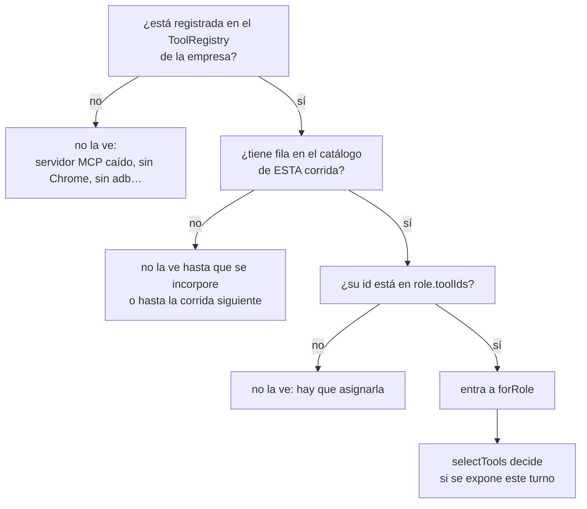
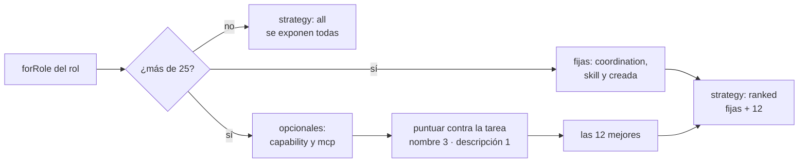

# Herramientas y tool router

Todo lo que un agente puede *hacer* —hablarle a otro rol, escribir un entregable,
exportar un PDF, editar código, consultar un servidor MCP— es una
**herramienta**: un objeto `RegisteredTool` con nombre, esquema de argumentos y
una función `execute`. Esta nota cubre el contrato, cómo se arma el catálogo de
cada empresa, qué herramientas ve cada rol en cada turno (el *tool router*) y
cómo las ejecuta el motor.

Vive en su propio paquete (`packages/tools`) porque las herramientas **no
conocen la base ni el motor**: escriben contra el puerto `AgentWorkspace`, que el
motor implementa contra `RunState`. Así se prueban con un workspace en memoria y
las dependencias apuntan hacia las interfaces (ver
[[ADR-003 Motor desacoplado del servidor]]).

La lista de herramientas está en [[Catálogo de herramientas]] (por familia) y en
[[Referencia de herramientas]] (argumento por argumento).

## El contrato

`packages/tools/src/types.ts`

### `RegisteredTool`

| Campo | Tipo | Qué significa |
|---|---|---|
| `name` | `string` | lo que ve el modelo. Es la clave del registro: registrar otra con el mismo nombre **la reemplaza**. Las de MCP van como `mcp__<servidor>__<tool>` |
| `description` | `string` | lo único que el modelo lee para decidir cuándo usarla, y además pesa en el ranking del router |
| `inputSchema` | JSON Schema | los argumentos, tal como se le pasan al modelo. Cerrarlo con `additionalProperties: false` cambia cómo funciona el memo (ver abajo) |
| `origin` | `ToolOrigin` | `coordination`, `capability`, `skill`, `mcp` o `creada` |
| `readOnly` | `boolean` | sin efectos secundarios: el motor la corre en paralelo y memoiza su resultado dentro del turno |
| `clavesDeCache?` | `string[]` | qué argumentos determinan el resultado. Los demás (un rótulo, un comentario) no entran en la huella del memo |
| `requiresApproval` | `boolean` | **no se ejecuta**: abre una aprobación y el turno espera |
| `mcpServerId?` | `string` | servidor de origen, si `origin === "mcp"` |
| `execute(args, ctx)` | `Promise<ToolResult>` | la ejecución |

### `ToolResult` y sus ayudantes

- `ok(content, preview?)` → `{ ok: true, content, preview? }`.
- `fail(content)` → `{ ok: false, content: "ERROR: " + content }`.
- `preview(text, max = 400)` aplana los espacios y corta con `…`.

`content` es lo que lee el modelo; `preview` es el recorte para la UI (viaja en
`tool.end.preview`, que el esquema acota a 2.000 caracteres). Si falta, el motor
recorta `content` a 400.

Un error de herramienta **no rompe el turno**: vuelve al modelo como resultado
para que corrija y reintente, igual que a una persona le rebotan un formulario.
Por eso el texto del error importa tanto como el camino feliz: es lo único que el
agente puede leer para corregirse (`buscarEntregable` lista las claves que sí
existen, `assign_task` devuelve el equipo real, `puedeBorrar` nombra a quién
escalarle).

> [!warning] `summary` no es parte del contrato
> `calcular` y `verificar_cifras` (`packages/tools/src/calculo.ts`) devuelven un
> campo `summary` que nadie lee: el motor mira `preview`. En la UI esas dos
> muestran el recorte genérico de `content`.

### `ToolContext`

| Campo | Qué es |
|---|---|
| `runId`, `tick` | la corrida y el ciclo |
| `actor` | el rol que ejecuta el turno |
| `workspace` | `AgentWorkspace` **atado al actor** (`RunState.forActor`): el actor viaja en el closure, no en un campo compartido. Ver [[Estado de una corrida]] |
| `currentThreadId`, `currentMessageId` | el mensaje que disparó el turno, si lo hubo |
| `replyToRoleId` | a quién le contesta `reply` |
| `signal?` | se aborta al detener la corrida |

`AgentWorkspace` es el puerto hacia el estado vivo: mensajes, tareas, entregables,
aprobaciones, memoria, solicitudes y actividad; más `tools` (el catálogo del
proyecto, para resolver un nombre a su id al repartir) y `mcpServers` (para que
`solicitar_servidor_mcp` no proponga uno que ya existe).

## Los cinco orígenes

Conviven con la misma forma pero no con las mismas reglas
(`packages/shared/src/schema.ts` → `toolOriginSchema`):

| Origen | Qué agrupa | Se registra en | ¿Por `toolIds`? | ¿Compite en el ranking? | Fila en `tools` |
|---|---|---|---|---|---|
| `coordination` | hablar, delegar, tareas, entregables, memoria, pedidos a la persona, contexto, `crear_herramienta` | constructor de `ToolRegistry` (23) y `companyRuntime` (4) | **no: siempre** | no | no la siembra nadie a propósito (ver abajo) |
| `capability` | acciones hacia afuera: `web_search`, `fetch_url`, `send_email` | constructor (2) y `companyRuntime` (1) | sí | **sí** | `sembrarHerramientas` |
| `skill` | lo que el rol sabe producir: documentos, video, salida, código, teléfono, R2 | `createSkillTools`, `registrarCodigoEn` | sí | no | `sembrarHerramientas` |
| `mcp` | descubiertas de un servidor MCP | `McpBridge.discover` | sí | **sí** | `persistMcpTools` |
| `creada` | compuestas por un agente | `crear_herramienta` y `companyRuntime` al levantar | sí (el creador la recibe sola) | no | `incorporarHerramienta` |

Las dos reglas de asignación parecen contradictorias y no lo son:

- **Coordinación siempre.** Sin ellas un agente no puede responder, delegar ni
  escalar, y la empresa no existiría como tal. `forRole` las regala sin mirar
  `role.toolIds`, y la UI de asignación no las dibuja como casillas
  (`apps/web/src/routes/Settings.tsx` → `AsignacionDeHerramientas`).
- **Una habilidad nunca se otorga sola.** "Puede entregar un Word" es una
  capacidad del rol, como en una empresa real. Si armás una empresa por código y
  la habilidad no tiene fila en `tools`, `role.toolIds` no puede apuntarla y vas a
  ver a un agente explicando que no encuentra `export_video`. La empresa creada
  por la API siembra sola (`Runtime.sembrarHerramientas`, sólo `capability` y
  `skill`); el seed de ejemplo también (`apps/server/src/seed.ts`).

> [!note] Las de coordinación también pueden terminar en la tabla
> `sembrarHerramientas` las excluye a propósito, pero `persistMcpTools`
> (`apps/server/src/runtime.ts`) guarda **todo** lo que describe el registro
> —salvo las `creada`— cada vez que un servidor MCP publica su estado. En una
> empresa con MCP las filas de coordinación aparecen; la UI las muestra aparte,
> como etiquetas no quitables.

## El registro de una empresa

`ToolRegistry` (`packages/tools/src/registry.ts`) es un `Map` por nombre con
`register`, `unregister(name)`, `unregisterByMcpServer(id)`, `get`, `all`,
`byOrigin`, `forRole` y `describe`. Hay **uno por empresa**
(`CompanyRuntime.tools`) y lo comparten todas sus corridas: una herramienta que
se registra con la corrida andando —un MCP que conecta, una compuesta nueva— ya
es *ejecutable* sin reiniciar nada. Que el agente la *vea* es otra cuestión
(ver `forRole`).

`Runtime.companyRuntime` lo arma la primera vez que algo lo pide (abrir el Hub,
listar herramientas, arrancar una corrida, instalar un servidor): no se levanta
al arrancar el servidor. El orden:

1. `new ToolRegistry()` → `coordinationTools` (23) + `capabilityTools` (2).
2. `createSkillTools(exports.forCompany(id), { musicaHome })` → documentos,
   video, deck y salida. Las cinco de Chrome sólo si `buscarChrome()` encuentra
   un navegador; `generar_imagen` sólo con una key de imágenes.
3. `crearHerramientasDeContexto` → `leer_contexto`, `buscar_contexto`,
   `escribir_contexto` (`coordination`, por empresa: cada una ve su rama del
   vault).
4. `createEmailTools(correo, url)` → `send_email`. Por empresa porque el enlace
   de un adjunto lleva el id de la empresa.
5. Las compuestas ya persistidas (`origin: "creada"` con `composicion`) →
   `crearToolCompuesta`. Una fila sin composición se saltea.
6. `createCrearHerramienta` → `crear_herramienta`, que necesita el catálogo vivo
   de esta empresa para validar y resolver pasos.
7. `registrarCodigoEn` → las 16 de código **siempre** (aunque no haya repo), las
   10 del teléfono **sólo si hay adb** y las 2 de R2 siempre. Antes da de baja
   todo `HERRAMIENTAS_DE_CODIGO` para re-registrar limpio.
8. `new McpBridge(tools, resolveSecret, onStatus, fabricaOAuth)` y
   `mcp.sync(servidores)` → las de cada servidor al conectar. Ver
   [[Integración MCP]].

`describe()` devuelve los metadatos sin `execute` y con `composicion: null`
siempre: la composición de una compuesta vive en su fila persistida, no en el
registro.

## Qué herramientas tiene un rol: `forRole`

```ts
registry.forRole(role, state.tools) // state.tools = catálogo de la corrida
```

Toma las filas del catálogo cuyo `id` está en `role.toolIds`, se queda con sus
**nombres** y devuelve del registro las de coordinación más las que coinciden
por nombre. De ahí salen tres condiciones para que una herramienta que no es de
coordinación llegue a un agente:



El catálogo de la corrida se **congela al arrancar** (`store.listTools`). Lo que
lo actualiza en vivo:

| Camino | Qué hace | Dónde |
|---|---|---|
| editar un rol desde la UI (incluida la matriz del Hub) | incorpora al catálogo lo nuevo **antes** de otorgar | `Runtime.actualizarRolEnCorridasVivas` |
| aprobar `solicitar_servidor_mcp` | incorpora las descubiertas y se las da al solicitante | `Runtime.instalarServidoresMcp` |
| `crear_herramienta` | entra al catálogo y se la otorga al creador | `RunState.incorporarHerramienta` |
| `otorgarAlConectar` | otorga al conectar y refleja en las corridas vivas | `Runtime.otorgarAlConectar` |
| aprobar `request_tool_access` | **sólo** actualiza `toolIds` (`updateRoleTools`) | `Runtime.applyRequest` |

> [!warning] `request_tool_access` no incorpora al catálogo
> Si la herramienta pedida apareció **después** de que arrancó la corrida (un
> servidor instalado a mitad de camino), aprobar el pedido le pone el id al rol
> pero `forRole` no la encuentra en `state.tools`: el agente la ve recién en la
> corrida siguiente. Los otros caminos llaman a `incorporarHerramienta` primero.

### `web_search` y la búsqueda nativa

`packages/engine/src/loop.ts` → `runAgentTurn`. Si el rol tiene `web_search` y el
proveedor es `openrouter`, la herramienta **se saca** de la lista y el pedido al
modelo sale con `webSearch: { enabled: true, maxResults: 5 }` (el plugin `web`):
el modelo busca sin gastar una vuelta del loop. Con cualquier otro proveedor
queda expuesta, y si el agente la llama devuelve un error que sugiere
`fetch_url` u otro rol (`packages/tools/src/capability.ts`). Los CLI que delegan
(`claude-code`, `opencode`) traen sus propias herramientas web.

## El router: `selectTools`

`packages/tools/src/router.ts` → `selectTools(available, taskContext, options)`.

Con dos o tres MCP conectados el catálogo llega a decenas de herramientas.
Pasarlas todas en cada turno cuesta contexto y degrada la elección del modelo,
así que por encima de un umbral se acota **la parte opcional** por relevancia
contra la tarea.

El contexto de la tarea lo arma el loop: objetivo de la corrida + asunto y cuerpo
de cada mensaje de la bandeja + título y detalle de cada tarea abierta. Son las
mismas señales que usa el medidor de dificultad
([[Escalado por dificultad]]).



1. **Tokenizar**: minúsculas, se corta por todo lo que no sea letra, dígito o `_`
   (Unicode), y se descartan los términos de 3 letras o menos y un puñado de
   `STOP_WORDS` en castellano e inglés ("para", "con", "the", "with"…).
2. **Puntuar**: cada término de la tarea que aparece en el nombre de la
   herramienta (sin `mcp__`, con `_` como espacio) suma 3; si no está en el
   nombre pero sí en la descripción, suma 1.
3. **Elegir**: orden descendente estable y las primeras `limit`. A igual puntaje
   —incluido cero— queda el orden de registro.

Es deliberadamente léxico: sin embeddings no hay latencia ni costo extra por
turno, y el nombre de una herramienta suele contener la palabra que usa la
tarea. Cuando no alcanza, la señal fuerte es acotar las herramientas del rol
desde la UI.

> [!danger] `limit` no es el total
> Las fijas no compiten por los lugares del ranking. Cuando sí competían, 15 de
> coordinación dejaban **5 lugares para 20 herramientas**, y a un desarrollador
> al que se le pidió exportar un PDF no le llegaba `export_pdf`, tapada por
> veinte tools de MCP: respondía, con razón, que no la tenía. Las habilidades y
> las creadas son fijas por lo mismo: alguien se las dio a propósito a ese rol.

> [!note] En producción la estrategia es siempre `ranked`
> En el servidor real cada rol recibe **27** de coordinación (las 23 de
> `coordinationTools` más las tres de contexto y `crear_herramienta`), así que
> `available` supera el umbral de 25 antes de sumar nada. En los hechos: se
> exponen todas las fijas y hasta 12 opcionales; un rol con 12 o menos
> `capability`+`mcp` las ve todas igual. `all` sólo aparece en tests o con un
> registro armado a mano (`new ToolRegistry()` trae 23 + 2).

### La decisión queda en la traza

`selectTools` devuelve `{ tools, candidates, exposed, strategy, reason }` y el
motor emite **`tool.selection`** antes de llamar al modelo (si la búsqueda nativa
está activa, el `reason` lo agrega). La UI guarda la última por rol
(`apps/web/src/lib/derive.ts`) y la muestra en el panel del agente como
"Herramientas a mano" (`apps/web/src/routes/LiveProcess.tsx`). Es la diferencia
entre un filtro y una caja negra: si un agente no usó la herramienta que
esperabas, podés ver si siquiera la tuvo. Ver [[Referencia de eventos]] y
[[Observabilidad y trazas]].

## Cómo se ejecuta una llamada

`packages/engine/src/loop.ts` → `executeCalls` y `executeOne`.

1. **Lecturas en paralelo, con memo.** Las llamadas a herramientas `readOnly`
   corren juntas. Antes de ejecutar, se calcula su huella (`huellaDeLectura`):
   si la herramienta declara `clavesDeCache`, sólo esos argumentos; si su esquema
   cierra con `additionalProperties: false`, sólo los declarados; si no, todos.
   Una relectura idéntica en el mismo turno devuelve **un puntero** ("ya lo
   leíste más arriba") en vez del contenido. Sólo se memoiza lo que salió bien.
2. **Mutaciones en serie.** Después de cada una, `invalidarMemo`: las que sólo
   hablan (`COMUNICACION`: `send_message`, `reply`, `broadcast`, `escalate`,
   `request_*`, `solicitar_servidor_mcp`, `solicitar_comando`,
   `instalar_dependencia`) invalidan sólo `check_activity`; cualquier otra vacía
   el memo. El mismo `invalidarMemo` lo usa el puente delegado.
3. **`executeOne`**:
   - herramienta inexistente → `ERROR: la herramienta "x" no existe.
     Disponibles: …` y huella de fallo;
   - emite `tool.start` (con `origin` y `mcpServerId`);
   - si `requiresApproval` → `workspace.requestApproval` con aprobador
     `actor.reportsTo` y motivo "`<rol>` quiere ejecutar `<tool>`", emite
     `approval.changed` y un `tool.end` con `ok: false` y "esperando aprobación",
     y le pide al agente que termine el turno;
   - si no, `execute` → `tool.end` → `state.recordActivity` (la actividad real
     que después audita `check_activity`, últimas 500) → si es de coordinación y
     salió bien, `emitCoordinationEffect`;
   - un fallo deja dos huellas, por argumentos y por motivo: con eso el loop corta
     al agente que repite una llamada fallida ([[Motor de agentes]]);
   - una excepción vuelve como `ERROR: <mensaje>`, nunca tira el turno.

Los efectos de coordinación que llegan a la traza:

| Herramienta (sólo si salió bien) | Evento |
|---|---|
| `send_message`, `reply`, `broadcast`, `escalate` | `agent.message` |
| `assign_task`, `update_task` | `task.changed` |
| `write_artifact` | `artifact.created` |
| `request_new_role`, `request_context`, `request_tool_access`, `solicitar_servidor_mcp` | `request.created` |
| `request_approval` | `approval.changed` |

> [!warning] Lo que no emite su evento
> `edit_artifact` crea una versión nueva pero **no** emite `artifact.created`
> (sólo lo hace `write_artifact`), y `solicitar_comando` e `instalar_dependencia`
> abren solicitudes **sin** `request.created`: son `origin: "skill"` y
> `emitCoordinationEffect` sólo mira las de coordinación.

### Aprobar ejecuta

`packages/engine/src/scheduler.ts` → `Orchestrator.resolveApproval` →
`ejecutarAprobada`. Al conceder, se corre **esa** llamada con los argumentos que
vio la persona, a nombre de quien la pidió, con su `tool.start`/`tool.end`
(`callId` `aprobada-<id>`) y su entrada en la actividad; el resultado (recortado a
6.000 caracteres) va en el mismo mensaje que avisa la aprobación. Antes aprobar
sólo avisaba, y una migración aprobada no se aplicaba nunca porque la segunda
llamada volvía a pedir aprobación. Ver [[Aprobaciones y solicitudes]].

> [!important] `requiresApproval` es del código, no de la base
> El motor lee `tool.requiresApproval` del `RegisteredTool`. La columna de la
> tabla `tools` es un espejo para la UI: editarla no cambia nada. En las de MCP
> se decide al descubrir (`autoApproveTools` + `readOnlyHint`, ver
> [[Integración MCP]]); en las demás, en su archivo fuente.

### Turnos delegados

Los proveedores con `delegaElTurno` (`claude-code`, `opencode`) corren su propio
loop. El motor les presta las herramientas **ya elegidas por el router** como un
servidor MCP local llamado `orq` —el CLI las ve como `mcp__orq__<nombre>`— y cada
llamada pasa por el mismo `executeOne`: mismas aprobaciones, misma traza, misma
actividad. Lo que el CLI usa por su cuenta (`Edit`, `Read`…) aparece en la traza
como `cli:<Nombre>` con `origin: "capability"`. Ver
[[Turnos delegados a un CLI]].

## Constantes

| Nombre | Valor | Dónde | Por qué |
|---|---|---|---|
| `threshold` | 25 | `router.ts` → `selectTools` | por debajo, rankear no aporta y puede equivocarse |
| `limit` | 12 | `router.ts` → `selectTools` | lugares para **opcionales**, no el total |
| peso de nombre / descripción | 3 / 1 | `router.ts` → `relevance` | el nombre es la señal más fuerte |
| largo mínimo de un término | 4 letras | `router.ts` → `tokenize` | los de 1-3 letras coinciden con casi todo |
| `preview` por defecto | 400 caracteres | `types.ts` → `preview` | recorte para la UI |
| `tool.end.preview` | ≤ 2.000 | `packages/shared/src/events.ts` | techo del esquema |
| actividad registrada | 500 entradas | `packages/engine/src/state.ts` → `recordActivity` | lo que audita `check_activity` |
| resultado de una aprobada | 6.000 caracteres | `scheduler.ts` → `ejecutarAprobada` | viaja en un mensaje |
| resultados de la búsqueda nativa | 5 | `loop.ts` → `runAgentTurn` | plugin `web` de OpenRouter |

## Casos borde y fallas conocidas

| Síntoma | Causa |
|---|---|
| el agente dice que no tiene la herramienta X | falta en `toolIds`, falta en el catálogo de la corrida, el registro no la tiene (servidor MCP caído, sin Chrome, sin adb) o —sólo si es `capability`/`mcp`— el router la dejó afuera. `tool.selection` dice cuál |
| llama una herramienta que no existe | el modelo la inventó: recibe la lista real y se corrige |
| relee un entregable con `start=4000` | argumento inventado: la huella ignora lo no declarado y devuelve un puntero. Costó 534k tokens de entrada una vez ([[Motor de agentes]]) |
| una tool MCP de lectura corre en serie | `readOnly` sólo es `true` si el servidor declara `readOnlyHint` |
| marqué `requiresApproval` en la base y no pide aprobación | la columna es un espejo; se decide en código |
| `web_search` falla siempre | el proveedor del rol no tiene búsqueda nativa |
| un rol con veinte tools MCP no ve las útiles | ranking léxico; a igual puntaje gana el orden de registro. Acotá las del rol |
| aprobé un `request_tool_access` y no la ve | la herramienta nació después del arranque de la corrida (ver arriba) |

## Qué fijan los tests

- `packages/tools/src/router.test.ts`:
  - expone todas cuando son pocas (`strategy: "all"`);
  - las de coordinación no compiten por los lugares del ranking;
  - una habilidad asignada nunca se rankea afuera (el caso de `export_pdf`);
  - sigue acotando: no expone todo el catálogo;
  - prioriza por relevancia contra la tarea;
  - la decisión queda a la vista (`reason`, `candidates`).
- `packages/engine/src/loop.test.ts`: el memo reusa el resultado en vez de
  volver a llamar, escribir lo invalida, y un argumento inventado no lo engaña.
- `packages/tools/src/skills/gate.test.ts`, `coordination.test.ts`,
  `compuestas.test.ts` y el resto fijan el comportamiento de cada herramienta:
  ver [[Referencia de herramientas]].
- **No hay** test de `ToolRegistry.forRole` en sí, ni uno que fije que las
  `creada` son fijas en el router.

## Cómo extender

Una herramienta nueva: [[Cómo agregar una herramienta]]. Una habilidad que
produce archivos: [[Cómo agregar una habilidad]]. Un servidor MCP no se programa:
se conecta ([[CU-05 Conectar un servidor MCP]], [[Tienda MCP]]).

## Fuentes

- `packages/tools/src/types.ts` → `RegisteredTool`, `ToolResult`, `ToolContext`, `AgentWorkspace`, `ok`, `fail`, `preview`
- `packages/tools/src/registry.ts` → `ToolRegistry` (`forRole`, `describe`, `unregisterByMcpServer`)
- `packages/tools/src/router.ts` → `selectTools`, `isAlwaysExposed`, `tokenize`, `relevance`, `STOP_WORDS`
- `packages/tools/src/capability.ts` → `WEB_SEARCH_TOOL_NAME`
- `packages/engine/src/loop.ts` → `runAgentTurn`, `executeCalls`, `executeOne`, `huellaDeLectura`, `invalidarMemo`, `COMUNICACION`, `emitCoordinationEffect`
- `packages/engine/src/scheduler.ts` → `Orchestrator.resolveApproval`, `ejecutarAprobada`
- `packages/engine/src/state.ts` → `recordActivity`, `incorporarHerramienta`, `updateRoleTools`
- `apps/server/src/runtime.ts` → `companyRuntime`, `registrarCodigoEn`, `sembrarHerramientas`, `persistMcpTools`, `actualizarRolEnCorridasVivas`, `applyRequest`
- `packages/shared/src/schema.ts` → `toolOriginSchema`, `toolSchema`

## Ver también

- [[Catálogo de herramientas]] — todas, por familia
- [[Referencia de herramientas]] — argumento por argumento
- [[Integración MCP]] — las de origen `mcp`
- [[Coordinación entre agentes]] — las de `coordination`
- [[Habilidades de producción]] — las de `skill`
- [[Herramientas compuestas]] — las de `creada`
- [[Motor de agentes]] · [[Estado de una corrida]] · [[Turnos delegados a un CLI]]
