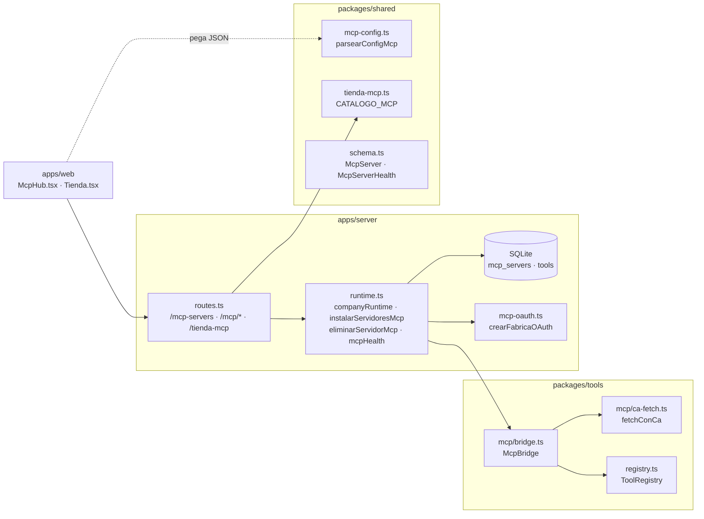
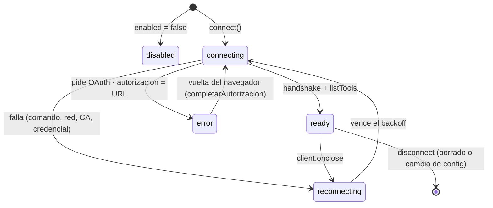
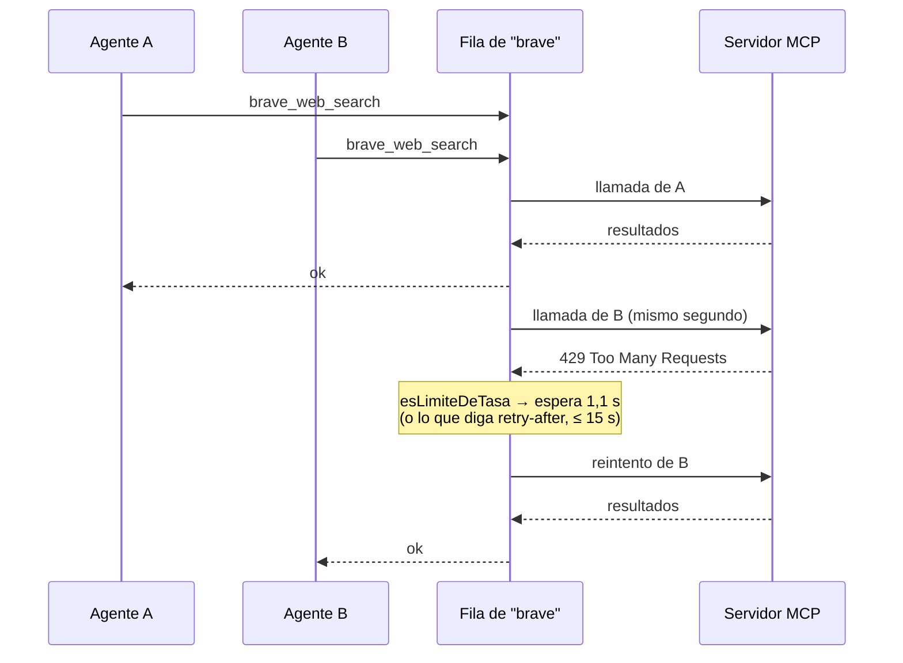

# Integración MCP

Un servidor MCP (Model Context Protocol) es un proceso —local por `stdio` o
remoto por HTTP— que publica herramientas. El orquestador se conecta como
**cliente**, descubre lo que el servidor ofrece y lo suma al catálogo de la
empresa como herramientas `mcp__<servidor>__<tool>`, asignables a un rol como
cualquier otra. Es la puerta para todo lo que no está construido adentro: una
base de datos, GitHub, un navegador, una API de búsqueda.

Existe como capa aparte porque las capacidades externas cambian de empresa en
empresa y de semana en semana: programar cada una sería perseguir el ecosistema.
Lo propio del sistema es **cómo se integra**: secretos por referencia, un
semáforo visible por servidor, una fila por servidor para no pisarse,
aprobaciones para lo que escribe y cascadas al borrar.

La mecánica de ver y elegir herramientas es común a todos los orígenes: ver
[[Herramientas y tool router]].

## Las piezas



`packages/tools` no sabe de rutas ni de variables de entorno: el servidor le
inyecta al `McpBridge` cómo resolver un secreto (`resolveSecret`), qué hacer con
cada cambio de estado (`onStatus`) y cómo crear un proveedor OAuth
(`FabricaOAuth`). Es la misma regla que las habilidades con `SkillStorage`.

## Datos

### `McpServer`

`packages/shared/src/schema.ts` → `mcpServerSchema`. Tabla `mcp_servers`.

| Campo | Tipo / default | Para qué |
|---|---|---|
| `id`, `companyId` | ids | el servidor es **de una empresa** |
| `name` | `^[a-z0-9_-]+$`, 1-64 | segmento `<servidor>` de `mcp__<servidor>__<tool>`. No se repite en la empresa (409) |
| `description` | ≤ 1.000, `""` | se muestra en el Hub y la lee `bloqueDeBaseDeDatos` |
| `transport` | `stdio` \| `http` | ver abajo |
| `enabled` | `true` | apagado queda en `disabled` y no se conecta |
| `autoApproveTools` | `true` | apagado, pide aprobación todo lo que el servidor no declara de sólo lectura |
| `otorgarAlConectar` | `[]` | roles a los que se les dan las tools **cuando aparezcan** (OAuth). Se vacía al otorgar |
| `envRequeridas` | `[]` | `{ ref, descripcion, obligatoria }`: qué variables necesita, por **nombre** |
| `catalogoId` | `null` | id del artículo de la tienda, si salió de ahí |

### `McpTransport`

```ts
{ type: "stdio", command, args: string[], envRefs: Record<string,string>, cwd: string | null }
{ type: "http",  url, headerRefs: Record<string,string>, caPath: string | null }
```

- `envRefs` y `headerRefs` guardan `{ VARIABLE_DEL_SERVIDOR: "NOMBRE_EN_ENV" }`:
  el valor sale de `process.env` al conectar.
- `caPath` es la ruta a la CA que firma el certificado de un servidor HTTPS con
  certificado propio. No es un secreto —es una ruta— y sirve para **verificar**,
  no para saltear la verificación.
- `url` se valida como URL por Zod (`z.string().url()`).

### `McpServerHealth`

Lo que pinta el Hub (`mcpServerHealthSchema`). Vive en memoria, en el
`McpBridge` y en un mapa por empresa del runtime; no se persiste.

| Campo | Qué dice |
|---|---|
| `status` | `disabled` · `connecting` · `ready` · `error` · `reconnecting` |
| `handshakeMs` | latencia del handshake |
| `toolCount` | herramientas descubiertas |
| `invocations`, `errors`, `lastError`, `lastInvokedAt` | uso acumulado. Sobrevive a una reconexión: reiniciarlo hacía que el Hub dijera "0 invocaciones" después de una corrida de decenas |
| `connectedAt`, `reconnectAttempts` | se resetean al conectar |
| `envFaltantes` | referencias del transporte que no tienen valor en el entorno |
| `autorizacion` | URL para iniciar sesión, si el servidor pide OAuth |

## Ciclo de vida de una conexión

El runtime de empresa es **perezoso**: `Runtime.companyRuntime` crea el registro
y el `McpBridge` la primera vez que algo lo pide (abrir el Hub, listar
herramientas, arrancar una corrida, dar de alta un servidor) y en cada llamada
hace `mcp.sync(store.listMcpServers(companyId))`. Después de reiniciar el
servidor, ningún proceso MCP arranca hasta que alguien pida algo de esa empresa.



- **`sync(servers)`** compara cada fila **serializada entera** con la que tiene
  conectada: si cambió cualquier campo —no sólo el transporte— la desconecta y la
  vuelve a conectar; baja las que ya no están y levanta las nuevas en paralelo.
- **`connect(server)`** conserva el uso acumulado de la conexión anterior, la
  desconecta, publica `connecting` (o `disabled`) con `envFaltantes` calculado, y
  abre.
- **`open(conn)`** crea un `Client` (`orquestador-agentico` 0.1.0), conecta,
  mide `handshakeMs`, descubre y publica `ready`. Engancha `client.onclose`: un
  servidor que muere después del handshake da de baja sus tools y reprograma la
  reconexión, porque si no el Hub quedaría en verde mintiendo.
- **Falla** → `errors + 1` y `scheduleReconnect`: backoff exponencial de 1 s a
  60 s (1, 2, 4… 32, 60, 60…), **sin límite de intentos**, con el timer en
  `unref()` para no retener el proceso. Un comando mal escrito no queda en
  `error`: queda en `reconnecting` con "reintento #N" para siempre.
- **Falta autorizar** (OAuth) → `error` y **no se reintenta**: el servidor va a
  decir que no hasta que alguien inicie sesión. Ver
  [[OAuth para servidores MCP]].
- **`disconnect(id)`** marca la conexión cerrada, cancela el timer, da de baja
  sus tools del registro y cierra el cliente. **No publica un último estado**.

> [!note] Un cambio de configuración resetea los contadores
> `sync` desconecta antes de conectar, así que `connect` ya no encuentra la salud
> anterior: editar un servidor (o que `otorgarAlConectar` se vacíe) vuelve a
> cero `invocations` y `errors`. El botón "reconectar" y la reconexión automática
> sí los conservan.

### Descubrimiento

`McpBridge.discover` llama a `client.listTools()` y registra cada tool:

| Campo de la `RegisteredTool` | Sale de |
|---|---|
| `name` | `mcp__<server.name>__<tool.name>` |
| `description` | la del servidor, o "Herramienta X de Y" |
| `inputSchema` | el del servidor, o `{ type: "object", properties: {} }` |
| `readOnly` | `annotations.readOnlyHint === true`. Sin la declaración se asume que **muta** |
| `requiresApproval` | `!autoApproveTools && readOnlyHint !== true` |

| `autoApproveTools` | la tool declara `readOnlyHint` | Resultado |
|---|---|---|
| `true` (default) | cualquiera | corre sola |
| `false` | `true` | corre sola (listar tablas) |
| `false` | no | **espera a una persona** (una migración) |

Así está el Supabase de **staging** de INSPIA (`vrmbrxxcvxeaflsgtyfa`): listar
corre solo y `apply_migration` espera. Producción (`qnfeqicedlysxredgzid`) no se
dio de alta. Aprobar **ejecuta** la llamada con los argumentos que vio la persona
([[Aprobaciones y solicitudes]]), y a un agente de código con un MCP de base de
datos el resumen del turno le explica cómo trabajar con él
(`apps/server/src/codigo-servidor.ts` → `bloqueDeBaseDeDatos`: mirar el esquema
antes, migración versionada **y** aplicada con el mismo SQL, advisors después).

> [!warning] Sólo la primera página
> `discover` no sigue `nextCursor`: un servidor que pagina `tools/list` aporta
> sólo lo que venga en la primera respuesta.

`autoApproveTools` no tiene control en la UI: el alta del Hub y la tienda lo
dejan en `true`. Se cambia con `PATCH /api/companies/:companyId/mcp-servers/:id`,
y como el `PATCH` cambia la fila, `sync` reconecta y redescubre con la regla
nueva.

## Invocación: una fila por servidor

`McpBridge.invoke` → `llamar`.

- Si el servidor no está `ready`, falla en el acto: "no está conectado (estado:
  …). Reintentá más tarde o resolvé el problema desde el MCP Hub."
- Si no, la llamada entra a la **fila del servidor** (`crearFila`): sus llamadas
  van **de a una**. El motor corre varios agentes en paralelo y todos ven el mismo
  servidor; con uno que maneja un recurso compartido —un navegador— dos agentes
  se pisaban la pestaña y el segundo leía la página del primero creyendo que era
  la suya. Es la peor clase de falla: no da error, da un dato equivocado con
  aspecto de correcto. La fila es **por servidor**: dos servidores distintos
  siguen en paralelo. Encadena en éxito y en error, así una llamada que falla no
  deja sin turno a las que esperan.
- `callTool` con corte de **60 s** y la `signal` de la corrida. Cada intento suma
  `invocations`, actualiza `lastInvokedAt` y publica.
- El resultado se aplana a texto (`extractText`): bloques `text` tal cual, un
  `resource` con su texto o `[recurso <uri>]`, una imagen como `[imagen: el
  agente no puede verla en este contexto]`, lo demás como JSON.
- `isError` o excepción → `errors + 1`, `lastError` (recorte de 200) y
  `ERROR: mcp__srv__tool: …`.

### El límite de tasa se espera adentro de la fila

La fila **serializa pero no espacia**: dos búsquedas de dos agentes salen una
detrás de la otra y, si la primera contesta en medio segundo, caen en el mismo
segundo. Con Brave en plan Free —una consulta por segundo— eso es un 429 seguro:
lo medimos con dos llamadas estampadas en el mismo segundo, la primera con
resultados y la segunda rechazada.



- `esLimiteDeTasa(texto)`: `\b429\b`, `rate.?limit` o `too many requests`. Se
  mira el **texto** porque un servidor MCP no devuelve códigos: devuelve el
  mensaje que armó con la respuesta de su API. "4290" no cuenta.
- `esperaDeReintento(texto, intento)`: si el mensaje trae `retry-after` (en
  cualquiera de sus grafías, en segundos) se le hace caso, acotado a 15 s; si no,
  1.100 ms × intento. 1.100 y no 1.000: con un segundo justo el reintento cae en
  el borde de la ventana y el límite salta de nuevo.
- **Dos reintentos y no más**: si el límite es de cuota diaria, insistir no lo
  arregla y sólo demora el turno de los demás. El reintento va **dentro** de la
  fila: esperando afuera, otra llamada entraría en el hueco contra el mismo
  límite. Un turno abortado no reintenta.

## Secretos por referencia

La regla que atraviesa todo MCP: **se guarda el nombre de la variable, nunca el
valor**. Una empresa exportada a JSON (`GET /api/companies/:id/blueprint`) lleva
sus `mcpServers` con `envRefs`/`headerRefs` y ninguna credencial. Mantené esa
regla al agregar campos de configuración MCP.

- `apps/server/src/env.ts` → `resolveSecret(nombre)` es `process.env[nombre]`.
  `process.env` se carga **una vez al arrancar** (`--env-file-if-exists=../../.env`
  en `apps/server/package.json`): una variable nueva en `.env` no la ve nadie
  hasta reiniciar el servidor; "reconectar" solo no alcanza.
- Una referencia sin valor se **omite** del entorno del proceso o de las
  cabeceras: el servidor falla con su propio mensaje de auth, que es más útil
  que uno genérico. Pero antes se declara en `envFaltantes`, para poder decir
  "falta GITHUB_TOKEN" cerca de la causa.
- Un proceso `stdio` **no hereda** el entorno del orquestador: el SDK lo lanza con
  `HOME`, `LOGNAME`, `PATH`, `SHELL`, `TERM` y `USER` más las referencias
  resueltas, sin shell (`shell: false`) y con su stderr en la consola del
  servidor. Las API keys del orquestador no le llegan salvo que las referencies.
- Al **importar** un JSON pegado, un valor que parece un secreto se descarta con
  aviso (ver abajo). Los tokens OAuth van a un archivo aparte, nunca a la base.

> [!warning] `envFaltantes` no se ve en el Hub
> La salud trae la lista, pero la tarjeta de cada servidor en
> `apps/web/src/routes/McpHub.tsx` no la dibuja: el aviso visible de credencial
> faltante es el de la tienda (por artículo) y el `lastError` del servidor.

## Alta pegando la configuración

`packages/shared/src/mcp-config.ts` → `parsearConfigMcp(texto)`. Acepta el
bloque `{ "mcpServers": { … } }` que publica cada servidor en su README —el mismo
que ya está pegado en Claude o en Cursor— y también el mapa a secas, porque los
README se reparten entre las dos formas. **Nunca tira**: lo que no entiende vuelve
como aviso en castellano.

| Entrada | Resultado |
|---|---|
| JSON inválido | `servidores: []` y "No es JSON válido: …" |
| un nombre como "Browser MCP" | `normalizarNombre` → `browser-mcp` (sin tildes, `[a-z0-9_-]`, ≤ 64) y aviso de que se renombró |
| `url` presente | transporte `http`; `headers` → `headerRefs`; `caPath: null` |
| `command` presente | transporte `stdio`; `args` (sólo strings), `env` → `envRefs`, `cwd` |
| ni `url` ni `command` | se saltea: "no se sabe cómo conectarlo" |
| `type`, `disabled` | **se ignoran**: el tipo lo decide la presencia de `url`, y el servidor entra habilitado |

`referenciaDe(valor)` decide si un valor de `env`/`headers` es una referencia:
`${VAR}` o `$VAR` → `VAR`; un nombre en mayúsculas (`^[A-Z][A-Z0-9_]*$`) → tal
cual; cualquier otra cosa (`ghp_…`, `sk-…`, una ruta) → `null`, **se descarta** y
se avisa: "traía un valor literal y no se guardó: los secretos se guardan por
referencia". Ante la duda gana no guardar: un falso negativo cuesta escribir el
nombre a mano; un falso positivo escribe una credencial en la base. Descartarlo
en silencio sería peor que no importar: el servidor arrancaría sin credencial y
el error aparecería lejos de su causa.

El mismo parser lo usan el Hub (vista previa en vivo mientras se pega) y la
herramienta `solicitar_servidor_mcp` (el saneo pasa **en la herramienta**, antes
de que la propuesta llegue a la bandeja). El paso a paso está en
[[CU-05 Conectar un servidor MCP]]; la instalación en un click, en
[[Tienda MCP]].

## HTTPS con una CA propia

`packages/tools/src/mcp/ca-fetch.ts` → `fetchConCa(caPath)`. Los servidores MCP
que corren en la máquina —el de Obsidian, por ejemplo— sirven HTTPS con
certificado propio y el `fetch` global lo rechaza. La salida fácil
(`rejectUnauthorized: false` o `NODE_TLS_REJECT_UNAUTHORIZED=0`) no se toma: la
primera debilita esa conexión y la segunda **todas** las del proceso, incluidas
las del proveedor LLM. En su lugar, esa CA se suma a las de confianza **para esa
conexión**, sobre `node:https` porque el `fetch` de Node no acepta opciones de TLS
por pedido.

- El archivo se lee una vez, al armar el transporte. Si no existe, la conexión
  falla con el `ENOENT` y entra al ciclo de reconexión.
- El cuerpo de la respuesta se pasa como stream (el transporte usa SSE); 204 y
  304 van sin cuerpo; abortar destruye el pedido.
- Sin `caPath` se verifica contra las CA del sistema. **En ningún caso** se apaga
  la verificación.

## Salud, eventos y el servidor fantasma

Cada publicación del bridge (`onStatus`) hace cuatro cosas en
`Runtime.companyRuntime`:

1. guarda la salud en el mapa de la empresa;
2. la reemite por el canal SSE **global** `GET /api/mcp/stream` (evento `mcp`,
   cuerpo `McpServerHealth`), que no es por corrida porque las conexiones viven
   mientras el servidor esté arriba aunque no corra nada. El canal no filtra por
   empresa: la UI se queda con los servidores de la suya;
3. `persistMcpTools` (ver abajo);
4. si el estado es `ready`, `otorgarAlConectar`.

Se publica en cada cambio de estado **y en cada invocación** (para mover los
contadores), así que cada llamada a una tool MCP re-persiste el catálogo.

> [!note] `mcp.status` no se emite
> `packages/shared/src/events.ts` declara la variante `mcp.status` y la UI sabe
> dibujarla, pero nada la emite: la salud viaja sólo por el canal global y nunca
> entra a la traza de una corrida.

**El servidor fantasma.** Como `disconnect` no publica un último estado, el mapa
de salud se quedaba con la entrada del servidor borrado: en el Hub aparecía en
`ready`, con su botón de reconectar y sin forma de sacarlo. La lista autoritativa
es la base: `Runtime.mcpHealth` poda del mapa lo que ya no está configurado, y el
Hub filtra igual lo que llega por SSE, que conserva el último estado de algo que
ya no existe.

## Persistencia y cascadas

- **`Runtime.persistMcpTools`** hace upsert por **nombre** de todo lo que
  describe el registro (conserva el id si ya existía), salteando las `creada`:
  `describe()` no lleva la composición y re-guardarlas desde acá las dejaba
  vacías. Persistir sirve para que el diseñador pueda asignarlas y la asignación
  sobreviva a un reinicio aunque el servidor esté caído en ese momento.
- **Borrar** (`Runtime.eliminarServidorMcp`, `DELETE …/mcp-servers/:id`) va en
  cascada: desconecta el proceso (no se cae solo por borrar filas), saca la salud,
  `deleteToolsByMcpServer`, borra la fila, `olvidarOAuth` (el archivo de tokens) y
  `podarToolIdsHuerfanos` (los `toolIds` de roles que apuntaban a ids muertos).
  Devuelve `cascaded` y `rolesPodados`. Sin la cascada quedaban herramientas
  fantasma en la base y roles apuntando a nada.
- **Borrar la empresa** desconecta todos sus servidores (`olvidarEmpresa` →
  `disconnectAll`). **Apagar el servidor** también (`Runtime.shutdown`).
- **Exportar/importar**: el blueprint lleva `mcpServers` pero no las filas `mcp`
  de `tools` (se redescubren al conectar). Al importar, los `toolIds` de roles
  que apuntaban a herramientas MCP quedan con los ids viejos: las asignaciones MCP
  **no sobreviven** a un import y hay que volver a darlas.

## Cómo le llegan las herramientas a un agente

Conectar un servidor **no le da sus herramientas a nadie**. Hay cinco caminos:

| Camino | A quién | Llega a la corrida viva |
|---|---|---|
| matriz "Quién usa qué" del Hub (un clic = todas las del servidor) | al rol de esa fila | sí: el guardado de roles llama a `actualizarRolEnCorridasVivas` |
| asignador del rol en Empresa | al rol | sí, por el mismo guardado |
| aprobar `solicitar_servidor_mcp` | al agente que lo pidió | sí: `instalarServidoresMcp` las incorpora al catálogo de su corrida |
| `otorgarAlConectar` | a los roles anotados, cuando aparezcan | sí, y la lista se vacía |
| aprobar `request_tool_access` | al que lo pidió | sólo si la tool ya estaba en el catálogo de esa corrida |

> [!danger] Lo que editás tiene que llegar a la corrida que está andando
> Lo medimos con Brave instalado desde la tienda, conectado y `ready`, con sus
> dos tools otorgadas a los tres roles: la base impecable, cero invocaciones, y
> una corrida entera insistiendo con `web_search` —que su proveedor no soporta—
> teniendo al lado el servidor que sí podía buscar. La corrida congela su
> catálogo al arrancar: `actualizarRolEnCorridasVivas` incorpora lo nuevo
> **antes** de otorgarlo, porque un `toolIds` que apunta a algo que la corrida no
> tiene en catálogo no le agrega nada al agente.

> [!warning] `otorgarAlConectar` no tiene UI
> El alta del Hub manda `otorgarAlConectar: []`, la tienda y la aprobación de
> `solicitar_servidor_mcp` no lo tocan. Sólo se llena por la API
> (`POST`/`PATCH …/mcp-servers`). Un servidor con OAuth instalado desde la UI
> aparece sin dueño al autorizarlo: hay que asignar sus tools a mano.

## Endpoints

| Método y ruta | Qué hace |
|---|---|
| `GET /api/companies/:companyId/mcp-servers` | lista la configuración |
| `POST /api/companies/:companyId/mcp-servers` | valida con Zod, **409** si el nombre existe, guarda y espera `companyRuntime` (conecta y descubre en el acto); 201 |
| `PATCH /api/companies/:companyId/mcp-servers/:id` | mezcla, valida, 409 si el nombre choca con otro; el `sync` reconecta |
| `DELETE /api/companies/:companyId/mcp-servers/:id` | cascada; devuelve `{ ok, cascaded, rolesPodados }` |
| `GET /api/companies/:companyId/mcp/health` | levanta el runtime y devuelve `mcpHealth` |
| `POST /api/companies/:companyId/mcp/:serverId/reconnect` | `mcp.connect(server)`; 404 si no existe |
| `POST /api/companies/:companyId/mcp/probe` | `{ toolName, args }` → ejecuta a mano |
| `GET /api/mcp/stream` | SSE global de salud |
| `GET /api/mcp/oauth/callback` | vuelta del navegador ([[OAuth para servidores MCP]]) |
| `GET /api/tienda-mcp`, `POST /api/companies/:companyId/tienda-mcp/:articuloId` | [[Tienda MCP]] |
| `GET /api/companies/:companyId/tools` | levanta el runtime y devuelve el catálogo persistido |

El alta **espera el handshake** dentro del pedido HTTP: con `npx -y` la primera
vez puede tardar lo que tarde la descarga. El SDK corta `initialize` y
`tools/list` a los 60 s; una falla no hace fallar el alta (201), deja el
servidor reconectando.

## El probador

`Runtime.probeTool(companyId, toolName, args)` ejecuta una herramienta **sin
corrida**. Es la forma más barata de descartar que el problema sea del servidor y
no del agente: probalo antes de gastar una corrida.

- Sólo `mcp` y `capability`. Las de coordinación, las habilidades (incluidas las
  de código, teléfono y R2) y las creadas se rechazan con el motivo: actúan sobre
  bandejas, entregables o pasos que sólo existen dentro de una corrida.
- Corre como el **primer rol** de la empresa y con `workspace: null`.
- No mira `requiresApproval`: quien la ejecuta es la persona.
- El Hub sólo ofrece las `mcp`; por la API también se puede `fetch_url` o
  `send_email` (que manda el correo de verdad).

## Constantes

| Nombre | Valor | Dónde | Por qué |
|---|---|---|---|
| `BASE_RECONNECT_DELAY_MS` | 1.000 ms | `bridge.ts` | primer reintento |
| `MAX_RECONNECT_DELAY_MS` | 60.000 ms | `bridge.ts` | sin techo, un servidor caído hace horas tardaría días en reintentar |
| `REINTENTOS_POR_LIMITE` | 2 | `bridge.ts` | una cuota diaria no se arregla insistiendo |
| `ESPERA_POR_LIMITE_MS` | 1.100 ms × intento | `bridge.ts` | un límite por segundo con margen de borde |
| `MAX_ESPERA_POR_LIMITE_MS` | 15.000 ms | `bridge.ts` | un `retry-after` disparatado no congela la fila |
| corte de `callTool` | 60.000 ms | `bridge.ts` → `llamar` | ninguna tool cuelga un turno |
| corte de `initialize` / `tools/list` | 60.000 ms | SDK (`DEFAULT_REQUEST_TIMEOUT_MSEC`) | default del cliente |
| recorte de `lastError` y `preview` | 200 caracteres | `bridge.ts` | la tarjeta del Hub |
| polling del Hub | 10.000 ms | `McpHub.tsx` | el SSE pisa al polling |
| `name` | 1-64, `[a-z0-9_-]` | `schema.ts` | es parte del nombre de cada tool |

## Casos borde y fallas conocidas

| Síntoma | Causa |
|---|---|
| queda en `reconnecting` con "reintento #N" | comando o paquete inexistente, `npx`/`uvx` fuera del `PATH` del servidor, red caída o `caPath` que no existe. Mirá `lastError` |
| queda en `error` con "Falta autorizar" | pide OAuth: botón **Autorizar** |
| `ready` pero el agente no usa sus tools | nadie las tiene asignadas (el Hub marca "sin asignar") o la corrida arrancó antes: ver arriba |
| una credencial recién agregada no se ve | `process.env` se carga al arrancar: reiniciá el servidor |
| certificado rechazado en un servidor HTTPS interno | falta `caPath` |
| dos agentes leen datos cruzados de un navegador MCP | ya no: la fila por servidor lo impide |
| 429 intermitentes | la fila espacia y reintenta dos veces; si persiste es cuota |
| el agente insiste con una ruta fuera del directorio permitido del servidor | error que el modelo no puede resolver; el corte por repetición lo frena a la tercera ([[Motor de agentes]]) |
| herramientas que desaparecen a mitad de corrida | el proceso murió: `onclose` las da de baja hasta reconectar |
| el servidor agregó tools y no aparecen | el bridge no escucha `notifications/tools/list_changed`: se redescubre recién al reconectar |
| un servidor recién pegado arrancó habilitado aunque el JSON decía `disabled` | `parsearConfigMcp` ignora `disabled` |
| `npm audit` marca `@hono/node-server` | no es alcanzable: ver abajo |

## El aviso de `@hono/node-server`

`npm audit` reporta `GHSA-frvp-7c67-39w9`, arrastrado por
`@modelcontextprotocol/sdk` (1.29.0). **No es alcanzable**: dentro del SDK, sólo
`server/streamableHttp.js` y los ejemplos importan hono, y este proyecto no
importa ninguno de los dos. El cliente usa `client/index`, `client/stdio`,
`client/streamableHttp` y `client/auth`; el puente del org
(`packages/engine/src/claude-mcp.ts`) usa `server/index` y `server/stdio`, que no
lo importan. No se aplica un override porque la corrección está en la línea 2.x
y el SDK depende de `^1.x`. La nota completa está en `package.json` →
`auditNotes`: **no lo "arregles" sin leerla**, y revisala al subir el SDK.

## Qué fijan los tests

- `packages/tools/src/mcp/bridge.test.ts`:
  - la fila nunca tiene dos tareas adentro, respeta el orden y una que falla no
    deja sin turno a las que esperan; dos filas no se esperan entre sí;
  - `esLimiteDeTasa` reconoce las tres formas (con el mensaje real de Brave) y no
    confunde un 404, un 500 ni un "4290";
  - `esperaDeReintento` espera más de 1 s, crece con el intento, obedece
    `retry-after` y lo acota a 15 s.
- `packages/shared/src/mcp-config.test.ts`: referencias por nombre, `${}` y `$`;
  un secreto no es referencia; bloque estándar y mapa a secas; un secreto literal
  no se guarda y se avisa; http con cabeceras; aviso si no sabe conectar; JSON
  inválido sin excepción; renombre avisado.
- `apps/server/src/db.test.ts` → "cascada al borrar un servidor MCP": borra sus
  tools, poda los `toolIds` y no toca roles sanos.
- `apps/server/src/roles-vivos.test.ts`: una herramienta MCP otorgada desde la
  configuración llega a la corrida en curso (el caso de Brave), sin tocar otras
  empresas.
- `packages/tools/src/coordination.test.ts` → `solicitar_servidor_mcp`.
- `apps/server/src/mcp-oauth.test.ts` y `packages/shared/src/tienda-mcp.test.ts`:
  ver sus notas.
- **Sin tests**: `fetchConCa`, `McpBridge.sync`/`discover`/`invoke` contra un
  servidor real, `mcpHealth` (fantasma) y los endpoints.

## Fuentes

- `packages/tools/src/mcp/bridge.ts` → `McpBridge` (`sync`, `connect`, `open`, `discover`, `invoke`, `llamar`, `scheduleReconnect`, `completarAutorizacion`, `referenciasSinValor`), `crearFila`, `esLimiteDeTasa`, `esperaDeReintento`, `extractText`
- `packages/tools/src/mcp/ca-fetch.ts` → `fetchConCa`
- `packages/shared/src/mcp-config.ts` → `parsearConfigMcp`, `referenciaDe`, `normalizarNombre`
- `packages/shared/src/schema.ts` → `mcpServerSchema`, `mcpTransportSchema`, `mcpServerHealthSchema`
- `apps/server/src/runtime.ts` → `companyRuntime`, `mcpHealth`, `eliminarServidorMcp`, `reconnectMcp`, `probeTool`, `persistMcpTools`, `otorgarAlConectar`, `instalarServidoresMcp`, `actualizarRolEnCorridasVivas`, `broadcastMcp`
- `apps/server/src/routes.ts` → rutas `/mcp-servers`, `/mcp/*`, `/api/mcp/stream`, blueprint
- `apps/server/src/env.ts` → `resolveSecret`
- `apps/server/src/db.ts` → `deleteToolsByMcpServer`, `podarToolIdsHuerfanos`
- `apps/web/src/routes/McpHub.tsx` → `McpHub`, `AltaDeServidor`, `ConnectivityGraph`, `ToolCatalog`, `Prober`
- `package.json` → `auditNotes`

## Ver también

- [[OAuth para servidores MCP]] · [[Tienda MCP]] · [[Referencia de la tienda MCP]]
- [[CU-05 Conectar un servidor MCP]] · [[CU-10 Instalar un servidor desde la tienda]]
- [[Herramientas y tool router]] — cómo compiten las tools de MCP por los lugares
- [[Pantalla Hub MCP]] · [[Seguridad]] · [[Variables de entorno]]
