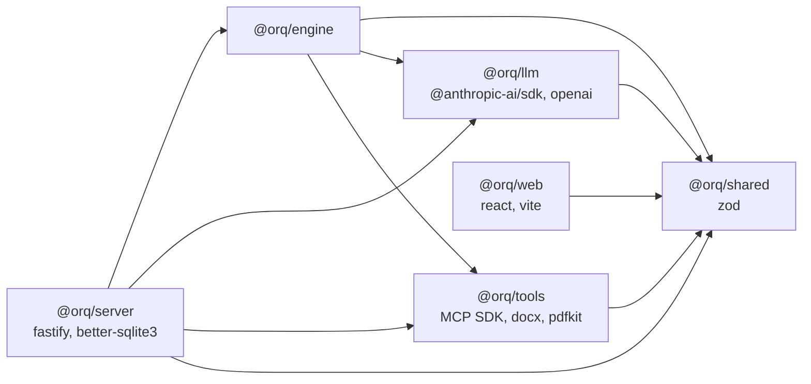

# Mapa del monorepo

Qué hay en cada archivo del repo, en una línea, y cómo se arman los
workspaces. Para entender el sistema empezá por [[Arquitectura general]]; esta
nota sirve para ir directo al archivo correcto.

## Estructura y dependencias

```
orquestadorAgentico/
├── packages/
│   ├── shared/   dominio en Zod, eventos, plantillas, tienda, reglas puras
│   ├── llm/      interfaz LlmProvider, adaptadores, tiers, ledger
│   ├── tools/    registro, coordinación, habilidades, código, MCP
│   └── engine/   agent loop, estado de corrida, scheduler, bus de eventos
├── apps/
│   ├── server/   Fastify + SQLite + runtime de lo vivo
│   └── web/      React 19 + Vite + Tailwind v4 + React Flow + Monaco
├── scripts/      seeds, chequeos, auditoría, vault
├── data/         base, proyectos, vault, música (git-ignored)
├── orquestador-obsidian/   ← esta bóveda
├── CLAUDE.md · README.md · LICENSE
```



Verificado con `grep` de imports: `tools` no importa `llm` ni `engine`; `web`
sólo importa `@orq/shared`; el motor no conoce al servidor
([[ADR-003 Motor desacoplado del servidor]]).

## Cómo se consumen los packages: sin build

Cada `packages/*/package.json` declara `"exports": { ".": "./src/index.ts" }`
(`@orq/shared` además `./schema` y `./events`). npm workspaces los enlaza en
`node_modules/@orq/*` y los consumen **tsx** (servidor y scripts) y **Vite**
(web) directo desde el TypeScript. No agregues un paso de build a un package sin
necesidad real.

> [!note] Las carpetas `dist/` no son un build
> Cada `tsconfig.json` de workspace usa `composite`, `emitDeclarationOnly` y
> `outDir: dist` para las referencias de proyecto: `npm run typecheck`
> (`tsc --build`) deja `.d.ts` y `.tsbuildinfo` en `packages/*/dist`,
> `apps/server/dist` y `apps/web/dist-types`. Nadie las importa y están en
> `.gitignore`. El único build real es `apps/web/dist`, que produce
> `vite build`; `apps/server` no tiene script `build`.

## Configuración

| Archivo | Qué define |
|---|---|
| `package.json` | workspaces `packages/*` y `apps/*`; `type: module`; Node ≥ 22; scripts (`dev`, `typecheck`, `test`, `db:*`, `check:*`, `musica:cama`, `auditar`); `auditNotes` sobre el aviso de `@hono/node-server`; devDeps `tsx`, `typescript`, `vitest` 4, `concurrently` |
| `package-lock.json` | lockfile de npm |
| `tsconfig.base.json` | `ES2023`, `moduleResolution: bundler`, `strict`, `noUncheckedIndexedAccess`, `verbatimModuleSyntax`, `noImplicitOverride`, `noEmit` |
| `tsconfig.json` | sólo referencias a los seis workspaces: es lo que corre `tsc --build` |
| `vitest.config.ts` | excluye `data/**` (los tests de los repos de los proyectos no son nuestros) y `**/dist/**`; fija `ORQ_ESPERA_PROVEEDOR_MS=0` |
| `.env.example` | todas las variables documentadas; ver [[Variables de entorno]] |
| `.gitignore` | `node_modules`, `dist`, `dist-types`, `.env*` salvo el ejemplo, `*.db*`, `data/`, `.playwright-mcp/` |
| `packages/*/package.json` | nombre `@orq/*`, `exports` a `src`, dependencias propias |
| `packages/*/tsconfig.json` | `composite`, `rootDir: src`, referencias a los packages de los que depende |
| `apps/server/package.json` | `dev` (`tsx watch --env-file-if-exists=../../.env`), `start`, `db:seed`, `db:migrate` |
| `apps/web/package.json` | `dev`, `build`, `preview` de Vite |
| `apps/web/tsconfig.json` | `lib` con DOM, `jsx: react-jsx`, `types: vite/client`, salida en `dist-types` |
| `apps/web/vite.config.ts` | puerto 5173 con `strictPort`; proxy de `/api` al puerto del servidor leído del `.env` de la raíz, con `ws: true` para el espejo |
| `apps/web/index.html` | aplica el tema guardado (`orq-tema`) **antes del primer pintado** |
| `apps/web/public/favicon.svg` | ícono |

> [!warning] `packageManager` dice yarn
> El `package.json` de la raíz tiene (sin commitear) `"packageManager": "yarn@1.22.22…"`,
> pero el proyecto usa npm workspaces, `package-lock.json` y scripts `npm run`.
> Con corepack activo eso puede hacer que `npm` se niegue a correr.

## `packages/shared` — el dominio

| Archivo | Qué hace |
|---|---|
| `src/index.ts` | reexporta todo el paquete |
| `src/schema.ts` | **todo el dominio en Zod**: primitivos, empresa, código, herramientas y MCP, ejecución, solicitudes, memoria, costos, blueprint, payloads; `esCorridaTerminal`, `normalizarLeccion` |
| `src/events.ts` | `traceEventSchema` (18 variantes), `TraceEventInput`, `isEvent` |
| `src/ids.ts` | `newId` e `ids.*` por tipo de entidad |
| `src/nombres.ts` | `segmentoLegible` (carpetas legibles) y `slugTecnico` (ramas y slugs) |
| `src/programacion.ts` | cálculo puro del próximo disparo de una misión (`proximaCorrida`, `parseCron`, `describirProgramacion`) |
| `src/plantillas.ts` | `PLANTILLAS_EQUIPO`, `MEJORADOR_DE_CODIGO`, `QA_MOVIL` y sus esquemas |
| `src/tienda-mcp.ts` | `CATALOGO_MCP`: 25 servidores curados con su esquema |
| `src/mcp-config.ts` | `parsearConfigMcp`: el bloque `mcpServers` de un README a configuración sin secretos |
| `src/argv.ts` | tokenizar comandos sin shell y decidir si la allowlist los permite |
| `src/dependencias.ts` | validar paquetes del registro y armar la instalación sin scripts |
| `src/servicios.ts` | clasificar carpetas de un monorepo y redirigir URLs locales de los `.env` |
| `src/*.test.ts` | `argv`, `dependencias`, `mcp-config`, `plantillas`, `programacion`, `servicios`, `tienda-mcp` |

Ver [[Referencia de esquemas]] y [[Modelo de dominio]].

## `packages/llm` — los proveedores

| Archivo | Qué hace |
|---|---|
| `src/index.ts` | reexporta tipos, tiers, precios, ledger, registro y adaptadores |
| `src/types.ts` | formato neutro de conversación, `LlmProvider`, `ChatRequest`/`ChatResult`, puente del org (`OrgToolsSession`), `collect` |
| `src/registry.ts` | `ProviderRegistry` y `buildRegistry`: qué adaptadores se registran según las credenciales |
| `src/tiers.ts` | resolución de tiers por bandas de precio del catálogo vivo (`resolveTier`, `QUALITY_HINTS`) |
| `src/modelos-claude.ts` | precios de lista de Claude (`PRECIOS_CLAUDE`) y tiers por mapa curado (`resolverTierEstatico`) |
| `src/ledger.ts` | `computeCost`, `RunLedger`, `BudgetExceededError` |
| `src/adapters/openai-shared.ts` | traducciones comunes del dialecto OpenAI |
| `src/adapters/openrouter.ts` · `openai.ts` · `ollama.ts` · `nvidia.ts` | adaptadores por API |
| `src/adapters/anthropic.ts` | `AnthropicProvider` y `ClaudeSesionProvider` (token OAuth), caché de prompt (`splitSystem`) |
| `src/adapters/claude-code.ts` | delega el turno al CLI de Claude Code: sólo lectura sobre la salida, fallback de modelo, vigilante de silencio, transcripciones |
| `src/adapters/claude-code-relay.mjs` | relevo de stdio al socket del puente MCP del org (`ORQ_SOCKET`) |
| `src/adapters/opencode.ts` | delega el turno al CLI de opencode con config fusionada |
| tests | `ledger`, `registry`, `modelos-claude`, `adapters/caching` (breakpoints de caché), `adapters/claude-code`, `adapters/opencode` |

Ver [[Capa LLM y tiers]].

## `packages/tools` — lo que los agentes pueden hacer

| Archivo | Qué hace |
|---|---|
| `src/index.ts` | exporta registro, router, coordinación, contexto, habilidades, correo, MCP, compuestas y código |
| `src/types.ts` | `RegisteredTool`, `ToolContext`, `AgentWorkspace`, `ok`/`fail`, `preview` |
| `src/registry.ts` | `ToolRegistry`: `forRole` (coordinación siempre), `describe` |
| `src/router.ts` | `selectTools`: acota las opcionales por relevancia y explica por qué |
| `src/coordination.ts` | las herramientas que se otorgan siempre: mensajes, tareas, entregables, auditoría, memoria, solicitudes, convocar; `revisarCalidad` |
| `src/capability.ts` | `web_search` (resuelto por el motor) y `fetch_url` con bloqueo de red privada |
| `src/calculo.ts` | `calcular` y `verificar_cifras`: aritmética verificable |
| `src/busqueda.ts` | `buscar_en_entregables`, `secciones` y `bloques` |
| `src/correo.ts` | `send_email` por webhook de n8n |
| `src/contexto.ts` | `leer_contexto`, `buscar_contexto`, `escribir_contexto` y el mapa del vault en el prompt |
| `src/compuestas.ts` | `crear_herramienta` y la ejecución de compuestas |
| `src/mcp/bridge.ts` | `McpBridge`: conexión, descubrimiento, telemetría, fila por servidor y reintento por límite de tasa |
| `src/mcp/ca-fetch.ts` | `fetch` que verifica contra una CA declarada |
| tests | `busqueda`, `calculo`, `compuestas`, `contexto`, `coordination`, `router`, `mcp/bridge` |

### `src/skills/`

| Archivo | Qué hace |
|---|---|
| `index.ts` | `createSkillTools`: registra las habilidades (las de Chrome y de imágenes sólo si se pueden cumplir), `SkillStorage` |
| `markdown.ts` | markdown → bloques neutros, una vez para las tres salidas |
| `render.ts` | `renderDocx` y `renderPdf` con portada, encabezado y pie |
| `guion.ts` | markdown leído como línea de tiempo: escenas, diálogo, reloj (`ubicarEscenas`) |
| `video.ts` | motor ASS: el video en una pasada de ffmpeg |
| `estudio.ts` | motor de láminas HTML reveladas con Chrome |
| `clips.ts` | motor de clips grabados empalmados |
| `chrome.ts` | Chrome por CDP: revelar láminas, grabar y explorar |
| `tema.ts` | kit de diseño de láminas, guía (`GUIA_ESTUDIO`) y lámina de respaldo |
| `slides.ts` | el guion como deck HTML autocontenido |
| `narracion.ts` | Kokoro o `say`, reparto de voces y pronunciación |
| `musica.ts` | elegir cama musical por clima |
| `sonido.ts` | mezcla de voces y cama con ducking |
| `iconos.ts` | íconos vectoriales en ASS y SVG |
| `visuales.ts` | composiciones dibujadas (`visual:flujo`, personas) |
| `imagenes.ts` | imágenes generadas con caché y corte por tiempo |
| `medios.ts` | `inspeccionar_medio`: la ficha real de un archivo |
| `permisos.ts` | `puedeBorrar` según autoridad |
| tests | `clips`, `estudio`, `gate` (no se exporta con plata sin verificar), `guion`, `medios`, `permisos`, `skills` |

### `src/codigo/`

| Archivo | Qué hace |
|---|---|
| `index.ts` | `crearHerramientasDeCodigo`: leer, buscar, mapa, editar, comandos, servicios, repos; `HERRAMIENTAS_QUE_ESCRIBEN_CODIGO` |
| `tipos.ts` | `CodigoStorage`: lo que el servidor le presta a estas herramientas |
| `ejecutar.ts` | `ejecutarComando` sin shell, en `sandbox-exec`, con entorno limpio |
| `indice.ts` | `mapaDelCodigo`: repo map por regex y referencias |
| `rutas.ts` | `resolverEnWorktree`: la ruta cae dentro del árbol y fuera de `.git` |
| `glob.ts` | glob → regex para `buscar_archivos` |
| `telefono.ts` | herramientas de depuración de la app en el teléfono |
| `pasos-app.ts` | pasos válidos para `manejar_app` (por texto, no por coordenadas) |
| `r2.ts` | `r2_listar` y `r2_objetos` para verificar lo subido |
| tests | `codigo`, `pasos-app`, `telefono` |

Ver [[Catálogo de herramientas]] y [[Habilidades de producción]].

## `packages/engine` — el motor

| Archivo | Qué hace |
|---|---|
| `src/index.ts` | exporta bus, estado, loop, dificultad, scheduler, prompt y el arnés `FakeProvider` |
| `src/events.ts` | `EventBus`: asigna `id` y `at`, reparte y se traga los errores de un suscriptor |
| `src/state.ts` | `RunState`: bandejas, tareas, entregables, solicitudes, actividad, `forActor`, `incorporarRol`; `Persistence` |
| `src/loop.ts` | `runAgentTurn`: un turno, iteraciones, herramientas, memo de lecturas, compactación, eventos |
| `src/scheduler.ts` | `Orchestrator`: el ciclo como cadena, orden por urgencia, modos, pausa, aprobaciones |
| `src/prompt.ts` | `buildSystemPrompt` y `buildTurnPrompt` |
| `src/dificultad.ts` | `elegirTierPorDificultad` |
| `src/claude-mcp.ts` | puente MCP del org para turnos delegados, con sus frenos |
| `src/acotar.ts` | `acotarResultado` y `TOPE_RESULTADO` para lo que entra a un turno delegado |
| `src/testing/fake-provider.ts` · `factory.ts` | proveedor guionado y constructores para testear sin tokens |
| tests | `loop`, `scheduler` (incluye 4 agentes concurrentes), `state`, `memory`, `roles`, `continuidad`, `dificultad`, `claude-mcp`, `acotar` |

Ver [[Motor de agentes]].

## `apps/server` — Fastify

| Archivo | Qué hace |
|---|---|
| `src/index.ts` | arranque: env, `Store`, registro de proveedores, `Runtime`, migración de layout, poda de worktrees, barrido de servicios huérfanos, saneo de corridas huérfanas, misiones |
| `src/app.ts` | `construirApp`: Fastify con CORS cerrado y todas las rutas, sin escuchar (para `app.inject`) |
| `src/env.ts` | `loadEnv`, `fromRoot` (rutas relativas a la raíz), `resolveSecret` |
| `src/db.ts` | `Store`: esquema idempotente, documentos JSON, cascadas, residuos, eventos |
| `src/migrate.ts` | aplica el esquema y lista las tablas (`npm run db:migrate`) |
| `src/seed.ts` | la empresa de ejemplo Codytion S.A. (`npm run db:seed`) |
| `src/routes.ts` | REST de configuración, corridas, memoria, MCP, salida, mantenimiento; SSE de corrida y de MCP; `openSse` |
| `src/rutas-codigo.ts` | API de código, IDE, servicios, teléfono, build Android y el SSE de código |
| `src/runtime.ts` | `Runtime`: runtimes de empresa, corridas vivas, plantillas, solicitudes, suscripciones SSE |
| `src/misiones.ts` | `MisionScheduler` |
| `src/exports.ts` | `ExportStore`: salida por empresa, saneo de rutas, procedencia, publicar, vistas previas |
| `src/directorios.ts` | una carpeta legible por proyecto, encontrada por su marca `.empresa` |
| `src/contexto.ts` | `ContextoStore`: el vault de Obsidian por empresa |
| `src/mcp-oauth.ts` | OAuth de servidores MCP remotos, tokens en archivo 0600 |
| `src/auditoria.ts` | `auditarCorrida`: reglas sobre la traza persistida |
| `src/repos.ts` | `RepoStore`: clones, worktrees, sesiones, instantáneas, integrar |
| `src/git.ts` | git endurecido |
| `src/scm.ts` | `ControlDeVersiones`: preparar, commit, stash, ramas, fusión |
| `src/codigo-servidor.ts` | arriendo de escritura, `abrirTurnoDeCodigo`, `CodigoStorage` real |
| `src/servicios.ts` | `ServiciosVivos`: levantar las partes del monorepo en puertos propios |
| `src/proxy-vista.ts` | proxy de vista previa con el selector y el inspector inyectados |
| `src/dispositivos.ts` | teléfono por QR, adb, túneles, captura |
| `src/scrcpy.ts` · `espejo-ws.ts` · `ws.ts` | espejo fluido por scrcpy sobre un WebSocket mínimo |
| `src/inspector-rn.ts` | componentes de React Native en pantalla y consola JS por Hermes |
| `src/depuracion-movil.ts` | adb acotado a la app del repo |
| `src/qa-movil.ts` | ubicar lo que nombra un agente y manejar la app sin tocar producción |
| `src/r2.ts` | lectura de R2 firmada a mano (sin SDK) |
| `src/aab.ts` | build de producción Android verificado |
| `src/testing/entorno.ts` | arnés de tests: tmpdir, `Store` y `Runtime` reales |
| `explore-01-landing.png` | captura suelta commiteada; ningún código la usa |
| tests | `aab`, `auditoria`, `contexto`, `conversacion`, `db`, `depuracion-movil`, `directorios`, `dispositivos`, `equipo`, `exports`, `git`, `ide`, `mcp-oauth`, `memoria-persistida`, `proxy-vista`, `qa-movil`, `qa-movil-storage`, `r2`, `renombrar`, `repos`, `roles-vivos`, `routes`, `scm`, `scrcpy`, `servicios`, `ws` |

Ver [[Runtime del servidor]] y [[API HTTP y SSE]].

## `apps/web` — React

| Archivo | Qué hace |
|---|---|
| `src/main.tsx` | monta React Query (sin refetch al enfocar) y la app |
| `src/App.tsx` | shell con router: `/proyectos`, `/proveedores`, `/p/:companyId/{proceso,tablero,empresa,solicitudes,tienda,mcp,codigo,salida,memoria,costos}` |
| `src/api.ts` | cliente HTTP (el `content-type` sólo con cuerpo) y tipos de respuesta |
| `src/styles.css` | Tailwind v4, tokens `--t-*` de tema claro y oscuro |
| `src/lib/stream.ts` | `useRunStream` y `useMcpStream` sobre SSE |
| `src/lib/derive.ts` | **estado derivado de la traza**: la base del replay |
| `src/lib/progreso.ts` | `calcularProgreso`: reloj y salud de una corrida |
| `src/lib/acciones.ts` | cómo se dice en castellano lo que hace un agente |
| `src/lib/ui.tsx` | primitivas históricas (`Panel`, `Button`, `Field`…) |
| `src/ui/index.ts` | librería de componentes; importá de acá |
| `src/ui/Modal.tsx` · `Toast.tsx` · `piezas.tsx` · `NombreEditable.tsx` · `tema.tsx` | modal sobre `<dialog>`, avisos, badges y tabs, renombrar en el lugar, botón de tema |
| `src/ui/PulsoDeCorrida.tsx` | el reloj de la corrida en la barra de arriba |
| `src/ui/modelo.tsx` | `ModeloBadge`: con qué modelo corre un agente |
| `src/routes/Proyectos.tsx` | alta (con plantilla), fichas y baja de proyectos |
| `src/routes/Settings.tsx` | `Providers`, `CompanyDesigner` (Empresa) y `Costs` |
| `src/routes/OrgGraph.tsx` | organigrama con React Flow que se anima con la traza |
| `src/routes/LiveProcess.tsx` | Proceso en vivo: organigrama, timeline, cronología, controles |
| `src/routes/Board.tsx` | tablero kanban derivado de la traza |
| `src/routes/Requests.tsx` · `Memory.tsx` · `Output.tsx` · `McpHub.tsx` · `Tienda.tsx` | Solicitudes, Memoria, Salida, Hub MCP, Tienda |
| `src/routes/Codigo.tsx` | el IDE: repos como raíces, pestañas, vistas laterales, SSE de código |
| `src/routes/codigo/*` | piezas del IDE: `Editor`, `Explorador`, `Buscar`, `ControlDeCodigo`, `Terminal`, `Chat`, `Markdown`, `Nota`, `Repositorio`, `Servicios`, `VistaDeServicio`, `VistaPrevia`, `SalidaDeServicio`, `Inspector`, `sonda`, `elemento`, `monaco`, `Celular`, `Espejo`, `Depuracion`, `Produccion` |
| tests | `lib/progreso`, `ui/modelo`, `routes/codigo/Markdown`, `Nota`, `sonda` |

Ver [[Frontend web]] y [[El IDE]].

## `scripts/`

| Script | Comando | Qué hace |
|---|---|---|
| `check-models.ts` | `npm run check:models` | qué modelo resuelve cada tier, con precio |
| `check-llm.ts` | `npm run check:llm` | una llamada real con tool-calling por proveedor |
| `seed-estudio-codytion.ts` | `npm run db:estudio` | el estudio audiovisual (tier `free` salvo `ORQ_SEED_TIER`) |
| `seed-inspia-lanzamiento.ts` | `npm run db:inspia` | estudio de lanzamiento de INSPIA con tres modelos |
| `seed-inspia-publicidad.ts` | `npm run db:inspia-publicidad` | la pieza comercial filmada sobre la app real |
| `seed-observatorio-ia.ts` | `npm run db:observatorio` | equipo de análisis con verificador independiente |
| `generar-cama.ts` | `npm run musica:cama` | dos camas musicales sintetizadas con ffmpeg |
| `auditar-corrida.ts` | `npm run auditar -- --run=<id>` | imprime `auditarCorrida` de una corrida |
| `vault-contexto.ts` | `npx tsx scripts/vault-contexto.ts <companyId>` | vuelca la memoria de la base al vault |
| `start.sh` | — | `db:migrate`, `db:seed` y `dev` en fila |

Ver [[Comandos]] y [[Empresas de ejemplo]].

## `data/` (git-ignored)

```
data/
├── orquestador.db              SQLite (DATABASE_URL)
├── proyectos/                  PROYECTOS_DIR
│   ├── package.json            {"type": "commonjs"} a propósito
│   ├── .servicios-vivos.json   pid de los servicios levantados
│   ├── .dispositivos.json      qué app se abrió en cada teléfono
│   └── <Nombre legible>/       marcado con .empresa
│       ├── salida/             lo que producen los agentes (marca/, imagenes/, publicado/, .orq-generado.json)
│       ├── repos/<slug>/       clon gestionado
│       ├── worktrees/<repo>/<rama>/
│       └── tmp/
├── contexto/                   vault por empresa (CONTEXTO_DIR)
├── musica/                     tus pistas (MUSICA_DIR)
├── mcp-oauth/<id>.json         tokens OAuth, 0600
├── claude-code/ · opencode/    carpetas de trabajo de los CLI
└── exports/                    layout viejo, se muda al arrancar
```

Ver [[Directorios en disco]].

> [!warning] `CLAUDE_CODE_WORKDIR` y `OPENCODE_WORKDIR` no se anclan a la raíz
> `env.ts` resuelve las rutas del servidor con `fromRoot`, pero estas dos pasan
> tal cual a los adaptadores (`packages/llm/src/registry.ts`). Como
> `npm run dev:server` corre con el directorio de `apps/server`, el default
> `./data/claude-code` termina en `apps/server/data/claude-code/` (ahí están hoy
> las transcripciones), no en `data/` de la raíz.

## Fuentes

- `package.json`, `tsconfig.base.json`, `tsconfig.json`, `vitest.config.ts`, `.gitignore`, `.env.example`
- `packages/*/package.json`, `packages/*/tsconfig.json`, `apps/*/package.json`, `apps/*/tsconfig.json`
- `apps/web/vite.config.ts`, `apps/web/index.html`
- cabeceras y exports de cada archivo de `packages/*/src`, `apps/*/src` y `scripts/`

## Ver también

- [[Arquitectura general]]
- [[Invariantes de arquitectura]]
- [[Modelo de dominio]]
- [[Pruebas y calidad]]
- [[Guía de contribución]]
