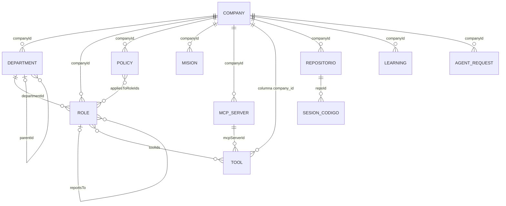
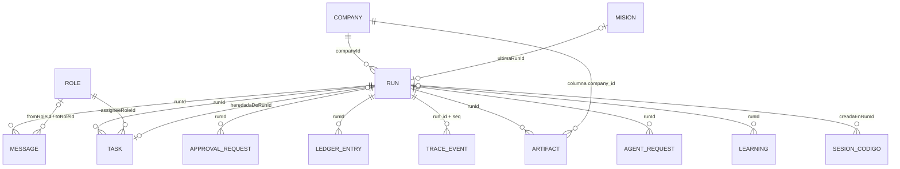
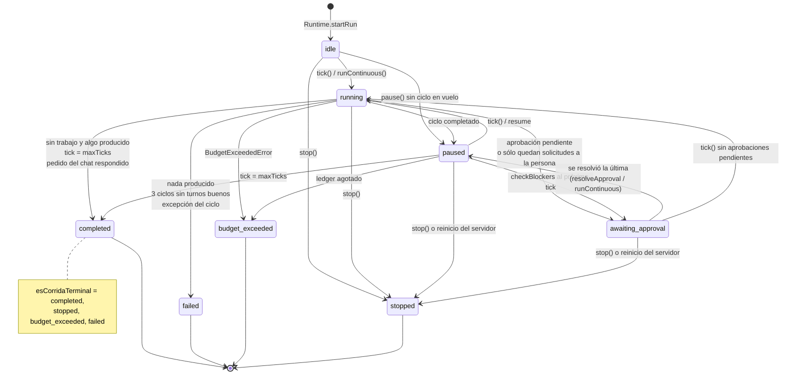

# Modelo de dominio

El orquestador modela **una empresa**: áreas, roles que son agentes, políticas,
herramientas, memoria y el código que se le carga. Una **corrida** es esa
empresa trabajando un encargo. Todo está escrito en Zod en
`packages/shared/src/schema.ts` —el servidor valida contra eso y la UI infiere
sus tipos de ahí ([[ADR-002 Zod como única fuente de verdad]])—. Esta nota
explica qué es cada entidad y cómo se relacionan; los campos, uno por uno, están
en [[Referencia de esquemas]].

"Proyecto" es el rótulo de la pantalla ([[Pantalla Proyectos]]); en el dominio
se sigue diciendo `Company`. No se renombra: toda la metáfora del producto es
organizacional.

## Las entidades por grupo

| Grupo | Entidades | Alcance | Sobrevive a… |
|---|---|---|---|
| Organización | `Company`, `Department`, `Role`, `Policy`, `Mision` | empresa | todo, hasta borrar la empresa |
| Capacidades | `Tool`, `McpServer` | empresa | ídem |
| Código | `Repositorio`, `SesionCodigo` | empresa | la sesión sobrevive a la corrida que la abrió |
| Conocimiento y pedidos | `Learning`, `AgentRequest` | empresa | las corridas |
| Ejecución | `Run`, `Message`, `Task`, `ApprovalRequest`, `LedgerEntry`, `TraceEvent` | corrida | se van con la corrida (`deleteRun`) |
| Resultado | `Artifact` | corrida **y** empresa | a su corrida, no a su empresa |

## Diagrama: configuración

## Diagrama: ejecución

> [!important] La línea doble de `ARTIFACT`
> Un entregable pertenece a la corrida que lo produjo **y** a la empresa
> (`artifacts.company_id`). `Store.deleteRun` se lleva mensajes, tareas,
> aprobaciones, ledger y eventos —el registro de *cómo* se llegó— pero nunca el
> entregable. Las listas `TABLAS_POR_EMPRESA` y `TABLAS_POR_CORRIDA` de
> `apps/server/src/db.ts` son las mismas para el borrado en cascada y para el
> barrido de residuos. Ver [[Persistencia y esquema SQL]].

## Organización

### `Company`

La unidad de configuración y el borde de todo lo demás. Lo que un agente recibe
de ella en cada prompt: `mission` y `context` (hasta 20.000 caracteres,
`packages/engine/src/prompt.ts` → `buildSystemPrompt`). Lo que usa el motor:
`budgetUsd` (presupuesto por corrida si el encargo no trae otro) y
`defaultModel` (lo heredan los roles nuevos, los convocados y los aprobados).
Lo que usan las habilidades: `voz` y `marca`. Ver
[[Esquemas de empresa y organización]].

### `Department`

Agrupa roles y es el destino de un `broadcast`. Tiene `parentId`, pero la
jerarquía que se dibuja y la que usan las herramientas sale de
`Role.reportsTo`: hoy `parentId` sólo se remapea al importar un blueprint.

### `Role` — un rol es un agente

Persiste entre ciclos, tiene su propia bandeja y **no comparte contexto**: sólo
se entera de lo que le escriben. Sus ejes:

- **Qué sabe**: `systemPrompt` compuesto con el contexto de la empresa, las
  políticas, la memoria y el mapa del vault ([[Prompt de un turno]]).
- **Qué puede**: `toolIds` (las de coordinación van siempre) y `authority`
  (`executor`/`manager`/`executive`), que los ejecutores miran para convocar,
  crear herramientas o repos y borrar ([[Organización de agentes]]).
- **Con qué piensa**: `model` —proveedor, slug o tier, escalado por
  dificultad ([[Escalado por dificultad]])—.
- **Cuánto trabaja por turno**: `maxTurns`, base del presupuesto de
  iteraciones.
- **A quién escala**: `reportsTo`.

### `Policy`

El `statement` va al prompt de los roles alcanzados (vacío = toda la empresa).

> [!warning] El `gate` de una política no se aplica
> El esquema tiene `gate: { type: "spend_above", amountUsd, requiresRoleId }` y
> su comentario dice que se evalúa en código. Hoy ningún componente lo lee: una
> política es sólo texto en el prompt. Igual `spendApprovalThresholdUsd` del
> rol: se menciona en el prompt pero nadie lo compara.

### `Mision`

Un encargo que se dispara solo: `objective` + `programacion` (intervalo,
semanal o cron) + `proximaAt` guardado en la base. Cada disparo es una corrida
nueva en modo continuo. Ver [[Misiones programadas]].

## Capacidades

### `Tool`

Cinco orígenes: `coordination` (siempre otorgadas), `capability`, `skill`,
`mcp` y `creada` (compuestas por un agente). La fila en la tabla `tools` es lo
que permite que `role.toolIds` apunte a algo; lo ejecutable vive en el
`ToolRegistry` del runtime de empresa. Ver [[Herramientas y tool router]].

### `McpServer`

Un servidor MCP de la empresa, con los secretos **por referencia** (nombre de
la variable, nunca el valor). Su estado vivo (`McpServerHealth`) no se persiste.
Ver [[Integración MCP]].

## Código

`Repositorio` es el código que una persona cargó (clon gestionado, nunca su
carpeta), con su allowlist de comandos y sus `servicios`. `SesionCodigo` es el
worktree donde trabajan los agentes: una abierta por repo, sobrevive a la
corrida y la cierra una persona integrándola o descartándola. Ver
[[Repositorios y sesiones]] y [[Esquemas de código y servicios]].

## Conocimiento y pedidos

- `Learning`: una lección de la empresa. Es un reclamo con evidencia; refutarla
  la saca del prompt sin borrarla. Ver [[Memoria de la empresa]].
- `AgentRequest`: lo que un agente le pide **a la persona** —un rol, un dato,
  una herramienta, un servidor MCP, un comando, una dependencia—. Alcance
  empresa: si la corrida muere, la heredera recibe la respuesta.

### `ApprovalRequest` y `AgentRequest` no son lo mismo

| | `ApprovalRequest` | `AgentRequest` |
|---|---|---|
| Qué pide | dejar pasar una acción bloqueada (`requiresApproval` o `request_approval`) | algo que cambia la empresa o que nadie adentro sabe |
| Alcance | la corrida | la empresa |
| Quién resuelve | una persona (`POST /api/runs/:id/approvals/:approvalId`); `approverRoleId` apunta al jefe, pero ninguna herramienta de agente resuelve | siempre una persona (`POST /api/companies/:id/requests/:id`) |
| Aprobar… | **ejecuta** la llamada con los argumentos aprobados | crea el rol, otorga, instala, contesta |
| Pantalla | [[Pantalla Proceso en vivo]] | [[Pantalla Solicitudes]] |

Ver [[Aprobaciones y solicitudes]].

## Ejecución

- `Run`: el encargo (`objective`), su estado, modo, ciclo y presupuesto. Con
  `foco`, es un pedido del chat del IDE: un solo rol sobre un repo.
- `Message`: la única forma en que un agente se entera de algo. Nueve tipos;
  en la práctica va `pending` → `read` (al drenar la bandeja) → `answered`
  (cuando alguien responde con `inReplyTo`). `delivered` existe en el enum pero
  no se usa.
- `Task`: el trabajo asignado, con `in_review` como etapa visible del control
  de calidad. Lo abierto se **adopta** en la corrida siguiente
  (`heredadaDeRunId`).
- `Artifact`: el entregable en markdown, versionado por `key`. Es lo que
  reciben las habilidades por clave.
- `LedgerEntry`: una fila por llamada al modelo, con tokens y costo.
- `TraceEvent`: la traza, con número de secuencia. Ver [[Referencia de eventos]].

El estado vivo de una corrida (bandejas, tareas, actividad) está en memoria, en
`RunState` ([[Estado de una corrida]]); la base guarda cada cambio, pero **una
corrida no sobrevive a un reinicio del servidor**.

## Objetos embebidos y objetos sin tabla

| Objeto | Vive dentro de | Nota |
|---|---|---|
| `ModelSelection` | `Company.defaultModel`, `Role.model` | con `escalado` |
| `Voz`, `Marca` | `Company` | datos de marca |
| `Programacion` | `Mision` | |
| `McpTransport` | `McpServer` | `stdio` o `http` |
| composición | `Tool` | sólo `creada` |
| `OrigenRepositorio`, `ComandosRepositorio`, `Servicio` | `Repositorio` | |
| `RoleProposal`, `ServidorMcpPropuesto` | `AgentRequest` | |
| `McpServerHealth` | memoria del runtime | no se persiste |
| `ActivityEntry` | `RunState.activity` | las últimas 500 llamadas; la audita `check_activity` |
| `CompanyBlueprint` | JSON exportado | la empresa entera, sin credenciales ni rutas locales |

## Ciclo de vida de una corrida

| Transición | Disparador | Dónde |
|---|---|---|
| `idle`/`paused` → `running` | empieza un ciclo | `scheduler.ts` → `Orchestrator.tick` (`setStatus("running")`) |
| `running` → `paused` | el ciclo cerró y queda trabajo | `tick`, al final |
| → `awaiting_approval` | hay aprobaciones pendientes (`checkBlockers`) o nadie tiene trabajo y hay solicitudes a la persona sin contestar | `tick`, `checkBlockers` |
| `awaiting_approval` → `paused` | se resolvió la última aprobación, o `runContinuous` ve que no queda nada pendiente | `resolveApproval`, `runContinuous` |
| → `completed` | bandejas y tableros vacíos con algo producido; `maxTicks`; pedido enfocado respondido sin pendientes | `tick`, `checkBlockers` |
| → `failed` | nadie produjo nada (ni entregables, ni mensajes entre roles, ni código, ni una consulta respondida); `TICKS_FALLIDOS_TOLERADOS` = 3 ciclos sin un turno completo; error no controlado | `tick` |
| → `budget_exceeded` | el ledger se agotó | `tick` (`BudgetExceededError`), `checkBlockers` |
| → `stopped` | una persona lo pidió; el turno en vuelo se aborta | `Orchestrator.stop` |
| vivas → `stopped` | el servidor arrancó y encontró filas `running`/`paused`/`awaiting_approval` | `apps/server/src/db.ts` → `Store.sanearCorridasHuerfanas` (escribe la fila, **no emite evento**) |

Tres detalles que no se ven en el diagrama:

- **Pausar es un pedido, no un estado.** `pause()` deja `pauseRequested`; con
  un ciclo en vuelo la pausa se hace efectiva al cerrarlo. No pisa
  `awaiting_approval`: esa espera ya frena y su motivo explica por qué.
- **Contestar reanuda.** `Runtime.reanudarSiEsperaba` corre desde `paused` o
  `awaiting_approval` cuando ya no queda nada pendiente.
- **Una sola lista de terminales**: `ESTADOS_TERMINALES` y `esCorridaTerminal`
  en `@orq/shared`, porque la UI trataba `awaiting_approval` como terminada y
  ofrecía borrar una corrida que sólo esperaba. Quedan tres copias literales
  que conviene reemplazar (ver [[Esquemas de corrida y trabajo]]). Borrar usa
  `Runtime.sePuedeContinuar` (en memoria y no terminal), no `estaViva`.

El detalle del ciclo, la cadena dentro de un tick y el orden por urgencia están
en [[Scheduler y ciclo de una corrida]].

## Otros ciclos de vida

| Entidad | Estados | Quién los mueve |
|---|---|---|
| `Task` | `pending` → `in_progress` → `in_review` → `done`, más `blocked` y `cancelled` | `assign_task`, `update_task`; borrar un rol cancela lo suyo |
| `Message` | `pending` → `read` → `answered` | `drainInbox`, `sendMessage` con `inReplyTo` |
| `ApprovalRequest` | `pending` → `granted`/`denied` (`expired` sin uso) | una persona |
| `AgentRequest` | `pending` → `approved`/`rejected` | una persona; una `dependencia` que falla al instalar queda `pending` |
| `SesionCodigo` | `abierta` → `integrada`/`descartada` | una persona, desde el IDE |
| `Learning` | `activa`, `cuestionada`, `refutada` | `record_lesson` crea; una persona refuta o restaura |

## Identificadores

Todo id es `<prefijo>_<tiempo base36><azar>` (`packages/shared/src/ids.ts` →
`newId`): ordenar por id ordena aproximadamente por creación. La tabla de
prefijos está en [[Referencia de esquemas]].

## Qué fijan los tests

- `apps/server/src/db.test.ts` — borrar una corrida conserva los entregables y
  se lleva el rastro; adoptar una tarea la mueve de corrida; el saneo de
  huérfanas cierra las vivas y es idempotente.
- `packages/engine/src/scheduler.test.ts` — espera en vez de terminar cuando le
  preguntó algo a la persona, retoma al resolverse, pausar frena el modo
  continuo, no informa éxito cuando nadie produjo nada, corta cuando el
  proveedor rechaza todo.
- `packages/engine/src/continuidad.test.ts` — adopción de tareas entre corridas.

## Fuentes

- `packages/shared/src/schema.ts` — todas las entidades, `ESTADOS_TERMINALES`, `esCorridaTerminal`
- `packages/shared/src/ids.ts` — `newId`, `ids`
- `packages/engine/src/scheduler.ts` — `Orchestrator.tick`, `runContinuous`, `pause`, `stop`, `resolveApproval`, `checkBlockers`, `finish`
- `packages/engine/src/state.ts` — `RunState` (bandejas, mensajes, adopción de tareas)
- `apps/server/src/db.ts` — `TABLAS_POR_EMPRESA`, `TABLAS_POR_CORRIDA`, `deleteRun`, `sanearCorridasHuerfanas`
- `apps/server/src/runtime.ts` — `startRun`, `reanudarSiEsperaba`, `sePuedeContinuar`

## Ver también

- [[Referencia de esquemas]]
- [[Scheduler y ciclo de una corrida]]
- [[Estado de una corrida]]
- [[Persistencia y esquema SQL]]
- [[Empresas de ejemplo]]
- [[Plantillas de equipo]]
