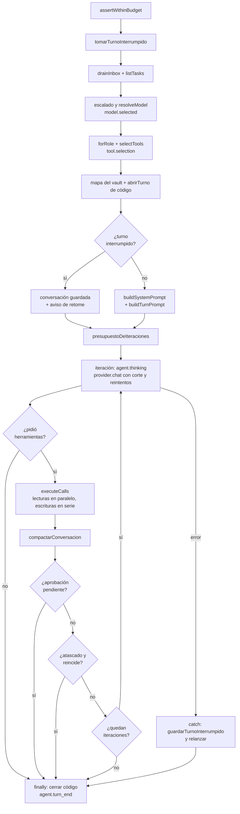

# Motor de agentes

`packages/engine/src/loop.ts` → `runAgentTurn(state, role, deps)` es el **agent
loop**: el turno de un rol dentro de un ciclo. Le pide al modelo, ejecuta las
herramientas que pidió, le devuelve los resultados y repite hasta que el modelo
deja de pedir herramientas o salta un corte. Lo llama el
[[Scheduler y ciclo de una corrida|scheduler]]; lo que el turno lee y escribe
vive en [[Estado de una corrida|RunState]]; el texto que recibe el modelo lo arma
[[Prompt de un turno|prompt.ts]].

El loop es propio y no el de un SDK ([[ADR-001 No usar Claude Agent SDK]]): tiene
que andar con cualquier proveedor, emitir un evento por paso y aplicar frenos que
salieron de corridas medidas. Y no conoce al servidor
([[ADR-003 Motor desacoplado del servidor]]): todo lo que depende de disco, git o
reloj entra inyectado por `TurnDeps`, y por eso los tests corren con
`FakeProvider` sin gastar tokens.

> [!note] Evento antes que acción
> Cada paso emite su evento **antes** de ejecutarse, no al terminar: la UI
> muestra lo que está pasando, no un resumen a posteriori
> (comentario de cabecera de `loop.ts`).

## Qué recibe: `TurnDeps`

| Campo | Qué es | Quién lo pone |
|---|---|---|
| `bus` | `EventBus` donde se emite cada paso | `Orchestrator.runTurns`, desde `OrchestratorDeps` |
| `providers` | `ProviderRegistry`: resuelve el modelo del rol | ídem |
| `tools` | `ToolRegistry` de la empresa: lo que se puede **ejecutar** | ídem (en el servidor, el del `CompanyRuntime`) |
| `ledger` | `RunLedger`: gasto acumulado y tope | ídem |
| `objective` | el encargo, `run.objective` | ídem |
| `maxTicks` | tope de ciclos, para la presión de cierre | `run.maxTicks` |
| `llmTimeoutMs` | corte por llamada cuando el proveedor no declara el suyo | **nadie en producción**: sólo los tests lo pasan |
| `fechaHoy` | hoy, ya formateado | `OrchestratorDeps.fechaHoy()`, evaluada en cada turno |
| `dirDeTrabajo` | salida de la empresa, prestada en sólo lectura al CLI | `Runtime.startRun` → `exports.dirDeEmpresa` |
| `mapaDeContexto` | función que devuelve el mapa del vault de contexto | `Runtime.startRun` → `contexto.mapa` + `mapaDeContextoEnPrompt` |
| `codigo.abrirTurno` | abre el espacio de código del turno | `Runtime.startRun` → `abrirTurnoDeCodigo` |
| `signal` | el corte de la persona (detener) | `Orchestrator.abort.signal` |

`mapaDeContexto` es una función y no un string porque el árbol cambia **dentro**
de la corrida: una nota escrita en el ciclo 2 tiene que aparecer en el 3.

## Qué devuelve: `TurnResult`

| Campo | Qué es | Quién lo usa |
|---|---|---|
| `iterations` | vueltas del loop que hizo | sólo la traza (`agent.turn_end`) |
| `costUsd` | lo que costó el turno | sólo la traza |
| `summary` | último texto no vacío del agente | el scheduler (`respondio`), el checkpoint de código y `agent.turn_end` |
| `awaitingApproval` | quedó esperando una aprobación | nadie: el scheduler lo detecta por `pendingApprovals()` |
| `herramientas` | cuántas herramientas ejecutó | el scheduler: cero es "habló sin hacer nada" |

`herramientas` no es telemetría. Cero significa que el turno habló y no hizo
nada, que desde afuera es indistinguible de no haber tenido el turno, y es lo que
corta el [[Scheduler y ciclo de una corrida#Livelock de tareas|livelock de tareas]].

## El espacio de código: `EspacioDeTurno`

Si el rol tiene herramientas de código, `deps.codigo.abrirTurno` devuelve:

| Campo | Qué es |
|---|---|
| `dir` | worktree del repo principal, o `null` si el proyecto no tiene repo |
| `escritura` | si este turno tiene el arriendo de escritura |
| `resumen` | el bloque "## Código del proyecto" que va al prompt de sistema |
| `cerrar(resumen)` | suelta el arriendo y hace el checkpoint o la instantánea del turno |

Se abre **antes** del prompt (que lleva el resumen) y se cierra en el mismo
`finally` que `agent.turn_end`. Si abrir falla, el turno sigue sin código y queda
un `log` de nivel `warn`: una sesión que no arranca no puede tirar abajo a un
agente que tenía otras cosas que hacer. El detalle del arriendo y del resumen está
en [[Arriendo de escritura y resumen de código]].

## El turno paso a paso

El orden importa: explica qué se pierde cuando algo falla a mitad de camino.

1. **Presupuesto.** `ledger.assertWithinBudget()`; si ya no hay, lanza
   `BudgetExceededError` antes de tocar nada.
2. **Turno interrumpido.** `state.tomarTurnoInterrumpido(role.id)` lo consume si
   existe (ver [[#Turnos interrumpidos]]).
3. **Bandeja y tablero.** `state.drainInbox(role.id)` vacía la bandeja y marca los
   mensajes `read`; `state.listTasks(role.id)` trae las tareas no cerradas.
4. **A quién se contesta.** El primer `request` o `escalation` de la bandeja y, si
   no hay, el primer mensaje que haya. Aceptar cualquier tipo es lo que permite
   contestarle a la persona: el encargo llega como `human`, y exigir un pedido
   formal hacía que `reply` dijera "no hay nada que responder" (se comió 14 de 25
   llamadas a `reply` en una corrida real).
5. **Vista ligada al actor.** `state.forActor(role.id)`: el actor viaja por el
   closure, nunca por un campo compartido (ver [[Estado de una corrida#forActor y AgentWorkspace]]).
6. **Contexto de trabajo.** `objective` + asunto y cuerpo de cada mensaje +
   título y detalle de cada tarea. Alimenta al router, al medidor de dificultad y
   al presupuesto de iteraciones.
7. **Modelo.** Con `role.model.escalado.activo` y sin `modelSlug`,
   `elegirTierPorDificultad` elige el tier ([[Escalado por dificultad]]); después
   `providers.resolveModel` da proveedor, slug y precios. Se emite
   `model.selected` **siempre**, escale o no.
8. **Herramientas.** `tools.forRole(role, state.tools)`: las de coordinación
   siempre, más las asignadas en `toolIds` que estén en el catálogo de la corrida.
   Si el proveedor es `openrouter` y el rol tiene `web_search`, esa herramienta se
   saca y se activa la búsqueda nativa del request (`webSearch: { enabled: true,
   maxResults: 5 }`): expuesta como tool, el modelo llamaría a una que devuelve
   error. Después `selectTools` acota las opcionales y se emite `tool.selection`
   ([[Herramientas y tool router]]).
9. **Mapa y código.** Se pide el mapa del vault (una lectura de disco, una vez
   por turno) y se abre el espacio de código.
10. **Conversación.** Turno nuevo: `system` (`buildSystemPrompt`) + `user`
    (`buildTurnPrompt`). Turno retomado: la conversación guardada más un mensaje
    que dice que se cortó y que siga desde ahí.
11. **Hilo.** `messageId`, `threadId` y `replyToRoleId` del pedido que se
    atiende (o los del turno interrumpido, para que `reply` siga sabiendo a quién).
12. **Iteraciones.** `presupuestoDeIteraciones` fija `base` y `techo`.
13. **Contexto de herramienta** (`ToolContext`): `runId`, `tick`, `actor`,
    `workspace`, el hilo y el `signal`.
14. **Puente del org.** Si `provider.delegaElTurno`, se crea el puente MCP que
    le presta las herramientas al CLI ([[Turnos delegados a un CLI]]).
15. **`try`**: el loop de iteraciones. **`catch`**: se guarda lo hecho para
    retomarlo y se relanza el error. **`finally`**: `codigo.cerrar(summary)` y
    `agent.turn_end`.



> [!danger] Lo que falla antes del `try` no deja rastro de turno
> Los pasos 7 a 9 corren **después** de vaciar la bandeja y **antes** del
> `try`. Si `resolveModel` lanza —por ejemplo "Ningún modelo de … califica para
> el tier smart"—, la bandeja ya quedó vacía y en `read`, el turno interrumpido
> ya se consumió y no se emite `agent.turn_end` (ni `model.selected`). El
> scheduler lo registra como "X no pudo completar su turno: …" y, si ese rol era
> el que tenía el encargo, la corrida puede cerrar como `failed — sin producir
> nada`, con la causa real sólo en ese `log`. Verificado con un script contra el
> working tree.

## Una iteración

Dentro del `while (iterations < presupuesto.techo)`:

1. Si ya pasó la `base` y no avanzó en las últimas dos vueltas, termina (ver
   [[#Presupuesto de iteraciones]]).
2. `ledger.assertWithinBudget()` otra vez.
3. `agent.thinking` con el número de iteración (el nodo del organigrama pulsa).
4. **Corte por tiempo**: `provider.timeoutCodigoMs` si el turno tiene worktree,
   si no `provider.timeoutMs`, si no `deps.llmTimeoutMs`, si no **120 s**. El
   proveedor manda cuando declara el suyo: con 120 s, un turno de `claude-code`
   moría por tiempo siempre, justo mientras el agente trabajaba.
5. `withRetry(() => collect(provider.chat({...})))`: modelo, conversación,
   esquemas de las herramientas seleccionadas, `temperature` si el rol la fija,
   `maxOutputTokens`, búsqueda nativa, `orgTools` si delega, y
   `signal: conTimeout(deps.signal, timeoutMs)` (`AbortSignal.any` del corte de la
   persona y del propio). El request se arma de nuevo en cada intento, así que
   cada reintento tiene su propio corte.
6. **Costo**: `computeCost(modelInfo, usage)` → `ledger.record(...)` (con
   latencia) → `cost.updated` con tokens de entrada, salida y cacheados.
7. Si el mensaje trae texto, pasa a ser el `summary`.
8. **Avisos del proveedor** (`result.avisos`): uno por `log` `warn`. Así un turno
   que respondió Sonnet en lugar de Opus no se lee como si lo hubiera hecho Opus.
9. **Herramientas propias del CLI** (`result.herramientasPropias`): ver
   [[#Lo que el CLI hizo por su cuenta]].
10. Sin `toolCalls`, el turno terminó: `break`.
11. `herramientas += calls.length` y `executeCalls` (siguiente sección).
12. `compactarConversacion` antes de la vuelta siguiente (ver
    [[#Compactación de la conversación]]).
13. Si al menos una llamada salió bien, cuenta como **avance**.
14. Si alguna abrió una aprobación, `break`.
15. Detección de atasco (ver [[#Los cortes del turno]]).

No hay streaming de texto hacia la UI: `collect` se llama sin `onText`, y lo que
el agente escribió llega en `agent.turn_end.summary`.

## Ejecución de herramientas

`executeCalls(calls, byName, ctx, state, bus, memo)` separa las llamadas de una
vuelta:

- **Lecturas** (`readOnly === true`) en paralelo, con `Promise.all` y el memo de
  lecturas.
- **Escrituras** (todo lo demás, incluidas las que no existen) en serie, porque el
  orden en que se envían mensajes y se mueven tareas importa. Después de cada una,
  `invalidarMemo`.

> [!warning] Las lecturas van primero aunque el modelo las pida al revés
> Dentro de una misma vuelta se ejecutan todas las lecturas y después todas las
> escrituras. Si el modelo pide `[write_artifact, read_artifact]` en un solo
> mensaje, la lectura ve la versión anterior a la escritura.

`executeOne(call, byName, ctx, state, bus)` resuelve una llamada:

| Caso | Qué hace | Evento | Actividad | Huella de fallo |
|---|---|---|---|---|
| La herramienta no existe | devuelve `ERROR: la herramienta "x" no existe. Disponibles: …` para que se corrija | ninguno | no | por argumentos |
| `requiresApproval` | abre la aprobación con `approverRoleId = actor.reportsTo` y le dice que termine el turno | `tool.start`, `approval.changed` (pending), `tool.end` (ok false, "esperando aprobación") | no | no |
| `execute` devuelve `ok` | resultado tal cual | `tool.start`, `tool.end`, más el efecto de coordinación | sí | no |
| `execute` devuelve `ok: false` | resultado tal cual | `tool.start`, `tool.end` (ok false) | sí | por argumentos y por motivo |
| `execute` lanza | `ERROR: <mensaje>` | `tool.start`, `tool.end` ("falló", con `error`) | sí | por argumentos y por motivo |

Una herramienta inventada no aparece en la traza ni en `check_activity`: sólo en
la conversación del agente.

### Efectos de coordinación

Una herramienta de coordinación que salió bien cambia algo visible de la empresa,
y eso tiene que animarse en el organigrama, no sólo en el feed de llamadas
(`emitCoordinationEffect`):

| Herramienta | Evento | De dónde saca los datos |
|---|---|---|
| `send_message`, `reply`, `broadcast`, `escalate` | `agent.message` | `state.messages.at(-1)` |
| `assign_task`, `update_task` | `task.changed` (`created` sólo para `assign_task`) | la tarea con `updatedAt` más reciente |
| `write_artifact` | `artifact.created` | `state.artifacts.at(-1)` |
| `request_new_role`, `request_context`, `request_tool_access`, `solicitar_servidor_mcp` | `request.created` | `state.requests.at(-1)` |
| `request_approval` | `approval.changed` | `state.approvals.at(-1)` |

> [!tip] Si tocás una herramienta de coordinación
> El efecto se arma leyendo **el último elemento** de la colección. Funciona
> porque `RunState` escribe sin ceder el control; si una de estas herramientas
> empieza a hacer I/O entre que escribe y que devuelve, otro turno en paralelo
> podría colarse y el evento describiría el mensaje ajeno.

## El memo de lecturas

Una lectura ya hecha **en este turno** no se vuelve a ejecutar ni a pegar: se
contesta con un puntero ("Ya hiciste esta misma lectura en este turno: el
resultado completo (N caracteres) está más arriba…"). Devolver el contenido
cacheado ahorraba el viaje al servidor MCP pero no los tokens, y ahí está el costo:
cada iteración reenvía la conversación entera.

- Vive en `lecturasDelTurno` (`Map<huella, contenido>`), creado por turno. **No**
  hay memo entre turnos: la conversación se rehace y releer es legítimo.
- Sólo memoriza herramientas `readOnly` y sólo resultados exitosos: un error puede
  ser transitorio.
- La huella la calcula `huellaDeLectura(tool, call)`:
  1. si la herramienta declara `clavesDeCache`, sólo esos argumentos (`calcular`
     usa `["expresion", "esperado"]`, `verificar_cifras` usa `["cifras"]`);
  2. si el esquema cierra con `additionalProperties: false`, sólo los argumentos
     declarados;
  3. si no, todos.
- `huellaDeFallo(name, args)` serializa con las claves ordenadas: al modelo le da
  igual el orden y sin normalizar la misma llamada daría dos huellas.

> [!danger] Un argumento inventado derrota al memo
> El modelo cree que puede paginar y llama `read_artifact` con `start=4000`,
> `start=8000`… La herramienta no declara ese campo, lo ignora y devuelve el
> documento **entero** cada vez. Con la huella cruda cada llamada parecía nueva:
> el mismo texto de 40k caracteres entró once veces al contexto y la corrida gastó
> **534k tokens de entrada para 2k de salida** (259:1). Por eso la huella se
> calcula sólo sobre lo declarado cuando el esquema cierra la puerta.

### Qué lo invalida: `invalidarMemo`

`invalidarMemo(memo, nombreMutacion)` es **la** regla, compartida con el puente
delegado (`claude-mcp.ts`):

- Si la escritura sólo habla —`COMUNICACION`: `send_message`, `reply`,
  `broadcast`, `escalate`, `request_approval`, `request_context`,
  `request_new_role`, `request_tool_access`, `solicitar_servidor_mcp`,
  `solicitar_comando`, `instalar_dependencia`—, sólo se borran las entradas de
  `check_activity(…)`, que es lo único que un mensaje desactualiza.
- Cualquier otra escritura (aunque falle, aunque no exista) vacía el memo entero:
  un `list_output` después de escribir un archivo tiene que ver el archivo nuevo.

Vaciarlo con *cualquier* escritura, mensajes incluidos, hacía que el memo casi
nunca sirviera: se midió a un agente ejecutar `list_artifacts` tres veces en el
mismo turno porque entre medio mandó un mensaje y asignó una tarea. Y el puente
delegado que no invalidaba devolvía, en un leer → editar → leer, el puntero a la
versión **anterior** a la edición.

## Compactación de la conversación

El costo de una vuelta es proporcional a todo lo leído antes: cada resultado queda
textual y se reenvía en cada iteración siguiente. Medido: un turno de 14 vueltas
creció de 6k a 27k tokens y gastó 236k, de los cuales 149k (63%) fue reenviar lo
mismo; ese turno fue casi la mitad de la corrida.

`compactarConversacion(conversation, memo)` corre después de ejecutar las
herramientas y antes de la vuelta siguiente, porque el ahorro está en las vueltas
que faltan:

| Constante | Valor | Por qué |
|---|---|---|
| `PRESUPUESTO_CONTEXTO` | 14.000 tokens | el piso de un turno (sistema + bandeja) mide 5-6k; deja lugar para varios documentos |
| `TOKENS_INTOCABLES` | 6.000 tokens | lo reciente se protege **por tamaño**: proteger "los últimos 3" dejó crecer un turno a 22k con tope 14k |
| mínimo para retirar | 200 tokens | el aviso ocupa parecido; retirar algo chico pierde información a cambio de nada |
| `tokensAprox` | `ceil(largo / 4)` | se busca magnitud, no exactitud |
| `MARCA_RETIRADO` | `[contenido retirado]` | para no compactar dos veces |

1. Si el total de la conversación no pasa de 14k, no se toca nada.
2. Se recorren los resultados de herramienta todavía enteros, del más nuevo al más
   viejo, y se protegen hasta juntar 6k (el más reciente siempre, aunque solo se
   pase del cupo).
3. De los demás, del más viejo al más nuevo, se reemplaza el contenido por un
   aviso ("El resultado de `x` (N caracteres) se retiró del contexto… pedilo de
   nuevo") hasta volver bajo el presupuesto.
4. Por cada resultado retirado se borran del memo las entradas de esa
   herramienta: el memo no puede decir "está más arriba" si ya no está.
5. Si retiró algo, `log` `info` con cuántos y cuántos tokens liberó.

Sólo se tocan mensajes `tool`. El razonamiento del agente y el prompt no se
compactan: sin eso el turno pierde el hilo. En un turno delegado no hay nada que
compactar —el motor ve una sola vuelta— y la defensa se invierte: se acota en la
puerta ([[Turnos delegados a un CLI]]).

## Presupuesto de iteraciones

`maxTurns` del rol (default 8, máximo 50 por esquema) es el **piso**, no el techo:
un tope fijo sobra en un turno liviano y corta a la mitad uno cargado —se vio a un
coordinador tocar el techo en 11 de 12 turnos, dejando entregables escritos por la
mitad—. `presupuestoDeIteraciones(role, trabajo)`:

```
base  = max(3, round((maxTurns + 2·mensajes + tareas + min(6, ⌊caracteres / 4000⌋)) · escala))
techo = min(50, 2·base)
escala = 0.5 si retoma un turno interrumpido, 1 si no
```

| Caso | `maxTurns` | mensajes | tareas | caracteres | base | techo |
|---|---|---|---|---|---|---|
| Liviano | 8 | 1 | 0 | 500 | 10 | 20 |
| Cargado | 8 | 5 | 3 | 40.000 | 27 | 50 |
| Retomado | 10 | 2 | 0 | 0 | 7 | 14 |

Cada pedido de la bandeja vale dos vueltas (leer y contestar); un contexto largo se
recorre en varias consultas. Pasada la `base`, el turno sigue sólo si **avanza**:
corta cuando `iterations − ultimoAvance ≥ 2`, o sea, tolera una vuelta sin avance
y corta en la segunda. Al llegar al `techo` queda un `log` `warn` ("agotó las N
iteraciones… sigue en el ciclo próximo").

> [!warning] "Avance" cuenta huellas, no llamadas
> El avance se mide como `results.failures.length < calls.length`, pero cada
> llamada fallida aporta **dos** huellas (argumentos y motivo). Con dos llamadas
> por vuelta, una buena y una mala, `2 < 2` es falso y la vuelta no cuenta como
> avance: el turno corta en la `base` aunque la mitad de su trabajo salga bien.
> Verificado: con una llamada buena y una mala por vuelta el turno terminó en 3
> (base 3, techo 6); con dos buenas y una mala llegó a 6.

## Los cortes del turno

Cada uno está por un problema medido, no por precaución.

| Corte | Constante y valor | Dónde | Qué pasa |
|---|---|---|---|
| Presupuesto | `ledger.exhausted` (`gastado ≥ budgetUsd`) | al empezar y en cada iteración | `BudgetExceededError`: la corrida termina `budget_exceeded` |
| Tiempo por llamada | `timeoutCodigoMs` → `timeoutMs` del proveedor → `llmTimeoutMs` → 120.000 ms | `conTimeout` | aborta la llamada |
| Reintentos | 4 intentos; espera `min(2000·2^(n−1), 20.000)` ms: 2 s, 4 s, 8 s | `withRetry` | ver abajo |
| Iteraciones | `base` y `techo` | `presupuestoDeIteraciones` | fin del turno; sigue el ciclo próximo |
| Llamada idéntica fallida | `TOLERANCIA_IDENTICA = 3` | `runAgentTurn` | a la 3.ª, mensaje "Frená…" en su contexto; a la 4.ª, fin del turno |
| Mismo motivo de fallo | `TOLERANCIA_MOTIVO = 5` | `runAgentTurn` | a la 5.ª, "Frená…"; a la 6.ª, fin |
| Aprobación | `requiresApproval` | `executeOne` | el turno termina esa vuelta |
| Detener | `deps.signal` | `withRetry`, `sleep`, herramientas | aborta sin reintentar |

**Tiempo.** Se midió una llamada de **649 segundos** que dejó a los otros tres
agentes esperando once minutos: el ciclo avanza cuando terminan todos, así que el
más lento manda. Los cortes por proveedor están en
[[Turnos delegados a un CLI#Cortes por tiempo y reintentos]].

**Reintentos.** `withRetry` reintenta sólo lo recuperable: un corte **propio** por
tiempo (el `signal` de la persona no está abortado) o un `LlmError` con
`retryable`. Con modelos gratuitos el 429 es lo normal, no la excepción. Cada
espera se anuncia como `log` `warn` ("Reintento 2 en 4s"), para que no parezca
que el agente se colgó; tras un corte por tiempo el error final dice "El modelo no
respondió a tiempo." Un stop de la persona no se reintenta, y detener durante la
espera la corta ("Corrida detenida durante la espera de reintento.").

**Atascos.** Dos tolerancias porque son dos situaciones. Repetir la llamada
**idéntica** es estar trabado: se corta rápido. Cambiar argumentos y chocar con el
**mismo error** puede ser exploración legítima —probar rutas hasta dar con la
buena—, así que se le da más aire. La huella por motivo (`huellaDeMotivo`:
comillas → `…`, dígitos → `#`, 120 caracteres) existe porque cuando el modelo
agota `maxOutputTokens` escribiendo un documento, los argumentos llegan cortados
en un lugar distinto cada vez: se midieron cuatro `write_artifact` seguidos
fallando por lo mismo sin que la huella por argumentos coincidiera nunca. El aviso
va **en el contexto del modelo** ("Frená. Ya chocaste varias veces contra lo
mismo… pedí lo que te falta con send_message o request_context, y cerrá el
turno."), no sólo en el log, porque el objetivo es que use lo que le queda de turno
en otra cosa. El caso que lo destapó: una ruta MCP fuera del directorio permitido
que comía las `maxTurns` enteras.

## Turnos interrumpidos

Si el turno lanza —proveedor saturado, red caída, corte por tiempo sin rescate—,
el `catch` no tira lo hecho: `state.guardarTurnoInterrumpido(role.id, {...})`
guarda la conversación (podada por `podarSinRespuesta`), el motivo y el hilo, deja
un `log` ("se cortó por …, pero su turno queda guardado") y relanza el error.
Reempezar de cero pagaría de nuevo todo el contexto y volvería a ejecutar
herramientas que ya habían salido bien.

- `podarSinRespuesta` saca del final los mensajes `assistant` con `toolCalls` sin
  resultado: varios proveedores rechazan con 400 una llamada sin su respuesta, y
  el retome fallaría para siempre.
- Mientras esté guardado, el rol cuenta como "con trabajo" (`rolesWithWork`), así
  que el scheduler lo vuelve a convocar.
- Al retomar: la conversación guardada + un `user` que dice "Tu turno anterior se
  cortó antes de terminar (motivo). Seguís desde donde quedaste…", y si llegó algo
  a la bandeja, un resumen de **200 caracteres** por mensaje. El hilo se conserva,
  la base de iteraciones se reduce a la mitad y el medidor de dificultad suma +2
  (`reanudando`).

> [!danger] El tope de reanudaciones no se alcanza nunca
> `RunState.REANUDACIONES_MAX = 3` debería abandonar un turno que se cortó
> demasiadas veces seguidas, pero `tomarTurnoInterrumpido` borra la entrada al
> retomar, y cuando el retome vuelve a fallar `guardarTurnoInterrumpido` no
> encuentra el contador anterior y lo guarda otra vez con `reanudaciones: 1`.
> Resultado verificado con un proveedor que siempre falla: seis intentos seguidos,
> los seis "queda guardado", el rol siempre con trabajo y la conversación
> creciendo un mensaje por intento. Si los demás roles sí completan turnos, el
> corte de tres ciclos fallidos del scheduler no salta y ese rol se sigue
> convocando hasta `maxTicks`.

Además, un turno retomado **no rearma el prompt**: la fecha, la presión de cierre,
la memoria y el mapa son los del turno original, y las novedades de la bandeja
llegan recortadas (ver [[Prompt de un turno#Casos borde y fallas conocidas]]).

## Lo que el CLI hizo por su cuenta

Un proveedor que delega devuelve en `result.herramientasPropias` lo que su CLI usó
por fuera del puente (un `Edit`, un `Read`). Para el motor eso es trabajo:

- suma a `herramientas`: sin eso, un programador que sólo usa el `Edit` de Claude
  Code contaba cero y a los dos turnos el scheduler lo dejaba de convocar;
- emite un `tool.start`/`tool.end` por uso, como `cli:<Nombre>`, con
  `callId = cli-<tick>-<iteración>-<i>`, `origin: "capability"`, `durationMs: 0`,
  `ok: true` y la ruta como argumento: sin esto lo editado no aparecía en la
  cronología ni en el chat del IDE. Llegan al final del turno, porque el CLI
  devuelve todo junto;
- registra en `activity` una entrada por nombre (`cli:Edit`, "3 vez/veces: a.ts,
  b.ts…", hasta 12 rutas distintas), que es lo que audita `check_activity` y lo que
  mira el scheduler para no dar por vacía una corrida que editó código.

El resto del camino delegado —el puente, sus frenos, `ocupada()`— está en
[[Turnos delegados a un CLI]].

## Registro de actividad

`state.recordActivity({ roleId, tick, tool, ok, detail })` registra **lo que se
ejecutó**, grabado por el loop y no por el agente. Lo alimentan `executeOne`
(éxitos y fallos, con `detail` recortado a 200 caracteres), los usos `cli:*` y
`Orchestrator.ejecutarAprobada` ("aprobada: …"). No entran: la herramienta
inventada, la que quedó esperando aprobación, las relecturas contestadas con
puntero ni las llamadas que el puente delegado negó.

Es lo único que detecta la clase de error más repetida: **ejecutar algo con éxito
y después informar que no se pudo**. Lo consumen `check_activity`
([[Coordinación entre agentes]]), `fallosConsecutivos` (orden del ciclo y
dificultad), la regla de "corrida que editó código" del scheduler y la exigencia de
evidencia de `record_lesson` ([[Memoria de la empresa]]). Se conservan las últimas
500 entradas y no se persiste ([[Estado de una corrida#Actividad]]).

## Eventos que emite un turno

| Evento | Cuándo | Campos clave |
|---|---|---|
| `model.selected` | una vez, antes de pensar | `providerId`, `modelSlug`, `tier`, `escalado`, `motivo` |
| `tool.selection` | una vez | `candidates`, `exposed`, `strategy`, `reason` |
| `agent.thinking` | en cada iteración | `providerId`, `modelSlug`, `iteration` |
| `cost.updated` | después de cada llamada al modelo | `deltaUsd`, `totalUsd`, `budgetUsd`, tokens |
| `tool.start` / `tool.end` | por herramienta (incluidas `cli:*`) | `callId`, `toolName`, `origin`, `args` / `ok`, `preview`, `error` |
| `approval.changed` | al abrir una aprobación | `status: "pending"`, `toolName` |
| efectos de coordinación | ver tabla de arriba | — |
| `log` `warn` | reintentos, avisos del proveedor, atascos, techo, código que no abre ni cierra, turno guardado | `message` |
| `log` `info` | compactación, puntero del memo | `message` |
| `agent.turn_end` | **siempre**, en el `finally` | `iterations`, `costUsd`, `summary` |

> [!danger] `agent.turn_end` va en el `finally`
> La UI enciende el nodo con `agent.thinking` y lo apaga con `agent.turn_end`. Un
> turno que falla sin emitir el cierre deja el agente "pensando" para siempre,
> aunque la corrida haya terminado. Hay un test que lo fija
> (`memory.test.ts` → "estado visual del agente").

Todas las variantes están en [[Referencia de eventos]]; cómo las persiste y
reemite el servidor, en [[Observabilidad y trazas]].

## Casos borde y fallas conocidas

| Síntoma | Causa |
|---|---|
| "X no pudo completar su turno: Ningún modelo … califica para el tier …" y el encargo desaparece | `resolveModel` falla después de `drainInbox` y antes del `try` |
| Un turno con la mitad de sus llamadas buenas corta en la `base` | el avance compara huellas contra llamadas |
| Un rol cuyo proveedor falla siempre se convoca hasta `maxTicks` | el tope de reanudaciones se reinicia en cada retome |
| El agente lee la versión vieja de algo que pidió escribir en la misma vuelta | lecturas antes que escrituras |
| Una herramienta inventada no aparece en la traza | `executeOne` devuelve antes de emitir `tool.start` |
| Una búsqueda cuyo argumento lleva `::` (por ejemplo `Foo::bar`) recién se frena a la 5.ª repetición | la tolerancia elige 3 o 5 mirando si la huella contiene `::`, que es la marca de la huella por motivo |
| El gasto final pasa un poco el tope | las llamadas en vuelo de otros turnos terminan y se cobran; el corte se mira al empezar cada iteración |
| Un turno de `claude-code` que se cortó por tiempo no se reintenta | su error es un `LlmError` no recuperable cuyo texto no parece un aborto: queda guardado y sigue en el ciclo próximo |

## Qué fijan los tests

`packages/engine/src/loop.test.ts`:

- "corta el turno en vez de gastar las 10 iteraciones": la llamada idéntica se
  avisa a la 3.ª y se corta a la 4.ª, y el turno igual emite `agent.turn_end`.
- "le avisa al modelo en su contexto, no solo en el log": el "Frená" está en la
  conversación.
- "le da aire al que cambia de argumentos, pero no infinito": entre 5 y 7 vueltas.
- "corta y reintenta en vez de esperar para siempre" y "un stop de la persona no
  se reintenta".
- "guarda la conversación y la retoma en el ciclo siguiente" y "no guarda una
  llamada a herramienta sin su resultado".
- "le da más vueltas al que tiene más trabajo encima" y "al retomar pide menos".
- Memo: tres pedidos, una lectura; mandar un mensaje no lo invalida; escribir sí;
  un argumento inventado no engaña a la huella y el documento viaja una sola vez.
- Compactación: retira lo consumido, conserva lo último y el pico queda por debajo
  de 80.000 caracteres con ocho documentos de 40k.
- "contestarle a la persona que dio el encargo": `reply` sobre un `human` no crea
  una respuesta y le indica el canal (`request_context`).
- Escalado: el tier mínimo en un turno liviano, el máximo para un executive
  cargado, un `modelSlug` que apaga el escalado, `incorporarRol` con rango de
  executor.
- Espacio de código: el resumen entra al prompt, se cierra con el resumen del
  turno, se cierra aunque el proveedor falle, y si no abre el turno sigue.

`packages/engine/src/memory.test.ts` fija que un turno que falla emite
`agent.turn_end` después de `agent.thinking`, y que un agente caído no tumba a los
demás.

## Cómo modificar sin romperlo

- **Una herramienta nueva que sólo habla** (crea un mensaje o una solicitud) va en
  `COMUNICACION`, o cada uso vaciará el memo.
- **Una lectura con argumentos decorativos** declara `clavesDeCache` o cierra su
  esquema con `additionalProperties: false`.
- **Un paso nuevo que pueda fallar** va dentro del `try`, o antes de
  `drainInbox`: entre los dos se pierde la bandeja.
- **Las tolerancias están duplicadas** en `claude-mcp.ts` para el camino
  delegado: si cambiás una, cambiá la otra.
- **Un evento nuevo** se declara en `packages/shared/src/events.ts`
  ([[Cómo agregar un evento]]); un paso que no emite es un paso invisible.
- **Nada de estado mutable por turno en `RunState`**: el actor se ata con
  `forActor` ([[Invariantes de arquitectura]]).
- Para correr sólo estos tests: `npx vitest run packages/engine/src/loop.test.ts`.

## Fuentes

- `packages/engine/src/loop.ts` → `runAgentTurn`, `TurnDeps`, `EspacioDeTurno`,
  `TurnResult`, `withRetry`, `esAborto`, `conTimeout`, `compactarConversacion`,
  `PRESUPUESTO_CONTEXTO`, `TOKENS_INTOCABLES`, `MARCA_RETIRADO`, `COMUNICACION`,
  `executeCalls`, `executeOne`, `emitCoordinationEffect`, `invalidarMemo`,
  `huellaDeFallo`, `huellaDeLectura`, `huellaDeMotivo`, `podarSinRespuesta`,
  `resumirBandeja`, `presupuestoDeIteraciones`
- `packages/engine/src/state.ts` → `recordActivity`, `guardarTurnoInterrumpido`,
  `tomarTurnoInterrumpido`, `REANUDACIONES_MAX`
- `packages/engine/src/scheduler.ts` → `Orchestrator.runTurns`
- `packages/llm/src/types.ts` → `ChatRequest`, `ChatResult.herramientasPropias`,
  `ChatResult.avisos`, `LlmProvider.timeoutMs`, `timeoutCodigoMs`,
  `delegaElTurno`, `LlmError`, `collect`
- `packages/llm/src/registry.ts` → `ProviderRegistry.resolveModel`
- `packages/tools/src/registry.ts` → `ToolRegistry.forRole`;
  `packages/tools/src/router.ts` → `selectTools`;
  `packages/tools/src/types.ts` → `RegisteredTool.clavesDeCache`, `ToolContext`
- `apps/server/src/runtime.ts` → `Runtime.startRun` (armado de las dependencias)
- Tests: `packages/engine/src/loop.test.ts`, `memory.test.ts`

## Ver también

- [[Scheduler y ciclo de una corrida]] — quién llama a esto y cuándo
- [[Estado de una corrida]] — lo que el turno lee y escribe
- [[Prompt de un turno]] — qué ve el modelo
- [[Escalado por dificultad]] — con qué tier piensa cada turno
- [[Turnos delegados a un CLI]] — el mismo turno cuando lo corre un CLI
- [[Herramientas y tool router]] — qué herramientas ve el agente
- [[Capa LLM y tiers]] — cómo se resuelve el modelo
- [[Costos y presupuesto]] — el ledger y el corte por gasto
- [[Observabilidad y trazas]] — qué pasa con los eventos
