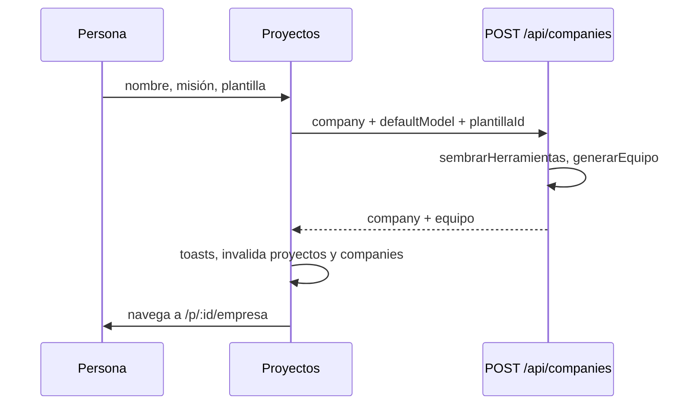

# Pantalla Proyectos

**Ruta:** `/proyectos` — también el destino de `/` y de cualquier ruta
desconocida. **Componente:** `apps/web/src/routes/Proyectos.tsx` → `Proyectos`,
montado por `App.tsx` → `ProyectosRuta`.

Es la puerta de entrada: se elige con qué proyecto trabajar, se crea uno nuevo
(con o sin equipo de plantilla) y se da de baja. Un proyecto es una empresa
completa; el rótulo "proyecto" existe sólo acá y adentro se sigue hablando de
empresa ([[Gestión de proyectos]]). La ficha existe para **decidir sin entrar**:
con cuatro proyectos, "¿cuál era el que no usé nunca?" se contesta mirando
agentes, corridas y peso en disco, no abriéndolos de a uno.

## Datos

| Clave | Pedido | Para qué |
|---|---|---|
| `["proyectos"]` | `GET /api/companies/resumen` | una línea por proyecto |
| `["plantillas"]` | `GET /api/plantillas` | plantillas de equipo y el `proveedorPreferido` |

`ResumenProyecto` (`api.ts`): `id`, `name`, `mission`, `updatedAt`, `roles`,
`departamentos`, `corridas`, `entregables`, `misiones`, `ultimaCorridaAt`,
`corridaViva` y `disco: {archivos, bytes}`. El servidor lo cuenta con `GROUP BY`
partiendo de `listCompanies()` (así un proyecto vacío aparece en cero) y mide el
disco sin crear la carpeta; `corridaViva` sale de `runtime.tieneCorridaViva`.
Ver [[Gestión de proyectos]].

No hay intervalo: la lista se refresca al crear, borrar o renombrar, o al volver a
la pantalla.

## Panel "Proyectos (N)"

Botón **+ proyecto** (oculto mientras el formulario está abierto). Debajo:

- una franja roja con el error de crear o borrar, si lo hubo;
- el formulario de alta, si está abierto;
- **cargando** → "Cargando…";
- **vacío** → "No hay ningún proyecto. Creá uno con **+ proyecto**, o ejecutá
  `npm run db:seed` para traer el de ejemplo.";
- si no, una grilla de fichas (1, 2 o 3 columnas según el ancho).

## Alta: `NuevoProyecto`

| Campo | Detalle |
|---|---|
| Nombre | obligatorio, con foco al abrir. Pista: "Cómo se llama la empresa que vas a modelar." |
| Misión | opcional: "Qué hace, en una frase. Se puede completar después…" |
| Equipo inicial | sólo si hay plantillas: tarjetas de radio, "Empezar vacío" más una por plantilla con nombre, cantidad de agentes, descripción y el `tipoDeEncargo` en el `title` |

**crear y abrir** se habilita con un nombre y sin pedido en curso ("creando…").
Al lado, una línea dice qué va a pasar: "Nace con el equipo de la plantilla…" o
"Nace vacío pero con sus herramientas listas para asignar."

Lo que manda (`POST /api/companies`):

| Campo | Valor | Por qué |
|---|---|---|
| `name`, `mission` | los del formulario, recortados | |
| `defaultModel.providerId` | `plantillas.proveedorPreferido`, o `openrouter` si no llegó | el proveedor sale de lo configurado (`claude-sesion > anthropic > claude-code > openrouter`), no de un hardcodeo |
| `defaultModel.tier` | `standard` | el que sirve para coordinar |
| `defaultModel.escalado` | `{activo: true, tierMinimo: "cheap", tierMaximo: "smart"}` | el escalado baja solo los turnos livianos ([[Escalado por dificultad]]) |
| `modelSlug`, `temperature` | `null` | |
| `maxOutputTokens` | 4096 | |
| `plantillaId` | sólo si se eligió una | |

El servidor siembra las herramientas built-in y, con plantilla, genera el equipo
(`Runtime.generarEquipo`). La respuesta trae `equipo` con los roles, las
`herramientasFaltantes` y los `mcpSugeridos` ([[Plantillas de equipo]]).

Con equipo, tres toasts: "Equipo creado: N agentes listos para trabajar." (ok);
si faltan herramientas, "Sin registrar en esta máquina: …" —nombradas, nunca
calladas: una habilidad condicionada al entorno (imágenes, navegador) no se
registró y el rol que la esperaba tiene que saberlo—; si hay servidores
sugeridos, "Este equipo aprovecha servidores MCP: … Instalálos desde la Tienda."
Instalarlos lo decide una persona ([[Pantalla Tienda]]). Después se entra directo
a `/p/<id>/empresa`: lo primero es ver el equipo, o armarlo si nació vacío.

> [!warning] Si las plantillas no cargaron todavía
> Crear antes de que responda `/api/plantillas` usa `openrouter` como proveedor
> por defecto aunque haya otro configurado.

## La ficha de un proyecto

- **Nombre** con `NombreEditable` (doble click o lápiz). Se deshabilita con una
  corrida en curso: "Tiene una corrida en curso: sus agentes trabajan sobre la
  carpeta actual. Detenela antes de renombrar."
- **Misión** (dos líneas) o "Sin misión declarada."
- **Estado**: `en curso` si `corridaViva`.
- **Seis datos**: agentes, áreas, misiones, corridas, entregables, en disco.
- "Última corrida hace …" o "Nunca corrió.", y cuántos archivos de salida tiene.
- **abrir** → `/p/<id>/empresa`.
- **borrar**, deshabilitado con una corrida en curso ("Detenela antes de borrar el
  proyecto.") o con otro borrado pendiente. Abre una confirmación en la ficha:
  "¿Borrar X? Se van sus agentes, corridas, entregables, memoria y su carpeta de
  salida (peso). No se puede deshacer." → **sí, borrar** →
  `DELETE /api/companies/:id`. El servidor lo verifica igual (409 con una corrida
  viva): la guardia de la UI es comodidad. Lo que se lleva:
  [[Limpieza y mantenimiento]].

**Renombrar** va por `POST /api/companies/:id/renombrar`, que muda la carpeta y
el vault; si devuelve la carpeta, un toast dice "Carpeta del proyecto: <nombre>."
Invalida `proyectos`, `companies` y `company`. Un error (repetido, corrida en
curso) queda escrito debajo del campo.

## Casos borde

> [!warning] La ficha nunca se marca "abierto"
> La pantalla sabe dibujar el proyecto activo (borde de acento, estado "abierto",
> botón "ir al diseñador"), pero recibe `activeId` del `:companyId` de la URL y
> `/proyectos` no lo tiene: siempre es `null`. Ver [[Frontend web]].

- Un error al pedir el resumen no se muestra: la pantalla queda en el estado
  vacío y sugiere `npm run db:seed`.
- `corridaViva` no se refresca solo: una corrida arrancada en otra pestaña no
  aparece "en curso" hasta volver a la pantalla, y hasta entonces **borrar** y
  **renombrar** siguen habilitados (el servidor contesta 409).
- El ícono de la plantilla (`icono`) no se dibuja.

## Qué fijan los tests

No hay tests de la pantalla. Del lado del servidor, `apps/server/src/db.test.ts`
fija el resumen ("un proyecto vacío aparece en cero, no ausente", "cuenta lo de
cada uno sin mezclar", "la última corrida es la más reciente");
`apps/server/src/equipo.test.ts`, la generación del equipo (herramientas
faltantes nombradas, plantilla desconocida); y `apps/server/src/renombrar.test.ts`,
el renombre.

## Fuentes

- `apps/web/src/routes/Proyectos.tsx` — `Proyectos`, `NuevoProyecto`, `Tarjeta`,
  `Dato`.
- `apps/web/src/App.tsx` — `ProyectosRuta`.
- `apps/web/src/api.ts` — `resumenProyectos`, `plantillas`, `createCompany`,
  `renombrarEmpresa`, `deleteCompany`, `ResumenProyecto`, `EquipoGenerado`.
- `apps/server/src/routes.ts` — `/api/companies/resumen`, `/api/plantillas`,
  `POST /api/companies`, `/api/companies/:id/renombrar`.

## Ver también

- [[Gestión de proyectos]] — el lado del servidor
- [[CU-11 Proyecto nuevo desde una plantilla]]
- [[Referencia de plantillas de equipo]]
- [[Pantalla Empresa y organigrama]] — a donde lleva "abrir"
- [[Frontend web]]
