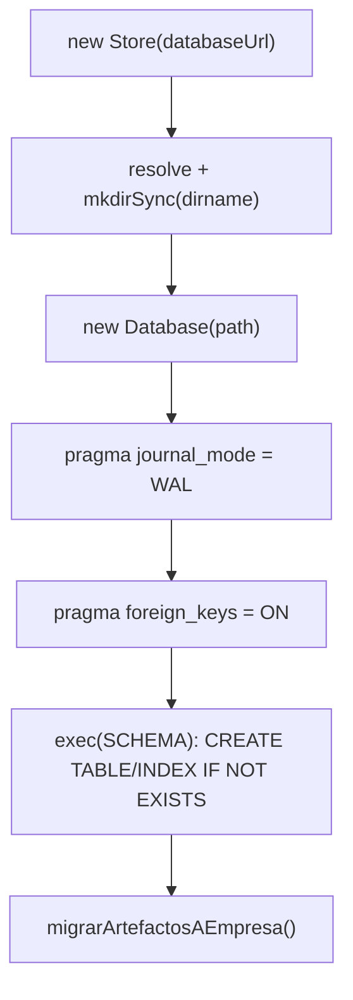
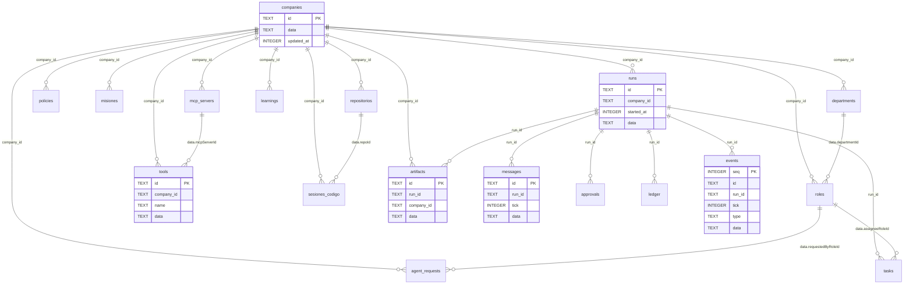
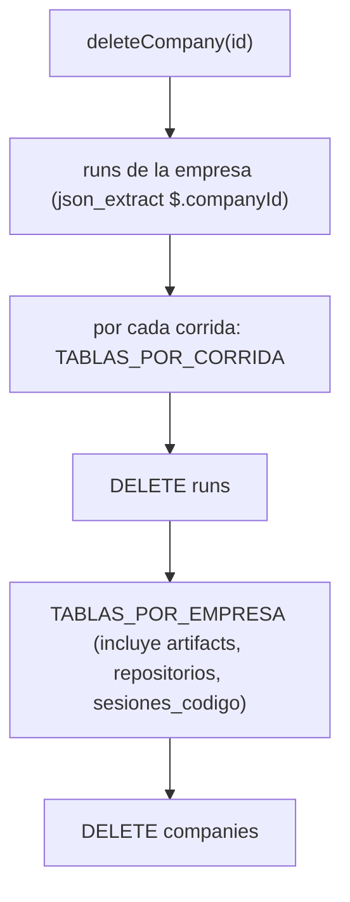

# Persistencia y esquema SQL

`apps/server/src/db.ts` → `Store`: la única puerta a la base. SQLite en un
archivo (`DATABASE_URL`, por defecto `data/orquestador.db`), con
`better-sqlite3`, **sincrónico**. Cada entidad del dominio se guarda como un
documento JSON en la columna `data`, con al costado sólo las columnas que hacen
falta para filtrar e indexar.

Lo operativo —crear, inspeccionar, respaldar, compactar— está en
[[Base de datos]]. El significado de cada entidad, en [[Modelo de dominio]], y
sus campos, en [[Referencia de esquemas]].

## Por qué documentos JSON y no columnas

El comentario de cabecera de `db.ts` lo dice: para una herramienta local de un
solo usuario rinde de sobra y **evita un segundo esquema** que habría que
mantener en paralelo al de Zod, que ya es la fuente de verdad (ver
[[ADR-002 Zod como única fuente de verdad]]). Un campo nuevo se agrega en
`packages/shared/src/schema.ts` y la base no se entera.

Lo que se resignó: SQL expresivo sobre los campos (lo que no tiene columna se
filtra con `json_extract`, sin índice), y la validación al leer (ver "Leer:
crudo o por Zod").

## Cómo se abre



- **WAL** deja que la UI lea mientras una corrida escribe, sin bloquearse. Crea
  los archivos `-wal` y `-shm` al lado de la base (ver [[Base de datos]]).
- **`foreign_keys = ON` no tiene efecto**: el esquema no declara ninguna
  `FOREIGN KEY`. Todas las relaciones son lógicas y las cascadas se hacen a
  mano, en el `Store` (ver "Cascadas").
- **El esquema es idempotente**: `SCHEMA` es una sola cadena de `CREATE … IF NOT
  EXISTS`. No hay migraciones versionadas.
- **La única migración que existe vive en el constructor**:
  `migrarArtefactosAEmpresa` agrega `artifacts.company_id` con `ALTER TABLE` si
  falta, la completa desde `runs` y crea `idx_artifacts_company`. Tiene que
  estar acá y no en `migrate.ts`: el servidor no corre `migrate.ts` al levantar.

Quién abre la base: `apps/server/src/index.ts` (el servidor),
`apps/server/src/migrate.ts` (`npm run db:migrate`), `apps/server/src/seed.ts` y
los `scripts/seed-*.ts` (con `Store`), y en sólo lectura con `better-sqlite3`
directo `scripts/auditar-corrida.ts` y `scripts/vault-contexto.ts`. Los tests
abren una base en un directorio temporal (`apps/server/src/testing/entorno.ts`
→ `armarEntorno`).

## Las 18 tablas

Todas tienen `id TEXT PRIMARY KEY` (salvo `events`) y `data TEXT NOT NULL` con
el JSON de la entidad. Lo demás son columnas **de filtro**, copiadas del JSON al
guardar.

### Configuración de la empresa

| Tabla | Columnas además de `id` y `data` | Documento en `data` | Notas |
|---|---|---|---|
| `companies` | `updated_at INTEGER NOT NULL` | `Company` | `listCompanies` ordena por `updated_at` desc |
| `departments` | `company_id TEXT NOT NULL` | `Department` | — |
| `roles` | `company_id TEXT NOT NULL` | `Role` | `departmentId`, `reportsTo` y `toolIds` viven en el JSON |
| `policies` | `company_id TEXT NOT NULL` | `Policy` | — |
| `misiones` | `company_id TEXT NOT NULL` | `Mision` | `proximaAt` (el próximo disparo) va en el JSON: no hay timers |
| `mcp_servers` | `company_id TEXT NOT NULL` | `McpServer` | Secretos **por referencia**: sólo nombres de variables |
| `tools` | `company_id TEXT NOT NULL`, `name TEXT NOT NULL` | `Tool` | Catálogo por empresa: `capability`, `skill`, `mcp` y `creada` (con su `composicion`). Las de coordinación no se guardan |

### Código

| Tabla | Columnas | Documento | Notas |
|---|---|---|---|
| `repositorios` | `company_id TEXT NOT NULL` | `Repositorio` | Se lee **por Zod** |
| `sesiones_codigo` | `company_id TEXT NOT NULL` | `SesionCodigo` | Se lee por Zod; el `repoId` va en el JSON. Sobrevive a la corrida que la abrió |

### Ejecución (cuelgan de una corrida)

| Tabla | Columnas | Documento | Notas |
|---|---|---|---|
| `runs` | `company_id TEXT NOT NULL`, `started_at INTEGER NOT NULL` | `Run` | La fila es el último snapshot guardado; el estado vivo está en memoria |
| `messages` | `run_id TEXT NOT NULL`, `tick INTEGER NOT NULL` | `Message` | `listMessages` ordena por `tick, id` |
| `tasks` | `run_id TEXT NOT NULL` | `Task` | `run_id` **cambia** cuando una corrida nueva adopta la tarea |
| `approvals` | `run_id TEXT NOT NULL` | `ApprovalRequest` | — |
| `ledger` | `run_id TEXT NOT NULL` | `LedgerEntry` | Tokens, costo y latencia por llamada |
| `events` | `seq INTEGER PRIMARY KEY AUTOINCREMENT`, `id TEXT NOT NULL`, `run_id TEXT NOT NULL`, `tick INTEGER NOT NULL`, `type TEXT NOT NULL` | `TraceEvent` | La traza. `seq` da el orden exacto: el timestamp no alcanza porque varios eventos del mismo tick caen en el mismo milisegundo. `id` **no es único** (no hay índice); `AUTOINCREMENT` crea la tabla interna `sqlite_sequence` |

### Transversales

| Tabla | Columnas | Documento | Notas |
|---|---|---|---|
| `artifacts` | `run_id TEXT NOT NULL`, `company_id TEXT` (nullable) | `Artifact` | **Dos padres** a propósito (ver abajo). En una base anterior a la columna, `company_id` aparece última (la agregó el `ALTER`): el código nombra columnas, así que el orden no importa |
| `learnings` | `company_id TEXT NOT NULL` | `Learning` | Ámbito empresa: es lo que hace que el conocimiento sobreviva. Se lee por Zod |
| `agent_requests` | `company_id TEXT NOT NULL` | `AgentRequest` | `requestedByRoleId` en el JSON |

Un fragmento del DDL, para ver la forma:

```sql
CREATE TABLE IF NOT EXISTS artifacts (
  id TEXT PRIMARY KEY,
  run_id TEXT NOT NULL,
  company_id TEXT,
  data TEXT NOT NULL
);
CREATE TABLE IF NOT EXISTS events (
  seq INTEGER PRIMARY KEY AUTOINCREMENT,
  id TEXT NOT NULL, run_id TEXT NOT NULL,
  tick INTEGER NOT NULL, type TEXT NOT NULL, data TEXT NOT NULL
);
```

## `artifacts` tiene dos padres

`run_id` dice qué corrida lo escribió; `company_id`, de quién es.
`listArtifactsByCompany` filtra por `company_id` —no une con `runs`— para que un
entregable **siga apareciendo aunque se borre su corrida**. `deleteRun` se lleva
eventos, mensajes, tareas, aprobaciones y ledger —el registro de *cómo* se
llegó— pero nunca los artefactos. `saveArtifact(artifact, companyId)` completa la
columna al guardar.

> [!danger] Los entregables no tienen `updatedAt`
> `artifactSchema` tiene `createdAt` y `version`, nada más. Ordenar por
> `updatedAt` deja todo en `undefined` y el orden queda como salió de SQLite: lo
> pagamos renderizando un guion viejo encima del bueno (el video salió de 1m32s
> en vez de 2m54s). Se ordena por `version` y, a igual versión, por `createdAt`.

## Índices

| Índice | Sobre | Qué consulta lo usa |
|---|---|---|
| `idx_departments_company`, `idx_roles_company`, `idx_policies_company`, `idx_misiones_company`, `idx_mcp_company`, `idx_tools_company`, `idx_repositorios_company`, `idx_sesiones_codigo_company`, `idx_learnings_company`, `idx_requests_company` | `company_id` | todos los `list*(companyId)` |
| `idx_runs_company` | `runs(company_id, started_at DESC)` | `listRuns(companyId)` sale ordenada sin ordenar en memoria; `resumenEmpresas` |
| `idx_messages_run` | `messages(run_id, tick)` | `listMessages` |
| `idx_tasks_run`, `idx_approvals_run`, `idx_ledger_run`, `idx_artifacts_run` | `run_id` | los `list*(runId)` |
| `idx_events_run` | `events(run_id, seq)` | `listEvents` (el replay) y `progresoDeCorrida` (agregados sin traer la traza) |
| `idx_artifacts_company` | `artifacts(company_id)` | `listArtifactsByCompany`. Lo crea `migrarArtefactosAEmpresa`, no `SCHEMA` |

Además, cada `TEXT PRIMARY KEY` genera su `sqlite_autoindex_<tabla>_1`. Las
consultas por `json_extract` (`deleteCompany` sobre `runs`, `deleteRole`,
`deleteRepositorio`, `listTasksAbiertasByCompany`, `sanearCorridasHuerfanas`)
**no usan índice**: recorren la tabla.

## Relaciones

Todas lógicas: ninguna tiene `FOREIGN KEY`.



## Escribir: los upserts

Todo guardado es `INSERT … ON CONFLICT(id) DO UPDATE`, así que guardar dos veces
la misma entidad la reemplaza. Qué columnas se actualizan en el conflicto no es
igual en todas, y eso es una regla:

| Método | Qué actualiza si ya existe | Por qué |
|---|---|---|
| `upsertScoped` (departments, roles, policies, misiones, mcp_servers, repositorios, sesiones_codigo, learnings, agent_requests) | sólo `data` | una fila **no cambia de empresa**: `company_id` queda el original |
| `upsertRunScoped` (tasks, artifacts, approvals, ledger) | `data` **y `run_id`** | una tarea adoptada por la corrida siguiente cambia de dueño. Sin esto el JSON decía la corrida nueva y la columna la vieja, y `listTasks(runId)` —que filtra por la columna— dejaba el tablero heredado vacío |
| `saveCompany` | `data`, `updated_at` | — |
| `saveRun` | sólo `data` | `started_at` y `company_id` no cambian |
| `saveMessage` | sólo `data` | — |
| `saveTool` | `data`, `name` | — |
| `saveEvent` | nada: `INSERT` a secas | la traza sólo crece; el cliente SSE deduplica por `id` |

## Leer: crudo o por Zod

`one` y `many` hacen `JSON.parse` **crudo**. Los `.default()` de Zod no se
aplican solos, así que una fila guardada antes de que existiera un campo sale sin
ese campo.

| Lectura | Cómo | Por qué |
|---|---|---|
| `listLearnings` | `learningSchema.parse` por fila | Las filas viejas no tienen `estado`, `evidencia` ni `confirmaciones`: sin el parse, `estado === "refutada"` comparaba contra `undefined` y el filtro del prompt no las distinguía. `parse` y no `safeParse`: las escribió este código, una que no parsea es un bug |
| `listRepositorios`, `getRepositorio`, `listSesionesCodigo`, `getSesionCodigo` | `repositorioSchema.parse`, `sesionCodigoSchema.parse` | la misma trampa con los campos de código que se fueron agregando |
| todo lo demás | crudo | un campo nuevo tiene que ser `.optional()` y tolerado al leer. Por eso `runSchema.foco` es opcional y no `.default()`: "las filas viejas no lo tienen y se leen sin Zod" |

`insertarCrudoParaTests` existe sólo para simular esas filas viejas en los tests
de compatibilidad.

## Cascadas de borrado

No hay `ON DELETE CASCADE`: cada borrado se lleva a mano lo que cuelga de él.



| Método | Se lleva | Deja |
|---|---|---|
| `deleteCompany` | En una transacción: las corridas y todas sus filas, todas las tablas de `TABLAS_POR_EMPRESA` (**incluidos los entregables**: ya no queda empresa a la que pertenezcan) y la empresa | — |
| `deleteRun` | En una transacción: `events`, `messages`, `tasks`, `approvals`, `ledger` y la corrida | **los entregables** |
| `deleteRole` | En una transacción: sus `agent_requests` (devuelve cuántas) y **cancela** sus tareas abiertas con el motivo en `result` | las tareas terminadas (son historia) |
| `deleteRepositorio` | el repo y sus `sesiones_codigo` (por `$.repoId`) | — |
| `deleteToolsByMcpServer` + `podarToolIdsHuerfanos` | las tools del servidor y los `toolIds` muertos de los roles (devuelve cuántos roles podó) | — |
| `deleteDepartment`, `deletePolicy`, `deleteMision`, `deleteMcpServer`, `deleteLearning` | sólo la fila | un departamento borrado deja sus roles con `departmentId` colgando |

Las dos listas son constantes del módulo y **las comparten el borrado en cascada
y el barrido de residuos**:

```ts
const TABLAS_POR_EMPRESA = ["departments", "roles", "policies", "misiones", "mcp_servers",
  "tools", "learnings", "agent_requests", "artifacts", "repositorios", "sesiones_codigo"];
const TABLAS_POR_CORRIDA = ["events", "messages", "tasks", "approvals", "ledger"];
```

Si aparece una tabla nueva y se agrega en un solo lado, el borrado deja basura
que el barrido no ve, o el barrido se lleva filas que sí tenían dueño. `runs` no
está en ninguna: su cascada se hace a mano, y `residuos()` la cuenta aparte.

> [!warning] `deleteRun` no usa `TABLAS_POR_CORRIDA`
> Tiene su propia lista literal, hoy idéntica. Una tabla nueva agregada sólo a la
> constante no se borraría con la corrida (el barrido la encontraría después como
> residuo). Si agregás una tabla por corrida, tocá las dos.

## Residuos, purga y compactación

Un residuo es una fila que apunta a algo que ya no existe. Hoy los borrados no
los dejan, pero antes sí: se midieron **10 entregables y 21 corridas** apuntando
a empresas inexistentes, invisibles desde la UI porque les falta justo el padre
por el que se navega.

- `residuos()` cuenta, por tabla y sólo las que tienen alguna: primero las
  `runs` sin empresa; después cada tabla de `TABLAS_POR_EMPRESA` sin empresa; y
  cada tabla de `TABLAS_POR_CORRIDA` **contra las corridas que van a
  sobrevivir** (`run_id NOT IN (SELECT id FROM runs WHERE company_id IN
  companies)`), no contra `runs` a secas. Devuelve `{ porEmpresa, porCorrida,
  filas }`.
- `purgarResiduos()` borra en una transacción, en este orden: corridas sin
  empresa → tablas por corrida → tablas por empresa. Al revés habría que correrlo
  dos veces. Devuelve lo que contó **antes** de borrar.

> [!danger] Un diagnóstico tiene que anunciar exactamente lo que va a borrar
> El barrido decía 1 fila y borraba 3: no contaba la corrida huérfana ni sus
> mensajes, porque comparaba contra `runs` a secas y esa corrida todavía existía.
> Un botón destructivo que subdeclara no se vuelve a creer. El test
> "anuncia exactamente las filas que va a borrar" lo fija.

- `vacuum()` corre `VACUUM` **suelto**: SQLite no lo admite dentro de una
  transacción ("cannot VACUUM from within a transaction"), por eso la purga lo
  deja al final.
- `pesoEnDisco()` = `page_count × page_size`: el tamaño **lógico** de la base,
  no lo que ocupa el archivo con su `-wal`. Baja en el acto después de un
  `VACUUM` aunque el archivo tarde hasta el checkpoint (ver [[Base de datos]]).

## Lecturas agregadas

| Método | Qué hace | Por qué así |
|---|---|---|
| `resumenEmpresas()` | Cuenta roles, departamentos, corridas, entregables y misiones con `GROUP BY company_id`, más `MAX(started_at)`, y **recorre `listCompanies`** para armar una línea por empresa | Traer las filas para contarlas se lleva cada entregable entero a memoria; y un `GROUP BY` a secas **pierde los proyectos vacíos**, que son los recién creados |
| `progresoDeCorrida(runId)` | `COUNT(*)` y `SUM(type = 'tool.end')` sobre `idx_events_run`, más la última fila por `seq` para `ultimaSenalAt` | Contestar "¿avanza?" sin bajar 8 000 eventos |
| `listTasksAbiertasByCompany` | `JOIN runs` y excluye `done`/`cancelled` | El trabajo abierto se hereda; lo terminado no es trabajo |
| `listRuns(companyId?)` | Con empresa, todas; sin ella, `LIMIT 100` | Alimenta una pantalla |
| `listAllRuns()` | Sin tope | Una limpieza con el tope borraba de a 100 |
| `listEvents(runId, sinceSeq = 0)` | `seq > sinceSeq ORDER BY seq` | El replay; nadie pasa `sinceSeq` hoy |
| `sanearCorridasHuerfanas()` | Pasa a `stopped` (con `stopReason` y `endedAt`) las filas en `running`, `awaiting_approval` o `paused`; devuelve cuántas | Una corrida no sobrevive al reinicio: una caída dura las dejaba "en curso" para siempre y `tieneCorridaViva` bloqueaba las misiones. `index.ts` lo llama al arrancar. Es idempotente |
| `tableCounts()` | Tablas de `sqlite_master` (sin `sqlite_%`) con su `COUNT(*)` | Para `db:migrate` |

## Todos los métodos de `Store`

| Grupo | Métodos |
|---|---|
| Empresa | `saveCompany`, `getCompany`, `listCompanies`, `deleteCompany`, `resumenEmpresas` |
| Organigrama | `saveDepartment`, `listDepartments`, `deleteDepartment`, `saveRole`, `listRoles`, `deleteRole`, `savePolicy`, `listPolicies`, `deletePolicy` |
| Misiones | `saveMision`, `listMisiones`, `listAllMisiones` (lo mira el planificador), `deleteMision` |
| MCP y herramientas | `saveMcpServer`, `listMcpServers`, `deleteMcpServer`, `saveTool`, `listTools`, `deleteToolsByMcpServer`, `podarToolIdsHuerfanos` |
| Código | `saveRepositorio`, `listRepositorios`, `getRepositorio`, `deleteRepositorio`, `saveSesionCodigo`, `listSesionesCodigo`, `getSesionCodigo` |
| Corridas | `saveRun`, `getRun`, `listRuns`, `listAllRuns`, `deleteRun`, `sanearCorridasHuerfanas` |
| Contenido de corrida | `saveMessage`, `listMessages`, `saveTask`, `listTasks`, `listTasksAbiertasByCompany`, `saveArtifact`, `listArtifacts`, `listArtifactsByCompany`, `saveApproval`, `listApprovals`, `saveLedgerEntry`, `listLedger` |
| Traza | `saveEvent`, `listEvents`, `progresoDeCorrida` |
| Memoria y solicitudes | `saveLearning`, `listLearnings`, `deleteLearning`, `saveRequest`, `listRequests`, `getRequest` |
| Mantenimiento | `tableCounts`, `residuos`, `purgarResiduos`, `vacuum`, `pesoEnDisco`, `close`, `insertarCrudoParaTests` |

Quién escribe: casi todo pasa por `Runtime` (`apps/server/src/runtime.ts`), que
es donde vive `RunState` y la persistencia inyectada al motor
(`saveMessage`, `saveTask`, `saveArtifact`… ver [[Runtime del servidor]] y
[[ADR-003 Motor desacoplado del servidor]]); las rutas escriben la configuración
directo; `RepoStore` escribe repos y sesiones; `MisionScheduler`, las misiones.

## Lo que no vive en la base

| Cosa | Dónde vive | Consecuencia |
|---|---|---|
| Estado vivo de una corrida (`RunState`, orquestador) | memoria del proceso | No sobrevive a un reinicio: se reproduce, no se continúa |
| Conexiones MCP | memoria (`CompanyRuntime`) | Se reconectan al primer uso |
| Secretos de MCP | `process.env` | La base guarda nombres (ver [[Seguridad]]) |
| Tokens OAuth de MCP | `data/mcp-oauth/<serverId>.json` (0600), **al lado de la base**: `dirname(DATABASE_URL)` | Nunca en la base; se borran con el servidor MCP (no con la empresa) |
| Archivos de salida, clones, worktrees | `data/proyectos/<Nombre>/` | Ver [[Directorios en disco]] y [[Salida de la empresa]] |
| Vault de contexto | `data/contexto/<Nombre>/` | Ver [[Vault de contexto]] |
| Servicios vivos y teléfonos | `data/proyectos/.servicios-vivos.json`, `.dispositivos.json` | Para barrer huérfanos y re-tender túneles al reiniciar |
| Catálogo de modelos | caché en memoria de cada adaptador | Se refresca al reiniciar o con `?refresh=true` |

## Casos borde y fallas conocidas

| Síntoma | Causa |
|---|---|
| Una corrida figura "en curso" después de una caída | Filas que quedaron `running`; `sanearCorridasHuerfanas` las cierra al arrancar |
| Un rol apunta a un área que no existe | `deleteDepartment` no mira a los roles (el freno está sólo en la UI) |
| Un campo nuevo aparece `undefined` en filas viejas | Esa tabla se lee cruda: hacelo opcional o leé por Zod |
| Una consulta lenta sobre `tasks` o `runs` | `json_extract` sin índice |
| El servidor se traba un instante al abrir una corrida grande | `better-sqlite3` es sincrónico: `listEvents` de miles de eventos bloquea el event loop mientras lee |
| Dos procesos escriben a la vez | WAL admite un escritor por vez; `better-sqlite3` espera hasta 5 s (su `timeout` por defecto) antes de `SQLITE_BUSY` |

## Qué fijan los tests

`apps/server/src/db.test.ts`, contra una base real en un temporal:

- borrar un rol se lleva sus solicitudes (y las ya resueltas), no toca las de
  otra empresa ni las que no tienen autor;
- `deleteRun` conserva los entregables, se lleva los mensajes y no toca otras
  corridas;
- una base sana no tiene residuos; `residuos` cuenta por tabla, **anuncia
  exactamente** lo que borra (3 = corrida + mensaje + entregable) y purga en una
  sola pasada; la purga no toca lo que tiene dueño; `deleteCompany` no deja
  residuos; `vacuum` no rompe la base;
- `resumenEmpresas` no mezcla empresas, un proyecto vacío aparece en cero y la
  última corrida es la más reciente;
- borrar un servidor MCP borra sus tools y poda los `toolIds`, sin tocar roles
  sanos;
- `listTasksAbiertasByCompany` deja afuera `done`/`cancelled` y otras empresas;
- `sanearCorridasHuerfanas` cierra las tres vivas explicando por qué y es
  idempotente;
- adoptar una tarea **mueve la columna** `run_id`;
- borrar un rol cancela su trabajo abierto con el motivo y no toca lo terminado.

`apps/server/src/routes.test.ts` → "compatibilidad": una lección guardada sin los
campos nuevos se lee `activa`.

## Cómo extender

- **Un campo nuevo en una entidad**: agregalo en `schema.ts`. Si la tabla se lee
  cruda, que sea `.optional()` o que todo lector tolere su ausencia; si se lee
  por Zod, un `.default()` alcanza.
- **Una tabla nueva**: `CREATE TABLE IF NOT EXISTS` y su índice en `SCHEMA`;
  sumala a `TABLAS_POR_EMPRESA` o `TABLAS_POR_CORRIDA` **y** a la lista de
  `deleteRun` si es por corrida; el test "borrar una empresa no deja residuos"
  te avisa si falta.
- **Una migración de verdad** (renombrar, mover datos): como
  `migrarArtefactosAEmpresa`, en el constructor, idempotente y barata, porque
  corre en cada arranque.
- **Un filtro frecuente sobre un campo del JSON**: sacalo a columna (y
  completala en el upsert) antes que sumar `json_extract`.

## Fuentes

- `apps/server/src/db.ts` → `Store`, `SCHEMA`, `TABLAS_POR_EMPRESA`, `TABLAS_POR_CORRIDA`, `migrarArtefactosAEmpresa`, `upsertScoped`, `upsertRunScoped`, `one`, `many`, `residuos`, `purgarResiduos`, `vacuum`, `pesoEnDisco`, `resumenEmpresas`, `progresoDeCorrida`, `sanearCorridasHuerfanas`
- `apps/server/src/migrate.ts`, `apps/server/src/index.ts`, `apps/server/src/env.ts` → `loadEnv`, `fromRoot`
- `apps/server/src/runtime.ts` → persistencia inyectada en `startRun`, `dirOAuth`
- `packages/shared/src/schema.ts` → `artifactSchema`, `learningSchema`, `runSchema`, `repositorioSchema`, `sesionCodigoSchema`
- `apps/server/src/db.test.ts`, `apps/server/src/routes.test.ts`

## Ver también

- [[Base de datos]] — la operación
- [[Modelo de dominio]] · [[Referencia de esquemas]]
- [[Limpieza y mantenimiento]] · [[Observabilidad y trazas]] · [[Supervisión y continuidad]]
- [[Entregables]] · [[Memoria de la empresa]] · [[Repositorios y sesiones]]
