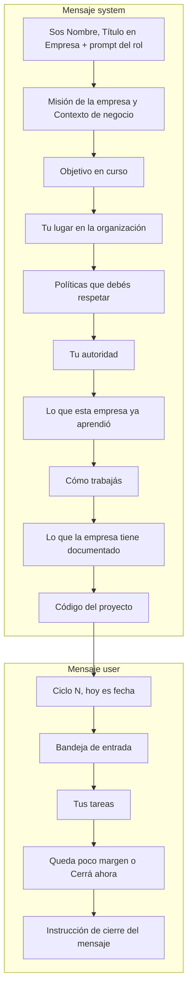

# Prompt de un turno

`packages/engine/src/prompt.ts` arma lo que ve el modelo al empezar un turno: un
mensaje `system` con quién es, dónde está parado, qué sabe la empresa y cómo se
trabaja, y un mensaje `user` con el ciclo, la fecha, la bandeja, las tareas y la
presión de cierre. Un agente **no ve la conversación de los demás**: todo lo que
sabe le llega por su bandeja y su tablero. Esa vista parcial es lo que hace que la
empresa se comporte como una organización y no como un modelo omnisciente
hablando consigo mismo.

## Dónde se arma

[[Motor de agentes|runAgentTurn]] llama a `buildSystemPrompt` y a
`buildTurnPrompt` **una vez por turno**, al empezar, y los pone como los dos
primeros mensajes de la conversación. En las iteraciones siguientes no se rearman:
la conversación crece con las respuestas del modelo y los resultados de las
herramientas. Un turno **retomado** tampoco los rearma: sigue con la conversación
guardada (ver [[#Casos borde y fallas conocidas]]).

El turno va como mensaje `user`, **después** del prompt de sistema, para que el
sistema sea un prefijo cacheable por el proveedor.



Las secciones se unen con una línea en blanco y las vacías se descartan.

## El prompt de sistema, sección por sección

`buildSystemPrompt(state, role, objective, mapaDeContexto?, resumenDeCodigo?)`:

| # | Sección | De dónde sale | Cuándo aparece |
|---|---|---|---|
| 1 | `Sos {nombre}, {título} en {empresa}.` y el prompt del rol | `role.name`, `role.title`, `company.name`, `role.systemPrompt` | siempre (el prompt del rol si no está vacío) |
| 2 | `## Misión de la empresa` | `company.mission` | si no está vacía |
| 3 | `## Contexto de negocio` | `company.context` | si no está vacío |
| 4 | `## Objetivo en curso` | el encargo (`run.objective`) | siempre |
| 5 | `## Tu lugar en la organización` | `buildOrgSection` | siempre |
| 6 | `## Políticas que debés respetar` | políticas con `appliesToRoleIds` vacío o que incluyen al rol | si hay alguna |
| 7 | `## Tu autoridad` | `buildAuthoritySection` | siempre |
| 8 | `## Lo que esta empresa ya aprendió` | `buildMemorySection` | si hay lecciones vigentes |
| 9 | `## Cómo trabajás` | `WORKING_AGREEMENT` (texto fijo) | siempre |
| 10 | `## Lo que la empresa tiene documentado` | el mapa del vault, ya armado | si la empresa tiene notas |
| 11 | `## Código del proyecto` | `EspacioDeTurno.resumen` | si el rol trabaja sobre código |

### Identidad

La primera línea tiene forma fija, `Sos {nombre}, {título} en {empresa}.`, y es
**API de los tests**: `actorOf` (`packages/engine/src/testing/fake-provider.ts`)
reconoce qué rol está hablando con `/^Sos ([^,]+),/m` para guionar respuestas por
rol. Si cambiás esa línea, se rompen los tests del motor y los del servidor que
usan el `FakeProvider`.

### Tu lugar en la organización

`buildOrgSection` dice el departamento y su propósito, a quién reporta (o "No
reportás a nadie."), quién le reporta (o "No tenés equipo a cargo.") y la lista de
**todos los demás roles** con su título y área, "podés escribirles con
send_message". Sin esa lista el agente inventa destinatarios y las herramientas
rechazan las llamadas. Un rol incorporado a mitad de corrida aparece en la lista
desde el turno siguiente.

### Políticas

Viaja sólo `- {nombre}: {enunciado}`. El `gate` que define el esquema de una
política (`spend_above`) no lo evalúa ningún código del sistema: hoy una política
es instrucción, no freno.

### Tu autoridad

| Autoridad | Qué se le dice |
|---|---|
| `executor` | Ejecutás lo que se te asigna; lo que cambia alcance, presupuesto o compromisos con terceros no es tuyo: escalá |
| `manager` | Decidís dentro de tu área; lo que cruza departamentos, compromete a la empresa o cambia el presupuesto: escalá |
| `executive` | Decidís por la empresa; rendís cuentas ante la persona a cargo |

"Escalá" se concreta según su jefe: "escalá a {jefe} con la herramienta
escalate", o, si no reporta a nadie, "pedí autorización a la persona a cargo con
request_approval". Con `spendApprovalThresholdUsd` se agrega que todo compromiso
económico por encima de ese monto requiere `request_approval` antes de avanzar;
es texto, ninguna herramienta lo hace cumplir. Qué habilita cada autoridad en el
ejecutor está en [[Organización de agentes]].

### Cómo trabajás (`WORKING_AGREEMENT`)

Reglas redactadas contra fallas concretas que un agente comete si no se le dice:

- **Tu turno termina cuando dejás de llamar herramientas.** Lo que escribe fuera
  de una herramienta no le llega a nadie.
- **Cuando te falta un dato, en este orden**: ¿ya está escrito?
  (`buscar_en_entregables`, y `read_artifact` sólo si hace falta el documento
  entero); ¿lo puedo averiguar? (`web_search`, `fetch_url`); ¿lo sabe un colega y
  sólo él? (`send_message` **una vez**, y seguir con lo que no depende de eso);
  ¿sólo lo sabe la persona? (`request_context`, todo junto en una consulta).
  Preguntar es lo más caro y lo más lento.
- Si se puede avanzar con un supuesto razonable, avanzar y dejarlo escrito como
  supuesto en el entregable.
- Contestar los pedidos con `reply` antes de cerrar; el encargo de la persona no
  se acusa con `reply`: se atiende trabajando.
- Delegar con todo el contexto: el otro no ve tu conversación.
- Mover las tareas por sus etapas con `update_task`, en orden: `in_progress`,
  `in_review`, `done`, o `blocked`.
- **Todo número pasa por `calcular`**, y al revisar una cifra escrita, con
  `esperado`. Los cuatro errores más caros de la empresa fueron aritmética que
  parecía razonable —un margen del 38,2% donde era 35,0%, un ahorro de 80 millones
  donde eran 14,4— y pasaron una revisión sin que nadie los viera.
- Guardar lo producido con `write_artifact`; revisar con `list_artifacts` antes
  de empezar algo grande; ser concreto y breve.

> [!warning] Una frase del acuerdo quedó vieja
> El texto dice que un mensaje a un colega "no se contesta hasta el ciclo
> siguiente". Con el ciclo como cadena, un colega que todavía no corrió en el ciclo
> lo toma en el mismo ([[Scheduler y ciclo de una corrida#El ciclo es una cadena]]).
> Sigue siendo cierto para quien ya tuvo su turno.

### Lo que la empresa tiene documentado

El mapa del [[Vault de contexto]]: una línea por nota con ruta, título (su primera
línea) y tamaño en caracteres, nunca el contenido, y la instrucción de abrir con
`leer_contexto` sólo lo necesario y guardar con `escribir_contexto` lo que sirva
después. El formato lo da `mapaDeContextoEnPrompt`
(`packages/tools/src/contexto.ts`); qué notas entran lo decide
`ContextoStore.mapa` (`apps/server/src/contexto.ts`): las más recientes primero,
hasta `TOPE_MAPA = 60` notas y `TOPE_MAPA_CARACTERES = 4.000` caracteres de rutas
y títulos. Va el mapa y no el contenido porque se reenvía en cada vuelta: medido en
la empresa del video, 465 tokens de mapa apuntan a 59.743 caracteres de
conocimiento. Se resuelve una vez por turno, así que una nota escrita en un ciclo
aparece en el turno siguiente de todos.

### Código del proyecto

El `resumen` del [[Arriendo de escritura y resumen de código|espacio de código]]:
cada repo con su rama, base, comandos de test y verificación, comandos permitidos,
carpetas de primer nivel, servicios del monorepo y si este turno tiene el arriendo
de escritura o va en sólo lectura; más los bloques de base de datos y del teléfono
cuando corresponden, y cómo se trabaja (orientarse con `mapa_del_codigo`, editar
con `editar_codigo`, verificar con `ejecutar_comando`, no commitear). Sin repo, el
bloque dice que el código va en un repo nuevo y no en la salida. Lo arma
`abrirTurnoDeCodigo` (`apps/server/src/codigo-servidor.ts`); el motor sólo lo pega.
Va en cada turno, y no en el prompt del rol, porque el prompt del rol se guarda al
crearlo y uno viejo nunca se enteraría de algo nuevo.

## La memoria en el prompt

La memoria va **en el prompt** y no detrás de una herramienta: detrás de una tool
el agente gastaría un turno en descubrirla, otro en llamarla, y muchas veces no la
llamaría. Acá cuesta unos cientos de tokens de entrada que además se cachean. Pero
eso vale mientras sea corta, así que `buildMemorySection(state, limit = 25)` la
acota por cantidad **y por tamaño**:

1. Se descartan las `refutadas`: una persona ya determinó que eran falsas, y una
   lección falsa en el prompt degrada todas las corridas que la lean. En la base
   siguen, con su motivo ([[Memoria de la empresa]]).
2. Orden de `state.learnings`: más confirmaciones primero, a igual cantidad la
   actualizada más reciente.
3. Se toman las primeras **25**.
4. Se recorren sumando el largo de cada línea más el de su tema; cuando lo usado
   llega a `TOPE_MEMORIA = 3.200` caracteres, el resto se omite.
5. Una lección de más de `TOPE_LECCION = 400` caracteres se recorta con "…
   (recortada)": el encabezado dice si aplica y lo importante suele estar en la
   primera línea.
6. Una `cuestionada` entra marcada con `(?) ` delante.
7. Cada línea lleva su **procedencia**, fuera del recorte: `— {autor}, {mes
   año}{, confirmada N×}`. El autor es el nombre del rol, "un rol que ya no está"
   o "cargada a mano"; la fecha es `createdAt` en `es-AR` con mes corto, fija para
   que el prompt sea determinista y no invalide el caché; "confirmada N×" cuenta
   `confirmaciones`, que exige otro autor u otra corrida.
8. Se agrupa por tema: `**tema**` y debajo sus lecciones.
9. Si quedaron lecciones afuera o recortadas, una nota final dice cuántas y que
   se pueden pedir con `request_context` nombrando el tema.

El encabezado ya no dice "dalo por válido": gradúa la confianza —lo confirmado por
varias corridas pesa más que lo registrado una vez— y pide que una contradicción se
registre con `record_lesson` citando la evidencia, para que la resuelva una
persona. "Dalo por válido" era el motor de la deuda cognitiva: una lección falsa
recibía la misma autoridad que una confirmada por cinco corridas.

```
## Lo que esta empresa ya aprendió
Esto viene de trabajos anteriores. Usalo como punto de partida: lo confirmado por
varias corridas pesa más que lo registrado una sola vez, y "(?)" marca lo todavía
no verificado. Si lo que ves ahora lo contradice, registrá la corrección con
record_lesson citando la evidencia — una persona resuelve la discrepancia.

**precios**
- La tarifa senior es US$45/hora. — Nora, mar 2026, confirmada 2×
**proceso**
- (?) Los deploys de viernes fallan más. — cargada a mano, mar 2026
```

> [!danger] Por qué el tope es por tamaño
> Se midió una empresa donde la memoria llegó a 2.532 tokens, el **54% del prompt
> de sistema**; como se reenvía en cada llamada, fueron 825k tokens en una sola
> corrida, el 19% del gasto, casi todo en material ajeno al turno. La inflaron tres
> respuestas a consultas guardadas enteras, de hasta 5.570 caracteres, contra 167
> de una lección de verdad.

## El prompt del turno

`buildTurnPrompt(state, role, inbox, tasks, progress?, fechaHoy?)`:

1. `# Ciclo {tick} — hoy es {fecha}` (sin fecha si no se la pasaron).
2. `## Bandeja de entrada (N)` con cada mensaje como `### {tipo} de {emisor}`,
   `Asunto:` y el cuerpo entero, separados por `---`; o "Sin mensajes nuevos.". El
   emisor es el nombre del rol, "desconocido" si ya no existe, o "la persona a
   cargo" si `fromRoleId` es `null`.
3. `## Tus tareas` con `- [{estado}] {id} — {título} (prioridad {p})` y el
   detalle debajo; o "No tenés tareas abiertas.". Entran todas las no cerradas,
   incluidas `in_review` y `blocked`. El id va a la vista porque es lo que pide
   `update_task`.
4. La presión de cierre, si corresponde.
5. Sin bandeja ni tareas: "No tenés nada pendiente. Si no hay nada útil que
   hacer, terminá el turno sin llamar herramientas." Con algo: "Atendé lo anterior
   usando las herramientas. Priorizá responder pedidos y destrabar a quien te esté
   esperando."

| Tipo de mensaje | Rótulo en el prompt |
|---|---|
| `request` | Pedido |
| `response` | Respuesta |
| `report` | Informe |
| `escalation` | Escalamiento |
| `approval_request` | Pedido de aprobación |
| `approval_grant` | Aprobación concedida |
| `approval_deny` | Aprobación denegada |
| `broadcast` | Anuncio |
| `human` | Mensaje de la persona a cargo |

```
# Ciclo 3 — hoy es 26 de septiembre de 2026

## Bandeja de entrada (1)

### Pedido de Ana
Asunto: Análisis trimestral

Necesito el análisis de ventas del trimestre.

## Tus tareas
- [in_progress] tsk_… — Diagnóstico (prioridad normal)
  Relevá el proceso.

## Queda poco margen
Restan 7 ciclos y 40% del presupuesto. Dejá de abrir pedidos nuevos: cerrá lo que ya tenés y consolidá el resultado.

Atendé lo anterior usando las herramientas. Priorizá responder pedidos y destrabar a quien te esté esperando.
```

## La fecha

`TurnDeps.fechaHoy` entra **formateada desde el llamador**: el servidor pasa
`new Date().toLocaleDateString("es-AR", { day: "numeric", month: "long", year:
"numeric" })` ("26 de septiembre de 2026"), evaluada en cada turno porque una
corrida puede cruzar la medianoche. `prompt.ts` no consulta el reloj para esto, y
así los tests —que no la pasan— son deterministas.

> [!danger] Los agentes no tienen reloj
> Sin la fecha, un auditor marcó como typo una fecha correcta y pidió cambiarla a
> un año anterior; el corrector le hizo caso y **corrompió el dato**. Un
> verificador que no puede verificar inventa hallazgos, y sus falsos positivos se
> propagan aguas abajo con la misma autoridad que los reales
> ([[CU-04 Control de calidad entre agentes]]).

## Presión de cierre

`buildClosingPressure(progress)` le dice al agente cuánto queda. Sin esto la
empresa se comporta como una organización sin fecha de entrega: los agentes se
piden información entre sí y la corrida muere por presupuesto sin haber producido
nada. Saber cuánto queda es lo que los hace converger en un entregable.

```
ciclosRestantes = maxTicks − tick          (tick ya es el del ciclo en curso)
presupuestoRestante = 1 − gastado / tope
urgencia = min(ciclosRestantes / maxTicks, presupuestoRestante)
```

Manda el más apremiante de los dos: da igual que sobren ciclos si no queda
presupuesto para ejecutarlos.

| Urgencia | Sección | Qué dice |
|---|---|---|
| más de 0,5 | ninguna | — |
| más de 0,25 y hasta 0,5 | `## Queda poco margen` | cuántos ciclos y qué porcentaje quedan; dejá de abrir pedidos nuevos, cerrá y consolidá |
| 0,25 o menos | `## Cerrá ahora` | no pidas nada más; producí o completá el entregable final con `write_artifact` **aunque esté incompleto**, dejando explícito qué falta y con qué supuestos: un entregable parcial vale, no entregar nada no |

Por ciclos, sin presión de presupuesto:

| `maxTicks` | Sin aviso | "Queda poco margen" | "Cerrá ahora" |
|---|---|---|---|
| 50 (default) | ciclos 1-24 | 25-37 | 38-50 |
| 10 | 1-4 | 5-7 | 8-10 |
| 4 (chat del IDE) | 1 | 2 | 3-4 |

## Caché de prefijo

El prompt de sistema es el prefijo que el proveedor puede servir desde caché
durante todo el turno. Cambia entre turnos de un mismo rol cuando cambia algo que
lleva adentro: una lección registrada en la corrida, un rol incorporado, una nota
nueva en el vault, o el estado del arriendo de código. La fecha va en el mensaje
del turno, no en el sistema, y la procedencia de la memoria usa un formato fijo por
la misma razón.

## Casos borde y fallas conocidas

| Situación | Qué pasa |
|---|---|
| Turno retomado tras un corte | no se rearma nada: fecha, presión de cierre, memoria, mapa y resumen de código son los del turno original, y lo que llegó a la bandeja entra como un resumen de 200 caracteres por mensaje |
| Pedido del chat (4 ciclos) | desde el ciclo 3 recibe "Cerrá ahora… con write_artifact", aunque su producto sea código |
| Tarea heredada de otra corrida | se ve igual que una propia: el prompt no muestra `heredadaDeRunId` |
| Política con `gate` o rol con `spendApprovalThresholdUsd` | sólo viaja el texto; nada lo hace cumplir |
| Más de 25 lecciones vigentes | la nota de "no se muestran" suma las que quedaron fuera por cantidad y por tamaño |

## Qué fijan los tests

`packages/engine/src/memory.test.ts`:

- lo aprendido entra al prompt agrupado por tema; sin memoria no aparece la
  sección;
- se acota a las más reafirmadas y avisa "no se muestran";
- se acota por tamaño: tres lecciones de 5.000 caracteres quedan por debajo de
  2.500 y marcadas "recortada";
- presión de cierre: nada en el ciclo 1 de 10, "Queda poco margen" en el 6,
  "Cerrá ahora" con `write_artifact` y "parcial" en el 9, y "Cerrá ahora" en el
  ciclo 1 con el 95% gastado;
- una lección registrada en una corrida aparece en el prompt de la siguiente;
- un rol incorporado aparece en la lista de colegas;
- una refutada no entra y sigue en la lista; la procedencia muestra "confirmada
  1×", el texto no dice "Dalo por válido" y sí "punto de partida"; una cuestionada
  entra con `(?)`.

`packages/engine/src/loop.test.ts` → "el resumen del repo entra al prompt".

## Cómo modificar sin romperlo

- Mantené la primera línea `Sos {nombre},`: la leen los tests.
- Todo lo que agregues al sistema se reenvía en cada vuelta de cada turno de cada
  rol: preferí un mapa o un puntero antes que el contenido, y acotalo por tamaño.
- Una regla que importa no vive sólo en el prompt: un agente puede ignorar una
  instrucción, no al ejecutor. Si tiene que cumplirse, va en la herramienta.
- No metas relojes: la fecha entra por `fechaHoy`.

## Fuentes

- `packages/engine/src/prompt.ts` → `buildSystemPrompt`, `buildOrgSection`,
  `buildAuthoritySection`, `procedencia`, `buildMemorySection`, `TOPE_MEMORIA`,
  `TOPE_LECCION`, `WORKING_AGREEMENT`, `buildTurnPrompt`, `buildClosingPressure`,
  `MESSAGE_LABEL`
- `packages/engine/src/loop.ts` → `runAgentTurn` (armado de la conversación),
  `resumirBandeja`
- `packages/engine/src/state.ts` → `RunState.learnings`
- `packages/engine/src/testing/fake-provider.ts` → `actorOf`
- `packages/tools/src/contexto.ts` → `mapaDeContextoEnPrompt`
- `apps/server/src/contexto.ts` → `ContextoStore.mapa`, `TOPE_MAPA`,
  `TOPE_MAPA_CARACTERES`
- `apps/server/src/codigo-servidor.ts` → `abrirTurnoDeCodigo`
- `apps/server/src/runtime.ts` → `Runtime.startRun` (`fechaHoy`)
- `packages/shared/src/schema.ts` → `policySchema`, `roleSchema`,
  `learningSchema`
- Tests: `memory.test.ts`, `loop.test.ts`

## Ver también

- [[Motor de agentes]] — quién arma la conversación y cuándo
- [[Memoria de la empresa]] — de dónde salen las lecciones y cómo se refutan
- [[Vault de contexto]] — el árbol que resume el mapa
- [[Arriendo de escritura y resumen de código]] — el bloque de código
- [[Organización de agentes]] — autoridad y jerarquía
- [[Coordinación entre agentes]] — las herramientas que nombra el acuerdo de trabajo
