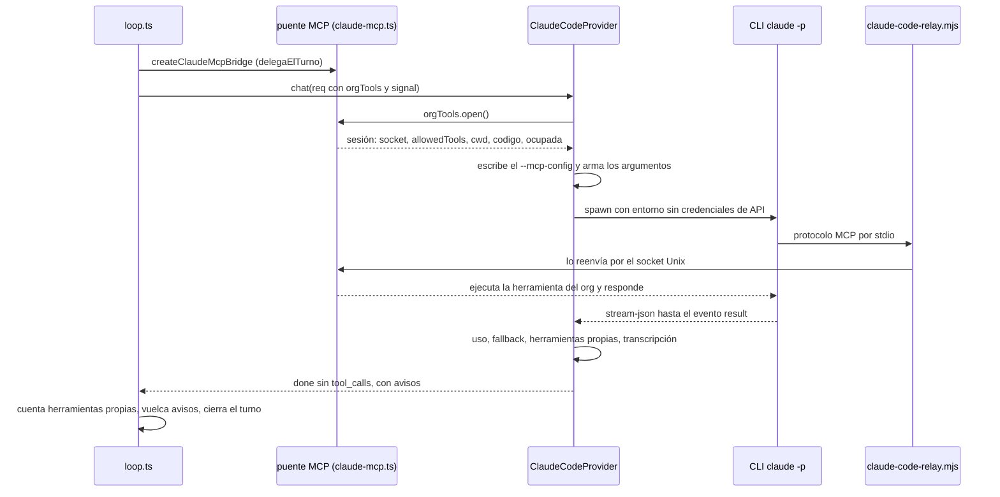
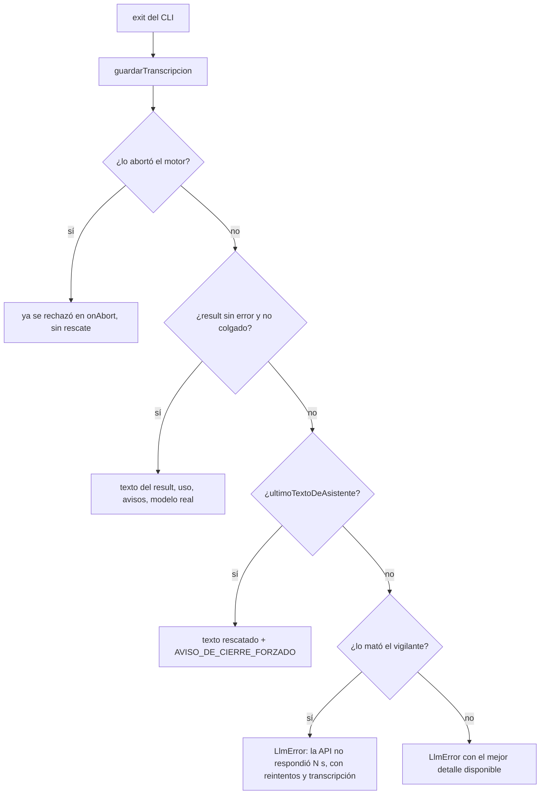

# Proveedor claude-code

`ClaudeCodeProvider` (`packages/llm/src/adapters/claude-code.ts`) no llama a
ninguna API: **delega cada turno entero al CLI oficial de Claude Code** (`claude
-p`), que corre su propio agent loop con el login de esta máquina. Es la única
vía de usar una suscripción de claude.ai (Pro/Max) desde el orquestador: la API
factura por uso contra la organización, y no hay ruta que la facture a la
suscripción.

El adaptador **no devuelve `tool_calls`**: el motor ve una sola iteración con
texto, cero llamadas, y cierra el turno. Las herramientas de la organización le
llegan al CLI por un servidor MCP que vive dentro del motor
(`delegaElTurno = true`); el detalle del puente está en
[[Turnos delegados a un CLI]].

## Cómo se prende

1. Instalar el CLI `claude` y loguearlo con la suscripción (`claude auth login`).
2. En `.env`: `ORQ_CLAUDE_CODE=1`. Opcionales: `CLAUDE_CODE_MODEL` y
   `CLAUDE_CODE_WORKDIR`.
3. Reiniciar el servidor. No hay clave en `.env`: la credencial es el login de
   la máquina.

`buildRegistry` lo registra con `model` y `workspaceDir` si vienen; `command`,
`allowedTools` y `silencioMaxMs` quedan en sus defaults (`claude`, la lista
libre y `SILENCIO_MAX_MS`).

## Cómo corre un turno



`claude-code-relay.mjs` es un proceso Node mínimo: se conecta al socket de
`ORQ_SOCKET` y copia stdin → socket y socket → stdout. El `--mcp-config` se
escribe como archivo JSON en el temporal del sistema (`orq-mcp-<hora>-<azar>.json`)
porque el CLI no acepta la config en línea; declara un servidor `stdio` cuyo
comando es el Node del servidor (`process.execPath`) con el relay como argumento.
Esos archivos no se borran después del turno.

### El prompt

`render()` aplana la conversación: los `system` tal cual, cada `user` bajo
`## Instrucción de la persona` y cada `assistant` con texto bajo `## Tu respuesta
anterior`. Los mensajes `tool` se descartan (en un turno delegado no hay). Con
puente, se agrega un **cierre** según el modo (ver abajo) y la línea "Terminá el
turno con un resumen en texto, para la organización."

## Modos de trabajo

El directorio y los permisos dependen de lo que prestó el motor
(`packages/engine/src/claude-mcp.ts` arma `cwd`: el worktree si hay código, si no
el directorio de salida de la empresa):

| Modo | Cuándo | `cwd` del CLI | Herramientas propias | Negadas explícito |
|---|---|---|---|---|
| `libre` | sin sesión del org (health check, `check:llm`) | una carpeta nueva `turno-<hora>-<azar>` dentro de `CLAUDE_CODE_WORKDIR` | `Bash,Read,Write,Edit,Glob,Grep,NotebookEdit,WebSearch,WebFetch` | — |
| `salida-lectura` | turno normal: el servidor presta `dirDeTrabajo` | el directorio de salida de la empresa | `Read,Glob,Grep,WebSearch,WebFetch` (`ALLOWED_TOOLS_LECTURA`) | — |
| `codigo-lectura` | turno sobre un repo **sin** el arriendo | el worktree de la sesión | `Read,Glob,Grep,WebFetch` | `NEGADAS_EN_CODIGO` |
| `codigo-escritura` | turno sobre un repo **con** el arriendo | el worktree de la sesión | lo anterior + `Edit,MultiEdit,Write,NotebookEdit` | `NEGADAS_EN_CODIGO` |

`NEGADAS_EN_CODIGO` = `Bash`, `Edit(.git/**)`, `Write(.git/**)`,
`MultiEdit(.git/**)`, `Edit(.git)`, `Write(.git)`. A las herramientas propias se
suman siempre las del org que eligió el tool router, con su nombre MCP
(`mcp__orq__<herramienta>`).

Por qué cada regla:

- **La salida de la empresa se presta en sólo lectura.** Un agente que produce
  algo visual tiene que poder verlo (la previsualización de su lámina, el PDF que
  subió una persona), pero producir sigue yendo por `write_output_file`, que es
  lo único que sanea la ruta segmento por segmento, anota la procedencia en
  `.orq-generado.json` y aplica la jerarquía de borrado. Un `Write` del CLI
  saltearía las tres, sin rastro en la traza. Ver
  [[Archivos de salida y permisos de borrado]].
- **Nadie recibe `Bash`, tampoco sobre código.** Los comandos van por
  `ejecutar_comando`, que es lo único con sandbox, entorno sin credenciales,
  frenos y rastro ([[Comandos y sandbox]]). La negación explícita sobrevive a
  que alguien agregue `Bash` a la allowlist por error.
- **`.git` no se edita nunca**: un hook escrito ahí es código que corre en el
  próximo checkpoint, fuera del sandbox. Según `CLAUDE.md`, las negaciones se
  verificaron contra el CLI 2.1.282.
- **Sólo el turno con el arriendo edita**: dos agentes sobre el mismo árbol se
  pisan ([[Arriendo de escritura y resumen de código]]).

El cierre del prompt le dice a cada modo lo que puede hacer, para que no gaste
el turno peleando con un permiso negado: en `salida-lectura`, "abrí con tus
propias herramientas lo que necesites mirar… para producir usá las herramientas
de la organización"; en `codigo-escritura`, "editá con Edit/Write… No tenés
Bash… No declares terminado nada sin haber corrido la verificación"; en
`codigo-lectura`, que otro rol tiene el arriendo y edita en el ciclo siguiente;
en `libre`, que deje los archivos en el directorio actual.

## Los argumentos del CLI

`construirArgs` está exportada **porque es una regla de seguridad y no una
preferencia**: una regla que sólo vive adentro de un `spawn` no se puede
verificar, y ésta tiene su test.

```text
claude -p <prompt>
  --output-format stream-json --verbose
  --model <alias o slug>
  --allowedTools <propias>,<mcp__orq__…>
  [--disallowedTools <negadas>]          # sólo en modo código
  [--fallback-model <respaldo>]          # si difiere del pedido
  --include-partial-messages             # el latido del vigilante
  [--strict-mcp-config --mcp-config <archivo>]   # sólo con sesión del org
```

- Se corre con una **allowlist** y nunca con `--dangerously-skip-permissions`.
- `--strict-mcp-config` hace que el CLI use **sólo** el servidor del org e
  ignore los MCP que la persona tenga configurados en su Claude Code.
- `--verbose` es el que habilita `stream-json` en modo `-p`.

## El entorno del CLI

`entornoDelCli(base)` copia el entorno del servidor y ajusta cinco cosas:

| Variable | Valor | Por qué |
|---|---|---|
| `ANTHROPIC_API_KEY` | **se borra** | `claude -p` le da prioridad si la encuentra, y el servidor la tiene cuando la empresa usa además `anthropic`: el turno pasaba a facturarse por API sin que nada lo dijera (el costo lo reportamos en 0) |
| `ANTHROPIC_AUTH_TOKEN` | **se borra** | lo mismo con el token de `claude-sesion` |
| `CLAUDE_CODE_DISABLE_NONESSENTIAL_TRAFFIC` | `1` (forzado) | nada de tráfico accesorio |
| `CLAUDE_CODE_MAX_RETRIES` | `4` si no está definida | los 10 reintentos del CLI con esperas crecientes son tres minutos perdidos por turno con el modelo saturado; con el fallback y el ciclo siguiente, cuatro alcanzan |
| `ENABLE_TOOL_SEARCH` | `false` si no está definida | con las herramientas del org diferidas, el CLI hacía un `ToolSearch` por esquema: medido, 58 en una corrida, cada uno una vuelta entera del loop reenviando el contexto. Son decenas y el caché de prompt las absorbe |

## Catálogo y tiers

`claudeCodeCatalog(providerId, preferido)` es sintético: `CLAUDE_CODE_MODEL`
primero y después los alias `haiku`, `sonnet`, `opus`, sin repetidos. Cada uno
es `claude-code/<alias>` con nombre "Claude Code — Sonnet (Max)", 200.000 de
contexto, `supportsTools: false` y sin precios. `listModels` no llama al CLI.

Los tiers salen del mapa curado (`TIERS_ESTATICOS["claude-code"]`): `cheap` →
`claude-code/haiku`, `standard` → `claude-code/sonnet`, `smart` →
`claude-code/opus`. **No hay `free`.** Al llamar, `aliasOfSlug` se queda con lo
que sigue a la última `/` (`claude-code/opus` → `opus`); un slug completo como
`claude-code/claude-opus-5` también pasa, porque el CLI acepta nombres de modelo.

`CLAUDE_CODE_MODEL` sólo decide el orden del catálogo y el modelo del health
check: el de cada turno lo decide el rol.

## Cortes por tiempo y el vigilante de silencio

| Constante | Valor | Variable | Por qué |
|---|---|---|---|
| `CORTE_MS` (`timeoutMs`) | 600.000 (10 min) | — | se espera un agente **entero**, no una API. Con los 120 s del motor, cada turno moría justo mientras trabajaba |
| `CORTE_CODIGO_MS` (`timeoutCodigoMs`) | 1.500.000 (25 min) | `CLAUDE_CODE_CODIGO_TIMEOUT_MS` | leer, editar y correr la verificación entera no entra en diez minutos |
| `SILENCIO_MAX_MS` | 180.000 (3 min) | `CLAUDE_CODE_SILENCIO_MS` | ver abajo |
| intervalo del vigilante | `min(5.000, max(50, silencio / 4))` ms | — | |
| remate tras `SIGTERM` | 5.000 ms, después `SIGKILL` | — | un CLI trabado no atiende `SIGTERM` y queda huérfano gastando la suscripción |
| `TRANSCRIPCIONES_GUARDADAS` | 300 | — | |

**El vigilante de silencio.** Con `--include-partial-messages` el CLI emite un
evento por trozo de texto, así que el silencio no es "está pensando": es que la
API no contesta. Medido: turnos con huecos de **quince minutos exactos** sin una
sola llamada, tres en la misma corrida —45 de sus 65 minutos—. Pasado el umbral
se mata el proceso. **Mientras corre una herramienta del org no cuenta**:
`OrgToolsSession.ocupada()` (que lleva el puente) reinicia el reloj, porque un
`npm test` de cinco minutos no es un cuelgue. Los eventos parciales se usan de
latido y **no se guardan** (líneas `{"type":"stream_event"…`): acumularlos
multiplicaba por diez la memoria de un turno largo.

> [!danger] Abortar tiene que cerrar la promesa
> `onAbort` mata el proceso **y rechaza** con `LlmError`. Hubo una versión que
> sólo mataba el proceso y dejaba que el `exit` saliera por `if (aborted)
> return`: la promesa no se resolvía nunca, el turno quedaba esperando sin
> proceso vivo y sin `agent.turn_end`, y la corrida entera se colgaba en un
> ciclo. Es la falla "un proveedor que no contesta cuelga la corrida",
> reintroducida por la puerta de atrás. Hay un test que la fija.

Un corte por tiempo de este proveedor **no se reintenta** en el mismo ciclo: el
`LlmError` sale con `retryable: false` y su texto no dice `abort` ni `timed out`,
que es lo que el motor reconoce como corte propio. Tampoco hay rescate en ese
caso (lo rescatable se evalúa sólo cuando el CLI termina por su cuenta); la
transcripción sí se guarda.

## Modelo de respaldo y avisos del turno

`RESPALDO` = `{ opus: "sonnet", sonnet: "opus", haiku: "sonnet" }` y se pasa
como `--fallback-model` cuando difiere del pedido. Opus bajo demanda alta
devolvía error diez veces seguidas, con esperas de hasta 38 s, y el turno moría a
los tres minutos sin hacer nada; que responda Sonnet es mejor que perder el
turno. Un slug que no es alias no tiene respaldo.

`diagnosticoDelTurno(stdout, modeloPedido)` lee el stream y devuelve:

- **`reintentos`**: cuántos eventos `system` con `subtype: "api_retry"` hubo.
- **`modeloReal`**: la familia (`opus`/`sonnet`/`haiku`) de las claves de
  `modelUsage` del evento `result`, si no incluye la pedida.
- **`avisos`**, en castellano:
  - "`opus` estaba saturado: este turno lo respondió `sonnet` (fallback
    automático)", o que se saturó a mitad del turno si respondieron dos familias;
  - "La API reintentó N veces…" desde 3 reintentos;
  - de un `rate_limit_event`, la ventana más usada (`five_hour` → "de 5 horas",
    `seven_day` → "semanal"): aviso si va por el 80% o más, o si su estado no es
    `allowed` ("llegó al límite"), con la hora en que se renueva.

Los avisos viajan en `ChatResult.avisos` y el motor los vuelca a la traza como
`log` de nivel `warn`. El `modelSlug` del `done` es el que respondió de verdad
(`claude-code/<modeloReal>`), así el ledger y `cost.updated` no le atribuyen a
Opus lo que hizo Sonnet.

## Qué pasa cuando el CLI termina



**El rescate.** Un CLI que cierra mal no significa que el agente no haya
trabajado. Medido: un verificador hizo 27 llamadas, escribió su entregable y
movió su tarea; falló su última llamada, el CLI cortó a las 33 vueltas y el
turno se registró como fallido y **sin resumen**. Peor: ese fallo alimentaba
`fallosConsecutivos` y el turno siguiente escalaba a un modelo más caro por un
fracaso que no ocurrió ([[Escalado por dificultad]]). `ultimoTextoDeAsistente`
busca el último mensaje `assistant` con texto, **saltando los `<synthetic>`**
(los fabrica el propio CLI al cortar), y se le pega
`AVISO_DE_CIERRE_FORZADO`: "⚠️ EL CLI CERRÓ ESTE TURNO ANTES DE TIEMPO…". El
aviso va en el texto porque es lo único que la organización lee: un resumen a
medias sin aviso se lee como trabajo terminado.

**El detalle del error**, en este orden: si hubo reintentos y no hay resultado,
"la API de Anthropic no respondió después de N reintento(s) (`<modelo>` saturado
o sin conexión)"; si no, el `error` del `result`; si no, el `stderr`; si no,
"CLI salió con código N" más `ultimoAliento` (las últimas 3 líneas del stream,
300 caracteres cada una). Antes una corrida entera se caía con "CLI salió con
código 1" sin forma de saber por qué. Si el binario no existe: "No se pudo
ejecutar el CLI de Claude Code (claude)… Instalalo con tu suscripción de
claude.ai."

## Uso y costo

`lastResult` lee el último evento `result`:

| Campo | Cómo se calcula |
|---|---|
| `inputTokens` | `input_tokens + cache_read_input_tokens + cache_creation_input_tokens` |
| `cachedInputTokens` | `cache_read_input_tokens + cache_creation_input_tokens` |
| `outputTokens` | `output_tokens` |
| `total_cost_usd` | se lee y **no se reporta** |

La entrada incluye lo cacheado porque es contexto que se envió, aunque se pague
distinto: sin sumarlo, un turno de 375k tokens se informaba como 12. Y el
adaptador informaba ceros fijos, así que una corrida entera por la suscripción
mostraba cero tokens mientras se comía la ventana de uso.

El costo en dólares no se informa a propósito: `total_cost_usd` es lo que habría
salido por API, y acá se paga con la suscripción. Informarlo dispararía
`budgetUsd` y cortaría corridas que no cuestan dinero. Como el catálogo no tiene
precios, `computeCost` da 0. Lo finito acá son los tokens y la ventana de la
suscripción: se ven en la cabecera de [[Pantalla Proceso en vivo]] y en los
avisos de ventana. Ver [[Costos y presupuesto]].

## Herramientas propias del CLI

`herramientasPropiasDelCli(stdout)` junta cada `tool_use` de los mensajes
`assistant` que **no** empieza con `mcp__` (las del org ya pasan por el puente y
se cuentan ahí), con su ruta si la trae (`file_path`, `notebook_path` o `path`).
El motor (`runAgentTurn`) las suma a las herramientas del turno, registra una
actividad `cli:<nombre>` para `check_activity` y emite un `tool.start` y un
`tool.end` por uso (`toolName: "cli:Edit"`, `origin: "capability"`,
`durationMs: 0`). Sin esto, un programador que sólo usa `Edit` contaba cero
herramientas, el scheduler lo tomaba por un rol que habla sin hacer nada y a los
dos turnos lo dejaba de convocar; y el chat del IDE no podía mostrar qué editó.
Llegan todas juntas al final del turno, porque el CLI devuelve todo junto.

## Transcripciones

Cada turno deja lo que emitió el CLI —sin los eventos parciales— en
`<CLAUDE_CODE_WORKDIR>/transcripciones/<fecha ISO>-<modelo>.jsonl`, y se
conservan las últimas 300. Antes, cuando un turno se colgaba quince minutos no
quedaba nada que mirar. Guardar nunca tira: sin disco para diagnóstico no se
frena un turno. La ruta de la transcripción va en los avisos y en los errores.

> [!warning] `CLAUDE_CODE_WORKDIR` relativa se resuelve desde el proceso
> A diferencia de `DATABASE_URL` y las demás rutas de `apps/server/src/env.ts`
> (que pasan por `fromRoot`), esta va cruda al adaptador. Con `npm run dev` el
> servidor corre con `cwd` en `apps/server`, así que el `./data/claude-code` del
> `.env.example` termina en **`apps/server/data/claude-code/`** —ahí están las
> transcripciones—, mientras que `npm run check:llm`, que corre desde la raíz,
> usa `data/claude-code/`. Las carpetas `turno-…` del modo libre (una por health
> check) se acumulan ahí y no se limpian.

## El health check

`healthCheck()` delega un turno real ("Respondé únicamente con la palabra: ok")
en modo libre, sin puente y sin corte del motor (sólo el vigilante). Es la única
prueba de que el CLI está instalado, logueado y con suscripción activa. Lo
disparan `GET /api/providers` (cada vez que se abre la pantalla de proveedores) y
`check:models`: consume la suscripción, tarda segundos y crea una carpeta
`turno-…`.

## Variables de entorno

| Variable | Para qué | Default en el código |
|---|---|---|
| `ORQ_CLAUDE_CODE` | interruptor del proveedor | apagado |
| `CLAUDE_CODE_MODEL` | alias o slug del catálogo y del health check | `sonnet` |
| `CLAUDE_CODE_WORKDIR` | carpetas de turnos libres y transcripciones | `<tmpdir>/orq-claude-code` (el `.env.example` propone `./data/claude-code`) |
| `CLAUDE_CODE_CODIGO_TIMEOUT_MS` | corte de un turno de código | 1.500.000 |
| `CLAUDE_CODE_SILENCIO_MS` | silencio tolerado | 180.000 |
| `CLAUDE_CODE_MAX_RETRIES` | reintentos internos del CLI | 4 si no está definida |
| `ENABLE_TOOL_SEARCH` | búsqueda diferida de herramientas del CLI | `false` si no está definida |

`CLAUDE_CODE_CODIGO_TIMEOUT_MS` y `CLAUDE_CODE_SILENCIO_MS` se leen al importar
el módulo. Ver [[Variables de entorno]].

## Límites

- **La credencial es de esta máquina.** No sirve para un servidor multiusuario.
- **La suscripción tiene ventanas de uso** (5 horas y semanal) pensadas para uso
  interactivo: un farm 24/7 se va a throttlear. Los avisos al 80% existen por eso.
- **El presupuesto de la corrida no lo frena**: el único freno es `maxTicks` (y
  el corte por tres ciclos fallidos).
- **Un turno es una caja negra hasta que termina**: el texto llega entero al
  final y las herramientas propias también; lo que sí se ve en vivo son las
  llamadas al org que pasan por el puente.

## Fallas conocidas

| Síntoma | Causa | Qué mirar |
|---|---|---|
| "No se pudo ejecutar el CLI de Claude Code" | binario ausente o fuera del `PATH` | `which claude` |
| El turno se corta a los 3 min con "la API no respondió" | modelo saturado o sin red; lo mató el vigilante | la transcripción, los reintentos |
| La traza dice que respondió Sonnet con el rol en Opus | fallback por saturación | el aviso del turno |
| "La suscripción llegó al límite de su ventana" | ventana de 5 h o semanal agotada | esperar la renovación que dice el aviso |
| Un turno que trabajó aparece fallido y sin resumen | el CLI cerró con error sin texto del agente | la transcripción |
| El agente intenta escribir en la salida y no puede | modo `salida-lectura`: escribir va por las herramientas del org | el cierre del prompt |

## Qué fijan los tests

`packages/llm/src/adapters/claude-code.test.ts`:

- el catálogo expone `claude-code/<alias>`, el preferido primero y sin repetidos,
  sin precios; `listModels` no llama al CLI; el `done` no trae `tool_calls`;
- sobre la salida de la empresa no se otorga `Write`, `Edit`, `Bash` ni
  `NotebookEdit`, sí `Read`, `Glob`, `Grep`; las del org viajan con
  `--strict-mcp-config`; sin sesión no hay `--mcp-config`;
- `timeoutMs` es mayor que los 120 s del motor, y **abortar cierra la promesa**
  (con `/bin/sleep` como CLI y una señal ya abortada);
- el rescate toma el último texto del agente, ignora los `<synthetic>`, no
  inventa nada sin texto y tolera líneas que no son JSON;
- `entornoDelCli` borra `ANTHROPIC_API_KEY` y `ANTHROPIC_AUTH_TOKEN`, conserva
  `PATH`/`HOME` y fuerza `CLAUDE_CODE_DISABLE_NONESSENTIAL_TRAFFIC`;
- en modo código nunca hay `Bash`, sin arriendo no hay nada que escriba, con
  arriendo hay `Edit` y `Write`, y se niega `Bash` y `Edit(.git/**)` explícito;
- `herramientasPropiasDelCli` cuenta `Edit` y `Read` con su ruta y deja afuera
  `mcp__orq__…`;
- pide `--fallback-model` y eventos parciales, y un respaldo igual al pedido no
  se pasa; `CLAUDE_CODE_MAX_RETRIES` es 4 salvo que venga otro valor;
- `diagnosticoDelTurno` detecta el modelo que respondió y los reintentos, y avisa
  la ventana al 86% y al límite pero calla al 35%;
- un CLI falso que se queda callado se corta en menos de 10 s (con
  `silencioMaxMs: 300`) y deja una transcripción;
- `ENABLE_TOOL_SEARCH` es `false` salvo que venga otro valor.

El puente del otro lado (prefijo `mcp__orq__`, memo de lecturas, topes) lo fija
`packages/engine/src/claude-mcp.test.ts`: ver [[Turnos delegados a un CLI]].

## Fuentes

- `packages/llm/src/adapters/claude-code.ts` → `ClaudeCodeProvider`, `delegate`, `construirArgs`, `herramientasPara`, `entornoDelCli`, `claudeCodeCatalog`, `lastResult`, `ultimoTextoDeAsistente`, `herramientasPropiasDelCli`, `diagnosticoDelTurno`, `ultimoAliento`, `guardarTranscripcion`, `mcpConfigPath`, `cierre`, `render`
- `packages/llm/src/adapters/claude-code-relay.mjs`
- `packages/llm/src/modelos-claude.ts` → `TIERS_ESTATICOS["claude-code"]`
- `packages/engine/src/loop.ts` → `runAgentTurn` (puente, avisos, herramientas propias)
- `packages/engine/src/claude-mcp.ts` → `createClaudeMcpBridge`
- `apps/server/src/runtime.ts` → `startRun` (presta `dirDeTrabajo`)

## Ver también

- [[Turnos delegados a un CLI]]
- [[Proveedor opencode]] — la otra suscripción, mismo patrón
- [[Proveedor Anthropic y claude-sesion]]
- [[Capa LLM y tiers]] · [[Costos y presupuesto]]
- [[Chat de IA]] · [[Herramientas de código]]
