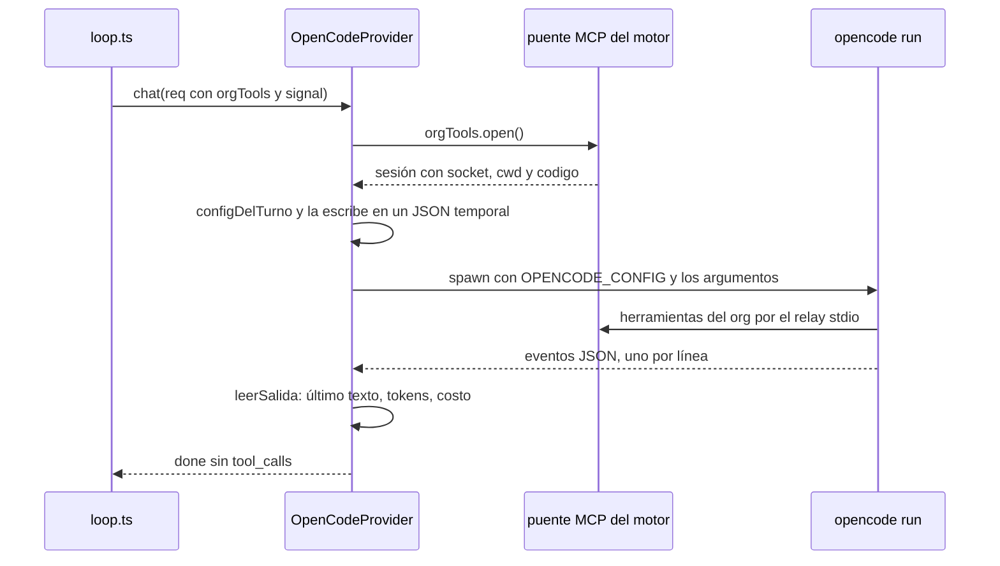

# Proveedor opencode

`OpenCodeProvider` (`packages/llm/src/adapters/opencode.ts`) es el hermano de
[[Proveedor claude-code]]: **delega cada turno entero al CLI de opencode**
(`opencode run`) y devuelve sólo el texto final, sin `tool_calls`. Existe por la
misma razón: una suscripción no se puede usar por API. El CLI corre con la
credencial que tenga esta máquina en `opencode auth login` —el plan de OpenCode
Zen, una sesión de Anthropic, Copilot o una API key propia—, así que **el
catálogo depende de la máquina**.

Como `delegaElTurno = true`, el motor le presta el mismo puente MCP del org que
a Claude Code: el puente es agnóstico del CLI y lo único que cambia es cómo cada
uno declara el servidor. Ver [[Turnos delegados a un CLI]].

## Cómo se prende

1. Instalar el CLI `opencode` y autenticarlo (`opencode auth login`).
   `opencode auth list` dice qué credencial quedó.
2. En `.env`: `ORQ_OPENCODE=1`. Opcionales: `OPENCODE_MODEL`,
   `OPENCODE_WORKDIR`, `OPENCODE_COMMAND`, `ORQ_OPENCODE_COSTO`,
   `OPENCODE_TIMEOUT_MS`.
3. Reiniciar el servidor.

> [!danger] `OPENCODE_TIMEOUT_MS=` vacía deja el corte en cero
> El corte se lee como `Number(process.env["OPENCODE_TIMEOUT_MS"] ?? 1_200_000)`.
> `??` sólo cubre la variable **ausente**: una línea vacía en `.env` la define
> como `""`, `Number("")` da `0`, y cada turno se corta en el acto ("el turno se
> pasó de 0s"). El `.env.example` trae esa línea vacía, así que un `.env`
> copiado tal cual deja al proveedor inservible. Borrá la línea o poné un número.

## Catálogo

`listModels` corre `opencode models` (con corte de 30 s, `CORTE_CATALOGO_MS`) y
toma cada línea que contiene `/` y no empieza con `-`. `catalogoOpenCode` arma
un `ModelInfo` por slug, sin repetidos:

| Campo | Valor |
|---|---|
| `slug` | el del CLI **tal cual** (`opencode/claude-sonnet-5`, `zai/glm-5`) |
| `name` | `opencode — <slug>` |
| `contextLength` | 200.000 (fijo) |
| `supportsTools` | `false`: el motor nunca le manda `tools` |
| precios | `null` |

Los slugs **ya vienen namespaceados** y se guardan así: volver a prefijarlos
con el id del proveedor daba `opencode/opencode/…`, que el CLI no conoce.
`normalizarSlug` corrige justo ese error cuando alguien lo fija a mano. En la
máquina medida el catálogo tenía 428 slugs.

Si el CLI no lista nada, se usa `CATALOGO_MINIMO` (Haiku 4.5, Sonnet 5 y
Opus 5 de Zen): un catálogo vacío no es neutral, deja al selector sin opciones y
al proveedor con cara de roto aunque el CLI ande.

## Tiers

Sin precios las bandas no resuelven ni uno, así que va por el mapa curado
(`TIERS_ESTATICOS["opencode"]` en `packages/llm/src/modelos-claude.ts`). Las
listas **cruzan credenciales** a propósito: gana el primer prefijo que exista en
el catálogo de esta máquina.

| Tier | Prefijos en orden |
|---|---|
| `free` | `opencode/deepseek-v4-flash-free` → `opencode/nemotron-3-ultra-free` → `opencode/mimo-v2.5-free` |
| `cheap` | `opencode/claude-haiku-4-5` → `anthropic/claude-haiku-4-5` → `github-copilot/claude-haiku-4-5` → `opencode/gemini-3-flash` |
| `standard` | `opencode/claude-sonnet-5` → `anthropic/claude-sonnet-5` → `github-copilot/claude-sonnet-5` → `opencode/claude-sonnet-4-6` |
| `smart` | `opencode/claude-opus-5` → `anthropic/claude-opus-5` → `github-copilot/claude-opus-5` → `opencode/claude-opus-4-8` |

`free` apunta a los modelos que Zen marca con el sufijo `-free`, que no
descuentan saldo. Es el único tier que se puede afirmar **sin saber en qué plan
está la cuenta**, y el que deja probar una empresa entera con la credencial
vacía.

## Cómo corre un turno



### Los argumentos

`construirArgs({ prompt, model })`:

```text
opencode run --format json --pure --auto --agent orq --model <slug> <prompt>
```

- **`--pure`** deja afuera los plugins del usuario: lo que corre en una corrida
  no puede depender de qué tenía instalado quien configuró la máquina.
- **`--auto`** aprueba lo que no esté negado. No es un lujo: sin él, una
  herramienta que pide permiso deja al proceso esperando una respuesta
  interactiva que nunca llega, y el turno se cuelga entero. Por eso lo que no
  se quiere que pase se **niega** en la config en vez de dejarse en "preguntar".
- **`--agent orq`**: el agente que define la config del turno.
- El prompt va último, como posicional.

### La configuración del turno

`configDelTurno({ soloLectura, session })` arma el JSON que entra por la
variable `OPENCODE_CONFIG` (archivo `orq-opencode-<hora>-<azar>.json` en el
temporal del sistema, que no se borra después):

```json
{
  "$schema": "https://opencode.ai/config.json",
  "agent": {
    "orq": {
      "mode": "primary",
      "description": "Agente de la organización, con las herramientas que le presta el org.",
      "tools": { "*": false, "read": true, "glob": true, "grep": true, "list": true, "webfetch": true, "orq*": true },
      "permission": { "edit": "deny", "bash": "deny", "webfetch": "allow" }
    }
  },
  "mcp": {
    "orq": { "type": "local", "command": ["<node>", "<claude-code-relay.mjs>"], "environment": { "ORQ_SOCKET": "<socket>" }, "enabled": true }
  }
}
```

Ése es el caso de sólo lectura. Reglas:

- **`"*": false` no es redundante.** La config global del usuario
  (`~/.config/opencode/`) **se fusiona** con la del turno: sin el barrido, las
  herramientas de sus servidores MCP globales también le llegarían al agente, y
  con ellas una vía de escribir que el org no ve.
- **Las del org se habilitan con `orq*`**, porque opencode nombra las
  herramientas MCP `<servidor>_<tool>`.
- **El servidor MCP es el mismo relay de Claude Code**
  (`claude-code-relay.mjs`) apuntando al socket de la sesión.
- **Sobre la salida, sólo lectura**: `read`, `glob`, `grep`, `list`, `webfetch`
  (`HERRAMIENTAS_DE_LECTURA`), y `edit` y `bash` negados explícito. Mismos tres
  motivos que en Claude Code: `write_output_file` es lo único que sanea la ruta,
  anota la procedencia y aplica la jerarquía de borrado.
- **En su carpeta propia** (sin sesión: el health check) suma `write`, `edit`,
  `patch` y `bash`, con permisos en `allow`: ahí no hay nada que proteger.

### Sobre un repo, también sólo lectura

A diferencia de Claude Code, un turno de código de opencode **no** recibe
herramientas de edición propias aunque tenga el arriendo: no hay forma de negarle
editar `.git` por patrón de ruta, y un hook escrito ahí es código que corre fuera
del sandbox en el próximo checkpoint. Edita por las herramientas del org
(`editar_codigo`, `escribir_codigo`, `aplicar_parche`), que resuelven cada ruta
contra el worktree y rechazan `.git`, y corre comandos con `ejecutar_comando`.
El cierre del prompt se lo dice. Ver [[Herramientas de código]].

### El prompt

`render()` es el mismo aplanado que en Claude Code (system, `## Instrucción de la
persona`, `## Tu respuesta anterior`) y el cierre depende del modo: en código,
qué herramientas del org usar para editar y verificar; en la salida, que mire
con las propias y produzca con las del org; en su carpeta, que deje ahí los
archivos. Siempre termina pidiendo un resumen para la organización.

## La salida

`leerSalida(stdout)` lee un evento JSON por línea. Importan tres:

| Evento | Qué se toma |
|---|---|
| `text` | `part.text`; el texto del turno es el **último** bloque no vacío |
| `step_finish` | `part.tokens` (`input`, `output`, `reasoning`, `cache.read`, `cache.write`) y `part.cost`, **sumados** sobre todos los pasos |
| `error` | `error.data.message` o `error.name` |

- `inputTokens = input + cache.read + cache.write` y `cachedInputTokens = cache`:
  la entrada real incluye lo cacheado, igual que en Claude Code.
- `outputTokens = output + reasoning`: el razonamiento se cobra como salida.
- Si no hubo ningún texto pero sí un `error`, tira `LlmError("opencode: …")`. Sin
  eso, una credencial sin saldo ("Insufficient balance") se veía como un turno
  vacío y la corrida moría sin decir por qué.
- Si el agente no escribió un cierre, se devuelven todos los bloques pegados:
  un turno mudo se ve igual que uno que falló.

## Cortes por tiempo y rescate

| Constante | Valor | Variable |
|---|---|---|
| `CORTE_MS` (`timeoutMs`) | 1.200.000 (20 min) | `OPENCODE_TIMEOUT_MS` |
| `timeoutCodigoMs` | `CORTE_MS × 1,5` = 1.800.000 | — |
| `CORTE_CATALOGO_MS` | 30.000 | — |
| remate tras `SIGTERM` | 5.000 ms, después `SIGKILL` | — |

**Veinte minutos y no diez.** Copiar el corte de Claude Code fue un error medido:
los modelos gratuitos van en cola y son lentos, y un agente que hizo 31 llamadas
útiles —leer entregables, loguearse, navegar hasta la no conformidad, sacar la
captura— murió a los diez minutos sin entregar nada.

`correr()` lleva su propio reloj (`corteMs`) además de escuchar el `signal` del
motor, y los dos terminan en `matar()`:

1. `SIGTERM`, y `SIGKILL` a los 5 s si no murió.
2. **Si ya se emitió texto** (`hayTexto`), la promesa **resuelve** con lo que
   hay, marcado como cortado, y el texto sale con `AVISO_DE_CORTE` pegado: "⚠️
   ESTE TURNO SE CORTÓ POR TIEMPO antes de terminar…". La salida del CLI llega
   recién al final, así que sin esto un corte a mitad de camino se llevaba el
   turno entero. Rescata tanto el corte por tiempo como el stop de la corrida.
3. Si no hubo texto, rechaza con `LlmError` no reintentable.

Al terminar el proceso: con código 0 **o** con algo en stdout se resuelve y
decide `leerSalida`; sin stdout, `LlmError` con el `stderr` o "CLI salió con
código N" más `ultimoAliento` (compartido con Claude Code). Si el binario no
existe: "No se pudo ejecutar el CLI de opencode… Instalalo y autenticalo con
`opencode auth login`."

> [!warning] El corte de código de 30 minutos no llega a aplicarse
> El motor usa `timeoutCodigoMs` (30 min) para un turno sobre un repo, pero el
> reloj interno de `correr()` usa siempre `CORTE_MS`: el turno se corta igual a
> los **20 minutos**, rescatando lo que haya.

## Costo

Por defecto **no se reporta** (`reportarCosto: false`): bajo un plan el turno no
factura por token, y reportarlo dispararía `budgetUsd` cortando corridas que no
cuestan dinero. Con créditos por uso (Zen sin plan, o una API key propia detrás
del CLI) el gasto **sí** es real: ahí se prende `ORQ_OPENCODE_COSTO=1` y el costo
que suma `leerSalida` viaja como `reportedCostUsd`, que `computeCost` usa tal
cual. Ver [[Costos y presupuesto]].

## El health check

1. `opencode models`: si no lista nada, falla pidiendo verificar la instalación
   y `opencode auth list`.
2. **Un turno real** ("Respondé únicamente con la palabra: ok") en su carpeta
   propia. El catálogo sale de la config local y lista modelos aunque la
   credencial esté vencida o la cuenta sin saldo: sin un turno de verdad, el
   proveedor se ve sano y la corrida muere en el primer ciclo.

Lo disparan `GET /api/providers` y `check:models`, así que cada visita a la
pantalla de proveedores corre un turno y deja una carpeta `turno-…` en
`OPENCODE_WORKDIR` (relativa al directorio del proceso, como en Claude Code).

## Diferencias con Claude Code

| | `claude-code` | `opencode` |
|---|---|---|
| Configuración | banderas (`--allowedTools`, `--mcp-config`) | un JSON por turno en `OPENCODE_CONFIG`, fusionado con el global |
| Sobre un repo con arriendo | edita con `Edit`/`Write` propios | sólo lectura; edita por el org |
| Corte | 10 min (código 25), sin reloj propio; vigilante de silencio de 3 min | reloj propio de 20 min en todos los casos; sin vigilante |
| Rescate | cuando el CLI termina con error | cuando se corta por tiempo o se detiene |
| Modelo de respaldo y avisos | `--fallback-model`, avisos de ventana y reintentos | no |
| Herramientas propias en la traza | sí (`cli:<nombre>`) | no: sus lecturas propias no cuentan como trabajo para el scheduler |
| Transcripciones | sí | no |
| Entorno del CLI | sin `ANTHROPIC_API_KEY` ni `ANTHROPIC_AUTH_TOKEN` | el del servidor entero, más `OPENCODE_CONFIG` |
| Costo | nunca | opcional con `ORQ_OPENCODE_COSTO` |
| Tier `free` | no | sí (modelos `-free` de Zen) |

> [!warning] El CLI hereda el entorno completo del servidor
> `correr()` lanza el proceso con `{ ...process.env, OPENCODE_CONFIG }`: no le
> saca las claves de API que tenga cargadas el servidor. Qué credencial usa
> opencode para cada modelo lo decide el propio CLI; mirá `opencode auth list`
> antes de asignar un modelo de un proveedor del que también tenés una clave en
> `.env`.

## Variables de entorno

| Variable | Para qué | Default en el código |
|---|---|---|
| `ORQ_OPENCODE` | interruptor del proveedor | apagado |
| `OPENCODE_COMMAND` | binario | `opencode` |
| `OPENCODE_MODEL` | modelo del health check y respaldo si el pedido viene vacío | `opencode/claude-sonnet-5` (el `.env.example` propone `opencode/deepseek-v4-flash-free`) |
| `OPENCODE_WORKDIR` | carpetas de turnos sin sesión | `<tmpdir>/orq-opencode` |
| `ORQ_OPENCODE_COSTO` | reportar al ledger el costo que informa el CLI | apagado |
| `OPENCODE_TIMEOUT_MS` | corte del turno | 1.200.000 (ver la trampa del valor vacío) |
| `OPENCODE_CONFIG` | la escribe el adaptador en cada turno | — |

## Fallas conocidas

| Síntoma | Causa |
|---|---|
| Todos los turnos fallan con "se pasó de 0s" | `OPENCODE_TIMEOUT_MS` vacía en `.env` |
| "opencode: Insufficient balance" | la credencial no tiene saldo; con plan vacío sólo anda el tier `free` |
| El proveedor lista cientos de modelos pero la corrida muere | el catálogo no dice nada del saldo; el health check con turno real sí |
| Un turno de código termina con "SE CORTÓ POR TIEMPO" a los 20 min | el reloj interno ignora `timeoutCodigoMs` |
| Un rol que sólo leyó con sus herramientas deja de ser convocado por sus tareas | opencode no informa herramientas propias: el turno cuenta cero y, a los dos turnos así, el scheduler lo toma por un rol que habla sin hacer nada |

## Qué fijan los tests

`packages/llm/src/adapters/opencode.test.ts`:

- `catalogoOpenCode` usa los slugs tal cual, sin `opencode/opencode/`, sin precios
  ni tool-calling declarado, y deduplica;
- el proveedor se identifica como `opencode`, "suscripción", y `delegaElTurno`;
- con directorio de empresa no habilita `write`, `edit`, `patch` ni `bash`, sí
  `read` y `grep`, y niega `edit` y `bash` explícito; en su carpeta sí escribe;
  el barrido `"*": false` y el `orq*` están; el MCP `orq` es `local` y apunta al
  socket; sin sesión no hay MCP;
- `construirArgs` arranca con `run` y lleva `--pure`, `--auto`, `--format json`,
  el modelo, y el prompt último;
- `leerSalida` devuelve el último texto, suma entrada con caché, salida y costo
  de todos los pasos, cuenta el razonamiento como salida, falla con el detalle
  del CLI cuando sólo hay error, e ignora líneas que no son JSON;
- `normalizarSlug` corrige el id pegado dos veces y deja pasar el resto;
- el mapa resuelve Haiku/Sonnet/Opus de Zen, `free` a un `-free`, y cae a
  `anthropic/…` si Zen no está;
- `hayTexto` reconoce texto emitido antes del corte y no rescata un turno que
  sólo llamó herramientas.

## Fuentes

- `packages/llm/src/adapters/opencode.ts` → `OpenCodeProvider`, `delegate`, `construirArgs`, `configDelTurno`, `leerSalida`, `hayTexto`, `AVISO_DE_CORTE`, `catalogoOpenCode`, `normalizarSlug`, `correr`, `cierre`, `CORTE_MS`, `CATALOGO_MINIMO`
- `packages/llm/src/modelos-claude.ts` → `TIERS_ESTATICOS["opencode"]`
- `packages/llm/src/registry.ts` → `buildRegistry` (rama de `ORQ_OPENCODE`)
- `packages/llm/src/adapters/claude-code-relay.mjs`
- `.env.example` → bloque de opencode

## Ver también

- [[Proveedor claude-code]]
- [[Turnos delegados a un CLI]]
- [[Capa LLM y tiers]] · [[Costos y presupuesto]]
- [[Variables de entorno]]
