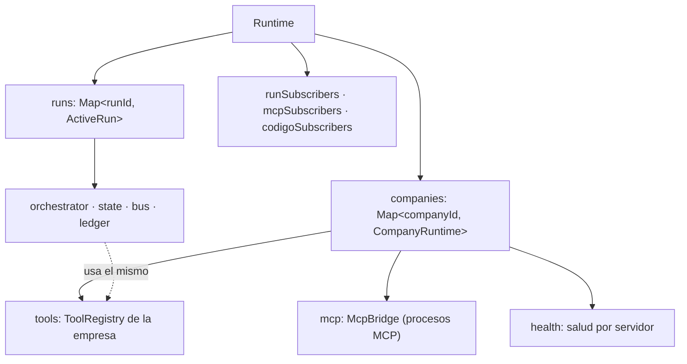
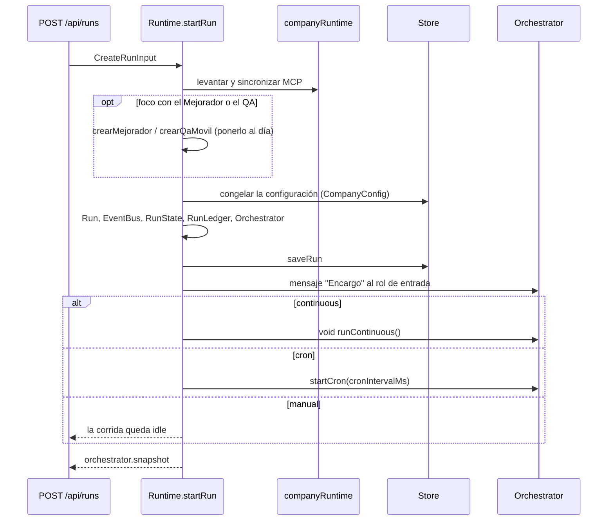
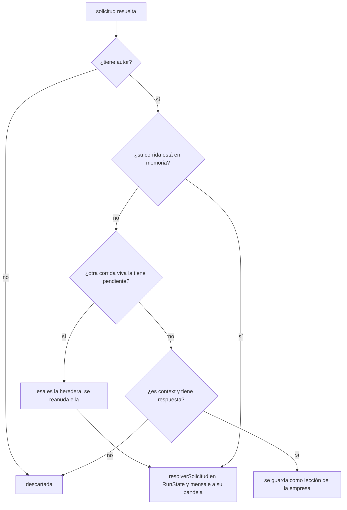

# Runtime del servidor

`apps/server/src/runtime.ts` → `Runtime` sostiene **lo que está vivo** en el
proceso del servidor y cablea el motor con todo lo que el motor no conoce. El
motor (`packages/engine`) no sabe de Fastify, SQLite ni disco: recibe
proveedores, persistencia, registro de herramientas y funciones inyectadas. El
que las arma, las guarda en memoria y las suelta es el `Runtime`. Ver
[[ADR-003 Motor desacoplado del servidor]].

## Los dos niveles

| Nivel | Campos | Vive |
|---|---|---|
| `CompanyRuntime` | `companyId`, `tools` (`ToolRegistry`), `mcp` (`McpBridge`), `health` | mientras el servidor esté arriba; por eso el Hub muestra MCP conectados sin corridas |
| `ActiveRun` | `run`, `state` (`RunState`), `bus` (`EventBus`), `ledger` (`RunLedger`), `orchestrator`, `companyId` | desde `startRun` hasta que se la olvida o se reinicia el servidor |

Las corridas **comparten** el registro de herramientas de su empresa: lo
*ejecutable* de una herramienta nueva les llega solo. Lo que no comparten es el
**catálogo** (`config.tools`) ni el organigrama, que cada corrida congela al
arrancar.

> [!warning] `active.run` queda viejo
> `ActiveRun.run` es el objeto con el que arrancó. El `Orchestrator` informa su
> estado por `snapshot` (estado, `tick` del `RunState`, gasto) y no actualiza
> ese objeto: el estado autoritativo es siempre `orchestrator.snapshot`. Leer
> `active.run.status` hacía que una corrida detenida dijera "está en curso".
> Queda un resto: los `log` que emiten `actualizarRolEnCorridasVivas` y
> `removeRoleFromLiveRuns` usan `active.run.tick`, que es siempre el inicial,
> así que esos avisos aparecen en el ciclo 0 de la cronología.

## Lo que arma el constructor

`new Runtime(store, providers, env)` no abre MCP ni corridas. Construye:

| Miembro | Qué es | Nota |
|---|---|---|
| `directorios` | `Directorios` sobre `PROYECTOS_DIR`, con el nombre de la empresa leído de la base | [[Directorios en disco]] |
| `exports` | `ExportStore(disposicionPorProyecto(directorios))` | [[Salida de la empresa]] |
| `repos` | `RepoStore`, que emite eventos de código por `broadcastCodigo` | [[Repositorios y sesiones]] |
| `arriendos` | `ArriendosDeCodigo`, quién escribe en cada repo | [[Arriendo de escritura y resumen de código]] |
| `servicios` | `ServiciosVivos` con `.servicios-vivos.json` | [[Servicios del monorepo]] |
| `dispositivos` | `Dispositivos` con `.dispositivos.json`; `mantenerTuneles` recalcula los túneles de cada teléfono con los puertos de ahora | [[Vinculación del teléfono]] |
| `aab` | `ConstructorDeAab` | [[Build de producción Android]] |
| `scm` | `ControlDeVersiones` | [[Control de versiones y publicación]] |
| `contexto` | `ContextoStore` sobre `CONTEXTO_DIR` | [[Vault de contexto]] |
| `correo` | `crearCorreo` con `N8N_EMAIL_WEBHOOK_URL`; lo comparten misiones y agentes | [[Correo y avisos]] |

## El runtime de una empresa: `companyRuntime`

`companyRuntime(companyId)` lo crea la primera vez y **siempre** termina con
`mcp.sync(store.listMcpServers(id))`: llamarlo es también sincronizar los MCP
contra la base (conectar lo nuevo, reconectar lo que cambió). Lo levantan
`startRun`, `GET …/tools`, `GET …/mcp/health`, el alta y la edición de un MCP,
`sembrarHerramientas` y la instalación desde la tienda.

Al crearlo registra, en orden:

1. **Habilidades** (`createSkillTools`) sobre `exports.forCompany(id)`, con
   `musicaHome`: cada empresa exporta a lo suyo.
2. **Herramientas de contexto** (`crearHerramientasDeContexto`). El nombre de la
   empresa se resuelve **al usar**: si se renombra, el vault la sigue sin
   reiniciar el runtime.
3. **Correo** (`createEmailTools`) con un enlace de adjunto
   `API_URL/api/companies/<id>/exports/<ruta>`: por eso es por empresa.
4. **Compuestas** persistidas (`origin: "creada"` con `composicion`), vueltas a
   ejecutables con `crearToolCompuesta`. Una fila sin composición se saltea.
5. **`crear_herramienta`**, que necesita el catálogo de esta empresa a mano.
6. **Código, teléfono y R2** (`registrarCodigoEn`): las de código siempre —aun
   sin repo, porque una plantilla las otorga antes de que alguien cargue código y
   sin repo cada una dice qué falta—; las del teléfono sólo si hay `adb`; las de
   R2 siempre (sin credenciales dicen cuáles faltan).
7. **`McpBridge`** con un callback por cada cambio de salud: guarda la salud, la
   reemite por SSE, persiste las herramientas (`persistMcpTools`) y, si el
   servidor quedó `ready`, otorga las herramientas anotadas en
   `otorgarAlConectar` (también en las corridas vivas) y vacía la lista. Recibe
   la fábrica OAuth (`crearFabricaOAuth` con `dirOAuth` =
   `dirname(DATABASE_URL)/mcp-oauth` y el callback
   `API_URL/api/mcp/oauth/callback`).

Las de coordinación y capacidad ya vienen en el constructor de `ToolRegistry`.

> [!note] `persistMcpTools` guarda todo menos las creadas
> Recorre `tools.describe()` y guarda cada una salvo `origin: "creada"`
> —`describe` no lleva la composición y re-guardarlas las dejaría vacías—. Eso
> incluye las de **coordinación**, aunque `sembrarHerramientas` las deja afuera
> a propósito. La UI de asignación las muestra aparte como "siempre", así que no
> se presentan como quitables.

## Arrancar una corrida: `startRun`

**Validaciones**: la empresa existe; tiene al menos un rol ("definí al menos uno
antes de arrancar"); con `foco`, el rol y el repo existen y el repo es de la
empresa. Cualquier `throw` sale como **400** en la ruta.

**La configuración congelada** (`CompanyConfig`): empresa, departamentos, roles,
políticas, catálogo de herramientas, servidores MCP, lecciones, solicitudes,
**entregables de toda la empresa** (`listArtifactsByCompany`, para versionar en
vez de reescribir) y **tareas abiertas de cualquier corrida**
(`listTasksAbiertasByCompany`, que `RunState` adopta). Con `foco` —el chat del
IDE— el organigrama se reduce a ese rol y no adopta tareas: si no, "mejorá esta
función" terminaba en una reunión de cuatro agentes.

**Valores por defecto de la corrida**:

| Campo | Valor |
|---|---|
| `maxTicks` | el pedido; si no, 4 con `foco` y `DEFAULT_MAX_TICKS` (50) sin él |
| `budgetUsd` | el pedido; si no, `company.budgetUsd` (default 1 en el esquema); si no, `DEFAULT_RUN_BUDGET_USD` |
| `cronIntervalMs` | el pedido (mínimo 1.000) o 60.000 |
| `status` | `idle` |

**Cableado**:

- El `EventBus` tiene un solo suscriptor: `store.saveEvent` y **después**
  `broadcastRun`. Si persistir falla, tampoco se reemite (el bus traga el
  error de su suscriptor): lo que se ve en vivo es lo que quedó guardado.
- `RunState` recibe la persistencia: mensajes, tareas, entregables (con
  `companyId`), aprobaciones, solicitudes, roles convocados (con su
  departamento) y herramientas creadas. Una lección va a la base **y** dispara
  `espejarAprendizajes` sobre su tema.
- `RunLedger(budgetUsd)` guarda una fila de `ledger` por llamada al modelo.
- `Orchestrator` recibe `bus`, `providers`, el `ToolRegistry` de la empresa,
  `ledger`, `concurrency: AGENT_CONCURRENCY` (4), `dirDeTrabajo` (la salida,
  prestada en sólo lectura), `codigo.abrirTurno` (`abrirTurnoDeCodigo`, con el
  repo del foco como principal), `mapaDeContexto` (resuelto por turno),
  `fechaHoy` (`toLocaleDateString("es-AR")`: el motor no tiene reloj) y
  `onRunUpdate` → `store.saveRun`.

**El mensaje de entrada** es de la persona (`forActor(null)`, tipo `human`) al
rol ejecutivo sin jefe; si no hay, al primero sin jefe; si no, al primero. Con
`foco`, al único rol, con asunto "Pedido desde el IDE" y, si hay conversación,
la historia previa arriba del pedido (`historiaDeConversacion`). Debajo va el
contexto que adjuntó la persona.

> [!warning] `void orchestrator.runContinuous()` va sin `.catch`
> `tick()` atrapa todo lo que pasa adentro de su `try` y termina la corrida como
> `failed`, así que en la práctica no rechaza. Pero la regla del servidor para
> cualquier *fire-and-forget* es validar antes y ponerle `.catch`: una promesa
> rechazada sin dueño **mata el proceso de Node** con todas las corridas.

## Controlar una corrida

| Método | Hace | Persiste |
|---|---|---|
| `tick` | un ciclo (modo manual) | `saveRun` al terminar |
| `resume` | `runContinuous()` hasta cortar | `saveRun` al terminar |
| `pause` | `orchestrator.pause()`: un **pedido**, efectivo al cerrar el ciclo | `saveRun` enseguida, o una caída la dejaría "avanzando" |
| `stop` | `orchestrator.stop()`: aborta el turno en vuelo | `saveRun` |
| `inject` | mensaje de la persona a un rol + evento `agent.message`; falla si la corrida terminó ("nadie va a leer el mensaje") o si el rol no existe | por `RunState` |
| `resolveApproval` | delega en `Orchestrator.resolveApproval` | por el motor |

Todos pasan por `require(runId)`, que falla con "no está activa en memoria. Las
corridas no sobreviven a un reinicio del servidor: podés leer su traza, pero no
continuarla". La ruta de `resume` valida **antes** con `estaEnMemoria` y
contesta sin esperar (`void runtime.resume(id).catch(…)`): retomar dura minutos.
Ver [[API HTTP y SSE]].

**`reanudarSiEsperaba(runId)`** hace que contestar destrabe sin apretar
"continuar": si la corrida está en `awaiting_approval` **o** `paused` y no le
queda ninguna solicitud ni aprobación pendiente, llama a `resume` en segundo
plano (con `.catch`). Vale desde `paused` porque resolver la última aprobación
deja la corrida en pausa. Consecuencia: si pausaste a mano y después contestás
una solicitud de esa corrida, sigue sola.

## Cuatro preguntas sobre una corrida

| Predicado | Verdadero si | Lo usan |
|---|---|---|
| `estaViva(runId)` | está en memoria y su snapshot es `running` | `DELETE /api/runs/:id` (409), `viva` del pulso |
| `estaEnMemoria(runId)` | está en el mapa, en cualquier estado | la ruta de `resume`, antes de contestar |
| `sePuedeContinuar(runId)` | en memoria y **no terminal** (`esCorridaTerminal`) | borrar una corrida (409), limpiar terminadas, contar terminadas en mantenimiento |
| `tieneCorridaViva(companyId)` | alguna corrida de la empresa está `running` o `awaiting_approval` | misiones, renombrar y borrar la empresa, `corridaViva` del resumen |

`estaViva` es demasiado angosta para decidir un borrado: una corrida `paused` o
`awaiting_approval` no avanza pero conserva su estado vivo, y la limpieza en lote
se llevaba justamente esas. `esCorridaTerminal`
(`packages/shared/src/schema.ts`) es la lista única de estados de los que no se
vuelve: `completed`, `stopped`, `budget_exceeded`, `failed`.

> [!note] `tieneCorridaViva` no cuenta las pausadas
> Una corrida pausada en memoria no bloquea una misión, un renombre ni el borrado
> de la empresa. Ver los casos borde de [[Misiones programadas]] y
> [[Gestión de proyectos]].

`snapshot(runId)` devuelve el snapshot vivo o, si no está en memoria, la fila de
la base. `active(runId)` expone el `ActiveRun` (lo usa `GET /api/runs/:id` para
`live`).

## Lo que editás tiene que llegar a la corrida viva

La corrida congela organigrama y catálogo. Cada camino que cambia un rol durante
una corrida tiene que reflejarlo a mano:

| Cambio | Cómo llega a la corrida |
|---|---|
| Editar un rol en la configuración | `actualizarRolEnCorridasVivas`: incorpora al catálogo de la corrida (`incorporarHerramienta`) las herramientas nuevas del rol, reemplaza el rol (`actualizarRol`) y emite un `log` "recibe N herramienta(s)… en su próximo turno" |
| Borrar un rol | `removeRoleFromLiveRuns`: `state.removeRole` y `log` de aviso; sin esto seguiría tomando turnos y gastando |
| Aprobar `create_role` | `state.addRole` en la corrida de la solicitud |
| Aprobar `tool_access` | `state.updateRoleTools` en la corrida de la solicitud |
| Aprobar `mcp_server` | `instalarServidoresMcp`: `incorporarHerramienta` + `updateRoleTools` |
| Servidor OAuth que se conecta | `otorgarAlConectar` → `actualizarRolEnCorridasVivas` |
| Mejorador o QA puestos al día | `crearAgenteDelChat` → `actualizarRolEnCorridasVivas` |

> [!danger] El síntoma es que nada falla
> Medido con Brave instalado desde la tienda, conectado y `ready`, con sus dos
> herramientas otorgadas a los tres roles: la base impecable y una corrida entera
> insistiendo con `web_search` —que su proveedor no soporta— sin una sola
> invocación al servidor que tenía al lado. Un `toolIds` que apunta a algo que la
> corrida no tiene en catálogo no le agrega nada al agente.

Lo que **no** llega: departamentos, políticas y contexto de la empresa editados;
un rol **nuevo** creado desde la configuración (`actualizarRol` sólo reemplaza
roles que la corrida ya tiene); y en `tool_access`, una herramienta que la
corrida no tenía en su catálogo (se otorga el id pero no se incorpora).

## Solicitudes: aplicar y avisar

`applyRequest(companyId, request, override, comando)` aplica una solicitud
aprobada (la llama `POST /api/companies/:companyId/requests/:id`; un `throw` es
un 400 y la solicitud queda pendiente):

| Tipo | Efecto |
|---|---|
| `dependencia` | `instalarDependencias`: revalida paquetes y carpeta, rechaza si alguien tiene el arriendo, corre el gestor en el sandbox (corte 5 min, siempre de verdad), falla con la cola de la salida; commitea sólo con commits automáticos. [[Instalación de dependencias]] |
| `comando` | una vez: agrega el argv a `unaVez`; siempre: valida que el prefijo sea el principio del pedido y `validarPrefijoPermitido`, y lo suma a `permitidos`. [[Comandos y sandbox]] |
| `create_role` | nombre único (sin mayúsculas); crea el departamento si no existe; jefe por nombre o el solicitante; modelo de la empresa con `conEscaladoPorAutoridad`; `maxTurns` 6; entra a la corrida viva |
| `tool_access` | otorga las que existen en el catálogo y nombra las inexistentes |
| `mcp_server` | `instalarServidoresMcp` otorgando al solicitante; si todos ya existían, error: no hay nada que aprobar |
| `context` | nada: la respuesta viaja en el mensaje |

`conEscaladoPorAutoridad`: tier `free` → escala sólo dentro de `free` (un modelo
pago daría 402); `executive` → `standard..smart`; el resto → `cheap..standard`.

`instalarServidoresMcp` es el ciclo único que reusan solicitudes y tienda:
dedupe por nombre (el nombre es parte de `mcp__<servidor>__<tool>`), aviso por
variable requerida que falta en el entorno, alta con `autoApproveTools: true`,
`companyRuntime` (sync **esperando el handshake**), `persistMcpTools`,
herramientas descubiertas, otorgamiento opcional (también en la corrida viva) y
estado por servidor. Ver [[Tienda MCP]] e [[Integración MCP]].

**`notifyRequester(request, aplicado)`** le hace llegar la respuesta al agente:

- **Heredera**: las solicitudes pendientes se cargan en cada corrida nueva; si la
  que la creó murió, la respuesta se espeja en la que la está esperando. Sin eso
  una corrida con todo aprobado quedaba en `awaiting_approval` para siempre.
- **Memoria**: una respuesta a una consulta sin corrida viva se guarda como
  lección (`consulta: <pregunta>`), recortada a `TOPE_RESPUESTA` = 600
  caracteres; si es más larga, la completa va al vault en
  `Consultas/<pregunta, 60 caracteres>.md`. Medimos respuestas de 5.570
  caracteres que llegaron a ser el 54% del prompt.
- **El mensaje depende del tipo**: una consulta vuelve como `response`
  "Respuesta a: …" con el dato primero y "no lo vuelvas a preguntar" (rotulada
  "Aprobación concedida", el agente volvía a preguntar lo mismo); una
  dependencia dice qué quedó instalado y cómo importarla; el resto,
  `approval_grant`/`approval_deny` con lo aplicado.

## Memoria espejada al vault

`espejarAprendizajes(company, topic)` reescribe **la nota entera del tema** en el
vault (`notaDeAprendizajes`, en `rutaDeTema`) con todas las lecciones de ese
tema; si el tema se quedó sin lecciones, **borra la nota**. La fecha entra
formateada (ISO) desde acá. Falla en silencio con un `console.error`: un disco
lleno no puede tumbar una corrida. Es pública porque la memoria entra por dos
puertas —`record_lesson` y la API— y sale por las dos. Ver
[[Memoria de la empresa]] y [[Vault de contexto]].

## MCP desde el runtime

| Método | Hace |
|---|---|
| `mcpHealth` | la salud **sólo de lo que sigue configurado**: poda del mapa lo borrado (el servidor fantasma en `ready` del Hub) |
| `eliminarServidorMcp` | desconecta, borra su salud, sus filas de `tools`, la fila del servidor, su token OAuth, y poda `toolIds` huérfanos |
| `reconnectMcp` | vuelve a conectar un servidor |
| `probeTool` | prueba a mano desde el Hub; rechaza coordinación, habilidades y compuestas (necesitan una corrida) y usa el primer rol como actor |
| `completarAutorizacionMcp` | la vuelta de OAuth: busca en todas las empresas el `state` pendiente |

## Ciclo de vida de la empresa

- `sembrarHerramientas` y `generarEquipo` → [[Gestión de proyectos]] y
  [[Plantillas de equipo]].
- `proveedorPreferido`: `claude-sesion` > `anthropic` > `claude-code` >
  `opencode` > `openrouter` > el primero registrado > `null`.
- `renombrarEmpresa` → [[Gestión de proyectos]].
- `eliminarEmpresa`, `olvidarEmpresa`, `olvidarCorrida` →
  [[Limpieza y mantenimiento]].
- `migrarLayout` → [[Directorios en disco]].

## Código, servicios y teléfono: el cableado

| Método | Para qué | Nota |
|---|---|---|
| `registrarHerramientasDeCodigo` | re-registra las de código al cargar o sacar un repo y siembra sus filas | [[Herramientas de código]] |
| `depsDeCodigo` | dependencias de `codigo-servidor.ts`; `emitirCheckpoint` emite `codigo.checkpoint` en el bus de la corrida | [[Instantáneas y checkpoints]] |
| `crearMejorador`, `crearQaMovil` | agentes del chat, idempotentes por nombre; les suman lo que les falte. `claude-code/opus` si está, si no el preferido en `smart`; `executor`; `maxTurns` 20 y 30 | [[Chat de IA]], [[QA móvil]] |
| `historiaDeConversacion` | pedidos previos de la conversación, del más nuevo al más viejo: hasta 8, pedido 1.500 y respuesta 2.500 caracteres, presupuesto 8.000 | [[Chat de IA]] |
| `generarMensajeDeCommit` | una llamada al tier `cheap` del preferido: diff hasta 14.000 caracteres, 12 commits de estilo, 400 tokens, temperatura 0,2, corte 120 s; saca firmas `Co-Authored-By` | [[Control de versiones y publicación]] |
| `entornoDeArranque`, `prepararServicio`, `arrancarServicio`, `carpetaDeServicio`, `serviciosPreparados` | levantar servicios sobre la sesión, en el sandbox | [[Servicios del monorepo]] |
| `contextoAab` | lo que necesita armar un AAB | [[Build de producción Android]] |
| `titularDeEscritura`, `ejecutarComoPersona` | quién tiene el arriendo; la terminal del IDE por la misma allowlist | [[Terminal del IDE]] |
| `telefonoStorage` | adb acotado a la app del repo | [[Depuración de la app móvil]] |

## Suscripciones en vivo

`subscribeRun`, `subscribeMcp` y `subscribeCodigo` devuelven la función para
desuscribirse. Cada `broadcast*` envuelve cada suscriptor en `try/catch`: una
conexión SSE caída no puede tumbar la corrida. El canal de código existe porque
cargar un repo o integrar una sesión lo hace una persona **sin corrida**, y la
traza exige un `runId`. Ver [[API HTTP y SSE]].

## Arranque y apagado del proceso

`apps/server/src/index.ts`:

1. `loadEnv` (un número inválido tira acá, no en medio de una corrida).
2. `new Store` (aplica el esquema), `buildRegistry(process.env)`, `new Runtime`.
3. `migrarLayout` — **antes** de que arranque cualquier MCP.
4. `directorios.prepararRaiz`, `repos.podar` (git olvida worktrees sin carpeta),
   `servicios.barrerHuerfanos` (servicios de un servidor anterior).
5. `process.on("exit")` detiene servicios y capturas del teléfono.
6. `MisionScheduler`, `construirApp` con los orígenes permitidos.
7. `store.sanearCorridasHuerfanas()`: cierra como `stopped`, explicando por qué,
   las filas en `running`, `awaiting_approval` o `paused`. Una caída dura las
   dejaba vivas para siempre y bloqueaban las misiones de esa empresa.
8. `misiones.start()`, avisos si falta el webhook o no hay proveedores.
9. `listen` en `127.0.0.1:PORT`.

`SIGINT`/`SIGTERM`: `misiones.stop`, `runtime.shutdown` (servicios, capturas,
`stop("Servidor detenido.")` en cada corrida, desconectar todos los MCP),
`app.close`, `store.close`, `exit(0)`.

> [!warning] `npm run dev` reinicia el servidor con cada cambio
> `tsx watch` recarga al tocar cualquier archivo que el servidor importa,
> `packages/` incluidos. Editar el motor con una corrida viva la corta con
> "Servidor detenido.": lo abierto se hereda, el turno en vuelo se pierde.

## Constantes

| Nombre | Valor | Dónde |
|---|---|---|
| `DEFAULT_MAX_TICKS` / `DEFAULT_RUN_BUDGET_USD` / `AGENT_CONCURRENCY` | 50 / 1 / 4 | `env.ts` |
| `maxTicks` de una corrida enfocada | 4 | `startRun` |
| `cronIntervalMs` por defecto | 60.000 ms | `startRun` |
| `TOPE_RESPUESTA` | 600 caracteres | `notifyRequester` |
| `maxTurns` de un rol aprobado | 6 | `applyRequest` |
| modelo de respaldo sin `defaultModel` | `openrouter`, `cheap`, 2.048 tokens | `applyRequest` |
| corte de `instalarDependencias` | 5 min | `instalarDependencias` |

## Casos borde

- **Una corrida no sobrevive al reinicio**: se lee su traza, no se continúa. Lo
  abierto lo hereda la próxima corrida de la empresa.
- **Contestar reanuda aunque la hayas pausado a mano** (ver arriba).
- **Dos corridas de la misma empresa en memoria** son posibles si una está
  pausada: `tieneCorridaViva` no la cuenta.
- **Logs con ciclo 0** por `active.run.tick`.
- **`tool_access` sobre una herramienta que la corrida no tenía en catálogo**:
  queda otorgada en la base y el agente no la ve hasta la corrida siguiente.

## Qué fijan los tests

- `roles-vivos.test.ts`: una herramienta otorgada desde la configuración llega
  a la corrida en curso; no toca otras empresas ni corridas sin ese rol; el QA
  móvil no recibe herramientas que escriben y es uno por empresa.
- `equipo.test.ts`: `generarEquipo` con `toolIds` válidos, jerarquía resuelta,
  proveedor preferido (`anthropic` gana a `openrouter`); faltantes nombradas;
  el equipo de software recibe las de código sin repo.
- `renombrar.test.ts`: la mudanza de carpeta, vault y worktrees.
- `conversacion.test.ts`: `historiaDeConversacion` trae sólo esa conversación,
  la más nueva primero.
- `memoria-persistida.test.ts`: una lección llega al prompt de la corrida
  siguiente y la refutación la saca sin borrarla ni de la base ni del vault.
- `db.test.ts`: `sanearCorridasHuerfanas` cierra las vivas y es idempotente.

El arnés común es `apps/server/src/testing/entorno.ts` (`armarEntorno`: tmpdir,
Store real, `Runtime` con un proveedor falso).

## Cómo extender

- **Un recurso vivo nuevo** (procesos, sockets): soltarlo en `shutdown`, en
  `olvidarEmpresa` si es por empresa, y en `process.on("exit")` si puede quedar
  huérfano de un `tsx watch`.
- **Una herramienta por empresa**: registrarla en `companyRuntime` o
  `registrarCodigoEn`, y sembrar su fila (`sembrarHerramientas` toma `capability`
  y `skill`).
- **Un cambio de configuración que tiene que llegar a la corrida**: incorporar al
  catálogo antes de otorgar, como `actualizarRolEnCorridasVivas`.
- **Algo que corre en segundo plano**: validar antes de contestar y `.catch`.

## Fuentes

- `apps/server/src/runtime.ts` → `Runtime`, `CompanyRuntime`, `ActiveRun`, `conEscaladoPorAutoridad`, `companyRuntime`, `registrarCodigoEn`, `startRun`, `reanudarSiEsperaba`, `estaViva`, `estaEnMemoria`, `sePuedeContinuar`, `tieneCorridaViva`, `actualizarRolEnCorridasVivas`, `removeRoleFromLiveRuns`, `applyRequest`, `instalarServidoresMcp`, `notifyRequester`, `espejarAprendizajes`, `persistMcpTools`, `shutdown`
- `apps/server/src/index.ts` → arranque y apagado
- `packages/engine/src/scheduler.ts` → `Orchestrator.snapshot`, `pause`, `stop`, `runContinuous`
- `packages/engine/src/state.ts` → `RunState.addRole`, `actualizarRol`, `updateRoleTools`, `incorporarHerramienta`
- `packages/shared/src/schema.ts` → `esCorridaTerminal`, `createRunSchema`
- `apps/server/src/db.ts` → `sanearCorridasHuerfanas`

## Ver también

- [[Arquitectura general]]
- [[API HTTP y SSE]]
- [[Scheduler y ciclo de una corrida]] · [[Estado de una corrida]] · [[Motor de agentes]]
- [[Aprobaciones y solicitudes]]
- [[Directorios en disco]] · [[Salida de la empresa]]
- [[Trampas conocidas]]
