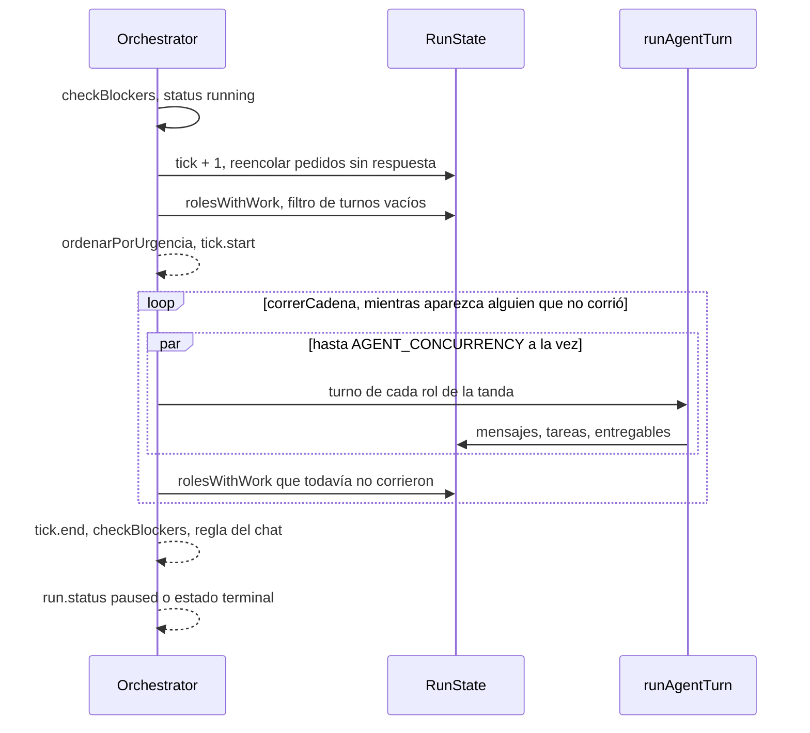
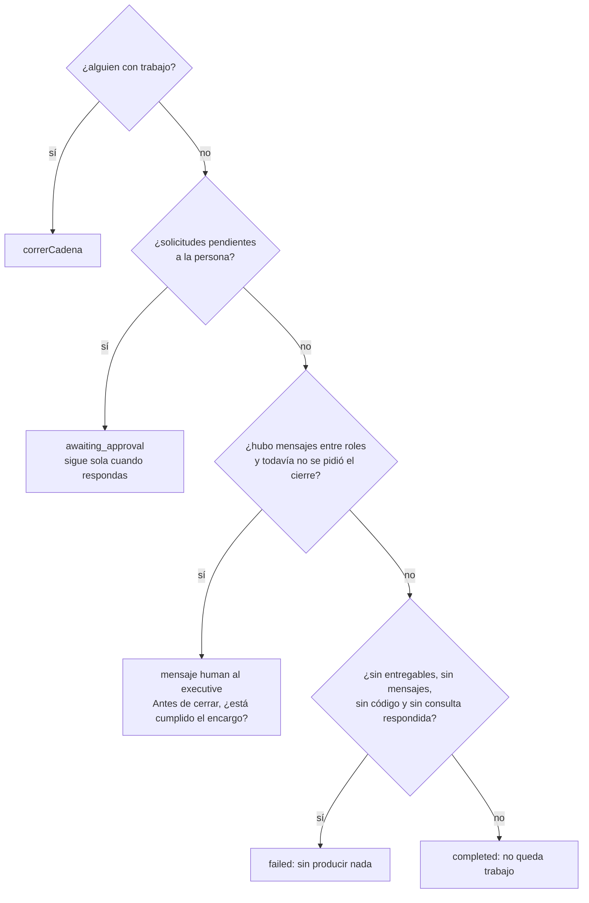
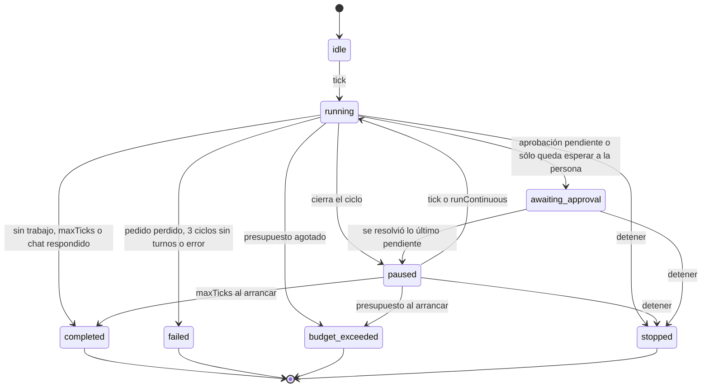

# Scheduler y ciclo de una corrida

`packages/engine/src/scheduler.ts` → `Orchestrator` es el motor de "la empresa
opera sola". Tiene la vida de una corrida en memoria: su estado, sus ciclos, a
quién le toca trabajar y en qué orden, cuándo esperar a una persona y cuándo
cortar. Cada turno lo resuelve [[Motor de agentes|runAgentTurn]]; lo que los
turnos comparten vive en [[Estado de una corrida|RunState]]. Lo construye el
servidor en `Runtime.startRun` ([[Runtime del servidor]]).

Un **ciclo** (tick) toma a los roles con trabajo pendiente y les da su turno, en
paralelo acotado. Lo que un agente entrega en el ciclo lo toma **en el mismo
ciclo** quien todavía no trabajó; quien ya corrió espera al siguiente. Esa es la
regla central: **nadie corre dos veces por ciclo**.

## Qué recibe: `OrchestratorDeps`

| Campo | Qué es | Cómo lo llena el servidor (`Runtime.startRun`) |
|---|---|---|
| `bus` | `EventBus` de la corrida | uno por corrida, suscripto a `store.saveEvent` y al SSE |
| `providers` | `ProviderRegistry` | el del `Runtime` |
| `tools` | `ToolRegistry` de la empresa | `CompanyRuntime.tools` |
| `ledger` | `RunLedger` con el tope de la corrida | `new RunLedger(run.budgetUsd, …)` que guarda cada entrada con `saveLedgerEntry` |
| `concurrency` | turnos en paralelo | `AGENT_CONCURRENCY` (default 4) |
| `fechaHoy` | función que formatea hoy | `toLocaleDateString("es-AR", { day: "numeric", month: "long", year: "numeric" })` |
| `dirDeTrabajo` | salida de la empresa | `exports.dirDeEmpresa(company.id)` |
| `mapaDeContexto` | mapa del vault de contexto | `contexto.mapa(...)` + `mapaDeContextoEnPrompt` |
| `codigo` | apertura del espacio de código por turno | `abrirTurnoDeCodigo(..., { repoPrincipalId: foco.repoId })` |
| `onRunUpdate` | se llama en cada cambio de estado | `store.saveRun(updated)` |

`fechaHoy` es una función y no un valor porque una corrida puede cruzar la
medianoche; `dirDeTrabajo` es un valor porque el directorio no cambia. Los tests no
pasan `fechaHoy` y quedan deterministas.

## Estado interno del `Orchestrator`

| Campo | Para qué |
|---|---|
| `status`, `stopReason` | el estado real; lo publica `setStatus` como `run.status` |
| `running` | hay un ciclo en vuelo: un segundo `tick()` contesta "ya hay un ciclo en curso" |
| `abort` | `AbortController` del ciclo; `stop()` lo dispara |
| `cronTimer` | el intervalo del modo cron |
| `stopRequested`, `pauseRequested` | pedidos de la persona, pendientes de hacerse efectivos |
| `turnosSinHacerNada` | racha de turnos vacíos por rol (livelock) |
| `cierrePedido` | ya se le pidió al responsable que confirme el cierre |
| `respondio` | algún turno trabajó y cerró con texto (corridas del chat) |
| `ticksSinTurnosOk`, `ultimoErrorDeTurno` | ciclos seguidos en los que no terminó ningún turno |

## El snapshot

`Orchestrator.snapshot` es **el estado autoritativo** de la corrida: el `Run` con
el `status` real, el `tick` de `RunState`, el gasto del ledger, el `stopReason` y
`endedAt` (se fija al terminar). `setStatus` llama a `onRunUpdate` en cada cambio,
así que la fila de la base sigue al snapshot; un cambio sin diferencia de estado ni
de motivo no emite nada.

> [!warning] `active.run` queda viejo
> El `Run` que guarda el runtime es el mismo objeto que recibió el
> `Orchestrator`, pero el estado vive en un campo privado: `run.status` no se
> actualiza nunca. Leerlo hacía que una corrida detenida dijera "está en curso".
> Leé siempre `orchestrator.snapshot` ([[Trampas conocidas]]).

## Un ciclo paso a paso

`tick()` es el modo manual y la unidad de los otros dos:

1. Si hay un ciclo en vuelo, devuelve `advanced: false`.
2. `pauseRequested = false`: avanzar es la contraorden de pausar.
3. `checkBlockers()` (terminal, presupuesto, `maxTicks`, aprobaciones
   pendientes). Si bloquea, devuelve el motivo sin avanzar.
4. `running = true`, un `AbortController` nuevo, `run.status = running`.
5. `state.tick += 1`.
6. `reencolarSolicitudesSinResponder()`; si reencoló algo, `log` `warn`.
7. **Quién trabaja**: `rolesWithWork()` menos los que vienen hablando sin hacer
   nada (salvo que tengan un mensaje nuevo), ordenados por `ordenarPorUrgencia`.
   Se emite `tick.start` con esa lista.
8. **Nadie**: rama de cierre (ver [[#Cuando nadie tiene trabajo]]).
9. **Alguien**: `correrCadena` corre la tanda y las que aparezcan.
10. Si **todos** los turnos intentados fallaron, suma a `ticksSinTurnosOk`; a los
    3 seguidos la corrida termina `failed`. Si alguno terminó, vuelve a 0.
11. `tick.end` con los mensajes emitidos y el costo del ciclo.
12. `checkBlockers()` otra vez: puede terminar la corrida (presupuesto,
    `maxTicks`) o dejarla en `awaiting_approval`.
13. Regla del chat: una corrida enfocada ya respondida termina acá (ver
    [[#Corridas enfocadas del chat]]).
14. `run.status = paused` y "ciclo N completado".

Si algo lanza: `BudgetExceededError` termina en `budget_exceeded`; cualquier otro
error va a un `log` `error` y termina en `failed`. En el `finally`,
`running = false`.



## El ciclo es una cadena

`correrCadena(primeros)` corre la primera tanda y, cuando termina, vuelve a mirar
quién quedó con trabajo **sin haber corrido todavía** en este ciclo; lo ordena por
urgencia y lo corre. Repite hasta que no aparezca nadie nuevo.

**Por qué.** Con el retardo total —todo lo emitido entraba recién a las bandejas
del ciclo siguiente— una cadena guion → rodaje → revisión costaba un ciclo entero
por eslabón, y cada ciclo reenvía el contexto completo de cada turno. Medido:
corridas de 269 llamadas a herramientas que avanzaron 3 ciclos; el trabajo estaba
hecho y el tiempo se iba esperando.

**Qué sigue protegido.** El retardo existía para que dos agentes no se escribieran
para siempre dentro de un ciclo. La cota "una vez por rol y por ciclo" lo hace
imposible: la cantidad de turnos de un ciclo está acotada por la de roles. Quien ya
corrió espera al ciclo siguiente, y ahí el retardo sigue vivo. En el test de la
cadena, el CEO delega y el analista —que todavía no había corrido— contesta en la
misma vuelta; la respuesta queda en la bandeja del CEO para el ciclo 2.

## Quién corre y en qué orden

**Con trabajo** (`RunState.rolesWithWork`): bandeja con algo, una tarea `pending`
o `in_progress`, o un turno interrumpido guardado. Una tarea `in_review` o
`blocked` **no** convoca a su dueño.

**Orden** (`ordenarPorUrgencia`). Con la concurrencia acotada, el orden decide el
ciclo: si los lugares se los llevan agentes que esperan a un tercero, el ciclo se
va en turnos que no destraban nada. El criterio es "quién destraba a más gente",
con señales que ya existen y nadie tiene que declarar:

```
puntaje = 10 · pedidos o escalamientos en su bandeja
        +  2 · min(mensajes en bandeja, 5)
        +      min(tareas pending o in_progress, 5)
        −  4 · fallosConsecutivos(rol)
```

1. Quien tiene a alguien esperando su respuesta va primero: ese bloqueo se
   propaga.
2. Después, el peso del trabajo propio.
3. Al final, quien viene encadenando errores: no se lo saltea —a veces el error se
   resuelve con contexto nuevo—, pero deja de comerse el lugar del que sí avanza.

El orden es estable: a igual puntaje se respeta el recibido, para que el reparto
no baile entre ciclos.

## Concurrencia

`runTurns(roleIds)` corre una tanda con `min(concurrency, roleIds.length)`
trabajadores (al menos 1) que toman roles de una cola. Cada trabajador, antes de
tomar el siguiente, mira `stopRequested`; si el rol ya no existe (se borró a mitad
de corrida), lo saltea. A cada turno le pasa objetivo, `maxTicks`, fecha, salida,
mapa, código y el `signal` del ciclo.

- `AGENT_CONCURRENCY` es un **techo**, no un piso. Usarlo como piso partía de que
  el ciclo termina cuando termina el último; con un proveedor que delega un agent
  loop entero por turno, cada turno pesa cientos de miles de tokens, y disparar
  seis a la vez los hizo fallar **a todos juntos**: tres ciclos sin un turno bueno
  y la corrida declarada fallida. Un ciclo más lento es mejor que una corrida
  muerta.
- **El fallo de un agente no tumba la empresa.** Un error del turno se registra
  ("X no pudo completar su turno: …"), ese rol pierde el turno y el resto sigue.
  La excepción es el presupuesto: `BudgetExceededError` se propaga y corta la
  corrida.
- Los turnos escriben en paralelo sobre el mismo `RunState`. Es seguro porque
  JavaScript es de un solo hilo y `RunState` no cede el control entre leer y
  escribir sus estructuras.

> [!danger] El actor no se guarda, se ata
> Con turnos en paralelo, un actor en un campo mutable de `RunState` hacía que un
> agente pisara al otro y los mensajes quedaran firmados por el rol equivocado
> (llegó a haber mensajes de un rol a sí mismo). Cada turno usa
> `RunState.forActor(actorId)`, que captura el actor en el closure. El test de
> regresión corre 4 agentes concurrentes (`scheduler.test.ts` → "cada mensaje queda
> atribuido a quien realmente lo envió"). Ver [[Estado de una corrida#forActor y AgentWorkspace]].

## Livelock de tareas

> [!danger] Una tarea abierta mantenía convocado a quien no la tocaba
> Un agente que habla y no ejecuta nada sigue con la tarea abierta, así que vuelve
> a ser convocado el ciclo siguiente. Se midieron **catorce ciclos seguidos** así,
> hasta morir por límite de ciclos sin producir nada; y como siempre había alguien
> "con trabajo", la revisión de cierre nunca llegaba a ofrecerse.

El scheduler lleva la racha en `turnosSinHacerNada`: un turno con
`herramientas === 0` suma uno, cualquier turno que ejecuta algo la borra. Con
`TURNOS_VACIOS_TOLERADOS = 2` turnos vacíos seguidos, el rol deja de convocarse
por sus tareas (queda un `log` `warn` "lleva 2 turnos hablando sin ejecutar
nada…"); un mensaje nuevo en su bandeja lo reactiva. Dos da margen a un turno en el
que genuinamente no había nada que hacer; el tercero ya es una racha.

## Cuando nadie tiene trabajo



1. **Una pregunta a la persona no mata la corrida.** Si hay solicitudes
   `pending`, la corrida queda `awaiting_approval` ("N solicitud(es) esperando una
   respuesta de la persona a cargo…"). Terminar dejaba la pregunta huérfana: la
   respuesta ya no llegaba a ninguna bandeja. La espera sólo corta cuando no queda
   otra cosa que hacer: mientras otros puedan seguir, siguen.
2. **Revisión de cierre, una sola vez.** Si hubo mensajes entre roles, el primer
   `executive` (o el primer rol) recibe un mensaje `human` con el objetivo
   original: "Si falta algo… asignalo ahora con assign_task o pedilo con
   send_message. Si está todo, terminá tu turno sin llamar ninguna herramienta y
   la corrida cierra." Sin esto la corrida cerraba en silencio apenas se vaciaban
   las bandejas: un encargo de diagnóstico, diseño y precio cerró `completed` con
   sólo el diagnóstico hecho.
3. **Pedido perdido.** Sin entregables, sin mensajes entre roles
   (`fromRoleId !== null`; el encargo no cuenta), sin código escrito y sin una
   consulta del chat respondida, la corrida termina `failed` con un motivo que
   manda a revisar la traza del primer ciclo. Un `completed` se lee como éxito, y
   un encargo de auditoría cerró en dos ciclos sin un mensaje ni un entregable
   "porque no quedaba trabajo".
4. Si no, `completed`: "No queda trabajo pendiente…".

**Código escrito** (`escribioCodigo`) es una entrada exitosa en `activity` de
`HERRAMIENTAS_QUE_ESCRIBEN_CODIGO` (`editar_codigo`, `escribir_codigo`,
`aplicar_parche`, `revertir_codigo`) o de `cli:Edit`, `cli:MultiEdit`,
`cli:Write` o `cli:NotebookEdit`. Un pedido de código del chat no escribe
entregables ni mensajes: su producción son las ediciones, y sin esta regla
terminaba `failed` estando resuelto.

> [!danger] Un entregable de otra corrida desactiva la detección
> `state.artifacts` incluye los entregables de corridas **anteriores** de la
> empresa (se cargan al arrancar). En una empresa que ya produjo algo alguna vez,
> "sin entregables" nunca es cierto, y una corrida en la que nadie hizo nada cierra
> `completed`. Verificado: el mismo guion que termina `failed` sin entregables
> previos termina `completed — No queda trabajo pendiente` con uno solo de otra
> corrida.

## Corridas enfocadas del chat

Una corrida con `run.foco` (`rolId`, `repoId`, `conversacionId` opcional) es un
pedido del [[Chat de IA]] del IDE. El servidor la arma distinta
(`Runtime.startRun`): un solo rol en el organigrama, sin tareas heredadas,
`maxTicks` 4 por default, el repo elegido como principal del turno, y el mensaje
"Pedido desde el IDE" con la historia de la conversación, el pedido y el contexto
adjunto.

El scheduler le aplica dos reglas:

- **Una consulta respondida es trabajo.** "¿Qué tablas hay?" no deja código,
  mensajes ni entregables. Si algún turno usó herramientas y cerró con texto
  (`respondio`), la rama de cierre no la marca `failed`. Un pedido contestado
  **sin** usar ninguna herramienta sí termina `failed`.
- **Un pedido respondido termina en ese ciclo.** Al cerrar el ciclo, si
  `run.foco`, `respondio` y no queda ni una aprobación ni una solicitud pendiente,
  la corrida termina `completed` ("El agente respondió el pedido."). Sin esto, un
  aviso del sistema que llegó con el turno en vuelo —el resultado de una
  aprobación resuelta mientras trabajaba— lo volvía a convocar, y el agente, que
  arranca cada turno sin memoria del anterior, rehacía el pedido: se midió a un
  agente sacar otras diez fotos con el chat ya respondido. Lo que sí tiene que
  seguir no cierra: con una aprobación pendiente, `checkBlockers` ya dejó la
  corrida en `awaiting_approval`; con una pregunta a la persona, la corrida queda
  en pausa y el turno siguiente recibe la respuesta.

`respondio` se prende con cualquier turno que tuvo `herramientas > 0` y un
`summary` no vacío, y no se apaga más; sólo tiene efecto en corridas enfocadas.
Con 4 ciclos, la [[Prompt de un turno#Presión de cierre|presión de cierre]] ya
pide cerrar en el ciclo 3.

## Aprobaciones desde el scheduler

Una herramienta con `requiresApproval` no corre: `executeOne` abre la aprobación
y el turno termina esa vuelta. Los demás roles del ciclo siguen; al cerrar el
ciclo, `checkBlockers` deja **toda la corrida** en `awaiting_approval` ("Hay N
aprobación(es) pendiente(s). Resolvelas para continuar."), y los ciclos
siguientes no arrancan hasta resolverla. Una solicitud a la persona, en cambio,
sólo frena cuando no queda otro trabajo.

`resolveApproval(approvalId, decision, resolution)`:

1. `state.resolveApproval` (sólo si está `pending`; si no, devuelve `false` y la
   API contesta 404).
2. `approval.changed` con el estado nuevo.
3. Si se aprobó, **`ejecutarAprobada`**: corre esa llamada con los argumentos que
   vio la persona —el agente no puede cambiar el SQL después—, a nombre de quien la
   pidió (`forActor(requestedByRoleId)`), con la herramienta del registro de la
   empresa. Emite `tool.start`/`tool.end` con `callId = aprobada-<id>`, registra
   `activity` ("aprobada: …") y recorta el resultado a 6.000 caracteres (el
   `preview` a 400). Si la herramienta o el rol ya no existen, lo dice sin
   ejecutar. Una aprobación pedida con `request_approval` no tiene herramienta: no
   se ejecuta nada.
4. Le escribe al solicitante un `approval_grant` o `approval_deny`: "Tu pedido …
   fue aprobado", el comentario, y si se ejecutó, "Ya se ejecutó X con los
   argumentos aprobados — no la vuelvas a llamar con los mismos. Resultado …".
5. Si no quedan aprobaciones pendientes y el estado era `awaiting_approval`, pasa
   a `paused`.

Aprobar antes sólo avisaba, y si el agente volvía a llamar la herramienta pedía
aprobación otra vez: una migración aprobada no se aplicaba nunca. El servidor,
después de resolver, llama a `Runtime.reanudarSiEsperaba`, que retoma la corrida
en modo continuo si ya no espera nada. Detalle del circuito en
[[Aprobaciones y solicitudes]].

## Solicitudes a la persona y reencolado

- **La corrida tiene su propia copia de las solicitudes.** Resolver una por la API
  toca la base; el runtime la refleja con `RunState.resolverSolicitud` (y la busca
  en la corrida viva que la heredó si la original murió). Sin eso la corrida
  esperaba para siempre una respuesta ya dada.
- **Pedidos sin respuesta.** Al empezar cada ciclo, un mensaje `request` que no se
  contestó y ya no está en la bandeja de su destinatario vuelve a entrar, hasta
  `REENVIOS_MAX = 2` veces por mensaje. Leer un mensaje lo saca de la bandeja: un
  agente que se quedaba sin turnos antes de contestar hacía desaparecer el pedido,
  y la corrida cerraba con él abierto (pasó con tres pedidos delegados, cerrada en
  el ciclo 3 sin entregable). El tope evita que un agente mudo mantenga la corrida
  viva para siempre.

## Modos y bucles

| Modo | Qué lo mueve | Para qué |
|---|---|---|
| `manual` | `tick()`, un ciclo por clic | observar paso a paso |
| `continuous` | `runContinuous()` | dejarla correr hasta un corte |
| `cron` | `startCron(cronIntervalMs)`, un ciclo por intervalo (default 60 s) | simular el ritmo de un negocio |

> [!warning] No confundir `mode: "cron"` con una misión
> `mode: "cron"` pacea los ciclos **dentro** de una corrida. Una
> [[Misiones programadas|misión]] es un encargo que **larga una corrida nueva**.

**`runContinuous()`**:

1. Si está en `awaiting_approval` pero ya no espera nada, pasa a `paused`: sin
   esto, retomar era un no-op.
2. `pauseRequested = false`: continuar es la contraorden de pausar.
3. Mientras no sea terminal ni `awaiting_approval`: si hay `stopRequested`,
   termina `stopped`; si hay `pauseRequested`, queda `paused` ("Pausada por la
   persona a cargo.") y sale; si no, `tick()`. Un ciclo que no avanzó corta el
   bucle.
4. **Espera ante el proveedor.** Si el ciclo terminó con todos los turnos
   fallidos, espera `min(ESPERA_MAXIMA_MS, ESPERA_BASE_MS · 2^(n−1))` antes del
   siguiente y lo anuncia ("el proveedor no está respondiendo. Se reintenta en 30
   s…"). Insistir al toque contra una API saturada quemaba los ciclos en segundos,
   por una demanda que en un minuto baja. La espera se corta si alguien detiene o
   pausa (`esperarCancelable`, que mira cada 500 ms).

Con `ESPERA_BASE_MS = 30.000` y `TICKS_FALLIDOS_TOLERADOS = 3`, las esperas
efectivas son 30 s y 60 s: el tercer ciclo fallido termina la corrida y ya no
espera, así que el tope de 120 s de `ESPERA_MAXIMA_MS` no se alcanza. En los tests
`ORQ_ESPERA_PROVEEDOR_MS=0` (`vitest.config.ts`).

**`startCron(intervalMs)`**: un `setInterval` (con `unref`) que llama a `tick()`
si la corrida no terminó y no hay un ciclo en vuelo.

> [!warning] En cron, esperar a la persona gasta ciclos
> El intervalo no mira `awaiting_approval`: si lo único pendiente es una pregunta
> a la persona, cada intervalo corre un ciclo vacío (sube el `tick`, emite
> `tick.start`) hasta llegar a `maxTicks`, y la corrida termina `completed` con la
> pregunta huérfana. Verificado con `maxTicks` 6. Con aprobaciones pendientes no
> pasa: `checkBlockers` corta antes de incrementar.

`Runtime.resume` siempre llama a `runContinuous`: continuar una corrida manual o
cron —a mano o porque contestaste una solicitud— la deja corriendo en continuo.

## Pausar, detener y continuar

**Pausar es un pedido, no un estado.** En continuo, entre ciclo y ciclo el estado
ya es `paused` y el bucle arrancaba el siguiente igual: el botón parpadeaba y la
corrida seguía. `pause()`:

- detiene el cron y deja `pauseRequested`;
- no hace nada más si la corrida terminó;
- no pisa `awaiting_approval`: esa espera ya frena y su motivo es lo único que
  explica por qué no avanza;
- si no hay ciclo en vuelo, pasa a `paused` enseguida; si lo hay, el turno en
  vuelo **no se aborta** —lo que ya se pagó se termina de cobrar— y la pausa se
  hace efectiva al cerrar el ciclo.

`Runtime.pause` persiste el snapshot, o una caída dejaba la fila informando que
avanzaba. Una pausa pedida durante `awaiting_approval` se descarta cuando la
respuesta reanuda la corrida (`runContinuous` limpia el pedido): contestar
reanuda, apruebes o respondas.

**Detener** (`stop()`) es definitivo: `stopRequested`, sin cron, aborta el
`signal` del ciclo (los turnos en vuelo cortan sus llamadas y quedan guardados
como interrumpidos, aunque ya nadie los retome) y termina `stopped`.

**Continuar**: `tick()` o `runContinuous()`, que limpian `pauseRequested` al
entrar para que una pausa vieja no frene el ciclo que alguien pidió después.

## Los frenos de la corrida

| Freno | Valor | Dónde | Resultado |
|---|---|---|---|
| Presupuesto | `ledger.exhausted` | `checkBlockers`, y `BudgetExceededError` desde un turno | `budget_exceeded` |
| Límite de ciclos | `run.maxTicks` (default `DEFAULT_MAX_TICKS` = 50; 4 en el chat; hasta 500 por API) | `checkBlockers`, antes y después del ciclo | `completed` ("Se alcanzó el límite de N ciclos.") |
| Aprobaciones pendientes | cualquiera | `checkBlockers` | `awaiting_approval` |
| Proveedor caído | `TICKS_FALLIDOS_TOLERADOS = 3` ciclos sin un turno terminado | `tick()` | `failed`, con el último error |
| Espera entre ciclos fallidos | `ESPERA_BASE_MS = 30.000` (`ORQ_ESPERA_PROVEEDOR_MS`), `ESPERA_MAXIMA_MS = max(base, 120.000)` | `runContinuous` | pausa antes de reintentar |
| Turnos vacíos | `TURNOS_VACIOS_TOLERADOS = 2` | `tick()` | deja de convocar por tareas |
| Reenvío de pedidos | `REENVIOS_MAX = 2` | `RunState` | abandona el pedido |
| Concurrencia | `AGENT_CONCURRENCY` = 4 | `runTurns` | techo de turnos simultáneos |

El corte por proveedor caído existe porque una cuenta sin crédito contesta 402 a
todo: sin él, la corrida quemaba sus 50 ciclos en un minuto —cada turno falla al
instante— y terminaba `completed` sin haber hecho nada. Tres ciclos dan margen a un
pico transitorio.

## Estados de la corrida



Los estados de los que no se vuelve son una sola lista, compartida por motor,
servidor y UI: `ESTADOS_TERMINALES` y `esCorridaTerminal` en
`packages/shared/src/schema.ts` (`completed`, `stopped`, `budget_exceeded`,
`failed`). Escribirla en negativo en cada lado hizo que la UI tratara
`awaiting_approval` como terminada y ofreciera borrar una corrida que sólo esperaba
una respuesta.

**Una corrida no sobrevive al reinicio.** El estado vivo está en memoria; al
arrancar, `Store.sanearCorridasHuerfanas` cierra como `stopped` las que quedaron
`running`, `awaiting_approval` o `paused`. La traza queda: se puede reproducir, no
continuar. Las tareas abiertas y las solicitudes pendientes se heredan en la
corrida siguiente ([[Supervisión y continuidad]]).

## Controles desde la UI y la API

- `POST /api/runs/:id/tick | resume | pause | stop`, `POST /api/runs/:id/inject`
  y `POST /api/runs/:id/approvals/:approvalId` ([[API HTTP y SSE]]). `resume`
  contesta sin esperar —retomar dura minutos— y valida antes con
  `Runtime.estaEnMemoria`: una promesa rechazada sin dueño mata el proceso de Node
  con todas las corridas vivas.
- Los botones se muestran según el estado y su `title` explica cuándo conviene
  ([[Pantalla Proceso en vivo]]).
- Sólo se borra lo que ya no se puede continuar (`Runtime.sePuedeContinuar`: en
  memoria y no terminal), y al borrar se suelta del runtime (`olvidarCorrida`), o
  queda un orquestador vivo escribiendo eventos de algo que ya no existe.

## Casos borde y fallas conocidas

| Síntoma | Causa |
|---|---|
| Una corrida donde nadie hizo nada cierra `completed` | hay entregables de corridas anteriores en `state.artifacts` |
| En modo manual, después del ciclo que pide la revisión de cierre, el estado queda `running` hasta el próximo clic (y `tieneCorridaViva` la cuenta como viva) | esa rama devuelve sin pasar a `paused`; verificado |
| En cron, una pregunta a la persona termina en `completed` por `maxTicks` | el intervalo corre ciclos vacíos mientras espera |
| Un rol con una tarea `blocked` o `in_review` no se convoca aunque sea lo único abierto | `rolesWithWork` sólo mira `pending` e `in_progress` |
| Tras un corte por presupuesto, los otros turnos del ciclo terminan su llamada en curso | `Promise.all` rechaza al primer error pero no cancela los demás; cada turno corta al empezar su iteración siguiente |
| Un pedido del chat contestado sin usar herramientas termina `failed` | `respondio` exige al menos una herramienta |

El comentario de cabecera de `scheduler.ts` todavía describe el retardo de un ciclo
completo; el código es la cadena de `correrCadena`.

## Qué fijan los tests

`packages/engine/src/scheduler.test.ts`:

- "la cadena completa avanza en un solo ciclo": el analista contesta en el mismo
  ciclo, la respuesta queda para el CEO, el hilo se conserva y todo sale en la
  traza.
- "respeta la jerarquía": `assign_task` hacia arriba se rechaza en código.
- "corta la corrida cuando se agota el presupuesto".
- "queda esperando en vez de terminar cuando le preguntó algo a la persona" y
  "retoma cuando la solicitud queda resuelta".
- "pausar frena el modo continuo y después se puede continuar".
- "deja de convocar al que habla sin hacer nada": menos de 8 ciclos.
- "no informa éxito cuando nadie produjo nada": `failed`.
- "un pedido de código que editó… no es una corrida vacía" (`cli:Edit`).
- "una consulta del chat que trabajó y respondió no es una corrida vacía; una
  corrida de equipo que sólo habla, sí".
- "un pedido del chat respondido termina ahí": `completed` en el ciclo 1 y diez
  fotos, no veinte.
- "corta la corrida cuando el proveedor rechaza todos los turnos varios ciclos
  seguidos", y anuncia la espera.
- "cada mensaje queda atribuido a quien realmente lo envió" (4 agentes
  concurrentes).
- "aprobar ejecuta la llamada aprobada con sus argumentos…" y "rechazar no
  ejecuta nada".

`packages/engine/src/continuidad.test.ts` fija el orden por urgencia (el pedido
sin contestar primero, el que falla al final, estable ante empates) y que dos
agentes que se escriben sin parar corren una vez cada uno. `memory.test.ts` fija
que un agente caído no tumba a los demás; `roles.test.ts`, que un rol borrado con
la bandeja cargada ya no toma turnos.

## Cómo modificar sin romperlo

- No reintroduzcas el retardo total ni permitas un segundo turno por ciclo: la
  cota por rol es lo que hace imposible el ida y vuelta infinito.
- Una señal nueva de urgencia tiene que salir del estado, no de algo que declare
  el agente.
- Si agregás una forma nueva de producir (un tipo de salida que no es entregable,
  mensaje ni código), sumala a la condición de pedido perdido, o esas corridas van
  a terminar `failed` estando resueltas.
- Un estado terminal nuevo va en `ESTADOS_TERMINALES`, no en una lista local.
- Cualquier llamada nueva al runtime que no se espere (`void`) necesita su
  `.catch` ([[Trampas conocidas]]).

## Fuentes

- `packages/engine/src/scheduler.ts` → `Orchestrator` (`snapshot`, `tick`,
  `runContinuous`, `esperarCancelable`, `startCron`, `stopCron`, `stop`, `pause`,
  `resolveApproval`, `ejecutarAprobada`, `mensajesEntreRoles`, `escribioCodigo`,
  `esperaAlgo`, `correrCadena`, `ordenarPorUrgencia`, `runTurns`,
  `checkBlockers`, `setStatus`, `finish`), `TICKS_FALLIDOS_TOLERADOS`,
  `ESPERA_BASE_MS`, `ESPERA_MAXIMA_MS`, `TURNOS_VACIOS_TOLERADOS`
- `packages/engine/src/state.ts` → `rolesWithWork`, `reencolarSolicitudesSinResponder`,
  `REENVIOS_MAX`, `pendingApprovals`, `resolveApproval`, `resolverSolicitud`
- `packages/shared/src/schema.ts` → `runSchema` (`foco`), `runStatusSchema`,
  `ESTADOS_TERMINALES`, `esCorridaTerminal`, `createRunSchema`
- `packages/tools/src/codigo/index.ts` → `HERRAMIENTAS_QUE_ESCRIBEN_CODIGO`
- `apps/server/src/runtime.ts` → `Runtime.startRun`, `tick`, `resume`,
  `reanudarSiEsperaba`, `pause`, `stop`, `resolveApproval`, `estaViva`,
  `estaEnMemoria`, `sePuedeContinuar`, `tieneCorridaViva`, `olvidarCorrida`,
  `notifyRequester`
- `apps/server/src/routes.ts` → rutas `/api/runs/:id/*`
- `apps/server/src/db.ts` → `Store.sanearCorridasHuerfanas`
- `vitest.config.ts` → `ORQ_ESPERA_PROVEEDOR_MS`
- Tests: `scheduler.test.ts`, `continuidad.test.ts`, `memory.test.ts`,
  `roles.test.ts`

## Ver también

- [[Motor de agentes]] — qué pasa dentro de un turno
- [[Estado de una corrida]] — bandejas, tareas y actividad
- [[Runtime del servidor]] — quién arma y controla la corrida
- [[Aprobaciones y solicitudes]] — el circuito con la persona
- [[Supervisión y continuidad]] — lo que se hereda entre corridas
- [[Chat de IA]] — de dónde vienen las corridas enfocadas
- [[Costos y presupuesto]] — el corte por gasto
- [[Misiones programadas]] — quién larga una corrida sola
- [[Observabilidad y trazas]] — `tick.start`, `tick.end`, `run.status`
