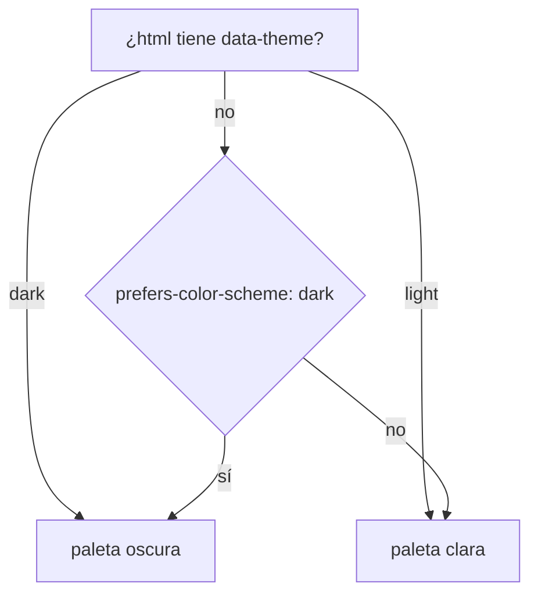

# Sistema de diseño y temas

La UI es **una herramienta profesional densa, no una landing page**
(`apps/web/src/styles.css`, comentario de cabecera). La paleta es neutra y cada
acento es una señal: el color dice qué clase de mensaje viaja o en qué estado
está un servidor, así que se usa con moderación para que signifique algo.

Esta nota cubre los tokens de color, el tema claro/oscuro, Tailwind v4, las
clases propias de `styles.css`, los componentes compartidos (`apps/web/src/ui/`
y `apps/web/src/lib/ui.tsx`) y los íconos. La arquitectura de la UI está en
[[Frontend web]].

## Tailwind v4, configurado desde CSS

No hay `tailwind.config.js`. `styles.css` empieza con `@import "tailwindcss"` e
importa el CSS de React Flow (`@xyflow/react/dist/style.css`); el plugin
`@tailwindcss/vite` hace el resto (`apps/web/vite.config.ts`).

El bloque `@theme` declara los colores **como alias de variables de tema**:

```css
@theme {
  --color-canvas: var(--t-canvas);
  --color-ink: var(--t-ink);
  /* … uno por token … */
  --font-sans: "Inter Variable", ui-sans-serif, system-ui, sans-serif;
  --font-mono: ui-monospace, "SF Mono", Menlo, monospace;
}
```

Con eso Tailwind genera `bg-canvas`, `text-ink`, `border-line`, `bg-surface-2`,
`text-ink-faint`, `bg-accent/15`… Los modificadores de opacidad (`/15`, `/40`)
funcionan sobre variables porque Tailwind v4 los resuelve con `color-mix`. La
indirección es la idea central: **"canvas" e "ink" significan lo mismo en las
clases de siempre, y el tema se cambia sin tocar un componente**.

`body` toma `background: var(--color-canvas)`, `color: var(--color-ink)`, la
fuente sans, `font-feature-settings: "cv02", "cv03", "cv04"` (alternativas de
Inter) y suavizado de fuente. La fuente viene de `@fontsource-variable/inter`,
importada en `main.tsx`: empaquetada, sin pedidos a un CDN.

## Los tokens

`--t-*` en `styles.css`. Todos en `oklch`, con el mismo tono de base (260) para
los neutros.

| Token | Uso | Claro | Oscuro |
|---|---|---|---|
| `--t-canvas` | fondo de página y de campos | `oklch(0.97 0.003 260)` | `oklch(0.16 0.005 260)` |
| `--t-surface` | paneles, header | `oklch(0.995 0.002 260)` | `oklch(0.2 0.006 260)` |
| `--t-surface-2` | hover, selección, chips | `oklch(0.945 0.004 260)` | `oklch(0.245 0.007 260)` |
| `--t-line` | bordes, rieles, puntos del lienzo | `oklch(0.88 0.005 260)` | `oklch(0.32 0.008 260)` |
| `--t-ink` | texto principal | `oklch(0.24 0.01 260)` | `oklch(0.95 0.003 260)` |
| `--t-ink-dim` | texto secundario, rótulos | `oklch(0.45 0.01 260)` | `oklch(0.72 0.006 260)` |
| `--t-ink-faint` | metadatos, texto terciario | `oklch(0.6 0.008 260)` | `oklch(0.55 0.006 260)` |
| `--t-accent` | acción primaria, selección, "en curso" | `oklch(0.55 0.17 245)` | `oklch(0.72 0.15 235)` |
| `--t-ok` | listo, éxito, conectado | `oklch(0.55 0.15 155)` | `oklch(0.75 0.16 155)` |
| `--t-warn` | atención, pausa, reconectando | `oklch(0.6 0.13 75)` | `oklch(0.8 0.15 85)` |
| `--t-danger` | error, borrar | `oklch(0.55 0.2 25)` | `oklch(0.68 0.19 25)` |
| `--t-request` | mensaje de pedido | = accent | = accent |
| `--t-response` | respuesta | = ok | = ok |
| `--t-escalation` | escalamiento | `oklch(0.6 0.15 60)` | `oklch(0.78 0.16 60)` |
| `--t-approval` | aprobación, "en revisión", modelo `smart` | `oklch(0.55 0.17 300)` | `oklch(0.72 0.16 300)` |

En claro las señales son **más saturadas y menos luminosas** que en oscuro, para
sostener el contraste sobre blanco; el papel está "apenas entibiado".

## Tema claro, oscuro o del sistema

Tres bloques en `styles.css` deciden qué valores aplican:

1. `:root` — los valores claros.
2. `[data-theme="dark"]` — elección explícita de oscuro.
3. `@media (prefers-color-scheme: dark) { :root:not([data-theme="light"]) }` —
   sin elección explícita, manda el sistema.



> [!warning] La paleta oscura está escrita dos veces
> El bloque `[data-theme="dark"]` y el del media query repiten los mismos
> valores. Cambiar un color oscuro en uno solo deja el modo "sistema" y el modo
> "oscuro" distintos.

**Elección y persistencia** (`apps/web/src/ui/tema.tsx`): `Tema = "system" |
"light" | "dark"`, guardado en `localStorage` bajo la clave **`orq-tema`**.
`aplicar(tema)` pone `document.documentElement.dataset.theme` y guarda; con
`system` borra el atributo y la clave (no marcar nada es lo que deja mandar al
media query). `BotonDeTema`, en el header, rota `system → light → dark` con el
ícono `Monitor`, `Sun` o `Moon` y un `title` que dice el tema actual y el
siguiente.

**Antes del primer pintado**: `apps/web/index.html` trae un script en línea que
lee `orq-tema` y, si es `dark` o `light`, pone `data-theme` en `<html>` antes de
cargar React. Sin eso la página se pintaba clara y saltaba a oscura al montar.

> [!note] Casos borde
> - `BotonDeTema` arranca en `system` y lee lo guardado en un `useEffect`: el
>   ícono del botón puede cambiar un instante después de cargar (los colores no,
>   ya los puso el script).
> - Ni el script ni `tema.tsx` envuelven `localStorage` en `try/catch`: un
>   navegador que bloquea el almacenamiento del sitio tira una excepción, y como
>   la UI no tiene *error boundary* ([[Frontend web]]) eso puede dejarla en blanco.

## Clases propias de `styles.css`

| Clase / regla | Dónde | Qué hace y por qué |
|---|---|---|
| `.tabular` | Tablero | `font-variant-numeric: tabular-nums`: cifras alineadas en columna (costos, tokens, duraciones) |
| `*` scrollbar | todo | `scrollbar-width: thin` y color de `line`: en una UI densa la barra por defecto de macOS pesa |
| `.is-thinking` + `@keyframes think-pulse` | nodo del organigrama | halo del color de acento que late cada 1,4 s mientras el agente piensa: "acá está pasando algo" |
| `.punto-en-curso` + `punto-latiendo` | cronología de Proceso | el punto de una herramienta que arrancó y no terminó; el único movimiento continuo del panel, distingue "sigue trabajando" de "terminó y no dijo nada" |
| `.fila-traza` + `@starting-style` | cronología | las filas nuevas entran desde abajo en 250 ms; `@starting-style` evita el parpadeo del estado final |
| `.toast-entrando` | `ToastProvider` | los toasts entran desde abajo en 180 ms |
| `.react-flow__edge.edge-active` + `dash-flow` | aristas del organigrama | trazo de 2,5, sombra y guiones que corren mientras un mensaje viaja |
| `.mcp-flash` + `@keyframes flash` | — | pensada para el destello servidor→agente del Hub; **ninguna pantalla la usa hoy** |
| `.react-flow__attribution` | organigrama | oculta la marca de React Flow |

Con `prefers-reduced-motion: reduce` las filas entran sin animar y dejan de latir
el punto y el nodo: con la traza llegando por SSE hay decenas de filas por minuto.

## Colores fuera de los tokens

- **Tono por área**: `tonosPorArea(departments)` (`routes/OrgGraph.tsx`) reparte
  un tono por departamento con el ángulo áureo (`i × 137.508 mod 360`) según su
  **posición**, no un hash del id (hasheando, ids con el mismo prefijo caían en
  tonos casi iguales). Se usa como `oklch(0.72 0.14 <tono>)` en avatares y
  tarjetas, `oklch(0.62 0.09 <tono>)` en las líneas de reporte y
  `oklch(0.45 0.12 <tono>)` en el consumo del Tablero. **Son iguales en los dos
  temas**: no pasan por tokens.
- `ModeloBadge` usa `var(--t-*)` con `color-mix(in oklch, … 14%, transparent)`
  de fondo.
- Excepciones explícitas: el botón "Autorizar" del Hub (`bg-accent text-white`),
  el fondo blanco del PDF y la imagen en Salida y el negro del video.

## Componentes compartidos

`apps/web/src/ui/index.ts` es la librería: reexporta las cinco primitivas
históricas de `lib/ui.tsx` y exporta lo nuevo de `ui/`. La regla escrita en ese
archivo es **importar siempre de `ui/index.js`**, para que `lib/ui.tsx`
desaparezca sin tocar a nadie.

> [!note] La migración está a medias
> Proceso, Tablero, Hub, Solicitudes, Memoria, Salida y `Settings.tsx` todavía
> importan de `../lib/ui.js`. Proyectos, Tienda y el IDE ya usan `ui/index.js`.

| Componente | Archivo | Quién lo usa |
|---|---|---|
| `Panel`, `Button`, `Status`, `Empty`, `Field`, `inputClass` | `lib/ui.tsx` | todas las pantallas |
| `money`, `tokens`, `peso`, `relativeTime` | `lib/ui.tsx` | cabeceras, fichas, costos |
| `Modal`, `ConfirmDialog` | `ui/Modal.tsx` | Memoria (Modal); IDE (ConfirmDialog) |
| `ToastProvider`, `useToast` | `ui/Toast.tsx` | `App`; Proyectos, Tienda, IDE |
| `Badge`, `Skeleton`, `IconButton`, `Tabs` | `ui/piezas.tsx` | Tienda, `ProyectoLayout`, IDE; `IconButton` sin uso |
| `BotonDeTema` | `ui/tema.tsx` | header |
| `PulsoDeCorrida` | `ui/PulsoDeCorrida.tsx` | header |
| `NombreEditable` | `ui/NombreEditable.tsx` | Proyectos, IDE |
| `ModeloBadge`, `familiaDeModelo`, `nombreCortoDeModelo` | `ui/modelo.tsx` | organigrama |

### Primitivas (`lib/ui.tsx`)

- **`Panel({title, actions, children, className})`**: `section` con
  `flex min-h-0 min-w-0 flex-col`, borde y fondo `surface`; header opcional
  (título en mayúsculas chicas + acciones) y cuerpo `min-h-0 flex-1
  overflow-auto`. El `min-w-0` es obligatorio: como ítem de grilla o flex, el
  default `min-width: auto` no lo deja achicarse y un texto largo desborda sobre
  las columnas vecinas.
- **`Button`**: variantes `default`, `primary` (acento al 15%), `danger`, `ghost`;
  `disabled` con `opacity-40` y cursor prohibido; `type` `button` por defecto.
- **`Status({value, label})`**: una píldora con punto. `STATUS_STYLES` mapea
  `ready`/`completed` a ok, `running` a acento, `connecting`/`reconnecting`/
  `paused` a warn, `awaiting_approval` a approval, `error`/`failed`/
  `budget_exceeded`/`stopped` a danger, `disabled`/`idle` a neutro; cualquier
  otro valor, neutro. Sin `label` muestra el valor crudo en inglés (`running`).
- **`Empty`**: texto chico y centrado para estados vacíos.
- **`Field({label, hint})`**: rótulo en mayúsculas chicas, el control y una
  pista debajo.
- **`inputClass`**: la clase de todos los campos (fondo `canvas`, borde que se
  vuelve acento al enfocar).
- **`money(v)`**: `US$` con 5 decimales bajo un centavo, 3 si no.
- **`tokens(v)`**: `1.20M`, `348k`, `812`: el orden de magnitud es lo que
  informa.
- **`peso(bytes)`**: GB/MB con un decimal, KB con **piso de 1 KB** (un `.md` de
  200 bytes mostrado como "0 KB" parece vacío).
- **`relativeTime(at)`**: `hace Ns`, `hace Nmin`, `hace Nh` (no pasa a días).

### `Modal` y `ConfirmDialog` (`ui/Modal.tsx`)

`Modal({abierto, titulo, onCerrar, children, ancho = "max-w-lg"})` usa
**`<dialog>` nativo**: `showModal()`/`close()` según `abierto`, así el foco
atrapado, Escape y el fondo vienen gratis y sin dependencias (antes cada pantalla
armaba el suyo con divs y ninguno se comportaba igual). Escape dispara `onClose`
→ `onCerrar`; un click en el fondo (el propio `dialog`) también cierra. Título
con botón `X`, cuerpo con `max-h-[70vh]` y scroll.

`ConfirmDialog({abierto, titulo, detalle, confirmar = "borrar", pendiente,
onConfirmar, onCancelar})`: la confirmación destructiva en un solo patrón,
"cancelar" fantasma y el botón de peligro que dice "trabajando…" mientras
`pendiente`. Hoy sólo la usa el IDE; el resto de las pantallas conserva sus
confirmaciones en línea ("sí, borrar" / "cancelar").

### Toasts (`ui/Toast.tsx`)

`ToastProvider` pone un contexto y `useToast()` devuelve
`avisar(mensaje, clase = "info")`, con `clase` `ok`, `error` o `info` (íconos
`CheckCircle2`, `CircleAlert`, `Info`). Guarda **hasta cuatro** a la vista (las
tres últimas más la nueva) centradas abajo, con `role="status"`. Se cierran solos
a los **5 s**, o a los **9 s** si son error —hay que poder leerlos—, o con su
`X`. Existen porque el resultado de una acción ("conectado, 12 herramientas") se
perdía o se pintaba con un markup distinto en cada pantalla.

### Piezas (`ui/piezas.tsx`)

- `Badge({tono})`: `neutro`, `ok`, `warn`, `danger`, `accent`.
- `Skeleton({className})`: bloque que late; reemplaza los "Cargando…" sueltos.
- `IconButton({icono, title, …})`: `title` obligatorio, también como
  `aria-label` (el ícono solo no alcanza). Exportado, sin uso todavía.
- `Tabs({valor, opciones, onCambiar})`: pestañas controladas con
  `role="tablist"`.

### `NombreEditable` (`ui/NombreEditable.tsx`)

Renombrar en el lugar, como F2 en el explorador de VS Code: lápiz al pasar el
mouse (o doble click sobre el nombre), **Enter guarda, Escape cancela y salir del
campo guarda** —quien escribió un nombre y clickeó afuera lo quería—. Si
`onGuardar` falla (nombre repetido, corrida en curso), el campo queda abierto con
el motivo en rojo en vez de volver en silencio al nombre viejo. `maxLength` 120;
un nombre vacío o igual al actual cierra sin pedir nada. Con `deshabilitado`, el
lápiz no responde y su `title` es `motivoDeshabilitado`.

### `PulsoDeCorrida` (`ui/PulsoDeCorrida.tsx`)

La barra del header con la última corrida del proyecto. Consulta
`["progreso", companyId]` cada **5 s si la corrida está viva y 30 s si no**, y
lleva su propio reloj de 1 s para que el contador avance entre consultas (pedirle
la hora al servidor una vez por segundo sería gastar una llamada para saber algo
que el cliente ya sabe). Sin corrida no dibuja nada. La salud sale de
`calcularProgreso` ([[Frontend web]]):

| Salud | Color | Ícono | Texto |
|---|---|---|---|
| `trabajando` | ok | `Activity` | corriendo |
| `callado` | warn | `CircleDot` | sin novedad |
| `sin-señal` | danger | `TriangleAlert` | sin señal |
| `detenida` | ink-faint | `PauseCircle` | detenida |

Muestra el tiempo transcurrido (`tabular-nums`, para que no baile al cambiar de
dígito), "ciclo N/M", "N acciones" y "señal hace X" salvo con la corrida
detenida. El `title` trae el objetivo (160 caracteres), ciclo, acciones, última
señal y el motivo de detención.

### `ModeloBadge` (`ui/modelo.tsx`)

Con qué modelo corre un agente, dicho en un ícono que entra en una tarjeta de
208 px. Una empresa puede mezclar suscripciones y, con el
[[Escalado por dificultad]], el modelo cambia de un turno a otro: sin esto el
organigrama muestra seis agentes idénticos.

`familiaDeModelo(slug, tier)` mira **el slug primero y el tier después**: el tier
dice qué se pidió, el slug qué respondió.

1. Sufijo `-free` o `:free` → `free` (gana sobre la familia: un mismo modelo
   gratis y pago no cuestan lo mismo).
2. `opus` o `-pro` → `smart`; `sonnet` → `standard`; `haiku`, `flash`, `mini`,
   `nano` → `cheap`.
3. Si no, el tier si es uno de los cuatro; si no, `desconocido`.

| Familia | Ícono | Color |
|---|---|---|
| `smart` | `Brain` | `--t-approval` |
| `standard` | `Sparkles` | `--t-accent` |
| `cheap` | `Zap` | `--t-warn` |
| `free` | `Gift` | `--t-ok` |
| `desconocido` | `Cpu` | `--t-ink-faint` |

`nombreCortoDeModelo(slug)` se queda con el último segmento, sin `-free`/`:free`
ni la fecha del snapshot (`-20251001`); `null` → "sin correr". El `title` junta
slug, proveedor, "elegido por dificultad", el motivo del motor y la familia. El
escalado se marca con **un punto** después del nombre, no con otra palabra: no hay
lugar, y lo que importa es que se note que el modelo lo eligió el sistema.

## Íconos

`lucide-react` ^1.31. Convención: el ícono es un componente con
`className="size-3.5"` (o `size-4`) y `aria-hidden`; el texto o el `title` dicen
lo que el ícono sugiere. `ModeloBadge` y `PulsoDeCorrida` usan `size` y
`strokeWidth` numéricos.

La Tienda los resuelve **por nombre** (`routes/Tienda.tsx` → `IconoDe`): el
catálogo trae el nombre en kebab-case, se pasa a PascalCase y se busca en el
objeto `icons`; si no existe, cae en `Search`.

> [!warning] Cinco artículos de la tienda muestran una lupa
> Lucide 1.31 ya no trae íconos de marca: `github`, `gitlab`, `youtube`,
> `chrome` y `slack` no existen y esos artículos (GitHub, GitLab, YouTube
> transcript, Puppeteer, Slack) se dibujan con la lupa genérica. El test del
> catálogo valida el esquema, no que el ícono exista.

Algunos controles usan glifos de texto en vez de íconos: `▶ un ciclo`,
`▶▶ seguir sin parar`, `❚❚ pausar`, `■ terminar`, `⚙` (herramienta en curso),
`⚡` (porcentaje de caché), `↓`/`↑` (tokens y descargas), `✓`/`✕`, `⏱`, `▾`/`▸`.

## Reglas

- Colores sólo por token (`bg-surface`, `text-ink-dim`…); nada de `dark:`: el
  tema lo resuelven las variables.
- Densidad: texto de `[9px]` a `xs`, rótulos en mayúsculas chicas con
  `tracking-wide`.
- `min-w-0` en todo ítem de grilla o flex que contenga texto.
- Botón de sólo ícono → `title` obligatorio.
- Estados de carga (`Skeleton` o `Empty`), vacío y error explícitos.

## Cómo extender

- **Un color nuevo**: el alias en `@theme` y el valor en **tres** bloques
  (`:root`, `[data-theme="dark"]` y el media query). Olvidar uno rompe un tema.
- **Un componente nuevo**: en `apps/web/src/ui/`, exportado desde `index.ts`.
- **Una animación**: con su excepción en el bloque de `prefers-reduced-motion`.

## Qué fijan los tests

`apps/web/src/ui/modelo.test.ts`:

- reconoce las familias de Claude por el slug (`opus`, `sonnet`, `haiku`, un slug
  con fecha);
- lo gratuito gana sobre la familia (`-free` de opencode, `:free` de
  OpenRouter);
- cae al tier cuando el slug no dice nada; sin nada, `desconocido`;
- el slug manda sobre el tier;
- `nombreCortoDeModelo` se queda con el último segmento y sin la fecha;
- un rol que todavía no corrió dice "sin correr".

## Fuentes

- `apps/web/src/styles.css` — `@theme`, tokens `--t-*`, tres bloques de tema,
  animaciones.
- `apps/web/index.html` — script de tema previo al pintado.
- `apps/web/src/ui/index.ts`, `Modal.tsx`, `Toast.tsx`, `piezas.tsx`,
  `tema.tsx`, `NombreEditable.tsx`, `PulsoDeCorrida.tsx`, `modelo.tsx`.
- `apps/web/src/lib/ui.tsx` — `Panel`, `Button`, `Status`, `STATUS_STYLES`,
  `Empty`, `Field`, `inputClass`, `money`, `tokens`, `peso`, `relativeTime`.
- `apps/web/src/routes/OrgGraph.tsx` → `tonosPorArea`;
  `apps/web/src/routes/Tienda.tsx` → `IconoDe`.

## Ver también

- [[Frontend web]]
- [[Pantalla Empresa y organigrama]] — dónde se ven el pulso del nodo y los tonos
- [[Pantalla Tienda]] — los íconos resueltos por nombre
- [[Escalado por dificultad]] — lo que cuenta `ModeloBadge`
