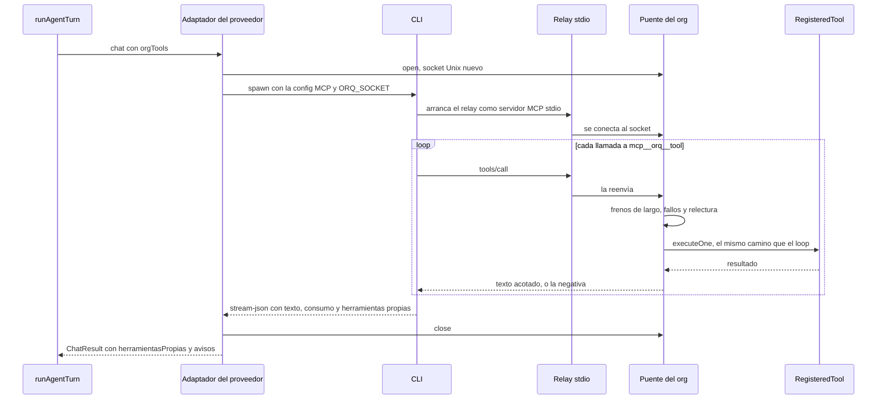
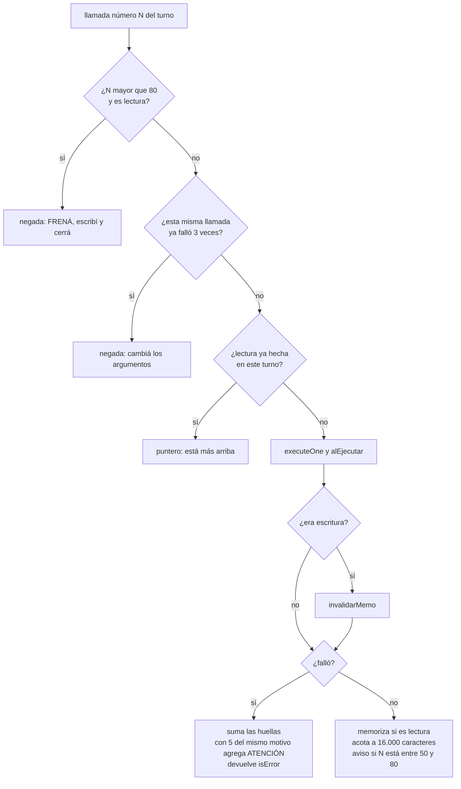

# Turnos delegados a un CLI

Algunos proveedores no devuelven `tool_calls`: le pasan el turno entero al CLI de
una suscripción (`claude-code`, `opencode`), que corre **su propio** agent loop con
sus propias herramientas. El motor ve una sola iteración. Para que ese agente pueda
coordinar con la empresa, el motor le presta las herramientas del org como un
**servidor MCP que vive en su propio proceso** (`packages/engine/src/claude-mcp.ts`
→ `createClaudeMcpBridge`), y como los frenos del loop no llegan adentro del CLI,
los vuelve a aplicar en la puerta de ese servidor (`claude-mcp.ts` más
`packages/engine/src/acotar.ts`).

Esta nota es el lado del motor. Cómo cada CLI se lanza, qué permisos recibe y cómo
se rescata un turno que cerró mal está en [[Proveedor claude-code]] y
[[Proveedor opencode]].

## Qué cambia cuando un proveedor delega

| | Loop propio | Turno delegado |
|---|---|---|
| Cómo pide herramientas el modelo | `tool_calls` que ejecuta `executeCalls` | llamadas MCP a `mcp__orq__<tool>` que ejecuta el puente |
| Iteraciones que ve el motor | varias | una (el CLI vuelve con el texto final) |
| Memo de lecturas | `lecturasDelTurno` del loop | `lecturas` del puente, con la misma regla de invalidación |
| Defensa contra el contexto que crece | compactar **después** (`compactarConversacion`) | acotar **al entrar** (`acotarResultado`) |
| Freno de largo | `presupuestoDeIteraciones` | 50 llamadas avisa, 80 niega lecturas |
| Tolerancias de fallos | cortan el turno | niegan la llamada o avisan en el resultado |
| Corte por tiempo | 120 s por llamada, con reintentos | 10 a 30 minutos por turno (ver abajo) |
| Herramientas contadas | `calls.length` | `alEjecutar` del puente + `herramientasPropias` del CLI |
| Aprobación pendiente | corta el turno (`awaitingApproval`) | el CLI recibe el aviso y sigue; la corrida frena al cerrar el ciclo |

## `delegaElTurno`

`LlmProvider.delegaElTurno` (`packages/llm/src/types.ts`) marca a los proveedores
que corren su propio loop. `runAgentTurn` lo mira y, si está, crea el puente y lo
manda en el request como `orgTools`. Es una propiedad del proveedor y no una lista
de ids en el motor: sumar un CLI no puede obligar a tocar `loop.ts`. Hoy lo
declaran `ClaudeCodeProvider` y `OpenCodeProvider`.

El puente recibe todo lo que el turno ya preparó: `bus`, `state`, `role`,
`byName` (las herramientas **que eligió el router** para este turno), el
`ToolContext`, el directorio de salida, el worktree si trabaja sobre código, y
`alEjecutar`, que suma al contador del turno.

## Cómo viaja una llamada

- **Transporte.** Un socket Unix en el directorio temporal
  (`orq-<pid>-<timestamp>-<azar>.sock`) y un relay mínimo,
  `packages/llm/src/adapters/claude-code-relay.mjs`, que conecta al socket de
  `ORQ_SOCKET` y pasa stdin → socket y socket → stdout. El CLI lo lanza como un
  servidor MCP stdio cualquiera: Claude Code lo lee de un `--mcp-config` en un
  archivo temporal; opencode, de la sección `mcp` de su config del turno. El puente
  es agnóstico del CLI: lo único que cambia es cómo cada uno declara el servidor.
- **Servidor.** Por cada conexión al socket se crea un `Server` del SDK de MCP
  (`@modelcontextprotocol/sdk`) con dos handlers: `tools/list` devuelve nombre,
  descripción y esquema de cada herramienta de `byName`; `tools/call` pasa por
  `handleToolCall`.
- **Mismo camino que el loop.** La llamada se ejecuta con `executeOne`: las
  herramientas ven el mundo igual y emiten los mismos eventos (`tool.start`,
  `tool.end`, efectos de coordinación, aprobaciones) y la misma actividad.

## La sesión: `OrgToolsSession`

`open()` crea un socket y un servidor **nuevos por delegación**, para que turnos
de `claude-code` en paralelo no compartan estado ni choquen con nombres de
herramientas.

| Campo | Qué es |
|---|---|
| `socketPath` | el socket donde escucha el puente |
| `serverName` | `"orq"`: define el prefijo `mcp__orq__` |
| `allowedTools` | `mcp__orq__<nombre>` por cada herramienta de `byName` |
| `cwd` | el worktree si el turno trabaja sobre código; si no, la salida de la empresa |
| `codigo` | `{ cwd, escritura }` cuando hay worktree: con `escritura`, el CLI recibe sus propias herramientas de edición |
| `ocupada()` | hay una herramienta del org corriendo |
| `close()` | deja de escuchar el socket |

**Lo que sobrevive a una reconexión.** Los fallos, las lecturas, el largo y las
herramientas en vuelo viven en el puente —uno por turno—, no en cada conexión: el
CLI puede reconectar su socket a mitad de turno y los frenos tienen que seguir
contando. Los tests lo ejercitan abriendo una conexión nueva por cada llamada.

## Qué hace el puente con cada llamada

`handleToolCall(deps, call, fallos, lecturas, largo)`:

1. `largo.llamadas += 1` (cuenta todas, también las negadas).
2. **Tope de largo**: pasadas 80, una lectura (`readOnly`) se niega con
   `isError`: "FRENÁ: llevás N llamadas en este turno y no se aceptan más
   lecturas… Escribí AHORA lo que averiguaste —write_artifact, update_task,
   send_message siguen habilitados— y cerrá el turno con un resumen."
3. **Llamada idéntica fallida**: si esa huella (herramienta + argumentos) ya falló
   `TOLERANCIA_IDENTICA = 3` veces, se niega sin ejecutar ("esta llamada exacta …
   ya falló 3 veces y no se ejecuta de nuevo").
4. **Relectura**: una lectura con la misma huella (`huellaDeLectura`, la del loop)
   devuelve el puntero de `punteroDeRelectura` y deja un `log` `info` con los
   caracteres ahorrados.
5. `executeOne` y `alEjecutar()`.
6. Si no era lectura, `invalidarMemo(lecturas, nombre)` —**aunque haya fallado**:
   pudo tocar algo a medias—.
7. Si falló: suma las huellas que devolvió `executeOne`; si la de motivo llegó a
   `TOLERANCIA_MOTIVO = 5`, agrega "ATENCIÓN: … La pared no se mueve: dejá de
   probar variantes y verificá el dato de base…"; devuelve el error **entero** con
   `isError`.
8. Si salió bien: si es lectura, memoriza su largo; acota el texto
   (`acotarResultado`); entre la llamada 50 y la 80 le pega el aviso de largo; si
   recortó, `log` `info`.

## Los tres frenos de la puerta

El motor ya se defiende del contexto que crece al cuadrado con
`compactarConversacion`, pero esa defensa actúa sobre **su** conversación, y un
turno delegado no la tiene: el CLI corre su loop con su propia conversación. La
defensa había quedado del lado equivocado de la frontera.

Medido en una corrida real de seis agentes: **21.070.000 tokens de entrada para
132.000 de salida** (160 a 1), con el 96-100% servido desde caché. El caché
abarata pero **no exime**: bajo suscripción esos tokens igual consumen la ventana
de uso. Y el reparto dice dónde está: el agente que más navegó gastó 11,1 millones
él solo, porque cada resultado se reenvía en todas las iteraciones que le siguen.

**La regla se invierte al cruzar la frontera.** En el loop propio se compacta
*después*: un resultado se usa en la vuelta siguiente y recién ahí estorba. En el
camino delegado no hay un después —la conversación no vuelve nunca al motor—, así
que lo que no se acota **al entrar** no se puede acotar más.

### 1. Memo de relecturas

Una lectura idéntica dentro de la misma delegación devuelve un puntero: el
contenido completo sigue **más arriba en la conversación del CLI**, así que no se
pierde nada; se deja de pagar por segunda, tercera y cuarta vez. El texto del
puntero también desarma el intento de paginar con un argumento que no existe ("si
intentaste paginar con un argumento que la herramienta no declara, ese argumento
se ignora y devuelve todo igual"). Sólo se memoriza lo que salió bien, y se
invalida con la **misma** regla del loop (`invalidarMemo`): cuando el puente no
invalidaba, un leer → editar → leer devolvía el puntero a la versión anterior a la
edición.

**No hay memo entre turnos**, y no tiene que haberlo: entre turnos la
conversación del CLI se reinicia, y un puntero le sacaría al agente un documento
que ya no tiene.

### 2. Tope de tamaño: `TOPE_RESULTADO`

| Constante | Valor | Por qué |
|---|---|---|
| `TOPE_RESULTADO` | 16.000 caracteres | el entregable más grande de la empresa medida son 11.127 caracteres y la mediana 3.881: ninguna lectura de trabajo se toca |
| `COLA` | 1.500 caracteres | se conserva el final, donde suelen estar el total y las conclusiones |

Lo que pasa del tope se corta **al medio**: los primeros 14.500 caracteres, un
aviso y los últimos 1.500. El aviso dice cuántos caracteres no se enviaron, por qué
(todo lo que entra se reenvía en cada vuelta) y **cómo pedir menos con argumentos
que la herramienta declara de verdad**, leídos de su esquema y filtrados por la
lista `ACOTADORES` (`section`, `seccion`, `folder`, `carpeta`, `ruta`, `path`,
`query`, `pregunta`, `filtro`, `filter`, `role`, `rol`, `kind`, `tipo`, `limit`,
`limite`, `desde`, `archivos`, `patron`, `estado`, `status`). Si no declara
ninguno, lo dice: "no inventes uno (start, page, offset y parecidos se ignoran y te
devuelven todo de nuevo)". Sugerir `start` o `page` es exactamente lo que costó
**534k tokens de entrada para 2k de salida**.

Con 16.000 un agente que abre su guion lo recibe entero —la mitad del producto— y
sí se cortan listados de cientos de archivos, volcados de página del navegador y
documentos patológicos como el de 40k que entró once veces. Subirlo es seguro;
bajarlo de unos 12.000 empieza a partir entregables reales.

> [!warning] Números acoplados
> `read_artifact` devuelve el documento entero hasta `TOPE_ENTERO = 15.000`
> caracteres (`packages/tools/src/coordination.ts`) y `leer_codigo` lee
> `LINEAS_POR_LECTURA = 350` líneas con tope de 15.000 caracteres
> (`packages/tools/src/codigo/index.ts`), los dos calculados para caber en
> `TOPE_RESULTADO`. Mandar más sería mandar algo que llega cortado: si movés uno,
> mirá los otros.

Sólo se acota lo que salió bien: un error vuelve entero, y suele ser corto.

### 3. Freno por largo de la delegación

| Constante | Valor |
|---|---|
| `AVISO_DE_LARGO` | 50 llamadas |
| `TOPE_DE_LARGO` | 80 llamadas |

Es el freno que más pega, porque el costo de un turno delegado es **cuadrático en
su largo**: cada resultado queda en la conversación del CLI y se reenvía en todas
las vueltas siguientes, así que un turno de N llamadas paga del orden de N². Se
midieron turnos de **145, 112 y 108 llamadas contra una mediana de 21**; partir el
de 145 en cuatro de 36 cuesta cuatro veces menos por pura aritmética, sin que nadie
trabaje menos.

Entre la llamada 50 y la 80, cada resultado exitoso lleva pegado "[Llevás N
llamadas en este turno. A partir de 80 no se aceptan más lecturas: andá cerrando…]".
Va pegado al resultado porque es lo único que el agente lee: un freno que sólo
existe en el prompt de sistema queda diez mil tokens atrás. Pasadas las 80, se
niegan las **lecturas** y pasan las escrituras. La asimetría es el punto: lo que
alarga un turno es explorar y lo que lo cierra es entregar; negar todo le sacaría
al agente la posibilidad de guardar lo que ya averiguó. El trabajo sigue en el
ciclo próximo, con la conversación limpia.

Proyectado sobre los 16 turnos reales medidos: **35,7% menos caracteres
reenviados, sin tocar 13 de ellos** —sólo corta la cola patológica—. Los otros dos
frenos no ahorraron nada en esas corridas, porque los agentes leían por secciones
y los entregables eran chicos, y está bien: son un seguro contra una patología
documentada que hoy no ocurre.

## Tolerancias de fallos dentro del CLI

`TOLERANCIA_IDENTICA = 3` y `TOLERANCIA_MOTIVO = 5`, las mismas del loop, viven
también en el puente porque el freno del loop no ve las llamadas del CLI. Se
midieron **siete `grabar_clip` seguidos** chocando contra el mismo texto
inexistente, cada uno pagando minutos, sin que nada los frenara. Adentro del CLI no
se puede cortar el turno desde afuera, así que el equivalente es **negar** la
cuarta llamada idéntica y **avisar** en el resultado a partir del quinto fallo con
el mismo motivo. Los contadores son de toda la delegación, no de cada conexión.

## Contar el trabajo del turno

El CLI no devuelve `tool_calls`: sin ayuda, el motor vería un turno "vacío" aunque
el agente hubiera trabajado, y el scheduler lo dejaría de convocar por sus tareas
([[Scheduler y ciclo de una corrida#Livelock de tareas]]). Dos fuentes lo evitan:

- **`alEjecutar`**: el puente suma uno por cada herramienta del org que ejecutó
  (también las que fallaron o quedaron esperando aprobación). Las negadas y las
  relecturas con puntero no cuentan.
- **`herramientasPropias`**: lo que el CLI usó por su cuenta (`Edit`, `Read`,
  `Glob`…), que el adaptador lee del stream (`herramientasPropiasDelCli` en
  `claude-code.ts`; excluye lo `mcp__…`, que ya contó el puente). El motor lo
  convierte en eventos y actividad `cli:<Nombre>`
  ([[Motor de agentes#Lo que el CLI hizo por su cuenta]]), y el scheduler toma
  `cli:Edit`, `cli:MultiEdit`, `cli:Write` y `cli:NotebookEdit` exitosos como
  "código escrito".

Sin esto, un programador que sólo usa el `Edit` de Claude Code contaba cero
herramientas por turno y a los dos turnos quedaba afuera, con el trabajo a medias.

## `ocupada()` y el vigilante de silencio

El puente cuenta las herramientas en vuelo (`enVuelo`) y la sesión lo expone como
`ocupada()`. El adaptador de `claude-code` tiene un vigilante que mata al CLI si no
emite nada durante `SILENCIO_MAX_MS` (180 s, `CLAUDE_CODE_SILENCIO_MS`): con
mensajes parciales el CLI emite un evento por trozo de texto, así que el silencio no
es "está pensando" —se midieron huecos de quince minutos exactos, 45 de los 65
minutos de una corrida—. Pero mientras corre una herramienta del org —un
`npm test` de cinco minutos— el CLI tampoco emite nada, y eso es trabajo, no un
cuelgue: con `ocupada()` en `true` el vigilante reinicia su reloj. `opencode` no lo
usa. Detalle en [[Proveedor claude-code]].

## Cortes por tiempo y reintentos

`runAgentTurn` elige el corte: `timeoutCodigoMs` si el turno tiene worktree, si no
`timeoutMs` del proveedor.

| Proveedor | Turno común | Turno sobre código | Variable |
|---|---|---|---|
| `claude-code` | 600.000 ms (10 min) | 1.500.000 ms (25 min) | `CLAUDE_CODE_CODIGO_TIMEOUT_MS` (sólo el de código) |
| `opencode` | 1.200.000 ms (20 min) | declara 1,5 veces el común (30 min), pero corta a los 20 | `OPENCODE_TIMEOUT_MS` |

> [!warning] En `opencode`, el corte de código no llega a aplicarse
> El motor le pasa a `opencode` un `signal` de 30 minutos para un turno de código,
> pero el adaptador arranca además su propio reloj con `CORTE_MS` (20 minutos) en
> `correr`, sin mirar si el turno es de código. El reloj propio dispara primero, así
> que en la práctica un turno de código de `opencode` también tiene 20 minutos.

Diez minutos y no dos, porque se espera a un agente **entero** que lee, escribe y
llama herramientas: con el corte de 120 s del motor, cada turno moría justo cuando
trabajaba. `opencode` tiene veinte porque los modelos gratuitos van en cola: copiar
los diez de Claude Code mató a un agente que había hecho 31 llamadas útiles.

**Qué pasa cuando corta.** El `AbortSignal` del turno llega al adaptador. En
`claude-code`, el adaptador mata al CLI y rechaza con un `LlmError` no recuperable
cuyo texto no parece un aborto, así que `withRetry` **no** reintenta: el turno cae
en el `catch`, se guarda como interrumpido y sigue en el ciclo próximo con la
conversación del motor (que para un turno delegado es sólo el prompt). En
`opencode`, si el agente alcanzó a escribir texto, vuelve como un resultado normal
con el aviso de corte pegado. Un CLI que cierra con `is_error` habiendo trabajado se
rescata con su último texto (`claude-code`). Todo eso está en las notas de cada
proveedor.

## Directorio de trabajo del CLI

El motor sólo decide **qué directorio** presta; los permisos los arma el adaptador:

| Situación del turno | `cwd` de la sesión | Qué recibe el CLI (adaptador) |
|---|---|---|
| Trabaja sobre código con el arriendo | worktree, `codigo.escritura = true` | lectura + `Edit`/`Write`; nunca `Bash` ni escribir en `.git` |
| Trabaja sobre código sin el arriendo | worktree, `codigo.escritura = false` | sólo lectura |
| No trabaja sobre código | la salida de la empresa (`dirDeTrabajo`) | sólo lectura: producir va por `write_output_file` |

Un agente que produce algo visual tiene que poder verlo, y por eso se le presta la
salida; se presta en sólo lectura porque un `Write` del CLI saltearía el saneo de
rutas, el manifiesto de procedencia y la jerarquía de borrado. Ver [[Seguridad]] y
[[Arriendo de escritura y resumen de código]].

## Aprobaciones dentro de un turno delegado

Si el CLI llama a una herramienta con `requiresApproval`, `executeOne` abre la
aprobación y devuelve "Esta herramienta requiere aprobación… Terminá el turno",
pero el puente no puede cortar el loop del CLI: el agente recibe ese texto y
decide. `TurnResult.awaitingApproval` queda en `false`; es el scheduler, al cerrar
el ciclo, el que ve la aprobación pendiente y frena la corrida. En el chat del IDE
la aprobación se muestra en línea y, al aprobarla, la llamada se ejecuta con los
argumentos que vio la persona ([[Aprobaciones y solicitudes]]).

## Avisos del proveedor

`ChatResult.avisos` trae lo que el proveedor quiere que se sepa del turno y no es
parte de la respuesta: que el modelo pedido estaba saturado y respondió otro, que
la API reintentó varias veces, que la suscripción pasó el 80% de su ventana, que el
CLI se calló y se cortó. El motor emite un `log` `warn` por aviso. Sin eso, un
turno que respondió Sonnet en lugar de Opus se leía como si lo hubiera hecho Opus.

## Casos borde y fallas conocidas

| Situación | Qué pasa |
|---|---|
| El rol tiene más de 25 herramientas | el CLI sólo ve las que eligió el router (coordinación, habilidades, creadas y las 12 más relevantes): `byName` es la selección, no todo lo permitido |
| Una herramienta que **lanza** falla cinco veces por lo mismo | no aparece el "ATENCIÓN": `executeOne` cuenta la huella de motivo sobre el mensaje sin `ERROR: ` y el puente la busca con el prefijo. Con fallos devueltos como `ok: false` sí aparece. Verificado |
| Llamadas negadas o respondidas con puntero | no cuentan como herramientas del turno ni quedan en `activity` |
| Un error muy largo | entra entero: sólo se acotan los resultados exitosos |
| Turno delegado que se cortó y se retoma | la conversación guardada del motor es sólo el prompt: el aviso "todo lo que está más arriba ya lo hiciste" no le devuelve al CLI lo que ejecutó (eso quedó en la traza y en `activity`), y además el turno sube +2 de dificultad por `reanudando` |
| El loop propio | ni la compactación ni `presupuestoDeIteraciones` actúan: el motor ve una iteración |

## Qué fijan los tests

`packages/engine/src/claude-mcp.test.ts` (habla MCP por el socket, sin el CLI):

- expone las herramientas con el prefijo `mcp__orq__`;
- las lista por el protocolo MCP;
- delega la llamada a la herramienta real del rol;
- una relectura idéntica devuelve un puntero y no vuelve a ejecutar;
- después de una escritura, releer trae el contenido nuevo;
- una lectura con otros argumentos sí se ejecuta;
- un resultado enorme entra acotado y nombra un argumento declarado (`folder`);
- pasado el tope de largo niega lecturas pero deja entregar (`write_artifact`);
- avisa en la llamada 50 ("andá cerrando").

`packages/engine/src/acotar.test.ts`: no toca un entregable de 11.127 caracteres;
recorta lo que infla y dice cuánto ("44.000"); conserva el final; ofrece sólo
argumentos declarados (`section` sí, `key` no); sin acotadores dice "no inventes";
una herramienta sin esquema no rompe; el tope es configurable; el puntero dice
dónde está lo leído y que el argumento inventado se ignora.

## Cómo agregar un CLI que delega

1. El proveedor declara `delegaElTurno = true` y sus cortes (`timeoutMs`,
   `timeoutCodigoMs`) por encima de lo que tarda el trabajo real.
2. En `chat`, abre la sesión con `req.orgTools.open()`, declara el servidor MCP
   con el relay y `ORQ_SOCKET`, y habilita las herramientas del org con el nombre
   que ese CLI les dé.
3. Presta `session.cwd` con los permisos que corresponden a `session.codigo`, y
   niega lo que no se quiere en vez de dejarlo en "preguntar": un pedido de permiso
   interactivo cuelga el proceso.
4. Devuelve `herramientasPropias` si el CLI usa herramientas propias y `avisos`
   para lo que la persona tiene que saber.
5. Cierra la sesión en todos los caminos, y que abortar **rechace** la promesa.
6. No toques `loop.ts`. Ver [[Cómo agregar un proveedor LLM]].

## Fuentes

- `packages/engine/src/claude-mcp.ts` → `ClaudeMcpDeps`, `createClaudeMcpBridge`,
  `handleToolCall`, `TOLERANCIA_IDENTICA`, `TOLERANCIA_MOTIVO`,
  `AVISO_DE_LARGO`, `TOPE_DE_LARGO`
- `packages/engine/src/acotar.ts` → `TOPE_RESULTADO`, `COLA`,
  `acotarResultado`, `comoAcotar`, `ACOTADORES`, `punteroDeRelectura`
- `packages/engine/src/loop.ts` → `runAgentTurn` (creación del puente, corte por
  tiempo, `herramientasPropias`, `avisos`), `executeOne`, `invalidarMemo`,
  `huellaDeFallo`, `huellaDeLectura`, `huellaDeMotivo`
- `packages/llm/src/types.ts` → `LlmProvider.delegaElTurno`, `timeoutMs`,
  `timeoutCodigoMs`, `ChatRequest.orgTools`, `OrgToolsBridge`,
  `OrgToolsSession`, `ChatResult.herramientasPropias`, `ChatResult.avisos`,
  `HerramientaPropia`
- `packages/llm/src/adapters/claude-code.ts` → `CORTE_MS`, `CORTE_CODIGO_MS`,
  `SILENCIO_MAX_MS`, `mcpConfigPath`, `herramientasPropiasDelCli`
- `packages/llm/src/adapters/opencode.ts` → `CORTE_MS`, `timeoutCodigoMs`,
  `configDelTurno`
- `packages/llm/src/adapters/claude-code-relay.mjs`
- `packages/tools/src/coordination.ts` → `TOPE_ENTERO`;
  `packages/tools/src/codigo/index.ts` → `LINEAS_POR_LECTURA`
- Tests: `claude-mcp.test.ts`, `acotar.test.ts`

## Ver también

- [[Proveedor claude-code]] — el adaptador: argumentos, permisos, vigilante, rescate
- [[Proveedor opencode]] — la segunda suscripción y su config por turno
- [[Motor de agentes]] — el loop propio y sus frenos
- [[Integración MCP]] — los servidores MCP externos, el otro lado de MCP
- [[Capa LLM y tiers]] — el contrato `LlmProvider`
- [[Costos y presupuesto]] — por qué el caché no exime
- [[Seguridad]] — sólo lectura sobre la salida y el repo
