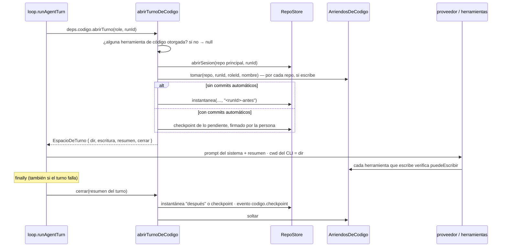

# Arriendo de escritura y resumen de código

Cada turno de un rol que programa **abre un espacio de código** antes de
empezar y **lo cierra** al terminar. Abrirlo decide tres cosas: sobre qué
worktree trabaja el turno, si ese turno puede escribir (el **arriendo**) y qué
sabe el agente del repo (el **resumen de código**, que entra al prompt).
Cerrarlo registra lo que cambió y suelta el arriendo.

El motor no sabe de git: sólo sabe que un turno puede abrir un espacio y que
**tiene que cerrarlo**. Lo implementa el servidor en
`apps/server/src/codigo-servidor.ts` → `abrirTurnoDeCodigo`.

## Por qué uno escribe por vez

Sin arriendo, dos agentes editan el mismo árbol a la vez: uno corre los tests
sobre la edición a medias del otro, y el cierre de uno se lleva el trabajo sin
terminar del otro. La regla es simple: **uno escribe por vez**; el que no
consigue el arriendo trabaja en sólo lectura —lee, revisa, corre lo permitido,
deja lo que encontró por mensaje— y edita en el ciclo siguiente. Y el resumen
**le dice** que está en sólo lectura, así no intenta editar para chocar contra
la negativa.

## Quién trabaja sobre código y quién escribe

Dos listas, una en cada paquete:

- `HERRAMIENTAS_DE_CODIGO` (`apps/server/src/codigo-servidor.ts`): las 16 de
  código (ver [[Herramientas de código]]) más las del teléfono
  (`HERRAMIENTAS_DE_TELEFONO`) y las de R2 (`HERRAMIENTAS_DE_R2`). **Tener
  otorgada cualquiera** es "este rol trabaja sobre código": su turno abre el
  espacio.
- `HERRAMIENTAS_QUE_ESCRIBEN_CODIGO` (`packages/tools/src/codigo/index.ts`):
  `editar_codigo`, `escribir_codigo`, `aplicar_parche`, `revertir_codigo`.
  **Tener alguna** es "este rol escribe": su turno pide el arriendo.

Así, el QA móvil —con las del teléfono y sin ninguna que escriba— abre el
espacio pero **nunca toma el arriendo**: puede probar mientras el Mejorador
corrige (`Runtime.crearQaMovil`).

## El recorrido de un turno



`runAgentTurn` (`packages/engine/src/loop.ts`) abre el espacio **antes** de armar
el prompt (que lleva el resumen) y lo cierra en el mismo `finally` que emite
`agent.turn_end`. Si abrirlo falla, el turno **sigue sin código** y queda un
`log` de nivel `warn`: una sesión que no arranca no puede tirar abajo a un
agente que tenía otras cosas que hacer. Si cerrar falla, también queda un `log`.

## `EspacioDeTurno`

La interfaz vive en el motor (`packages/engine/src/loop.ts`):

| Campo | Qué es |
|---|---|
| `dir` | el worktree del repo principal, real (`realpath`): el directorio de trabajo del CLI. `null` si el proyecto todavía no tiene repo |
| `escritura` | si el turno tiene el arriendo **del repo principal** |
| `resumen` | lo que el agente tiene que saber del código, para el prompt del sistema |
| `cerrar(resumenDelTurno)` | registra lo que cambió y suelta el arriendo |

Con `dir`, el motor usa el corte del proveedor para turnos de código
(`LlmProvider.timeoutCodigoMs`: 25 minutos en Claude Code,
`CLAUDE_CODE_CODIGO_TIMEOUT_MS`) en vez del corte normal: leer, editar y correr
la verificación entera no entra en diez minutos.

## `ArriendosDeCodigo`

Un mapa en memoria `repoId → { runId, roleId, nombre, desde }`:

| Método | Qué hace |
|---|---|
| `tomar(repo, run, rol, nombre)` | lo toma si está libre, vencido o ya es de ese mismo rol en esa corrida (y renueva `desde`); si no, `false` |
| `tiene(repo, run, rol)` | ¿lo tiene exactamente este rol en esta corrida? |
| `titular(repo)` | el nombre del rol que escribe ahora, o `null` |
| `soltar(repo, run, rol)` | lo libera, sólo si es suyo |

- **Vive en memoria a propósito.** Un arriendo es de un turno vivo, y un
  reinicio del servidor mata los turnos: no hay nada que recordar.
- **Vence a los 45 minutos** (`ARRIENDO_MAXIMO_MS`). Cubre el turno que murió
  sin pasar por su `finally` —no debería ocurrir, pero no puede dejar un repo
  bloqueado para siempre—. Está por encima de los 25 minutos de un turno de
  código.
- **Es por corrida y rol.** Dos corridas distintas (un pedido del chat y una
  misión) son titulares distintos aunque sea el mismo rol.

`Runtime.titularDeEscritura(repoId)` expone `titular` al resto del servidor.

### Quién más respeta el arriendo

El arriendo no es sólo entre agentes: vale igual entre un agente y una persona.

| Operación | Mientras un agente escribe | Dónde |
|---|---|---|
| Guardar o borrar un archivo desde el IDE | 409 "X está editando este repo en su turno" (la edición queda en el editor) | `PUT/DELETE /api/repos/:id/archivo` |
| Preparar, quitar, descartar, commitear, generar mensaje, stash, ramas | 409 | `operacionScm` en `rutas-codigo.ts` |
| "Confirmar" (commit rápido del IDE) | 409 | `POST /api/sesiones/:id/confirmar` |
| Deshacer un pedido del chat | 409 | `POST /api/sesiones/:id/deshacer-entre`, `…/revertir` |
| Aprobar una dependencia | la aprobación falla: "aprobá cuando termine" | `Runtime.instalarDependencias` |

El explorador del IDE muestra quién escribe (`escritor` en
`GET /api/repos/:id/archivos`) y pone el editor en sólo lectura mientras tanto
(ver [[Editor, explorador y búsqueda]]).

## `abrirTurnoDeCodigo`, en detalle

1. **Repos** del proyecto ordenados por fecha de carga. **Herramientas
   otorgadas** = nombres de las filas de `tools` que están en `role.toolIds`. Si
   ninguna es de código, devuelve `null`: el turno no abre nada.
2. **Sin repos**, devuelve `dir: null`, `escritura: false` y un resumen que dice
   dónde va el código. Si el rol tiene `crear_repositorio` y no es `executor`:
   "lo primero es crear el repo con crear_repositorio(nombre) y escribir ahí con
   escribir_codigo repo=<nombre>. El código NO va a la salida". Si no: "pedile
   a quien coordina que cree el repo". Lo medimos sin esta línea: un equipo
   entero escribió un simulador en la salida archivo por archivo y llamó a
   `listar_repositorios` 36 veces esperando que apareciera un repo.
3. **Repo principal**: el de la corrida enfocada (`foco.repoId`, que pasa el
   runtime como `repoPrincipalId`) o el primero que se cargó. Se abre su sesión
   con el `runId` del turno. Los demás abren su sesión al primer uso.
4. **Arriendo**: si el rol escribe, intenta `tomar` **todos** los repos del
   proyecto, no sólo el principal.
5. **Antes de tocar nada**, por cada repo con arriendo y sesión abierta:
   - sin commits automáticos, **instantánea "antes"** (`<runId>-antes`);
   - con commits automáticos, si hay cambios pendientes, se commitean **a nombre
     de la persona** ("Cambios hechos desde el IDE, commiteados antes del turno
     de X"): los hizo ella desde el IDE, y sin esto el checkpoint del agente se
     los llevaba firmados por el agente.
6. **Resumen** (ver abajo) y `EspacioDeTurno`.

### `cerrar(resumenDelTurno)`

Por cada repo con arriendo y sesión abierta, con el resumen del turno (o
"Turno de X") como mensaje:

- **Sin commits automáticos y con instantánea "antes"**: instantánea
  "después"; si entre las dos cambió algo, evento `codigo.checkpoint` con
  `commit: false`, `antes`, `sha` (la de después) y la cantidad de archivos.
  **No hay commit.**
- **Si no**: `RepoStore.checkpoint` con el rol como autor; si hubo commit,
  evento `codigo.checkpoint` con el sha y los archivos tocados.

Y en un `finally`, suelta todos los arriendos. El detalle de instantáneas y
checkpoints está en [[Instantáneas y checkpoints]].

## El resumen de código

Es texto que entra al **prompt del sistema** del turno
(`buildSystemPrompt(…, codigo?.resumen)`, ver [[Prompt de un turno]]). Va en el
resumen de cada turno y no en el `systemPrompt` del rol porque ese prompt se
guarda al crear el rol: uno creado antes de que existiera una herramienta nunca
se enteraría de que la tiene.

Estructura:

```text
## Código del proyecto

**inspia** (repo="inspia") — sesión en la rama dev, base dev.
Tests: `npm test` · Verificar: `npm run typecheck` · Permitidos: `npm test`, `npm run typecheck`.
Raíz: backend/  frontend/  mobile/  inspia-obsidian/  README.md
Es un monorepo. Cada parte tiene su package.json: corré sus tests con ejecutar_comando carpeta="<carpeta>" …
- Backend `backend/`: API, levantado en http://127.0.0.1:4300 — se recarga solo con cada edición.
- Documentación (Obsidian) `inspia-obsidian/`: documentación … Leé la nota que corresponda antes de cambiar una regla de negocio.
Con un servicio levantado, después de editar mirá sus logs …
Escritura: **tenés el arriendo en este turno.**

## Base de datos            (sólo si el rol tiene un MCP de base de datos)
## App móvil en el teléfono (sólo si hay app móvil y el rol tiene esas herramientas)

Cómo se trabaja acá:
- Orientate con mapa_del_codigo y buscar_codigo antes de leer archivos enteros …
- Editá con editar_codigo … Un exit distinto de 0 es un resultado: leelo y corregí.
- No declares algo terminado sin haber corrido los tests o la verificación …
- ¿Falta una librería? Pedila con instalar_dependencia …
- Tus cambios quedan SIN commitear: la persona los revisa, los prepara, escribe el mensaje …
```

- **Un bloque por repo**: nombre (con `repo="…"` si hay más de uno), rama de la
  sesión o "sesión nueva al primer uso", base, tests, verificar, permitidos (o
  "ninguno (pedilos con solicitar_comando)"), las entradas de primer nivel del
  principal (hasta 25, sin ocultas), los servicios (`lineasDeServicios`: qué
  parte es qué, si está levantada y dónde) y la línea de **escritura**:
  - "tenés el arriendo en este turno";
  - "sólo lectura este turno — escribe <otro rol>. Revisá, medí y dejale lo que
    encontraste; editás en el ciclo siguiente";
  - "tu rol no edita código; leé, corré lo permitido y reportá".
- **La última regla cambia con `commitsAutomaticos`**: si algún repo lo tiene
  prendido, "Al cerrar el turno se hace solo un checkpoint"; si no, "Tus
  cambios quedan SIN commitear… No intentes commitear ni publicar vos. En tu
  resumen contá qué archivos cambiaste y por qué, que es lo que ella va a leer
  para decidir".

### El bloque de base de datos (`bloqueDeBaseDeDatos`)

Aparece si el rol tiene herramientas de un servidor MCP cuyo nombre o
descripción coincide con `supabase|postgres|database|base de datos|db|sql`. Un
cambio de esquema tiene dos mitades que no pueden separarse —el archivo
versionado en el repo y su aplicación en la base— y sin decirlo un agente hace
una sola: SQL en vivo que nadie puede reproducir, o un archivo que nunca se
aplica. El bloque dice:

- mirar el esquema antes de tocarlo (`list_tables`, `list_migrations`);
- escribir la migración como archivo **en la carpeta de migraciones del repo**
  —la primera que exista de `supabase/migrations`, `backend/migrations`,
  `db/migrations`, `migrations`, `backend/supabase/migrations`,
  `prisma/migrations` (`CARPETAS_DE_MIGRACIONES`)—, idempotente, y aplicar
  **ese mismo SQL** con `apply_migration`;
- si alguna de esas herramientas pide aprobación, llamarla **una vez** y
  terminar el turno: al aprobarla se ejecuta sola con esos argumentos y el
  resultado llega a la bandeja (ver [[Aprobaciones y solicitudes]]);
- nunca borrar datos, tablas ni columnas si el pedido no lo dice;
- después, `get_advisors` (seguridad) y, si el código usa tipos generados,
  `generate_typescript_types`.

### El bloque del teléfono (`bloqueDeTelefono`)

Aparece si algún repo tiene un servicio `movil` y el rol tiene alguna
herramienta del teléfono. Explica cuándo usar cada una, y **filtra las líneas**
que nombran herramientas que el rol no tiene. El detalle es de
[[Depuración de la app móvil]] y [[QA móvil]].

## El CLI con y sin arriendo

Cuando el proveedor delega el turno a un CLI (ver
[[Turnos delegados a un CLI]]), el worktree es su directorio de trabajo
(`OrgToolsSession.codigo = { cwd, escritura }`) y lo que puede hacer con sus
propias herramientas depende del arriendo:

| Modo (`ModoDeTrabajo`) | Herramientas propias de Claude Code | Negadas explícito |
|---|---|---|
| `codigo-escritura` (con arriendo) | `Read, Glob, Grep, WebFetch, Edit, MultiEdit, Write, NotebookEdit` | `Bash`, `Edit(.git/**)`, `Write(.git/**)`, `MultiEdit(.git/**)`, `Edit(.git)`, `Write(.git)` |
| `codigo-lectura` (sin arriendo) | `Read, Glob, Grep, WebFetch` | las mismas |

- **Nadie recibe `Bash`.** Los comandos van por `ejecutar_comando`, que es lo
  único que aplica el sandbox, limpia el entorno, cuenta para los frenos y deja
  rastro. La negación explícita (`--disallowedTools`) sobrevive a que alguien
  agregue `Bash` a la lista por error.
- **`.git` no se edita nunca**: un hook escrito ahí es código que corre en el
  próximo checkpoint, fuera del sandbox.
- El prompt cierra con una instrucción que coincide con los permisos
  (`cierre(modo)` en `claude-code.ts`): con arriendo, "editá con tus
  herramientas Edit/Write. No tenés Bash: para correr tests… usá
  ejecutar_comando"; sin arriendo, "sólo lectura este turno… editás en el ciclo
  siguiente".
- **opencode va en sólo lectura también sobre código**: no hay cómo negarle
  `.git` por patrón de ruta, así que edita por las herramientas del org, que
  resuelven cada ruta y rechazan `.git` (ver [[Proveedor opencode]]).
- **Lo que el CLI hace por su cuenta se cuenta**: `herramientasPropiasDelCli`
  lee los `tool_use` del stream-json (menos los `mcp__…`, que ya pasan por el
  puente) y el loop los registra como `cli:Edit`, `cli:Write`… en la actividad
  y como `tool.start`/`tool.end` en la traza. Sin eso, un programador que sólo
  usa `Edit` contaba cero herramientas y el scheduler lo dejaba de convocar a
  los dos turnos; además el detector de pedidos perdidos cuenta esas ediciones
  como producción (`Scheduler.escribioCodigo`, ver
  [[Scheduler y ciclo de una corrida]]).

## Casos borde y fallas

- **El arriendo es de todos los repos**: un rol que escribe se queda con el de
  cada repo del proyecto durante su turno, aunque sólo toque uno. En un
  proyecto con varios repos, dos roles que escriben no editan en paralelo
  aunque trabajen en repos distintos.
- **`ejecutar_comando` no pide el arriendo.** Un turno en sólo lectura corre lo
  permitido —el resumen lo invita a hacerlo—; si un comando permitido escribe
  archivos (un `--fix`, un formateador), ese cambio no queda en ninguna
  instantánea del turno que lo hizo. Los comandos sí van de a uno por repo
  (ver [[Comandos y sandbox]]).
- **Un repo secundario que abre su sesión a mitad del turno** no tiene
  instantánea "antes"; al cerrar, `cerrar` cae al camino del checkpoint y
  **commitea** los cambios con el rol como autor aunque `commitsAutomaticos`
  esté apagado. Pasa la primera vez que un turno toca ese repo.
- **Las herramientas propias del CLI se registran siempre como exitosas**: el
  stream no dice si un `Edit` falló.
- **Reinicio del servidor**: los arriendos se pierden con los turnos; el turno
  en vuelo se pierde también (ver [[Trampas conocidas]]).

## Qué fijan los tests

- `packages/engine/src/loop.test.ts` → "espacio de código del turno": el resumen entra al prompt y el turno cierra con su resumen; cierra aunque el proveedor falle (y emite `agent.turn_end`); si el espacio no se puede abrir, el turno sigue sin código.
- `apps/server/src/ide.test.ts` → "un equipo sin repo…": el turno se entera de que el código va en un repo nuevo, no en la salida; un ejecutor no puede crear el repo y el CTO sí.
- `apps/server/src/ide.test.ts` → "el turno de un agente sin commits automáticos": tiene el arriendo, el resumen dice "SIN commitear", al cerrar la cabeza no se mueve, el archivo queda modificado y se anuncia una instantánea con `commit: false`.
- `packages/tools/src/codigo/codigo.test.ts`: sin el arriendo de escritura, `editar_codigo` no toca nada y dice quién escribe.
- `packages/llm/src/adapters/claude-code.test.ts`: nunca se otorga `Bash`; sin arriendo no hay nada que escriba y con arriendo sí `Edit` y `Write`; se niega explícito `Bash` y la edición de `.git`; se cuenta lo que el CLI hizo por su cuenta.
- `apps/server/src/roles-vivos.test.ts`: el QA móvil no recibe herramientas que escriben, así que nunca toma el arriendo.
- `packages/engine/src/scheduler.test.ts`: un pedido de código que editó y no escribió entregables ni mensajes no es una corrida vacía.

## Cómo extender

- **Una herramienta que escribe el árbol** va en `HERRAMIENTAS_QUE_ESCRIBEN_CODIGO`
  y llama a `conEscritura` antes de tocar nada; si además es de código, en
  `HERRAMIENTAS_DE_CODIGO`.
- **Algo nuevo que el agente tiene que saber del repo** va en el resumen
  (`abrirTurnoDeCodigo` o un bloque como `bloqueDeTelefono`), no en el prompt del
  rol.
- **Otra operación de la persona que escribe en la sesión** tiene que mirar
  `Runtime.titularDeEscritura` y contestar 409.

## Fuentes

- `apps/server/src/codigo-servidor.ts` → `HERRAMIENTAS_DE_CODIGO`, `ARRIENDO_MAXIMO_MS`, `ArriendosDeCodigo`, `abrirTurnoDeCodigo`, `lineasDeServicios`, `CARPETAS_DE_MIGRACIONES`, `bloqueDeBaseDeDatos`, `bloqueDeTelefono`, `crearCodigoStorage.puedeEscribir`
- `packages/tools/src/codigo/index.ts` → `HERRAMIENTAS_QUE_ESCRIBEN_CODIGO`, `conEscritura`
- `packages/engine/src/loop.ts` → `TurnDeps.codigo`, `EspacioDeTurno`, `runAgentTurn`
- `packages/llm/src/adapters/claude-code.ts` → `ALLOWED_TOOLS_CODIGO_LECTURA`, `ALLOWED_TOOLS_CODIGO_ESCRITURA`, `NEGADAS_EN_CODIGO`, `herramientasPara`, `cierre`, `herramientasPropiasDelCli`, `CORTE_CODIGO_MS`
- `packages/llm/src/types.ts` → `OrgToolsSession.codigo`
- `apps/server/src/runtime.ts` → `depsDeCodigo`, `titularDeEscritura`, `startRun` (`codigo.abrirTurno`)

## Ver también

- [[Trabajo con código]]
- [[Instantáneas y checkpoints]]
- [[Herramientas de código]]
- [[Proveedor claude-code]]
- [[Motor de agentes]]
