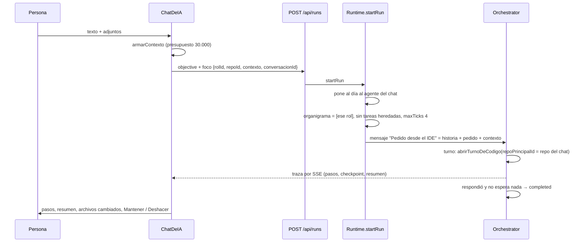
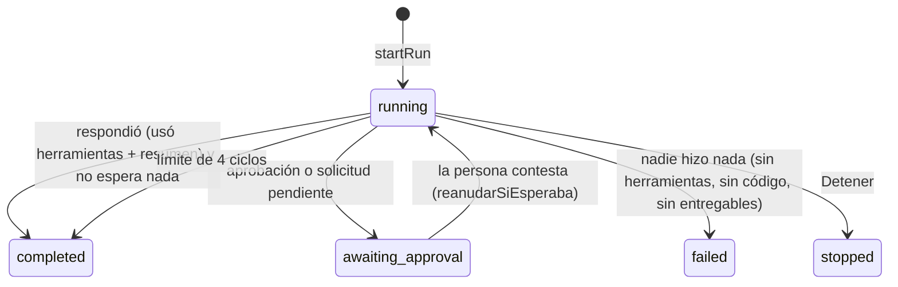

# Chat de IA

El panel derecho de [[El IDE]], a la manera de Cursor: le pedís a un agente un
cambio sobre el código **con el contexto justo** —archivos elegidos con `@`, la
selección del editor (⌘L), un elemento señalado en la vista previa, una falla del
inspector— y lo ves trabajar paso a paso. Cuando termina, ves qué archivos
cambió, abrís el diff de cada uno y decidís si lo mantenés o lo deshacés.

**No es un sistema aparte.** Cada pedido es una **corrida enfocada**: una
corrida normal del motor con un solo agente, sobre un repo, con pocos ciclos. Así
hereda todas las garantías de siempre —arriendo de escritura, sandbox,
instantáneas por turno, traza, aprobaciones— sin duplicar nada. El organigrama se
reduce a ese rol a propósito: si quedaran los demás, "mejorá esta función"
terminaba en una reunión de cuatro agentes.

## Cómo funciona



El recorrido completo, desde el punto de vista de la persona, está en
[[CU-06 Pedido de código desde el chat]].

## Los agentes del chat

El selector del compositor ofrece los roles de la empresa que tienen otorgada
`editar_codigo` **o** `manejar_app` (`editores` en
`apps/web/src/routes/codigo/Chat.tsx`): los que editan código y los que prueban
la app en el teléfono. Cada opción dice "nombre · modelo" (el slug sin el
prefijo `claude-code/`, o el tier). Si no elegiste uno, se usa el **Mejorador de
código**, y si no existe, el primero de la lista.

Dos agentes se crean con un clic desde el mismo compositor:

| | Mejorador de código | QA móvil |
|---|---|---|
| Botón | aparece si no hay ningún rol "Mejorador de código" entre los editores | aparece si no hay un rol "QA móvil" **y** el repo tiene un servicio `movil` |
| Endpoint | `POST /api/companies/:companyId/mejorador` | `POST /api/companies/:companyId/qa-movil` |
| Preset | `MEJORADOR_DE_CODIGO` | `QA_MOVIL` |
| Departamento | "Desarrollo", o el primero que exista | "Calidad" (lo crea si no está) |
| Herramientas | todas las de código (`HERRAMIENTAS_DE_CODIGO`) | una lista cerrada de 22, **ninguna que escriba código** |
| `maxTurns` | 20 | 30 |
| Qué hace | mejora código existente, el cambio más chico que cumpla | barre una funcionalidad en el teléfono y reporta con evidencia; no corrige |

Los dos nacen `executor`, sin jefe, con escalado apagado y tier `smart`. El
proveedor es `claude-code` con `claude-code/opus` si está configurado —es la
suscripción, y el que mejor edita—; si no, el proveedor preferido
(`Runtime.proveedorPreferido`) sin slug fijo. Sin ningún proveedor, crear falla
con "No hay ningún proveedor LLM configurado". El QA móvil, al no tener
herramientas que escriben, **nunca toma el arriendo**: puede probar mientras el
Mejorador corrige. Qué hace el QA en detalle está en [[QA móvil]].

**El prompt del Mejorador** (`packages/shared/src/plantillas.ts`, en inglés con
la salida declarada en castellano rioplatense) le pide: empezar por el contexto
adjunto y leer más sólo si hace falta; hacer exactamente lo pedido con el cambio
más chico, sin refactors de paso, renombres ni dependencias nuevas; respetar el
estilo del archivo; editar con `Edit` o `editar_codigo`, nunca reescribir un
archivo entero por tres líneas; verificar con `ejecutar_comando` (en la carpeta
de la parte, en un monorepo) y, si la parte corre como servicio, mirar sus logs
y probar el endpoint; depurar la app móvil en el teléfono antes de adivinar; en
la base de datos, la migración va al repo **y** se aplica; y cerrar con un
resumen de qué cambió, qué corrió y qué conviene mirar. No manda mensajes: no hay
otros roles en la conversación.

### Una herramienta nueva tiene que llegarle al agente que ya existe

`Runtime.crearAgenteDelChat` es idempotente por nombre: si el rol ya existe, le
**suma las herramientas que le falten** del preset (y lo refleja en las
corridas vivas con `actualizarRolEnCorridasVivas`); si no, lo crea. Además
`startRun`, cuando el `foco.rolId` es el Mejorador o el QA móvil, vuelve a
llamar a `crearMejorador`/`crearQaMovil` **antes de cada pedido**.

> [!danger] Lo pagamos con el Mejorador de INSPIA
> Antes las herramientas nuevas sólo le llegaban si alguien volvía a apretar
> "crear": el de INSPIA se quedó sin las del teléfono. Un rol se crea una vez y
> su lista de herramientas quedaba congelada en ese momento.

## Qué viaja con el pedido

| Adjunto | Cómo se agrega | Qué le llega al agente |
|---|---|---|
| `archivo` | `@` en el texto, el botón "@ archivo", el atajo "+ *archivo abierto*", o ⌘L sin selección | el contenido, hasta 12.000 caracteres |
| `seleccion` | ⌘L con texto seleccionado en el editor | las líneas elegidas, con su rango |
| `elemento` | "Seleccionar" en la vista previa de un servicio web o en el teléfono | qué es, qué componentes lo dibujan, candidatos en el código y la vecindad del mejor |
| `falla` | "Al chat" en el inspector de la vista previa | el error o el pedido fallido completo, los archivos del stack y la vecindad de la línea que tiró |

Los dos últimos se explican en [[Selector de elementos e inspector]]. Los
adjuntos se muestran como fichas arriba del texto (con una ✕ para quitarlos) y no
se repiten: cada uno tiene una clave (`claveDe`).

**La mención con `@`.** Escribir `@` seguido de letras abre un selector con hasta
8 archivos del repo que contienen lo escrito, primero los que **empiezan** así.
Flechas para moverse, Enter o Tab para elegir, Esc para cerrar. Elegir borra el
`@texto` y agrega el archivo como ficha.

### `armarContexto`

El contenido **va adentro del mensaje**: el agente no gasta vueltas en leer lo
que ya le diste. Pero con presupuesto, porque lo que entra a un turno delegado se
reenvía en cada vuelta y cuesta en todas (ver [[Turnos delegados a un CLI]]).

~~~text
---
Contexto que adjuntó la persona (repo "<nombre>"):

#### `src/app.js` (archivo completo)
```js
…
```
~~~

- Presupuesto total `PRESUPUESTO = 30_000` caracteres; por archivo,
  `TOPE_POR_ARCHIVO = 12_000`. Un archivo que no entra entero dice "primeros N
  caracteres de M; el resto, con leer_codigo".
- Si queda menos de 500, o el archivo no se pudo leer, va sólo el nombre: "no se
  adjunta el contenido: leelo con leer_codigo".
- La selección se recorta a lo que quede de presupuesto.
- Elementos y fallas se describen con su propio texto, que también descuenta.
- El bloque de código lleva el lenguaje (`FENCE`: `js`, `ts`, `python`, `glsl`…).

El servidor acepta hasta 40.000 caracteres de `contexto` y 8.000 de `objective`
(`createRunSchema`); el chat recorta el pedido a 8.000.

## La corrida enfocada

`Runtime.startRun` (`apps/server/src/runtime.ts`) con `input.foco`:

1. Pone al día al agente si es el Mejorador o el QA móvil (arriba).
2. Valida que el rol exista y que el repo sea de la empresa.
3. **Reduce el organigrama a ese rol** (`config.roles = [rol]`) y **no adopta el
   trabajo abierto** (`config.tasks = []`).
4. `maxTicks` = 4 si no se pidió otro: un pedido puntual no necesita cincuenta
   ciclos; si en cuatro no cerró, el pedido era otra cosa y conviene que lo mire
   una persona.
5. Guarda en la corrida `foco = { rolId, repoId, conversacionId? }` (el
   contexto no se guarda ahí: va en el mensaje).
6. Le pasa al orquestador `codigo.abrirTurno` con `repoPrincipalId` = el repo
   del chat: ese worktree es el directorio del turno (y el del CLI). Ver
   [[Arriendo de escritura y resumen de código]].
7. Manda el mensaje de entrada: tipo `human`, asunto **"Pedido desde el IDE"**,
   cuerpo = historia de la conversación + pedido + contexto.

El chat lo arranca en modo `continuous`: la corrida avanza sola hasta cerrar.

## Cuándo termina un pedido



El scheduler (`packages/engine/src/scheduler.ts`, ver
[[Scheduler y ciclo de una corrida]]) tiene tres reglas para corridas con `foco`:

- **Un pedido respondido termina ahí.** Un turno cuenta como respuesta si usó al
  menos una herramienta **y** cerró con un resumen (`respondio`). Al final del
  ciclo, si hay respuesta y no queda ninguna aprobación ni solicitud pendiente,
  la corrida cierra `completed` con "El agente respondió el pedido.".

  > [!danger] Diez fotos más con el chat ya respondido
  > Sin esa regla, un aviso del sistema —el resultado de una aprobación resuelta
  > con el turno en vuelo— volvía a convocar al agente, que arranca cada turno
  > sin memoria del anterior y rehacía el pedido entero. Lo medimos con un agente
  > que sacó otras diez fotos. Lo que sí tiene que seguir (una aprobación o una
  > pregunta todavía abierta) no cierra: la corrida espera y el turno siguiente
  > recibe la respuesta.

- **Una consulta es trabajo aunque no deje código.** "¿Qué tablas hay?" no
  produce entregables, mensajes ni ediciones; el detector de pedidos perdidos
  la marcaba `failed`. Con `foco`, un turno que usó herramientas y respondió
  cuenta.
- **Una edición es producción.** `escribioCodigo` cuenta las ediciones exitosas
  por las herramientas del org (`HERRAMIENTAS_QUE_ESCRIBEN_CODIGO`) o por el
  `Edit`/`MultiEdit`/`Write`/`NotebookEdit` propio del CLI (`cli:*`). Sin eso,
  cada pedido de código bien resuelto terminaba "failed — sin producir nada".

## Conversaciones

Cada pedido es una corrida nueva y el agente arranca sin memoria: sin algo más,
"ahora hacelo azul" no se refiere a nada. Por eso los pedidos se agrupan en
**conversaciones** (`foco.conversacionId`).

- **Id:** `conv_` + la hora en base 36 + 4 caracteres al azar
  (`nuevaConversacion`). El servidor exige `^[a-z0-9_-]{4,60}$`.
- **Cuál está abierta** se recuerda por repo en `localStorage`
  (`orq-chat-conversacion-<repoId>`). El valor especial `anteriores` agrupa los
  pedidos de antes de que existieran las conversaciones; escribir ahí abre una
  nueva.
- **Qué viaja:** `Runtime.historiaDeConversacion` junta los pedidos anteriores de
  esa conversación y ese repo, **del más nuevo al más viejo** (es lo que más
  importa si hay que cortar), hasta 8 y hasta 8.000 caracteres. Cada uno va como
  "**Pedido:**" (hasta 1.500) y "**Respuesta:**" —el último resumen de cierre de
  turno, hasta 2.500, o "(sin respuesta: motivo)"—. No viaja la traza: se
  reenviaría en cada vuelta. Cierra con "Pedido nuevo:".
- **Nueva conversación** (ícono de burbuja con +) arranca limpia. El reloj abre
  la lista de conversaciones anteriores.

| Endpoint | Qué devuelve |
|---|---|
| `GET /api/repos/:repoId/pedidos?conversacion=…` | las corridas con `foco.repoId` de ese repo (de esa conversación, o `anteriores` = sin conversación), la más nueva primero, hasta 30. El chat lo pide cada 4 s |
| `GET /api/repos/:repoId/conversaciones` | una fila por conversación: título (el primer pedido, 80 caracteres; "Pedidos anteriores" para las viejas), cantidad, desde y última actividad; hasta 50, la más reciente primero. Cada 15 s |

## Cómo se ve un pedido

Cada pedido (`Pedido`) muestra arriba lo que pediste —en markdown, con sus
fichas de adjuntos y la hora— y abajo lo que hizo el agente:

- **En vivo** mientras corre (`useRunStream`, SSE de la corrida); terminado, una
  sola lectura de la traza (`GET /api/runs/:id/events`).
- **Los pasos:** cada `tool.end` de una herramienta conocida se vuelve un renglón
  con verbo y detalle (la ruta, el comando o el patrón, sin el prefijo absoluto
  del worktree). Se ven los últimos 8, con "… N pasos antes" para desplegar. Un
  punto rojo marca un paso fallido, y un `ejecutar_comando` con `exit` distinto
  de 0 también (aunque para el motor sea un resultado, no un fallo).

| Herramienta | Verbo |
|---|---|
| `leer_codigo`, `cli:Read` | Leyó |
| `editar_codigo`, `cli:Edit`, `cli:MultiEdit` | Editó |
| `escribir_codigo`, `cli:Write` | Escribió |
| `aplicar_parche` | Aplicó un parche |
| `buscar_codigo`, `cli:Grep` · `buscar_archivos`, `cli:Glob` | Buscó · Buscó archivos |
| `mapa_del_codigo` · `listar_repositorios` · `estado_git` | Miró el mapa · Revisó el repo · Revisó los cambios |
| `ejecutar_comando` | Corrió (`→ exit N`) |
| `revertir_codigo` · `solicitar_comando` | Revirtió · Pidió permiso para |

  Las herramientas propias del CLI de Claude (`cli:*`) llegan como
  `tool.start`/`tool.end` recién **al final del turno**, porque el CLI devuelve
  todo junto (`packages/engine/src/loop.ts`).
- **El resumen:** el último `agent.turn_end` con `summary`, en markdown.
- **El estado:** "trabajando…", o "esperando tu respuesta ↓" en
  `awaiting_approval`, con un botón **Detener** (`POST /api/runs/:id/stop`).
  Terminado con otro estado que `completed`, se muestra el motivo en ámbar. Sin
  cambios ni resumen: "Terminó sin cambios en el código.".

## Ver cambios, mantener o deshacer

Terminado el pedido, si tocó archivos aparece la lista "N archivo(s)
cambiado(s)", cada uno con su letra. Los cambios salen de los eventos
`codigo.checkpoint` del pedido, y hay dos modos según el repo (ver
[[Instantáneas y checkpoints]]):

| | Sin commits automáticos (default) | Con `commitsAutomaticos` |
|---|---|---|
| Qué deja un turno | dos instantáneas (`antes`, `sha`) y los cambios **sin commitear**; el evento lleva `commit: false` | un commit por turno con el rol como autor |
| Qué cambió el pedido | `GET /api/sesiones/:id/entre?desde=<antes del primero>&hasta=<sha del último>` | la unión de `GET /api/sesiones/:id/commit/:sha` de cada checkpoint |
| Ver un archivo | diff entre esas dos instantáneas | diff entre `<primer sha>^` y el último sha |
| **Deshacer** | `POST /api/sesiones/:id/deshacer-entre`: aplica el diff **al revés** sobre el árbol (`git apply -R`), sin commits | `POST /api/sesiones/:id/revertir`: `git revert` de cada checkpoint, del más nuevo al más viejo, firmado por la persona |
| Si ella tocó después las mismas líneas | no aplica nada y dice qué choca | aborta, vuelve a donde estaba y lo dice |

- En el modo default, la lista agrega "· sin commitear": quedaron en tu rama
  para que los prepares, escribas (o generes) el mensaje y commitees desde el
  [[Panel de control de código]].
- **Mantener** no hace nada en el servidor: registra tu decisión (en
  `localStorage`) y esconde los botones. **Deshacer** también la registra como
  "deshecho".
- Los dos endpoints de deshacer esperan a que ningún agente tenga el arriendo
  (409). `revertir` sólo acepta checkpoints de la sesión (posteriores a su base
  y en su rama); con cambios pendientes, antes los commitea a nombre de la
  persona ("Cambios sin confirmar antes de deshacer").

> [!note] El `title` del botón describe el otro modo
> "Revierte los checkpoints de este pedido: quedan commits que los deshacen" es
> cierto con commits automáticos. En el modo default no quedan commits: se
> aplica el diff al revés.

## Lo que espera tu respuesta, en el chat

Lo que el agente necesita de la persona aparece **al final del pedido**, que es
lo último que pasó (sólo mientras la corrida no terminó):

- **Aprobaciones** (`AprobacionesDelPedido`, consulta la corrida cada 3 s): una
  herramienta que escribe —en INSPIA, aplicar una migración o ejecutar SQL en
  Supabase— espera, y **aprobar la ejecuta** con los argumentos que se ven. Por
  eso el SQL se muestra entero y resaltado antes del botón, junto con el resto
  de los argumentos. Hay un campo de comentario para el agente y los botones
  **Aprobar y ejecutar** / **Rechazar** (`POST /api/runs/:id/approvals/:id`).
- **Solicitudes** (`SolicitudesDelPedido`, cada 3 s, las de esta corrida): una
  **dependencia** se instala con **Instalar** (cada paquete enlaza a npmjs.com
  para mirarlo antes, y aclara "sin scripts de instalación"); un **comando** se
  aprueba con **Correr una vez** (`alcance: "una-vez"`); cualquier otra lleva a
  la pantalla de Solicitudes. Si la instalación falla, la solicitud queda
  pendiente y el aviso muestra el motivo.

> [!danger] Un simulador 3D con los botones muertos
> Antes las solicitudes vivían sólo en la pestaña Solicitudes, y el pedido se
> quedaba esperando sin que nadie lo notara: la instalación de Three.js esperaba
> una aprobación que estaba en otra pantalla. Instalar o correr un comando una
> vez se aprueba acá mismo. Ver [[Aprobaciones y solicitudes]] e
> [[Instalación de dependencias]].

## El markdown del chat

`apps/web/src/routes/codigo/Markdown.tsx` → `Markdown` dibuja lo que escribe el
agente y lo que pediste, con `react-markdown` + GFM (negritas, listas, tareas,
tablas). Tres decisiones:

- **Sin HTML crudo.** No se usa `rehype-raw`: el HTML que venga en el texto se
  muestra escapado, y un enlace `javascript:` se descarta. El texto lo escribe un
  agente que leyó código de cualquier lado.
- **Las rutas del repo son enlaces.** Un `` `src/shader.js:143` `` en código en
  línea, si la ruta existe en el repo, es un botón que abre el archivo en esa
  línea. Una ruta que no existe queda como código.
- **El código se colorea con Monaco** (`monaco.editor.colorize`), el mismo
  resaltado del editor —dos resaltadores harían que el mismo archivo se viera de
  dos maneras—, con un botón para copiar. `colorize` escapa el texto: no mete
  HTML que venga del código.

Los enlaces web abren en otra pestaña con `noopener noreferrer`.

## Lo que se guarda en el navegador

| Clave de `localStorage` | Qué | Para qué |
|---|---|---|
| `orq-chat-conversacion-<repoId>` | la conversación abierta | volver a ella al recargar |
| `orq-chat-adjuntos-<runId>` | los adjuntos del pedido, aligerados (sin el HTML del elemento, el detalle de la falla hasta 600, la selección sin texto) | mostrarlos en el historial |
| `orq-chat-decision-<runId>` | `mantenido` o `deshecho` | no volver a ofrecer los botones |

Todo va en `try/catch`: sin almacenamiento, el chat funciona igual y sólo pierde
esas comodidades. **Lo que el agente recibe no sale de acá**: viaja en el mensaje
de la corrida.

## Constantes

| Nombre | Valor | Dónde | Por qué |
|---|---|---|---|
| `PRESUPUESTO` | 30.000 caracteres | `Chat.tsx` | lo adjunto se reenvía en cada vuelta del turno delegado |
| `TOPE_POR_ARCHIVO` | 12.000 | `Chat.tsx` | un archivo no se come todo el presupuesto |
| `maxTicks` de un pedido | 4 | `Runtime.startRun` | si no cerró en cuatro ciclos, lo mira una persona |
| historia de la conversación | 8 pedidos / 8.000 caracteres | `historiaDeConversacion` | |
| pedido / respuesta en la historia | 1.500 / 2.500 | `historiaDeConversacion` | |
| `contexto` / `objective` | 40.000 / 8.000 | `createRunSchema` | |
| pedidos listados | 30 | `GET /pedidos` | |
| conversaciones listadas | 50 | `GET /conversaciones` | |
| pasos visibles | 8 | `Pedido` | |

## Casos borde

- **Una respuesta sin herramientas termina `failed`.** Si el agente contesta de
  memoria, sin usar ninguna herramienta, no cuenta como respuesta: el pedido
  cierra con "La corrida terminó sin producir nada", que se ve en ámbar.
- **Una solicitud pendiente de otra corrida también frena el cierre.** La
  corrida enfocada adopta, como todas, las solicitudes pendientes de la empresa
  (`RunState` recibe `listRequests`), y la regla de cierre mira si queda
  **alguna** pendiente. El pedido queda "esperando tu respuesta ↓", pero el chat
  sólo muestra las de su propia corrida: la que frena está en Solicitudes.
- **Los pasos del QA móvil no se listan.** Los verbos sólo conocen las
  herramientas de código: lo del teléfono (`manejar_app`, `captura_del_telefono`)
  se ve en el resumen, no en los pasos.
- **Sin adb en la máquina** las herramientas del teléfono no se registran: el QA
  móvil se crea sin `manejar_app` y no aparece en el selector del chat, aunque
  el botón para crearlo desaparezca porque el rol ya existe.
- **Sin repo activo no hay chat**: el panel sólo se monta con un repo.
- **Cambiar de repo cambia de conversación**: la abierta se recuerda por repo.
- **Deshacer después de que la persona editó las mismas líneas** falla sin tocar
  nada; lo que se hizo después se conserva.

## Qué fijan los tests

- `apps/server/src/ide.test.ts` → "el agente del chat": el Mejorador se crea una
  sola vez con todas las herramientas de código; una corrida enfocada tiene un
  solo agente, `maxTicks` 4, le llega el contexto en el mensaje y el turno abre
  la sesión del repo elegido y no la del otro; `GET /pedidos` la lista.
- `apps/server/src/ide.test.ts` → "deshacer un pedido": revierte el checkpoint y
  nombra los archivos; no revierte algo que no es un checkpoint de la sesión.
- `apps/server/src/ide.test.ts` → "el turno de un agente sin commits
  automáticos": deja los cambios sin commitear, el resumen dice "SIN commitear" y
  anuncia sus instantáneas (`commit: false`).
- `apps/server/src/conversacion.test.ts`: la historia trae los pedidos de esa
  conversación, el más nuevo primero y nada de las otras; una conversación nueva
  no arrastra nada.
- `packages/engine/src/scheduler.test.ts`: un pedido de código que editó con el
  `Edit` del CLI no es una corrida vacía; una consulta del chat que trabajó y
  respondió no lo es y una corrida de equipo que sólo habla sí; un pedido
  respondido termina en un ciclo aunque llegue un aviso del sistema durante el
  turno.
- `apps/server/src/roles-vivos.test.ts` → "crearQaMovil": no recibe herramientas
  que escriben (nunca toma el arriendo), es `executor` en "Calidad", y crearlo
  otra vez devuelve el mismo rol.
- `apps/web/src/routes/codigo/Markdown.test.tsx`: dibuja negritas, listas, tablas
  y código; una ruta existente es un botón y una inexistente no; no ejecuta HTML
  crudo ni enlaces `javascript:`.

## Cómo extender

- **Otro agente del chat:** definí su preset en `packages/shared/src/plantillas.ts`
  (nombre, título, departamento, prompt con la línea de salida en castellano),
  un método `crearX` sobre `crearAgenteDelChat` con el filtro de herramientas,
  su endpoint y su botón, y sumalo al "poner al día" de `startRun`. Si no tiene
  `editar_codigo` ni `manejar_app`, agregá la herramienta que lo identifique al
  filtro de `editores`.
- **Una herramienta que debería verse como paso:** sumala a `VERBOS`, y si su
  argumento principal no es `ruta`, `comando` ni `patron`, a `pasosDe`.
- **Más contexto adjunto:** respetá el presupuesto; lo que no entra va por
  nombre, nunca cortado sin aviso.

## Fuentes

- `apps/web/src/routes/codigo/Chat.tsx` → `ChatDeIA`, `Adjunto`, `armarContexto`, `describirElemento`, `describirFalla`, `Pedido`, `pasosDe`, `VERBOS`, `AprobacionesDelPedido`, `SolicitudesDelPedido`, `nuevaConversacion`
- `apps/web/src/routes/codigo/Markdown.tsx` → `Markdown`, `BloqueDeCodigo`
- `apps/web/src/routes/Codigo.tsx` → `agregarAlChat`, `agregarElemento`, `agregarFalla`
- `apps/server/src/runtime.ts` → `startRun` (rama `foco`), `historiaDeConversacion`, `crearMejorador`, `crearQaMovil`, `crearAgenteDelChat`
- `apps/server/src/rutas-codigo.ts` → `POST /mejorador`, `POST /qa-movil`, `GET /pedidos`, `GET /conversaciones`, `GET /sesiones/:id/entre`, `POST /deshacer-entre`, `GET /sesiones/:id/commit/:sha`, `POST /revertir`
- `packages/shared/src/plantillas.ts` → `MEJORADOR_DE_CODIGO`, `QA_MOVIL`
- `packages/shared/src/schema.ts` → `createRunSchema.foco`, `runSchema.foco`
- `packages/engine/src/scheduler.ts` → `respondio`, `escribioCodigo`, cierre de corridas con `foco`
- `packages/engine/src/loop.ts` → eventos `cli:*`

## Ver también

- [[CU-06 Pedido de código desde el chat]] · [[El IDE]]
- [[Selector de elementos e inspector]] · [[Panel de control de código]]
- [[Scheduler y ciclo de una corrida]] · [[Instantáneas y checkpoints]]
- [[Arriendo de escritura y resumen de código]] · [[Proveedor claude-code]]
- [[QA móvil]] · [[App móvil en el teléfono]] · [[Aprobaciones y solicitudes]]
