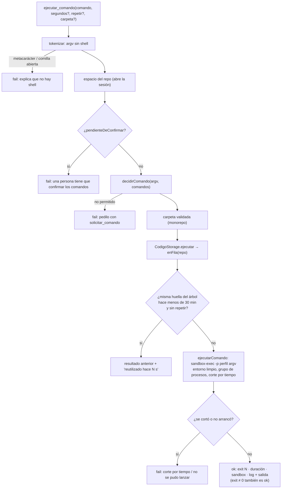

# Comandos y sandbox

Un agente corre tests, typecheck y builds con `ejecutar_comando`. Dos piezas
distintas deciden qué pasa, y conviene no confundirlas:

- **La allowlist decide *qué* se corre** (`packages/shared/src/argv.ts`): el
  comando se tokeniza a argv sin shell y se compara **por token** contra los
  prefijos permitidos del repo.
- **El sandbox contiene *cómo* corre** (`packages/tools/src/codigo/ejecutar.ts`):
  `sandbox-exec` deja escribir sólo en el worktree y en los temporales, nunca en
  `.git`, y no deja leer las credenciales de la persona.

> [!warning] La allowlist no es una frontera de seguridad
> Permitir `npm test` es permitir los scripts de `package.json` y los tests,
> **que un agente puede editar**. La allowlist evita que un agente corra
> *cualquier* cosa por accidente y hace visible qué se corre. Lo que contiene
> de verdad es el sandbox.

## El recorrido de un comando



## Tokenizar (`tokenizar`)

El comando se parte en argv respetando comillas simples y dobles, y **no se
expande nada**: ni variables, ni `~`, ni globs. Fuera de comillas se rechazan
los metacaracteres de shell —`;` `&` `|` `<` `>` `` ` `` `$` `\`, saltos de
línea, `*` y `?`—. Sin shell no harían nada (un `;` sería un argumento
literal), pero un agente que los escribe cree que sí, y el rechazo le explica
por qué su `npm test && npm run lint` no es lo que piensa: "Para encadenar,
hacé llamadas separadas; para redirigir, no hace falta —la salida ya vuelve en
el resultado—". Una comilla sin cerrar es un error, no un argumento raro.

## Decidir (`decidirComando`)

En este orden:

1. **Lo que nunca se corre**, esté o no en la lista: `git push`, `remote`,
   `config`, `credential`, `submodule`, `filter-branch`, `gc`, `worktree`
   (`GIT_PROHIBIDOS`). Publicar lo hace una persona.
2. **Leer git se permite siempre**: `status`, `diff`, `log`, `show`, `blame`,
   `ls-files`, `grep`, `rev-parse`, `shortlog`, `describe` (`GIT_LECTURA`)…
   salvo con un argumento que escribe o ejecuta (`--output`, `--ext-diff`,
   `--textconv`, `--exec`, `--upload-pack`, `--git-dir`, `--work-tree`,
   `--config-env`): leer no puede ser la puerta para escribir.
3. **La allowlist**, por prefijo y **token por token** (`empiezaCon`):
   `npm test` habilita `npm test -- -t suma`, pero no `npm testx`. Guardada como
   texto y comparada por prefijo de string, `npm test` habilitaba `npm testx` y
   `npm test; rm -rf ~`.
4. **Los permisos de una vez**, por **argv exacto** (mismo largo, mismos tokens).
5. Si nada lo permite: "no está entre los comandos permitidos de este repo.
   Pedilo con solicitar_comando… y mientras tanto seguí con lo que sí podés
   hacer".

El git que corre así **no pasa por [[Git endurecido]]**: es un comando más,
dentro del sandbox, y lee la configuración de git de la persona. Otros
subcomandos (`commit`, `checkout`, `stash`) no están prohibidos: corren si una
persona los agrega a la lista.

## Qué puede entrar a la lista (`validarPrefijoPermitido`)

Se valida en los dos lugares donde entra un prefijo: cuando una persona edita
la allowlist (`PATCH /api/repos/:id/comandos`) y cuando aprueba un comando "para
siempre". Es código puro en `@orq/shared` porque lo usan los dos lados: con dos
copias, lo que la UI aceptaba la herramienta lo rechazaba, o al revés.

| Regla | Ejemplos rechazados | Motivo |
|---|---|---|
| Nombre, no ruta | `./node_modules/.bin/vitest` | la ruta la resuelve el `PATH` |
| Nunca | `sh`, `bash`, `zsh`, `env`, `sudo`, `xargs`, `eval`, `curl`, `wget`, `ssh`, `scp`, `rsync`, `nc`, `rm`, `mv`, `chmod`, `chown`, `dd`, `osascript` | es un shell o toca cosas fuera del proyecto |
| Intérpretes y ejecutores, sólo con qué corren | `node`, `npx`, `python -c`, `deno`, `bun`, `ruby`, `perl`, `php`, `pnpx`, `bunx`, `uvx`, `pipx` solos, o con `-c`/`-e`/`--eval` | solos corren cualquier cosa; `node scripts/check.js` sí vale |
| Gestores, con subcomando | `npm`, `npm run`, `pnpm exec`, `yarn dlx` sin script | "sin script corre cualquiera" |
| Gestores, nada que publique | `npm publish`, `login`, `adduser`, `token`, `config`, `set`, `unpublish`, `owner`, `access` | publica o toca credenciales |
| `git`, con subcomando y no prohibido | `git`, `git push` | la integración la hace una persona |

Los permisos **de una vez no pasan por esta validación**: la persona ve el argv
exacto y decide. Siguen corriendo en el sandbox.

## Los comandos de un repo (`comandosRepositorioSchema`)

| Campo | Qué es |
|---|---|
| `permitidos` | prefijos de argv que un agente corre sin preguntar |
| `test` | cómo se corren los tests: lo primero que un agente necesita saber (va al resumen) |
| `verificar` | typecheck, lint o build: lo que dice si el cambio está sano |
| `preparar` | lo que dejaría un worktree listo (`npm ci`); se guarda y se muestra |
| `sinAislamiento` | correr **sin** `sandbox-exec`: opt-in explícito de una persona |
| `unaVez` | permisos de un solo uso, por argv exacto; se consumen al ejecutarse |

`test` y `verificar` **no permiten nada por sí solos**: tienen que estar también
en `permitidos` (un repo creado por el equipo ya los trae así).

### Sugerencias al cargar

`detectarComandos` (`apps/server/src/repos.ts`) mira el repo y **sugiere**;
nada queda permitido hasta que una persona lo confirma:

| El repo tiene | `preparar` | `test` | Permitidos sugeridos |
|---|---|---|---|
| `package.json` (gestor por lockfile: pnpm, yarn o npm) | `npm ci` (con lock) / `npm install` / `pnpm install --frozen-lockfile` / `yarn install --frozen-lockfile` | `npm test` si hay script `test` | `test`, y `run typecheck`, `run lint`, `run build` si existen (el primero es `verificar`) |
| `pyproject.toml`, `requirements.txt` o `setup.py` | `pip install -r requirements.txt` | `pytest -q` | `pytest` |
| `go.mod` | — | `go test ./...` | `go test`, `go vet`, `go build` (`verificar`: `go vet ./...`) |
| `Cargo.toml` | — | `cargo test` | `cargo test`, `cargo check`, `cargo build` (`verificar`: `cargo check`) |

En un monorepo, `detectarComandosDeRepo` une las sugerencias de la raíz y de
cada servicio (salvo documentación): un argv permitido vale en cualquier
carpeta, así que alcanza con la unión; lo que cambia es **dónde** se corre, y
eso lo dice el argumento `carpeta` (ver [[Servicios del monorepo]]).

### Importados sin confirmar

Un repo que llegó en un blueprint trae su allowlist con
`pendienteDeConfirmar: true`: importar un JSON no puede autorizar a correr nada
en esta máquina. Hasta que una persona guarda los comandos, `ejecutar_comando`
y la terminal se niegan (ver [[Repositorios y sesiones]]).

## El sandbox (`perfilSandbox`)

`sandbox-exec` de macOS con un perfil SBPL armado en cada llamada. En SBPL **gana
la última regla que aplica**, por eso los permisos van primero y las
negaciones puntuales al final:

```text
(version 1)
(allow default)
(deny file-write*)
(allow file-write* <worktree> <tmp del proyecto> <cachés> /private/tmp <tmpdir del usuario>)
(allow file-write* /dev/null /dev/zero /dev/tty /dev/fd/* /dev/ttys*)
(deny file-write* <clon>/.git <worktree>/.git)
(deny file-read* ~/.ssh ~/.aws ~/.config/gh ~/.gnupg ~/.docker ~/.kube ~/.config/gcloud ~/.azure
                 ~/.netrc ~/.npmrc ~/.pypirc ~/.git-credentials)
```

- **Se escribe** en el worktree, en `tmp/` del proyecto y en los cachés de
  paquetes del hogar: `.npm`, `.cache`, `.yarn`, `.expo`, `.pnpm-store`,
  `Library/pnpm`, `Library/Caches`, `.bun`, `.cargo/registry`, `.cargo/git`,
  `go/pkg/mod`, `.gradle`, `.m2/repository`, `.nuget/packages`. También en
  `/private/tmp` y en el temporal del usuario (`os.tmpdir()`, no todo
  `/var/folders`): compiladores y cachés escriben ahí aunque `TMPDIR` diga otra
  cosa, y negarlo hace fallar builds por motivos que nadie entiende.
- **Nunca** en el `.git` del clon ni en el archivo `.git` del worktree: un test
  que escribe un hook ahí convierte el próximo checkpoint del servidor en
  código corriendo fuera del sandbox. Las rutas se resuelven con `realpath`.
- **No se leen** las llaves y credenciales de la persona.
- **La red no se restringe** (`allow default`). Lo que le impide a un agente
  bajar algo no es el sandbox sino la allowlist: `curl` y `wget` no se pueden
  permitir y `npx` no entra solo. Pero un test o un script permitido que hace
  pedidos de red, los hace.

`hayAislamiento()` es verdadero en macOS con `/usr/bin/sandbox-exec`. Donde no
hay sandbox, el repo necesita `sinAislamiento` prendido por una persona; si no,
el comando falla con "En esta máquina no hay sandbox-exec, y correr sin
aislamiento lo tiene que habilitar una persona para este repo… Avisale con
send_message". Sin aislamiento, `npm test` corre como tu usuario el código que
escribió un agente, con acceso a todo lo que vos tenés.

## El entorno (`entornoDeComando`)

El servidor tiene cargadas las credenciales de todos los proveedores, y un test
no tiene por qué verlas. Del entorno del servidor se descarta:

- toda variable cuyo nombre contenga `KEY`, `TOKEN`, `SECRET`, `PASSWORD`,
  `PASSWD`, `CREDENTIAL`, `AUTH`, `COOKIE` o `SESSION` (así se va también
  `SSH_AUTH_SOCK`);
- toda la del orquestador y sus proveedores: `ORQ_*`, `ANTHROPIC*`, `OPENAI*`,
  `OPENROUTER*`, `NVIDIA*`, `GEMINI*`, `GOOGLE_*`, `AWS_*`, `AZURE_*`, `N8N_*`,
  `DATABASE_URL`, `CLAUDE_CODE*`.

Y se agrega:

| Variable | Valor | Por qué |
|---|---|---|
| `CI` | `1` | sin esto vitest y jest arrancan en modo watch y el comando no termina nunca —"un proveedor que no contesta", en chico— |
| `NO_COLOR`, `FORCE_COLOR`, `TERM` | `1`, `0`, `dumb` | salida legible para un modelo |
| `TMPDIR`, `TMP`, `TEMP` | `tmp/run` del proyecto | temporales adentro de lo escribible |
| `npm_config_yes` | `true` | una pregunta deja el proceso esperando |
| `npm_config_update_notifier`, `_fund`, `_audit` | `false` | ruido y pedidos de red de más |

Los servicios usan una variante sin `CI` (ver [[Servicios del monorepo]]).

## Procesos, cortes y salida (`ejecutarComando`)

- **Sin shell**: `spawn(ejecutable, args)` o
  `spawn("/usr/bin/sandbox-exec", ["-p", perfil, ejecutable, …args])`.
- **Grupo de procesos propio** (`detached: true`): `npm test` lanza node, que
  lanza workers; matar sólo al primero deja a los nietos corriendo. Al cortar
  se manda `SIGTERM` al grupo y `SIGKILL` a los 3 s; al terminar, un `SIGKILL`
  más al grupo por si quedaron hijos colgados.
- **Corte por tiempo**: `segundos` entre 5 y 600, default 120 en la
  herramienta; la terminal del IDE usa 300 por default; instalar una
  dependencia, 5 minutos. También corta si se aborta el turno (`signal`).
- **Salida acotada**: los primeros 2.000 caracteres y los últimos 10.000
  —el error de un test se imprime al final—, con "[… N caracteres omitidos: el
  log completo está en disco …]". La salida entera queda en
  `tmp/logs/<fecha>-<comando>.log` del proyecto, y el resultado dice dónde.
- Un ejecutable que no existe vuelve como error: "No se encontró X en el PATH".

## Un comando a la vez, y el mismo árbol da lo mismo

`CodigoStorage.ejecutar` (`apps/server/src/codigo-servidor.ts`) pone cada
comando en una **fila por repo** (`enFila`): dos `npm test` a la vez comparten
puertos y `dist/`.

Adentro de la fila calcula la **huella del árbol** (`huellaDelArbol`): sha1 de
`HEAD` más `git diff --binary HEAD`, después de marcar los archivos nuevos con
`--intent-to-add` (sin eso, `git diff` no ve un archivo que un agente acaba de
crear y editarlo no cambiaría la huella). Si el mismo comando —mismo repo,
misma carpeta, mismo argv— ya corrió sobre esa huella hace menos de **30
minutos** (`VIGENCIA_RESULTADO_MS`), devuelve ese resultado con
`reutilizadoHaceMs` y lo dice: "el árbol no cambió… volver a correrlo daría lo
mismo. Si sospechás un test inestable, pedilo con repetir=true".

> [!note] Lo medimos
> Una corrida de cuatro agentes hizo 24 `npm test`, casi todos sobre el mismo
> código: el tech lead, QA y el CTO verificando lo mismo uno detrás del otro.
> Con una suite de minutos, eso es media hora de reloj que no aporta nada.

Sólo se recuerda lo que terminó: un corte por tiempo o un error al lanzar no
son "el resultado de este árbol". El recuerdo vive en memoria del proceso. La
terminal del IDE e instalar una dependencia corren siempre con `repetir`: una
persona que aprieta "npm test" quiere verlo correr.

## Un exit distinto de 0 es un resultado

`ejecutar_comando` devuelve `ok` también cuando el comando sale con código
distinto de 0, con `exit N` en el encabezado. Si fuera un fallo, el ciclo
corregir → testear → corregir chocaría contra el freno de llamadas idénticas
fallidas a la tercera vuelta (ver [[Motor de agentes]]). Sí son fallos: el
corte por tiempo ("Si es un modo watch o un servidor, no es algo que se corra
acá"), no poder lanzarlo y el sandbox ausente.

## Pedir lo que falta (`solicitar_comando`)

Abre una solicitud tipo `comando` con el argv exacto y el repo (ver
[[Aprobaciones y solicitudes]]); el `motivo` es obligatorio porque es lo que lee
la persona para decidir. Si ya está permitido, lo dice; si ya hay una pendiente
por el mismo argv, no abre otra. Al aprobarla (`Runtime.applyRequest`), la
persona elige:

- **Una vez**: el argv exacto entra a `unaVez` y se consume al correrse.
- **Siempre**: entra a `permitidos` un **prefijo** que ella puede recortar —pidieron
  `npm run e2e -- --grep login` y lo que tiene sentido es `npm run e2e`—. El
  prefijo tiene que ser el principio del comando pedido y pasa por
  `validarPrefijoPermitido`; si ya estaba, no se duplica.

No se usa `requiresApproval` para esto: aprobar sólo le mandaba un mensaje al
agente y la herramienta volvía a pedir aprobación para siempre.

## La terminal del IDE

`POST /api/repos/:id/ejecutar` → `Runtime.ejecutarComoPersona` corre por **el
mismo camino**: tokenizar, allowlist (sin los permisos de una vez), sandbox,
fila. No es una shell: la API escucha en localhost, y un endpoint que corre lo
que le pidan sería una puerta que cualquier página del navegador podría
golpear. Contesta 403 si el comando no está permitido y 409 si los comandos
están sin confirmar. Ver [[Terminal del IDE]].

## Por qué el CLI no tiene `Bash`

Si el turno lo delega Claude Code, el CLI edita con sus propias herramientas
pero **nunca recibe `Bash`**: los comandos van por `ejecutar_comando`, que es lo
único con sandbox, entorno limpio y rastro. Ver
[[Arriendo de escritura y resumen de código]].

## Casos borde y fallas

- **Un comando que escribe archivos en un turno de sólo lectura** (un
  formateador con `--fix`): `ejecutar_comando` no pide el arriendo, y ese cambio
  no queda en ninguna instantánea del turno.
- **Resultado reutilizado**: el `log` que informa es el de la corrida anterior.
- **`git fetch` o `npm install` permitidos a mano** corren sin el agente SSH ni
  tokens: el entorno los descarta.
- **Globs en argumentos** (`pytest tests/*`) se rechazan: no hay shell que los
  expanda. Se nombra la carpeta.
- **Linux**: no hay `sandbox-exec`; sin `sinAislamiento`, nada corre.

## Qué fijan los tests

`packages/shared/src/argv.test.ts`:

- `tokenizar` respeta comillas y no expande nada; rechaza sintaxis de shell y explica por qué; una comilla sin cerrar es un error;
- `empiezaCon` compara por token: `npm test` no habilita `npm testx`;
- `validarPrefijoPermitido` no acepta prefijos que lo permiten todo, acepta los que dicen qué corren y no deja permitir publicar ni tocar credenciales;
- `decidirComando`: la allowlist permite por prefijo y el permiso de una vez sólo el argv exacto; leer git siempre, escribir o ejecutar desde git nunca; lo no permitido dice cómo pedirlo.

`packages/tools/src/codigo/codigo.test.ts` → `ejecutar_comando`:

- rechaza sintaxis de shell y lo que no está permitido (sugiere `solicitar_comando`);
- un exit distinto de 0 es un resultado, tres veces seguidas;
- el comando no ve las credenciales del servidor y corre con `CI=1`;
- al vencer el corte mata el grupo entero, nietos incluidos;
- en el sandbox no se escribe fuera del worktree ni en `.git` (se salta si no hay `sandbox-exec`).

`apps/server/src/ide.test.ts` → "comandos sobre un árbol que no cambió": se
reutiliza el resultado; si cambia un archivo, o se pide repetir, se vuelve a
correr.

## Cómo extender

- Un ejecutable peligroso nuevo va en `EJECUTABLES_ABIERTOS` (y en la lista de
  "nunca" si es un shell); un subcomando de git que escribe afuera, en
  `GIT_PROHIBIDOS`.
- Otro caché de paquetes que haga falta escribir va en la lista de
  `perfilSandbox`; otra carpeta de credenciales, en la de lectura negada.
- Una variable del orquestador nueva que no deba llegar a un comando: si su
  nombre no cae en `SECRETO`, agregá su prefijo a `DEL_ORQUESTADOR`.

## Fuentes

- `packages/shared/src/argv.ts` → `tokenizar`, `argvATexto`, `EJECUTABLES_ABIERTOS`, `GESTORES`, `GIT_PROHIBIDOS`, `GIT_LECTURA`, `validarPrefijoPermitido`, `empiezaCon`, `decidirComando`
- `packages/tools/src/codigo/ejecutar.ts` → `ejecutarComando`, `entornoDeComando`, `perfilSandbox`, `hayAislamiento`, `CABEZA`, `COLA`, `SECRETO`, `DEL_ORQUESTADOR`
- `packages/tools/src/codigo/index.ts` → herramientas `ejecutar_comando` y `solicitar_comando`, `carpetaDelComando`
- `apps/server/src/codigo-servidor.ts` → `crearCodigoStorage.ejecutar`, `enFila`, `huellaDelArbol`, `VIGENCIA_RESULTADO_MS`, `consumirUnaVez`
- `apps/server/src/repos.ts` → `detectarComandos`, `detectarComandosDeRepo`
- `apps/server/src/runtime.ts` → `applyRequest` (tipo `comando`), `ejecutarComoPersona`
- `apps/server/src/rutas-codigo.ts` → `PATCH /api/repos/:id/comandos`, `POST /api/repos/:id/ejecutar`
- `packages/shared/src/schema.ts` → `argvSchema`, `comandosRepositorioSchema`

## Ver también

- [[Trabajo con código]]
- [[Instalación de dependencias]]
- [[Herramientas de código]]
- [[Seguridad]]
- [[Configuración de repos y servicios]]
