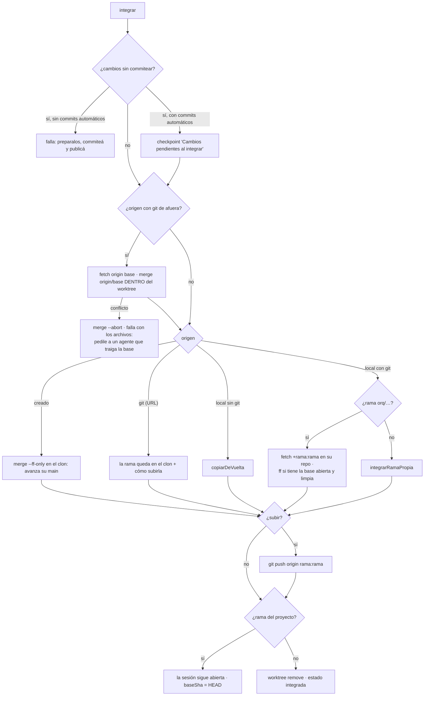

# Control de versiones y publicación

El IDE tiene un panel de Git como el de Cursor o VS Code —preparar, commitear,
stash, ramas, fusión, historial— montado **sobre el worktree de la sesión**
(`apps/server/src/scm.ts` → `ControlDeVersiones`). Publicar lleva lo commiteado
a la rama de la persona en **su** carpeta (`RepoStore.integrar`,
`apps/server/src/repos.ts`). La UI la documenta [[Panel de control de código]].

## Las reglas

- **Los agentes no commitean ni publican.** Publicar y descartar viven sólo en
  rutas HTTP, del lado de la persona; ninguna herramienta de agente hace
  ninguna de las dos (ver [[ADR-008 Publicar lo decide una persona]]).
- **Nada escribe mientras un agente tiene el arriendo** (409 con el nombre de
  quien escribe). Lo que mueve el árbol entero —stash, cambiar o crear rama,
  fusionar— espera además a que **no haya corrida viva**: su próximo turno
  arrancaría sobre otra cosa sin saberlo (`operacionScm` con `sinCorrida`).
- **Cambiar de rama mueve la sesión** (`RepoStore.cambiarRamaDeSesion`):
  publicar lleva la rama abierta, y si la fila siguiera diciendo otra se
  publicaría una rama sin el trabajo.
- **Una fusión con conflicto se aborta y nombra los archivos.** Un árbol con
  marcas de conflicto que nadie mira es donde el próximo checkpoint de un
  agente las commitea como código.

## El estado (`ControlDeVersiones.estado`)

| Campo | Qué es |
|---|---|
| `rama`, `cabeza` | la rama abierta y su commit |
| `adelante` | commits desde la base de la sesión |
| `preparados`, `cambios`, `conflictos` | de `git status --porcelain=v1 -z -uall --no-renames` (un renombre se ve como borrado + nuevo) |
| `stashes` | referencia, mensaje, fecha |
| `ramas` | locales, con `actual` y `ocupada` (abierta en otro worktree, p. ej. la base en el clon) |
| `puedeModificarUltimo` | `adelante > 0`: el último commit es de la sesión |
| `base` | la rama base **en el repo de la persona** (`origin/dev`): cuánto lleva la sesión sin publicar (↑) y cuánto avanzó ella (↓) |
| `ramasDelRepo` | sus ramas (`origin/*`) y las de su remoto (`remoto/*`, su GitHub), con si ya existe la local |

> [!warning] `--intent-to-add` y los archivos nuevos
> El diff de la sesión, el mensaje generado, `estado_git` y la huella de los
> comandos marcan los archivos nuevos con `git add -A --intent-to-add` para que
> `git diff` los vea. El estado los muestra como **nuevos** (`?`), no como
> agregados. Y `git stash` no sabe guardar esas entradas ("not uptodate. Cannot
> save the current worktree state"): `soltarIntencionDeAgregar` los devuelve a
> "sin seguimiento" antes de un stash o de un cambio de rama, sin tocar el archivo.

## Las operaciones

Todas por `POST /api/sesiones/:id/scm/<operación>` salvo indicación.

| Operación | Qué hace | ¿Sin corrida viva? |
|---|---|---|
| `preparar` / `quitar` | `add -A -- rutas` / `restore --staged` (o `rm --cached` si no hay `HEAD`); rutas validadas con `resolverEnWorktree` | no |
| `descartar` | lo rastreado vuelve a `HEAD`, lo nuevo **se borra** (sin papelera; la UI confirma) | no |
| `commit` | ver abajo | no |
| `mensaje` | genera el mensaje ✨ | no |
| `stash` | `stash push`, con archivos nuevos por default, o sólo lo preparado (`--staged`) | sí |
| `stash/usar` | `apply`/`pop` con `--index` (reintenta sin él) o `drop`; la ref tiene que ser `stash@{N}` | sí |
| `ramas/crear` | `switch -c <nombre> [desde]`, llevándose lo sin commitear | sí |
| `ramas/cambiar` | `switch`; si sólo existe en `origin/` o `remoto/`, `switch --track -c` explícito (con la misma rama en los dos lados git se niega a adivinar) | sí |
| `ramas/borrar` | `branch -D`; no la abierta, no la base, no una abierta en otro lado | no |
| `ramas/fusionar` | `merge --no-edit` con la identidad de la persona; con cambios sin commitear no arranca; conflicto → `merge --abort` y la lista | sí |

Los nombres de rama pasan por `git check-ref-format --branch` y no pueden
empezar con `-`. **"Traer"** lo nuevo de su base es `ramas/fusionar` con
`origin/<base>`.

Lecturas: `GET /api/repos/:id/scm` (estado; además alinea una sesión vacía de
antes y sincroniza con su repo en segundo plano, ver
[[Repositorios y sesiones]]), `POST …/scm/sincronizar` (forzado),
`GET …/scm/historial` y `GET …/scm/commit/:sha`.

### Commit

Con la identidad de git de la persona (`identidadDePersona`, pasada con `-c
user.name/-c user.email`), `--no-verify`:

- sin mensaje falla, salvo `amend`; con conflictos sin resolver, falla;
- **sin nada preparado commitea todo**, como el *smart commit* de VS Code;
- **`amend` sólo sobre commits de la sesión**: modificar uno de la base
  reescribiría una historia que no es de acá;
- primer renglón título (hasta 200), el resto cuerpo (hasta 8.000).

### Historial

La historia de la rama abierta **entera**, no sólo la de la sesión: en INSPIA,
881 commits de `dev`. Paginada (`cantidad` entre 10 y 200, default 60, y
`desde`), con las ramas y tags de cada commit (`%D`), si es una fusión, y
**`sinIntegrar`**: lo que todavía no está en su base (hasta 2.000 commits de
`origin/<base>..rama`). Los archivos de un commit se comparan contra su primer
padre, así una fusión se lee como "lo que trajo".

### El mensaje ✨ (`Runtime.generarMensajeDeCommit`)

**Una sola llamada** al tier `cheap` del proveedor preferido, no una corrida:
no hay nada que coordinar. Describe lo preparado, o todo si no hay nada
preparado (`diffParaMensaje`), con el diff acotado a 14.000 caracteres. Imita
los últimos commits del repo —los de la sesión y los 15 últimos de la base,
sin los automáticos—: idioma, `tipo(área): …`, largo. Un mensaje correcto pero
escrito distinto al historial es ruido que alguien reescribe. Sin ejemplos,
castellano rioplatense. Título de hasta 72 caracteres y hasta cuatro viñetas.
Corte de 120 s, temperatura 0,2, 400 tokens. Se le sacan las comillas, los
bloques de código y las firmas que agrega el CLI de Claude
(`Co-Authored-By:`, `Signed-off-by:`, "Generated with"): es un commit de la persona.

## Publicar (`RepoStore.integrar`)

`POST /api/sesiones/:id/integrar` `{ subir? }`. Contesta 409 si hay una corrida
viva, y detiene los servicios sólo si la sesión se va a cerrar.

1. **Nada sin commitear.** Publicar no commitea por ella con un mensaje
   genérico ("Tenés cambios sin commitear. Preparalos y hacé commit (podés
   generar el mensaje con ✨), o descartalos").
2. **Absorber la base adentro del worktree.** Un conflicto se le pide a un
   agente, **nunca se resuelve en la carpeta de ella**.
3. **Según el origen**:
   - `creado`: su `main` sólo avanza publicando sesiones, así que siempre es
     fast-forward. Para llevárselo: el patch o la carpeta del clon.
   - `git` por URL: no hay push salvo que se pida; se dice el comando.
   - Carpeta sin git (`copiarDeVuelta`): por cada archivo tocado, compara el
     hash de su versión en la base con el de su carpeta (`hash-object`). Si
     ella lo cambió, lo borró, o creó uno con el mismo nombre, **no se copia
     nada** y se nombran los conflictos. Si no, se escriben (o borran) los
     tocados, sólo dentro de su carpeta.
   - Carpeta con git y rama `orq/…` (nuestra): `fetch +rama:rama` desde el clon
     —el `+` porque republicar la misma sesión la actualiza—; si tiene la base
     abierta y sin cambios rastreados, `merge --ff-only`; si no, la rama queda
     creada y se dice `git merge <rama>`.
4. **`subir`** (`subirAlRemoto`): `git push origin <rama>:<rama>` desde su repo
   (origen local) o desde el clon (URL), con su ayudante de credenciales o su
   agente SSH, sin hooks y **sin forzar nunca**: un push que no es
   fast-forward se rechaza. Es una acción hacia afuera que la persona marca
   explícitamente (la UI avisa que puede disparar un despliegue).
5. **En la rama del proyecto publicar no cierra nada**: ella sigue trabajando
   sobre `dev` con los mismos servicios andando, y la base pasa a ser lo
   publicado (`baseSha = HEAD`), así "contra la base" vuelve a empezar de cero.
   Las `orq/…` y las copias sí se cierran: `worktree remove` y `integrada` con
   `integracion` registrada.

### Una rama con nombre propio nunca se pisa (`integrarRamaPropia`)

Con `+rama:rama` —la regla de las `orq/*`— una sesión abierta en `main` le
habría reescrito el `main` a la persona. Para una rama suya:

- **Si la tiene abierta en su carpeta**: trae la rama del clon a `FETCH_HEAD`.
  Lo que ella tiene **sin commitear no frena la publicación si no se pisa**:
  se ensaya antes de tocar nada —`git stash create` arma un commit con sus
  cambios sin escribir refs ni archivos, y `git merge-tree --write-tree
  --name-only --merge-base HEAD FETCH_HEAD <ese commit>` hace la mezcla sin
  tocar el árbol—. Si choca, **no se toca nada** y se nombran los archivos
  ("Commitealos en tu carpeta, traé la rama a la sesión y volvé a publicar"):
  un autostash que choca le dejaría marcas de conflicto en sus archivos. Si no
  choca, `git merge --ff-only --autostash FETCH_HEAD`: se aparta, se adelanta y
  se repone. Su trabajo queda como estaba, sin commitear, y sin entradas de
  stash.
- **Si no la tiene abierta**: `fetch <clon> rama:rama` **sin `+`**, que git sólo
  acepta si avanza. Si avanzó por otro lado, "no se pisó".
- Cualquier otra cosa falla y la sesión **no** se da por publicada.

## Descartar (`RepoStore.descartar`)

`POST /api/sesiones/:id/descartar` (409 con corrida viva; detiene los
servicios): `worktree remove --force`, borra la carpeta y `worktree prune`. Una
`orq/…` se borra con sus checkpoints; **la rama del proyecto no se borra**:
vuelve a `origin/<rama>`, como está en su repo. Los commits de la sesión sin
publicar se pierden (la UI lo confirma). Estado `descartada`.

## Archivos sensibles (`esArchivoDeEjecucion`)

Lo que cambia **qué se ejecuta** hay que mirarlo con otros ojos antes de
publicar: `package.json`, `Makefile`, `Dockerfile`, `pyproject.toml`,
`setup.py`, `Cargo.toml`, `.npmrc`, los `*.config.*` de vite, vitest, jest,
playwright, webpack, rollup, tsup y babel, `.github/`, `.gitlab-ci*`, `.husky/`
y todo `*.sh`. `RepoStore.estado` los devuelve en `sensibles`. Sin commits
automáticos cuentan **sólo los que todavía no se commitearon**: lo commiteado
lo firmó ella, ya lo miró; si no, el aviso no se iba hasta publicar.

## Casos borde y fallas

- **Cualquier falla del `merge --ff-only`** en su carpeta se informa como "la
  rama avanzó por otro lado": también un archivo suyo sin seguimiento con el
  mismo nombre que uno nuevo de la sesión (`stash create` no guarda los sin
  seguimiento).
- **Si el ensayo con `merge-tree` falla por otro motivo** (un git muy viejo que
  no lo conoce), se informa como choque.
- **Origen por URL sin `subir`**: la rama queda sólo en el clon.
- **Una rama creada en el IDE sin contraparte en su repo** sobrevive a
  descartar, como rama local del clon.

## Qué fijan los tests

`apps/server/src/scm.test.ts`:

- prepara, commitea con mensaje y modifica el último commit; no modifica con `amend` un commit de la base;
- descartar vuelve lo rastreado y borra lo nuevo;
- stash guarda y trae de vuelta, archivos nuevos (marcados con `--intent-to-add`) incluidos; una ref que no es un stash se rechaza;
- crear y cambiar de rama mueve la sesión, y se puede volver a la rama del proyecto;
- fusionar trae la otra rama; con conflicto aborta y nombra los archivos;
- la base es su `dev` y sus ramas se ven y se abren (con upstream);
- la historia es la de la rama entera, con ramas y tags, y marca lo no integrado;
- publicar adelanta su `dev` y no deja ramas `orq/*`; una rama con nombre propio que avanzó en su carpeta no se pisa.

`apps/server/src/repos.test.ts`: sin commits automáticos publicar no commitea;
publicar hace fast-forward y la sesión sigue abierta con la base nueva; con la
carpeta sucia publica igual si no se pisa (su cambio sigue sin commitear y no
queda stash); con la carpeta sucia que choca no toca nada y nombra el archivo;
si la base cambió y choca, nombra los conflictos; descartar deja la rama como en
su repo; una copia sin git copia de vuelta y no pisa lo que ella cambió; un repo
creado avanza su propio `main`; `esArchivoDeEjecucion`.

## Fuentes

- `apps/server/src/scm.ts` → `ControlDeVersiones` (`estado`, `historial`, `archivosDeCommit`, `preparar`, `quitar`, `descartar`, `commit`, `diffParaMensaje`, `guardarStash`, `soltarIntencionDeAgregar`, `usarStash`, `crearRama`, `cambiarRama`, `borrarRama`, `fusionar`), `explicarGit`
- `apps/server/src/repos.ts` → `integrar`, `integrarEnRepoLocal`, `integrarRamaPropia`, `subirAlRemoto`, `copiarDeVuelta`, `descartar`, `estado`, `esArchivoDeEjecucion`, `cambiarRamaDeSesion`
- `apps/server/src/runtime.ts` → `generarMensajeDeCommit`
- `apps/server/src/rutas-codigo.ts` → `operacionScm`, `/integrar`, `/descartar`, `/scm`

## Ver también

- [[Trabajo con código]]
- [[Instantáneas y checkpoints]]
- [[Panel de control de código]]
- [[Repositorios y sesiones]]
