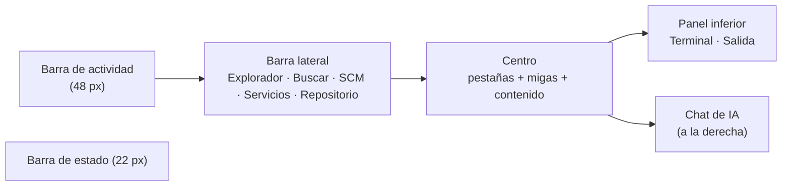
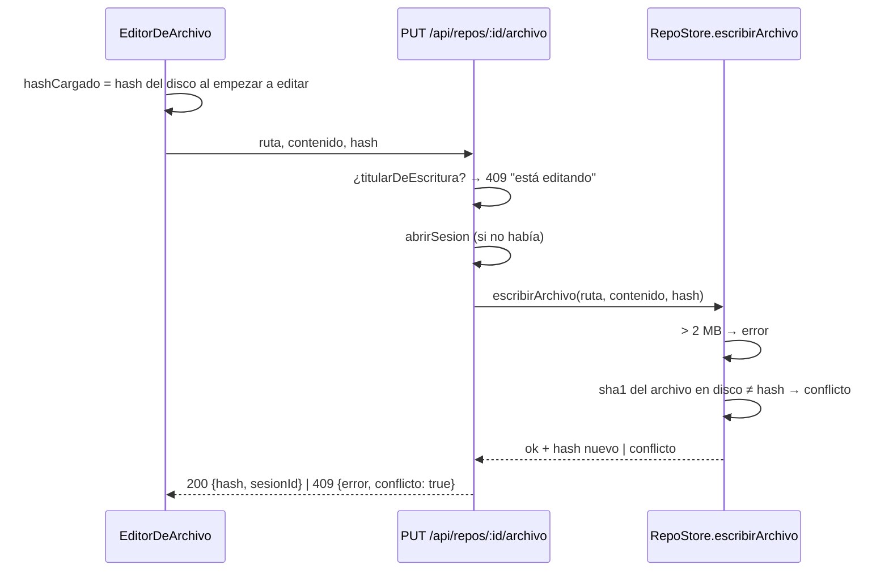

# El IDE

La pestaña **Código** (`/p/:companyId/codigo`) es un IDE a la manera de VS Code
y Cursor: explorador, editor con pestañas, búsqueda, control de código fuente,
terminal, servicios, vista previa y un chat de IA. Trabaja sobre **el mismo
worktree que los agentes** —la sesión del repo, nunca la carpeta de la
persona—, así que además de editar sirve para **mirarlos trabajar**: el árbol
marca lo que tocaron, el archivo abierto se actualiza cuando lo editan, la vista
previa se recarga con cada checkpoint y la barra de estado dice quién tiene el
arriendo de escritura.

Existe porque el trabajo de código de un equipo de agentes no se puede revisar
por la traza: hay que ver el árbol, el diff, correr los tests y decidir qué se
publica. Hacerlo en otra herramienta obligaba a abrir la carpeta del worktree a
mano, sin saber si un agente estaba escribiendo en ese momento. La otra mitad
—cómo se clona, qué es una sesión, cómo se integra— está en
[[Trabajo con código]] y [[Repositorios y sesiones]].

## Dónde vive y cómo carga

- Ruta: `apps/web/src/App.tsx` registra `codigo` dentro de `/p/:companyId` y
  monta `Codigo` con `key={company.id}` (cambiar de proyecto rearma todo).
- **Carga diferida:** `const Codigo = lazy(() => import("./routes/Codigo.js"))`
  con un `Suspense` que dice "Abriendo el IDE…". Monaco pesa varios MB y sólo
  se baja cuando alguien abre la pestaña.
- **Monaco empaquetado, sin CDN** (`apps/web/src/routes/codigo/monaco.ts`):
  `@monaco-editor/react` por default lo baja de jsdelivr, y un IDE que no abre
  archivos sin red no es un IDE. Detalle en [[Editor, explorador y búsqueda]].
- El componente raíz es `apps/web/src/routes/Codigo.tsx` → `Codigo`. Cada
  pieza vive en `apps/web/src/routes/codigo/`.

## Disposición



| Zona | Tamaño default | Límites | Se guarda en `localStorage` |
|---|---|---|---|
| Barra lateral | 280 px | 180–640 | `orq-ide-lateral` |
| Panel inferior | 220 px | 100–700 | `orq-ide-panel` |
| Chat | 380 px | 300–720 | `orq-ide-chat` |

Los tres se redimensionan arrastrando un separador (`arrastrar` en
`Codigo.tsx`, con `pointermove` y el cursor fijado en `document.body` mientras
dura). El tamaño se guarda al soltar; sin almacenamiento disponible vuelve al
default la próxima vez (`leerNumero`/`guardarNumero` envuelven todo en
`try/catch`).

> [!danger] La grilla tiene columna explícita a propósito
> El contenedor es `grid-cols-[minmax(0,1fr)] grid-rows-[minmax(0,1fr)_22px]`.
> Sin columna explícita la grilla crea una `auto` que crece con el contenido, y
> Monaco mide **16 millones de px** de ancho interno: al abrir el chat la página
> entera se corría de costado. Es la misma familia de bug que el `min-w-0` de
> [[Trampas conocidas]].

### Barra de actividad

| Vista | Ícono | Atajo | Contador |
|---|---|---|---|
| Explorador | `Files` | ⌘⇧E | — |
| Buscar | `Search` | ⌘⇧F | — |
| Control de código fuente | `GitBranch` | ⌘⇧G | archivos cambiados contra la base de la sesión (`arbol.cambios`) |
| Servicios | `Boxes` | — | servicios en estado `listo` |
| Repositorio | `Settings2` | — | — |

Abajo, separados, el chat (`Sparkles`, ⌘L) y la terminal (`SquareTerminal`,
⌃\`). Tocar el ícono de la vista abierta **cierra** la barra lateral
(`setVista((v) => (v === a.id ? null : a.id))`). Tocar "Repositorio" deja
elegido para configurar el repo activo.

Sin ningún repo cargado (`repos.isSuccess && lista.length === 0`) la barra
lateral se abre sola en la vista Repositorio, y el centro dice "Cargá una
carpeta de código para empezar". Ver [[Configuración de repos y servicios]].

## Las vistas laterales quedan montadas

Las cinco vistas se renderizan juntas y se ocultan con `className="hidden"` (la
visible usa `contents`). Si se desmontaran al cambiar de vista, ir a Buscar y
volver cerraría todas las carpetas del explorador y borraría la búsqueda: el
estado vive adentro de cada componente. Dos excepciones deliberadas:

- `Buscar` y `Terminal` llevan `key={idRepo}`: al cambiar de repo activo se
  rearman, porque la búsqueda y el historial son de **ese** repo.
- `ControlDeCodigo`, `Servicios` y `Buscar` sólo se montan si hay un repo activo
  (`idRepo`).

> [!warning] Ocultar la barra sí desmonta
> La barra lateral entera se renderiza con `{(vista || sinRepos) && …}`: cerrarla
> con ⌘B, o tocando el ícono de la vista abierta, desmonta todas las vistas.
> Al reabrirla, las carpetas del explorador vuelven cerradas y la búsqueda
> vacía. Lo que se conserva es el cambio **entre** vistas.

## Un repo, una raíz

El explorador es un workspace de varias carpetas: **cada repo del proyecto es
una raíz propia**, con su árbol, su rama y sus acciones. El detalle de la raíz
(renombrar, archivo nuevo, configurar, sacar) está en
[[Editor, explorador y búsqueda]].

### El repo activo

Casi todo opera sobre un solo repo a la vez: control de código, búsqueda,
servicios, terminal y chat. Cuál es sale de `Codigo.tsx`:

```ts
const idRepo = pestanaActiva?.repoId
  ?? (lista.some((r) => r.repo.id === repoElegido) ? repoElegido : lista[0]?.repo.id ?? null);
```

O sea: el de la pestaña que tenés abierta; si no hay, el último que tocaste
(`repoElegido`); si no, el primero. `repoElegido` cambia al abrir un archivo,
tocar una raíz del explorador, elegir en los `select` de Buscar/SCM/Servicios
(que aparecen sólo con más de un repo), mandar algo al chat o cargar un repo
nuevo. Con más de un repo, la barra de estado, el panel inferior y las pestañas
muestran el nombre del repo para que no haya dudas.

## Pestañas

Cada pestaña es un `Pestana { id, repoId, tipo, ruta, nota?, nuevo?, desde?, hasta? }`.
El id es `${repoId}:${tipo}:${ruta}` más `@<hasta>` en los diffs de un pedido
(`idDe`): abrir dos veces lo mismo enfoca la pestaña existente.

| Tipo | Qué muestra | Rótulo | Cómo se abre |
|---|---|---|---|
| `archivo` | el editor Monaco (`EditorConArbol` → `EditorDeArchivo`) | nombre del archivo | explorador, búsqueda, chat, enlaces del markdown |
| `diff` | `DiffDeArchivo` contra la base de la sesión, o entre dos commits | nombre + "(cambios)" o "(pedido)" | SCM, historial, "archivos cambiados" de un pedido |
| `vista` | la vista previa estática (`VistaConVersion` → `VistaPrevia`) | "Vista previa · página" | ojo de la barra de pestañas, ojo de un `.html` en el explorador |
| `servicio` | `VistaDeServicio`: navegador, consola de API o teléfono | "▶ nombre del servicio" | vista Servicios |
| `docs` | índice de notas + la nota (`Documentacion`) | nombre de la nota abierta | servicio de documentación |
| `nota` | un `.md` renderizado (`NotaSuelta`) | "Vista · nombre" | botón "Vista de lectura" de un `.md` |

Reglas de reuso: **una sola pestaña `vista` por repo** (cambiar de página la
reusa, `abrirVistaPrevia`), **una `docs` por carpeta** (navegar cambia su
`nota`, `abrirDocs`), y un diff de pedido distinto por cada `hasta`.

- Una pestaña de archivo con cambios sin guardar muestra un punto en lugar de
  la ✕; cerrarla pide confirmación ("¿Cerrar … sin guardar?"). El clic del medio
  cierra.
- El nombre se tiñe según el estado git en la sesión: verde si es nuevo (`A`),
  ámbar si cambió.
- Sobre un `archivo` o un `diff` hay una barra de migas (repo › carpetas ›
  archivo). En un `.md`, a la derecha, **Vista de lectura** abre la nota
  renderizada (ver [[Notas de Obsidian en el IDE]]).
- Sin pestaña abierta, el centro muestra la bienvenida con los atajos, y dice
  si hay un agente escribiendo o una corrida en curso.

## La vista previa estática

`apps/web/src/routes/codigo/VistaPrevia.tsx` sirve el proyecto tal cual está en
la sesión, página por página, por `/api/repos/:repoId/vista/<ruta>` (sin sesión,
desde la rama base del clon). Sirve para un sitio estático o un simulador en
HTML; una app de Vite o Expo se ve levantando su servicio (ver
[[Configuración de repos y servicios]]).

- **Se recarga sola** cuando cambia `version`, que arma `VistaConVersion` como
  `${guardados}-${commits}-${sesionId}`: sube con cada guardado tuyo y con cada
  checkpoint de un agente. El botón del rayo (`Zap`/`ZapOff`) apaga la
  recarga automática y congela la versión.
- La barra de dirección ofrece, en un `datalist`, las páginas `.html` del repo
  que no están en `node_modules/`.
- El `iframe` va con `sandbox="allow-scripts allow-pointer-lock allow-forms"` y
  **sin** `allow-same-origin`.

El lado servidor (tipos de contenido, `resolverEnWorktree`, por qué el CORS
abierto sólo ahí) está en [[Vista previa y proxy]]; la seguridad, abajo.

## Mirar trabajar a los agentes

El IDE no tiene un canal propio de "qué hace el agente": lo deduce del árbol.
Dos mecanismos:

1. **SSE de código:** `GET /api/companies/:companyId/codigo/stream` emite eventos
   `codigo` (`EventoDeCodigo` en `apps/server/src/repos.ts`: `repo_cargado`,
   `repo_eliminado`, `sesion_abierta`, `sesion_integrada`, `sesion_descartada`,
   `checkpoint`, `servicio`). Cada uno invalida en react-query las claves
   `repos`, `arbol`, `sesion`, `servicios` y `scm`. Cubre lo que pasa **fuera**
   de una corrida: integrar, un commit desde el panel, un pedido deshecho.
2. **Sondeo:** lo que cambia dentro de un turno se pide seguido.

| Qué | Cada cuánto | Dónde |
|---|---|---|
| Árbol + cambios + escritor (`GET /api/repos/:id/archivos`) | 3 s | `Codigo`, `RaizDeRepo`, `EditorConArbol`, `VistaConVersion` (comparten la clave `["arbol", repoId]`) |
| Archivo abierto (`GET /api/repos/:id/archivo`) | 3 s **mientras no haya cambios sin guardar** | `EditorDeArchivo` |
| Estado git del panel (`GET /api/repos/:id/scm`) | 3 s | `ControlDeCodigo` |
| Servicios | 1 s si alguno está preparando o arrancando; si no, 10 s | `useServicios` |
| Nota de Obsidian | 5 s | `Nota` |

`refetchOnWindowFocus` está apagado en toda la app (`apps/web/src/main.tsx`),
así que volver a la pestaña del navegador no refresca nada por sí solo.

> [!danger] El `git status` cada tres segundos ya rompió un checkpoint
> `git status` refresca el índice y para eso toma `index.lock`. Con el IDE
> abierto pidiéndolo cada 3 s, el checkpoint de un turno falló con
> "index.lock: File exists" y el cambio del agente quedó sin commitear. Por eso
> `apps/server/src/git.ts` corre todo con `GIT_OPTIONAL_LOCKS=0` y reintenta
> cuando el lock está ocupado. Ver [[Git endurecido]].

## Sólo lectura mientras un agente escribe

Uno escribe por vez: un turno de un rol con herramientas que escriben toma el
**arriendo** del repo (ver [[Arriendo de escritura y resumen de código]]).
`GET /api/repos/:id/archivos` devuelve `escritor` =
`Runtime.titularDeEscritura(repoId)` (el nombre del rol, o `null`), y con eso:

- El editor pasa a `readOnly` con un aviso con candado: "*X* está escribiendo en
  su turno: el archivo se actualiza solo y vas a poder editar cuando termine".
- El explorador esconde "archivo nuevo" y "borrar".
- Los botones del control de código se deshabilitan y avisan.
- La barra de estado se pone violeta y dice "*X* está escribiendo".

Es comodidad, no la garantía: el servidor rechaza igual con **409** cualquier
escritura de la persona mientras hay titular (el mensaje nombra al rol y aclara
"tu cambio sigue en el editor").

## Guardar lleva el hash de lo que se cargó

Pisar el trabajo de un agente sin que nadie se entere es exactamente lo que el
arriendo evita entre agentes, y vale igual entre agente y persona. Por eso
guardar no es "escribir lo que tengo": es "escribir lo que tengo **si el disco
sigue como cuando empecé a editar**".



- **Del lado del editor** (`EditorDeArchivo`): mientras no haya cambios propios,
  `hashCargado` sigue al último hash que llegó. Apenas hay cambios se congela:
  el hash contra el que se guarda es el de lo que había **cuando empezaste**, no
  el último.
- **Del lado del servidor** (`apps/server/src/repos.ts` → `escribirArchivo`):
  `hashPrevio` distingue tres casos. Un string es "tiene que coincidir con el
  sha1 del disco"; `null` es "archivo nuevo: no tiene que existir"; ausente es
  "no verifiques". Si el archivo ya no existe el motivo dice que lo borró
  alguien; si cambió, que lo tocó un agente.
- **La persona elige.** Cuando el editor ve que el hash del disco ya no es el
  cargado, aparece un aviso ámbar con dos botones: **Quedarme con la del disco**
  (descarta lo editado) y **Guardar la mía igual** (guarda sin hash, o sea sin
  verificar).

> [!warning] El aviso aparece cuando el editor se entera
> Con cambios sin guardar, el editor **deja de sondear** el archivo (si no, el
> contenido se movería debajo del cursor). El aviso aparece cuando la consulta
> se refresca por otro camino —una pestaña de diff del mismo archivo, que sí
> sondea, o una invalidación del panel de control—. Si no, el conflicto lo
> detecta el servidor al guardar: 409, un aviso con el motivo, y lo editado
> sigue en el editor.

Un archivo nuevo (creado desde el explorador) se guarda con `hash: null`; si en
el medio apareció uno con esa ruta, también es conflicto. Guardar **abre la
sesión** si no había una: mirar no abre sesiones, escribir sí.

### Lo que edita la persona y los commits

Por default (`repositorio.commitsAutomaticos: false`) nada se commitea solo:
lo que edita la persona y lo que edita un agente quedan juntos sin commitear, y
ella decide desde el [[Panel de control de código]].

Con `commitsAutomaticos` prendido, `abrirTurnoDeCodigo`
(`apps/server/src/codigo-servidor.ts`) commitea lo pendiente **a nombre de la
persona** —su identidad de git, leída aparte por
`RepoStore.identidadDePersona`— antes de que el agente toque nada, con el
mensaje "Cambios hechos desde el IDE, commiteados antes del turno de *rol*". Sin
eso el checkpoint del agente se llevaba el trabajo de ella firmado por el
agente.

## Qué espera a que no haya un agente o una corrida

El servidor distingue dos niveles: lo que escribe en la sesión espera a que
**ningún agente tenga el arriendo**; lo que mueve la rama o el árbol entero
espera además a que **no haya una corrida viva**, porque su próximo turno
arrancaría sobre otra cosa sin saberlo (`operacionScm` en
`apps/server/src/rutas-codigo.ts`).

| Operación | Endpoint | Con arriendo tomado | Con corrida viva |
|---|---|---|---|
| Guardar / borrar un archivo | `PUT` / `DELETE /api/repos/:id/archivo` | 409 | sí se puede |
| Preparar, quitar, descartar, commit, generar mensaje, borrar rama | `POST /api/sesiones/:id/scm/…` | 409 | sí se puede |
| Stash, crear o cambiar de rama, fusionar ("Traer") | `POST /api/sesiones/:id/scm/…` con `sinCorrida` | 409 | 409 |
| Deshacer un pedido del chat | `POST /api/sesiones/:id/deshacer-entre` · `/revertir` | 409 | sí se puede |
| Publicar / integrar | `POST /api/sesiones/:id/integrar` | — | 409 |
| Descartar la sesión | `POST /api/sesiones/:id/descartar` | — | 409 |
| Sacar el repo del proyecto | `DELETE /api/repos/:id` | — | 409 |
| Sincronizar con el origen | `POST /api/sesiones/:id/scm/sincronizar` | sí | sí (no toca el worktree) |
| Renombrar el repo | `POST /api/repos/:id/renombrar` | sí | sí (el slug no cambia) |
| Terminal | `POST /api/repos/:id/ejecutar` | sí (va a la fila del repo) | sí |

La UI refleja el primer nivel (botones deshabilitados); el segundo lo dice el
servidor al intentar, con un mensaje que explica por qué.

## Barra de estado

De izquierda a derecha: nombre del repo (con más de uno), rama de la sesión (o
"*ramaBase* (base)" en gris si no hay sesión: la base en sólo lectura), cantidad
de cambios y de checkpoints, quién escribe o "corrida en curso", los servicios
levantados con su puerto (clic → vista Servicios), y a la derecha línea y
columna del cursor, el lenguaje del archivo y los botones de chat y panel.

El fondo tiene colores **fijos** —violeta si hay un agente escribiendo, azul si
hay sesión, gris si no— y no el acento del tema: en oscuro el acento es claro y
el texto blanco encima no se leía.

## Atajos

| Atajo | Qué hace |
|---|---|
| ⌘L | en el editor: manda la selección (o el archivo entero) al chat; fuera del editor: abre o cierra el chat |
| ⌘⇧E · ⌘⇧F · ⌘⇧G | explorador · buscar · control de código fuente |
| ⌘B | muestra u oculta la barra lateral |
| ⌃\` | abre o cierra el panel inferior |
| ⌘S | guarda (comando registrado en Monaco) |

Los atajos globales viven en un `keydown` de `window` en `Codigo`; el ⌘L del
editor lo maneja Monaco (acción `orq.agregar-al-chat`) y el global lo ignora si
el foco está dentro de `.monaco-editor`.

## Seguridad

La vista previa corre código que escribió un agente **en tu navegador**. Eso
decidió tres cosas, las tres en el servidor:

1. **Sandbox puesto por el servidor.** `GET /api/repos/:repoId/vista/*` responde
   con `Content-Security-Policy: sandbox allow-scripts allow-pointer-lock allow-forms`.
   El atributo `sandbox` del iframe sólo protege dentro del IDE; abierta en una
   pestaña aparte, la página correría con el origen de la app y, por el proxy de
   Vite, con acceso a toda la API (borrar empresas, correr comandos).
2. **CORS abierto sólo ahí.** Con origen opaco, los ES modules necesitan CORS
   para cargar: esas respuestas —y sólo ésas— van con
   `Access-Control-Allow-Origin: *`, más `nosniff` y `no-store`.
3. **La API dejó de contestarle a cualquiera.** `construirApp({ origenes })`
   (`apps/server/src/app.ts`) registra CORS con la lista de orígenes de la app
   (el de `APP_URL`, `localhost`/`127.0.0.1` en 5173 y en el puerto del
   servidor; `apps/server/src/index.ts`). Un pedido sin `Origin` pasa (la UI va
   por el proxy de Vite, mismo origen); uno de otra página, o el `null` de la
   vista previa, no recibe el encabezado y el navegador no le deja leer la
   respuesta.

Lo demás: la vista de un **servicio** es otro origen (`127.0.0.1:43xx`) y por eso
puede llevar `allow-same-origin` (ver [[Selector de elementos e inspector]]); la
[[Terminal del IDE]] no es una shell; y el markdown del chat y de las notas no
ejecuta HTML crudo (ver [[Chat de IA]]).

## Casos borde

- **Cerrar la barra lateral** pierde carpetas abiertas y búsqueda (ver arriba).
- **Cambiar de repo activo** rearma la búsqueda y la terminal: su historial es
  por repo y vive en memoria.
- **Un archivo binario** (un byte NUL en los primeros 8.000) **o de más de 2 MB**
  no se abre: se muestra su tamaño.
- **Editar mientras un agente toma el arriendo:** lo editado queda en el buffer,
  el editor pasa a sólo lectura y guardar da 409 hasta que termine el turno.
- **Sacar un repo con trabajo sin integrar** deja un respaldo (bundle + patch)
  en Salida → `respaldos/`; el aviso lo dice.

## Integración

| Qué | Dónde |
|---|---|
| Endpoints del IDE | `apps/server/src/rutas-codigo.ts` → `registrarRutasDeCodigo` (ver [[Referencia de API de código y móvil]]) |
| Cliente | `apps/web/src/api.ts` → `arbolDeRepo`, `archivo`, `guardarArchivo`, `borrarArchivo`, `vistaUrl`, `repos` |
| Quién escribe | `Runtime.titularDeEscritura` → `ArriendosDeCodigo.titular` |
| Eventos de código | `Runtime.subscribeCodigo` / `broadcastCodigo` |
| Tema | `useTemaMonaco` sigue `data-theme` (ver [[Sistema de diseño y temas]]) |

## Qué fijan los tests

- `apps/server/src/ide.test.ts` → "vista previa": sirve HTML y JS con su tipo,
  CORS abierto sólo para sí misma, CSP `sandbox allow-scripts` **sin**
  `allow-same-origin`; no deja leer `.git` ni salir del repo (`..%2F`).
- `apps/server/src/ide.test.ts` → "CORS": la API le contesta al origen de la app
  y no a `https://malicioso.example` ni a `null`.
- `apps/server/src/repos.test.ts` → "RepoStore desde el IDE": sin sesión se lee
  la base y listar no abre sesión; guardar con un hash viejo no pisa lo que
  cambió en disco; un archivo nuevo se guarda con `null` y no se escribe en
  `.git` ni fuera del árbol.
- `apps/server/src/git.test.ts`: con `index.lock` tomado, git espera y commitea;
  un lock que no se suelta es un error, no una espera eterna.

## Cómo extender

- **Una vista lateral nueva:** sumala a `VistaLateral` y a `ACTIVIDADES`, y
  renderizala junto a las otras con el patrón `contents`/`hidden`. No la montes
  condicionalmente a que esté visible: perdería su estado.
- **Un tipo de pestaña nuevo:** agregalo a `Pestana["tipo"]`, dale ícono en
  `IconoDePestana`, rótulo en la barra de pestañas y rama en el render del
  centro. Si puede repetirse, decidí qué parte va en el id.
- **Cualquier escritura nueva** desde la UI tiene que pasar por el servidor con
  el chequeo de `titularDeEscritura`, y si mueve el árbol entero, también
  `tieneCorridaViva`.
- Todo contenedor de grilla nuevo: columnas explícitas con `minmax(0,1fr)` y
  `min-w-0` en los hijos.

## Fuentes

- `apps/web/src/routes/Codigo.tsx` → `Codigo`, `Pestana`, `idDe`, `abrir`, `cerrar`, `abrirVistaPrevia`, `abrirDocs`, `EditorConArbol`, `VistaConVersion`, `Bienvenida`
- `apps/web/src/routes/codigo/VistaPrevia.tsx` → `VistaPrevia`
- `apps/web/src/routes/codigo/Editor.tsx` → `EditorDeArchivo` (hash y conflicto)
- `apps/web/src/App.tsx` → `lazy`, ruta `codigo`
- `apps/web/src/main.tsx` → `QueryClient` (`refetchOnWindowFocus: false`)
- `apps/server/src/rutas-codigo.ts` → `GET /api/repos/:repoId/archivos`, `PUT/DELETE /api/repos/:repoId/archivo`, `operacionScm`, `GET /api/repos/:repoId/vista/*`, `GET /api/companies/:companyId/codigo/stream`
- `apps/server/src/repos.ts` → `escribirArchivo`, `hashDe`, `aContenido`, `TOPE_EDITABLE`, `EventoDeCodigo`
- `apps/server/src/codigo-servidor.ts` → `abrirTurnoDeCodigo`, `ArriendosDeCodigo`
- `apps/server/src/app.ts` → `construirApp`; `apps/server/src/index.ts` → `origenes`
- `apps/server/src/runtime.ts` → `titularDeEscritura`, `subscribeCodigo`

## Ver también

- [[Editor, explorador y búsqueda]] · [[Terminal del IDE]] · [[Chat de IA]]
- [[Panel de control de código]] · [[Configuración de repos y servicios]]
- [[Selector de elementos e inspector]] · [[Notas de Obsidian en el IDE]]
- [[Trabajo con código]] · [[Repositorios y sesiones]] · [[Vista previa y proxy]]
- [[Arriendo de escritura y resumen de código]] · [[Frontend web]]
- [[CU-06 Pedido de código desde el chat]]
