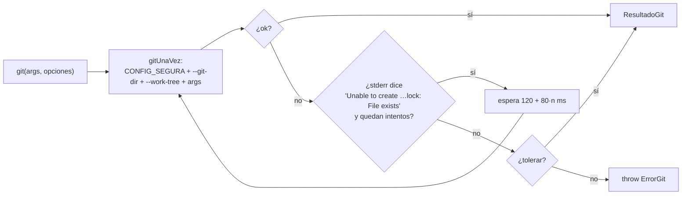

# Git endurecido

Toda llamada del servidor a git pasa por una sola función: `git()` en
`apps/server/src/git.ts`. No es un envoltorio de comodidad: es la frontera que
impide que un worktree donde escribe un agente convierta un git del servidor en
ejecución de código.

## Por qué hace falta

El servidor corre git sobre carpetas donde **un agente escribe**, y ese agente
corre `npm test`: código que él mismo puede editar. Así que git no puede confiar
en nada que viva adentro del worktree:

- Un test que escribe `.git/hooks/pre-commit` convertiría el próximo
  checkpoint del servidor en código corriendo **fuera del sandbox**.
- El `.git` de un worktree es un **archivo de texto** que apunta al repo: si
  git lo descubre solo, alcanza con reescribirlo para que opere sobre otro repo.
- La `~/.gitconfig` de la persona puede tener un `core.hooksPath` global, un
  filtro que ejecuta un programa o un `fsmonitor`.
- Un clon que pide contraseña deja el proceso esperando para siempre: la misma
  falla que "un proveedor que no contesta cuelga la corrida".

Y todo con argv, **nunca con shell**: la ruta y la rama las elige, en última
instancia, un modelo.

## La config segura (`CONFIG_SEGURA`)

Cada llamada antepone estos `-c`:

| Opción | Por qué |
|---|---|
| `core.hooksPath=/dev/null` | ningún hook corre, ni los del repo ni los globales |
| `core.fsmonitor=false` | el otro gancho que git ejecuta solo |
| `commit.gpgsign=false`, `tag.gpgsign=false` | la firma pediría una llave o un pinentry |
| `user.name=Orquestador`, `user.email=orq@localhost` | sin identidad configurada `git commit` falla; con la de la persona, los checkpoints de un agente saldrían firmados por ella. El autor real va aparte con `--author` |
| `protocol.ext.allow=never` | el transporte `ext::` ejecuta un comando |
| `protocol.file.allow=always` | el servidor clona desde la carpeta de la persona y trae ramas del clon: son rutas locales |
| `advice.detachedHead=false` | el clon vive desprendido a propósito (ver [[Repositorios y sesiones]]) |
| `init.defaultBranch=main` | un `git init` da siempre lo mismo |
| `core.autocrlf=false` | los finales de línea no cambian por la máquina |

Quien necesita otra identidad la pasa en los argumentos: `ControlDeVersiones`
commitea con `-c user.name=<persona> -c user.email=<persona>` y los checkpoints
con `--author=<rol>` (el *committer* sigue siendo "Orquestador").

## El entorno (`entornoGit`)

El proceso de git no hereda el entorno del servidor: se arma de cero.

| Variable | Valor | Por qué |
|---|---|---|
| `PATH` | el del servidor, o `/usr/bin:/bin:/usr/local/bin:/opt/homebrew/bin` | encontrar `git` y `ssh` |
| `HOME` | el del servidor, o `/tmp` | ssh busca ahí sus llaves y `known_hosts` |
| `LANG`, `LC_ALL` | `C` | los mensajes salen en inglés y **el código los interpreta** ("Already up to date", "would be overwritten", "No local changes to save") |
| `GIT_TERMINAL_PROMPT` | `0` | nunca pregunta usuario ni contraseña |
| `GIT_SSH_COMMAND` | `ssh -o BatchMode=yes -o StrictHostKeyChecking=accept-new` | ssh tampoco pregunta; un host nuevo se acepta la primera vez y una llave cambiada se rechaza |
| `GIT_CONFIG_NOSYSTEM` | `1` | sin `/etc/gitconfig` |
| `GIT_CONFIG_GLOBAL` | `/dev/null` | sin `~/.gitconfig`: la config segura tiene que ser **toda** la config |
| `GIT_OPTIONAL_LOCKS` | `0` | ver abajo |
| `SSH_AUTH_SOCK` | el del servidor, si hay | el agente SSH de la persona, para clonar y hacer `push` por ssh |
| `GIT_INDEX_FILE` | sólo con `opciones.indice` | armar una instantánea con un índice aparte (ver [[Instantáneas y checkpoints]]) |

> [!danger] Dos gits sobre el mismo worktree se cruzan
> El IDE pide `git status` cada tres segundos, y `status` toma `index.lock`
> para refrescar el índice "si puede". Más de una vez coincidió con el
> checkpoint de un turno: el commit falló con "index.lock: File exists", el
> cambio del agente quedó sin commitear y el turno siguiente lo firmó como de
> la persona. `GIT_OPTIONAL_LOCKS=0` hace que las lecturas no tomen ese lock.

## El ayudante de credenciales y la identidad de la persona

Sin la config global, un repo privado por https no se clona. `RepoStore`
(`apps/server/src/repos.ts`) lee **sólo lo necesario**, con un `execFile`
aparte, una vez por proceso:

- `configCredenciales`: `git config --get-all credential.helper`
  (`osxkeychain`, `manager`…) y lo pasa explícito como
  `-c credential.helper=<h>`. Los ayudantes que empiezan con `!` —un comando de
  shell— **se descartan**. Se usa al clonar por URL, en los `fetch` de sesión y
  publicación, y en el `push`.
- `identidadDePersona`: `user.name` y `user.email` para firmar sus commits
  desde el IDE. Sin configurar, "Persona" y `persona@orq.local`.

## `git(args, opciones)`

- **Opciones** (`OpcionesGit`): `cwd`, `gitDir` (`--git-dir` explícito: nunca se
  descubre el repo desde el worktree), `workTree`, `corteMs` (default 60 s),
  `tolerar` (devolver el resultado en vez de tirar), `entrada` (stdin),
  `maxBuffer` (default 32 MB) e `indice` (`GIT_INDEX_FILE`).
- **`cwd` por default es el `workTree`.** Con `--work-tree` y sin `cwd`,
  `grep --untracked` y `ls-files -o` trabajaban sobre el directorio del
  servidor —la raíz del orquestador—, y buscar en la sesión devolvía archivos
  del orquestador.
- **Corte por tiempo** con `SIGKILL`; si se dispara, el `stderr` empieza con
  "Se cortó por tiempo (N s)." Cortes más largos donde hace falta: clonar
  10 min, `fetch` de sesión y publicación 2 min, sincronizar 90 s, `push` 2 min.
- **Reintento por lock**: hasta 8 reintentos (9 intentos) mientras el error sea
  un lock ocupado (`LOCK_OCUPADO`), esperando 120, 200, 280… 680 ms —unos 3,2 s
  en total—. Pocos y cortos: un lock que no se suelta es un git colgado, y eso
  sí tiene que verse como error.
- **`ErrorGit`** lleva los argumentos y el resultado; su mensaje es
  `git <primeros argumentos> falló (<código>): <stderr, hasta 600 caracteres>`.
  Las rutas de código lo devuelven con **422** (`fallo` en `rutas-codigo.ts`):
  el mensaje de git es lo único que explica qué pasó.

## URLs que se pueden clonar (`validarUrlGit`)

La URL se guarda en la base y viaja en el blueprint exportado, así que se
valida antes de clonar:

| Caso | Resultado | Por qué |
|---|---|---|
| Empieza con `-` | rechazada | sería un argumento de git disfrazado (`--upload-pack=…`) |
| `algo::…` | rechazada | transportes como `ext::` ejecutan comandos |
| `file://…` o una ruta suelta | rechazada | para una carpeta de esta máquina está el origen local |
| Protocolo fuera de `https`, `http`, `ssh`, `git` | rechazada | |
| Con contraseña, o con usuario en `http(s)` (`https://usuario:token@…`) | rechazada | la misma regla que los secretos de MCP: nada de credenciales en la base |
| `https://…`, `ssh://git@…`, forma scp `git@host:org/repo.git` | aceptada | |

El acceso se configura con el ayudante de credenciales o una llave SSH, y la
URL se pega sin usuario ni token.

## Lo que no pasa por acá

- **El git que corre un agente con `ejecutar_comando`** (`git status`,
  `git diff`…) no usa `git.ts`: es un comando más, en el sandbox, con la
  allowlist y las reglas de `decidirComando` (lecturas siempre permitidas,
  `push`/`config`/`worktree`… nunca). Ver [[Comandos y sandbox]].
- **El git de las herramientas de código** sí pasa por acá:
  `CodigoStorage.git` (`codigo-servidor.ts`) llama a `git()` con el `--git-dir`
  calculado desde el clon (`RepoStore.gitDirDe`) y `tolerar: true`.

## Casos borde y fallas

- **"could not read Username for 'https://…'"**: el repo es privado y no hay
  ayudante de credenciales (o era uno `!…`, que se descarta). Nunca queda
  esperando una contraseña: falla.
- **Host SSH desconocido**: se acepta la primera vez (`accept-new`); si la llave
  del host cambió, falla.
- **Lock que no se suelta** (un git colgado o un `index.lock` huérfano): después
  de ~3,2 s, `ErrorGit` con "index.lock". El archivo hay que borrarlo a mano.
- **Una salida de más de 32 MB** (un `show` de un binario enorme) corta el
  proceso; `leerArchivo` usa 16 MB y `copiarDeVuelta` 64 MB.

## Qué fijan los tests

`apps/server/src/git.test.ts`:

- con el lock ocupado, espera a que se suelte y commitea;
- un lock que no se suelta es un error, no una espera eterna.

`apps/server/src/repos.test.ts` → `validarUrlGit`:

- rechaza credenciales embebidas (con y sin contraseña);
- rechaza `ext::`, argumentos disfrazados de URL y `file://`;
- acepta https, ssh y la forma scp.

## Cómo extender

- Git nuevo en el servidor: siempre `git()`, nunca `execFile("git")`. Si opera
  sobre una sesión, con `RepoStore.contextoGit(sesion, repo)`.
- Una opción que tiene que valer para todo (otro gancho que git ejecute solo)
  va en `CONFIG_SEGURA`.
- Si agregás un chequeo sobre un mensaje de git, acordate de que sale en
  inglés por `LANG=C`: no lo traduzcas en el entorno.

## Fuentes

- `apps/server/src/git.ts` → `CONFIG_SEGURA`, `entornoGit`, `git`, `gitUnaVez`, `LOCK_OCUPADO`, `ErrorGit`, `OpcionesGit`, `validarUrlGit`
- `apps/server/src/repos.ts` → `configCredenciales`, `identidadDePersona`, `gitDirDe`, `gitSesion`
- `apps/server/src/codigo-servidor.ts` → `CodigoStorage.git`
- `apps/server/src/rutas-codigo.ts` → `fallo` (422 para `ErrorGit`)

## Ver también

- [[Trabajo con código]]
- [[Repositorios y sesiones]]
- [[Comandos y sandbox]]
- [[Seguridad]]
