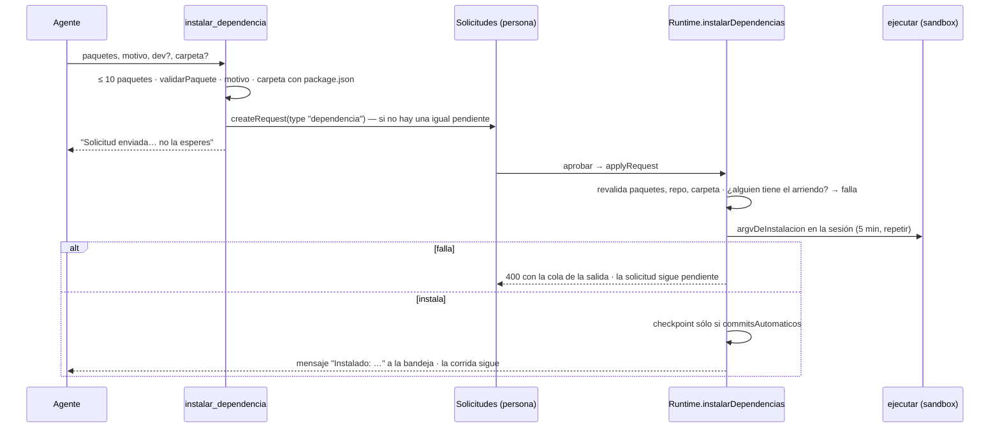

# Instalación de dependencias

Un agente no puede traer una librería por su cuenta: `curl` y `wget` no se
pueden permitir, y `npx` no entra solo a la allowlist (ver
[[Comandos y sandbox]]). Instalar pasa por una persona: el agente **pide** con
`instalar_dependencia`, la persona **aprueba**, y **aprobar instala**.

## Por qué existe

Lo pagamos con un simulador 3D que quedó sin dibujar: el código importaba
Three.js y nadie del equipo podía traerlo. El agente no tenía cómo, y pedirlo
por mensaje no llevaba a ningún lado porque nadie lo instalaba.

## Las dos reglas que hacen seguro aprobar con un click

Viven en `packages/shared/src/dependencias.ts`, código puro compartido porque
se valida **dos veces**: en la herramienta, al pedir, y en el servidor, al
aprobar (lo que llega a la base no se da por bueno).

1. **Sólo paquetes del registro, por nombre** (`validarPaquete`): `three`,
   `three@0.160.0`, `@types/three@^0.160`, `lodash@latest`, `vitest@>=1 <3`.
   Nada de URLs, `git+ssh:`, `github:`, `file:` ni rutas: un "paquete" que es
   una URL es código de cualquier lado, y la persona que aprueba ve un nombre y
   cree que sabe qué está instalando. Se rechaza todo lo que tenga `:` o `\`,
   empiece con `.` o `/`, tenga `//` o dos espacios seguidos; el nombre tiene
   que cumplir la regla de npm (minúsculas, scope opcional, hasta 214) y la
   versión, `^[\w.\-~^<>=*| ]{1,60}$`. El `@` de la versión es el último que
   no está al principio (el primero puede ser el del scope).
2. **Siempre sin scripts de instalación** (`--ignore-scripts`): un
   `postinstall` es código arbitrario corriendo al instalar. La gran mayoría de
   las librerías no lo necesita, y la que sí se nota cuando falla.

## El comando (`argvDeInstalacion`)

El gestor sale del lockfile del repo (`gestorPorArchivos`: `pnpm-lock.yaml` →
pnpm, `yarn.lock` → yarn, si no npm):

| Gestor | argv |
|---|---|
| npm | `npm install --ignore-scripts --no-audit --no-fund --save|--save-dev <paquetes>` |
| pnpm | `pnpm add --ignore-scripts [-D] <paquetes>` |
| yarn | `yarn add --ignore-scripts [--dev] <paquetes>` |

## El recorrido

- **La herramienta** (`packages/tools/src/codigo/index.ts`): `paquetes` (hasta
  `MAX_PAQUETES_POR_PEDIDO` = 10), `motivo` obligatorio ("es lo que lee la
  persona para decidir"), `dev`, y `carpeta` en un monorepo (ahí está el
  `package.json` de esa parte). Sin `package.json` en esa carpeta, falla y dice
  cómo seguir. Si ya hay una solicitud pendiente del mismo repo y carpeta que
  cubre esos paquetes, no abre otra. La respuesta le dice al agente que siga
  con lo que no dependa de eso.
- **La solicitud** guarda `dependencia: { repoId, gestor, paquetes, dev,
  carpeta }` (`agentRequestSchema`, ver [[Aprobaciones y solicitudes]]) y se
  resuelve en [[Pantalla Solicitudes]].
- **Aprobar** (`Runtime.applyRequest` → `instalarDependencias`,
  `apps/server/src/runtime.ts`): vuelve a validar cada paquete, que el repo
  exista y sea de la empresa y que la carpeta exista con `package.json`. Si un
  agente tiene el arriendo, falla: "aprobá cuando termine: instalar cambia
  package.json". Corre el gestor sobre la sesión (`espacioDePersona` la abre si
  hace falta) con el mismo `ejecutar` de los comandos: en el sandbox, con el
  entorno limpio y en la fila del repo. La red está disponible porque el
  sandbox no la restringe.
- **Si falla** (código distinto de 0, corte, error), la aprobación contesta 400
  con los últimos 1.500 caracteres de la salida y **la solicitud queda
  pendiente**: aprobar algo que no quedó instalado le mentiría al agente.
- **Si instala**, `package.json` y el lockfile quedan **sin commitear**, junto
  con el resto de los cambios, para que la persona los commitee. Sólo con
  `commitsAutomaticos` se commitea como la persona ("Instala …", cuerpo = el
  motivo). `node_modules` está en el `exclude`: nunca entra a un commit ni a
  una instantánea.
- **El agente se entera** por su bandeja con un mensaje propio —no un volcado
  de JSON—: "Instalado: three. Quedó instalado … en node_modules y anotado en
  package.json… Importalo por su nombre de paquete; en una página sin build,
  apuntá el import map a ./node_modules/<paquete>/…", más la salida del gestor.
  Rechazada: "Buscá una alternativa sin esa dependencia o explicá por qué hace
  falta". Resolver la solicitud reanuda la corrida que esperaba.

## Relación con levantar servicios

Preparar un servicio para la vista previa también instala, pero es otra cosa:
copia el `node_modules` de la persona si el lockfile es el mismo, o corre una
instalación limpia (`npm ci --ignore-scripts`). No cambia `package.json`. Ver
[[Servicios del monorepo]].

## Casos borde y fallas

- **Un paquete que necesita su `postinstall`** (binarios nativos) queda
  instalado a medias y falla al usarse: se ve en los tests.
- **Aprobar mientras un agente escribe** falla con aviso: hay que esperar el
  fin del turno.
- La descripción de la herramienta y el comentario de `instalarDependencias`
  dicen que el resultado "queda commiteado"; hoy sólo pasa con
  `commitsAutomaticos` prendido.

## Qué fijan los tests

- `packages/shared/src/dependencias.test.ts`: acepta nombres del registro con scope y versión; rechaza URLs, git, `file:`, rutas y mayúsculas; instala siempre sin scripts con el gestor del repo; elige el gestor por el lockfile.
- `packages/tools/src/codigo/codigo.test.ts` → `instalar_dependencia`: valida antes de molestar a nadie (una URL no abre solicitud) y abre la solicitud con el gestor del repo y `--ignore-scripts`; sin `package.json` no hay dónde anotarla.
- `apps/server/src/ide.test.ts` → "aprobar una dependencia": se vuelve a validar lo que llegó a la base.

## Fuentes

- `packages/shared/src/dependencias.ts` → `validarPaquete`, `argvDeInstalacion`, `gestorPorArchivos`, `MAX_PAQUETES_POR_PEDIDO`
- `packages/tools/src/codigo/index.ts` → herramienta `instalar_dependencia`
- `apps/server/src/runtime.ts` → `applyRequest`, `instalarDependencias`, `notifyRequester` (tipo `dependencia`)
- `apps/server/src/routes.ts` → `POST /api/companies/:companyId/requests/:id`
- `packages/shared/src/schema.ts` → `agentRequestSchema.dependencia`

## Ver también

- [[Trabajo con código]]
- [[Comandos y sandbox]]
- [[Aprobaciones y solicitudes]]
- [[Instantáneas y checkpoints]]
