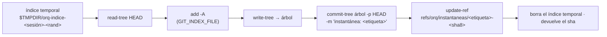

# Instantáneas y checkpoints

Hay dos formas de registrar lo que cambió un turno de agente, y el repo elige
cuál con `commitsAutomaticos`:

- **Instantánea** (default, `commitsAutomaticos: false`): una foto del árbol
  entero hecha con `commit-tree` y un índice aparte, anclada en
  `refs/orq/instantaneas/…`. **No toca la rama ni el índice** de la sesión: los
  cambios quedan sin commitear.
- **Checkpoint** (`commitsAutomaticos: true`): un commit de verdad en la rama de
  la sesión, con el rol como autor.

## Por qué

**Los agentes no commitean**: la persona prepara, escribe el mensaje, commitea y
publica (el flujo de Cursor; ver [[Control de versiones y publicación]]). Pero
cada pedido del chat tiene que poder **verse y deshacerse**, y lo que edita el
CLI de Claude con su propio `Edit` no pasa por el puente del org: sin una foto
del árbol antes y después, ese trabajo no existiría para la traza. La
instantánea resuelve las dos cosas sin escribir en la rama.

## La instantánea (`RepoStore.instantanea`)

- Guarda el árbol **tal cual está**: lo commiteado, lo modificado y lo nuevo.
  Respeta el `.git/info/exclude`: `.env*` y `node_modules` nunca entran.
- El índice aparte va por `GIT_INDEX_FILE` (opción `indice` de `git()`, ver
  [[Git endurecido]]); la ref la ancla para que git no la borre.
- Etiquetas en uso: `<runId>-antes` y `<runId>-despues` (cada turno con
  arriendo) y `build-aab` (el build de producción que incluye lo no commiteado,
  ver [[Build de producción Android]]).
- `cambiosEntre(desde, hasta)`: `git diff-tree -r --no-renames --name-status`;
  los shas se validan (`^[0-9a-f]{7,40}$`).
- `deshacerEntre(desde, hasta)`: aplica el diff binario **al revés sobre los
  archivos** (`git apply -R`, sin índice). Primero lo ensaya con `--check`: si
  alguien tocó después las mismas líneas, no aplica nada y dice qué choca.

## El checkpoint (`RepoStore.checkpoint`)

1. `git add -A`; si no hay nada preparado, devuelve `null` (no hay commits
   vacíos).
2. **Título de los archivos, no del resumen**: los primeros tres tocados y
   "y N más", hasta 100 caracteres. La primera línea de un resumen suele ser
   "No tengo tareas que mover…", y un log lleno de eso no dice qué cambió. El
   resumen del turno va en el cuerpo (hasta 4.000). Quien pasa `titulo` lo usa.
3. `git commit --no-verify` con `--author="<rol> <email>"`; el email es el que
   se pasa o `<slug del id>@orq.local`. El *committer* es "Orquestador".
4. Evento `checkpoint` por el canal de código.

## En cada turno

`abrirTurnoDeCodigo` (ver [[Arriendo de escritura y resumen de código]]) lo
hace sólo para los repos cuyo arriendo tiene el turno:

| | Al abrir | Al cerrar | Evento |
|---|---|---|---|
| Sin commits automáticos | instantánea `antes` | instantánea `despues`; si cambió algo, se anuncia | `codigo.checkpoint` con `commit: false`, `antes`, `sha` = después |
| Con commits automáticos | lo pendiente se commitea **a nombre de la persona** (lo editó ella desde el IDE) | checkpoint con el rol como autor | `codigo.checkpoint` con el sha del commit |

`codigo.checkpoint` (`packages/shared/src/events.ts`) lleva `roleId`, `repoId`,
`rama`, `sha`, `mensaje` (el resumen, hasta 200), `archivos` (cantidad),
`antes` y `commit`. Es el único rastro, en la traza, de lo que editó el CLI con
su propio `Edit`. Ver [[Referencia de eventos]].

## Ver y deshacer un pedido del chat

El chat del IDE ([[Chat de IA]]) arma "Ver cambios" y "Deshacer" con los
`codigo.checkpoint` de la corrida:

- **Todos con `commit: false`**: el tramo va de `antes` del primero al `sha` del
  último. Ver: `GET /api/sesiones/:id/entre?desde&hasta`. Deshacer:
  `POST /api/sesiones/:id/deshacer-entre` → `deshacerEntre`.
- **Si no**: los archivos de cada commit (`GET /api/sesiones/:id/commit/:sha`,
  sólo commits de la sesión) y `POST /api/sesiones/:id/revertir` →
  `RepoStore.revertir`: verifica que cada sha sea de la sesión (descendiente de
  la base, ancestro de `HEAD`), commitea antes lo pendiente como la persona,
  revierte del más nuevo al más viejo con `git revert` y, si alguno choca,
  `revert --abort` + `reset --hard` al punto de partida: no deja nada a medias.
  Es un commit nuevo, no reescribir la historia.

Las dos rutas contestan 409 mientras un agente tiene el arriendo.

## El ajuste

`PATCH /api/repos/:id/ajustes` `{ commitsAutomaticos }` → `actualizarAjustes`.
Además del registro, cambia: la última regla del resumen de código, qué se
marca como archivo sensible en el estado de la sesión y si publicar con cambios
pendientes los commitea solo (ver [[Control de versiones y publicación]]).

Otros caminos que commitean: "Confirmar" del IDE (firma la persona), sacar un
repo con cambios (firma "Orquestador", antes del respaldo) y, con commits
automáticos, instalar una dependencia y publicar con pendientes.

## Casos borde

- **Las refs `refs/orq/instantaneas/*` no se podan**: se acumulan dos por turno
  con arriendo.
- **El tramo es de todo el árbol**: si entre el `antes` del primer turno y el
  `después` del último una persona editó algo desde el IDE, deshacer el pedido
  se lo lleva también.
- **Un comando que escribe en un turno sin arriendo** no queda en ninguna
  instantánea.
- **Un repo secundario cuya sesión se abre a mitad del turno** no tiene
  instantánea `antes`, y al cerrar recibe un checkpoint (un commit) aunque los
  commits automáticos estén apagados.
- `revertir_codigo` con `ruta` vuelve el archivo a `HEAD`: sin commits
  automáticos eso es el último commit, no el comienzo del turno.

## Qué fijan los tests

- `apps/server/src/repos.test.ts`: una instantánea guarda el árbol entero sin tocar la rama ni el índice, y deshacer vuelve atrás lo del tramo conservando lo que la persona tenía antes; el checkpoint lleva al rol como autor y deja afuera `.env` y `node_modules`; sin cambios no hay commit; el título de un agente no repite su nombre.
- `apps/server/src/ide.test.ts`: el turno sin commits automáticos deja los cambios sin commitear y anuncia sus instantáneas; deshacer un pedido revierte el checkpoint y nombra los archivos; no revierte algo que no es de la sesión (409).

## Fuentes

- `apps/server/src/repos.ts` → `instantanea`, `cambiosEntre`, `deshacerEntre`, `checkpoint`, `revertir`, `esDeLaSesion`, `archivosDeCommit`, `actualizarAjustes`
- `apps/server/src/codigo-servidor.ts` → `abrirTurnoDeCodigo` (`instantaneasAntes`, `cerrar`)
- `apps/server/src/runtime.ts` → `depsDeCodigo.emitirCheckpoint`
- `apps/server/src/rutas-codigo.ts` → `/entre`, `/deshacer-entre`, `/commit/:sha`, `/revertir`, `/ajustes`, `/confirmar`
- `packages/shared/src/events.ts` → `codigoCheckpointEvent`
- `apps/web/src/routes/codigo/Chat.tsx` → `tramo`

## Ver también

- [[Trabajo con código]]
- [[Control de versiones y publicación]]
- [[Chat de IA]]
