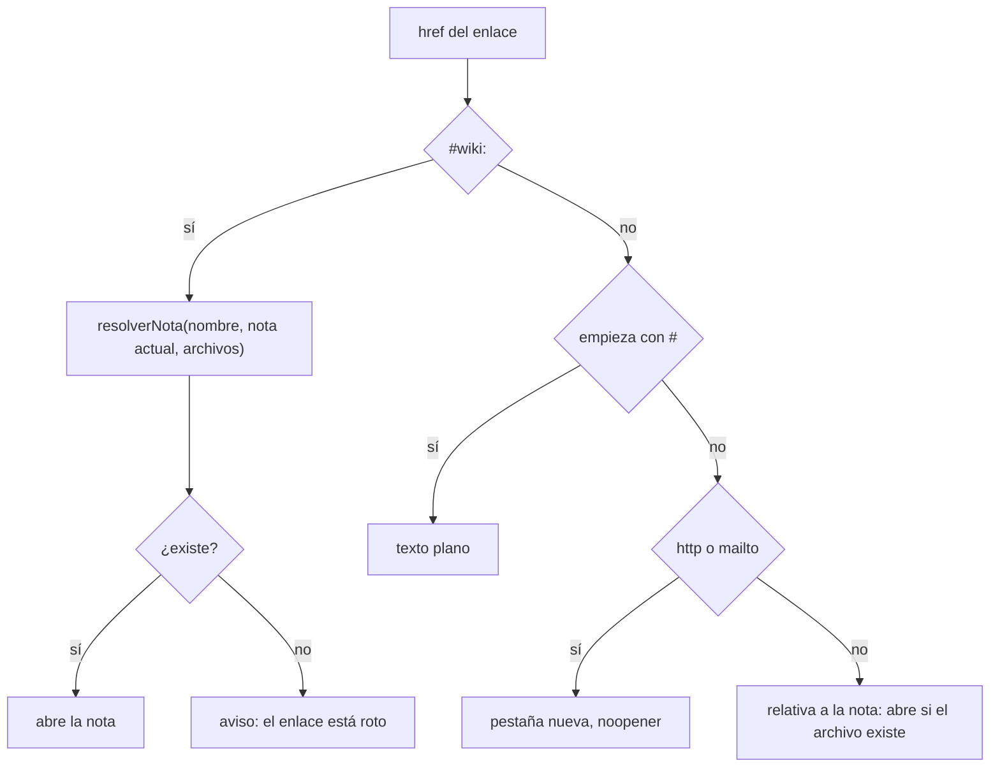

# Notas de Obsidian en el IDE

La documentación de un proyecto escrita en Obsidian —en INSPIA,
`inspia-obsidian/` con la arquitectura, las reglas de negocio y los flujos— se
lee dentro de [[El IDE]] **como en Obsidian**: los `[[enlaces]]` navegan, las
imágenes embebidas se ven, los callouts se dibujan y el frontmatter aparece como
propiedades en vez de un bloque YAML crudo.

Existe porque leer la documentación en el mismo lugar donde se cambia el código
es lo que evita que un cambio contradiga una regla escrita dos carpetas más allá.
No confundir con el [[Vault de contexto]], que es la memoria larga de la
empresa del orquestador: esto es la documentación **del repo** del proyecto.

## Cómo se llega

- **Servicio de documentación.** Al cargar un repo, la detección de servicios
  (ver [[Servicios del monorepo]]) marca como `docs` una carpeta con notas `.md`
  que tenga `.obsidian` o se llame como documentación
  (`/(obsidian|^docs?$|wiki|documentaci|manual)/i`); una que se llama "…obsidian"
  se muestra como "Documentación (Obsidian)". En la vista Servicios su botón es
  un libro: abre la pestaña de documentación.
- **Vista de lectura.** Cualquier `.md` abierto en el editor tiene en la barra de
  migas el botón "Vista de lectura", que lo abre renderizado en una pestaña
  `nota` ("Vista · nombre").

## La pestaña de documentación

`Documentacion` (`apps/web/src/routes/Codigo.tsx`) es una grilla: el índice de
notas a la izquierda (240 px) y la nota a la derecha.

- Hay **una pestaña por carpeta**; navegar cambia la nota que muestra.
- Al abrirla elige la **nota de inicio**: la primera, en el primer nivel de la
  carpeta, cuyo nombre empiece con `00 `/`00-`, `inicio`, `index`, `readme` o
  `home`; si no hay, la primera en orden alfabético.
- El índice (`IndiceDeNotas`) lista los `.md` de la carpeta ordenados en
  castellano, agrupados por la subcarpeta de primer nivel (cada grupo se pliega).
- Sobre la nota, su ruta y un botón **Editar** que la abre en Monaco.
- La nota se vuelve a pedir cada 5 s: si un agente la edita, se ve.

## De Obsidian a markdown común

`prepararNota` separa el frontmatter y traduce la sintaxis propia de Obsidian;
después la dibuja el mismo `Markdown` del chat en modo `grande` (tipografía de
documento: `h1` de 24 px con filete, `h2` de 19 px).

**Frontmatter** (`---` al principio): cada `clave: valor` de primer nivel es una
propiedad; una lista YAML (`tags:` y abajo `  - x`) se junta con comas en la
propiedad anterior; se sacan comillas y corchetes (`[a, b]`). Las líneas
indentadas que no son ítems de lista se ignoran.

**El código no se toca.** El texto se parte en bloques cercados (```` ``` ```` y
`~~~`), código en línea y el resto, y sólo el resto se transforma: un
`[[ejemplo]]` escrito como código no es un enlace.

| Sintaxis | Se convierte en |
|---|---|
| `![[imagen.png]]`, `![[imagen.png\|300]]` | imagen `#wiki-img:` (el tamaño se ignora) |
| `[[Nota]]`, `[[Nota\|alias]]`, `[[Nota#sección]]` | enlace `#wiki:` que muestra el alias o el nombre |
| `> [!tipo] Título` (también `+`/`-`) | cita con ícono y título en negrita |

Íconos de callout: info ℹ️, note 📝, tip/hint 💡, important ❗, warning/caution
⚠️, danger/error ⛔, bug 🐞, example 🧪, quote ❝, success/check ✅, question ❓,
todo ☑️; cualquier otro, 📌. Sin título, el tipo con mayúscula.

## Cómo se resuelve un enlace



`resolverNota` saca `#sección` y `|alias`, compara sin distinguir mayúsculas y
sin `.md` contra la ruta entera, un sufijo `/nombre` o el nombre base, y
**prefiere la nota de la misma carpeta**; si no hay, la primera que encuentra.
Así `[[Backend]]` desde `04 - API REST/` abre `04 - API REST/Backend.md` y no
`01 - Arquitectura/Backend.md`. Las rutas relativas (`../img/x.png`,
`Otra nota.md`) se resuelven contra la carpeta de la nota (`relativaA`, que
decodifica `%20` y respeta `..` y `.`).

**Imágenes:** `http(s)` directo; `![[x.png]]` busca un archivo que se llame así
en cualquier parte del repo; una relativa, contra la nota. Se sirven por la
vista estática (`api.vistaUrl` → `/api/repos/:id/vista/<ruta>`, con su CSP; ver
[[Vista previa y proxy]]). Sin archivo, queda `[imagen: …]` como texto.

## Seguridad

Es el mismo `Markdown` del [[Chat de IA]]: **sin HTML crudo** (no se usa
`rehype-raw`), los enlaces `javascript:` se descartan y los externos abren con
`noopener noreferrer`. Una nota la puede haber escrito un agente.

## Casos borde

- **`[[Nota#sección]]`** abre la nota pero no baja a la sección.
- **Transcluir una nota** (`![[Otra nota]]`) no está soportado: se trata como
  imagen, no la encuentra y queda `[imagen: Otra nota]`.
- **Dos imágenes con el mismo nombre** en carpetas distintas: `![[x.png]]` toma
  la primera del árbol, no la de la carpeta de la nota.
- **Frontmatter anidado** (objetos) se pierde: sólo claves de primer nivel y
  listas.
- Un enlace a nota inexistente no rompe nada: muestra "No hay ninguna nota …: el
  enlace está roto".

## Qué fijan los tests

- `apps/web/src/routes/codigo/Nota.test.tsx`: `resolverNota` encuentra por
  nombre prefiriendo la misma carpeta, con sección, alias y mayúsculas, y
  devuelve `null` si no existe; `prepararNota` separa el frontmatter y convierte
  enlaces, alias e imágenes; no toca el código, arma los callouts y junta las
  listas del frontmatter.
- `apps/web/src/routes/codigo/Markdown.test.tsx`: no ejecuta HTML crudo ni
  enlaces `javascript:`.

## Fuentes

- `apps/web/src/routes/codigo/Nota.tsx` → `Nota`, `IndiceDeNotas`, `resolverNota`, `prepararNota`, `sintaxisDeObsidian`, `relativaA`, `CALLOUT`
- `apps/web/src/routes/codigo/Markdown.tsx` → `Markdown` (`grande`, `resolverEnlace`, `resolverImagen`)
- `apps/web/src/routes/Codigo.tsx` → `abrirDocs`, `Documentacion`, `NotaSuelta`
- `packages/shared/src/servicios.ts` → `clasificarServicio`, `CARPETA_DE_DOCS`

## Ver también

- [[El IDE]] · [[Configuración de repos y servicios]] · [[Servicios del monorepo]]
- [[Chat de IA]] · [[Vault de contexto]]
