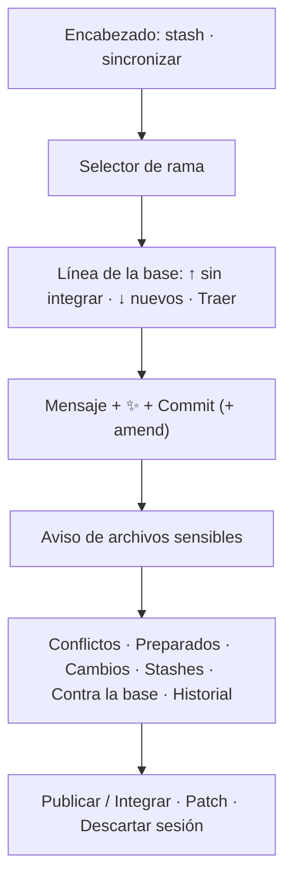

# Panel de control de código

La vista **Control de código fuente** (⌘⇧G) de [[El IDE]], como el panel de Git
de Cursor: preparar y quitar archivos, commit con un mensaje que puede escribir
la IA, stash, ramas, fusión, la historia entera de la rama y, abajo, publicar o
descartar la sesión. Todo pasa **sobre el worktree de la sesión**, nunca sobre
la carpeta de la persona.

Existe porque, por default, **los agentes no commitean**
(`commitsAutomaticos: false`): sus cambios quedan sin commitear en la rama del
proyecto, junto con lo que haya editado la persona, y ella prepara, escribe el
mensaje, commitea y publica. Publicar y descartar viven **sólo acá**: ninguna
herramienta de agente hace ninguna de las dos. La lógica de git del lado
servidor (`apps/server/src/scm.ts`, integrar, subir) está en
[[Control de versiones y publicación]]; esta nota es la interfaz y su contrato.

## Sin sesión

Si el repo no tiene una sesión abierta, el panel sólo dice que se está viendo la
rama base en sólo lectura y que la sesión se abre sola cuando un agente empieza a
trabajar o cuando se guarda un archivo. Mirar el código no abre una.

## Cómo está armado

El estado sale de `GET /api/repos/:repoId/scm` cada 3 s (`EstadoScm`: rama,
cabeza, preparados, cambios, conflictos, stashes, ramas locales, ramas del repo
de la persona, base y si se puede hacer amend). Esa misma consulta, de paso,
pasa una sesión vacía vieja en `orq/…` a la rama del proyecto
(`alinearConLaRamaDelProyecto`) y dispara en segundo plano
`sincronizarConOrigen` —como mucho cada 45 s—, así lo que la persona commiteó
desde su editor aparece solo.

**Mientras un agente tiene el arriendo**, todos los botones que escriben se
deshabilitan y un aviso dice que "el control de versiones espera a que termine".
El servidor lo rechaza igual con 409.

## Rama y base

- **Selector de rama** (como el de VS Code): la rama abierta con `↑N` commits por
  delante de la base de la sesión. El menú filtra; Enter abre la rama si existe o
  la **crea** si no. Por rama: crear una nueva desde ella, fusionarla en la
  abierta, borrarla. Una rama abierta en otro worktree (la base en el clon, otra
  sesión) aparece como "abierta en el clon" y no se puede abrir ni borrar.
- Debajo, **"Ramas de tu repo"** (`origin/*`) y **"En el remoto de tu repo
  (GitHub)"** (`remoto/*`) que no tienen local: abrir una crea la local que la
  sigue (`switch --track`, explícito porque con la misma rama en `origin/` y
  `remoto/` git se niega a adivinar).
- **Línea de la base:** "Base: `dev` de tu repo", con `↑N sin integrar` (lo que
  la sesión lleva y ella no) y `↓N nuevos` (lo que ella avanzó). **Traer** fusiona
  `origin/<base>` en la sesión.
- El botón de refrescar fuerza la sincronización
  (`POST /api/sesiones/:id/scm/sincronizar`); en un repo creado por la empresa
  sólo refresca.

## Commit

- Mensaje en un `textarea`; ⌘Enter commitea.
- **✨ Generar**: `Runtime.generarMensajeDeCommit` (ver abajo).
- El botón dice **"Commit (N preparados)"**, **"Commit de todo"** si no hay nada
  preparado (el "smart commit" de VS Code: commitea todo) o **"Modificar el último
  commit"** con amend. Pide mensaje salvo en amend.
- **Amend** aparece sólo si el último commit es de la sesión
  (`puedeModificarUltimo`): modificar uno de la base reescribiría una historia
  que no es de acá.
- El commit va con la **identidad de git de la persona** y sin hooks
  (`--no-verify`). Con conflictos sin resolver, no commitea.

### El mensaje generado

`apps/server/src/runtime.ts` → `generarMensajeDeCommit` es **una sola llamada** al
tier `cheap` del proveedor preferido, no una corrida: no hay nada que coordinar.

| Parámetro | Valor |
|---|---|
| diff | lo preparado; si no hay nada preparado, todo contra HEAD (con `--intent-to-add` para ver los nuevos) |
| tope del diff | 14.000 caracteres, con aviso de recorte |
| ejemplos de estilo | hasta 12 asuntos de la sesión y de `git log -15 <ramaBase>`, sin los automáticos ("Turno de …", "Cambios hechos desde el IDE…") |
| salida | hasta 400 tokens, temperatura 0,2, corte a los 120 s |

Imita idioma, prefijo (`feat(área):`) y largo de los últimos commits: un mensaje
correcto pero escrito distinto al historial es ruido que alguien reescribe. Si no
hay ejemplos, castellano rioplatense. Se limpian comillas y cercos de código, y
**se sacan las firmas** que agrega el CLI de Claude (`Co-Authored-By:`,
`Signed-off-by:`, "🤖 Generated with…"): es un commit de la persona.

## Archivos sensibles

Un aviso rojo lista los cambios en **archivos que deciden qué se ejecuta**
(`esArchivoDeEjecucion` en `apps/server/src/repos.ts`): `package.json`,
`Makefile`, `Dockerfile`, `pyproject.toml`, `setup.py`, `Cargo.toml`, `.npmrc`,
los `*.config.*` de vite, vitest, jest, playwright, webpack, rollup, tsup y
babel, todo `.github/`, `.gitlab-ci*`, `.husky/` y cualquier `.sh`. Un agente
que agrega un `postinstall` o toca el CI convierte un cambio en código que va a
correr: hay que mirarlo con otros ojos antes de publicar. En las listas, esos
archivos aparecen en rojo.

- **Sólo avisa de lo no commiteado.** Con commits automáticos apagados, lo que
  está commiteado lo commiteó la persona, que ya lo miró; si no, el aviso no se
  iba hasta publicar aunque estuviera revisado. Con commits automáticos, cuenta
  todo lo cambiado contra la base (`RepoStore.estado` → `sensibles`).
- **Abrir el diff de un archivo lo da por revisado**, desde el aviso o desde
  cualquier lista (preparados, cambios, contra la base).
- **Se cierra con la ✕** ("Ya los revisé"), que marca todos como revisados.
- Lo revisado vive en el estado del componente: al recargar, o al cerrar la
  barra lateral, vuelve a avisar lo que siga sin commitear.

## Las secciones

| Sección | Qué muestra | Acciones |
|---|---|---|
| Conflictos | archivos en `U` | abrir el diff |
| Cambios preparados | el índice | quitar uno, quitar todo |
| Cambios | lo modificado y lo nuevo (`?` se muestra como **U**, verde) | descartar (confirmado: lo nuevo **se borra**, sin papelera), preparar, y en bloque |
| Stashes | mensaje y hace cuánto | aplicar (lo deja), sacar (aplica y borra), borrar (confirmado) |
| Contra la base | todo lo que la sesión cambió desde su base, commiteado o no (cerrada por default) | abrir el diff |
| Historial · *rama* | la historia **de la rama abierta**, no sólo la de la sesión | abrir un commit y el diff de cada archivo contra su primer padre |

**Stash** (ícono del archivo, arriba): mensaje opcional y "Guardar todo (con
archivos nuevos)" (Enter), "Guardar sólo lo modificado" o "Guardar sólo lo
preparado". Antes de guardar se sueltan las entradas `--intent-to-add`, que
`git stash` no sabe guardar ("not uptodate"): las marcan el diff de la sesión, la
huella de los comandos y el mensaje generado.

**Historial:** cada commit con sus ramas y tags (una rama local en acento, una
de tu repo como "tu dev", una de GitHub como "gh main", un tag en ámbar), autor,
hace cuánto y sha corto. Un punto lleno marca lo que **todavía no está en tu
base** ("sin integrar"); uno hueco, una fusión. Páginas de 50.

## Publicar, patch, descartar

Abajo de todo:

- **Publicar N commit(s) en tu `dev`** cuando la sesión trabaja en la rama del
  proyecto; **Integrar *rama* a la rama / su main / tu repo** cuando es una
  `orq/…` o un repo creado. Deshabilitado si hay algo sin commitear ("Para
  publicar, primero commiteá los cambios": no commitea por ella con un mensaje
  genérico), si no hay commits nuevos, o si un agente escribe. La confirmación
  explica qué pasa según el origen y ofrece **además subir** (`git push origin
  <rama>`), avisando que si el repo despliega desde esa rama eso dispara el
  despliegue, y que nunca fuerza.
- **Patch** descarga `GET /api/sesiones/:id/patch`.
- **Descartar sesión** (confirmado): en una `orq/…` borra worktree, rama y
  checkpoints; en la rama del proyecto la devuelve a como está en el repo de la
  persona.

Publicar, descartar y sacar el repo esperan a que no haya una corrida viva (409).

## El contrato HTTP

| Acción | Endpoint | Espera arriendo | Espera corrida |
|---|---|---|---|
| Estado | `GET /api/repos/:repoId/scm` | — | — |
| Historial / archivos de un commit | `GET /api/sesiones/:id/scm/historial?desde&cantidad` · `/scm/commit/:sha` | — | — |
| Sincronizar | `POST /api/sesiones/:id/scm/sincronizar` | — | — |
| Preparar, quitar, descartar | `POST …/scm/preparar` · `quitar` · `descartar` (`rutas`: lista o `"todo"`) | sí | — |
| Commit, mensaje | `POST …/scm/commit` (`mensaje`, `amend`) · `…/scm/mensaje` | sí | — |
| Borrar rama | `POST …/scm/ramas/borrar` | sí | — |
| Stash | `POST …/scm/stash` · `…/scm/stash/usar` (`aplicar`/`sacar`/`borrar`) | sí | sí |
| Crear, cambiar, fusionar rama | `POST …/scm/ramas/crear` · `cambiar` · `fusionar` | sí | sí |
| Publicar / descartar | `POST /api/sesiones/:id/integrar` (`subir`) · `/descartar` | — | sí |

Todas las operaciones pasan por una sola mutación (`operar`) con el mismo manejo:
una respuesta `{ok: false, motivo}` —una fusión con conflicto— se muestra como
error; un éxito, con su detalle; y siempre se refrescan `scm`, `scm-historial`,
`arbol`, `sesion`, `repos` y `archivo`. Una fusión con conflicto **se aborta y
nombra los archivos**: un árbol con marcas de conflicto es donde el próximo
checkpoint de un agente las commitea como código.

## Casos borde

- **El historial no pasa de 200 commits.** La UI pide `cantidad = 50 × páginas`
  desde 0, y el servidor acota `cantidad` a 200: pasada la cuarta página,
  "Cargar más commits" sigue apareciendo y trae los mismos 200.
- **Cambiar a la rama base** da error mientras está abierta en el clon: el
  mensaje explica que la sesión ya trabaja sobre ella y ofrece crear una rama
  desde `origin/<base>`.
- **Fusionar con cambios sin commitear** no se hace: "commitealos o guardalos en
  un stash".
- `POST /api/sesiones/:id/confirmar` y `api.confirmarSesion` siguen existiendo
  (commit de todo como la persona), pero el panel ya no los usa.

## Qué fijan los tests

- `apps/server/src/scm.test.ts`: prepara, commitea con mensaje y hace amend; no
  hace amend sobre un commit de la base; descartar vuelve lo rastreado y borra lo
  nuevo; el stash guarda y trae archivos nuevos; crear y cambiar de rama mueve la
  sesión; fusionar con conflicto aborta y nombra; las ramas del repo de la
  persona se ven y se abren; el historial marca lo no integrado; sincronizar trae
  lo nuevo; publicar adelanta su `dev` y nunca pisa una rama con nombre propio.
- `apps/server/src/repos.test.ts` → "detectarComandos y archivos de ejecución":
  marca `package.json`, `.github/workflows/…` y `vitest.config.ts`, no `src/index.ts`.

## Fuentes

- `apps/web/src/routes/codigo/ControlDeCodigo.tsx` → `ControlDeCodigo`, `SelectorDeRama`, `HistorialDeRama`, `FilaDeCommit`, `MenuStash`, `revisados`
- `apps/server/src/rutas-codigo.ts` → `GET /api/repos/:repoId/scm`, `operacionScm`, `/integrar`, `/descartar`, `/patch`
- `apps/server/src/scm.ts` → `ControlDeVersiones`
- `apps/server/src/repos.ts` → `estado` (`sensibles`), `esArchivoDeEjecucion`
- `apps/server/src/runtime.ts` → `generarMensajeDeCommit`

## Ver también

- [[Control de versiones y publicación]] · [[Instantáneas y checkpoints]]
- [[El IDE]] · [[Chat de IA]] · [[Repositorios y sesiones]] · [[Git endurecido]]
