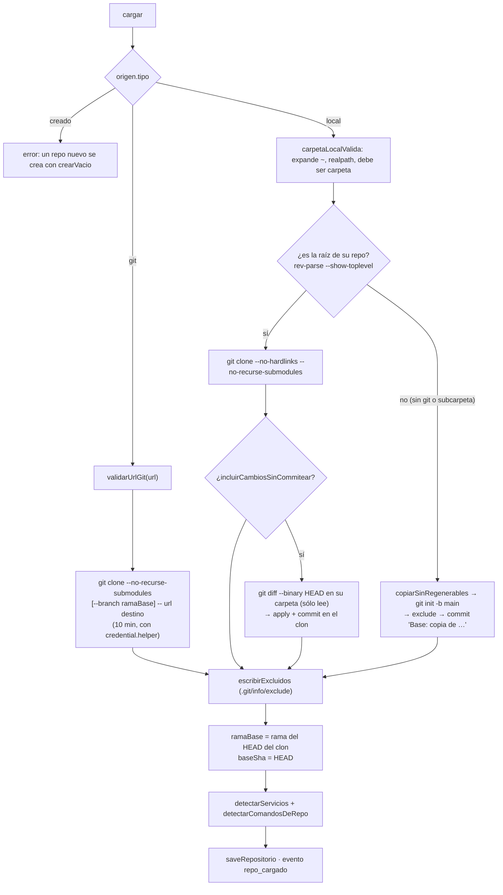
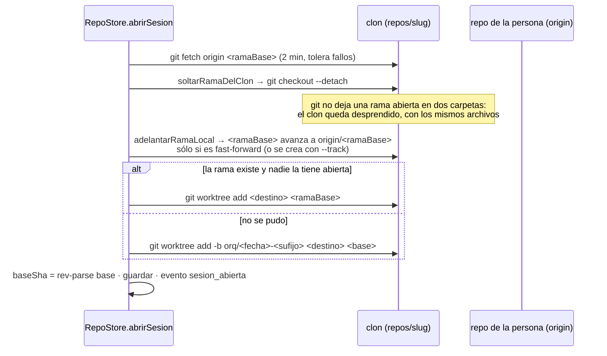
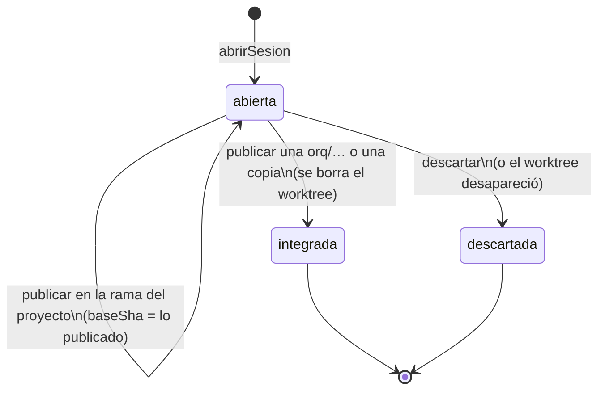

# Repositorios y sesiones

Un **repositorio** es el código que una persona le da a un proyecto. El equipo
nunca trabaja sobre su carpeta: trabaja sobre un **clon gestionado** en
`repos/<slug>`, y adentro de ese clon, en una **sesión** —un `git worktree`—
parada en la rama del proyecto. La sesión sobrevive a la corrida que la abrió y
la cierra una persona: publicándola o descartándola.

Todo vive en `apps/server/src/repos.ts` → `RepoStore`.

## Por qué un clon y no la carpeta de la persona

Un `git worktree add` directo sobre su repo parece inofensivo y no lo es:
escribe en su `.git` (la lista de worktrees, las refs, el índice), dispara sus
hooks y le deja estado que ella no pidió. Por eso **cargar, abrir una sesión y
trabajar no escriben ni un byte en su `.git`** —hay un test que lo fija
hasheando su `.git` entero antes y después—. El único momento en que se escribe
en su carpeta es cuando **ella** aprieta Publicar (ver
[[Control de versiones y publicación]]).

## Los cuatro orígenes

`origenRepositorioSchema` (`packages/shared/src/schema.ts`) es una unión
discriminada por `tipo`, y cada caso se carga y se publica distinto:

| Origen | Cómo se carga | Rama de la sesión | Cómo se publica |
|---|---|---|---|
| `local`, carpeta que **es** la raíz de su repo | `git clone --no-hardlinks` desde su carpeta | la del proyecto (`dev`) | fast-forward en su carpeta |
| `local`, carpeta **sin git** o **subcarpeta** de un repo más grande | copia de la carpeta + `git init` en el clon (`origenSinGit: true`) | `orq/<fecha>-<sufijo>` | se copian de vuelta los archivos tocados |
| `git`, URL remota | `git clone` con el ayudante de credenciales de la persona | la del proyecto | la rama queda en el clon; `push` sólo si se pide |
| `creado`, programa nuevo del equipo | `crearVacio`: `git init` + README + `.gitignore` | `orq/<fecha>-<sufijo>` | fast-forward del `main` del clon |

> [!danger] Una subcarpeta se copia, no se clona el repo que la contiene
> Lo pagamos: cargar un programa que vivía en `data/` clonó **el orquestador
> entero adentro de sí mismo**. Ahora `cargar` sólo clona si la carpeta
> señalada es exactamente la raíz de su repo (`git rev-parse --show-toplevel`
> con `realpath`); si es una subcarpeta, se trabaja sobre una copia de esa
> carpeta sola y se avisa: "La carpeta está adentro del repo …".

## Cargar, paso a paso

`POST /api/companies/:companyId/repos` → `RepoStore.cargar(companyId, carga)`:



Detalles que importan:

- **Nombre y slug.** El nombre es el que dio la persona o el último segmento de
  la ruta/URL sin `.git` (`nombreDeOrigen`), hasta 120 caracteres. El slug sale
  de `slugTecnico` (minúsculas, sin tildes, hasta 60) y se desambigua con
  `-2`, `-3`… si ya existe en el proyecto.
- **Si algo falla, se borra el destino** y se relanza el error: no queda un
  clon a medias.
- **`incluirCambiosSinCommitear`** suma al commit base sus cambios sin
  commitear de archivos **rastreados** (`git diff HEAD` no escribe nada en su
  repo). Los archivos nuevos que no agregó a git no entran, y se avisa.
- **La copia sin git** saltea `node_modules`, `.git`, `.venv`, `venv`,
  `__pycache__`, `.next`, `dist` y `build` (`NO_SE_COPIA`) y todo archivo de
  más de 5 MB (`MAX_ARCHIVO_COPIADO`), con aviso de cuáles.
- **Los comandos no quedan permitidos.** `detectarComandosDeRepo` devuelve
  `sugeridos` que la persona confirma desde la UI; la allowlist nace vacía. Ver
  [[Comandos y sandbox]].
- Al volver, la ruta llama a `Runtime.registrarHerramientasDeCodigo`, que
  re-registra las herramientas y siembra sus filas en `tools`.

### Lo que nunca entra a un commit

`escribirExcluidos` agrega al `.git/info/exclude` del clon —que vale para el
clon **y todos sus worktrees**, porque vive en el directorio común— una lista
marcada con un comentario, así escribirla dos veces no la duplica:

```text
# Escrito por el orquestador. Vale para el clon y todos sus worktrees.
node_modules/  .venv/  venv/  __pycache__/  .env  .env.*  *.pem  *.key
dist/  build/  .next/  coverage/  *.log  .DS_Store
```

Sin esto, el commit base se llevaba los `.env` de la persona y los agentes los
podían leer con `leer_codigo`. Como `.env*` está excluido, tampoco entra a un
checkpoint ni a una instantánea (ver [[Instantáneas y checkpoints]]).

## Datos

### `Repositorio` (`repositorioSchema`)

| Campo | Qué es |
|---|---|
| `id` | `rep_…` |
| `companyId` | el proyecto |
| `nombre` | cómo lo ve y lo nombra todo el mundo; único por proyecto (sin distinguir mayúsculas) |
| `slug` | carpeta del clon: `repos/<slug>`; no cambia nunca |
| `origen` | `{tipo:"local", ruta}` · `{tipo:"git", url}` · `{tipo:"creado", descripcion}` |
| `ramaBase` | la rama sobre la que se abren las sesiones y a la que se publica |
| `baseSha` | commit del clon al cargarlo |
| `origenSinGit` | la carpeta no tenía git (o era una subcarpeta): se publica copiando |
| `comandos` | la allowlist y los comandos del repo (ver [[Comandos y sandbox]]) |
| `servicios` | las partes que se levantan (ver [[Servicios del monorepo]]) |
| `commitsAutomaticos` | default `false`: los agentes no commitean (ver [[Instantáneas y checkpoints]]) |
| `pendienteDeConfirmar` | llegó importado en un blueprint: no se ejecuta nada hasta que alguien confirme los comandos |

### `SesionCodigo` (`sesionCodigoSchema`)

| Campo | Qué es |
|---|---|
| `id` | `ses_…` |
| `repoId`, `companyId` | de quién es |
| `rama` | la rama abierta en el worktree: la del proyecto (`dev`) o una `orq/<AAAAMMDD>-<xxxx>` |
| `carpeta` | relativa a la carpeta del proyecto: `worktrees/<slug>/<AAAAMMDD>-<xxxx>` |
| `baseSha` | contra qué se mide "qué cambió": el punto de partida, o lo último publicado |
| `estado` | `abierta` · `integrada` · `descartada` |
| `creadaEnRunId` | la corrida que la abrió, o `null` si la abrió una persona |
| `integracion` | cómo terminó integrada: `modo` (`fast-forward` · `rama` · `copia`), `detalle`, `at` |

Las dos entidades se guardan como JSON en las tablas `repositorios` y
`sesiones_codigo` (`apps/server/src/db.ts`) y **se leen con Zod** para que los
`.default()` se apliquen a filas viejas. Borrar un repo borra sus sesiones
(`Store.deleteRepositorio`).

## Rutas: dónde está cada cosa

- `rutaClon(repo)` = `<proyecto>/repos/<slug>` (`Directorios.sub(…, "repos")`).
- `rutaWorktree(sesion)` resuelve `sesion.carpeta` contra la carpeta del
  proyecto y **tira** si el resultado se sale de ella: una fila adulterada no
  puede apuntar a otro lado.
- `gitDirDe(sesion, repo)` = `<clon>/.git/worktrees/<basename del worktree>`.
  **Nunca se descubre desde el worktree**: su `.git` es un archivo de texto que
  cualquier cosa que corra adentro puede reescribir para apuntar a otro repo.
- `gitSesion` devuelve `{ gitDir, workTree, cwd: workTree }`. El `cwd` no es
  redundante: `grep --untracked` y `ls-files -o` trabajan sobre el directorio
  actual, y sin él buscaban en la raíz del orquestador (ver [[Git endurecido]]).

## La sesión

### Una por repo, y sobrevive a la corrida

`sesionAbierta(repoId, companyId)` busca la fila `abierta` del repo; hay a lo
sumo una. Un cambio grande no entra en una corrida, así que la siguiente
encuentra el trabajo donde quedó, igual que las tareas heredadas (ver
[[Supervisión y continuidad]]). `abrirSesion` es **idempotente**: si ya hay una
abierta y su worktree existe, la devuelve (pasándola antes por
`alinearConLaRamaDelProyecto`). Si la fila dice abierta pero el worktree no
está —alguien lo borró a mano—, la marca `descartada` y abre otra.

### En la rama del proyecto

La persona tiene su rama, su historia y su forma de trabajar, y el IDE tiene
que estar parado donde está ella: una `orq/20260925-4t33` en la barra de estado
no le dice nada. `usaRamaDelProyecto(repo)` es verdadero para todo repo que vino
de afuera con git (`!origenSinGit && origen.tipo !== "creado"`).



- La **base** es `origin/<ramaBase>` si existe (lo último que ella commiteó) y si
  no, la `ramaBase` local.
- Si la rama local del clon **divergió** de la suya (tiene trabajo sin publicar
  de una sesión anterior), `adelantarRamaLocal` no la toca: la sesión abre
  sobre esa rama local, con ese trabajo.
- Un repo sin commits abre con `worktree add --orphan` y `baseSha` vacío.
- Repos `creado` y copias sin git siempre abren en `orq/…`: no hay rama de
  afuera que respetar.

### Alinear una sesión vieja

`alinearConLaRamaDelProyecto(sesion, repo)` pasa una sesión en `orq/…` a la
rama del proyecto **sólo si no tiene trabajo propio** (cero commits desde su
base y `git status` limpio): suelta la rama del clon, la adelanta, hace
`git switch <ramaBase>` en el worktree, borra la `orq/…` y actualiza `baseSha`.
Con trabajo no se toca: se decide desde el panel (cambiar de rama y traerlo, o
publicarlo como rama). Lo llaman `abrirSesion` y `GET /api/repos/:id/scm`.

### Estados



## Sincronizar con el repo de la persona

Sin esto el clon sería una foto del momento de la carga: ella sigue commiteando
en `dev` desde su editor y el IDE le mostraría una historia vieja.
`sincronizarConOrigen(repo, forzar)`:

1. No aplica a `creado` ni a copias sin git.
2. Se limita a **una vez cada 45 s** por repo (mapa en memoria), salvo `forzar`:
   el panel pregunta el estado cada pocos segundos.
3. `git fetch -q --prune origin` con estos refspecs (90 s de corte):
   - `+refs/heads/*:refs/remotes/origin/*` — sus ramas locales, como `origin/*`;
   - `+refs/tags/*:refs/tags/*` — sus tags;
   - sólo con origen local: `+refs/remotes/origin/*:refs/remotes/remoto/*` — las
     ramas de **su** remoto (GitHub), como `remoto/*`.
4. Si el clon tiene la `ramaBase` abierta y limpia, la avanza con
   `merge --ff-only`; si nadie la tiene abierta, la adelanta y, si el clon está
   desprendido y limpio, lo vuelve a desprender sobre la base de hoy.

**No toca ningún worktree**, así que se puede con un agente trabajando.
`GET /api/repos/:id/scm` la dispara en segundo plano (con su `.catch`: una
promesa sin dueño tira el servidor, ver [[Trampas conocidas]]) y
`POST /api/sesiones/:id/scm/sincronizar` la fuerza.

## Un repo nuevo que crea el equipo

`crear_repositorio` → `CodigoStorage.crear` → `RepoStore.crearVacio`. Existe
porque lo medimos sin él: un equipo entero escribió un simulador en la salida
archivo por archivo y llamó a `listar_repositorios` 36 veces esperando que
apareciera un repo.

- **Lo decide quien coordina**: un rol `executor` recibe "Pedíselo a tu
  responsable". Un ejecutor que crea repos reparte el trabajo en tres.
- **Tope de 12 repos por proyecto** (`MAX_REPOS_POR_PROYECTO`): más que eso no
  es un equipo trabajando, es dispersión. Aplica sólo a los creados.
- **Nombre único** (sin distinguir mayúsculas): el rechazo dice sobre cuál
  trabajar, `repo="<nombre>"`.
- Nace con `README.md` (título + descripción), `.gitignore` (`node_modules/`,
  `.DS_Store`, `dist/`), el `exclude`, un commit "Base: …" en `main`, y con
  **`npm test`, `node --test` y `node --check` ya permitidos** y `test` en
  `npm test`: sin eso lo primero que hacía el equipo era pedir permiso para
  testear lo que acababa de crear.
- Su `origen` es `{tipo:"creado", descripcion}` (hasta 500 caracteres): no tiene
  afuera. Publicar es avanzar su propio `main`.

## Renombrar un repo

`POST /api/repos/:id/renombrar` → `RepoStore.renombrar`. **Sólo cambia el
nombre**: la carpeta sigue en `repos/<slug>` y la rama no se mueve. El slug es
técnico y mudarlo obligaría a reparar cada worktree por un beneficio que nadie
ve. El nombre no puede repetirse (409): es el argumento `repo=` de las
herramientas, y dos iguales harían que dependa del orden. Como el repo también
se encuentra por slug (`elegirRepo`), un agente que todavía dice el nombre
viejo en su turno sigue llegando: por eso renombrar un repo **no** pide detener
la corrida. Renombrar el **proyecto** es otra cosa (ver [[Directorios en disco]]):
muda la carpeta y exige `repararWorktrees`.

## Sacar un repo del proyecto

`DELETE /api/repos/:id` → `RepoStore.eliminar`. La ruta contesta 409 si hay una
corrida viva, detiene los servicios del repo y al final re-registra las
herramientas.

> [!danger] Con trabajo sin publicar, primero un respaldo
> Lo pagamos: un simulador entero —tres etapas, 36 tests, seis checkpoints—
> vivía sólo en la rama de la sesión; se sacó el repo antes de integrarlo y el
> clon se fue con todo. La carpeta de la persona estaba intacta, como se
> prometía, y justo por eso no tenía nada.

Si hay una sesión abierta con trabajo:

1. Lo sin commitear se commitea como "Orquestador" ("Cambios sin confirmar al
   sacar el repo del proyecto"), aunque `commitsAutomaticos` esté apagado: el
   repo se va igual.
2. Si hay commits desde `baseSha`, se escriben en `salida/respaldos/`:
   - `<slug>-<rama>.bundle` — `git bundle create` con **la historia entera** de
     la rama: uno "delgado" necesita el repo de origen para abrirse, y un
     respaldo existe justo para cuando ya no está. Se clona con
     `git clone -b <rama> <bundle>`;
   - `<slug>-<rama>.patch` — el `format-patch` de la sesión, legible.
3. Se borran el clon, `worktrees/<slug>` y las filas. El origen no se toca.

La respuesta trae `respaldo` (la ruta relativa del bundle) o `null`. El
respaldo queda en la salida de la empresa (ver [[Salida de la empresa]]).

## Mantenimiento

- **Al arrancar** (`apps/server/src/index.ts`): `RepoStore.podar` corre
  `git worktree prune` en cada clon, para que un worktree cuya carpeta ya no
  existe no bloquee su rama.
- **Al mudar la carpeta del proyecto** (renombrarlo): `repararWorktrees` corre
  `git worktree repair <rutas>` en cada clon. Git guarda rutas absolutas en los
  dos lados (`.git/worktrees/<x>/gitdir` y el archivo `.git` del worktree), y
  sin reparar, un `git status` dentro de la sesión falla.

## Blueprint: exportar e importar

Una empresa exportada a JSON (`GET /api/companies/:id/blueprint`,
`apps/server/src/routes.ts`) lleva **sólo los repos con origen `git`**: una ruta
local no significa nada en otra máquina. Van con `baseSha: null`, sin los
permisos de una vez y con `archivosEntorno` vacío en cada servicio (son rutas
de esta máquina).

Al importar (`POST /api/companies/import`), cada repo `git` se vuelve a clonar **en segundo plano** (puede
tardar minutos; la respuesta trae `reposClonando`) y queda con
`pendienteDeConfirmar: true`: importar un JSON no puede autorizar a correr nada
en esta máquina. `ejecutar_comando` y la terminal se niegan hasta que una
persona guarda los comandos (`RepoStore.actualizarComandos` lo apaga).

## Lo que usa el IDE

El editor lee y escribe por `RepoStore`, sobre el mismo worktree que los
agentes (la UI la documenta [[Editor, explorador y búsqueda]]):

- `listarArchivos`: con sesión, `git ls-files -z -co --exclude-standard` (lo
  rastreado y lo nuevo no ignorado); sin sesión, `ls-tree` de `HEAD` del clon.
- `leerArchivo(repo, sesion, ruta, ref)`: `ref` es `actual`, `base` (cómo estaba
  al abrir la sesión: el lado izquierdo del diff) o un sha (con `^` para el
  padre). Rechaza `..` y `.git`. Un archivo con un byte nulo en sus primeros
  8.000 bytes o de más de 2 MB vuelve como `binario` sin contenido. Devuelve
  un `hash` sha1 del contenido.
- `escribirArchivo(…, hashPrevio)`: rechaza más de 2 MB; si `hashPrevio` no
  coincide con lo que hay en disco —lo tocó un agente—, **no pisa** y devuelve
  `conflicto`. `null` significa "archivo nuevo": si ya existe, también es
  conflicto. La ruta HTTP contesta 409 además si un agente tiene el arriendo.
- `buscarTexto`: `git grep` **literal** por defecto (una persona que busca
  `suma(` no quiere un error de regex), `-i` salvo que pida mayúsculas,
  `--untracked` con sesión, hasta 500 resultados de 300 caracteres.
- `borrarArchivo`, `estado`, `diff`, `log`, `patch`: ver
  [[Control de versiones y publicación]].

## Constantes

| Nombre | Valor | Dónde | Por qué |
|---|---|---|---|
| `MAX_ARCHIVO_COPIADO` | 5 MB | `repos.ts` | una copia sin git no arrastra binarios enormes |
| `TOPE_EDITABLE` | 2 MB | `repos.ts` | lo que el editor muestra y guarda como texto |
| `MAX_REPOS_POR_PROYECTO` | 12 | `repos.ts` | sólo para `crearVacio`: más es dispersión |
| Clon | 10 min | `cargar` | un repo grande tarda |
| `fetch` al abrir sesión | 2 min | `abrirSesion` | tolera fallos: se sigue con lo que hay |
| Sincronizar | 90 s, cada 45 s como mucho | `sincronizarConOrigen` | el panel pregunta seguido |
| Slug | hasta 60 caracteres | `slugTecnico` | carpeta técnica |

## Casos borde y fallas

- **"Ya existe <destino>"**: una carpeta con ese slug quedó en `repos/` sin fila
  en la base (un borrado a mano a medias). Hay que sacarla a mano.
- **Clon privado por https que falla** con "could not read Username": la
  persona no tiene un `credential.helper` configurado (el entorno de git no
  pregunta nunca; ver [[Git endurecido]]).
- **La rama base está abierta en otra sesión**: la sesión nueva cae a una
  `orq/…`. Pasa si dos sesiones del mismo repo convivieran, cosa que la regla
  "una abierta por repo" evita salvo filas viejas.
- **Sesión sobre una rama sin contraparte en su repo** (una feature creada desde
  el IDE): descartar no la borra del clon; queda como rama local.
- **Abrir una sesión desde la terminal o un servicio** crea un worktree aunque
  nadie vaya a editar: `espacioDePersona` llama a `abrirSesion`.

## Qué fijan los tests

`apps/server/src/repos.test.ts`:

- cargar, abrir sesión y hacer checkpoints no escribe nada en el `.git` original (huella sha256 de todo su `.git`);
- el checkpoint lleva al rol como autor y deja afuera `.env` y `node_modules`;
- un checkpoint sin cambios no crea un commit vacío;
- la sesión es una por repo y abrir de nuevo devuelve la misma;
- la sesión trabaja en la rama del proyecto (`main`) y el clon queda desprendido;
- una carpeta sin git se trabaja como copia versionada: la carpeta de la persona no gana un `.git` y `node_modules` no se copia;
- una subcarpeta de un repo más grande se trabaja como copia de esa carpeta sola;
- un repo creado nace con commit base, comandos de Node permitidos, y no repite nombre;
- sacar un repo con trabajo sin integrar deja un bundle que se puede clonar y un patch; sin trabajo, no deja respaldos;
- sin sesión se lee la rama base y listar no abre una sesión;
- guardar con el hash de lo que se cargó escribe; con uno viejo no pisa;
- un archivo nuevo se guarda con hash `null`, y no se puede escribir en `.git` ni fuera del árbol;
- buscar encuentra texto literal en la sesión, incluidos los archivos nuevos.

`apps/server/src/renombrar.test.ts`: renombrar el proyecto muda la carpeta y la
sesión sigue andando (git corrido desde adentro del worktree); renombrar un repo
cambia el nombre y no la carpeta, y un nombre repetido se rechaza.

`apps/server/src/scm.test.ts` → "el repo de la persona": sincronizar trae lo que
ella commiteó después y la sesión lo puede traer.

## Cómo extender

- Un origen nuevo es una variante de `origenRepositorioSchema` y un caso en
  `cargar`, en `abrirSesion` (¿usa la rama del proyecto?) y en `integrar`.
- Cualquier git nuevo va por `git()` con `gitSesion(...)`: nunca con `cwd` en el
  worktree a secas ni descubriendo el repo.
- Algo más que no debe entrar a un commit va en `EXCLUIDOS`; cambiar la primera
  línea (el marcador) haría que se vuelva a escribir en cada clon existente.

## Fuentes

- `apps/server/src/repos.ts` → `RepoStore` (`cargar`, `abrirSesion`, `usaRamaDelProyecto`, `soltarRamaDelClon`, `adelantarRamaLocal`, `alinearConLaRamaDelProyecto`, `sincronizarConOrigen`, `crearVacio`, `renombrar`, `eliminar`, `podar`, `repararWorktrees`, `listarArchivos`, `leerArchivo`, `escribirArchivo`, `buscarTexto`), `EXCLUIDOS`, `NO_SE_COPIA`, `escribirExcluidos`, `copiarSinRegenerables`, `carpetaLocalValida`
- `apps/server/src/codigo-servidor.ts` → `CodigoStorage.crear`, `elegirRepo`, `espacioDePersona`
- `apps/server/src/rutas-codigo.ts` → repos, sesión, renombrar, borrar, archivos
- `apps/server/src/routes.ts` → export/import del blueprint
- `apps/server/src/index.ts` → `podar` al arrancar
- `packages/shared/src/schema.ts` → `origenRepositorioSchema`, `repositorioSchema`, `sesionCodigoSchema`, `companyBlueprintSchema`
- `apps/server/src/db.ts` → `saveRepositorio`, `listRepositorios`, `deleteRepositorio`, `saveSesionCodigo`

## Ver también

- [[Trabajo con código]]
- [[Git endurecido]]
- [[Control de versiones y publicación]]
- [[Instantáneas y checkpoints]]
- [[Configuración de repos y servicios]]
- [[Directorios en disco]]
