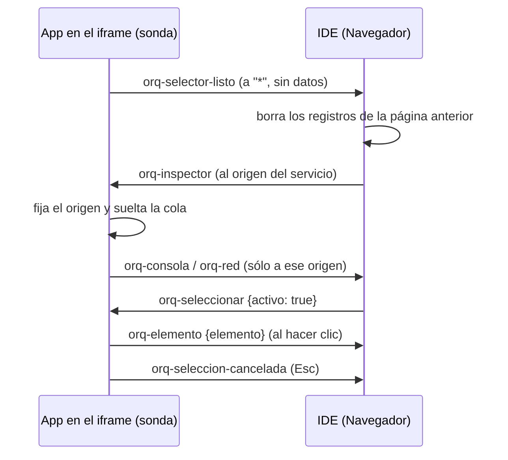

# Selector de elementos e inspector

Dos herramientas de la vista previa de un servicio web levantado (ver
[[Configuración de repos y servicios]]) que salen **del mismo script**:

- **Seleccionar**, como el "select element" de Cursor: tocás una parte de la app
  corriendo y va al chat con qué es, qué componentes de React la dibujan y en
  qué archivos del repo está.
- **Inspector**, como las pestañas Consola y Red de DevTools, con lo único que
  DevTools no tiene: un botón **Al chat** que manda la falla —con su stack, o con
  el pedido y la respuesta del backend— para que un agente la arregle.

Existe porque el iframe de la vista previa es **otro origen**
(`127.0.0.1:43xx`) y el IDE no puede tocar su DOM: sin algo corriendo adentro de
la página no hay forma de saber qué elemento tocó la persona ni qué falló.

## Dónde corre

El proxy de la vista previa (`apps/server/src/proxy-vista.ts`, ver
[[Vista previa y proxy]]) atiende el puerto público de cada servicio `web` o
`movil` y a cada página HTML le agrega
`` (`inyectarSelector`, una sola vez
por página). Ese archivo es `SELECTOR_JS`.

- Va **al principio del `<head>` y sin `defer`**: la sonda tiene que envolver
  `console`, `fetch` y `XMLHttpRequest` antes de que corra un solo módulo de la
  app, o se pierde justo el error que tira al arrancar. Sin `<head>`, va al
  principio del documento.
- Sólo hace algo **dentro de un iframe** (`window.parent === window` → no hace
  nada) y una sola vez (`window.__orqSonda`).
- Un servicio `api` u `otro` no pasa por el proxy: ahí no hay selector ni
  inspector (el botón dice "El selector todavía no cargó"). La vista previa
  **estática** del IDE tampoco los tiene.

## El protocolo de mensajes

Todo va por `postMessage` entre el iframe y el IDE
(`apps/web/src/routes/codigo/VistaDeServicio.tsx` → `Navegador`).

| Mensaje | Dirección | Contenido |
|---|---|---|
| `orq-selector-listo` | app → IDE, a `*` | nada: "estoy lista". Es el único que sale sin origen fijo |
| `orq-inspector` | IDE → app | saludo: fija a quién hablarle |
| `orq-seleccionar` | IDE → app | `activo: true/false`; también fija el origen |
| `orq-consola` | app → IDE | `nivel`, `texto`, `at`, `ruta`, `excepcion` |
| `orq-red` | app → IDE | `id`, `fase` (`inicio`/`fin`), método, URL, descripción del cuerpo, estado, ms, tipo, respuesta, error |
| `orq-elemento` | app → IDE | el `ElementoSeleccionado` |
| `orq-seleccion-cancelada` | app → IDE | nada |

**Reglas de confianza.** La sonda sólo le cree a `window.parent` y, hasta que el
IDE saluda, **no suelta nada**: lo que registra espera en una cola acotada
(`MAX_COLA = 500`, se descarta lo más viejo). El IDE sólo le cree a mensajes
cuyo `origin` es el del servicio **y** cuyo `source` es la ventana del iframe, y
valida la forma antes de usarlos (`esElemento`, `consolaDesdeMensaje`,
`aplicarRed` recortan cada campo).

**Recargas.** Cada `orq-selector-listo` es una página nueva: el IDE vacía los
registros y vuelve a saludar. Si la recarga en caliente de Vite ocurre mientras
se estaba señalando, el selector vuelve montado apagado y el IDE lo reactiva.

## La sonda: qué se registra y qué nunca

| Fuente | Qué se guarda | Qué no |
|---|---|---|
| `console.log/info/warn/error/debug` | los argumentos como texto (objetos en JSON hasta 2.000), hasta 6.000 caracteres, y la ruta | — (la consola original sigue andando) |
| `error` de `window` | excepciones con su stack; un recurso que no cargó ("No se pudo cargar script: …") | |
| `unhandledrejection` | "Promesa rechazada sin manejar: …" | |
| `fetch` y `XMLHttpRequest` (axios usa el segundo) | método, URL, estado, ms, tipo; **el cuerpo de la respuesta sólo si falló** (≥ 400 o sin respuesta), hasta 4.000 — ahí está el mensaje del backend | respuestas exitosas |
| lo enviado | sólo una **descripción**: de un `multipart`, nombre, tamaño y tipo de cada archivo (lo que diagnostica una subida); de un `Blob`, tamaño y tipo; de un texto, su largo | el contenido |
| cabeceras | **nunca**: ahí va el token | |

Un XHR con estado 0 se registra con "Sin respuesta: red caída, CORS rechazado o
pedido cancelado". La respuesta de `fetch` se lee sobre un `clone()`: la app
recibe la suya intacta.

## El selector

Mientras está activo, un recuadro azul sigue al puntero con un rótulo
`etiqueta · Componente  ancho×alto`, el cursor es una cruz, y la sonda **se come**
los clics y los eventos de puntero, táctiles, doble clic y `submit`: señalar un
botón no lo aprieta. El clic manda la descripción y apaga el selector; Esc
cancela.

`describir(el)` arma el `ElementoSeleccionado` (`apps/web/src/routes/codigo/elemento.ts`):

| Campo | Cómo |
|---|---|
| `etiqueta` | `tagName` en minúscula |
| `selector` | hasta 5 niveles; corta en el primer `id`; hasta 2 clases; `:nth-of-type` si hay hermanos iguales |
| `texto` | `innerText` con espacios colapsados, hasta 400 |
| `html` | `outerHTML` hasta 2.500 |
| `componentes` | se sube por la fibra de React (`__reactFiber$…`): hasta 8 nombres con mayúscula, en 80 pasos, del más cercano al más lejano |
| `fuentes` | `_debugSource` como `archivo:línea`, hasta 4 (React ≤ 18 lo expone) |
| `atributos` | `id`, `class`, `role`, `aria-label`, `data-testid`, `name`, `placeholder`, `href`, `type`, `title`, `alt` (200 c/u) |
| `ruta`, `titulo`, `tamano` | ruta con búsqueda y hash, `document.title`, `ancho x alto` |

> [!danger] Una barra sin escapar se come las eses
> El script viaja como `String.raw` adentro de un template literal de
> TypeScript: **ni backticks ni `${`** adentro (cerrarían el template) y los
> comentarios van afuera. Ya costó una hora: una regex de espacios llegó como
> `/s+/g` y "Orquestador" volvía "Orque tador". Los tests lo fijan.

## Del chat al código

Al llegar al chat (`apps/web/src/routes/codigo/Chat.tsx`):

**Un elemento** → `describirElemento` + `buscarCandidatos`. La búsqueda de dónde
está en el código usa tres pistas, de la más fuerte a la más débil, siempre
dentro de la carpeta del servicio y sin tests, hasta 6 candidatos:

1. el archivo que informa React (`fuentes`);
2. dónde se **define** cada uno de los primeros 4 componentes
   (`(function|const|class|let) +Nombre`): si la definición no está en el repo,
   el componente es de una librería y no se toca;
3. dónde aparece un texto distintivo: `placeholder`, `aria-label`,
   `data-testid` o el texto visible (entero si tiene hasta 60 caracteres, si no
   la primera frase), desde 3 caracteres.

El mensaje dice qué es, qué componentes propios lo dibujan con su `archivo:línea`
(si no hay propios, la cadena de hasta 4), atributos, selector, el HTML (entre
400 y 2.500 caracteres según el presupuesto) y los candidatos. El mejor —donde
aparece el texto **dentro** del archivo de un componente de la cadena— va con
**50 líneas de vecindad** si quedan más de 4.000 de presupuesto: es la línea
exacta del botón, no la definición doscientas líneas más arriba.

**Una falla** → `describirFalla`: título, detalle (entre 800 y 6.000 caracteres),
y los archivos propios que nombra el stack (`archivosDelStack`: rutas bajo
`src/`, `app/`, `components/`, `pages/`, `lib/`, `screens/`, `hooks/`, `utils/`,
sin `node_modules` ni `.vite/deps`, hasta 5), con 30 líneas alrededor de la
primera. Vite sirve los módulos con su ruta real, así que el stack ya dice
archivo y línea. Si es un pedido de red sin stack, el mensaje le pide buscar
quién lo arma y qué ruta lo atiende antes de suponer la causa.

En el teléfono, señalar va por el árbol de accesibilidad y el depurador de
Hermes y llega con la misma forma: ver [[Inspector de React Native]].

## El inspector

`apps/web/src/routes/codigo/Inspector.tsx`, un panel de 288 px debajo del
navegador que se abre con el botón **Inspector** (que muestra cuántos errores
hay).

- Pestañas **Consola** y **Red** con total y errores; filtro de texto; "Sólo
  errores". Sigue lo último mientras no subas a leer (margen de 24 px).
- Consola: color por nivel, las entradas largas se despliegan.
- Red: método, estado (`…` en curso, `✕` sin respuesta), ruta, lo enviado y ms;
  desplegada muestra URL, página, enviado, tipo, error y respuesta. Una exitosa
  aclara que el cuerpo sólo se guarda cuando el pedido falla.
- **Al chat** en errores y advertencias de consola y en pedidos fallidos
  (`fallaDe`: "Excepción: …", "Error: …" o "POST /api/x → 413").
- Se guardan hasta `TOPE_REGISTROS = 1.000` registros: una app que loguea en
  bucle no puede comerse la memoria.

> [!note] `sonda.ts` y no `inspector.ts`
> Los tipos y las funciones puras viven en `sonda.ts` porque `inspector.ts` al
> lado de `Inspector.tsx` **choca en macOS**: el sistema de archivos no distingue
> mayúsculas y `tsc` lo rechaza.

## Qué fijan los tests

- `apps/server/src/proxy-vista.test.ts`: inyecta el selector al principio del
  `<head>` y deja pasar el resto intacto; no deja que un pedido condicional
  devuelva un 304 sin selector; reenvía los websockets de la recarga; con el
  programa caído contesta 502; `inyectarSelector` no duplica. La sonda, en una VM:
  no suelta nada hasta el saludo y después sólo al origen que saludó; registra
  un XHR fallido con su respuesta y los archivos del multipart; registra un
  `fetch` fallido y le devuelve la respuesta intacta a la app; no lleva
  backticks ni `${`; la regex `\s+` sobrevive.
- `apps/web/src/routes/codigo/sonda.test.ts`: `archivosDelStack` saca los
  archivos propios con su línea sin dependencias; un pedido fallido se cuenta
  con método, estado, lo enviado y la respuesta.

## Fuentes

- `apps/server/src/proxy-vista.ts` → `SELECTOR_JS`, `inyectarSelector`, `RUTA_SELECTOR`
- `apps/web/src/routes/codigo/VistaDeServicio.tsx` → `Navegador`, `TOPE_REGISTROS`
- `apps/web/src/routes/codigo/Inspector.tsx` → `Inspector`, `AlChat`
- `apps/web/src/routes/codigo/sonda.ts` → `consolaDesdeMensaje`, `aplicarRed`, `fallaDe`, `archivosDelStack`, `esError`
- `apps/web/src/routes/codigo/elemento.ts` → `ElementoSeleccionado`, `esElemento`, `buscarCandidatos`, `rotuloDeElemento`
- `apps/web/src/routes/codigo/Chat.tsx` → `describirElemento`, `describirFalla`, `componentesDelRepo`

## Ver también

- [[Vista previa y proxy]] · [[Chat de IA]] · [[Configuración de repos y servicios]]
- [[Inspector de React Native]] · [[El IDE]] · [[Seguridad]]
