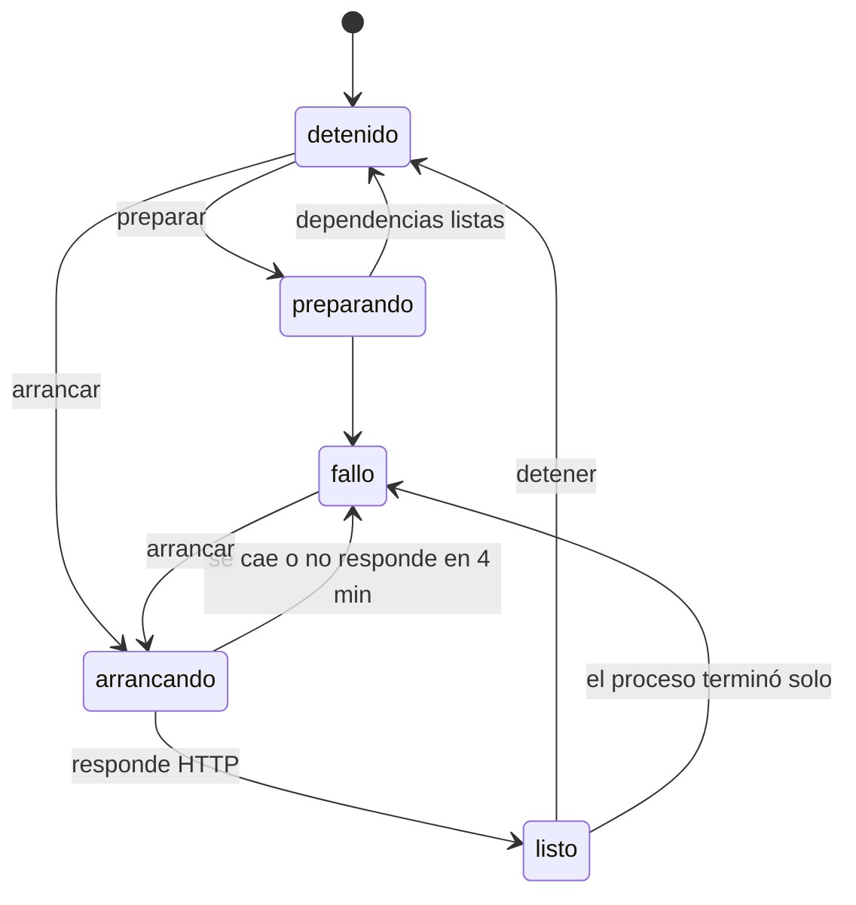

# Servicios del monorepo

Un repo como el de INSPIA es un solo git con **cuatro programas adentro**: un
backend (Express), un frontend (Vite), una app móvil (Expo) y un vault de
Obsidian. Cada uno se levanta distinto, en su carpeta, con su puerto y su
`.env`. Un **servicio** (`servicioSchema`) describe una de esas partes, y
`ServiciosVivos` (`apps/server/src/servicios.ts`) las levanta para la vista
previa, sobre el worktree de la sesión.

## Por qué

La vista previa de archivos estáticos (ver [[Vista previa y proxy]]) sólo
servía para un simulador en HTML: una app de Vite o de Expo no es un archivo
estático, hay que **levantarla**. Y un agente que no sabe qué parte es qué
trata `backend/` y `frontend/` como carpetas cualquiera y corre `npm test` en la
raíz.

## El servicio (`servicioSchema`)

| Campo | Qué es |
|---|---|
| `id` | slug estable en el repo (`backend`): es lo que nombran los agentes; no cambia al editar |
| `nombre`, `carpeta`, `tipo` | `tipo`: `api` · `web` · `movil` · `docs` · `otro`; `carpeta` `""` es la raíz |
| `arrancar` | argv de desarrollo, con `{puerto}`; `null` si no se levanta (documentación) |
| `variablePuerto` | con qué variable lee su puerto (`PORT`) |
| `puertoOriginal` | el que usa **en la máquina de la persona**: sirve para redirigir URLs |
| `salud`, `inicio` | qué se consulta para saber que está listo; dónde abre la vista |
| `archivosEntorno` | sus `.env`, **rutas absolutas**, leídos al arrancar (hasta 8) |
| `entorno` | variables sin secretos que pisan a las de los archivos; `{url:backend}` es la URL de otro servicio |
| `marcadoresProduccion` | textos que delatan producción: con uno presente, un agente no maneja la app (ver [[QA móvil]]) |

## Detectar (`detectarServicios`)

Al cargar el repo (y a pedido, `POST /api/repos/:id/servicios/detectar`, que
**conserva lo que la persona ya editó** de cada servicio que siga existiendo):

1. **Carpetas candidatas**: la raíz, las de primer nivel (salvo ocultas y
   `node_modules`, `dist`, `build`, `src`, `lib`, `scripts`, `tests`, `public`,
   `assets`… — `NO_ES_SERVICIO`) y las hijas de `apps/`, `packages/`,
   `services/`, `servicios/`.
2. **De cada una se lee** (`leerCandidata`): su `package.json`, cuántos `.md`
   tiene (dos niveles), si tiene `.obsidian`, el puerto de su `vite.config`
   (`server.port`), el `PORT` de los `.env` **de la carpeta de la persona**
   (`.env`, `.env.local`, `.env.development`, `.env.development.local`) y
   pistas del código: el default de `process.env.PORT || 3001` y una ruta de
   salud (`/health`, `/api/healthz`…).
3. **Clasificar** (`clasificarServicio`, `packages/shared/src/servicios.ts`,
   puro para fijarlo con tests). **El orden importa**:

| Si tiene… | Tipo | Arranque | Puerto original |
|---|---|---|---|
| `expo` | `movil` | `npm run web -- --port {puerto}` o `npx expo start --web --port {puerto}` | 8081 |
| `next` + script `dev` | `web` | `npm run dev -- -p {puerto} -H 127.0.0.1` | 3000 |
| `vite` + script `dev` | `web` | `npm run dev -- --port {puerto} --strictPort --host 127.0.0.1` | el de su config, o 5173 |
| express, fastify, koa, nest, hono, hapi, restify o adonis + `dev`/`start` | `api` | `npm run <script>`, `PORT` | `.env` o código |
| otro script `dev`/`start`, fuera de la raíz | `otro` | `npm run <script>`, `PORT` | `.env` |
| notas + `.obsidian` o nombre tipo docs/wiki/manual | `docs` | — | — |

   **Expo gana a Vite** aunque traiga `react-dom`: clasificado como web se
   arranca con el comando equivocado y no levanta. Vite va con `--host
   127.0.0.1` porque la config de la persona puede decir `::`, y una vista
   previa no se publica en la red de la oficina.
4. **Ajustes**: si la raíz es un servicio, no es un monorepo sino una app con
   carpetas: queda la raíz (y la documentación). La raíz como documentación
   sólo si no hay una carpeta de notas propia —en INSPIA `.obsidian` está en la
   raíz pero las notas viven en `inspia-obsidian/`—. Ids repetidos se
   desambiguan (`conIdsUnicos`).

La edición a mano es `PUT /api/repos/:id/servicios/:servicioId`: sólo acepta
`archivosEntorno` con ruta absoluta y **nombre de `.env`** —el servidor los
inyecta en un proceso que corre código de un agente, y esto no puede ser la
forma de meterle `~/.ssh/id_rsa` como variable— y la carpeta se valida dentro
del clon. La UI es [[Configuración de repos y servicios]].

## Los comandos van por carpeta

Cada parte tiene su `package.json`, así que `ejecutar_comando`,
`instalar_dependencia` y la terminal aceptan `carpeta` (validada dentro del
worktree). La allowlist es la unión de lo detectado en la raíz y en cada parte
(ver [[Comandos y sandbox]]).

## Levantar (`ServiciosVivos`)

Levantar lo decide **la persona** (es donde se inyectan sus credenciales):
`POST /api/repos/:id/servicios/:sid/{preparar,arrancar,detener}`. Preparar
contesta al toque y avanza en los logs (con su `.catch`: una promesa sin dueño
tira el servidor). Todo corre **sobre el worktree de la sesión**: lo que se ve
es lo que cambiaron los agentes, y Vite o `ts-node-dev` recargan solos con cada
edición.

### Preparar

Si la carpeta ya tiene `node_modules`, nada. Si la persona los tiene instalados
y **su lockfile es idéntico** al de la sesión, se copian con `cp -cR`: en APFS
es un clon copy-on-write, instantáneo y sin ocupar disco, y es exactamente lo
que ella corre todos los días (con sus scripts de instalación ya corridos, que
acá no se correrían). Si no, `npm ci --ignore-scripts` (o `pnpm`/`yarn install
--frozen-lockfile --ignore-scripts`, o `npm install` sin lockfile) en el
sandbox, con red, hasta 15 minutos.

### Arrancar

1. **Puerto propio** en 4300-4399 (`PUERTOS`): el 3001 y el 5173 los está
   usando ella con su versión. Se reusa el último de cada servicio si sigue
   libre, así las URLs no cambian.
2. **Se reserva el puerto de cada hermano aunque no esté levantado**: la
   dependencia es circular —el CORS del backend necesita la URL del frontend y
   viceversa—, y redirigir sólo a lo que ya corre obligaba a un orden de
   arranque que no existe.
3. **Los `.env` se leen al arrancar y se inyectan** (`parsearDotenv`, lo que
   entiende `dotenv`). No se copian al worktree —el clon los excluye, y ahí los
   leería `leer_codigo`— ni se guardan en la base. Uno que no se puede leer se
   avisa y se arranca sin él.
4. **Se reescriben las URLs locales** (`redirigirUrlsLocales`): un
   `VITE_API_URL=http://localhost:3001/api` pasa a apuntar al backend de la
   vista previa. Sin eso el frontend de la sesión le hablaba **al backend de la
   persona**: la peor falla de una vista previa, se ve bien y muestra otra
   cosa. En una lista separada por comas se reescribe elemento por elemento.
   Las URLs **de la propia app** que apuntan afuera (una `EXPO_PUBLIC_API_URL`
   a producción) no se tocan pero **se avisan**; las de Supabase, un webhook o
   un secreto no, porque taparían el aviso que importa.
5. `entorno` pisa lo leído (con `{url:<id>}` expandido); una pisada se muestra
   como redirección.
6. **Web y móvil van detrás de un proxy**: el programa escucha en un puerto
   interno (4400-4499, `PUERTOS_INTERNOS`) y el público lo atiende el proxy del
   selector (ver [[Vista previa y proxy]]). Una API no: nadie señala adentro de
   un JSON. `variablePuerto` recibe el puerto interno.
7. **Un temporal por servicio** (`tmp/servicios/<id>`), creado antes de lanzar:
   `ts-node-dev` hace un `mkdtemp` ahí y sin la carpeta muere en la línea uno.
8. **En el sandbox de los comandos** (opt-in `sinAislamiento` aparte), en su
   propio grupo de procesos, con `entornoDeServicio`: el mismo saneo de
   credenciales que un comando pero **sin `CI=1`** (Expo apaga la recarga) y
   con `BROWSER=none` (`expo start --web` abría una pestaña en el Chrome de la
   persona), `EXPO_NO_TELEMETRY` y `EXPO_NO_REDIRECT_PAGE`, más las variables
   propias del servicio.
9. **Listo es cualquier respuesta HTTP** al puerto **interno** + `salud` (un
   404 también es un servidor andando), cada 800 ms, hasta 4 minutos. Al
   interno y no al proxy: el proxy contesta 502 mientras arranca, y cualquier
   respuesta contaría como lista.

> [!danger] `data/proyectos/package.json` existe a propósito
> `data/` vive adentro del repo del orquestador, cuyo `package.json` dice
> `"type": "module"`, y Node decide cómo cargar un `.js` por el `package.json`
> más cercano. `ts-node-dev` escribe su hook en `TMPDIR` y lo carga con
> `require`: el backend de INSPIA moría con "require is not defined".
> `Directorios.prepararRaiz` deja uno con `"type": "commonjs"`.

### Secretos, logs y pruebas

- Los valores de las variables con nombre de secreto (`KEY`, `TOKEN`, `SECRET`,
  `PASSWORD`, `DSN`, `PRIVATE`, `AUTH`, `COOKIE`, `SESSION`…) de 8 caracteres o
  más se tapan como `«secreto»` en los logs y en las respuestas de
  `probar_servicio`, que es lo que lee un agente. La vista expone sólo los
  **nombres** de las variables; la configuración muestra de cada `.env` si
  existe y cuántas variables tiene.
- Logs: las últimas 3.000 líneas, cada una hasta 4.000 caracteres, sin códigos
  ANSI, con un contador absoluto para pedir "desde la N"
  (`GET …/servicios/:sid/logs?desde=`).
- `probar` (`POST …/servicios/:sid/probar`, y la herramienta
  `probar_servicio`): un pedido HTTP **sólo a ese servicio**, desde el servidor
  (no depende del CORS del backend), 30 s, sin seguir redirecciones, JSON
  indentado, cuerpo hasta 8.000 caracteres, sin `set-cookie` ni
  `authorization`.

### Procesos huérfanos

Como van en su propio grupo, un reinicio de `tsx watch` los dejaría ocupando
puertos. Cada pid se anota con su hora de inicio (`ps -o lstart`) en
`data/proyectos/.servicios-vivos.json`; al arrancar, `barrerHuerfanos` mata los
que siguen vivos **con la misma hora** (un pid reciclado no se mata por
parecerse). El `exit` y el apagado los matan (`detenerTodos`).

Se detienen solos al publicar (si la sesión se cierra), descartar, sacar el
repo, borrar el servicio o la empresa. Renombrar el proyecto con servicios
vivos se rechaza: corren adentro de la carpeta que se muda.

## Lo que ven los agentes

**Ven y prueban, no levantan.** La herramienta `servicios` lista estado y URL o
trae los últimos logs (`accion=logs`, 10 a 400 líneas); `probar_servicio` hace
un pedido HTTP. El resumen de código de cada turno dice qué parte es qué, si
está levantada y dónde está la documentación (ver
[[Arriendo de escritura y resumen de código]]). Para el teléfono,
`puertosParaDispositivo` da el Metro interno y los puertos públicos de los
hermanos (ver [[App móvil en el teléfono]]).

## Constantes

| Nombre | Valor | Por qué |
|---|---|---|
| `PUERTOS` | 4300-4399 | lejos de los que usa la persona |
| `PUERTOS_INTERNOS` | 4400-4499 | detrás del proxy del selector |
| `ESPERA_LISTO_MS` | 4 min | un Metro frío tarda |
| `CORTE_PREPARAR_MS` | 15 min | una instalación limpia |
| `MAX_LINEAS` | 3.000 | logs por servicio |

## Casos borde

- **Sin dependencias**: arrancar falla con "preparalo primero".
- **Un proceso que se cae** queda en `fallo` con "Terminó con código N. Mirá el
  final de la salida", no en "arrancando" para siempre.
- **`{url:x}` de un servicio que no existe** queda literal, a la vista.
- **Sin puertos libres** en el rango: error.

## Qué fijan los tests

- `apps/server/src/servicios.test.ts`: el frontend de la vista previa le habla al backend de la vista previa y los secretos no salen en los logs ni en las respuestas; detener mata el proceso; un proceso que se cae queda en `fallo` con su salida; sin dependencias no arranca y lo dice; la detección del monorepo de INSPIA (API, web, móvil, documentación; la raíz con sólo tests no cuenta).
- `packages/shared/src/servicios.test.ts`: backend de Express con puerto y salud; Vite en el puerto asignado y sólo en localhost; Expo es móvil aunque traiga `react-dom`; documentación vs nada; ids únicos; redirecciones (incluida la lista de orígenes) y avisos sólo de URLs de la app; `parsearDotenv`; `expandirUrls`.

## Fuentes

- `apps/server/src/servicios.ts` → `ServiciosVivos` (`preparar`, `arrancar`, `esperarListo`, `detener`, `probar`, `barrerHuerfanos`, `puertoPara`, `puertosParaDispositivo`), `PUERTOS`, `PUERTOS_INTERNOS`, `detectarServicios`, `argvDeInstalacionLimpia`, `copiarModulos`
- `packages/shared/src/servicios.ts` → `clasificarServicio`, `conIdsUnicos`, `argvDeArranque`, `parsearDotenv`, `redirigirUrlsLocales`, `expandirUrls`, `esClaveSecreta`
- `packages/tools/src/codigo/ejecutar.ts` → `entornoDeServicio`
- `apps/server/src/runtime.ts` → `entornoDeArranque`, `prepararServicio`, `arrancarServicio`
- `apps/server/src/rutas-codigo.ts` → rutas `/servicios`
- `apps/server/src/codigo-servidor.ts` → `serviciosParaAgente`, `lineasDeServicios`
- `packages/shared/src/schema.ts` → `servicioSchema`

## Ver también

- [[Trabajo con código]]
- [[Vista previa y proxy]]
- [[Configuración de repos y servicios]]
- [[Directorios en disco]]
