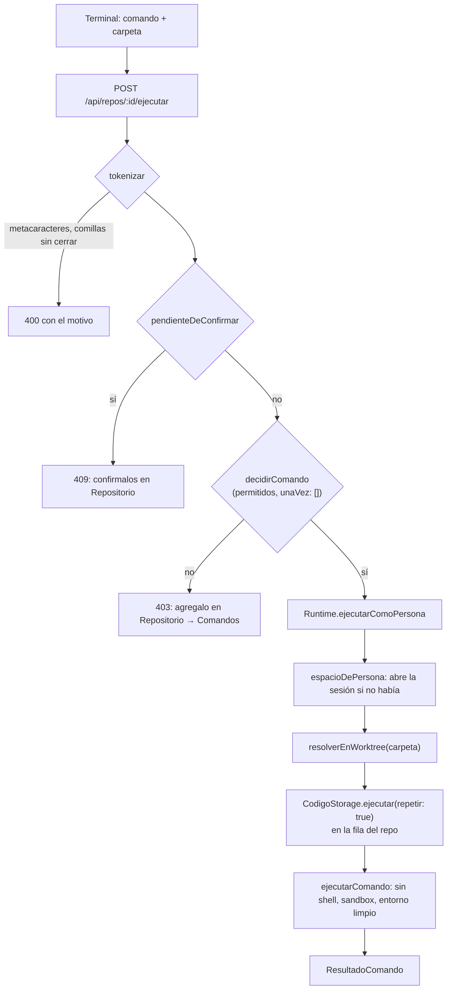

# Terminal del IDE

El panel inferior de [[El IDE]] tiene una terminal que **no es una shell**:
corre sólo los comandos permitidos del repo, uno por vez, en el mismo sandbox y
con el mismo entorno limpio que usan los agentes. Sirve para lo que una persona
hace todo el tiempo al revisar código —`npm test`, `npm run typecheck`, un
`git log`— sin salir del IDE ni abrir la carpeta del worktree a mano.

## Por qué no es una shell

La API del orquestador escucha en `localhost`. Un endpoint que corre lo que le
pidan sería una puerta a la máquina que cualquier página abierta en el navegador
podría golpear —y desde que existe la vista previa, eso incluye el JavaScript
que escribe un agente—. Por eso la terminal pasa por **la misma allowlist y el
mismo sandbox** que `ejecutar_comando`. Quien necesita otra cosa la agrega a la
lista a sabiendas, o abre su propia terminal
(`apps/server/src/rutas-codigo.ts` → `POST /api/repos/:repoId/ejecutar`).

## Cómo funciona

1. `apps/web/src/routes/codigo/Terminal.tsx` → `Terminal` manda
   `api.ejecutarEnRepo(repoId, texto, carpeta)`.
2. El servidor **tokeniza** sin shell (`tokenizar`, `packages/shared/src/argv.ts`):
   respeta comillas simples y dobles y no expande nada —ni variables, ni `~`, ni
   globs—. Rechaza los metacaracteres de shell (`;`, `&`, `|`, `<`, `>`, `` ` ``,
   `$`, `\`, saltos de línea, `*`, `?`) y **explica por qué**: un
   `npm test && npm run lint` no hace lo que su autor cree. Son dos comandos.
3. Si el repo vino importado de un blueprint (`pendienteDeConfirmar`), no corre
   nada hasta que una persona confirme la lista: importar un JSON no puede
   autorizar comandos.
4. `decidirComando` decide con la allowlist del repo (ver abajo).
5. `Runtime.ejecutarComoPersona` (`apps/server/src/runtime.ts`) arma el espacio
   de la persona (`espacioDePersona` en `apps/server/src/codigo-servidor.ts`,
   que **abre la sesión** si no había), valida la carpeta dentro del worktree y
   delega en el mismo `CodigoStorage.ejecutar` que usan los agentes.

## Qué se puede correr

| Regla | Dónde | Ejemplo |
|---|---|---|
| La allowlist compara **por token**, como prefijo | `empiezaCon` | `npm test` habilita `npm test -- -t suma`, no `npm testx` |
| Leer git se permite siempre | `GIT_LECTURA` | `status`, `diff`, `log`, `show`, `blame`, `ls-files`, `grep`, `rev-parse`, `shortlog`, `describe` |
| …salvo las opciones que escriben o ejecutan | `decidirComando` | `git diff --output=…`, `--ext-diff`, `--textconv`, `--exec`, `--upload-pack`, `--git-dir`, `--work-tree`, `--config-env` |
| Escribir con git, nunca (ni aunque esté en la lista) | `GIT_PROHIBIDOS` | `push`, `remote`, `config`, `credential`, `submodule`, `filter-branch`, `gc`, `worktree` |
| Los permisos "una vez" de los agentes **no** valen acá | `unaVez: []` en la ruta | lo que una persona aprobó para un agente no queda habilitado en su terminal |

Qué entra en la allowlist —y qué prefijos se rechazan por permitirlo todo, como
`npx`, `bash`, `node` a secas o `npm run` sin script— lo decide
`validarPrefijoPermitido` al guardar la lista desde la vista Repositorio. Ver
[[Comandos y sandbox]] y [[Configuración de repos y servicios]].

## Cómo corre

Todo lo de "cómo" es el código compartido con los agentes
(`packages/tools/src/codigo/ejecutar.ts` → `ejecutarComando`):

- **Sin shell**: argv tal cual.
- **Sandbox** (`sandbox-exec` en macOS): se escribe sólo en el worktree y en el
  `tmp/` del proyecto; nunca en el `.git` del clon ni en el archivo `.git` del
  worktree. Si la máquina no tiene `sandbox-exec` y el repo no tiene el opt-in
  `sinAislamiento`, el comando no corre y el resultado lo dice.
- **Entorno limpio**: se sacan las variables cuyo nombre parece credencial
  (`KEY`, `TOKEN`, `SECRET`, `PASSWORD`, `AUTH`, `SESSION`…) y las del
  orquestador (`ORQ_`, `ANTHROPIC`, `OPENAI`, `DATABASE_URL`…); se agregan
  `CI=1` (sin eso vitest y jest arrancan en modo watch y no terminan nunca),
  `NO_COLOR`, `TERM=dumb` y un `TMPDIR` propio.
- **El corte mata el grupo entero**, nietos incluidos.
- **Salida acotada**: cabeza de 2.000 caracteres y cola de 10.000 —el error de
  un test se imprime al final—; el log completo queda en `tmp/logs/` del
  proyecto (la terminal no lo muestra).

Tres diferencias con cómo corre un agente:

- **No reutiliza.** Un agente recibe el resultado anterior si el árbol no cambió
  en 30 minutos; la persona no: `ejecutarComoPersona` pasa `repetir: true`,
  porque quien aprieta `npm test` quiere verlo correr. Su resultado sí queda
  guardado, y un agente que pida el mismo comando sobre el mismo árbol lo recibe
  como reutilizado.
- **No espera el arriendo.** La terminal no se bloquea mientras un agente
  escribe, pero comparte con él **la fila del repo** (`enFila`): un comando por
  vez por repo, porque dos `npm test` comparten puertos y `dist/`. Si un agente
  está corriendo algo, el de la persona espera su turno.
- **Corte por tiempo:** el endpoint acepta `segundos` entre 5 y 600; la terminal
  no lo manda, así que el corte es de **300 s**.

> [!note] Correr un comando marca los archivos nuevos
> Antes de ejecutar se toma la huella del árbol, y para eso se hace
> `git add -A --intent-to-add` (sin eso `git diff` no ve un archivo recién
> creado). El [[Panel de control de código]] lo sabe: muestra esas entradas como
> "nuevo sin seguimiento" y las suelta antes de un stash o un cambio de rama.

## La interfaz

- **Comandos sugeridos** arriba, como botones: el de tests, el de verificar y
  los permitidos del repo, sin repetidos (`sugeridos` en `Codigo.tsx`).
- **Carpeta** (sólo en un monorepo): un `select` con la raíz y las carpetas de
  los servicios que no son documentación. Cada parte tiene su `package.json`, y
  `npm test` en la raíz de INSPIA no es el de `mobile/`. El servidor valida la
  carpeta con `resolverEnWorktree`.
- **Historial** con ↑ y ↓, como en cualquier terminal, y un botón para limpiar.
- Cada entrada muestra el comando (con la carpeta), "ejecutando…", y al terminar
  la salida (o el error de lanzamiento), una etiqueta verde o roja con `exit N`
  o "cortado por tiempo", la duración y si corrió **en sandbox** o **sin
  aislamiento** (en ámbar).
- Al terminar, invalida el árbol del repo: un comando puede generar o cambiar
  archivos (snapshots, un build).

`exit ≠ 0` no es un error de la terminal: es el resultado del comando, y se
muestra como tal.

## El panel inferior

La terminal comparte el panel con **Salida**, la de los servicios levantados
(ver [[Configuración de repos y servicios]]):

- Se abre con ⌃\`, con el ícono de la barra de actividad o el de la barra de
  estado. Desde la vista Servicios, el botón de logs de un servicio abre el
  panel directo en su salida.
- La pestaña "Salida" aparece sólo si el repo tiene servicios que no son
  documentación, con un `select` para elegir cuál.
- Si el servicio elegido desaparece, el panel vuelve a la terminal.

## Errores que contesta

| Código | Cuándo |
|---|---|
| 400 | el comando no se pudo tokenizar (shell, comillas) |
| 403 | no está en los permitidos; el mensaje dice dónde agregarlo |
| 404 | el repo no existe |
| 409 | los comandos vinieron importados y nadie los confirmó |
| 422 / 400 | error de git al abrir la sesión (`fallo`) |

## Casos borde

- **Cerrar el panel borra el historial**: la terminal se desmonta
  (`panelAbierto && idRepo && …`). Cambiar de repo activo también (`key={idRepo}`).
- **Un comando que necesita confirmación interactiva** no la recibe: no hay
  entrada estándar, y `npm_config_yes` evita la de npm.
- **Con un agente corriendo una suite larga**, el comando de la persona queda
  "ejecutando…" hasta que la fila se libere.
- **Sin sandbox en la máquina** y sin `sinAislamiento`, nada corre: el mensaje
  pide habilitarlo en la configuración del repo.

## Qué fijan los tests

- `packages/shared/src/argv.test.ts`: `tokenizar` respeta comillas y no expande
  nada, rechaza sintaxis de shell explicando por qué y trata una comilla sin
  cerrar como error; `empiezaCon` compara por token; `validarPrefijoPermitido`
  no acepta prefijos que lo permiten todo ni publicar o tocar credenciales;
  `decidirComando` permite leer git siempre y escribir nunca, y lo no permitido
  dice cómo pedirlo.
- `packages/tools/src/codigo/codigo.test.ts` → "ejecutar_comando": rechaza shell
  y lo no permitido, `exit ≠ 0` es un resultado, el comando no ve las
  credenciales del servidor y corre con `CI=1`, el corte mata el grupo entero.
- `apps/server/src/ide.test.ts` → "comandos sobre un árbol que no cambió": se
  reutiliza el resultado, salvo que cambie un archivo o se pida repetir (lo que
  la terminal hace siempre).

## Fuentes

- `apps/web/src/routes/codigo/Terminal.tsx` → `Terminal`
- `apps/web/src/routes/Codigo.tsx` → `sugeridos`, panel inferior (`panelDe`, `panelAbierto`)
- `apps/web/src/api.ts` → `ejecutarEnRepo`, `ResultadoDeComando`
- `apps/server/src/rutas-codigo.ts` → `POST /api/repos/:repoId/ejecutar`
- `apps/server/src/runtime.ts` → `ejecutarComoPersona`
- `apps/server/src/codigo-servidor.ts` → `espacioDePersona`, `crearCodigoStorage().ejecutar`, `enFila`, `huellaDelArbol`, `VIGENCIA_RESULTADO_MS`
- `packages/shared/src/argv.ts` → `tokenizar`, `decidirComando`, `validarPrefijoPermitido`, `GIT_LECTURA`, `GIT_PROHIBIDOS`
- `packages/tools/src/codigo/ejecutar.ts` → `ejecutarComando`, `entornoDeComando`, `CABEZA`, `COLA`

## Ver también

- [[Comandos y sandbox]] · [[Configuración de repos y servicios]]
- [[El IDE]] · [[Panel de control de código]]
- [[Seguridad]] · [[Herramientas de código]]
