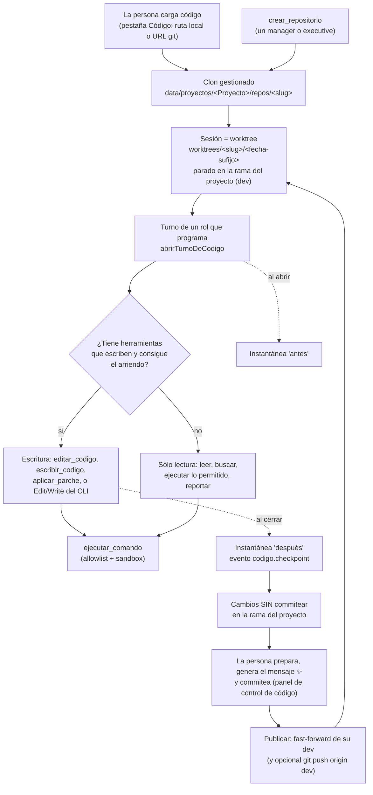

# Trabajo con código

El orquestador no sólo produce documentos y videos: **programa**. Una persona le
da código a un proyecto —una carpeta de su máquina, una URL de git, o un repo
nuevo que crea el propio equipo— y los agentes lo leen, lo editan, corren sus
tests y levantan sus servicios. Lo que cambian queda **sin commitear** en la rama
del proyecto, y es la persona la que prepara, escribe el mensaje, commitea y
publica. Es el flujo de Cursor, con un equipo de agentes del otro lado del chat.

Esta nota es la puerta de la carpeta `Código/`: cuenta el recorrido entero y
dónde vive cada pieza. El detalle de cada tramo está en su nota.

## Por qué está armado así

Programar sobre el código de una persona tiene cuatro riesgos que no se
resuelven con un prompt, y cada pieza de esta carpeta existe por uno de ellos:

| Riesgo | Qué pasaría | Freno | Nota |
|---|---|---|---|
| Tocar su repo | Un `git worktree add` sobre su carpeta escribe en su `.git`, dispara sus hooks y le deja refs | Todo pasa sobre un **clon gestionado**; su carpeta sólo se toca al publicar | [[Repositorios y sesiones]] |
| Correr código de un agente | `npm test` corre los tests que el agente acaba de escribir | **Allowlist** por token + `sandbox-exec` + entorno sin credenciales | [[Comandos y sandbox]] |
| Dos escritores sobre el mismo árbol | Uno corre los tests sobre la edición a medias del otro | **Arriendo** de escritura: uno escribe por vez | [[Arriendo de escritura y resumen de código]] |
| Firmar por la persona | Un agente commitea con un mensaje genérico y publica | Los agentes **no commitean**; cada turno queda en **instantáneas** | [[Instantáneas y checkpoints]] |

A eso se suma una regla transversal: **git no confía en nada que viva adentro
del worktree** (hooks, config, el archivo `.git`), porque ahí escribe un agente.
Ver [[Git endurecido]].

## El recorrido completo



Paso a paso, con quién llama a quién:

1. **Cargar.** `POST /api/companies/:id/repos` → `RepoStore.cargar`
   (`apps/server/src/repos.ts`). Clona su repo (o copia su carpeta si no tiene
   git), escribe `.git/info/exclude` para que `.env*` y `node_modules` nunca
   entren a un commit, detecta los servicios del monorepo y sugiere comandos. Al
   terminar, `Runtime.registrarHerramientasDeCodigo` re-registra las
   herramientas y siembra sus filas. Ver [[Repositorios y sesiones]].
2. **Abrir la sesión.** `RepoStore.abrirSesion` crea un worktree del clon
   **parado en la rama de la persona** (`dev` en INSPIA), no en una inventada.
   Hay una sola sesión abierta por repo y **sobrevive a la corrida**.
3. **Turno.** El motor (`packages/engine/src/loop.ts` → `runAgentTurn`) llama a
   `TurnDeps.codigo.abrirTurno`, que el servidor implementa con
   `abrirTurnoDeCodigo` (`apps/server/src/codigo-servidor.ts`): abre la sesión
   del repo principal, pide el arriendo, toma la instantánea "antes" y arma el
   **resumen de código** que entra al prompt. Ver
   [[Arriendo de escritura y resumen de código]].
4. **Trabajar.** Las 16 herramientas de código (`packages/tools/src/codigo/`)
   leen por ventanas, editan por reemplazo exacto, buscan con `git grep` y se
   orientan con un mapa de símbolos. Si el proveedor delega el turno a Claude
   Code, el CLI recibe además `Edit`/`Write` sobre el worktree —pero nunca
   `Bash`—. Ver [[Herramientas de código]].
5. **Verificar.** `ejecutar_comando` corre sólo lo permitido, sin shell, en
   `sandbox-exec`, con el entorno limpio; un comando sobre el mismo árbol
   devuelve el resultado anterior. Lo que falta se pide con `solicitar_comando`
   o, si es una librería, con `instalar_dependencia`. Ver [[Comandos y sandbox]]
   e [[Instalación de dependencias]].
6. **Cerrar el turno.** En el `finally` del turno: instantánea "después",
   evento `codigo.checkpoint` si algo cambió, y se suelta el arriendo. Ver
   [[Instantáneas y checkpoints]].
7. **Commitear y publicar.** Desde el IDE, la persona prepara, commitea (con su
   identidad de git) y publica: fast-forward de su rama en su carpeta, con
   `git push` opcional. La sesión sigue abierta. Ver
   [[Control de versiones y publicación]].
8. **Ver correr.** Los servicios del monorepo (API, frontend, app móvil) se
   levantan sobre el worktree de la sesión, en puertos propios, con los `.env`
   de la persona inyectados y las URLs locales reescritas. Ver
   [[Servicios del monorepo]] y [[Vista previa y proxy]].

## Dónde vive cada pieza

| Pieza | Archivo → símbolo | Nota |
|---|---|---|
| Clon, sesiones, instantáneas, publicar | `apps/server/src/repos.ts` → `RepoStore` | [[Repositorios y sesiones]], [[Instantáneas y checkpoints]], [[Control de versiones y publicación]] |
| Git del servidor | `apps/server/src/git.ts` → `git`, `entornoGit`, `validarUrlGit` | [[Git endurecido]] |
| Panel de Git del IDE | `apps/server/src/scm.ts` → `ControlDeVersiones` | [[Control de versiones y publicación]] |
| Arriendo, turno, almacenamiento de las tools | `apps/server/src/codigo-servidor.ts` → `ArriendosDeCodigo`, `abrirTurnoDeCodigo`, `crearCodigoStorage` | [[Arriendo de escritura y resumen de código]] |
| Herramientas del agente | `packages/tools/src/codigo/index.ts` → `crearHerramientasDeCodigo` | [[Herramientas de código]] |
| Ejecución y sandbox | `packages/tools/src/codigo/ejecutar.ts` → `ejecutarComando`, `perfilSandbox` | [[Comandos y sandbox]] |
| Allowlist | `packages/shared/src/argv.ts` → `decidirComando` | [[Comandos y sandbox]] |
| Dependencias | `packages/shared/src/dependencias.ts`, `Runtime.instalarDependencias` | [[Instalación de dependencias]] |
| Servicios | `apps/server/src/servicios.ts` → `ServiciosVivos`, `detectarServicios`; `packages/shared/src/servicios.ts` → `clasificarServicio` | [[Servicios del monorepo]] |
| Proxy del selector | `apps/server/src/proxy-vista.ts` → `levantarProxyDeVista` | [[Vista previa y proxy]] |
| Rutas HTTP | `apps/server/src/rutas-codigo.ts` → `registrarRutasDeCodigo` | [[Referencia de API de código y móvil]] |

## En disco

Todo vive dentro de la carpeta legible del proyecto (ver
[[Directorios en disco]]):

```text
data/proyectos/<Nombre del proyecto>/
├── repos/<slug>/                  el clon gestionado (su .git es el común)
├── worktrees/<slug>/<AAAAMMDD-xxxx>/   una sesión = un worktree
├── tmp/
│   ├── logs/                      salida completa de cada comando
│   ├── run/                       TMPDIR de los comandos
│   └── servicios/<id>/            TMPDIR de cada servicio levantado
└── salida/respaldos/              bundle + patch al sacar un repo con trabajo
```

Y en la raíz de los proyectos, dos archivos del servidor:
`.servicios-vivos.json` (los procesos a barrer si el servidor muere) y un
`package.json` con `"type": "commonjs"` para que Node no herede el ESM del
orquestador (ver [[Servicios del monorepo]]).

## Datos

Dos entidades en `packages/shared/src/schema.ts`, guardadas como JSON en las
tablas `repositorios` y `sesiones_codigo` y leídas **con Zod** (`Store.listRepositorios`,
`Store.getSesionCodigo`), para que los `.default()` se apliquen a las filas
viejas:

- `repositorioSchema`: nombre, `slug`, `origen` (`local` | `git` | `creado`),
  `ramaBase`, `comandos` (la allowlist), `servicios`, `commitsAutomaticos`,
  `pendienteDeConfirmar`. Ids con prefijo `rep_`.
- `sesionCodigoSchema`: `rama`, `carpeta`, `baseSha`, `estado`
  (`abierta` | `integrada` | `descartada`), `integracion`. Ids con prefijo `ses_`.

El detalle campo por campo está en [[Repositorios y sesiones]].

## Herramientas, eventos y endpoints

- **Herramientas de agente** (`origin: "skill"`): `listar_repositorios`,
  `mapa_del_codigo`, `buscar_codigo`, `buscar_archivos`, `leer_codigo`,
  `editar_codigo`, `escribir_codigo`, `aplicar_parche`, `estado_git`,
  `revertir_codigo`, `ejecutar_comando`, `solicitar_comando`,
  `crear_repositorio`, `instalar_dependencia`, `servicios`, `probar_servicio`.
  `HERRAMIENTAS_DE_CODIGO` suma además las del teléfono
  ([[Depuración de la app móvil]], [[QA móvil]]) y las de R2
  ([[Almacenamiento R2]]): otorgar cualquiera de ellas es "este rol trabaja
  sobre código".
- **Evento de la traza**: `codigo.checkpoint` (ver [[Referencia de eventos]]).
- **Canal propio**: `GET /api/companies/:id/codigo/stream` (SSE, evento
  `codigo`) con los `EventoDeCodigo` de `repos.ts` — `repo_cargado`,
  `repo_eliminado`, `sesion_abierta`, `sesion_integrada`, `sesion_descartada`,
  `checkpoint` y `servicio`—. La UI lo usa para refrescar sin polling
  (`Runtime.subscribeCodigo`, `Runtime.broadcastCodigo`).
- **Solicitudes**: tipos `comando` y `dependencia` (ver
  [[Aprobaciones y solicitudes]]).
- **Endpoints**: `apps/server/src/rutas-codigo.ts`, listados en
  [[Referencia de API de código y móvil]].

## Reglas que cruzan toda la carpeta

- **Publicar y descartar son de la persona.** No hay herramienta de agente que
  haga ninguna de las dos: viven sólo en `rutas-codigo.ts`. Es la misma regla
  que publicar un entregable ([[ADR-008 Publicar lo decide una persona]]).
- **Los frenos viven en el ejecutor, no en el prompt**: el arriendo lo verifica
  `CodigoStorage.puedeEscribir`, la allowlist `decidirComando`, el sandbox
  `perfilSandbox`, las rutas `resolverEnWorktree`.
- **Mirar no abre una sesión.** Listar y leer archivos sin sesión va contra la
  rama base del clon, en sólo lectura. Abrir una sesión crea un worktree, y una
  persona que sólo quería leer no tiene por qué dejarlo atrás. Sí abren sesión:
  un turno de agente, guardar desde el IDE, la terminal, levantar un servicio y
  aprobar una dependencia (todos pasan por `abrirSesion` o `espacioDePersona`).
- **Todo lo que cambia el árbol se anuncia** por el canal de código, y lo que
  cambia un turno, además, en la traza (`codigo.checkpoint`).

## El IDE

La pestaña Código es un IDE (Monaco, explorador, pestañas, diff, búsqueda,
terminal, chat) montado **sobre el mismo worktree** que usan los agentes. Lo
documentan [[El IDE]], [[Editor, explorador y búsqueda]], [[Terminal del IDE]],
[[Chat de IA]], [[Selector de elementos e inspector]],
[[Notas de Obsidian en el IDE]], [[Panel de control de código]] y
[[Configuración de repos y servicios]]. El caso completo de un pedido está en
[[CU-06 Pedido de código desde el chat]].

## Notas de esta carpeta

- [[Repositorios y sesiones]] — cargar, clonar, la sesión en la rama del proyecto, sincronizar, crear, renombrar, sacar con respaldo.
- [[Git endurecido]] — `git.ts`: config segura, entorno, reintento por lock, URLs.
- [[Arriendo de escritura y resumen de código]] — quién escribe, el resumen del prompt, el CLI con y sin arriendo.
- [[Herramientas de código]] — las 16 herramientas, una por una.
- [[Comandos y sandbox]] — allowlist, `sandbox-exec`, entorno, huella del árbol.
- [[Instalación de dependencias]] — pedir, aprobar, instalar sin scripts.
- [[Instantáneas y checkpoints]] — qué cambió un turno, cómo se ve y se deshace.
- [[Control de versiones y publicación]] — el panel de Git y publicar.
- [[Servicios del monorepo]] — detectar y levantar cada parte.
- [[Vista previa y proxy]] — la vista estática y el proxy que inyecta el selector.

## Fuentes

- `apps/server/src/repos.ts` → `RepoStore`, `EventoDeCodigo`
- `apps/server/src/codigo-servidor.ts` → `HERRAMIENTAS_DE_CODIGO`, `abrirTurnoDeCodigo`, `crearCodigoStorage`, `espacioDePersona`
- `apps/server/src/runtime.ts` → `registrarCodigoEn`, `registrarHerramientasDeCodigo`, `subscribeCodigo`, `broadcastCodigo`
- `apps/server/src/rutas-codigo.ts` → `registrarRutasDeCodigo`
- `packages/engine/src/loop.ts` → `TurnDeps.codigo`, `EspacioDeTurno`
- `packages/shared/src/schema.ts` → `repositorioSchema`, `sesionCodigoSchema`
- `apps/server/src/db.ts` → tablas `repositorios`, `sesiones_codigo`

## Ver también

- [[Runtime del servidor]]
- [[Turnos delegados a un CLI]]
- [[Proveedor claude-code]]
- [[Seguridad]]
- [[Referencia de herramientas]]
