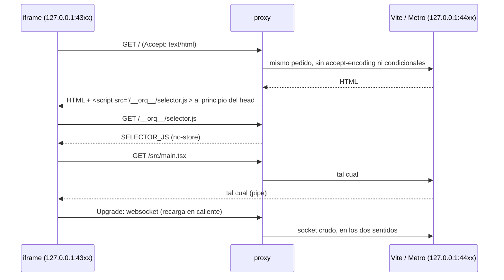

# Vista previa y proxy

La vista previa corre **código que escribió un agente, en el navegador de la
persona**. Eso decidió cómo se sirve. Hay dos caminos:

- **Vista estática**: `GET /api/repos/:id/vista/*` sirve archivos del worktree
  (un simulador en HTML, un sitio sin build).
- **Vista de un servicio**: un frontend levantado (Vite, Expo web, Next) atrás
  de un **proxy propio** que le inyecta el selector de elementos y la sonda del
  inspector (`apps/server/src/proxy-vista.ts`).

## La vista estática

`rutas-codigo.ts`, ruta `/api/repos/:repoId/vista/*`:

1. La raíz es el worktree de la sesión abierta, o el clon si no hay sesión
   (`RepoStore.raizDeVista`), resuelta con `realpath`.
2. La ruta pasa por `resolverEnWorktree`: nada en `.git`, nada afuera del repo
   (también con `..` codificado). Una carpeta sirve su `index.html`.
3. El tipo sale de la extensión (`tipoWeb`): sin `text/javascript` un ES module
   no carga. Cubre html, js/mjs/cjs, css, json, wasm, imágenes, audio, video,
   fuentes, glsl y gltf.
4. Cabeceras:

| Cabecera | Valor | Por qué |
|---|---|---|
| `Content-Security-Policy` | `sandbox allow-scripts allow-pointer-lock allow-forms` | el sandbox lo pone **el servidor**: vale también si alguien abre la vista en otra pestaña, donde ningún atributo `sandbox` la protege y correría con el origen de la app, con acceso a toda la API por el proxy de Vite |
| `Access-Control-Allow-Origin` | `*` | con origen opaco, los ES modules necesitan CORS para cargar. **Sólo estas respuestas** lo llevan |
| `Cache-Control` | `no-store` | cada guardado o checkpoint se ve al recargar |
| `X-Content-Type-Options` | `nosniff` | |

El iframe del IDE (`VistaPrevia.tsx`) va con `sandbox="allow-scripts …"` **sin
`allow-same-origin`**: con el origen de la app, lo que escribió un agente podría
llamar a toda la API —borrar empresas, correr comandos— con sólo cargarse. Se
recarga sola con cada guardado y cada checkpoint (ver [[El IDE]]).

## La API no le contesta a cualquiera

`construirApp({ origenes })` (`apps/server/src/app.ts`) cierra CORS a la app:
`index.ts` pasa el origen de `APP_URL`, `localhost:5173`, `127.0.0.1:5173` y el
propio puerto del servidor. Antes era `origin: true`, y cualquier página del
navegador —incluida la vista previa— podía leer lo que devolvía la API de
localhost. La UI va por el proxy de Vite (mismo origen), así que cerrarlo no le
costó nada. Un origen `null` (el de un iframe con sandbox) tampoco recibe
permiso.

## El proxy de un frontend

El iframe de un servicio es otro origen (`127.0.0.1:43xx`) y el IDE no puede
tocar su DOM: sin algo corriendo **adentro** de la página no hay forma de saber
qué elemento tocó la persona. Por eso los servicios `web` y `movil` escuchan en
un puerto interno (4400-4499) y el público (4300-4399) lo atiende
`levantarProxyDeVista({ puerto, destino })`.

**Es un puerto propio y no un prefijo** del servidor (`/vista/…`): Vite y Metro
piden `/@vite/client`, `/src/…`, `/node_modules/…` con rutas absolutas y abren
su websocket en la raíz, y debajo de un prefijo nada de eso existe.

Reglas que ya costaron:

- **Sin compresión para lo que puede ser HTML**: una página comprimida no se
  puede tocar sin descomprimirla. El resto viaja como vino, y una respuesta con
  `content-encoding` pasa sin inyectar.
- **Sin pedidos condicionales de HTML** (`if-none-match`, `if-modified-since`):
  si el programa contesta 304, el navegador usa la página guardada —la de antes
  del selector— y el selector no está.
- **Con el cuerpo reescrito se sacan `content-length`, `transfer-encoding` y
  `etag`** y se pone el largo nuevo: `chunked` junto con `content-length` es una
  respuesta inválida y el navegador la descarta entera.
- **Websockets crudos**: se reescribe la primera línea y las cabeceras tal como
  llegaron y se unen los dos sockets.
- **Programa caído o arrancando**: 502 con "El servicio todavía no responde.
  Esperá a que termine de arrancar y recargá", nunca un pedido colgado. Por lo
  mismo, la salud de un servicio se pide al puerto interno (ver
  [[Servicios del monorepo]]).
- Escucha sólo en `127.0.0.1`; `cerrar` corta también las conexiones abiertas.

### Lo que se inyecta

`inyectarSelector` pone `` **justo
después de `<head>`, sin `defer`** (si no hay `<head>`, al principio), y nunca
dos veces. Tiene que ser lo primero: la sonda envuelve `console`, `fetch` y
`XMLHttpRequest` antes de que corra un solo módulo de la app, o se pierde justo
el error que tira al arrancar.

`SELECTOR_JS` es la **sonda del inspector** (consola, excepciones, red) y el
**selector de elementos** en un solo script. Qué registra, qué nunca guarda
(cabeceras) y el protocolo con el IDE por `postMessage` están en
[[Selector de elementos e inspector]]. Del lado del servidor importan dos
cosas:

- Sólo actúa **dentro de un iframe**, no le habla a nadie hasta que el IDE lo
  saluda desde su origen, y el único mensaje a `*` es "estoy lista", sin datos.
- Va como `String.raw` y **sin backticks ni `${`** adentro: cerrarían el
  template. Los comentarios sobre su comportamiento van afuera. Es la trampa
  documentada en [[Trampas conocidas]] (una barra comida convirtió `\s+` en
  `s+`).

El iframe de un servicio en el IDE (`VistaDeServicio.tsx`) lleva
`allow-same-origin`: su origen es `127.0.0.1:43xx`, distinto del de la app, y
la API no le contesta.

## Casos borde

- Una página HTML pedida sin `Accept: text/html` pero servida como HTML sin
  comprimir también recibe el script: la inyección mira la respuesta.
- La vista estática de un repo sin sesión muestra la rama base del clon.
- Una vista abierta en una pestaña aparte corre igual con origen opaco (la CSP
  la pone el servidor).

## Qué fijan los tests

- `apps/server/src/proxy-vista.test.ts`: inyecta el selector al principio del `<head>` y deja pasar el resto intacto; un pedido condicional recibe 200 con el selector; el script servido conserva sus barras; reenvía los websockets; con el programa caído contesta 502; se inyecta una sola vez; la sonda no suelta nada hasta el saludo y después sólo a ese origen; registra un XHR fallido con su respuesta y el multipart; registra un `fetch` con error sin alterar la respuesta; no lleva backticks ni `${`.
- `apps/server/src/ide.test.ts`: la vista sirve con el tipo correcto, CORS abierto sólo para sí misma y CSP `sandbox allow-scripts` sin `allow-same-origin`; no deja leer `.git` ni salir del repo; la API le contesta a la app y no a otro origen ni a `null`.

## Fuentes

- `apps/server/src/proxy-vista.ts` → `levantarProxyDeVista`, `inyectarSelector`, `SELECTOR_JS`, `RUTA_SELECTOR`
- `apps/server/src/rutas-codigo.ts` → `/api/repos/:repoId/vista/*`, `tipoWeb`
- `apps/server/src/repos.ts` → `raizDeVista`
- `apps/server/src/app.ts` → `construirApp` (`origenes`); `apps/server/src/index.ts`
- `apps/server/src/servicios.ts` → `arrancar` (proxy y puerto interno)
- `apps/web/src/routes/codigo/VistaPrevia.tsx`, `VistaDeServicio.tsx`

## Ver también

- [[Servicios del monorepo]]
- [[Selector de elementos e inspector]]
- [[Seguridad]]
- [[Trabajo con código]]
