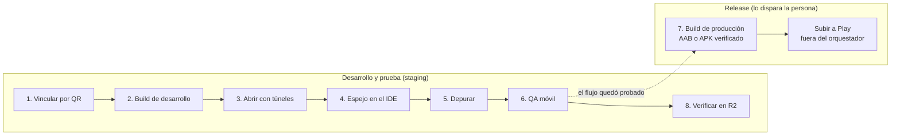
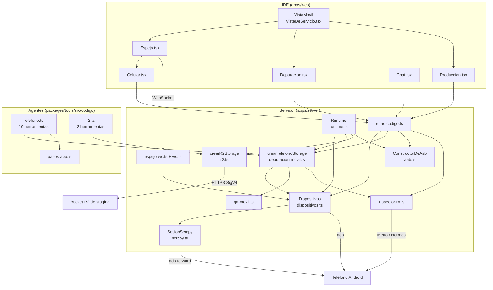

# App móvil en el teléfono

> El celular de la persona es la vista previa, el banco de pruebas y la fábrica
> del release de la app móvil del repo. Todo pasa por `adb`, y nada de lo que
> hace un agente sale de la app del repo.

Esta nota es la puerta de la carpeta **Móvil**: el recorrido completo, qué pieza
hace cada paso, qué vive dónde y dónde está el detalle de cada cosa.

## Por qué existe

Una app de React Native con módulos nativos (un visor de PDF, SQLite, la cámara)
**no se puede ver en el navegador**: `expo start --web` ni siquiera arma el
bundle —en INSPIA lo rompe `react-native-pdf`—. Expo Go tampoco sirve: no trae los
módulos nativos de la app y muere en la primera pantalla que los usa
(`apps/server/src/dispositivos.ts`, comentario de cabecera).

Lo que sí funciona es lo que hace Android Studio: **vincular el teléfono por la
depuración inalámbrica**, instalarle **una build de desarrollo** una vez, y de ahí
en más la app baja el JavaScript del **Metro de la sesión** —el mismo que ya
levanta la [[Vista previa y proxy|vista previa]]—. Cada edición de un agente se ve
en el teléfono sin compilar nada.

Sobre esa base se montan cuatro capacidades: el espejo en vivo dentro del IDE, la
depuración acotada para agentes, el QA móvil que maneja la app como una persona y
el build de producción verificado.

## El recorrido

1. **Vincular** el teléfono por QR: el QR de la depuración inalámbrica de Android
   (`WIFI:T:ADB;S:<nombre>;P:<clave>;;`), `adb pair` y `adb connect`
   (`Dispositivos.vincular`). → [[Vinculación del teléfono]]
2. **Instalar la build de desarrollo**: `expo prebuild` + `gradlew app:installDebug`
   para la ABI del teléfono, sin las credenciales del orquestador
   (`Dispositivos.instalar`). Una vez, y de nuevo sólo cuando cambia algo nativo.
   → [[Build de desarrollo y túneles]]
3. **Abrir la app con sus túneles**: `adb reverse` del 8081 del teléfono al Metro
   interno y de cada puerto de los servicios vivos al mismo puerto de la máquina;
   `force-stop` y lanzar (`Dispositivos.abrir`). Los túneles se re-tienden solos
   cuando la conexión se cae y vuelve. → [[Build de desarrollo y túneles]]
4. **Mirarla y tocarla desde el IDE**: scrcpy por un WebSocket (H.264 decodificado
   con WebCodecs), o `screenrecord` → MJPEG de respaldo. Señalar un elemento lo
   manda al chat con sus componentes de React. → [[Espejo del teléfono]] y
   [[Inspector de React Native]]
5. **Depurar**: logs (consola de JavaScript por Hermes + logcat de la app),
   estado, archivos privados, base SQLite, captura y diagnósticos, para agentes
   y en el panel del IDE. → [[Depuración de la app móvil]]
6. **Probar (QA móvil)**: `explorar_telefono` y `manejar_app` —tocar por texto,
   nunca por coordenadas, y sólo sobre staging—, con un rol dedicado que se crea
   desde el chat. → [[QA móvil]] y [[CU-07 Barrido de QA en el teléfono]]
7. **Armar el build de producción**: AAB para Play o APK para instalar directo,
   de una copia exacta del código, con `.env.prod` y verificado antes de
   entregarlo. Lo dispara la persona. → [[Build de producción Android]] y
   [[CU-08 Release de la app Android]]
8. **Verificar en R2** lo que la app dice haber subido: existe, no pesa 0 bytes y
   es del tipo que declara. → [[Almacenamiento R2]]



El paso 8 va al final de la lista porque es la verificación más lejana (el
bucket), pero en la práctica corre **adentro** de cada caso de QA: una subida
recién se da por buena cuando la UI y el bucket coinciden.

## Las piezas



| Archivo | Qué hace | Nota |
|---|---|---|
| `apps/server/src/dispositivos.ts` | `adb`: listar, vincular, instalar, abrir, túneles, espejo de respaldo, toques, árbol de accesibilidad | [[Vinculación del teléfono]], [[Build de desarrollo y túneles]], [[Espejo del teléfono]] |
| `apps/server/src/scrcpy.ts` | sesión y protocolo de `scrcpy-server` | [[Espejo del teléfono]] |
| `apps/server/src/espejo-ws.ts`, `ws.ts` | el WebSocket del espejo (video y toques) | [[Espejo del teléfono]] |
| `apps/server/src/inspector-rn.ts` | componentes de React por el depurador de Hermes, consola de JavaScript | [[Inspector de React Native]] |
| `apps/server/src/depuracion-movil.ts` | `TelefonoStorage`: adb acotado a la app del repo | [[Depuración de la app móvil]] |
| `apps/server/src/qa-movil.ts` | ubicar lo nombrado, resumir la pantalla, detectar producción, ejecutar pasos | [[QA móvil]] |
| `apps/server/src/aab.ts` | build de producción AAB/APK y sus verificaciones | [[Build de producción Android]] |
| `apps/server/src/r2.ts` | lectura del bucket R2 con SigV4 propio | [[Almacenamiento R2]] |
| `packages/tools/src/codigo/telefono.ts` | las 10 herramientas del teléfono | [[Depuración de la app móvil]], [[QA móvil]] |
| `packages/tools/src/codigo/pasos-app.ts` | validación de los pasos de `manejar_app` | [[QA móvil]] |
| `packages/tools/src/codigo/r2.ts` | `r2_listar`, `r2_objetos` | [[Almacenamiento R2]] |
| `packages/shared/src/plantillas.ts` → `QA_MOVIL` | el rol de QA móvil | [[QA móvil]] |

`packages/tools` no sabe de adb ni de S3: el servidor le inyecta un
`TelefonoStorage` y un `R2Storage` (`Runtime.registrarCodigoEn`), igual que con el
resto de las [[Herramientas de código]].

## Los cuatro modos de la vista del servicio móvil

La pestaña de un servicio de tipo `movil` no es un iframe sino `VistaMovil`
(`apps/web/src/routes/codigo/VistaDeServicio.tsx`), con cuatro modos. El elegido se
recuerda en `localStorage` (`orq-vista-movil`).

| Modo | Qué muestra | ¿Necesita el servicio levantado? |
|---|---|---|
| **Teléfono en vivo** (default) | `Espejo`: la pantalla real, toques, "Abrir la app" y el panel **Dispositivos** (vincular, instalar la build) | **sí**: sin Metro muestra "No levantado" |
| **Navegador (web)** | `expo start --web` en un iframe, con selector e inspector web | sí — y sólo sirve si la app arma para web |
| **Depuración** | `Depuracion`: logs, estado, archivos, base, diagnóstico | no (pero sin Metro no hay consola de JavaScript) |
| **Build de producción** | `Produccion`: el AAB o el APK | no: el build no usa el Metro de la vista previa |

> [!note] Para vincular desde la UI, el servicio tiene que estar levantado
> El panel de vinculación (`PanelDeCelular`) vive **adentro** del modo Teléfono en
> vivo, que sin Metro no se dibuja. Es una consecuencia de la UI, no una regla del
> servidor: `POST /api/dispositivos/vincular` no mira ningún servicio.

## Quién hace qué

| Acción | La persona (IDE) | Un agente |
|---|---|---|
| Vincular por QR | sí | no |
| Instalar la build de desarrollo | sí | no |
| Abrir la app con túneles | "Abrir la app" / "Abrir en el teléfono" | `reiniciar_app` (reabre con túneles) |
| Ver y tocar la app | el espejo, con el mouse | `explorar_telefono` y `manejar_app`, por texto y sólo sobre staging |
| Logs, estado, archivos, base, diagnóstico | panel Depuración | las herramientas equivalentes |
| Captura | ya la ve en el espejo | `captura_del_telefono` (a `revision/`) |
| Borrar los datos de la app | "Limpiar datos", con confirmación | `limpiar_datos_de_la_app`, **con aprobación** |
| Build de producción | sí | no |
| Borrar builds viejos | sí (menos el último) | no: no están marcados como generados |
| Verificar el bucket | — | `r2_listar`, `r2_objetos` |
| Subir a Play | sí, fuera del orquestador | no |

El panel del IDE y las herramientas usan **la misma implementación**
(`crearTelefonoStorage`): dos copias de las reglas divergen a la primera
corrección.

## El principio: el teléfono es de la persona

Tiene sus mensajes, sus fotos y las notificaciones de todas sus apps. Por eso
ninguna herramienta es un `adb shell` abierto y cada regla vive en el ejecutor, no
en el prompt:

| Regla | Dónde se hace cumplir |
|---|---|
| Sin shell: una lista cerrada de diagnósticos, atada al paquete | `validarDiagnostico` (`depuracion-movil.ts`) |
| Sólo la app del repo: logs por su uid, archivos por `run-as` | `lineasDeLaApp`, `listarArchivos`, `leerArchivo` |
| Mirar o tocar sólo con la app al frente y la pantalla encendida | `precondiciones`, `captura` (`depuracion-movil.ts`), `ejecutarPasos` (`qa-movil.ts`) |
| Nunca tocar las barras del sistema | `ZONA_UTIL` (`qa-movil.ts`) |
| Manejar la app y leer el bucket sólo sobre staging | `detectarProduccion` (`qa-movil.ts`), usado por `actuar` y por `crearR2Storage` |
| Lo destructivo pide aprobación | `limpiar_datos_de_la_app` con `requiresApproval: true` |
| Nada se expone a la red local | túneles `adb reverse` / `adb forward`, nunca la IP del teléfono |
| Los secretos no llegan al agente | `taparSecretos` en logs; `.env` y credenciales R2 sólo por nombre |
| Ninguna página puede manejar el teléfono | el WebSocket del espejo verifica `Origin` (`aceptarWebSocket`) |

Ver [[Seguridad]] para el mapa completo.

## Qué se registra y cuándo

- Las **10 herramientas del teléfono** se registran **sólo si hay `adb`**
  (`Runtime.registrarCodigoEn` → `this.dispositivos.disponible`): ofrecer una
  herramienta que siempre falla le hace gastar turnos al agente. `adb` se detecta
  **una vez**, al construir `Dispositivos`: si lo instalás con el servidor andando,
  reinicialo.
- Las **2 de R2** se registran **siempre**, como las de código: sin credenciales,
  cada una dice qué variables faltan y dónde van.
- scrcpy también se detecta una vez (`motorDeEspejo` memoriza la promesa).
- Todas entran en `HERRAMIENTAS_DE_CODIGO` (`apps/server/src/codigo-servidor.ts`), así
  que el [[Chat de IA|Mejorador de código]] las recibe al ponerse al día antes de
  cada pedido.
- Cuándo usarlas no vive sólo en el prompt del rol: el resumen de código de cada
  turno agrega la sección "App móvil en el teléfono" (`bloqueDeTelefono`) si el
  repo tiene un servicio `movil` y el rol tiene alguna de esas herramientas. Ver
  [[Arriendo de escritura y resumen de código]].

## Qué vive dónde

| Estado | Dónde | Sobrevive a un reinicio |
|---|---|---|
| Qué app se abrió en cada teléfono (por IP) | `data/proyectos/.dispositivos.json` | sí |
| Vínculos por QR en curso | memoria (`Dispositivos.vinculos`) | no |
| Instalaciones de la build de desarrollo | memoria (`Dispositivos.instalaciones`) | no |
| Sesiones de scrcpy, capturas, shells de toques | memoria | no (`detenerCapturas` las cierra al apagar) |
| Consola de JavaScript de la app | memoria, una por puerto de Metro (`consolaJs`) | no |
| Trabajo de build en curso | memoria (`ConstructorDeAab.trabajos`) | no |
| Builds hechos | `salida/builds/android/`: el `.aab` o `.apk` y su `.json` | sí |
| Capturas y descargas de R2 | `salida/revision/` y `salida/revision/r2/` | sí |

La `salida` es la carpeta del proyecto (`data/proyectos/<Nombre>/salida/`, ver
[[Directorios en disco]] y [[Salida de la empresa]]).

## Dependencias del sistema

| Programa | Para qué | Si falta |
|---|---|---|
| `adb` (platform-tools) | todo | la UI lo dice; las herramientas del teléfono no se registran |
| `scrcpy` (`brew install scrcpy`) | espejo fluido | espejo de respaldo con `screenrecord` |
| `ffmpeg` | espejo de respaldo (H.264 → JPEG) | el respaldo no arranca |
| JDK 17 | Gradle, en las dos builds | "No hay un JDK 17: instalá Android Studio o `brew install openjdk@17`" |
| SDK de Android | Gradle; `aapt2` y `apksigner` de build-tools para el APK | sin SDK no hay build de producción; sin build-tools no hay APK |
| `keytool` (del JDK) | certificado del AAB | — |
| `sqlite3` | `consultar_base_de_la_app` | la consulta falla |
| `unzip` | manifiesto y bundle adentro del AAB/APK | las verificaciones fallan |
| `npx expo` | `expo prebuild` | la build falla |
| Chrome con H.264 | WebCodecs para el espejo | espejo de respaldo |

`adb` se busca en `ANDROID_HOME`, `ANDROID_SDK_ROOT`,
`~/Library/Android/sdk`, `~/Android/Sdk` y el `PATH`, en ese orden
(`detectarAdb`). Ver [[Dependencias del sistema]].

## Variables de entorno

| Variable | Dónde se lee | Para qué |
|---|---|---|
| `ANDROID_HOME`, `ANDROID_SDK_ROOT` | `detectarAdb` | encontrar `adb`; el SDK se deduce de su carpeta |
| `JAVA_HOME` | `detectarJava` | el JDK de Gradle (si no, `java_home -v 17` o el de Android Studio) |
| `SCRCPY_SERVER_PATH`, `SCRCPY_VERSION` | `detectarScrcpy` | usar un `scrcpy-server` fuera de los prefijos de brew |
| `PROYECTOS_DIR` | `apps/server/src/env.ts` | dónde queda `.dispositivos.json` |
| `R2_*` | el `.env` **del servicio**, no el del orquestador | ver [[Almacenamiento R2]] |
| `SENTRY_AUTH_TOKEN` | el `.env.prod` de la app | sin él, el build pone `SENTRY_DISABLE_AUTO_UPLOAD=true` |

Ver [[Variables de entorno]].

## Qué fijan los tests

- `apps/server/src/dispositivos.test.ts` — vínculo por QR contra un adb falso, túneles al abrir, re-tendido tras una reconexión, árbol de accesibilidad, cortes de JPEG, escape de texto.
- `apps/server/src/scrcpy.test.ts` — los bytes del protocolo de scrcpy 4.x.
- `apps/server/src/ws.test.ts` — el WebSocket mínimo y el rechazo de un `Origin` ajeno.
- `apps/server/src/depuracion-movil.test.ts` — rutas, SQL, diagnósticos, secretos, logcat, crashes y la consola de JavaScript.
- `apps/server/src/qa-movil.test.ts` y `qa-movil-storage.test.ts` — ubicar, resumir, producción y ejecutar pasos; las negativas antes de tocar.
- `apps/server/src/aab.test.ts` — versión, manifiesto protobuf, certificados, bundle, APK y borrado de builds.
- `apps/server/src/r2.test.ts` — SigV4 con los vectores de AWS, listado, tipo real, credenciales y producción.
- `packages/tools/src/codigo/telefono.test.ts` y `pasos-app.test.ts` — las herramientas de QA vistas desde el agente.
- `apps/server/src/roles-vivos.test.ts` → `crearQaMovil`.

```bash
npx vitest run apps/server/src/dispositivos.test.ts apps/server/src/qa-movil.test.ts
```

Ver [[Pruebas y calidad]].

## Fuentes

- `apps/server/src/dispositivos.ts` → `Dispositivos`, `detectarAdb`, `detectarJava`
- `apps/server/src/runtime.ts` → `Runtime` (constructor: `dispositivos`, `mantenerTuneles`), `registrarCodigoEn`, `telefonoStorage`, `crearQaMovil`, `contextoAab`, `shutdown`
- `apps/server/src/codigo-servidor.ts` → `HERRAMIENTAS_DE_CODIGO`, `bloqueDeTelefono`
- `apps/server/src/rutas-codigo.ts` → rutas `/api/dispositivos/*`, `/api/repos/:repoId/telefono/*`, `/api/repos/:repoId/servicios/:servicioId/aab*`, `/dispositivo*`
- `apps/web/src/routes/codigo/VistaDeServicio.tsx` → `VistaMovil`
- `packages/tools/src/codigo/telefono.ts`, `pasos-app.ts`, `r2.ts`
- `packages/shared/src/plantillas.ts` → `QA_MOVIL`, `MEJORADOR_DE_CODIGO`

## Ver también

- [[Trabajo con código]] — la carpeta hermana: repos, sesiones, servicios
- [[Servicios del monorepo]] — cómo se levanta el Metro de la app
- [[El IDE]] — dónde vive todo esto en la UI
- [[Referencia de API de código y móvil]] — todos los endpoints y el WebSocket
- [[Referencia de herramientas]]
