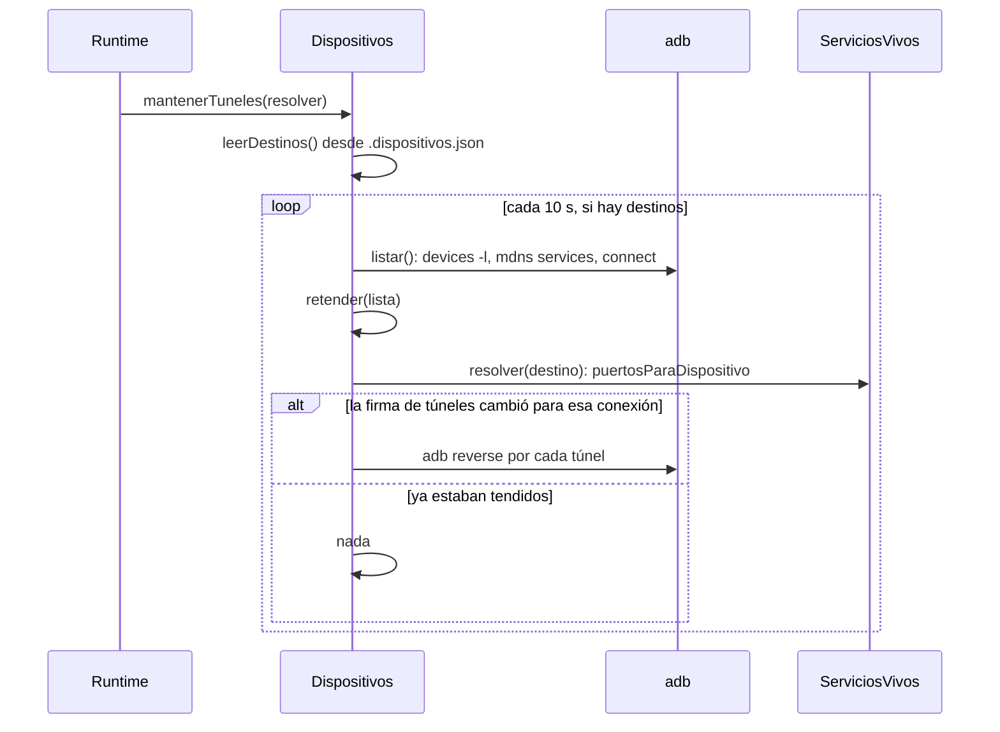

# Build de desarrollo y túneles

> Una build de desarrollo se instala **una vez**; de ahí en más la app baja el
> JavaScript del Metro de la sesión por un túnel de adb. Los túneles son de la
> **conexión**, no del teléfono: cuando la depuración inalámbrica se cae y vuelve,
> se re-tienden solos.

Código: `apps/server/src/dispositivos.ts` (`instalar`, `instalada`, `abrir`,
`mantenerTuneles`, `retender`, `telefonoPara`), el cableado en
`apps/server/src/runtime.ts` y el panel "La app de la sesión"
(`AppEnElTelefono`, `apps/web/src/routes/codigo/Celular.tsx`). Son los pasos 2 y 3
del recorrido de [[App móvil en el teléfono]], después de la
[[Vinculación del teléfono]].

## Por qué túneles y no la IP de la red

La vista previa reescribe las URLs locales de los `.env` para que la app le hable a
los servicios de la sesión, así que el bundle ya viene con la API en
`127.0.0.1:<puerto>` (ver [[Servicios del monorepo]]). En el teléfono,
`127.0.0.1` **es el teléfono**. En vez de abrir puertos a la red local, se le tiende
un `adb reverse` por cada puerto: el 8081 del teléfono al Metro de la sesión y cada
puerto de los servicios del repo al mismo puerto de la máquina. **No se expone
nada a la red.**

## La build de desarrollo

`Dispositivos.instalar(clave, serial, carpeta, tmp)` compila sobre la carpeta de la
app **en el worktree de la sesión** (`Runtime.carpetaDeServicio`) y la instala en
el teléfono elegido. Corre por detrás y devuelve el estado para consultarlo.

1. **Uno a la vez por clave.** La clave es `<repoId>:<servicioId>:<serial>`; si ya
   hay una instalación `instalando` con esa clave, devuelve la misma.
2. **JDK.** `detectarJava`: `JAVA_HOME` si existe; si no,
   `/usr/libexec/java_home -v 17`; si no, el JBR de
   `/Applications/Android Studio.app`. Sin ninguno: "No hay un JDK 17: instalá
   Android Studio o `brew install openjdk@17`".
3. **ABI del teléfono.** `adb shell getprop ro.product.cpu.abi` (si no contesta,
   `arm64-v8a`): se compila sólo esa arquitectura.
4. **Entorno sin credenciales.** `entornoDeComando(process.env, tmp)` —el mismo
   saneo que los comandos de los agentes: sin variables con `KEY`, `TOKEN`,
   `SECRET`, `AUTH`… ni las del orquestador, con `CI=1` y el `tmp` del proyecto—,
   más `JAVA_HOME`, `ANDROID_HOME` y `ANDROID_SDK_ROOT` (la carpeta de dos niveles
   arriba de `adb`), `ANDROID_SERIAL=<serial>` y `NODE_ENV=development`. **Porque
   Gradle corre scripts del repo, y el repo lo pudo haber editado un agente.** Ver
   [[Comandos y sandbox]].
5. **Siempre `expo prebuild`**: `npx expo prebuild --platform android --no-install`
   en la carpeta de la app, exista o no `android/`.
6. **Compilar e instalar**: `./gradlew app:installDebug
   -PreactNativeArchitectures=<abi> --console=plain` en `android/`.
7. Queda `listo` con "✓ Instalada. Abrila desde acá: el JavaScript lo baja del Metro
   de la sesión." o `fallo` con el error.

Cada comando corre con `correrEnVivo`: proceso **en su propio grupo**
(`detached`), salida línea por línea al registro, y un corte de
`CORTE_INSTALAR_MS` (30 min) que mata el **grupo entero**, con los procesos
hijos incluidos.

> [!danger] Por qué `expo prebuild` va siempre, aunque `android/` ya exista
> Antes sólo se hacía si faltaba la carpeta. Un módulo nativo nuevo (expo-camera)
> o un plugin de `app.json` cambian el proyecto nativo, y compilar el `android/`
> viejo instalaba una build que no los traía: la app seguía usando la cámara del
> sistema **sin que nada fallara**. Sin `--clean` es idempotente y rápido (medido:
> 58 de 443 tareas de Gradle al reinstalar con un módulo nuevo). En un proyecto de
> Expo `android/` está en el `.gitignore`, así que queda en la sesión sin ensuciar
> el diff.

### `Instalacion`

| Campo | Qué es |
|---|---|
| `estado` | `instalando` · `listo` · `fallo` |
| `lineas` | el registro, sin líneas vacías; se conservan las últimas `MAX_LINEAS` (2.000) |
| `desde` | cuándo arrancó |

Vive en memoria (`Dispositivos.instalaciones`): un reinicio del servidor la
pierde. El panel pregunta cada 2 s mientras está `instalando` y muestra las
últimas 60 líneas.

### ¿Está instalada?

`instalada(serial, paquete)` corre `pm path --user current <paquete>` y busca
`package:`. El paquete sale de `expo.android.package` del `app.json` de la sesión
(`paqueteDeLaApp`); sin él, el panel dice que la app no declara su paquete.

## Abrir la app

`Dispositivos.abrir(serial, { paquete, metro, puertos, destino })`:

1. **Túneles.** `tunelesPara(metro, puertos)` → `[[8081, metro], [p, p]…]`, y por
   cada uno `adb -s <serial> reverse tcp:<teléfono> tcp:<acá>`. Un túnel que falla
   corta todo con "No se pudo abrir el túnel …".
2. **Anota lo tendido** para esa conexión (`tendidos`, clave `serial#transport_id`).
3. **Recuerda el destino** (`{ repoId, servicioId }`) por la IP del teléfono y lo
   guarda en `.dispositivos.json`.
4. **`am force-stop --user current <paquete>`**: si la app estaba abierta con otro
   Metro, se quedaría con el bundle viejo.
5. **Lanzar**: `monkey -p <paquete> -c android.intent.category.LAUNCHER 1`. Si
   falla o la salida dice `No activities found` o `Error`, "No se pudo abrir …".

### De dónde salen el Metro y los puertos

`ServiciosVivos.puertosParaDispositivo(repoId, servicioId)`
(`apps/server/src/servicios.ts`):

| Valor | Qué es |
|---|---|
| `metro` | el **puerto interno** del servicio móvil (rango 4400-4499), si está `listo`; `null` si no |
| `puertos` | los puertos públicos (4300-4399) de los **otros** servicios del mismo repo que están `listo` |

El 8081 va al Metro **interno**, directo, por detrás del proxy que inyecta el
selector en la vista web (ver [[Vista previa y proxy]]). Con `metro == null`,
abrir contesta "Levantá el servicio primero: el teléfono baja el JavaScript de su
Metro."

### Quién abre

| Desde | Cómo |
|---|---|
| El panel ("Abrir en el teléfono") o la barra del espejo ("Abrir la app") | `POST /api/repos/:repoId/servicios/:servicioId/dispositivo/abrir` |
| Un agente | `reiniciar_app` → `deps.reabrir` (`Runtime.telefonoStorage`), el mismo `abrir` |

Si la app muestra una pantalla roja al abrir, el panel sugiere sacudir el teléfono
y tocar Reload (el menú de desarrollo de React Native).

## Mantener los túneles

> [!danger] Lo que pasaba
> Al bloquearse el teléfono o cortarse el Wi-Fi, adb reconecta —a veces en otro
> puerto, a veces en el mismo— y cada reconexión es una conexión nueva. Los
> túneles de `adb reverse` son de la conexión: la app se quedaba sin Metro ni API
> hasta que alguien apretara "Abrir la app".

Tres decisiones lo resuelven:

- **Se recuerda qué app se abrió en cada teléfono**, por IP, en
  `data/proyectos/.dispositivos.json`: sobrevive a que cambie el puerto y a un
  reinicio del servidor.
- **Los túneles se calculan en el momento**, con los puertos de ahora: el Metro
  cambia de puerto cuando se reinicia el servicio, y un túnel recordado apuntaría a
  un puerto muerto.
- **La clave de la conexión es serial + `transport_id`**. Con el serial solo, una
  reconexión en el **mismo** puerto pasaba inadvertida.



`retender(lista)`, que también corre al final de **cada** `listar()`:

1. Toma los teléfonos en `device` y olvida lo tendido para conexiones que ya no
   existen.
2. Para cada uno, busca el destino por su IP y le pide al `Runtime` los túneles de
   ahora (`tunelesPara(metro, puertos)`, o `null` si el servicio no está levantado).
3. Compara la **firma** (el JSON de los túneles) con la última tendida en esa
   conexión; si difiere —conexión nueva o puerto nuevo—, tiende todos.
4. Si falla, no anota nada: se reintenta en la vuelta siguiente.

La vigilancia (`setInterval` de 10 s, con `unref`) arranca sólo si hay adb, y en
cada vuelta no hace nada si no hay destinos. Corre **con o sin el IDE abierto**
(CLAUDE.md anota «medido: 8 s» para la recuperación). `detenerCapturas`, al
apagar el servidor, la frena.

### `.dispositivos.json`

```json
{
  "192.168.1.37": { "repoId": "rep_…", "servicioId": "mobile" }
}
```

La clave es la IP si el serial es `IP:puerto`; si adb lista el teléfono por su
nombre mDNS o es USB, la clave es el serial tal cual (`ipDe`). Un archivo que no
existe o no se puede leer no es un error: se abre la app de nuevo desde el IDE.

## Qué teléfono usa un agente

`telefonoPara(repoId)` elige, para las herramientas del teléfono:

1. Sin adb: "No hay adb en esta máquina…".
2. Sin teléfonos en `device`: "No hay ningún teléfono conectado. Una persona lo
   vincula por QR desde la pestaña Código → Mobile → Dispositivos."
3. El que tiene **abierta la app de este repo** (el destino por IP).
4. Si hay uno solo conectado, ése.
5. Con varios y ninguno elegido: "Hay varios teléfonos conectados y ninguno tiene
   abierta esta app: que una persona la abra desde la pestaña Mobile."

"Mobile" es el nombre del servicio móvil de INSPIA: los mensajes nombran la
pestaña del servicio.

## Constantes

| Nombre | Valor | Archivo | Por qué |
|---|---|---|---|
| `CORTE_INSTALAR_MS` | 30 min | `dispositivos.ts` | la primera compilación de Gradle tarda minutos |
| `MAX_LINEAS` | 2.000 | `dispositivos.ts` | registro de la instalación acotado |
| vigilancia de túneles | 10 s | `mantenerTuneles` | una reconexión se nota sola, sin el IDE abierto |
| túnel del Metro | 8081 → puerto interno | `tunelesPara` | el puerto que busca el bundle de desarrollo |
| puertos públicos de servicios | 4300-4399 | `apps/server/src/servicios.ts` → `PUERTOS` | los mismos a los dos lados del túnel |
| puertos internos | 4400-4499 | `servicios.ts` → `PUERTOS_INTERNOS` | el Metro de verdad, detrás del proxy |
| refresco del panel mientras instala | 2 s | `Celular.tsx` | — |

## Casos borde

| Síntoma | Causa |
|---|---|
| "Levantá el servicio primero" | el Metro no está `listo`: la app no tiene de dónde bajar el JavaScript |
| La app abre con la versión vieja del JavaScript | estaba abierta con otro Metro; `abrir` hace `force-stop` justamente por eso: volvé a abrir |
| Cambió algo nativo y no se ve | hace falta **reinstalar** la build ("Reinstalar la build de desarrollo"); el Metro sólo trae JavaScript |
| "No hay un JDK 17" | ni `JAVA_HOME`, ni `java_home -v 17`, ni Android Studio |
| La instalación desapareció del panel | el servidor se reinició: el estado vive en memoria |
| "No se pudo abrir el túnel …" | la conexión se cayó en ese momento; la vigilancia lo reintenta |
| Con dos teléfonos, el agente dice que no sabe cuál | ninguno tiene abierta la app de este repo: abrila desde el IDE en el que corresponde |

## Seguridad

- **Nada a la red local**: sólo `adb reverse` (teléfono → máquina).
- **Gradle sin las credenciales del orquestador**: corre scripts de un repo que un
  agente pudo editar.
- **Sin interacción del agente**: instalar es de la persona; un agente sólo puede
  reabrir (`reiniciar_app`).

## Integración

| Qué | Dónde |
|---|---|
| `GET /api/repos/:repoId/servicios/:servicioId/dispositivo?serial=` | `{ paquete, instalada, instalacion }` |
| `POST …/dispositivo/instalar` (`{ serial }`) | arranca la instalación y devuelve su estado |
| `POST …/dispositivo/abrir` (`{ serial }`) | túneles + abrir; devuelve `{ ok, paquete, metro, puertos }` |
| `reiniciar_app` | la herramienta del agente que reabre ([[Depuración de la app móvil]]) |
| Cableado | constructor del `Runtime`: `mantenerTuneles` con `puertosParaDispositivo` |

## Qué fijan los tests

`apps/server/src/dispositivos.test.ts`:

- "abrir tiende el 8081 al Metro y los puertos de los servicios antes de lanzar la app" — `reverse tcp:8081 tcp:<metro>`, `reverse tcp:4300 tcp:4300` y recién después `monkey`.
- "si el teléfono vuelve con otro puerto o el Metro cambia de puerto, los túneles se corrigen solos" — no repite lo ya tendido; re-tiende con otro puerto, con el **mismo** serial y otro `transport_id`, y con el Metro en otro puerto.

## Fuentes

- `apps/server/src/dispositivos.ts` → `Dispositivos.instalar`, `instalada`, `instalacion`, `abrir`, `mantenerTuneles`, `retender`, `tender`, `leerDestinos`, `guardarDestinos`, `telefonoPara`, `tunelesPara`, `correrEnVivo`, `detectarJava`, `paqueteDeLaApp`, `claveDeConexion`, `ipDe`
- `apps/server/src/runtime.ts` → constructor (`mantenerTuneles`), `carpetaDeServicio`, `telefonoStorage` (`reabrir`)
- `apps/server/src/servicios.ts` → `ServiciosVivos.puertosParaDispositivo`, `PUERTOS`, `PUERTOS_INTERNOS`
- `packages/tools/src/codigo/ejecutar.ts` → `entornoDeComando`
- `apps/server/src/rutas-codigo.ts` → rutas `…/dispositivo`, `…/dispositivo/abrir`, `…/dispositivo/instalar`
- `apps/web/src/routes/codigo/Celular.tsx` → `AppEnElTelefono`

## Ver también

- [[Vinculación del teléfono]] — el paso anterior
- [[Espejo del teléfono]] — el paso siguiente
- [[Servicios del monorepo]] — cómo se levanta el Metro
- [[Build de producción Android]] — la otra build, la que se entrega
