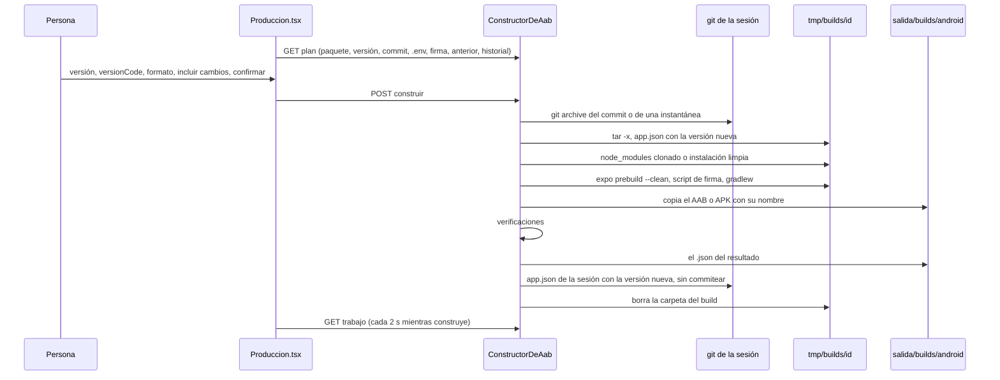

# Build de producción Android

> El AAB para Google Play —o el APK para instalar directo— lo arma **la persona**,
> con un clic, desde una **copia exacta** del código, con el `.env` de producción y
> la firma de siempre, y **se verifica antes de entregarlo**: lo que Play va a mirar
> se mira acá.

Código: `apps/server/src/aab.ts` (`ConstructorDeAab` y las funciones puras),
`Runtime.contextoAab` (`apps/server/src/runtime.ts`) y el modo **Build de
producción** de la vista del servicio móvil
(`apps/web/src/routes/codigo/Produccion.tsx`). El recorrido de punta a punta está en
[[CU-08 Release de la app Android]].

## Por qué existe

Es el procedimiento que el proyecto ya tenía escrito a mano (en INSPIA,
`mobile/BUILD-AAB.md`) hecho de una forma que no se puede hacer mal por cansancio.
Cuatro decisiones (`aab.ts`, comentario de cabecera):

1. **Se construye una copia exacta, no la carpeta viva.** `git archive` del commit
   —o de una instantánea, si la persona elige incluir lo que no commiteó— a una
   carpeta temporal. El build es reproducible (se sabe de qué código salió), un agente
   que edita en la sesión no se cuela a mitad de la compilación, el Metro de la vista
   previa no se entera, y no existe la trampa del **bundle viejo que Gradle da por
   "UP-TO-DATE"**: cada build arranca de cero.
2. **El entorno de producción entra sólo al proceso del build.** El `.env.prod` se
   lee de la carpeta de la persona y se inyecta: no se copia a ningún lado, no se
   guarda en la base y **no pasa por la redirección de URLs de la vista previa** —un
   `127.0.0.1` horneado en un build de producción es una app que no anda en ningún
   teléfono—. Expo no pisa variables que ya están en el entorno, así que ningún
   `.env` gana por accidente.
3. **La firma no pasa por el orquestador.** Gradle lee las credenciales de
   `~/.gradle/gradle.properties` de la persona; si el proyecto trae un script que
   reinyecta la firma después del prebuild (`scripts/apply-signing.mjs` o `.js`: el
   `prebuild --clean` la borra), se corre. Lo que sí se hace es **verificar** el
   resultado: un build firmado con la clave de depuración se rechaza acá y no en Play.
4. **Se verifica lo que Play va a mirar** antes de entregar.

Un agente **no** puede disparar un build: no hay herramienta. Un build de producción
que llega a un teléfono no se deshace.

## AAB o APK

`FormatoAndroid = "aab" | "apk"`. Salen del mismo código, del mismo `.env.prod` y con
la misma firma, y se verifican igual. Dos cosas cambian, y no son de forma:

| | AAB | APK |
|---|---|---|
| Para qué | lo que se sube a Play (Play arma los APK de cada teléfono) | un archivo que se instala en cualquier Android, fuera de la tienda (un cliente, una prueba) |
| Tarea de Gradle | `bundleRelease` | `assembleRelease` |
| Qué sale | `app/build/outputs/bundle/release/app-release.aab` | `app/build/outputs/apk/release/`: `app-release.apk`, o **el universal** si hay splits por ABI |
| Manifiesto | protobuf de aapt2 → `parsearManifiestoProto` | XML binario → `aapt2 dump badging` → `parsearBadging` |
| Certificado | `keytool -printcert -jarfile` → `parsearCertificado` | `apksigner verify --print-certs` → `parsearApksigner` |
| Bundle de JavaScript | `base/assets/index.android.bundle` | `assets/index.android.bundle` |

> [!danger] La firma de un APK moderno no la ve `keytool`
> Un APK se firma con el esquema **v2/v3**, que vive fuera del zip: `keytool -jarfile`
> contesta "no firmado" sobre un APK bien firmado. Por eso va `apksigner`, y
> `parsearApksigner` devuelve la huella en el **formato de keytool** (hex en
> mayúsculas separado por `:`) para poder comparar un APK contra un AAB anterior. Sin
> build-tools que traigan `aapt2` **y** `apksigner`, el APK no se arma: entregarlo sin
> verificar es justo lo que esto evita.

> [!warning] `keytool` en inglés
> Va con `-J-Duser.language=en`: en esta máquina contestaba "Propietario" y el parser
> busca `Owner:`.

## El flujo

### El plan

`ConstructorDeAab.plan(ctx)` —lo que se muestra **antes** de construir, porque un
build que llega a un teléfono no se deshace—:

| Campo | De dónde |
|---|---|
| `paquete` | `expo.android.package` del `app.json` de la sesión (sin él: "no es una app de Expo para Android") |
| `version`, `versionCode` | `expo.version` (default `0.0.0`) y `expo.android.versionCode` (default 1) |
| `sugerida` | la versión siguiente (`siguienteVersion`: `1.0.18` → `1.0.19`; si no es semver, igual) y el `versionCode` mínimo |
| `commit` | sha, asunto y rama del `HEAD` de la sesión |
| `cambiosSinCommitear` | líneas de `git status --porcelain` **en la carpeta de la app** |
| `entorno` | el primero que exista de `.env.prod`, `.env.production`, `.env.produccion` en la carpeta **original** de la app, y **sólo los nombres** de sus variables |
| `firma` | `scripts/apply-signing.mjs` o `.js` si existe, o `null` |
| `anterior` | el build contra el que se compara (abajo) |
| `historial` | los `.json` de `salida/builds/android/`, del más nuevo al más viejo |
| `avisos` | sin `.env` de producción (o el repo no viene de una carpeta local); sin script de firma |

`ContextoAab` lo arma `Runtime.contextoAab`: exige una sesión abierta y un servicio de
tipo `movil`; `origen` es la carpeta de la persona **sólo si el repo vino de una ruta
local** (un repo clonado de una URL no tiene de dónde leer el `.env.prod`); `sdk` es
la carpeta dos niveles arriba de `adb`; `instantanea` es
`RepoStore.instantanea(sesion, repo, "build-aab")` (ver [[Instantáneas y checkpoints]]).

### El build anterior

`anterior` es el último del historial del orquestador; si no hay ninguno, el `.aab`
más nuevo (por fecha de modificación) de `build-artifacts/`, `builds/` o la raíz de la
carpeta de la persona, con su versión leída del manifiesto. De ahí salen **el
`versionCode` mínimo** y **el certificado contra el que se compara**.

### Construir

`construir(clave, ctx, pedido, alTerminar)` con clave `<repoId>:<servicioId>`: **uno a
la vez por app, sea AAB o APK** (los dos escriben la versión en la sesión). Devuelve un
`TrabajoAab` y corre por detrás (`ejecutar`):

1. **Rechazos previos**: sin `.env` de producción; versión que no es `N.N.N`;
   `versionCode` que no supera `max(versionCode del app.json, el del anterior)` —"Play
   rechaza uno que no supere al publicado"—.
2. **Copia exacta**: `git archive --format=tar` del commit (o de la instantánea) sólo
   de la carpeta de la app, desempaquetado en `tmp/builds/<id>`.
3. **Versión**: `subirVersionEnAppJson` cambia `expo.version` y
   `expo.android.versionCode` **sin reformatear** el archivo (un `app.json` reescrito
   entero es un diff de cien líneas para cambiar dos); si el reemplazo puntual no
   alcanza (otra clave `"version"` antes, un campo que no estaba), lo reescribe.
4. **Dependencias**: si el `package-lock.json` es idéntico al de la sesión y la sesión
   tiene `node_modules`, **clon copy-on-write** (`copiarModulos`, `cp -cR`); si no,
   instalación limpia con `--ignore-scripts` (`argvDeInstalacionLimpia`: pnpm, yarn o
   `npm ci` según el lockfile).
5. **Entorno**: `entornoDeComando` (sin credenciales del orquestador) + las variables
   del `.env.prod` + `JAVA_HOME` + `ANDROID_HOME`/`ANDROID_SDK_ROOT` +
   `NODE_ENV=production`, y `SENTRY_DISABLE_AUTO_UPLOAD=true` si el `.env.prod` no trae
   `SENTRY_AUTH_TOKEN` (sin token, la subida de source maps tumba el build). El
   registro nombra el archivo y **sólo los nombres** de las variables.
6. **Proyecto nativo**: `npx expo prebuild --platform android --clean --no-install`;
   después, el script de firma si existe (`node scripts/apply-signing.mjs`).
7. **Gradle**: `./gradlew bundleRelease|assembleRelease --console=plain`, con 45 min de
   corte.
8. **A la salida**: `salida/builds/android/<última parte del paquete>-<versión>-<versionCode>.<aab|apk>`.
9. **Verificaciones** (abajo) y el `.json` del resultado al lado del archivo.
10. **Si todo pasó**, el `app.json` **de la sesión** queda con la versión nueva **sin
    commitear** —el próximo build parte de ahí y no reusa el `versionCode`; la persona
    lo commitea con el release—, y **sólo si nadie lo tocó durante el build** (si
    cambió: "⚠ app.json de la sesión cambió durante el build… subila a mano").
11. **Siempre** se borra la carpeta del build (pesa cerca de un giga).

El estado del trabajo pasa a `listo` si ninguna verificación dio `false`; si alguna
dio `false`, a `fallo` con "Verificación fallida" y "no lo subas a Play" / "no lo
distribuyas". Un error en cualquier paso también es `fallo`, con el mensaje al final
del registro (hasta 3.000 líneas, sin códigos de color).

## Las verificaciones

Cada `Verificacion` tiene `ok: true` (pasa), `false` (**bloquea la entrega**) o `null`
(un aviso para mirar).

| Verificación | Qué mira | `false` cuando |
|---|---|---|
| Paquete y versión | paquete, `versionCode` y `versionName` **adentro** del archivo | no coinciden con lo pedido, o no se pudo leer el manifiesto |
| versionCode mayor que el anterior | contra el `anterior` (sólo si tiene `versionCode`) | no lo supera |
| Firmado con la clave de subida | el certificado | no está firmado, o el propietario es "Android Debug" |
| Mismo certificado que el build anterior | SHA-256 contra el del anterior (sólo si se pudo leer) | cambió: Play rechaza la actualización (o Android no instala el APK encima) |
| Permisos | los `uses-permission` contra `expo.android.blockedPermissions` del `app.json` | aparece uno bloqueado; si no, es `null`: la lista, para revisar contra la ficha de Play |
| Variables de producción adentro del bundle | cada `EXPO_PUBLIC_*` de `.env.prod` con valor aparece **tal cual** en el bundle | falta alguna, o el `.env.prod` no tiene ninguna `EXPO_PUBLIC_*` |
| Nada de desarrollo ni de staging | cada `EXPO_PUBLIC_*` del `.env` de desarrollo (de 8 caracteres o más) que **difiere** del de producción | aparece en el bundle |
| Ninguna URL de la vista previa | `http://127.0.0.1:43`, `http://127.0.0.1:44` (los rangos de la vista previa), `http://localhost:3001`, `http://localhost:5173` | aparece alguna: no anda en ningún teléfono |
| Bundle de JavaScript | que exista el bundle | no está en el archivo |

**Nunca se escriben los valores**: sólo los nombres de las variables (fijado por test).

### Leer el manifiesto de un AAB sin bundletool

`base/manifest/AndroidManifest.xml` de un AAB está en el **protobuf de aapt2**
(`XmlNode`), que `aapt2 dump` no lee dentro de un bundle, y `bundletool` no suele estar
instalado. `camposProto` es un lector mínimo del formato de cable (varint,
delimitados, 32 y 64 bits) y `parsearManifiestoProto` recorre `XmlNode{1: element}`,
`XmlElement{3: name, 4: attribute, 5: child}`, `XmlAttribute{2: name, 3: value}` para
sacar `package`, `versionCode`, `versionName` y los `uses-permission` (y
`uses-permission-sdk-23`), ordenados y sin repetir. Los archivos salen del zip con
`unzip -p`.

## Datos

`ResultadoAab` (el `.json` al lado de cada build):

| Campo | Qué es |
|---|---|
| `formato` | `aab` o `apk` (los builds de antes del APK no lo traen: son AAB) |
| `archivo`, `url` | el nombre y `/api/companies/<id>/exports/builds/android/<archivo>` para descargarlo |
| `bytes`, `sha256` | del archivo entregado |
| `version`, `versionCode` | lo pedido |
| `commit`, `incluyeCambios` | el sha del que salió (o de la instantánea) |
| `certificado` | `{ propietario, sha256 }` o `null` |
| `permisos` | los declarados |
| `verificaciones` | la lista de arriba |
| `fecha` | cuándo terminó |

`TrabajoAab`: `id` (`aab_<hex>`), `estado` (`construyendo`, `listo`, `fallo`), `paso`
(el nombre del paso en curso), `lineas`, `desde`, `resultado`. Vive en memoria; si
alguien borra el archivo de la salida, `trabajo()` lo olvida —mostrar un "listo" con
un enlace a un archivo borrado es peor que no mostrar nada—.

## Borrar builds viejos

`ConstructorDeAab.eliminar(clave, ctx, { archivos } | { conservar })` borra **el
archivo y su `.json`** para que la salida no junte un giga de builds que nadie va a
volver a subir. Por nombre, o conservando los últimos N.

- **El más reciente no se borra nunca**: es el "anterior" del próximo build, de donde
  salen el `versionCode` mínimo y el certificado. Sin él, el próximo build pierde las
  dos verificaciones que evitan un rechazo de Play. Pedirlo por nombre tira un error;
  con `conservar`, se conserva al menos uno (`max(1, n)`).
- **Sólo nombres del historial**: un nombre inventado o una ruta ("No están en el
  historial") no pasan. No es una vía para borrar cualquier archivo.
- **No con un build en curso**: está por compararse contra ese historial.
- Devuelve los borrados, los bytes liberados y cuál quedó protegido.

Los builds **no** se marcan como generados por un agente: un agente no los puede
borrar (ver [[Archivos de salida y permisos de borrado]]).

## La pantalla

`Produccion.tsx`, modo **Build de producción** (no necesita el servicio levantado):

- Encabezado con el paquete, la versión de hoy y el último build.
- Los avisos del plan, en amarillo.
- Selector **AAB / APK**.
- **Versión** y **versionCode**: se llenan una sola vez con la sugerencia; después manda
  lo que escriba la persona. El `versionCode` muestra el mínimo con el motivo ("uno que
  se subió y se descartó queda quemado").
- **Código**: el commit; si hay cambios sin commitear en la app, la opción de
  incluirlos (una instantánea que queda registrada).
- **Entorno** (sólo nombres) y **Firma** ("Las credenciales no pasan por el
  orquestador: las lee Gradle").
- El botón queda deshabilitado sin `.env` de producción, con versión o `versionCode`
  inválidos, o con un build en curso; pide **confirmación** con el resumen.
- Mientras construye, pregunta cada 2 s y muestra el paso y el registro (últimas 400
  líneas). Al terminar, el resultado con cada verificación, el enlace de descarga, el
  sha256 y el commit.
- **Builds anteriores**: formato, versión, commit, fecha, tamaño y descarga; borrar uno
  (deshabilitado en el más reciente) o "Borrar los anteriores" conservando 1, 2, 3, 5
  o 10, siempre con confirmación y el total de MB.

## Constantes

| Nombre | Valor | Archivo | Por qué |
|---|---|---|---|
| `CORTE_MS` | 45 min | `aab.ts` | la compilación de Gradle |
| corte de los demás pasos | 30 min | `correrEnVivo` | prebuild, firma, instalación |
| `MAX_LINEAS` | 3.000 | `aab.ts` | registro del build |
| `ARCHIVOS_PRODUCCION` | `.env.prod`, `.env.production`, `.env.produccion` | `aab.ts` | — |
| `SCRIPTS_DE_FIRMA` | `scripts/apply-signing.mjs`, `.js` | `aab.ts` | — |
| `versionCode` máximo | 2.100.000.000 | `rutas-codigo.ts` | el tope de Play |
| `conservar` | 1-50; `archivos` 1-100 | `rutas-codigo.ts` | — |

## Casos borde

| Síntoma | Causa |
|---|---|
| "El repo no viene de una carpeta local" | el repo se clonó de una URL: no hay `.env.prod` que leer |
| "No hay .env.prod…" | falta el archivo en la carpeta original de la app |
| "El versionCode tiene que ser mayor que N" | Play rechaza uno que no supere al publicado |
| "Está firmado con la clave de DEPURACIÓN" | la firma de release no se aplicó: revisá `~/.gradle/gradle.properties` y el script de firma |
| "Gradle dejó un APK por arquitectura … y ninguno universal" | splits por ABI sin `universalApk` |
| "No hay build-tools con aapt2 y apksigner" | pedís un APK sin build-tools en el SDK |
| "Ya hay un build de producción construyéndose para esta app" | uno a la vez por app |
| La versión nueva no quedó en `app.json` | alguien lo cambió durante el build: subila a mano |
| El trabajo desapareció | reinicio del servidor (el historial en disco sigue) |

> [!warning] Un build que no pasó la verificación también cuenta como "anterior" (deducido del código)
> El `.json` se escribe **siempre**, pase o no, y el historial ordena por fecha. Si el
> último build salió firmado con la clave de depuración, el siguiente —bien firmado—
> se compara contra ese certificado y falla "Mismo certificado que el build
> anterior"; y como es el más reciente, esta pantalla no lo deja borrar. Salida:
> borrar ese archivo **y** su `.json` desde la pestaña Salida. Ningún test lo cubre.

## Integración

| Ruta | Qué hace |
|---|---|
| `GET /api/repos/:repoId/servicios/:servicioId/aab` | `{ plan, trabajo }` (409 con el error y el trabajo si el plan falla) |
| `POST …/aab` (`version`, `versionCode`, `incluirCambios`, `formato`) | arranca el build |
| `GET …/aab/trabajo` | sólo el trabajo |
| `POST …/aab/eliminar` (`{ archivos }` o `{ conservar }`) | borra builds viejos |
| `GET /api/companies/:companyId/exports/builds/android/<archivo>` | la descarga |

## Qué fijan los tests

`apps/server/src/aab.test.ts`:

- "sugiere la versión siguiente"; "sube versión y versionCode sin reformatear app.json" — el `version` de un plugin no se toca y el diff son dos líneas.
- "lee paquete, versión y permisos del manifiesto protobuf de un AAB" — con un codificador de protobuf mínimo.
- "lee el certificado de keytool y reconoce la clave de depuración".
- "un bundle con staging o con URLs de la vista previa no pasa" — y nunca muestra los valores.
- "lee paquete, versión y permisos de aapt2 dump badging"; "lee la firma v2 de apksigner con la huella en el formato de keytool"; "un APK sin firmar no tiene certificado".
- "conservando los últimos N se lleva archivo y registro de los más viejos"; "el más reciente no se borra nunca, ni por nombre ni con conservar=0"; "sólo borra lo que está en el historial".

## Fuentes

- `apps/server/src/aab.ts` → `ConstructorDeAab` (`plan`, `construir`, `ejecutar`, `eliminar`, `trabajo`, `historial`, `anterior`), `siguienteVersion`, `subirVersionEnAppJson`, `parsearManifiestoProto`, `parsearCertificado`, `parsearBadging`, `parsearApksigner`, `verificarBundle`, `apkGenerado`, `buildTools`, `FormatoAndroid`, `PlanDeAab`, `ResultadoAab`, `TrabajoAab`, `ContextoAab`
- `apps/server/src/runtime.ts` → `contextoAab`, `aab`
- `apps/server/src/servicios.ts` → `copiarModulos`, `argvDeInstalacionLimpia`
- `apps/server/src/repos.ts` → `RepoStore.instantanea`
- `apps/server/src/rutas-codigo.ts` → rutas `…/aab*`
- `apps/web/src/routes/codigo/Produccion.tsx` → `Produccion`, `ResultadoDelBuild`

## Ver también

- [[CU-08 Release de la app Android]]
- [[Build de desarrollo y túneles]] — la otra build
- [[Instantáneas y checkpoints]]
- [[Salida de la empresa]]
- [[App móvil en el teléfono]]
